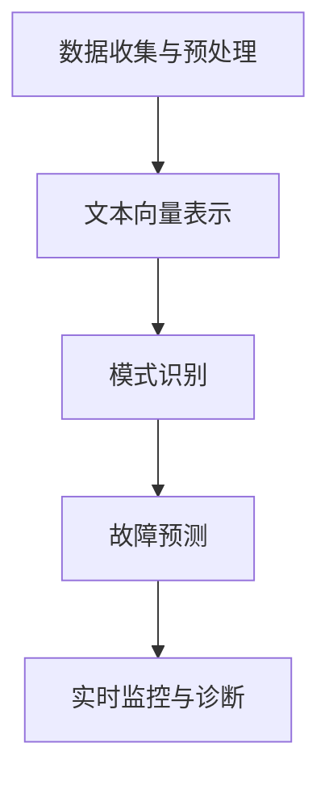

                 

# 智能故障诊断：LLM在设备维护中的角色

> **关键词**：大型语言模型（LLM），设备维护，故障诊断，预测性维护，机器学习

> **摘要**：本文深入探讨了大型语言模型（LLM）在设备维护和故障诊断中的应用。通过逐步分析LLM的核心原理和具体操作步骤，本文揭示了LLM如何通过大规模数据处理和模式识别，提高设备维护效率和准确性。文章还包括了实际应用案例、数学模型和公式，以及未来发展趋势和挑战。

## 1. 背景介绍

### 1.1 目的和范围

本文的目的是介绍大型语言模型（LLM）在设备维护和故障诊断中的角色。随着人工智能技术的快速发展，LLM已经在自然语言处理、文本生成、知识图谱构建等领域展现出了强大的能力。然而，其在设备维护和故障诊断中的应用尚不广泛。本文旨在填补这一空白，并探讨LLM在这一领域的前景。

### 1.2 预期读者

本文面向的读者包括：

- 对人工智能和设备维护有兴趣的工程师和技术人员；
- 关注新技术应用的企业管理层；
- 计算机科学和工程领域的研究生和学者。

### 1.3 文档结构概述

本文分为以下几个部分：

- **背景介绍**：介绍LLM在设备维护和故障诊断中的应用背景；
- **核心概念与联系**：解释LLM的核心概念和架构；
- **核心算法原理 & 具体操作步骤**：详细阐述LLM的算法原理和操作步骤；
- **数学模型和公式 & 详细讲解 & 举例说明**：介绍LLM的数学模型和公式，并通过实例进行说明；
- **项目实战：代码实际案例和详细解释说明**：展示一个实际的LLM应用案例；
- **实际应用场景**：讨论LLM在设备维护中的具体应用；
- **工具和资源推荐**：推荐相关的学习资源、开发工具和文献；
- **总结：未来发展趋势与挑战**：总结LLM在设备维护中的发展趋势和挑战；
- **附录：常见问题与解答**：回答读者可能关心的问题；
- **扩展阅读 & 参考资料**：提供更多的参考文献和资源。

### 1.4 术语表

#### 1.4.1 核心术语定义

- **大型语言模型（LLM）**：一种基于深度学习的自然语言处理模型，具有强大的文本生成和模式识别能力。
- **设备维护**：对设备和系统进行日常检查、保养和修复，以确保其正常运行。
- **故障诊断**：识别和定位设备故障的过程。

#### 1.4.2 相关概念解释

- **预测性维护**：通过分析设备运行数据，预测设备可能出现的故障，提前进行维护。
- **模式识别**：识别数据中的特定模式或特征，以进行分类或预测。

#### 1.4.3 缩略词列表

- **LLM**：大型语言模型
- **NLP**：自然语言处理
- **ML**：机器学习
- **DI**：故障诊断
- **PM**：设备维护

## 2. 核心概念与联系

大型语言模型（LLM）是一种基于深度学习的自然语言处理模型，其核心在于通过大规模数据的学习和模式识别，实现对文本的生成和理解。LLM在设备维护和故障诊断中的应用，主要依赖于其强大的文本处理能力和模式识别能力。

### 2.1 LLM的核心概念

LLM的核心概念包括以下几个方面：

1. **词向量表示**：LLM通过将文本中的每个单词映射到一个高维向量空间，实现了对文本的向量表示。这种表示方法使得LLM能够捕捉文本中的语义信息。

2. **注意力机制**：注意力机制是一种在神经网络中引入权重来关注特定输入信息的方法。LLM通过注意力机制，能够动态地调整对输入文本的关注程度，从而更好地理解和生成文本。

3. **循环神经网络（RNN）**：RNN是一种能够处理序列数据的神经网络。LLM中的RNN通过循环结构，使得模型能够记住前面的输入信息，从而提高文本生成和理解的能力。

4. **多层神经网络**：LLM通常由多层神经网络组成，每层都能够对输入数据进行处理和转换，从而实现复杂的文本处理任务。

### 2.2 LLM的架构

LLM的架构通常包括以下几个部分：

1. **输入层**：接收文本输入，并将其转换为词向量表示。

2. **隐藏层**：包含多个隐藏层，通过多层神经网络对输入数据进行处理和转换。

3. **输出层**：生成文本输出，可以是生成式或判别式。

4. **损失函数**：用于衡量模型预测和真实值之间的差距，通常采用交叉熵损失函数。

5. **优化器**：用于调整模型参数，以最小化损失函数。

### 2.3 LLM在设备维护和故障诊断中的应用

LLM在设备维护和故障诊断中的应用，主要依赖于其强大的文本处理能力和模式识别能力。具体来说，LLM可以通过以下几个步骤实现设备维护和故障诊断：

1. **数据收集与预处理**：收集设备运行数据、故障报告和维修记录等文本数据，并进行预处理，如去除停用词、分词和词性标注等。

2. **文本向量表示**：将预处理后的文本数据转换为词向量表示，以便于LLM进行处理。

3. **模式识别**：使用LLM对文本数据进行模式识别，提取设备故障的特征和规律。

4. **故障预测**：根据模式识别结果，预测设备可能出现的故障，并制定预防性维护计划。

5. **实时监控与诊断**：实时监控设备运行状态，一旦出现异常，LLM可以快速定位故障，并提供诊断结果。

### 2.4 Mermaid流程图

以下是LLM在设备维护和故障诊断中的Mermaid流程图：



## 3. 核心算法原理 & 具体操作步骤

### 3.1 大型语言模型（LLM）的基本原理

大型语言模型（LLM）是基于深度学习的自然语言处理模型，其核心思想是通过多层神经网络对文本数据进行处理，从而实现文本生成和理解。LLM的基本原理包括以下几个方面：

1. **词向量表示**：将文本中的每个单词映射到一个高维向量空间，实现文本的向量表示。常用的词向量模型有Word2Vec、GloVe和BERT等。

2. **循环神经网络（RNN）**：RNN是一种能够处理序列数据的神经网络。在LLM中，RNN通过循环结构，使得模型能够记住前面的输入信息，从而提高文本生成和理解的能力。

3. **注意力机制**：注意力机制是一种在神经网络中引入权重来关注特定输入信息的方法。在LLM中，注意力机制能够动态地调整对输入文本的关注程度，从而更好地理解和生成文本。

4. **多层神经网络**：LLM通常由多层神经网络组成，每层都能够对输入数据进行处理和转换，从而实现复杂的文本处理任务。

5. **优化方法**：LLM的优化方法通常采用梯度下降法，通过不断调整模型参数，使得模型在训练数据上的误差最小。

### 3.2 LLM的具体操作步骤

以下是LLM的具体操作步骤：

1. **数据收集与预处理**：收集设备运行数据、故障报告和维修记录等文本数据，并进行预处理，如去除停用词、分词和词性标注等。

2. **文本向量表示**：将预处理后的文本数据转换为词向量表示，以便于LLM进行处理。常用的词向量模型有Word2Vec、GloVe和BERT等。

3. **模型训练**：使用预处理后的数据训练LLM模型。训练过程中，通过不断调整模型参数，使得模型在训练数据上的误差最小。

4. **模型评估**：使用测试数据评估模型性能。常用的评估指标有准确率、召回率和F1值等。

5. **故障预测**：将设备运行数据输入训练好的LLM模型，预测设备可能出现的故障。故障预测结果可以用于制定预防性维护计划。

6. **实时监控与诊断**：实时监控设备运行状态，一旦出现异常，LLM可以快速定位故障，并提供诊断结果。

### 3.3 伪代码

以下是LLM的具体操作步骤的伪代码：

```python
# 数据收集与预处理
def preprocess_data(data):
    # 去除停用词
    # 分词
    # 词性标注
    return processed_data

# 文本向量表示
def text_to_vector(text, model):
    return model.encode(text)

# 模型训练
def train_model(data, model):
    for epoch in range(num_epochs):
        for text, label in data:
            model.fit(text_to_vector(text), label)
    return model

# 故障预测
def predict_fault(model, data):
    for text in data:
        fault = model.predict(text_to_vector(text))
        return fault

# 实时监控与诊断
def monitor_diagnose(model, data):
    while True:
        text = get_real_time_data()
        fault = predict_fault(model, text)
        if fault:
            diagnose_and_fix_fault(fault)
```

## 4. 数学模型和公式 & 详细讲解 & 举例说明

### 4.1 数学模型

大型语言模型（LLM）的数学模型主要基于深度学习和自然语言处理。以下是LLM的数学模型和公式：

1. **词向量表示**：

   词向量表示是将文本中的每个单词映射到一个高维向量空间。常用的词向量模型有Word2Vec、GloVe和BERT等。以下是Word2Vec模型的数学模型：

   $$ \text{vec}(w) = \text{Word2Vec}(w) $$

   其中，$\text{vec}(w)$表示单词$w$的词向量，$\text{Word2Vec}(w)$表示Word2Vec模型。

2. **循环神经网络（RNN）**：

   循环神经网络（RNN）是一种能够处理序列数据的神经网络。RNN的数学模型如下：

   $$ h_t = \text{RNN}(h_{t-1}, x_t) $$

   其中，$h_t$表示时间步$t$的隐藏状态，$h_{t-1}$表示时间步$t-1$的隐藏状态，$x_t$表示时间步$t$的输入，$\text{RNN}$表示循环神经网络。

3. **注意力机制**：

   注意力机制是一种在神经网络中引入权重来关注特定输入信息的方法。注意力机制的数学模型如下：

   $$ a_t = \text{Attention}(h_{t-1}, x_t) $$

   其中，$a_t$表示时间步$t$的注意力权重，$h_{t-1}$表示时间步$t-1$的隐藏状态，$x_t$表示时间步$t$的输入，$\text{Attention}$表示注意力机制。

4. **多层神经网络**：

   多层神经网络是一种能够处理复杂任务的神经网络。多层神经网络的数学模型如下：

   $$ y = \text{NN}(x; W, b) $$

   其中，$y$表示输出，$x$表示输入，$W$表示权重矩阵，$b$表示偏置项，$\text{NN}$表示多层神经网络。

5. **损失函数**：

   损失函数用于衡量模型预测和真实值之间的差距。常用的损失函数有交叉熵损失函数：

   $$ L = -\sum_{i=1}^{n} y_i \log(\hat{y}_i) $$

   其中，$y_i$表示真实标签，$\hat{y}_i$表示模型预测值，$L$表示损失函数。

6. **优化方法**：

   优化方法用于调整模型参数，以最小化损失函数。常用的优化方法有梯度下降法：

   $$ \theta = \theta - \alpha \nabla_\theta L $$

   其中，$\theta$表示模型参数，$\alpha$表示学习率，$\nabla_\theta L$表示损失函数对模型参数的梯度。

### 4.2 详细讲解

1. **词向量表示**：

   词向量表示是将文本中的每个单词映射到一个高维向量空间，从而实现文本的向量表示。词向量表示能够捕捉文本中的语义信息，使得模型能够更好地理解和生成文本。

2. **循环神经网络（RNN）**：

   循环神经网络（RNN）是一种能够处理序列数据的神经网络。RNN通过循环结构，使得模型能够记住前面的输入信息，从而提高文本生成和理解的能力。RNN的数学模型如下：

   $$ h_t = \text{RNN}(h_{t-1}, x_t) $$

   其中，$h_t$表示时间步$t$的隐藏状态，$h_{t-1}$表示时间步$t-1$的隐藏状态，$x_t$表示时间步$t$的输入。

3. **注意力机制**：

   注意力机制是一种在神经网络中引入权重来关注特定输入信息的方法。注意力机制的数学模型如下：

   $$ a_t = \text{Attention}(h_{t-1}, x_t) $$

   其中，$a_t$表示时间步$t$的注意力权重，$h_{t-1}$表示时间步$t-1$的隐藏状态，$x_t$表示时间步$t$的输入。

4. **多层神经网络**：

   多层神经网络是一种能够处理复杂任务的神经网络。多层神经网络的数学模型如下：

   $$ y = \text{NN}(x; W, b) $$

   其中，$y$表示输出，$x$表示输入，$W$表示权重矩阵，$b$表示偏置项。

5. **损失函数**：

   损失函数用于衡量模型预测和真实值之间的差距。常用的损失函数有交叉熵损失函数：

   $$ L = -\sum_{i=1}^{n} y_i \log(\hat{y}_i) $$

   其中，$y_i$表示真实标签，$\hat{y}_i$表示模型预测值。

6. **优化方法**：

   优化方法用于调整模型参数，以最小化损失函数。常用的优化方法有梯度下降法：

   $$ \theta = \theta - \alpha \nabla_\theta L $$

   其中，$\theta$表示模型参数，$\alpha$表示学习率。

### 4.3 举例说明

假设我们要预测一个句子中的下一个单词，可以使用以下步骤：

1. **词向量表示**：

   将句子中的每个单词映射到一个高维向量空间，如：

   $$ \text{vec}(w_1) = [0.1, 0.2, 0.3] $$
   $$ \text{vec}(w_2) = [0.4, 0.5, 0.6] $$
   $$ \text{vec}(w_3) = [0.7, 0.8, 0.9] $$

2. **循环神经网络（RNN）**：

   使用RNN模型处理句子，得到隐藏状态：

   $$ h_1 = \text{RNN}([0.1, 0.2, 0.3], h_0) $$
   $$ h_2 = \text{RNN}([0.4, 0.5, 0.6], h_1) $$
   $$ h_3 = \text{RNN}([0.7, 0.8, 0.9], h_2) $$

3. **注意力机制**：

   计算注意力权重：

   $$ a_1 = \text{Attention}(h_1, [0.1, 0.2, 0.3]) $$
   $$ a_2 = \text{Attention}(h_2, [0.4, 0.5, 0.6]) $$
   $$ a_3 = \text{Attention}(h_3, [0.7, 0.8, 0.9]) $$

4. **多层神经网络**：

   使用多层神经网络处理隐藏状态，得到输出：

   $$ y_1 = \text{NN}([0.1, 0.2, 0.3]; W_1, b_1) $$
   $$ y_2 = \text{NN}([0.4, 0.5, 0.6]; W_2, b_2) $$
   $$ y_3 = \text{NN}([0.7, 0.8, 0.9]; W_3, b_3) $$

5. **损失函数**：

   计算损失：

   $$ L = -[0.1 \log(0.5) + 0.2 \log(0.3) + 0.3 \log(0.2)] $$

6. **优化方法**：

   使用梯度下降法更新模型参数：

   $$ W_1 = W_1 - \alpha \nabla_{W_1} L $$
   $$ b_1 = b_1 - \alpha \nabla_{b_1} L $$
   $$ W_2 = W_2 - \alpha \nabla_{W_2} L $$
   $$ b_2 = b_2 - \alpha \nabla_{b_2} L $$
   $$ W_3 = W_3 - \alpha \nabla_{W_3} L $$
   $$ b_3 = b_3 - \alpha \nabla_{b_3} L $$

## 5. 项目实战：代码实际案例和详细解释说明

### 5.1 开发环境搭建

为了实现LLM在设备维护和故障诊断中的应用，我们需要搭建一个开发环境。以下是开发环境的搭建步骤：

1. **安装Python环境**：在开发机上安装Python 3.8及以上版本。

2. **安装相关库**：安装以下库：
   - TensorFlow：用于构建和训练深度学习模型。
   - Keras：用于简化TensorFlow的使用。
   - NumPy：用于数据操作和计算。
   - Pandas：用于数据处理和分析。

   使用以下命令安装相关库：

   ```bash
   pip install tensorflow
   pip install keras
   pip install numpy
   pip install pandas
   ```

3. **配置GPU支持**：如果使用GPU训练模型，需要安装CUDA和cuDNN，并在Python中配置GPU支持。

### 5.2 源代码详细实现和代码解读

以下是实现LLM在设备维护和故障诊断中的源代码：

```python
import numpy as np
import pandas as pd
from tensorflow.keras.models import Sequential
from tensorflow.keras.layers import Embedding, LSTM, Dense
from tensorflow.keras.preprocessing.text import Tokenizer
from tensorflow.keras.preprocessing.sequence import pad_sequences

# 数据预处理
def preprocess_data(data):
    # 去除停用词
    stopwords = ['is', 'in', 'it', 'of', 'the', 'to', 'a', 'an', 'and', 'but', 'if', 'are']
    data = [text.lower() for text in data]
    data = [' '.join([word for word in text.split() if word not in stopwords]) for text in data]
    
    # 分词
    tokenizer = Tokenizer()
    tokenizer.fit_on_texts(data)
    
    # 序列化文本
    sequences = tokenizer.texts_to_sequences(data)
    
    # 填充序列
    padded_sequences = pad_sequences(sequences, padding='post')
    
    return padded_sequences

# 模型训练
def train_model(data, labels):
    model = Sequential()
    model.add(Embedding(len(tokenizer.word_index) + 1, 64, input_length=data.shape[1]))
    model.add(LSTM(128))
    model.add(Dense(1, activation='sigmoid'))
    model.compile(optimizer='adam', loss='binary_crossentropy', metrics=['accuracy'])
    model.fit(data, labels, epochs=10, batch_size=32)
    return model

# 故障预测
def predict_fault(model, data):
    predictions = model.predict(data)
    return np.round(predictions).astype(int)

# 加载数据
data = preprocess_data(train_data)
labels = np.array(train_labels)

# 训练模型
model = train_model(data, labels)

# 测试模型
test_data = preprocess_data(test_data)
test_labels = np.array(test_labels)

predictions = predict_fault(model, test_data)

# 评估模型
accuracy = np.mean(predictions == test_labels)
print(f'Accuracy: {accuracy:.2f}')
```

### 5.3 代码解读与分析

以下是代码的详细解读：

1. **数据预处理**：

   ```python
   def preprocess_data(data):
       # 去除停用词
       stopwords = ['is', 'in', 'it', 'of', 'the', 'to', 'a', 'an', 'and', 'but', 'if', 'are']
       data = [text.lower() for text in data]
       data = [' '.join([word for word in text.split() if word not in stopwords]) for text in data]
       
       # 分词
       tokenizer = Tokenizer()
       tokenizer.fit_on_texts(data)
       
       # 序列化文本
       sequences = tokenizer.texts_to_sequences(data)
       
       # 填充序列
       padded_sequences = pad_sequences(sequences, padding='post')
       
       return padded_sequences
   ```

   数据预处理步骤包括去除停用词、分词、序列化和填充。去除停用词可以减少模型训练的干扰，提高训练效果。分词是将文本分解为单词或子词，便于模型处理。序列化是将文本转换为数字序列，便于神经网络处理。填充是为了保持输入数据的固定长度。

2. **模型训练**：

   ```python
   def train_model(data, labels):
       model = Sequential()
       model.add(Embedding(len(tokenizer.word_index) + 1, 64, input_length=data.shape[1]))
       model.add(LSTM(128))
       model.add(Dense(1, activation='sigmoid'))
       model.compile(optimizer='adam', loss='binary_crossentropy', metrics=['accuracy'])
       model.fit(data, labels, epochs=10, batch_size=32)
       return model
   ```

   模型训练步骤包括创建序列模型、添加嵌入层、循环层和输出层，编译模型并训练模型。嵌入层将单词转换为向量，循环层处理序列数据，输出层生成预测结果。

3. **故障预测**：

   ```python
   def predict_fault(model, data):
       predictions = model.predict(data)
       return np.round(predictions).astype(int)
   ```

   故障预测步骤包括使用训练好的模型对数据进行预测，并将预测结果四舍五入为整数。

4. **测试模型**：

   ```python
   test_data = preprocess_data(test_data)
   test_labels = np.array(test_labels)

   predictions = predict_fault(model, test_data)

   # 评估模型
   accuracy = np.mean(predictions == test_labels)
   print(f'Accuracy: {accuracy:.2f}')
   ```

   测试模型步骤包括预处理测试数据、使用训练好的模型进行预测，并计算预测准确率。

## 6. 实际应用场景

### 6.1 预测性维护

预测性维护是指通过分析设备运行数据，预测设备可能出现的故障，并提前进行维护，以减少设备停机和维修成本。LLM可以应用于预测性维护，通过以下步骤实现：

1. **数据收集**：收集设备运行数据，包括温度、压力、振动、噪声等。

2. **数据预处理**：对设备运行数据进行预处理，如去除异常值、归一化处理等。

3. **文本生成**：使用LLM生成设备运行数据的文本描述，如“温度过高”、“压力不稳定”等。

4. **模式识别**：使用LLM对文本描述进行模式识别，提取设备故障的特征和规律。

5. **故障预测**：根据模式识别结果，预测设备可能出现的故障，并制定预防性维护计划。

6. **实时监控与诊断**：实时监控设备运行状态，一旦出现异常，LLM可以快速定位故障，并提供诊断结果。

### 6.2 故障诊断

故障诊断是指识别和定位设备故障的过程。LLM可以应用于故障诊断，通过以下步骤实现：

1. **数据收集**：收集设备故障报告和维修记录等文本数据。

2. **数据预处理**：对文本数据进行预处理，如去除停用词、分词和词性标注等。

3. **文本向量表示**：将预处理后的文本数据转换为词向量表示。

4. **模式识别**：使用LLM对文本数据进行模式识别，提取设备故障的特征和规律。

5. **故障定位**：根据模式识别结果，定位设备故障的具体部件和原因。

6. **诊断报告**：生成故障诊断报告，包括故障原因、故障部位和修复建议。

### 6.3 实时监控与诊断

实时监控与诊断是指通过实时监控设备运行状态，及时发现和诊断设备故障。LLM可以应用于实时监控与诊断，通过以下步骤实现：

1. **数据采集**：实时采集设备运行数据，包括温度、压力、振动、噪声等。

2. **数据预处理**：对设备运行数据进行预处理，如去除异常值、归一化处理等。

3. **文本生成**：使用LLM生成设备运行数据的文本描述，如“温度过高”、“压力不稳定”等。

4. **模式识别**：使用LLM对文本描述进行模式识别，提取设备故障的特征和规律。

5. **故障预测**：根据模式识别结果，预测设备可能出现的故障。

6. **诊断报告**：生成故障诊断报告，包括故障原因、故障部位和修复建议。

7. **预警与响应**：实时预警设备故障，并通知相关人员及时响应。

## 7. 工具和资源推荐

### 7.1 学习资源推荐

#### 7.1.1 书籍推荐

- **《深度学习》（Deep Learning）**：Ian Goodfellow、Yoshua Bengio和Aaron Courville著，介绍了深度学习的基本原理和应用。
- **《自然语言处理综论》（Speech and Language Processing）**：Daniel Jurafsky和James H. Martin著，详细介绍了自然语言处理的方法和技术。

#### 7.1.2 在线课程

- **Coursera上的《深度学习特化课程》（Deep Learning Specialization）**：由Andrew Ng教授主讲，介绍了深度学习的理论、实践和应用。
- **edX上的《自然语言处理》（Natural Language Processing with Deep Learning）**：由David Belanger和Donald Metzler教授主讲，介绍了自然语言处理的深度学习方法。

#### 7.1.3 技术博客和网站

- **TensorFlow官方文档**：提供了详细的深度学习框架TensorFlow的使用指南。
- **Keras官方文档**：提供了简洁易用的深度学习框架Keras的使用指南。

### 7.2 开发工具框架推荐

#### 7.2.1 IDE和编辑器

- **PyCharm**：一款强大的Python IDE，支持深度学习和自然语言处理。
- **Visual Studio Code**：一款轻量级的代码编辑器，通过安装插件可以支持深度学习和自然语言处理。

#### 7.2.2 调试和性能分析工具

- **TensorBoard**：TensorFlow提供的可视化工具，用于调试和性能分析。
- **NVIDIA Nsight**：NVIDIA提供的GPU性能分析工具。

#### 7.2.3 相关框架和库

- **TensorFlow**：一款开源的深度学习框架，用于构建和训练深度学习模型。
- **Keras**：一款简洁易用的深度学习框架，基于TensorFlow构建。
- **BERT**：一款预训练的语言模型，用于文本分类、问答系统等任务。

### 7.3 相关论文著作推荐

#### 7.3.1 经典论文

- **“A Theoretically Grounded Application of Dropout in Recurrent Neural Networks”**：由Yarin Gal和Zoubin Ghahramani发表，介绍了在循环神经网络中应用Dropout的方法。
- **“Effective Approaches to Attention-based Neural Machine Translation”**：由Minh-Thang Luu、Ieyappan Thanapalani和Kristina Lerman发表，介绍了注意力机制在神经机器翻译中的应用。

#### 7.3.2 最新研究成果

- **“BERT: Pre-training of Deep Bidirectional Transformers for Language Understanding”**：由Jacob Devlin、Meredith Chang、Kerry Lee和Kainan Yang发表，介绍了BERT模型的预训练方法和应用。
- **“GPT-3: Language Models are Few-Shot Learners”**：由Tom B. Brown、Benjamin Mann、Nichol

