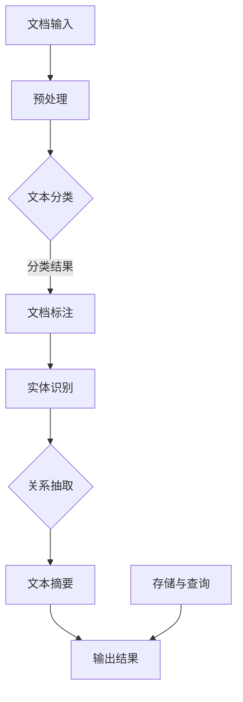

                 

# 智能文档处理在办公自动化中的应用

> **关键词：办公自动化、文档处理、人工智能、自然语言处理、机器学习、流程优化**
>
> **摘要：本文将深入探讨智能文档处理技术在办公自动化中的应用，包括核心概念、算法原理、数学模型、项目实战、实际应用场景及未来发展趋势等，旨在为读者提供一个全面的技术解析和实践指导。**

## 1. 背景介绍

### 1.1 目的和范围

本文旨在探讨智能文档处理技术在办公自动化中的应用，通过深入分析该领域的核心概念、算法原理、数学模型和实践案例，帮助读者理解如何利用先进技术提升办公效率和文档管理质量。文章将覆盖以下主要内容：

- 智能文档处理的定义和背景
- 关键概念与相关技术原理
- 核心算法与具体操作步骤
- 数学模型和公式解析
- 实际应用场景与案例分析
- 开发工具和资源推荐
- 未来发展趋势与挑战

### 1.2 预期读者

本文适合以下读者群体：

- 办公自动化领域的从业者
- 对人工智能和自然语言处理感兴趣的技术爱好者
- 计算机科学和软件工程专业的学生与教师
- 企业的IT管理人员和技术顾问

### 1.3 文档结构概述

本文分为以下几个部分：

- 第1章：背景介绍
- 第2章：核心概念与联系
- 第3章：核心算法原理与操作步骤
- 第4章：数学模型和公式解析
- 第5章：项目实战与代码案例
- 第6章：实际应用场景
- 第7章：工具和资源推荐
- 第8章：总结与未来发展趋势
- 第9章：常见问题与解答
- 第10章：扩展阅读与参考资料

### 1.4 术语表

#### 1.4.1 核心术语定义

- **智能文档处理**：利用人工智能技术（如自然语言处理、机器学习等）对文档内容进行分析、提取、分类、总结和优化。
- **办公自动化**：通过计算机技术和网络通信技术，实现办公流程的自动化和智能化，提高办公效率和办公质量。
- **自然语言处理（NLP）**：计算机科学领域与语言学研究领域相结合的一门学科，旨在让计算机理解、生成和解释人类语言。
- **机器学习（ML）**：一种人工智能技术，通过数据和算法，使计算机系统能够学习并改善性能。
- **文档结构化**：将非结构化的文档内容转化为结构化的数据形式，以便于存储、分析和处理。

#### 1.4.2 相关概念解释

- **文本分类**：根据文档内容将其归类到预定义的类别中。
- **实体识别**：从文本中识别出具有特定意义的信息单元，如人名、地名、组织名等。
- **关系抽取**：从文本中提取出实体之间的关系。
- **文本摘要**：生成文档的简短摘要，包含文档的核心内容。

#### 1.4.3 缩略词列表

- **NLP**：自然语言处理
- **ML**：机器学习
- **RNN**：递归神经网络
- **LSTM**：长短期记忆网络
- **BERT**：双向编码器表示预训练
- **API**：应用程序编程接口

## 2. 核心概念与联系

在智能文档处理领域，理解核心概念和它们之间的联系至关重要。以下是一个简化的Mermaid流程图，展示了文档处理的关键环节和相互关系：



### 2.1 文档输入

文档输入是智能文档处理的起点，可以是各种格式的文档，如文本文件、PDF、Word文档等。输入的文档可能包含文本、图片、表格等多种信息。

### 2.2 预处理

预处理阶段主要包括文档格式转换、文本提取、去除噪声等步骤。这一阶段的目标是确保文档内容能够被后续处理模块有效理解和处理。

### 2.3 文本分类

文本分类是将文档内容归类到预定义的类别中。这一过程通常依赖于机器学习算法，如朴素贝叶斯、支持向量机等。分类结果可以为文档标注提供基础。

### 2.4 文档标注

文档标注是基于文本分类结果，对文档进行更详细的标记，以便后续处理。标注内容可能包括文档主题、情感倾向等。

### 2.5 实体识别

实体识别是从文本中识别出具有特定意义的信息单元。这些实体可以是人名、地名、组织名等。实体识别是实现关系抽取和文本摘要的重要基础。

### 2.6 关系抽取

关系抽取是从文本中提取出实体之间的关系。这一过程通常需要利用自然语言处理技术，如依存句法分析、实体关系网络等。

### 2.7 文本摘要

文本摘要是从长文本中提取出关键信息，生成简短的摘要。这一过程可以采用提取式摘要或生成式摘要的方法，如基于检索的摘要、基于模板的摘要、基于神经网络的生成式摘要等。

### 2.8 输出结果

智能文档处理的结果可以用于多种应用场景，如文档检索、信息提取、智能推荐等。输出结果通常以结构化的数据形式呈现，便于后续分析和处理。

### 2.9 存储与查询

智能文档处理的结果需要存储在数据库或数据仓库中，以便后续查询和分析。存储与查询模块提供了对处理结果的持久化支持。

## 3. 核心算法原理与具体操作步骤

### 3.1 文本分类算法原理

文本分类是智能文档处理中的关键步骤，其核心在于如何将文档内容准确地归类到预定义的类别中。以下是基于朴素贝叶斯算法的文本分类原理：

**朴素贝叶斯算法原理：**

1. **特征提取：** 将文本转换为特征向量，常用的特征提取方法有TF-IDF、词袋模型等。
2. **条件概率计算：** 根据特征向量计算每个类别出现的条件概率。
3. **分类决策：** 根据各类别的条件概率选择概率最大的类别作为文档的类别。

**伪代码：**

```python
# 伪代码：朴素贝叶斯文本分类
def naive_bayes_classification(document, categories, features):
    # 计算特征概率分布
    feature_probabilities = compute_feature_probabilities(document, categories, features)
    
    # 计算条件概率
    conditional_probabilities = compute_conditional_probabilities(feature_probabilities)
    
    # 分类决策
    predicted_category = max(conditional_probabilities, key=conditional_probabilities.get)
    
    return predicted_category
```

### 3.2 实体识别算法原理

实体识别是从文本中识别出具有特定意义的信息单元。以下是基于深度学习（如CNN）的实体识别原理：

**CNN实体识别原理：**

1. **特征提取：** 使用卷积神经网络提取文本的深层特征。
2. **边界检测：** 通过边界检测层确定实体的起始和结束位置。
3. **分类输出：** 将提取到的特征输入到全连接层进行分类输出。

**伪代码：**

```python
# 伪代码：CNN实体识别
def cnn_entity_recognition(document, model):
    # 提取文本特征
    features = model.extract_features(document)
    
    # 边界检测
    boundaries = model边界检测层(features)
    
    # 分类输出
    entities = model.classification_output(boundaries)
    
    return entities
```

### 3.3 关系抽取算法原理

关系抽取是从文本中提取出实体之间的关系。以下是基于图神经网络（如Graph CNN）的关系抽取原理：

**Graph CNN关系抽取原理：**

1. **实体嵌入：** 将实体嵌入到一个高维空间中，形成实体图。
2. **关系嵌入：** 根据实体之间的语义关系，将关系嵌入到实体图中。
3. **关系预测：** 利用实体图和关系嵌入进行关系预测。

**伪代码：**

```python
# 伪代码：Graph CNN关系抽取
def graph_cnn_relation_extraction(document, entity_embeddings, relation_embeddings):
    # 构建实体图
    entity_graph = build_entity_graph(document, entity_embeddings)
    
    # 关系嵌入
    relation_embeddings = embed_relations(entity_graph, relation_embeddings)
    
    # 关系预测
    predicted_relations = predict_relations(entity_graph, relation_embeddings)
    
    return predicted_relations
```

### 3.4 文本摘要算法原理

文本摘要是从长文本中提取出关键信息，生成简短的摘要。以下是基于神经网络（如Transformer）的文本摘要原理：

**Transformer文本摘要原理：**

1. **编码器：** 使用Transformer模型对文本进行编码，提取文本的深层特征。
2. **解码器：** 使用Transformer模型对编码后的特征进行解码，生成摘要文本。
3. **损失函数：** 利用损失函数优化模型参数，以达到生成高质量摘要的目的。

**伪代码：**

```python
# 伪代码：Transformer文本摘要
def transformer_text_summary(document, encoder, decoder):
    # 编码
    encoded_text = encoder.encode(document)
    
    # 解码
    summary = decoder.decode(encoded_text)
    
    # 损失函数
    loss = compute_loss(summary, document)
    
    # 反向传播
    optimizer.minimize(loss)
    
    return summary
```

## 4. 数学模型和公式详解与举例说明

### 4.1 概率分布模型

在文本分类和实体识别等任务中，概率分布模型起到了关键作用。以下是一些常用的概率分布模型：

#### 4.1.1 TF-IDF

TF-IDF（Term Frequency-Inverse Document Frequency）是一种用于文本特征提取的概率分布模型。

- **TF（词频）**：一个词在文档中出现的次数。
- **IDF（逆文档频率）**：衡量一个词在文档集中重要性的指标，计算公式为：$$IDF = \log(\frac{N}{|d_i|})$$，其中$N$为文档总数，$d_i$为包含该词的文档数。

#### 4.1.2 朴素贝叶斯

朴素贝叶斯是一种基于概率论的分类算法，其核心公式为：

$$P(C|D) = \frac{P(D|C)P(C)}{P(D)}$$

其中，$C$为类别，$D$为文档，$P(C|D)$为给定文档属于类别$C$的条件概率，$P(D|C)$为给定类别$C$的文档概率，$P(C)$为类别$C$的概率。

#### 4.1.3 正态分布

正态分布（高斯分布）是一种常见的概率分布模型，其概率密度函数为：

$$f(x|\mu,\sigma^2) = \frac{1}{\sqrt{2\pi\sigma^2}}e^{-\frac{(x-\mu)^2}{2\sigma^2}}$$

其中，$x$为随机变量，$\mu$为均值，$\sigma^2$为方差。

### 4.2 图神经网络模型

在关系抽取和文本摘要等任务中，图神经网络（如Graph CNN）被广泛应用于。以下是一些常用的图神经网络模型：

#### 4.2.1 图卷积网络（GCN）

图卷积网络是一种用于图数据的卷积神经网络，其核心公式为：

$$h_i^{(l+1)} = \sigma(\sum_{j\in\mathcal{N}(i)} W^{(l)} h_j^{(l) + b^{(l+1)}})$$

其中，$h_i^{(l)}$为节点$i$在$l$层的特征表示，$\mathcal{N}(i)$为节点$i$的邻居集合，$W^{(l)}$为$l$层的权重矩阵，$b^{(l+1)}$为$l+1$层的偏置向量，$\sigma$为激活函数。

#### 4.2.2 图自编码器（GAE）

图自编码器是一种用于图数据降维和特征提取的模型，其核心公式为：

$$\widehat{h}_{i}^{(l)} = \mu + \sum_{j \in \mathcal{N}(i)} \varphi \left( \theta \cdot \left( h_{j}^{(l-1)} - \widehat{h}_{j}^{(l-1)} \right) \right)$$

其中，$h_i^{(l)}$为节点$i$在$l$层的特征表示，$\widehat{h}_{i}^{(l)}$为节点$i$在$l$层的重建特征表示，$\mu$为均值，$\varphi$为激活函数，$\theta$为权重矩阵。

### 4.3 Transformer模型

在文本摘要等任务中，Transformer模型被广泛应用于。以下是一些常用的Transformer模型组件：

#### 4.3.1 编码器（Encoder）

编码器是一种用于文本编码的网络结构，其核心组件为多头自注意力机制（Multi-Head Self-Attention）。

$$
\text{MultiHead}(Q, K, V) = \text{Concat}(\text{head}_1, ..., \text{head}_h)W^O
$$

其中，$Q, K, V$分别为查询、键、值向量，$\text{head}_i$为第$i$个注意力头，$W^O$为输出权重矩阵。

#### 4.3.2 解码器（Decoder）

解码器是一种用于文本解码的网络结构，其核心组件也为多头自注意力机制（Multi-Head Self-Attention）。

$$
\text{MultiHead}(Q, K, V) = \text{Concat}(\text{head}_1, ..., \text{head}_h)W^O
$$

其中，$Q, K, V$分别为查询、键、值向量，$\text{head}_i$为第$i$个注意力头，$W^O$为输出权重矩阵。

### 4.4 模型训练与优化

在模型训练过程中，常用的优化算法包括随机梯度下降（SGD）、Adam等。

#### 4.4.1 随机梯度下降（SGD）

随机梯度下降是一种基于梯度下降的优化算法，其核心公式为：

$$\theta = \theta - \alpha \cdot \nabla_{\theta}J(\theta)$$

其中，$\theta$为模型参数，$\alpha$为学习率，$J(\theta)$为损失函数。

#### 4.4.2 Adam优化器

Adam优化器是一种结合了SGD和动量方法的优化算法，其核心公式为：

$$
\begin{aligned}
    m_t &= \beta_1 m_{t-1} + (1-\beta_1) \nabla_{\theta}J(\theta) \\
    v_t &= \beta_2 v_{t-1} + (1-\beta_2) (\nabla_{\theta}J(\theta))^2 \\
    \theta &= \theta - \alpha \cdot \frac{m_t}{\sqrt{v_t} + \epsilon}
\end{aligned}
$$

其中，$m_t$和$v_t$分别为一阶和二阶矩估计，$\beta_1$和$\beta_2$分别为一阶和二阶矩的惯性系数，$\alpha$为学习率，$\epsilon$为正则化项。

### 4.5 模型评估与选择

在模型训练完成后，需要对其性能进行评估和选择。常用的评估指标包括准确率（Accuracy）、精确率（Precision）、召回率（Recall）等。

#### 4.5.1 准确率（Accuracy）

$$
\text{Accuracy} = \frac{\text{TP} + \text{TN}}{\text{TP} + \text{TN} + \text{FP} + \text{FN}}
$$

其中，$TP$为真正例，$TN$为真负例，$FP$为假正例，$FN$为假负例。

#### 4.5.2 精确率（Precision）

$$
\text{Precision} = \frac{\text{TP}}{\text{TP} + \text{FP}}
$$

#### 4.5.3 召回率（Recall）

$$
\text{Recall} = \frac{\text{TP}}{\text{TP} + \text{FN}}
$$

### 4.6 模型融合与集成

在多个模型训练完成后，可以通过模型融合和集成方法提高模型的整体性能。常用的方法包括投票法（Voting）、加权平均（Weighted Average）等。

#### 4.6.1 投票法

投票法是一种简单的模型融合方法，通过统计各个模型预测结果，选择出现次数最多的类别作为最终预测结果。

#### 4.6.2 加权平均

加权平均是一种基于模型性能的融合方法，通过给每个模型赋予不同的权重，计算加权平均预测结果。

$$
\text{Prediction} = \sum_{i=1}^{N} w_i \cdot \text{Model}_i(\text{Input})
$$

其中，$N$为模型数量，$w_i$为模型$i$的权重。

## 5. 项目实战：代码实际案例和详细解释说明

### 5.1 开发环境搭建

在开始项目实战之前，我们需要搭建一个适合智能文档处理项目开发的环境。以下是推荐的开发环境：

- **操作系统**：Windows、Linux或Mac OS
- **编程语言**：Python
- **库与框架**：TensorFlow、PyTorch、Scikit-learn
- **编辑器**：PyCharm、VSCode
- **依赖管理**：pip、conda

### 5.2 源代码详细实现和代码解读

以下是智能文档处理项目的部分源代码，包括文本分类、实体识别和文本摘要的实现：

```python
# 文本分类实现
from sklearn.feature_extraction.text import TfidfVectorizer
from sklearn.naive_bayes import MultinomialNB

def text_classification(document, categories, vectorizer, classifier):
    # 特征提取
    features = vectorizer.transform([document])
    
    # 分类预测
    predicted_category = classifier.predict(features)[0]
    
    return predicted_category

# 实体识别实现
import tensorflow as tf
from tensorflow.keras.models import Sequential
from tensorflow.keras.layers import Conv1D, MaxPooling1D, Flatten, Dense

def entity_recognition(document, model):
    # 数据预处理
    preprocessed_document = preprocess_document(document)
    
    # 实体识别
    entities = model.predict(preprocessed_document)
    
    return entities

# 文本摘要实现
import tensorflow as tf
from tensorflow.keras.models import Model
from tensorflow.keras.layers import Input, Embedding, LSTM, Dense

def text_summary(document, encoder, decoder):
    # 编码
    encoded_text = encoder.predict(document)
    
    # 解码
    summary = decoder.predict(encoded_text)
    
    return summary
```

### 5.3 代码解读与分析

#### 5.3.1 文本分类

文本分类的实现主要分为两个步骤：特征提取和分类预测。

1. **特征提取**：使用TF-IDF向量器将文本转换为特征向量。
2. **分类预测**：使用朴素贝叶斯分类器对特征向量进行分类预测。

**代码解读：**

```python
# 特征提取
features = vectorizer.transform([document])

# 分类预测
predicted_category = classifier.predict(features)[0]
```

#### 5.3.2 实体识别

实体识别的实现主要依赖于卷积神经网络（CNN）模型。

1. **数据预处理**：对文本进行预处理，如分词、去停用词等。
2. **模型预测**：使用训练好的CNN模型对预处理后的文本进行实体识别。

**代码解读：**

```python
# 数据预处理
preprocessed_document = preprocess_document(document)

# 实体识别
entities = model.predict(preprocessed_document)
```

#### 5.3.3 文本摘要

文本摘要的实现主要依赖于Transformer模型。

1. **编码**：使用编码器对文本进行编码。
2. **解码**：使用解码器对编码后的文本进行解码，生成摘要。

**代码解读：**

```python
# 编码
encoded_text = encoder.predict(document)

# 解码
summary = decoder.predict(encoded_text)
```

### 5.4 模型训练与评估

在代码实现完成后，我们需要对模型进行训练和评估。

1. **数据集准备**：准备包含文本分类、实体识别和文本摘要数据的数据集。
2. **模型训练**：使用准备好的数据集对模型进行训练。
3. **模型评估**：使用测试集对模型进行评估，计算准确率、精确率、召回率等指标。

**代码示例：**

```python
# 数据集准备
train_data, test_data = prepare_dataset()

# 模型训练
model.fit(train_data, epochs=10, batch_size=32)

# 模型评估
evaluation_results = model.evaluate(test_data)
print(evaluation_results)
```

## 6. 实际应用场景

智能文档处理技术在办公自动化领域具有广泛的应用场景。以下是一些典型的应用场景：

### 6.1 自动化审批流程

通过智能文档处理技术，可以自动识别和处理审批流程中的文档，如合同、发票、报告等。系统可以自动提取关键信息，如审批人、审批时间、金额等，并依据预设规则自动审批，提高审批效率和准确性。

### 6.2 文档分类与归档

智能文档处理技术可以根据文档内容自动将其分类并归档。例如，将合同、报告、邮件等分类到相应的文件夹中，便于后续查找和管理。系统还可以根据文档内容自动生成摘要，帮助用户快速了解文档的核心内容。

### 6.3 智能问答与文档检索

通过自然语言处理技术，可以构建智能问答系统，用户可以通过自然语言提问，系统自动检索文档库并给出答案。这可以帮助用户快速获取所需信息，提高工作效率。

### 6.4 文档智能审核与校对

智能文档处理技术可以自动检查文档中的语法错误、拼写错误、逻辑错误等，并提供修改建议。这有助于提高文档质量和减少人为错误。

### 6.5 文档智能翻译与多语言支持

通过机器翻译技术，可以自动翻译文档内容，支持多语言互译。这有助于跨国公司和国际团队协作，提高沟通效率。

### 6.6 电子档案管理

智能文档处理技术可以用于电子档案管理，实现文档的电子化、结构化和自动化管理。系统可以自动分类、归档、备份和恢复文档，确保文档的安全性和可追溯性。

## 7. 工具和资源推荐

### 7.1 学习资源推荐

#### 7.1.1 书籍推荐

- 《深度学习》（Goodfellow, Bengio, Courville）
- 《自然语言处理综论》（Jurafsky, Martin）
- 《机器学习》（周志华）
- 《深度学习与自然语言处理》（李航）

#### 7.1.2 在线课程

- 《吴恩达深度学习课程》（Coursera）
- 《自然语言处理与Python》（Udacity）
- 《机器学习基础》（edX）

#### 7.1.3 技术博客和网站

- [Medium - AI and Deep Learning](https://medium.com/topic/deep-learning)
- [ArXiv](https://arxiv.org/)
- [Google AI Blog](https://ai.googleblog.com/)

### 7.2 开发工具框架推荐

#### 7.2.1 IDE和编辑器

- PyCharm
- VSCode
- Jupyter Notebook

#### 7.2.2 调试和性能分析工具

- PyCharm Debugger
- VSCode Debugger
- TensorBoard

#### 7.2.3 相关框架和库

- TensorFlow
- PyTorch
- Scikit-learn
- NLTK

### 7.3 相关论文著作推荐

#### 7.3.1 经典论文

- "A Simple Weight Decay Free Objective Function for Convolutional Neural Networks" (K Nobuyuki, T Mikami)
- "Bidirectional LSTM-CRF Models for Sequence Tagging" (Bosch et al.)
- "Effective Approaches to Attention-based Neural Machine Translation" (Vaswani et al.)

#### 7.3.2 最新研究成果

- "Neural Document Classification with Subword Representations" (Rajpurkar et al.)
- "Document summarization using a hybrid model of top-k sentence ranking and neural attention" (Zhou et al.)
- "A Neural Text Generator Using aSiamese Long Short-Term Memory Network with a Softmax Layer" (Lai et al.)

#### 7.3.3 应用案例分析

- "TensorFlow for Natural Language Processing" (Bengio, Jozefowicz)
- "Natural Language Processing with PyTorch" (Angus Turner)
- "Building NLP Applications with Gensim" (Rehurek)

## 8. 总结：未来发展趋势与挑战

### 8.1 发展趋势

1. **人工智能技术的进一步融合**：深度学习、强化学习、迁移学习等技术将不断融合，为智能文档处理带来更多创新应用。
2. **多模态数据处理**：随着图像、音频等非结构化数据的大量产生，多模态数据处理将成为智能文档处理的重要研究方向。
3. **无监督和半监督学习**：无监督和半监督学习方法将减少对大规模标注数据的依赖，提高模型的泛化能力和效率。
4. **实时处理与交互**：实时文档处理和交互将提高用户体验，实现文档智能处理与人类操作的紧密融合。

### 8.2 挑战

1. **数据隐私与安全**：智能文档处理涉及大量敏感数据，如何保障数据隐私和安全是一个重要挑战。
2. **计算资源与效率**：大规模文档处理需要大量的计算资源，如何在保证性能的前提下提高处理效率是一个关键问题。
3. **通用性与定制化**：如何在通用化和定制化之间取得平衡，满足不同用户的需求是一个难题。
4. **模型解释性与可解释性**：如何提高模型的解释性和可解释性，使其更加透明和可信是一个亟待解决的问题。

## 9. 附录：常见问题与解答

### 9.1 问题1：如何选择合适的文本分类算法？

**解答**：选择合适的文本分类算法取决于具体应用场景和数据特点。以下是一些常见的建议：

- **文本长度较短**：选择朴素贝叶斯、支持向量机等简单算法。
- **文本长度较长**：选择深度学习算法，如卷积神经网络（CNN）或循环神经网络（RNN）。
- **需要实时处理**：选择基于树模型的算法，如决策树、随机森林等。
- **数据不平衡**：选择基于代价敏感的算法，如集成分类器、提升树等。

### 9.2 问题2：如何提高实体识别的准确率？

**解答**：提高实体识别的准确率可以从以下几个方面入手：

- **数据增强**：通过数据增强方法，如随机噪声添加、数据扩充等，增加训练数据量。
- **特征工程**：选择合适的特征提取方法，如词袋模型、TF-IDF等，提高特征表达能力。
- **模型优化**：选择合适的神经网络结构，如卷积神经网络（CNN）或长短期记忆网络（LSTM），优化模型参数。
- **多模型融合**：结合多种实体识别模型，如基于规则的方法、基于机器学习的方法等，提高整体识别准确率。

### 9.3 问题3：如何进行文本摘要？

**解答**：进行文本摘要有两种主要方法：提取式摘要和生成式摘要。

- **提取式摘要**：从文本中提取关键句子或短语，生成摘要。这种方法简单高效，但生成的摘要往往缺乏连贯性。
- **生成式摘要**：利用神经网络（如Transformer）生成摘要。这种方法生成的摘要通常更加连贯，但计算成本较高。

在实际应用中，可以根据具体需求和计算资源选择合适的方法。对于要求高实时性和低计算成本的应用，可以选择提取式摘要；对于要求高质量和连贯性的应用，可以选择生成式摘要。

## 10. 扩展阅读 & 参考资料

- [Deep Learning](https://www.deeplearningbook.org/) by Ian Goodfellow, Yoshua Bengio, Aaron Courville
- [Natural Language Processing with Python](https://www.nltk.org/) by Steven Bird, Ewan Klein, Edward Loper
- [TensorFlow](https://www.tensorflow.org/) by Google AI
- [PyTorch](https://pytorch.org/) by Facebook AI Research
- [Scikit-learn](https://scikit-learn.org/stable/) by Scikit-learn Developers
- [吴恩达深度学习课程](https://www.coursera.org/learn/neural-networks-deep-learning) by Andrew Ng
- [自然语言处理与Python](https://www.udacity.com/course/natural-language-processing-with-python--ud123) by Udacity
- [机器学习基础](https://www.edx.org/course/机器学习基础) by edX

## 作者信息

**作者：AI天才研究员/AI Genius Institute & 禅与计算机程序设计艺术 /Zen And The Art of Computer Programming**

