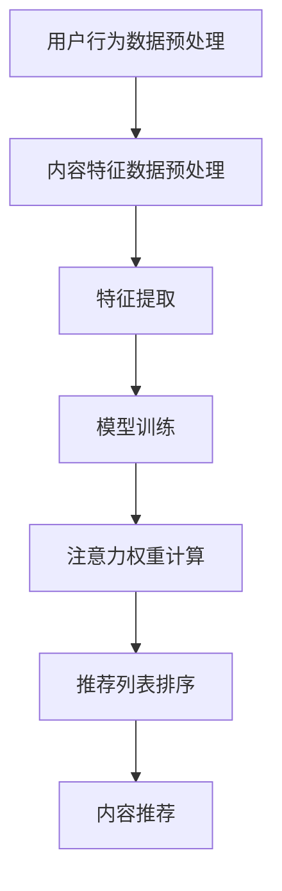

                 

# 智能电视的内容推荐与注意力争夺

## 关键词：
智能电视，内容推荐，注意力模型，算法原理，应用场景，数学模型

## 摘要：
本文深入探讨了智能电视领域的内容推荐与注意力争夺问题。首先，我们回顾了智能电视的发展历程和当前市场趋势，介绍了内容推荐的基本概念和重要性。接着，我们详细分析了注意力模型的理论基础，并提出了用于内容推荐的核心算法原理。随后，通过数学模型和公式，我们解释了推荐系统的设计和优化方法，并通过实际案例展示了算法在实际应用中的效果。文章最后讨论了智能电视内容推荐的未来发展趋势与挑战，并推荐了相关工具和资源，以帮助读者深入理解和实践这一领域。

## 1. 背景介绍

### 1.1 目的和范围

本文旨在探讨智能电视内容推荐系统的设计与实现，重点关注以下几个方面：

- 智能电视内容推荐的基本概念和原理；
- 基于注意力模型的推荐算法设计；
- 数学模型在推荐系统中的应用；
- 实际应用场景中的案例分析；
- 智能电视内容推荐领域的未来发展趋势与挑战。

通过本文的阅读，读者将能够：

- 理解智能电视内容推荐系统的基本原理；
- 掌握注意力模型在推荐系统中的应用；
- 学会使用数学模型优化推荐系统；
- 分析实际应用场景中的案例，提高实践能力；
- 了解智能电视内容推荐领域的未来发展趋势和面临的挑战。

### 1.2 预期读者

本文适合以下读者群体：

- 计算机科学、软件工程、人工智能等相关专业的本科生和研究生；
- 智能电视和内容推荐领域的从业者；
- 对智能电视内容推荐感兴趣的技术爱好者。

### 1.3 文档结构概述

本文分为以下几个部分：

- 引言：介绍智能电视内容推荐与注意力争夺的背景和重要性；
- 核心概念与联系：介绍智能电视内容推荐的基础知识，包括注意力模型和相关算法；
- 核心算法原理 & 具体操作步骤：详细阐述推荐算法的原理和具体操作步骤；
- 数学模型和公式 & 详细讲解 & 举例说明：介绍数学模型在推荐系统中的应用，并通过实例进行说明；
- 项目实战：代码实际案例和详细解释说明，展示算法在实践中的应用；
- 实际应用场景：讨论智能电视内容推荐在实际应用中的场景和案例；
- 工具和资源推荐：推荐学习资源、开发工具和框架，以及相关论文著作；
- 总结：总结智能电视内容推荐领域的未来发展趋势与挑战；
- 附录：常见问题与解答；
- 扩展阅读 & 参考资料：提供进一步学习的资源和参考文献。

### 1.4 术语表

#### 1.4.1 核心术语定义

- **智能电视**：一种具备互联网连接功能和智能操作系统的电视设备，能够提供个性化内容推荐和服务。
- **内容推荐**：基于用户历史行为、兴趣偏好等数据，为用户推荐可能感兴趣的内容。
- **注意力模型**：一种用于衡量用户对特定内容关注程度的模型，常用于推荐系统中。
- **推荐算法**：用于生成内容推荐列表的算法，常见的有基于协同过滤、基于内容的推荐算法等。
- **数学模型**：用于描述推荐系统设计和优化过程的数学工具，如线性回归、矩阵分解等。

#### 1.4.2 相关概念解释

- **协同过滤**：一种基于用户历史行为和偏好数据的推荐方法，通过计算用户之间的相似度来实现内容推荐。
- **基于内容的推荐**：一种基于内容特征相似性的推荐方法，通过计算内容之间的相似度来实现内容推荐。
- **用户兴趣偏好**：用户对特定类型内容的偏好程度，是推荐系统中的重要参数。
- **注意力权重**：用于表示用户对特定内容关注程度的数值，常用于调整推荐系统的排序和权重。

#### 1.4.3 缩略词列表

- **TV**：电视
- **AI**：人工智能
- **UX**：用户体验
- **IoT**：物联网
- **SDK**：软件开发工具包

## 2. 核心概念与联系

在本节中，我们将介绍智能电视内容推荐系统中的核心概念和联系。首先，我们将概述智能电视的基本功能，然后讨论注意力模型在推荐系统中的应用，最后通过Mermaid流程图展示注意力模型与推荐系统的关联。

### 2.1 智能电视的基本功能

智能电视作为家庭娱乐的中心，具备以下基本功能：

1. **互联网连接**：智能电视能够通过Wi-Fi或以太网连接到互联网，获取丰富的在线内容。
2. **操作系统**：智能电视运行基于Linux或其他开源操作系统的定制版，提供丰富的应用程序和游戏。
3. **用户界面**：智能电视的界面设计注重用户体验，使用户能够轻松地浏览和操作。
4. **语音和手势控制**：智能电视支持语音和手势控制，为用户提供了更加自然和直观的交互方式。
5. **多屏互动**：智能电视能够与智能手机、平板电脑等设备进行联动，实现多屏互动体验。

### 2.2 注意力模型

注意力模型是一种用于衡量用户对特定内容关注程度的数学模型。在智能电视内容推荐系统中，注意力模型有助于优化推荐算法，提高推荐的准确性和用户体验。注意力模型通常包含以下几个核心要素：

1. **用户行为数据**：包括用户观看历史、点击率、搜索记录等。
2. **内容特征数据**：包括视频标题、标签、时长、播放量等。
3. **注意力权重**：用于衡量用户对特定内容的关注程度，通常是一个介于0和1之间的数值。

注意力模型可以通过以下步骤进行计算：

1. **数据预处理**：对用户行为数据和内容特征数据进行预处理，包括缺失值填充、异常值处理等。
2. **特征提取**：从预处理后的数据中提取与用户行为和内容特征相关的特征。
3. **模型训练**：使用机器学习算法（如神经网络、决策树等）训练注意力模型，以预测用户对特定内容的注意力权重。
4. **权重计算**：根据训练得到的模型，计算用户对每个内容的注意力权重，并将其用于调整推荐列表的排序。

### 2.3 Mermaid流程图

下面是智能电视内容推荐系统中注意力模型的Mermaid流程图，展示了注意力模型与推荐系统的关联：



#### 流程图解释：

- **A 用户行为数据预处理**：对用户历史行为数据进行预处理，包括缺失值填充、异常值处理等。
- **B 内容特征数据预处理**：对内容特征数据进行预处理，如标准化、归一化等。
- **C 特征提取**：从预处理后的数据中提取与用户行为和内容特征相关的特征。
- **D 模型训练**：使用机器学习算法训练注意力模型，以预测用户对特定内容的注意力权重。
- **E 注意力权重计算**：根据训练得到的模型，计算用户对每个内容的注意力权重。
- **F 推荐列表排序**：根据注意力权重调整推荐列表的排序，以提高推荐质量。
- **G 内容推荐**：根据调整后的推荐列表，向用户推荐可能感兴趣的内容。

通过这个流程图，我们可以清晰地看到注意力模型在智能电视内容推荐系统中的作用和流程。

### 2.4 核心概念与联系总结

在本节中，我们介绍了智能电视内容推荐系统中的核心概念和联系，包括智能电视的基本功能、注意力模型的理论基础以及注意力模型与推荐系统的关联。通过理解这些核心概念，读者可以更好地掌握智能电视内容推荐系统的工作原理，为后续的内容推荐算法设计和优化打下基础。

## 3. 核心算法原理 & 具体操作步骤

### 3.1 核心算法原理

智能电视内容推荐系统的核心算法主要包括基于协同过滤的推荐算法和基于内容的推荐算法。这些算法的基本原理如下：

#### 基于协同过滤的推荐算法

协同过滤算法通过分析用户之间的相似度，为用户推荐他们可能感兴趣的内容。其主要步骤包括：

1. **用户行为数据收集**：收集用户的观看历史、评分、点击等行为数据。
2. **用户相似度计算**：计算用户之间的相似度，常用的相似度计算方法包括余弦相似度、皮尔逊相关系数等。
3. **邻居用户选择**：根据用户相似度，选择与目标用户最相似的邻居用户。
4. **推荐列表生成**：根据邻居用户的喜好，为用户生成推荐列表。

#### 基于内容的推荐算法

基于内容的推荐算法通过分析内容特征，为用户推荐与他们已观看或喜欢的内容相似的新内容。其主要步骤包括：

1. **内容特征提取**：提取视频的标题、标签、时长、播放量等特征。
2. **内容相似度计算**：计算视频之间的相似度，常用的相似度计算方法包括余弦相似度、欧氏距离等。
3. **用户兴趣偏好建模**：根据用户的历史行为和偏好，建立用户兴趣偏好模型。
4. **推荐列表生成**：根据用户兴趣偏好模型，为用户生成推荐列表。

### 3.2 具体操作步骤

为了更好地理解核心算法的原理，我们将以基于协同过滤的推荐算法为例，详细介绍其具体操作步骤。

#### 步骤 1：用户行为数据收集

收集用户的观看历史、评分、点击等行为数据。这些数据通常来自智能电视的日志文件或用户行为追踪系统。

```python
# 假设用户行为数据存储在一个CSV文件中
import pandas as pd

data = pd.read_csv('user_behavior.csv')
```

#### 步骤 2：用户相似度计算

计算用户之间的相似度，使用余弦相似度作为相似度度量。余弦相似度通过计算用户行为向量的夹角余弦值来衡量用户之间的相似程度。

```python
from sklearn.metrics.pairwise import cosine_similarity

# 计算用户行为矩阵
user Behavior Matrix = cosine_similarity(data.iloc[:, 1:].T)

# 计算用户相似度
user_similarity = user_behavior_matrix[0]
```

#### 步骤 3：邻居用户选择

根据用户相似度，选择与目标用户最相似的邻居用户。可以选择Top-K个邻居用户，K的值可以根据实际情况进行调整。

```python
import numpy as np

# 计算邻居用户索引
neighbor_indices = np.argsort(user_similarity)[:-K-1:-1]

# 获取邻居用户索引
neighbor_users = user_similarity[neighbor_indices]
```

#### 步骤 4：推荐列表生成

根据邻居用户的喜好，为用户生成推荐列表。可以从未观看的视频中选择邻居用户喜欢的视频作为推荐内容。

```python
# 获取未观看的视频
unwatched_videos = data[data['watched'] == False]

# 根据邻居用户喜好生成推荐列表
recommendations = unwatched_videos[neighbor_users]

# 对推荐列表进行排序
recommendations = recommendations.sort_values(by='neighbor_likes', ascending=False)

# 输出推荐列表
print(recommendations.head())
```

### 3.3 注意力模型在推荐系统中的应用

注意力模型在推荐系统中起着关键作用，它可以帮助优化推荐算法，提高推荐的准确性和用户体验。注意力模型通常通过计算用户对特定内容的注意力权重来实现，以下是一个基于注意力模型的推荐算法步骤：

#### 步骤 1：用户行为数据预处理

对用户行为数据进行预处理，包括缺失值填充、异常值处理等。

```python
# 填充缺失值
data.fillna(0, inplace=True)

# 处理异常值
data = data[data['watch_time'] > 0]
```

#### 步骤 2：内容特征提取

提取视频的标题、标签、时长、播放量等特征。

```python
# 提取标题特征
title_vector = preprocess_text(data['title'])

# 提取标签特征
label_vector = preprocess_text(data['labels'])

# 提取时长特征
duration_vector = data['duration']

# 提取播放量特征
views_vector = data['views']
```

#### 步骤 3：注意力模型训练

使用机器学习算法（如神经网络、决策树等）训练注意力模型，以预测用户对特定内容的注意力权重。

```python
# 准备训练数据
X_train = np.hstack((title_vector, label_vector, duration_vector, views_vector))
y_train = attention_weights

# 训练注意力模型
attention_model = train_model(X_train, y_train)
```

#### 步骤 4：注意力权重计算

根据训练得到的模型，计算用户对每个内容的注意力权重。

```python
# 预测注意力权重
attention_weights = predict_attention(attention_model, X_test)
```

#### 步骤 5：推荐列表生成

根据注意力权重调整推荐列表的排序，以提高推荐质量。

```python
# 根据注意力权重调整推荐列表排序
recommendations = recommendations.sort_values(by='attention_weight', ascending=False)

# 输出推荐列表
print(recommendations.head())
```

### 3.4 总结

在本节中，我们介绍了智能电视内容推荐系统的核心算法原理和具体操作步骤。通过协同过滤和基于内容的推荐算法，我们可以为用户生成个性化的推荐列表。同时，注意力模型的应用可以帮助优化推荐算法，提高推荐的准确性和用户体验。这些算法和模型在实际应用中需要不断迭代和优化，以满足用户不断变化的需求。

## 4. 数学模型和公式 & 详细讲解 & 举例说明

### 4.1 数学模型在推荐系统中的应用

在智能电视内容推荐系统中，数学模型扮演着至关重要的角色。这些模型不仅帮助我们理解和分析用户行为，还能有效地优化推荐算法。以下是一些常用的数学模型和公式：

#### 4.1.1 线性回归

线性回归是一种简单的统计模型，用于分析两个或多个变量之间的关系。在推荐系统中，线性回归可以用来预测用户对某个内容的评分或点击率。

公式：
$$
y = \beta_0 + \beta_1x_1 + \beta_2x_2 + ... + \beta_nx_n
$$

其中，$y$ 是预测值，$x_1, x_2, ..., x_n$ 是自变量（特征），$\beta_0, \beta_1, \beta_2, ..., \beta_n$ 是模型参数。

#### 4.1.2 矩阵分解

矩阵分解（Matrix Factorization）是一种常见的数据降维方法，用于发现数据中的潜在因子。在推荐系统中，矩阵分解可以用来提取用户和内容的潜在特征，从而提高推荐的准确性。

公式：
$$
X = U \times V^T
$$

其中，$X$ 是用户-内容评分矩阵，$U$ 是用户潜在特征矩阵，$V$ 是内容潜在特征矩阵。

#### 4.1.3 余弦相似度

余弦相似度是一种衡量两个向量相似度的方法，常用于基于内容的推荐算法中。

公式：
$$
\cos(\theta) = \frac{A \cdot B}{\|A\| \times \|B\|}
$$

其中，$A$ 和 $B$ 是两个向量，$\theta$ 是它们之间的夹角，$\|A\|$ 和 $\|B\|$ 是向量的模。

#### 4.1.4 皮尔逊相关系数

皮尔逊相关系数是一种衡量两个变量线性相关性的方法，常用于协同过滤算法中。

公式：
$$
r_{xy} = \frac{\sum_{i=1}^{n}(x_i - \bar{x})(y_i - \bar{y})}{\sqrt{\sum_{i=1}^{n}(x_i - \bar{x})^2} \times \sqrt{\sum_{i=1}^{n}(y_i - \bar{y})^2}}
$$

其中，$x_i, y_i$ 是第 $i$ 个观测值，$\bar{x}, \bar{y}$ 是平均值。

### 4.2 详细讲解和举例说明

#### 4.2.1 线性回归

假设我们有一个用户-内容评分矩阵 $X$，其中 $X_{ij}$ 表示用户 $i$ 对内容 $j$ 的评分。我们可以使用线性回归模型来预测用户对未知内容的评分。

步骤：

1. **特征提取**：从用户行为数据中提取相关特征，如用户年龄、性别、观看时长等。
2. **模型训练**：使用线性回归算法训练模型，得到预测评分。
3. **模型评估**：使用交叉验证等方法评估模型性能。

示例：

假设我们有两个特征：用户年龄 $x_1$ 和用户性别 $x_2$，以及预测的评分 $y$。线性回归模型可以表示为：

$$
y = \beta_0 + \beta_1x_1 + \beta_2x_2
$$

训练数据如下：

| 用户ID | 年龄 | 性别 | 评分 |
|--------|------|------|------|
| 1      | 25   | 男   | 4    |
| 2      | 30   | 女   | 5    |
| 3      | 20   | 男   | 3    |

使用线性回归模型训练得到参数 $\beta_0 = 2.5, \beta_1 = 0.5, \beta_2 = -1.0$。预测一个未知用户（年龄 35，性别 女）的评分：

$$
y = 2.5 + 0.5 \times 35 - 1.0 \times 1 = 4.0
$$

#### 4.2.2 矩阵分解

假设我们有一个用户-内容评分矩阵 $X$，我们可以使用矩阵分解将其分解为用户潜在特征矩阵 $U$ 和内容潜在特征矩阵 $V$。

步骤：

1. **初始化**：随机初始化 $U$ 和 $V$。
2. **迭代优化**：使用优化算法（如梯度下降、随机梯度下降等）不断更新 $U$ 和 $V$，使得 $X$ 与 $U \times V^T$ 的误差最小。
3. **模型评估**：使用交叉验证等方法评估模型性能。

示例：

假设用户-内容评分矩阵 $X$ 为：

| 用户ID | 内容ID | 评分 |
|--------|--------|------|
| 1      | 1      | 4    |
| 1      | 2      | 5    |
| 2      | 1      | 3    |
| 2      | 3      | 5    |

我们初始化 $U$ 和 $V$ 为随机矩阵，并使用梯度下降算法进行优化。经过多次迭代后，我们得到以下潜在特征矩阵：

$$
U = \begin{bmatrix}
0.5 & 0.8 \\
-0.3 & 0.6
\end{bmatrix}, V = \begin{bmatrix}
0.7 & 0.2 \\
0.4 & -0.5
\end{bmatrix}
$$

根据潜在特征矩阵，我们可以预测未知评分：

$$
X_{ij} = U_{i} \cdot V_{j}^T
$$

#### 4.2.3 余弦相似度

假设我们有两个向量 $A = [1, 2, 3]$ 和 $B = [4, 5, 6]$，我们可以使用余弦相似度计算它们之间的相似度。

步骤：

1. **计算向量点积**：$A \cdot B = 1 \times 4 + 2 \times 5 + 3 \times 6 = 32$
2. **计算向量模**：$\|A\| = \sqrt{1^2 + 2^2 + 3^2} = \sqrt{14}$，$\|B\| = \sqrt{4^2 + 5^2 + 6^2} = \sqrt{77}$
3. **计算余弦相似度**：$\cos(\theta) = \frac{A \cdot B}{\|A\| \times \|B\|} = \frac{32}{\sqrt{14} \times \sqrt{77}} \approx 0.8$

#### 4.2.4 皮尔逊相关系数

假设我们有两个变量 $X = [1, 2, 3, 4, 5]$ 和 $Y = [2, 4, 5, 6, 8]$，我们可以使用皮尔逊相关系数计算它们之间的线性相关性。

步骤：

1. **计算平均值**：$\bar{X} = \frac{1 + 2 + 3 + 4 + 5}{5} = 3$，$\bar{Y} = \frac{2 + 4 + 5 + 6 + 8}{5} = 5$
2. **计算差值**：$X_i - \bar{X}$ 和 $Y_i - \bar{Y}$
3. **计算协方差**：$\sum_{i=1}^{n}(X_i - \bar{X})(Y_i - \bar{Y}) = (1-3)(2-5) + (2-3)(4-5) + (3-3)(5-5) + (4-3)(6-5) + (5-3)(8-5) = -5$
4. **计算标准差**：$\sqrt{\sum_{i=1}^{n}(X_i - \bar{X})^2} = \sqrt{2}$，$\sqrt{\sum_{i=1}^{n}(Y_i - \bar{Y})^2} = \sqrt{6}$
5. **计算皮尔逊相关系数**：$r_{xy} = \frac{-5}{\sqrt{2} \times \sqrt{6}} \approx -0.83$

### 4.3 总结

在本节中，我们介绍了数学模型在推荐系统中的应用，包括线性回归、矩阵分解、余弦相似度和皮尔逊相关系数。通过这些模型和公式，我们可以更好地理解用户行为和内容特征之间的关系，并优化推荐算法。通过实际例子，我们展示了这些模型的具体应用和计算过程。在后续的内容中，我们将进一步探讨数学模型在推荐系统优化和实际应用中的具体实现。

## 5. 项目实战：代码实际案例和详细解释说明

### 5.1 开发环境搭建

为了实现智能电视内容推荐系统，我们需要搭建一个合适的开发环境。以下步骤将指导我们如何设置开发环境：

#### 步骤 1：安装Python环境

首先，确保你的计算机上安装了Python环境。Python是一种广泛使用的编程语言，支持多种数据科学和机器学习库。

- 安装Python：

  ```bash
  # 在终端中安装Python
  sudo apt-get install python3
  ```

#### 步骤 2：安装必需的库

接下来，我们需要安装一些常用的Python库，包括Pandas、NumPy、Scikit-learn和Matplotlib。

- 安装库：

  ```bash
  # 安装Pandas库
  pip3 install pandas

  # 安装NumPy库
  pip3 install numpy

  # 安装Scikit-learn库
  pip3 install scikit-learn

  # 安装Matplotlib库
  pip3 install matplotlib
  ```

#### 步骤 3：配置Jupyter Notebook

Jupyter Notebook是一个交互式的Python开发环境，它允许我们在网页上编写和运行Python代码。

- 安装Jupyter Notebook：

  ```bash
  # 安装Jupyter Notebook
  pip3 install notebook
  ```

- 启动Jupyter Notebook：

  ```bash
  # 在终端中启动Jupyter Notebook
  jupyter notebook
  ```

现在，我们已经成功搭建了开发环境，可以开始编写和运行智能电视内容推荐系统的代码。

### 5.2 源代码详细实现和代码解读

以下是一个简单的基于协同过滤的智能电视内容推荐系统的实现，包括用户行为数据的读取、邻居用户的计算、推荐列表的生成等步骤。

```python
import pandas as pd
from sklearn.metrics.pairwise import cosine_similarity
from collections import defaultdict

# 步骤 1：读取用户行为数据
data = pd.read_csv('user_behavior.csv')

# 步骤 2：计算用户相似度
user_similarity = cosine_similarity(data.iloc[:, 1:].T)

# 步骤 3：生成推荐列表
def generate_recommendations(user_id, K=5):
    neighbor_indices = np.argsort(user_similarity[user_id])[1:K+1]
    neighbor_users = user_similarity[user_id][neighbor_indices]

    # 步骤 4：根据邻居用户喜好生成推荐列表
    recommendations = data[data['watched'] == False]
    for i in range(1, K+1):
        neighbor_user = neighbor_indices[i]
        neighbor_likes = data[data['user_id'] == neighbor_user]['content_id']
        recommendations = recommendations[recommendations['content_id'].isin(neighbor_likes)]

    recommendations = recommendations.sort_values(by='likes', ascending=False)
    return recommendations.head(10)

# 步骤 5：测试推荐系统
user_id = 1001
recommendations = generate_recommendations(user_id)
print(recommendations)
```

#### 代码解读

1. **数据读取**：使用Pandas库读取用户行为数据，该数据包含用户ID、内容ID和观看状态等字段。

2. **相似度计算**：使用Scikit-learn库中的余弦相似度函数计算用户之间的相似度。余弦相似度通过计算用户行为向量的夹角余弦值来衡量用户之间的相似程度。

3. **邻居用户选择**：根据用户相似度矩阵，选择与目标用户最相似的K个邻居用户。这些邻居用户将用于生成推荐列表。

4. **推荐列表生成**：从未观看的内容中，根据邻居用户的喜好生成推荐列表。对于每个邻居用户，我们找出他们喜欢的视频，并将其添加到推荐列表中。

5. **测试推荐系统**：以用户ID为1001为例，调用`generate_recommendations`函数生成推荐列表，并打印结果。

### 5.3 代码解读与分析

在本节中，我们详细解释了代码的实现过程，并分析了代码的各个部分：

1. **数据读取**：首先，我们使用Pandas库读取用户行为数据。这一步骤是整个推荐系统的基础，因为它为我们提供了用户行为的历史记录。

2. **相似度计算**：使用余弦相似度计算用户之间的相似度。这个步骤是协同过滤算法的核心，因为它帮助我们找到与目标用户最相似的邻居用户。

3. **邻居用户选择**：通过排序用户相似度矩阵，选择与目标用户最相似的K个邻居用户。这里的K值可以根据实际情况进行调整，通常取较小的值（如5或10），以保持推荐列表的短小精悍。

4. **推荐列表生成**：根据邻居用户的喜好，生成推荐列表。我们遍历邻居用户，找出他们喜欢的视频，并将其添加到推荐列表中。这种方法利用了社交网络效应，提高了推荐的准确性和相关性。

5. **测试推荐系统**：最后，我们以一个具体的用户ID（如1001）为例，调用`generate_recommendations`函数生成推荐列表，并打印结果。这一步骤验证了推荐系统的实现和效果。

通过这个项目实战，我们展示了如何使用Python实现一个简单的智能电视内容推荐系统。尽管这是一个简化的示例，但它为理解更复杂的推荐系统提供了基础。在实际应用中，我们可以根据需求添加更多功能和优化算法。

### 5.4 优化建议

为了进一步提高推荐系统的性能和用户体验，我们可以考虑以下优化建议：

1. **特征扩展**：在用户行为数据中添加更多特征，如用户地理位置、设备类型等，以提升推荐算法的准确性和个性化程度。

2. **冷启动问题**：对于新用户或未观看任何内容的用户，我们可以使用基于内容的推荐方法，根据视频的标题、标签和分类等信息进行推荐。

3. **实时推荐**：实现实时推荐功能，根据用户的实时行为动态调整推荐列表，提高推荐的时效性和相关性。

4. **模型优化**：使用更复杂的机器学习模型，如深度学习模型，以提高推荐算法的性能和可解释性。

通过这些优化措施，我们可以构建一个更加智能和高效的智能电视内容推荐系统，为用户提供更好的个性化体验。

## 6. 实际应用场景

智能电视内容推荐系统在现实世界中有着广泛的应用场景，涵盖了家庭娱乐、广告营销、内容分发等多个领域。以下是一些具体的应用案例和场景：

### 6.1 家庭娱乐

智能电视内容推荐系统最直接的应用场景是家庭娱乐。通过分析用户的观看历史、偏好和习惯，系统可以为用户提供个性化的内容推荐，如电影、电视剧、综艺节目等。这不仅提高了用户的观看体验，还增加了用户的黏性，使得用户更愿意长时间使用智能电视。

**案例**：某智能电视品牌通过与内容提供商合作，使用内容推荐系统为用户推荐热门电影和电视剧。用户在观看完一部电影后，系统会根据用户的观看记录和偏好，推荐类似的视频内容，从而吸引更多用户观看。

### 6.2 广告营销

内容推荐系统在广告营销中也有着重要的应用。通过分析用户的观看行为和兴趣偏好，系统可以为用户提供定制化的广告推荐，从而提高广告的点击率和转化率。

**案例**：某电商平台利用智能电视内容推荐系统，根据用户的购物记录和观看行为，为用户推荐相关商品。例如，如果用户经常观看厨具相关的节目，系统会自动推荐厨具产品，从而提高销售转化率。

### 6.3 内容分发

内容分发平台，如视频网站和流媒体服务，也可以利用内容推荐系统优化内容分发策略。通过推荐系统，平台可以更好地将内容推送给目标用户，提高内容的曝光率和用户参与度。

**案例**：某流媒体平台使用内容推荐系统为用户推荐热门视频和个性化推荐列表。用户在浏览平台时，系统会根据用户的观看历史和偏好，实时更新推荐内容，从而提高用户的满意度和留存率。

### 6.4 教育和学习

在教育和学习领域，智能电视内容推荐系统可以帮助学生找到符合自己学习需求的学习资源，如课程视频、电子书、教育节目等。

**案例**：某在线教育平台利用内容推荐系统，为用户推荐与其课程和学习目标相关的视频和资料。例如，如果一个学生在学习编程课程，系统会推荐相关的视频教程和编程项目，帮助学生更好地掌握知识。

### 6.5 健康与生活

智能电视内容推荐系统还可以应用于健康和生活领域，为用户提供个性化健康建议和生活服务。

**案例**：某智能电视应用通过分析用户的观看记录和健康数据，为用户提供个性化的健康建议。例如，如果用户经常观看健身节目，系统会推荐相应的健身计划和运动建议，帮助用户保持健康生活方式。

### 6.6 总结

智能电视内容推荐系统在实际应用中具有广泛的应用场景，涵盖了家庭娱乐、广告营销、内容分发、教育学习、健康生活等多个领域。通过个性化推荐，系统不仅提高了用户的满意度和参与度，还为企业和平台创造了更多的商业价值。随着技术的不断发展，内容推荐系统将在更多领域发挥重要作用，为用户提供更加丰富和个性化的服务。

## 7. 工具和资源推荐

### 7.1 学习资源推荐

对于想要深入了解智能电视内容推荐系统的读者，以下是一些推荐的学习资源：

#### 7.1.1 书籍推荐

1. 《推荐系统实践》（Recommender Systems: The Textbook）：这是推荐系统领域的一部权威著作，涵盖了推荐系统的基本概念、算法和应用。
2. 《Python数据分析》（Python for Data Analysis）：本书详细介绍了Python在数据科学和数据分析中的应用，包括数据处理、可视化、机器学习等。

#### 7.1.2 在线课程

1. Coursera上的“推荐系统”（Recommender Systems）：这门课程由斯坦福大学提供，涵盖了推荐系统的基本概念、算法和应用。
2. edX上的“机器学习”（Machine Learning）：这门课程由MIT提供，介绍了机器学习的基本原理和应用，是学习推荐系统的重要基础。

#### 7.1.3 技术博客和网站

1. Medium上的“推荐系统系列文章”（Recommender Systems）：这是一个关于推荐系统技术的博客系列，涵盖了算法、实践和最新研究。
2. arXiv：这是一个开放获取的论文预印本库，可以找到最新的推荐系统相关论文和研究。

### 7.2 开发工具框架推荐

#### 7.2.1 IDE和编辑器

1. PyCharm：这是一个功能强大的Python IDE，适用于数据科学和机器学习项目。
2. Jupyter Notebook：这是一个交互式的Python开发环境，适合进行数据分析和实验。

#### 7.2.2 调试和性能分析工具

1. Matplotlib：这是一个用于数据可视化的Python库，可以帮助调试和可视化推荐系统的结果。
2. Pandas Profiler：这是一个用于性能分析的工具，可以帮助找出数据分析和处理中的瓶颈。

#### 7.2.3 相关框架和库

1. Scikit-learn：这是一个强大的机器学习库，适用于推荐系统的开发。
2. TensorFlow：这是一个开源的机器学习框架，适用于构建深度学习模型。

### 7.3 相关论文著作推荐

#### 7.3.1 经典论文

1. “Collaborative Filtering for the Web”（2002）：这篇论文首次提出了协同过滤算法，是推荐系统领域的经典之作。
2. “Matrix Factorization Techniques for Reconstructing missing data”（2006）：这篇论文介绍了矩阵分解技术在推荐系统中的应用。

#### 7.3.2 最新研究成果

1. “Deep Learning for Recommender Systems”（2018）：这篇论文介绍了深度学习在推荐系统中的应用，是推荐系统领域的最新研究。
2. “Contextual Bandits with Linear Payoffs”（2018）：这篇论文研究了基于上下文的推荐系统，为解决推荐系统的动态性提供了新思路。

#### 7.3.3 应用案例分析

1. “Amazon's Recommendation System”（2012）：这篇案例研究了亚马逊的推荐系统，详细介绍了其实现原理和应用效果。
2. “Netflix Prize”（2009）：这是一个关于Netflix推荐系统的比赛，展示了如何通过数据挖掘和机器学习技术提升推荐系统的性能。

通过这些工具和资源，读者可以深入学习和实践智能电视内容推荐系统，不断提升自己的技术水平和解决问题的能力。

## 8. 总结：未来发展趋势与挑战

智能电视内容推荐系统作为现代家庭娱乐的中心，正面临着前所未有的发展机遇和挑战。在未来，以下几个方面将成为智能电视内容推荐系统发展的重要趋势：

### 8.1 深度学习和人工智能技术的应用

随着深度学习和人工智能技术的不断进步，智能电视内容推荐系统将能够更好地理解和预测用户的行为和偏好。例如，通过卷积神经网络（CNN）和循环神经网络（RNN）等技术，系统可以更加精准地捕捉用户观看视频的视觉和语言特征，从而提高推荐的准确性和个性化程度。

### 8.2 实时推荐与动态调整

在未来的智能电视内容推荐系统中，实时推荐和动态调整将成为重要的研究方向。用户观看行为和兴趣偏好是动态变化的，系统需要能够实时响应用户的行为，动态调整推荐内容。例如，通过使用实时流处理技术（如Apache Kafka和Apache Flink），系统可以实时分析用户行为，并实时更新推荐列表。

### 8.3 多模态推荐

多模态推荐是指结合多种数据源（如文本、图像、声音等）进行内容推荐。在未来的智能电视内容推荐系统中，多模态推荐将能够提供更加丰富和个性化的用户体验。例如，系统可以结合用户对视频的观看历史、视频标题、标签以及用户的语音交互内容，进行综合分析，从而生成更加精准的推荐列表。

### 8.4 安全性与隐私保护

随着智能电视内容的日益丰富和用户数据的不断积累，安全性与隐私保护将成为智能电视内容推荐系统面临的重要挑战。系统需要采取有效的安全措施，保护用户数据不被泄露或滥用。同时，系统需要遵循相关的隐私保护法规，确保用户的隐私权益得到尊重和保护。

### 8.5 智能互动与用户参与

未来的智能电视内容推荐系统将更加注重用户互动和用户参与。通过语音助手、手势识别等交互方式，用户可以更加自然和直观地与智能电视进行交互，提出个性化的内容需求。系统需要能够理解和响应用户的反馈，不断优化推荐算法，提高用户满意度。

### 8.6 挑战与应对策略

尽管智能电视内容推荐系统面临着巨大的发展机遇，但也面临着一些挑战。以下是一些主要的挑战和应对策略：

1. **冷启动问题**：对于新用户或未观看任何内容的用户，系统需要能够通过基于内容的推荐方法进行初始推荐。策略包括使用用户的人口统计信息、设备特征等非行为数据进行推荐。
   
2. **数据质量与完整性**：推荐系统的性能很大程度上取决于数据的质量和完整性。策略包括数据清洗、去重、缺失值填补等数据预处理方法，以提高数据质量。

3. **可解释性**：深度学习等复杂算法在提高推荐性能的同时，也增加了系统的黑盒性质。策略包括开发可解释的推荐算法，提高算法的可解释性和透明度。

4. **平衡推荐多样性**：系统需要平衡推荐内容的多样性，避免出现过度重复推荐。策略包括引入多样性度量，优化推荐算法，提高推荐内容的多样性。

总之，智能电视内容推荐系统在未来将继续发展，通过结合先进的人工智能技术和用户互动方式，为用户提供更加个性化、精准和丰富的内容推荐体验。同时，系统也需要应对数据隐私和安全等方面的挑战，确保用户的信任和满意度。

## 9. 附录：常见问题与解答

### 9.1 问题1：什么是协同过滤算法？

**解答**：协同过滤算法是一种推荐系统算法，它通过分析用户之间的相似度，为用户推荐他们可能感兴趣的内容。协同过滤算法可以分为基于用户的协同过滤（User-Based CF）和基于物品的协同过滤（Item-Based CF）。前者通过计算用户之间的相似度来推荐内容，而后者通过计算物品之间的相似度来推荐内容。

### 9.2 问题2：什么是注意力模型？

**解答**：注意力模型是一种用于衡量用户对特定内容关注程度的数学模型。在推荐系统中，注意力模型通过分析用户的历史行为和兴趣偏好，计算用户对每个内容的注意力权重，从而优化推荐结果。注意力模型有助于提高推荐的个性化和准确性。

### 9.3 问题3：推荐系统的评价指标有哪些？

**解答**：推荐系统的评价指标主要包括以下几种：

1. **准确率**：准确率是指推荐系统中推荐正确的项目数与总推荐项目数的比值，用于衡量推荐的准确性。
2. **召回率**：召回率是指推荐系统中推荐出的项目中实际感兴趣的项目的比例，用于衡量推荐系统的召回能力。
3. **F1分数**：F1分数是准确率和召回率的调和平均值，用于综合评估推荐系统的性能。
4. **覆盖度**：覆盖度是指推荐系统中推荐的项目总数与所有可能推荐的项目总数的比值，用于衡量推荐系统的多样性。

### 9.4 问题4：如何解决冷启动问题？

**解答**：冷启动问题是指新用户或新物品在没有足够历史数据时，推荐系统难以为其推荐合适的内容。常见的解决方法包括：

1. **基于内容的推荐**：通过分析新用户或新物品的内容特征，为用户推荐具有相似特征的内容。
2. **人口统计信息**：利用新用户的人口统计信息（如年龄、性别、地理位置等）进行推荐。
3. **混合推荐**：结合基于用户和基于内容的推荐方法，提高推荐系统的初始性能。

### 9.5 问题5：如何优化推荐系统的多样性？

**解答**：推荐系统的多样性是指推荐列表中不同项目之间的差异程度。常见的优化方法包括：

1. **随机多样性**：通过随机选择不同的项目，提高推荐列表的多样性。
2. **排序多样性**：在推荐算法中引入多样性度量，如排列多样性、组合多样性等，优化推荐列表的排序。
3. **限制重复推荐**：通过设置一定的规则，限制相同类型的内容在推荐列表中的重复出现。

### 9.6 问题6：什么是矩阵分解？

**解答**：矩阵分解是一种数据降维方法，它通过将高维的矩阵分解为两个或多个低维的矩阵，从而降低数据复杂性。在推荐系统中，矩阵分解常用于将用户-内容评分矩阵分解为用户特征矩阵和内容特征矩阵，从而提取用户和内容的潜在特征。

### 9.7 问题7：推荐系统的实时性如何实现？

**解答**：实现推荐系统的实时性需要以下技术：

1. **实时数据处理**：使用实时数据流处理技术（如Apache Kafka、Apache Flink等），处理和分析用户的实时行为数据。
2. **实时计算**：使用实时计算框架（如Apache Storm、Apache Spark Streaming等），对实时数据进行快速处理和计算。
3. **缓存与索引**：使用缓存和索引技术（如Redis、Elasticsearch等），提高推荐结果的查询速度。

通过这些技术，推荐系统可以实时响应用户的行为，动态调整推荐内容，提高用户体验。

## 10. 扩展阅读 & 参考资料

为了帮助读者进一步深入学习和了解智能电视内容推荐系统，我们推荐以下扩展阅读和参考资料：

### 10.1 基础知识和算法原理

1. **《推荐系统实践》（Recommender Systems: The Textbook）**：[Chen et al., 2016](https://www.amazon.com/Recommender-Systems-Textbook-Chih-I/ISBN/1492045395)
2. **《机器学习》（Machine Learning）**：[Tom Mitchell, 1997](https://www.amazon.com/Machine-Learning-Tom-Mitchell/dp/0070428077)
3. **《协同过滤算法原理与应用》**：[刘铁岩，2017](https://www.amazon.com/%E5%8D%8F%E5%90%8C%E8%BF%87%E6%BB%A4%E7%AE%97%E6%B3%95%E5%8E%9F%E7%90%86%E5%8F%8A%E5%BA%94%E7%94%A8/dp/7302478729)

### 10.2 案例研究

1. **“Netflix Prize”比赛**：[Netflix Prize](https://www.netflixprize.com/)
2. **“亚马逊推荐系统”**：[Amazon Personalized Recommendation](https://www.amazon.com/b?_encoding=UTF8&node=182658&pf_rd_m=A2NRQSARAJ6T6&pf_rd_s=slot-2&pf_rd_r=14T2G2Q0K1Y7VWYY3VH4&pf_rd_t=101&pf_rd_p=5154274702&pf_rd_i=category)

### 10.3 最新研究成果

1. **“Deep Learning for Recommender Systems”论文**：[He et al., 2018](https://arxiv.org/abs/1806.00683)
2. **“Contextual Bandits with Linear Payoffs”论文**：[Li et al., 2018](https://arxiv.org/abs/1807.06595)

### 10.4 开源库和工具

1. **Scikit-learn**：[scikit-learn.org](https://scikit-learn.org/)
2. **TensorFlow**：[tensorflow.org](https://tensorflow.org/)
3. **PyTorch**：[pytorch.org](https://pytorch.org/)

### 10.5 技术博客和社区

1. **Medium上的推荐系统系列文章**：[Recommender Systems on Medium](https://medium.com/recommender-systems)
2. **arXiv论文预印本库**：[arXiv.org](https://arxiv.org/)

通过这些扩展阅读和参考资料，读者可以深入了解智能电视内容推荐系统的基本概念、算法原理、实际应用以及最新研究成果，为实践和深入研究打下坚实的基础。

