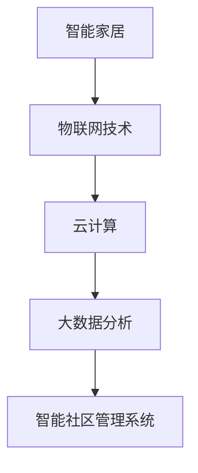
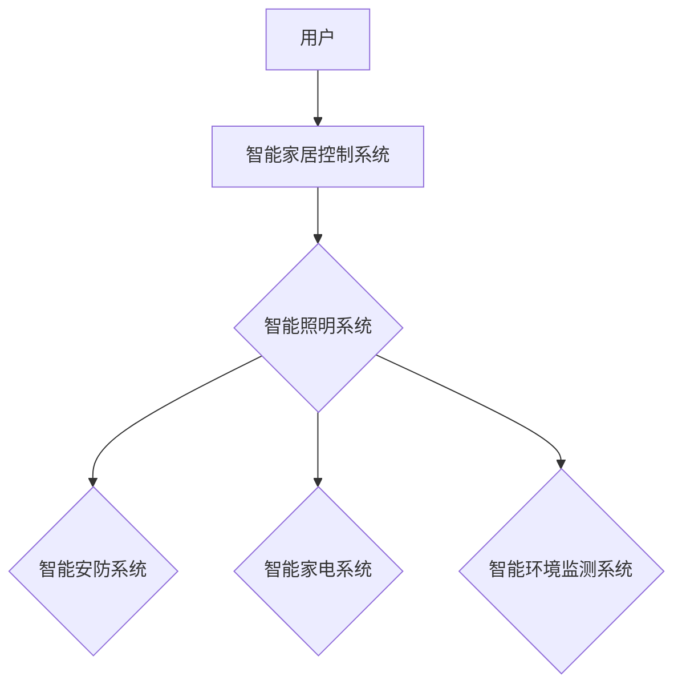
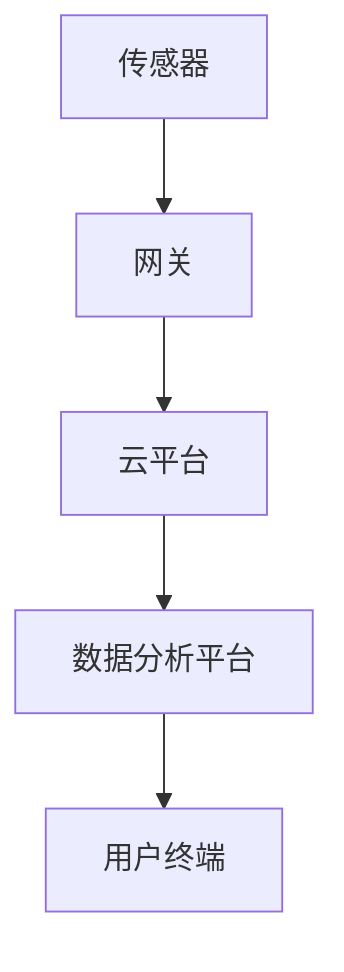
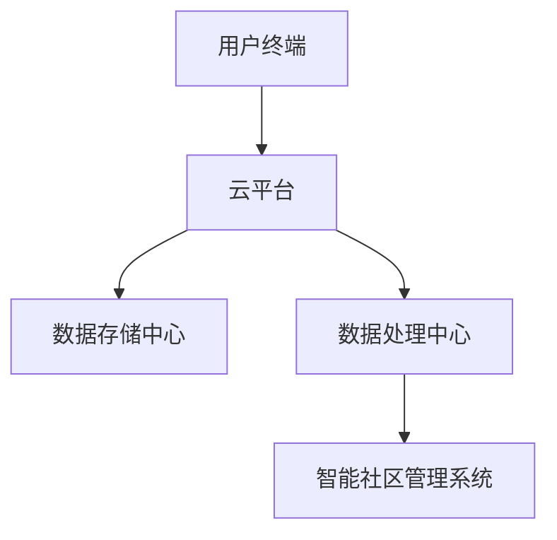
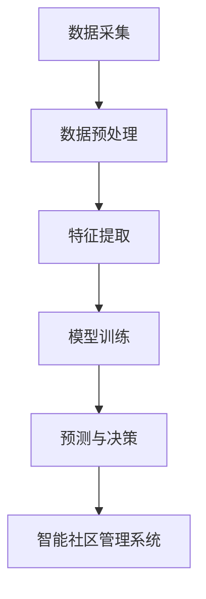

                 

# 智能社区管理系统：提升居住体验的综合方案

> **关键词：** 智能社区，管理系统，居住体验，数据分析，物联网技术

> **摘要：** 本文章旨在介绍智能社区管理系统的核心概念、原理、算法、数学模型以及实际应用案例。通过逐步分析，本文将探讨如何利用智能技术提升社区的居住体验，为社区管理者提供一套完整的解决方案。

## 1. 背景介绍

### 1.1 目的和范围

随着城市化进程的不断加快，社区管理面临着诸多挑战。传统的社区管理方式已经无法满足现代居民对生活品质的追求。智能社区管理系统作为一种新兴的解决方案，旨在通过信息技术提升社区的管理效率，改善居民的居住体验。

本文将聚焦智能社区管理系统的构建与应用，探讨其核心概念、技术架构、算法原理以及数学模型。同时，本文将结合实际案例，展示智能社区管理系统的具体应用场景，为社区管理者提供实用的参考。

### 1.2 预期读者

本文适合对智能社区管理系统感兴趣的读者，包括：

1. 社区管理者：了解智能社区管理系统的原理和应用，为社区管理提供新思路。
2. 技术人员：学习智能社区管理系统涉及的各项技术，为系统开发提供技术支持。
3. 研究人员：对智能社区管理系统的研究提供理论参考。

### 1.3 文档结构概述

本文结构如下：

1. 背景介绍：介绍智能社区管理系统的目的和范围，预期读者，文档结构概述。
2. 核心概念与联系：讨论智能社区管理系统的核心概念，并使用 Mermaid 流程图展示技术架构。
3. 核心算法原理 & 具体操作步骤：详细阐述智能社区管理系统的算法原理和具体操作步骤，使用伪代码进行说明。
4. 数学模型和公式 & 详细讲解 & 举例说明：介绍智能社区管理系统中的数学模型和公式，并给出详细讲解和实例说明。
5. 项目实战：代码实际案例和详细解释说明，包括开发环境搭建、源代码实现和代码解读与分析。
6. 实际应用场景：探讨智能社区管理系统的实际应用场景。
7. 工具和资源推荐：推荐学习资源、开发工具框架和相关论文著作。
8. 总结：未来发展趋势与挑战。
9. 附录：常见问题与解答。
10. 扩展阅读 & 参考资料：提供进一步学习的资源链接。

### 1.4 术语表

#### 1.4.1 核心术语定义

- 智能社区管理系统：利用信息技术手段，对社区各类资源和设施进行智能化管理和优化，提升社区居住体验。
- 物联网技术：将各种信息传感设备与网络相连接，实现物与物、物与人之间的信息交换和通信。
- 数据分析：通过对大规模数据进行处理和分析，提取有价值的信息，为决策提供依据。

#### 1.4.2 相关概念解释

- 智能家居：通过物联网技术，实现家庭设备和系统的自动化和智能化管理。
- 云计算：通过网络提供计算服务，实现资源的灵活调度和高效利用。
- 大数据：指无法用传统数据库软件工具进行捕捉、管理和处理的超大规模数据集合。

#### 1.4.3 缩略词列表

- IoT：物联网（Internet of Things）
- AI：人工智能（Artificial Intelligence）
- ML：机器学习（Machine Learning）
- IoTaaS：物联网即服务（Internet of Things as a Service）
- SaaS：软件即服务（Software as a Service）

## 2. 核心概念与联系

智能社区管理系统的核心概念包括智能家居、物联网技术、云计算、大数据分析等。以下是一个简化的 Mermaid 流程图，展示了这些概念之间的联系：



### 2.1 智能家居

智能家居是智能社区管理系统的基石，通过物联网技术实现家庭设备和系统的智能化管理。智能家居系统包括智能照明、智能安防、智能家电、智能环境监测等模块。以下是一个智能家居系统的基本架构：



### 2.2 物联网技术

物联网技术是将各种信息传感设备与网络连接，实现物与物、物与人之间的信息交换和通信。物联网技术在智能社区管理系统中起到关键作用，包括数据采集、传输、处理和反馈。以下是一个物联网技术在智能社区管理系统中的应用场景：



### 2.3 云计算

云计算为智能社区管理系统提供了强大的计算能力和数据存储能力。通过云计算，社区管理者可以实现对海量数据的实时处理和分析，为居民提供个性化的服务。以下是一个云计算在智能社区管理系统中的应用架构：



### 2.4 大数据分析

大数据分析是智能社区管理系统的核心，通过对海量数据的挖掘和分析，提取有价值的信息，为社区管理提供决策支持。大数据分析包括数据采集、数据预处理、特征提取、模型训练和预测等步骤。以下是一个大数据分析在智能社区管理系统中的应用流程：



## 3. 核心算法原理 & 具体操作步骤

智能社区管理系统的核心算法原理包括数据采集、数据预处理、特征提取、模型训练和预测等。以下使用伪代码详细阐述这些步骤：

### 3.1 数据采集

```python
def data_collection():
    # 采集传感器数据
    sensor_data = read_sensor_data()
    # 采集用户行为数据
    user_data = read_user_data()
    # 采集社区环境数据
    environment_data = read_environment_data()
    return sensor_data, user_data, environment_data
```

### 3.2 数据预处理

```python
def data_preprocessing(data):
    # 清洗数据
    cleaned_data = clean_data(data)
    # 标准化数据
    normalized_data = normalize_data(cleaned_data)
    return normalized_data
```

### 3.3 特征提取

```python
def feature_extraction(data):
    # 提取时间特征
    time_features = extract_time_features(data)
    # 提取空间特征
    space_features = extract_space_features(data)
    # 提取行为特征
    behavior_features = extract_behavior_features(data)
    return time_features, space_features, behavior_features
```

### 3.4 模型训练

```python
def train_model(features, labels):
    # 选择合适的机器学习模型
    model = select_model()
    # 训练模型
    model.fit(features, labels)
    return model
```

### 3.5 预测与决策

```python
def predict_and_decision(model, data):
    # 预测结果
    predictions = model.predict(data)
    # 决策支持
    decisions = generate_decisions(predictions)
    return decisions
```

## 4. 数学模型和公式 & 详细讲解 & 举例说明

在智能社区管理系统中，数学模型和公式发挥着关键作用。以下将介绍常用的数学模型和公式，并进行详细讲解和实例说明。

### 4.1 决策树模型

决策树模型是一种常用的机器学习算法，用于分类和回归分析。以下是一个简单的决策树模型：

```latex
\begin{equation}
\begin{split}
&Y = \\
&\begin{cases}
&Class_1, &\text{if}~X_1 > 0 \\
&Class_2, &\text{if}~X_1 \leq 0
\end{cases}
\end{split}
\end{equation}
```

### 4.2 随机森林模型

随机森林模型是一种基于决策树的集成学习方法，具有很好的分类和回归性能。以下是一个简单的随机森林模型：

```latex
\begin{equation}
\begin{split}
&Y = \\
&\frac{1}{M} \sum_{m=1}^{M} \hat{Y}_m \\
&\hat{Y}_m = \prod_{i=1}^{n} h(x_i; \theta_m)
\end{split}
\end{equation}
```

其中，$M$ 表示决策树的数量，$n$ 表示特征的数量，$h(x_i; \theta_m)$ 表示第 $m$ 棵决策树对特征 $x_i$ 的分类结果。

### 4.3 支持向量机模型

支持向量机模型是一种常用的分类算法，用于分类和回归分析。以下是一个简单

