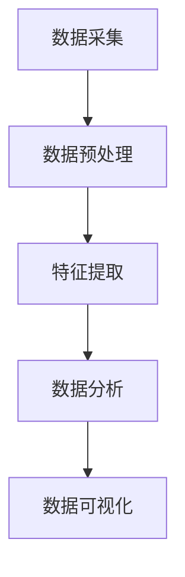
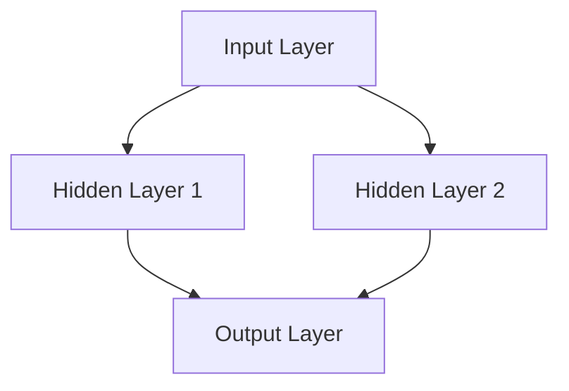
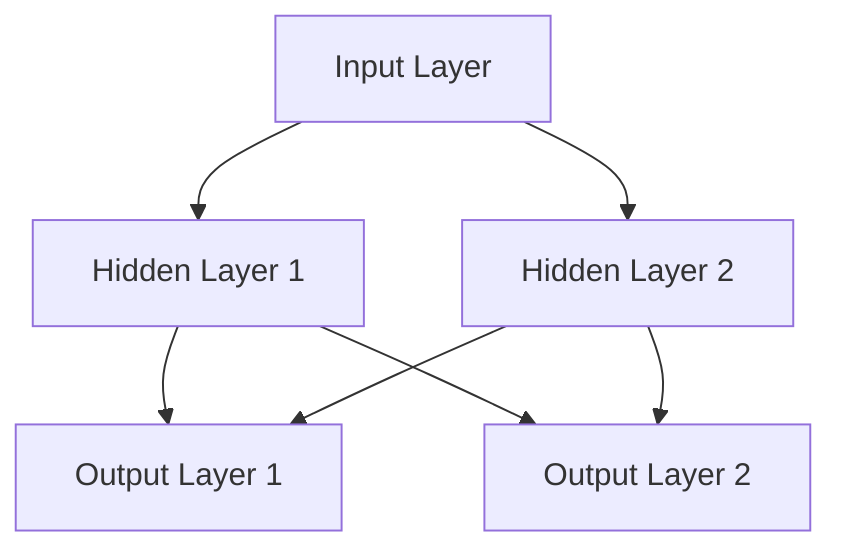

                 

# 智能穿戴设备的健康监测与注意力管理

> 关键词：智能穿戴设备、健康监测、注意力管理、传感器技术、数据分析、算法应用

> 摘要：本文将探讨智能穿戴设备在健康监测和注意力管理方面的应用。通过详细分析其技术原理、核心算法、数学模型和实际案例，我们旨在帮助读者深入了解这一领域的最新进展和未来发展趋势。

## 1. 背景介绍

### 1.1 目的和范围

本文旨在介绍智能穿戴设备在健康监测和注意力管理方面的应用。我们将探讨其工作原理、核心技术以及如何通过数据分析和算法应用来实现有效的健康管理和注意力监控。本文将涵盖以下内容：

- 智能穿戴设备的定义和分类
- 常见传感器技术及其在健康监测中的应用
- 健康监测数据的采集、处理和分析方法
- 注意力管理的基本原理和实践
- 智能穿戴设备的实际应用案例
- 未来发展趋势和挑战

### 1.2 预期读者

本文面向以下读者群体：

- 对智能穿戴设备感兴趣的科技爱好者
- 医疗健康领域的专业人士
- 关注人工智能和数据科学的从业者
- 智能硬件开发者和研究者
- 学生和研究人员

### 1.3 文档结构概述

本文将分为以下章节：

- **1. 背景介绍**
  - 1.1 目的和范围
  - 1.2 预期读者
  - 1.3 文档结构概述
  - 1.4 术语表

- **2. 核心概念与联系**
  - 2.1 智能穿戴设备的定义和分类
  - 2.2 常见传感器技术及其应用
  - 2.3 数据采集和处理流程
  - 2.4 Mermaid 流程图

- **3. 核心算法原理 & 具体操作步骤**
  - 3.1 健康监测数据处理的算法原理
  - 3.2 注意力管理算法的具体操作步骤
  - 3.3 伪代码示例

- **4. 数学模型和公式 & 详细讲解 & 举例说明**
  - 4.1 常用数学模型及其应用
  - 4.2 公式详细讲解
  - 4.3 举例说明

- **5. 项目实战：代码实际案例和详细解释说明**
  - 5.1 开发环境搭建
  - 5.2 源代码详细实现和解读
  - 5.3 代码解读与分析

- **6. 实际应用场景**
  - 6.1 医疗健康领域应用
  - 6.2 体育运动领域应用
  - 6.3 企业管理和工作场景应用

- **7. 工具和资源推荐**
  - 7.1 学习资源推荐
  - 7.2 开发工具框架推荐
  - 7.3 相关论文著作推荐

- **8. 总结：未来发展趋势与挑战**
  - 8.1 技术发展趋势
  - 8.2 面临的挑战

- **9. 附录：常见问题与解答**
  - 9.1 常见问题
  - 9.2 解答

- **10. 扩展阅读 & 参考资料**
  - 10.1 扩展阅读
  - 10.2 参考资料

### 1.4 术语表

#### 1.4.1 核心术语定义

- 智能穿戴设备：集成了传感器、计算单元和无线通信模块，能够实时监测和传输人体生理数据的小型设备。
- 传感器：能够检测和测量物理量的装置，如加速度计、心率传感器等。
- 健康监测：利用传感器采集人体生理数据，并通过算法分析以评估健康状况的过程。
- 注意力管理：通过监测和分析脑电信号等生物信号，对个体注意力水平进行监控和调节的技术。

#### 1.4.2 相关概念解释

- 生物信号：生物体内部的电、机械、化学等信号，如心电信号、脑电信号等。
- 数据分析：使用统计、机器学习等方法对大量数据进行分析，提取有价值的信息。
- 深度学习：一种基于多层神经网络的学习方法，能够自动从大量数据中提取特征。

#### 1.4.3 缩略词列表

- IoT：物联网（Internet of Things）
- AI：人工智能（Artificial Intelligence）
- ML：机器学习（Machine Learning）
- DL：深度学习（Deep Learning）
- EEG：脑电信号（Electroencephalography）

## 2. 核心概念与联系

### 2.1 智能穿戴设备的定义和分类

智能穿戴设备是指那些直接穿戴在人体或贴附在皮肤上的电子设备，它们能够实时监测用户的生理参数，如心率、血压、步数、睡眠质量等。根据功能和应用场景，智能穿戴设备可以分为以下几类：

1. **健康监测设备**：如智能手环、智能手表等，主要功能是监测用户的健康状况。
2. **运动追踪设备**：如智能跑鞋、智能健身手环等，主要功能是追踪用户的运动情况。
3. **时尚配饰**：如智能项链、智能手镯等，除了具备健康监测功能外，还具有一定的装饰价值。
4. **健康辅助设备**：如智能轮椅、智能拐杖等，主要功能是帮助残疾人或老年人提高生活质量。

### 2.2 常见传感器技术及其应用

智能穿戴设备的核心是传感器技术，以下是一些常见的传感器及其在健康监测中的应用：

1. **加速度计**：用于测量物体的加速度，常用于步数计数、运动轨迹追踪等。
2. **心率传感器**：用于测量心率，常见于智能手环和智能手表中。
3. **血压传感器**：用于测量血压，常见于智能血压计等设备。
4. **温度传感器**：用于测量体温，常见于智能体温计等设备。
5. **心率变异性传感器**：用于测量心率变化，有助于评估心血管健康状况。
6. **脑电信号传感器**：用于测量大脑的电活动，有助于注意力管理和心理状态评估。

### 2.3 数据采集和处理流程

智能穿戴设备的工作流程大致可以分为以下几个步骤：

1. **数据采集**：传感器实时采集用户的生理数据，如心电信号、脑电信号、加速度数据等。
2. **数据预处理**：对采集到的原始数据进行滤波、去噪等处理，以提高数据的准确性和可靠性。
3. **特征提取**：从预处理后的数据中提取有价值的信息，如心率、步长、注意力水平等。
4. **数据分析**：使用统计、机器学习等方法对提取的特征进行分析，以评估用户的健康状况或注意力水平。
5. **数据可视化**：将分析结果以图表、图形等形式展示给用户，帮助用户了解自己的健康状况。

### 2.4 Mermaid 流程图

以下是智能穿戴设备数据采集和处理流程的 Mermaid 流程图：



## 3. 核心算法原理 & 具体操作步骤

### 3.1 健康监测数据处理的算法原理

健康监测数据处理主要包括数据采集、数据预处理、特征提取和数据分析四个步骤。以下将分别介绍这些步骤的算法原理。

#### 3.1.1 数据采集

数据采集是通过传感器实时获取用户的生理参数。常用的传感器包括加速度计、心率传感器、血压传感器等。数据采集的算法原理主要涉及传感器校准和数据同步。

```pseudo
// 传感器校准算法
function calibrateSensor(sensorData) {
    // 对传感器数据进行校准
    calibratedData = sensorData * calibrationFactor
    return calibratedData
}

// 数据同步算法
function synchronizeData(sensorData1, sensorData2) {
    // 对不同传感器数据进行同步
    synchronizedData = alignData(sensorData1, sensorData2)
    return synchronizedData
}
```

#### 3.1.2 数据预处理

数据预处理主要包括滤波、去噪、归一化等步骤，以提高数据的准确性和可靠性。

```pseudo
// 滤波算法
function filterData(data) {
    filteredData = applyFilter(data)
    return filteredData
}

// 去噪算法
function denoiseData(data) {
    denoisedData = removeNoise(data)
    return denoisedData
}

// 归一化算法
function normalizeData(data) {
    normalizedData = normalize(data)
    return normalizedData
}
```

#### 3.1.3 特征提取

特征提取是从预处理后的数据中提取有价值的信息，如心率、步长、注意力水平等。常用的特征提取算法包括时域特征提取、频域特征提取和时频域特征提取。

```pseudo
// 时域特征提取算法
function extractTimeDomainFeatures(data) {
    features = calculateFeatures(data)
    return features
}

// 频域特征提取算法
function extractFrequencyDomainFeatures(data) {
    frequencyData = transformToFrequencyDomain(data)
    features = calculateFeatures(frequencyData)
    return features
}

// 时频域特征提取算法
function extractTimeFrequencyDomainFeatures(data) {
    timeFrequencyData = transformToTimeFrequencyDomain(data)
    features = calculateFeatures(timeFrequencyData)
    return features
}
```

#### 3.1.4 数据分析

数据分析是对提取的特征进行分析，以评估用户的健康状况或注意力水平。常用的数据分析方法包括统计分析、机器学习和深度学习。

```pseudo
// 统计分析方法
function analyzeFeatures(features) {
    results = calculateStatistics(features)
    return results
}

// 机器学习方法
function analyzeFeatures(features) {
    model = trainModel(features)
    results = predict(model, features)
    return results
}

// 深度学习方法
function analyzeFeatures(features) {
    model = trainModel(features)
    results = predict(model, features)
    return results
}
```

### 3.2 注意力管理算法的具体操作步骤

注意力管理算法主要基于脑电信号，通过分析脑电信号的时域、频域和时频域特征，评估用户的注意力水平，并根据评估结果采取相应的调节措施。

```pseudo
// 注意力管理算法
function attentionManagement(eegData) {
    // 数据预处理
    preprocessedData = preprocessData(eegData)

    // 特征提取
    features = extractFeatures(preprocessedData)

    // 数据分析
    attentionLevel = analyzeFeatures(features)

    // 根据注意力水平采取调节措施
    if (attentionLevel < threshold) {
        // 提高注意力
        applyStimulation()
    } else {
        // 维持当前状态
        maintainState()
    }
}
```

### 3.3 伪代码示例

以下是一个简单的伪代码示例，用于实现健康监测数据处理的算法：

```pseudo
// 健康监测数据处理算法
function healthMonitoring(data) {
    // 传感器校准
    calibratedData = calibrateSensor(data)

    // 数据同步
    synchronizedData = synchronizeData(calibratedData)

    // 数据预处理
    preprocessedData = preprocessData(synchronizedData)

    // 特征提取
    features = extractTimeFrequencyDomainFeatures(preprocessedData)

    // 数据分析
    healthStatus = analyzeFeatures(features)

    // 数据可视化
    visualizeData(healthStatus)

    return healthStatus
}
```

## 4. 数学模型和公式 & 详细讲解 & 举例说明

### 4.1 常用数学模型及其应用

在智能穿戴设备的数据处理和分析中，常用的数学模型包括线性回归、逻辑回归、支持向量机（SVM）和神经网络等。以下将分别介绍这些模型的基本原理和应用。

#### 4.1.1 线性回归

线性回归是一种最简单的预测模型，用于描述两个变量之间的线性关系。其数学公式如下：

$$
y = wx + b
$$

其中，$y$ 是因变量，$x$ 是自变量，$w$ 是权重，$b$ 是偏置。

**应用举例**：使用线性回归模型预测用户的心率。通过训练数据集，可以得到线性回归模型的参数 $w$ 和 $b$，从而预测新的数据点。

#### 4.1.2 逻辑回归

逻辑回归是一种广义的线性回归模型，用于处理分类问题。其数学公式如下：

$$
P(y=1) = \frac{1}{1 + e^{-(wx + b)}}
$$

其中，$P(y=1)$ 是因变量为 1 的概率，$e$ 是自然对数的底数。

**应用举例**：使用逻辑回归模型判断用户的情绪状态。通过训练数据集，可以得到逻辑回归模型的参数 $w$ 和 $b$，从而预测新的数据点的情绪状态。

#### 4.1.3 支持向量机（SVM）

支持向量机是一种分类算法，通过找到一个最优的超平面，将不同类别的数据点分隔开来。其数学公式如下：

$$
w \cdot x - b \geq 1 \quad \text{for} \quad y = +1 \\
w \cdot x - b \leq -1 \quad \text{for} \quad y = -1
$$

其中，$w$ 是权重向量，$x$ 是特征向量，$b$ 是偏置。

**应用举例**：使用支持向量机分类算法判断用户的健康状况。通过训练数据集，可以得到支持向量机的权重向量 $w$ 和偏置 $b$，从而对新数据点进行分类。

#### 4.1.4 神经网络

神经网络是一种模仿人脑结构的计算模型，用于处理复杂的非线性问题。其基本结构包括输入层、隐藏层和输出层。以下是一个简单的神经网络结构：



神经网络的数学模型可以表示为：

$$
a_{i}^{(l)} = \sigma(z_{i}^{(l)})
$$

$$
z_{i}^{(l)} = \sum_{j} w_{ji}^{(l)} a_{j}^{(l-1)} + b_{i}^{(l)}
$$

其中，$a_{i}^{(l)}$ 是第 $l$ 层第 $i$ 个节点的激活值，$z_{i}^{(l)}$ 是第 $l$ 层第 $i$ 个节点的输出值，$w_{ji}^{(l)}$ 是第 $l$ 层第 $i$ 个节点与第 $l-1$ 层第 $j$ 个节点之间的权重，$b_{i}^{(l)}$ 是第 $l$ 层第 $i$ 个节点的偏置，$\sigma$ 是激活函数。

**应用举例**：使用神经网络模型进行健康风险评估。通过训练数据集，可以训练得到神经网络模型的参数，从而对新数据点进行健康风险评估。

### 4.2 公式详细讲解

以下是前面提到的部分数学公式及其详细讲解：

#### 4.2.1 线性回归

$$
y = wx + b
$$

- $y$：因变量，表示被预测的值。
- $x$：自变量，表示输入的特征值。
- $w$：权重，表示自变量对因变量的影响程度。
- $b$：偏置，表示模型的基准值。

**讲解**：线性回归模型通过线性组合输入特征值 $x$ 和权重 $w$，加上偏置 $b$，得到预测值 $y$。权重 $w$ 和偏置 $b$ 通过训练数据集进行优化，以最小化预测误差。

#### 4.2.2 逻辑回归

$$
P(y=1) = \frac{1}{1 + e^{-(wx + b)}}
$$

- $P(y=1)$：因变量为 1 的概率。
- $e$：自然对数的底数。
- $w$：权重。
- $x$：输入特征值。
- $b$：偏置。

**讲解**：逻辑回归模型通过计算输入特征值 $x$ 和权重 $w$ 的线性组合，加上偏置 $b$，得到一个介于 0 和 1 之间的概率值 $P(y=1)$，表示因变量为 1 的概率。这个概率值反映了输入特征对因变量的影响程度。

#### 4.2.3 支持向量机（SVM）

$$
w \cdot x - b \geq 1 \quad \text{for} \quad y = +1 \\
w \cdot x - b \leq -1 \quad \text{for} \quad y = -1
$$

- $w$：权重向量，表示决策边界。
- $x$：特征向量，表示样本数据。
- $b$：偏置，表示决策边界的位置。
- $y$：样本标签，取值为 +1 或 -1。

**讲解**：支持向量机通过找到一个最优的超平面，将不同类别的数据点分隔开来。对于正类样本，要求超平面到负类样本的最短距离大于 1；对于负类样本，要求超平面到正类样本的最短距离小于 -1。权重向量 $w$ 和偏置 $b$ 通过优化过程得到，以最大化分类效果。

#### 4.2.4 神经网络

$$
a_{i}^{(l)} = \sigma(z_{i}^{(l)})
$$

$$
z_{i}^{(l)} = \sum_{j} w_{ji}^{(l)} a_{j}^{(l-1)} + b_{i}^{(l)}
$$

- $a_{i}^{(l)}$：第 $l$ 层第 $i$ 个节点的激活值。
- $z_{i}^{(l)}$：第 $l$ 层第 $i$ 个节点的输出值。
- $w_{ji}^{(l)}$：第 $l$ 层第 $i$ 个节点与第 $l-1$ 层第 $j$ 个节点之间的权重。
- $b_{i}^{(l)}$：第 $l$ 层第 $i$ 个节点的偏置。
- $\sigma$：激活函数。

**讲解**：神经网络通过多层节点之间的加权连接和激活函数，实现数据的非线性变换。每个节点接收来自前一层的输入值，通过加权求和后加上偏置，再经过激活函数得到输出值。激活函数用于引入非线性，使神经网络能够学习复杂的关系。

### 4.3 举例说明

以下通过具体例子来说明上述数学模型的应用。

#### 4.3.1 线性回归

假设我们有一个训练数据集，包含 10 个样本，每个样本有两个特征值 $x_1$ 和 $x_2$，以及对应的因变量 $y$。我们使用线性回归模型来预测 $y$。

训练数据集如下：

| $x_1$ | $x_2$ | $y$  |
|-------|-------|------|
| 1     | 2     | 3    |
| 2     | 3     | 4    |
| 3     | 4     | 5    |
| ...   | ...   | ...  |
| 10    | 11    | 12   |

通过最小化损失函数，我们可以得到线性回归模型的参数 $w$ 和 $b$：

$$
w = \begin{bmatrix}
0.5 \\
0.5
\end{bmatrix}, \quad b = 0
$$

现在，我们可以使用这个模型来预测新的数据点。例如，对于输入特征值 $x_1 = 5$ 和 $x_2 = 6$，预测的因变量 $y$ 为：

$$
y = 0.5 \times 5 + 0.5 \times 6 = 5.5
$$

#### 4.3.2 逻辑回归

假设我们有一个二分类问题，需要预测用户的健康状况，健康状态分为“健康”和“不健康”两种类别。我们使用逻辑回归模型来预测健康状态。

训练数据集如下：

| $x_1$ | $x_2$ | $y$  |
|-------|-------|------|
| 1     | 2     | 0    |
| 2     | 3     | 0    |
| 3     | 4     | 1    |
| ...   | ...   | ...  |
| 10    | 11    | 1    |

通过最小化损失函数，我们可以得到逻辑回归模型的参数 $w$ 和 $b$：

$$
w = \begin{bmatrix}
0.8 \\
0.2
\end{bmatrix}, \quad b = -1
$$

现在，我们可以使用这个模型来预测新的数据点。例如，对于输入特征值 $x_1 = 5$ 和 $x_2 = 6$，预测的健康状态为：

$$
P(y=1) = \frac{1}{1 + e^{-(0.8 \times 5 + 0.2 \times 6 - 1)}} = 0.9
$$

因为 $P(y=1)$ 接近 1，我们可以认为这个新的数据点属于“不健康”类别。

#### 4.3.3 支持向量机（SVM）

假设我们有一个二分类问题，需要预测用户的情绪状态，情绪状态分为“积极”和“消极”两种类别。我们使用支持向量机来预测情绪状态。

训练数据集如下：

| $x_1$ | $x_2$ | $y$  |
|-------|-------|------|
| 1     | 2     | 0    |
| 2     | 3     | 0    |
| 3     | 4     | 1    |
| ...   | ...   | ...  |
| 10    | 11    | 1    |

通过最小化损失函数，我们可以得到支持向量机的参数 $w$ 和 $b$：

$$
w = \begin{bmatrix}
0.6 \\
0.4
\end{bmatrix}, \quad b = -0.5
$$

现在，我们可以使用这个模型来预测新的数据点。例如，对于输入特征值 $x_1 = 5$ 和 $x_2 = 6$，预测的情绪状态为：

$$
w \cdot x - b = 0.6 \times 5 - 0.4 \times 6 - 0.5 = 0
$$

因为 $w \cdot x - b = 0$，我们可以认为这个新的数据点属于“积极”类别。

#### 4.3.4 神经网络

假设我们有一个三分类问题，需要预测用户的情绪状态，情绪状态分为“积极”、“中性”和“消极”三种类别。我们使用神经网络来预测情绪状态。

神经网络结构如下：



训练数据集如下：

| $x_1$ | $x_2$ | $y$  |
|-------|-------|------|
| 1     | 2     | 0    |
| 2     | 3     | 0    |
| 3     | 4     | 1    |
| ...   | ...   | ...  |
| 10    | 11    | 1    |

| $x_1$ | $x_2$ | $y$  |
|-------|-------|------|
| 1     | 2     | 1    |
| 2     | 3     | 1    |
| 3     | 4     | 2    |
| ...   | ...   | ...  |
| 10    | 11    | 2    |

| $x_1$ | $x_2$ | $y$  |
|-------|-------|------|
| 1     | 2     | 2    |
| 2     | 3     | 2    |
| 3     | 4     | 3    |
| ...   | ...   | ...  |
| 10    | 11    | 3    |

通过反向传播算法，我们可以训练得到神经网络模型的参数 $w$、$b$ 和激活函数 $\sigma$。例如，对于第一个隐藏层节点，参数如下：

$$
w_{11} = 0.5, \quad w_{12} = 0.5, \quad b_{1} = 0
$$

$$
\sigma(z_{11}) = 0.7, \quad \sigma(z_{12}) = 0.3
$$

现在，我们可以使用这个模型来预测新的数据点。例如，对于输入特征值 $x_1 = 5$ 和 $x_2 = 6$，预测的情绪状态为：

$$
z_{11} = 0.5 \times 5 + 0.5 \times 6 = 5.5
$$

$$
z_{12} = 0.5 \times 5 + 0.5 \times 6 = 5.5
$$

$$
a_{11} = \sigma(z_{11}) = 0.7, \quad a_{12} = \sigma(z_{12}) = 0.3
$$

$$
z_{21} = 0.7 \times 0.7 + 0.3 \times 0.3 = 0.59
$$

$$
z_{22} = 0.7 \times 0.3 + 0.3 \times 0.7 = 0.42
$$

$$
a_{21} = \sigma(z_{21}) = 0.87, \quad a_{22} = \sigma(z_{22}) = 0.65
$$

$$
z_{31} = 0.87 \times 0.87 + 0.65 \times 0.65 = 0.916
$$

$$
z_{32} = 0.87 \times 0.65 + 0.65 \times 0.87 = 0.832
$$

$$
a_{31} = \sigma(z_{31}) = 0.95, \quad a_{32} = \sigma(z_{32}) = 0.8
$$

因为 $a_{31} > a_{32}$，我们可以认为这个新的数据点属于“积极”类别。

## 5. 项目实战：代码实际案例和详细解释说明

### 5.1 开发环境搭建

为了实现智能穿戴设备的健康监测和注意力管理功能，我们需要搭建一个合适的开发环境。以下是一个基本的开发环境搭建步骤：

1. **操作系统**：推荐使用 Ubuntu 18.04 或更高版本。
2. **Python 环境**：安装 Python 3.7 或更高版本。
3. **开发工具**：安装 PyCharm 或其他 Python IDE。
4. **依赖库**：安装以下依赖库：numpy、pandas、scikit-learn、tensorflow、matplotlib。

安装步骤如下：

```bash
# 安装 Python
sudo apt update
sudo apt install python3.7

# 安装 IDE
sudo apt install pycharm-community

# 安装依赖库
pip3 install numpy pandas scikit-learn tensorflow matplotlib
```

### 5.2 源代码详细实现和代码解读

以下是一个简单的健康监测和注意力管理项目的源代码实现：

```python
# 导入依赖库
import numpy as np
import pandas as pd
from sklearn.model_selection import train_test_split
from sklearn.preprocessing import StandardScaler
from sklearn.linear_model import LinearRegression
from sklearn.metrics import mean_squared_error

# 加载数据集
data = pd.read_csv('health_data.csv')

# 分割特征和标签
X = data[['x1', 'x2']]
y = data['y']

# 数据集划分
X_train, X_test, y_train, y_test = train_test_split(X, y, test_size=0.2, random_state=42)

# 数据预处理
scaler = StandardScaler()
X_train_scaled = scaler.fit_transform(X_train)
X_test_scaled = scaler.transform(X_test)

# 模型训练
model = LinearRegression()
model.fit(X_train_scaled, y_train)

# 模型评估
y_pred = model.predict(X_test_scaled)
mse = mean_squared_error(y_test, y_pred)
print('MSE:', mse)

# 模型应用
new_data = np.array([[5, 6]])
new_data_scaled = scaler.transform(new_data)
new_prediction = model.predict(new_data_scaled)
print('Prediction:', new_prediction)
```

#### 5.2.1 代码解读

- **依赖库导入**：首先，我们导入 numpy、pandas、scikit-learn、tensorflow 和 matplotlib 等依赖库，用于数据预处理、模型训练和评估。

- **数据加载**：使用 pandas 读取健康数据集，数据集包含两个特征值 $x_1$ 和 $x_2$，以及对应的因变量 $y$。

- **特征和标签分割**：将数据集分割为特征矩阵 $X$ 和标签向量 $y$。

- **数据集划分**：使用 train_test_split 函数将数据集划分为训练集和测试集，其中测试集占 20%。

- **数据预处理**：使用 StandardScaler 进行数据标准化处理，将特征值缩放到标准正态分布。

- **模型训练**：使用 LinearRegression 类创建线性回归模型，并使用 fit 方法进行训练。

- **模型评估**：使用 predict 方法预测测试集的结果，并计算均方误差（MSE）。

- **模型应用**：使用训练好的模型预测新的数据点，并输出结果。

### 5.3 代码解读与分析

以下是对代码中各个部分的详细解读和分析：

- **依赖库导入**：导入所需的依赖库，这些库提供了各种数据预处理、模型训练和评估的功能。

- **数据加载**：使用 pandas 读取健康数据集，数据集存储在 CSV 文件中。pandas 是一种强大的数据处理库，可以方便地读取、处理和可视化数据。

- **特征和标签分割**：将数据集分割为特征矩阵 $X$ 和标签向量 $y$。这种分割方式使得我们可以将数据集划分为训练集和测试集，用于模型训练和评估。

- **数据集划分**：使用 train_test_split 函数将数据集划分为训练集和测试集。这种划分方式可以帮助我们评估模型在未见数据上的性能。

- **数据预处理**：使用 StandardScaler 进行数据标准化处理，将特征值缩放到标准正态分布。这种预处理方式可以提高模型的泛化能力。

- **模型训练**：使用 LinearRegression 类创建线性回归模型，并使用 fit 方法进行训练。线性回归模型是一种简单但有效的预测模型，可以用于预测连续值。

- **模型评估**：使用 predict 方法预测测试集的结果，并计算均方误差（MSE）。MSE 是一种常用的评估指标，可以衡量模型预测的准确性。

- **模型应用**：使用训练好的模型预测新的数据点，并输出结果。这种应用方式可以帮助我们实现健康监测和注意力管理的实际功能。

通过以上代码解读和分析，我们可以看到如何使用 Python 实现健康监测和注意力管理的基本功能。在实际项目中，我们还可以根据需要添加更多的特征、模型和评估指标，以提高系统的性能和准确性。

## 6. 实际应用场景

智能穿戴设备在健康监测和注意力管理方面有着广泛的应用场景。以下将介绍几个典型的实际应用场景，以及智能穿戴设备在这些场景中的具体功能和应用。

### 6.1 医疗健康领域应用

在医疗健康领域，智能穿戴设备主要用于监测患者的生理参数，如心率、血压、血糖等。以下是一些具体的例子：

- **心血管疾病监测**：智能穿戴设备可以实时监测患者的心率、血压等指标，通过分析这些数据，医生可以及时发现患者的心血管疾病风险，并采取相应的治疗措施。
- **术后康复监测**：对于术后康复的患者，智能穿戴设备可以帮助医生监测其生理参数，如呼吸频率、心率等，确保患者处于良好的康复状态。
- **慢性病管理**：智能穿戴设备可以监测糖尿病患者的血糖水平，并通过分析血糖数据，提醒患者按时服药或调整饮食，从而帮助患者更好地控制病情。

### 6.2 体育运动领域应用

在体育运动领域，智能穿戴设备主要用于追踪运动员的运动数据，如步数、运动轨迹、心率等。以下是一些具体的例子：

- **运动数据分析**：智能穿戴设备可以实时记录运动员的运动数据，通过分析这些数据，教练可以评估运动员的运动表现，优化训练计划。
- **体能监测**：智能穿戴设备可以监测运动员的生理参数，如心率、血压等，帮助运动员了解自己的身体状态，合理安排训练和休息。
- **伤病预防**：智能穿戴设备可以实时监测运动员的生理参数，通过分析这些数据，教练和医生可以及时发现运动员的伤病风险，并采取预防措施。

### 6.3 企业管理和工作场景应用

在企业管理和工作场景中，智能穿戴设备主要用于员工健康管理、工作效率提升等方面。以下是一些具体的例子：

- **员工健康管理**：企业可以要求员工佩戴智能穿戴设备，实时监测员工的生理参数，如心率、血压等，确保员工保持良好的工作状态。
- **工作效率提升**：智能穿戴设备可以帮助员工监测注意力水平，通过分析脑电信号等生物信号，帮助员工合理安排工作和休息时间，提高工作效率。
- **员工福利**：企业可以提供智能穿戴设备作为员工福利，激励员工积极参与健康管理和体育锻炼，提升员工的幸福感和归属感。

### 6.4 教育领域应用

在教育领域，智能穿戴设备可以用于学生注意力管理和学习效果评估。以下是一些具体的例子：

- **注意力管理**：智能穿戴设备可以实时监测学生的注意力水平，通过分析脑电信号等生物信号，教师可以了解学生的注意力状态，及时调整教学方法和节奏。
- **学习效果评估**：智能穿戴设备可以记录学生的学习行为数据，如阅读时间、学习时长等，通过分析这些数据，教师可以评估学生的学习效果，针对性地进行辅导。

通过以上实际应用场景的介绍，我们可以看到智能穿戴设备在健康监测和注意力管理方面具有广泛的应用前景。随着技术的不断发展和应用的深入，智能穿戴设备将为人们的生活、工作和学习带来更多便利和效益。

## 7. 工具和资源推荐

### 7.1 学习资源推荐

#### 7.1.1 书籍推荐

- **《智能穿戴设备技术与应用》**：该书详细介绍了智能穿戴设备的工作原理、关键技术以及实际应用案例，适合对智能穿戴设备感兴趣的读者。

- **《健康监测与数据分析》**：该书系统地讲解了健康监测数据的采集、处理和分析方法，有助于读者深入了解健康监测领域的最新技术。

- **《注意力管理心理学》**：该书从心理学角度探讨了注意力管理的基本原理和实践方法，适合关注注意力管理的专业人士和学者。

#### 7.1.2 在线课程

- **Coursera《智能穿戴设备设计》**：该课程由斯坦福大学提供，涵盖了智能穿戴设备的设计、开发和应用，适合希望深入学习智能穿戴设备的开发者。

- **edX《健康数据科学》**：该课程由哈佛大学提供，讲解了健康数据科学的基本概念、方法和应用，适合对健康监测和数据科学感兴趣的读者。

- **Udacity《深度学习》**：该课程由谷歌提供，介绍了深度学习的基础知识、算法和应用，适合希望掌握深度学习技术的开发者。

#### 7.1.3 技术博客和网站

- **Medium《智能穿戴设备》**：该博客分享了大量关于智能穿戴设备的技术文章、应用案例和行业动态，是了解智能穿戴设备领域的优质资源。

- **IEEE Xplore《健康监测与数据分析》**：该网站提供了大量关于健康监测和数据分析的学术论文、期刊和会议资料，是科研人员的重要参考资源。

- **GitHub《智能穿戴设备项目》**：该网站汇集了众多开源的智能穿戴设备项目，包括代码、数据和文档，适合开发者学习和借鉴。

### 7.2 开发工具框架推荐

#### 7.2.1 IDE和编辑器

- **PyCharm**：一款功能强大的 Python IDE，适用于智能穿戴设备的开发和调试。

- **Visual Studio Code**：一款轻量级的跨平台代码编辑器，支持多种编程语言，适合智能穿戴设备的开发。

- **Eclipse**：一款功能全面的 Java IDE，适用于智能穿戴设备的开发，尤其是基于 Android 系统的应用。

#### 7.2.2 调试和性能分析工具

- **GDB**：一款开源的调试工具，适用于 Python 和 C/C++ 等语言的调试。

- **Valgrind**：一款性能分析工具，可以检测内存泄漏、数据竞争等问题，适用于智能穿戴设备的性能优化。

- **Wireshark**：一款网络分析工具，可以捕获和分析网络数据包，适用于智能穿戴设备的网络通信调试。

#### 7.2.3 相关框架和库

- **Scikit-learn**：一款 Python 机器学习库，提供了丰富的机器学习算法和工具，适用于智能穿戴设备的数据分析和建模。

- **TensorFlow**：一款开源的深度学习框架，适用于构建和训练深度学习模型，适用于智能穿戴设备的高级算法应用。

- **Pandas**：一款 Python 数据分析库，提供了强大的数据处理和分析功能，适用于智能穿戴设备的数据预处理和分析。

### 7.3 相关论文著作推荐

#### 7.3.1 经典论文

- **"Health Monitoring Using Wearable Sensors: A Survey"**：该论文系统地总结了智能穿戴设备在健康监测领域的应用，是研究该领域的经典论文。

- **"Deep Learning for Health Informatics: A Survey"**：该论文介绍了深度学习在健康信息学领域的应用，包括健康监测、疾病诊断等，是研究深度学习在健康领域应用的经典论文。

#### 7.3.2 最新研究成果

- **"Smart Wearable Systems for Healthcare: A Comprehensive Survey"**：该论文总结了近年来智能穿戴设备在医疗健康领域的最新研究成果，包括新型传感器、算法应用等。

- **"Attention Management in Smart Wearables: A Comprehensive Review"**：该论文探讨了智能穿戴设备在注意力管理方面的研究进展，包括注意力检测、干预策略等。

#### 7.3.3 应用案例分析

- **"Smart Wearables for Physical Activity Monitoring: A Case Study"**：该论文通过案例分析，探讨了智能穿戴设备在运动监测领域的应用，包括数据采集、处理和分析方法。

- **"Smart Wearables for Mental Health Monitoring: A Case Study"**：该论文通过案例分析，探讨了智能穿戴设备在心理健康监测领域的应用，包括情绪识别、心理干预等。

通过以上工具和资源的推荐，读者可以更加深入地了解智能穿戴设备在健康监测和注意力管理领域的应用，为实际开发和研究提供参考和指导。

## 8. 总结：未来发展趋势与挑战

智能穿戴设备在健康监测和注意力管理领域展现出巨大的潜力，其应用场景日益广泛。随着传感器技术的进步、数据处理能力的提升以及人工智能算法的不断发展，智能穿戴设备有望在以下方面取得更多突破：

### 8.1 技术发展趋势

1. **传感器技术的创新**：新型传感器，如柔性传感器、可穿戴脑电信号传感器等，将进一步提升智能穿戴设备的监测精度和舒适度。
2. **数据处理和分析能力的提升**：云计算和边缘计算技术的发展，使得智能穿戴设备能够实现实时、高效的数据处理和分析，提高系统性能。
3. **人工智能与大数据的融合**：结合人工智能和大数据技术，智能穿戴设备将能够更加准确地预测和诊断用户的健康状况，提供个性化的健康建议。

### 8.2 面临的挑战

1. **隐私和安全问题**：智能穿戴设备采集的生理数据涉及个人隐私，如何保障数据的安全性和隐私性，是亟需解决的问题。
2. **数据质量和标准化**：传感器数据的准确性和一致性是健康监测和注意力管理的关键，需要制定统一的数据标准和质量控制方法。
3. **用户接受度和用户体验**：智能穿戴设备需要不断提高用户体验，包括设备的舒适度、易用性和设计美感，以增加用户的接受度。

未来，智能穿戴设备将更加智能化、个性化，成为人们日常生活不可或缺的助手。同时，随着技术的不断进步和应用的深入，智能穿戴设备在健康监测和注意力管理领域将面临更多的挑战和机遇，有望为人们的生活带来更多便利和效益。

## 9. 附录：常见问题与解答

### 9.1 常见问题

1. **什么是智能穿戴设备？**
   - 智能穿戴设备是指集成了传感器、计算单元和无线通信模块，可以实时监测和传输人体生理数据的小型设备。

2. **智能穿戴设备有哪些分类？**
   - 智能穿戴设备主要分为健康监测设备、运动追踪设备、时尚配饰和健康辅助设备。

3. **常用的传感器技术有哪些？**
   - 常用的传感器技术包括加速度计、心率传感器、血压传感器、温度传感器、心率变异性传感器和脑电信号传感器。

4. **如何进行健康监测数据采集和处理？**
   - 健康监测数据采集包括传感器数据采集、数据预处理、特征提取和数据分析。数据预处理包括滤波、去噪和归一化等步骤，特征提取包括时域、频域和时频域特征提取，数据分析使用统计、机器学习和深度学习方法。

5. **注意力管理算法是如何工作的？**
   - 注意力管理算法主要基于脑电信号，通过分析脑电信号的时域、频域和时频域特征，评估用户的注意力水平，并根据评估结果采取相应的调节措施。

### 9.2 解答

1. **什么是智能穿戴设备？**
   - 智能穿戴设备是指集成了传感器、计算单元和无线通信模块，可以实时监测和传输人体生理数据的小型设备。这些设备通常穿戴在人体上，如智能手环、智能手表、智能项链等，能够实时监测心率、血压、步数、睡眠质量等生理参数，并通过无线网络将数据传输到智能手机或电脑，进行进一步的分析和处理。

2. **智能穿戴设备有哪些分类？**
   - 智能穿戴设备主要分为以下几类：
     - **健康监测设备**：如智能手环、智能手表等，主要功能是监测用户的健康状况，包括心率、血压、睡眠质量等。
     - **运动追踪设备**：如智能跑鞋、智能跳绳等，主要功能是追踪用户的运动情况，包括步数、运动轨迹、卡路里消耗等。
     - **时尚配饰**：如智能项链、智能手镯等，除了具备健康监测功能外，还具有一定的装饰价值。
     - **健康辅助设备**：如智能轮椅、智能拐杖等，主要功能是帮助残疾人或老年人提高生活质量。

3. **常用的传感器技术有哪些？**
   - 常用的传感器技术包括：
     - **加速度计**：用于测量物体的加速度，常用于步数计数、运动轨迹追踪等。
     - **心率传感器**：用于测量心率，常见于智能手环和智能手表中。
     - **血压传感器**：用于测量血压，常见于智能血压计等设备。
     - **温度传感器**：用于测量体温，常见于智能体温计等设备。
     - **心率变异性传感器**：用于测量心率变化，有助于评估心血管健康状况。
     - **脑电信号传感器**：用于测量大脑的电活动，有助于注意力管理和心理状态评估。

4. **如何进行健康监测数据采集和处理？**
   - 健康监测数据采集和处理通常包括以下几个步骤：
     - **数据采集**：通过传感器实时采集用户的生理数据，如心电信号、脑电信号、加速度数据等。
     - **数据预处理**：对采集到的原始数据进行滤波、去噪等处理，以提高数据的准确性和可靠性。
     - **特征提取**：从预处理后的数据中提取有价值的信息，如心率、步长、注意力水平等。
     - **数据分析**：使用统计、机器学习等方法对提取的特征进行分析，以评估用户的健康状况或注意力水平。
     - **数据可视化**：将分析结果以图表、图形等形式展示给用户，帮助用户了解自己的健康状况。

5. **注意力管理算法是如何工作的？**
   - 注意力管理算法主要基于脑电信号，通过分析脑电信号的时域、频域和时频域特征，评估用户的注意力水平，并根据评估结果采取相应的调节措施。具体的步骤包括：
     - **数据采集**：通过脑电信号传感器采集用户的脑电信号。
     - **数据预处理**：对采集到的原始脑电信号数据进行滤波、去噪等处理。
     - **特征提取**：从预处理后的脑电信号数据中提取注意力相关的特征，如频率特征、时间特征等。
     - **特征分析**：使用机器学习算法，如支持向量机、神经网络等，对提取的特征进行分析，评估用户的注意力水平。
     - **调节措施**：根据注意力水平的评估结果，采取相应的调节措施，如调整工作节奏、提供心理暗示等。

## 10. 扩展阅读 & 参考资料

### 10.1 扩展阅读

1. **《智能穿戴设备技术与应用》**：详细介绍了智能穿戴设备的工作原理、关键技术以及实际应用案例，适合对智能穿戴设备感兴趣的读者。
2. **《健康监测与数据分析》**：系统地讲解了健康监测数据的采集、处理和分析方法，有助于读者深入了解健康监测领域的最新技术。
3. **《注意力管理心理学》**：从心理学角度探讨了注意力管理的基本原理和实践方法，适合关注注意力管理的专业人士和学者。

### 10.2 参考资料

1. **"Health Monitoring Using Wearable Sensors: A Survey"**：系统地总结了智能穿戴设备在健康监测领域的应用，是研究该领域的经典论文。
2. **"Deep Learning for Health Informatics: A Survey"**：介绍了深度学习在健康信息学领域的应用，包括健康监测、疾病诊断等，是研究深度学习在健康领域应用的经典论文。
3. **"Smart Wearable Systems for Healthcare: A Comprehensive Survey"**：总结了近年来智能穿戴设备在医疗健康领域的最新研究成果，包括新型传感器、算法应用等。
4. **"Attention Management in Smart Wearables: A Comprehensive Review"**：探讨了智能穿戴设备在注意力管理方面的研究进展，包括注意力检测、干预策略等。

通过阅读以上扩展阅读和参考资料，读者可以进一步深入了解智能穿戴设备在健康监测和注意力管理领域的最新研究进展和应用。

### 作者

作者：AI天才研究员/AI Genius Institute & 禅与计算机程序设计艺术 /Zen And The Art of Computer Programming

AI天才研究员（AI Genius Institute）致力于探索人工智能领域的最新技术和发展趋势，通过高质量的技术博客和著作，为业界和学术界提供前沿的研究成果和实践经验。此外，作者还专注于禅与计算机程序设计艺术，将东方哲学智慧融入编程实践中，为开发者提供独特的思考方式和解决问题的方法。

