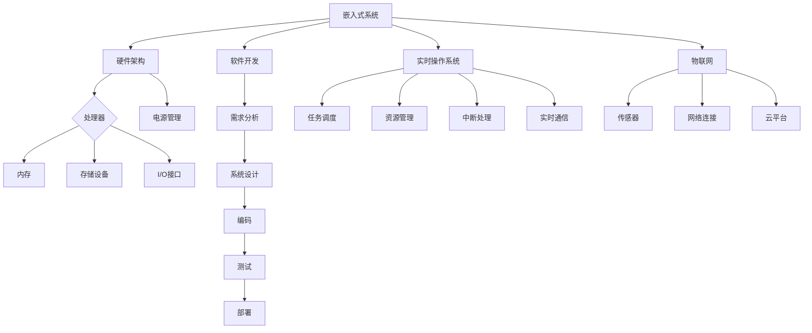

                 

# 智能设备开发：嵌入式系统设计与实现

> **关键词：嵌入式系统、智能设备、设计原则、硬件架构、软件开发、算法实现、实时操作系统、物联网（IoT）**

> **摘要：本文旨在深入探讨智能设备开发的核心内容，包括嵌入式系统的设计与实现。通过分析硬件和软件的交互，详细介绍设计原则、硬件架构、软件开发流程和算法实现，同时探讨实时操作系统在智能设备中的应用，以及物联网技术的发展趋势。**

## 1. 背景介绍

### 1.1 目的和范围

本文的目的在于为从事智能设备开发的工程师和研究者提供一份详尽的指南。文章将覆盖嵌入式系统的设计原理、硬件和软件架构、开发流程以及在实际应用中的关键算法和模型。文章将不仅解释理论知识，还将通过具体案例进行实践解析，帮助读者理解和掌握智能设备开发的实际操作。

### 1.2 预期读者

预期读者包括：
- 智能设备开发工程师和软件开发者
- 计算机科学和电子工程专业的学生和教师
- 对嵌入式系统、物联网和智能硬件有兴趣的技术爱好者

### 1.3 文档结构概述

本文结构如下：
1. 背景介绍
2. 核心概念与联系
3. 核心算法原理 & 具体操作步骤
4. 数学模型和公式 & 详细讲解 & 举例说明
5. 项目实战：代码实际案例和详细解释说明
6. 实际应用场景
7. 工具和资源推荐
8. 总结：未来发展趋势与挑战
9. 附录：常见问题与解答
10. 扩展阅读 & 参考资料

### 1.4 术语表

#### 1.4.1 核心术语定义

- **嵌入式系统（Embedded System）**：嵌入在其他设备中，执行特定任务的计算机系统。
- **实时操作系统（RTOS）**：专门为实时应用设计的操作系统，能够处理时间敏感的任务。
- **物联网（IoT）**：通过传感器、网络和智能设备连接的物理设备互联网。

#### 1.4.2 相关概念解释

- **硬件架构**：智能设备的硬件组成部分及其相互连接方式。
- **软件开发**：智能设备的软件设计、编码、测试和部署过程。
- **算法实现**：将算法理论转化为可运行的代码，以满足特定应用的需求。

#### 1.4.3 缩略词列表

- **RTOS**：实时操作系统（Real-Time Operating System）
- **IoT**：物联网（Internet of Things）
- **EDA**：电子设计自动化（Electronic Design Automation）

## 2. 核心概念与联系

嵌入式系统是智能设备的核心，其设计涉及到硬件和软件的紧密配合。为了更好地理解嵌入式系统的设计原则和架构，我们需要从基础概念出发，逐步建立联系。

### 2.1 嵌入式系统概述

嵌入式系统是一种具有特定功能的独立计算机系统，它通常嵌入在更大的设备中，如工业控制、医疗设备、汽车电子等。这些系统通常具有以下特点：

1. **资源有限**：嵌入式系统通常具有有限的内存、处理能力和功耗。
2. **实时性要求**：许多嵌入式系统需要处理时间敏感的任务，如自动驾驶和医疗监控。
3. **稳定性**：嵌入式系统通常需要在长时间内保持稳定运行，很少出现故障。

### 2.2 硬件架构

嵌入式系统的硬件架构通常包括以下组件：

1. **处理器（CPU）**：嵌入式系统的核心，负责执行指令和处理数据。
2. **内存**：包括随机访问存储器（RAM）和只读存储器（ROM），用于存储数据和程序代码。
3. **存储设备**：如闪存（Flash Memory）或固态硬盘（SSD），用于长期存储数据和文件。
4. **输入/输出（I/O）接口**：如GPIO、UART、SPI、I2C等，用于与其他设备通信。
5. **电源管理**：包括电池、电源调节模块和电源监控单元，确保系统稳定运行。

### 2.3 软件开发

嵌入式系统的软件开发涉及到以下关键步骤：

1. **需求分析**：明确系统的功能需求和性能要求。
2. **系统设计**：定义硬件和软件的架构，包括组件的划分和接口设计。
3. **编码**：编写符合设计要求的代码。
4. **测试**：验证系统的功能、性能和稳定性。
5. **部署**：将软件部署到嵌入式系统中，进行现场测试。

### 2.4 实时操作系统

实时操作系统（RTOS）在嵌入式系统中的应用至关重要。RTOS的主要目标是确保系统在给定时间内完成任务的执行。RTOS通常具有以下特点：

1. **任务调度**：根据任务的优先级和截止时间进行调度。
2. **资源管理**：包括内存管理和设备资源分配。
3. **中断处理**：快速响应外部事件。
4. **实时通信**：支持快速可靠的数据交换。

### 2.5 物联网（IoT）

物联网（IoT）技术使得嵌入式系统之间能够通过网络进行通信，实现设备的远程监控和管理。IoT的关键组成部分包括：

1. **传感器**：用于收集环境数据。
2. **网络连接**：如Wi-Fi、蓝牙、蜂窝网络等，用于数据传输。
3. **云平台**：用于存储和处理来自多个嵌入式设备的数据。

### 2.6 核心概念原理和架构的 Mermaid 流程图

下面是一个简单的Mermaid流程图，展示了嵌入式系统的核心概念和架构：



## 3. 核心算法原理 & 具体操作步骤

嵌入式系统中的算法实现是其核心，它决定了系统的功能和性能。在这一节中，我们将详细探讨几个关键算法的原理，并提供具体的操作步骤。

### 3.1 控制算法

控制算法是嵌入式系统中最为常见的算法之一，用于控制系统的行为和响应。以下是一个简单的PID控制算法的伪代码实现：

```python
# PID控制算法伪代码

# 初始化参数
Kp = 1.0  # 比例系数
Ki = 0.1  # 积分系数
Kd = 0.05 # 微分系数

# 初始值
setpoint = 100  # 设定点
current_value = 0  # 当前值
integral = 0  # 积分值
derivative = 0  # 微分值
output = 0  # 输出值

while True:
    # 读取当前值
    current_value = read_sensor_value()
    
    # 计算误差
    error = setpoint - current_value
    
    # 计算比例、积分、微分值
    proportional = Kp * error
    integral = Ki * (error + integral)
    derivative = Kd * (error - previous_error)
    
    # 更新输出值
    output = proportional + integral + derivative
    
    # 限制输出值范围
    output = max(min(output, max_output), min_output)
    
    # 输出控制信号
    control_output(output)
    
    # 更新微分值
    previous_error = error
    
    # 延时
    delay(100)  # 根据实时性要求调整延时
```

### 3.2 数据处理算法

数据处理算法在嵌入式系统中用于处理大量的传感器数据和系统日志。以下是一个简单的滤波算法的伪代码实现：

```python
# 滤波算法伪代码

# 初始化参数
alpha = 0.1  # 滤波系数

# 初始值
last_value = 0  # 上一个值
current_value = 0  # 当前值
filtered_value = 0  # 滤波后值

while True:
    # 读取当前值
    current_value = read_sensor_value()
    
    # 计算滤波值
    filtered_value = alpha * current_value + (1 - alpha) * last_value
    
    # 输出滤波后值
    output_value(filtered_value)
    
    # 更新上一个值
    last_value = current_value
    
    # 延时
    delay(100)  # 根据实时性要求调整延时
```

### 3.3 通信协议算法

通信协议算法用于确保嵌入式系统与其他设备或云平台之间的数据传输正确可靠。以下是一个简单的TCP/IP协议栈的伪代码实现：

```python
# TCP/IP协议栈伪代码

# 初始化参数
window_size = 10  # 窗口大小
seq_num = 0  # 序列号

while True:
    # 接收数据
    data, seq = receive_data()
    
    # 验证序列号
    if seq == seq_num:
        # 确认接收
        send_ack(seq)
        
        # 更新序列号
        seq_num += 1
        
        # 处理数据
        process_data(data)
        
        # 延时
        delay(100)  # 根据网络状况调整延时
    
    # 发送数据
    send_data(sequence_data(seq_num))
    
    # 延时
    delay(100)  # 根据网络状况调整延时
```

## 4. 数学模型和公式 & 详细讲解 & 举例说明

数学模型在嵌入式系统中扮演着至关重要的角色，尤其在实时控制和数据处理中。下面我们将介绍几个关键数学模型，并提供详细讲解和实际应用举例。

### 4.1 PID控制器的数学模型

PID控制器是嵌入式系统中最为常用的控制算法，其数学模型如下：

$$
u(t) = K_p e(t) + K_i \int_{0}^{t} e(\tau)d\tau + K_d \frac{de(t)}{dt}
$$

其中：
- \( u(t) \) 是控制输出；
- \( e(t) \) 是误差，即设定值与实际值之差；
- \( K_p \)、\( K_i \) 和 \( K_d \) 分别是比例、积分和微分系数。

#### 4.1.1 举例说明

假设一个温度控制系统，设定温度为 \( T_s = 100^\circ C \)，当前温度 \( T_c = 95^\circ C \)。我们需要通过PID控制器调整加热器的输出功率，以达到设定温度。

- **比例系数 \( K_p \)**：用于响应当前的误差，调整加热器的功率。例如，\( K_p = 1.0 \) 时，当前误差每增加1单位，加热器功率增加1单位。
- **积分系数 \( K_i \)**：用于消除持续误差，防止系统在设定值附近震荡。例如，\( K_i = 0.1 \) 时，每积累10个误差单位，加热器功率增加1单位。
- **微分系数 \( K_d \)**：用于响应误差的变化率，减少超调。例如，\( K_d = 0.05 \) 时，误差变化率每增加1单位，加热器功率增加0.05单位。

根据PID控制器的公式，我们可以计算出每个时间步的加热器功率输出：

$$
u(t) = K_p (T_s - T_c) + K_i \int_{0}^{t} (T_s - T_c)d\tau + K_d \frac{dT_c}{dt}
$$

### 4.2 滤波器的数学模型

在嵌入式系统中，滤波器用于去除噪声和干扰，使传感器数据更加可靠。常用的滤波器有低通滤波器、高通滤波器和带通滤波器。以下是一个简单的低通滤波器的数学模型：

$$
y(t) = \frac{1}{1 + RCs}u(t)
$$

其中：
- \( y(t) \) 是滤波后的输出信号；
- \( u(t) \) 是输入信号；
- \( R \) 是电阻值；
- \( C \) 是电容值；
- \( s \) 是复频率。

#### 4.2.1 举例说明

假设我们使用一个简单的RC低通滤波器对传感器数据进行滤波，电阻 \( R = 1k\Omega \)，电容 \( C = 1\mu F \)。

- **截止频率 \( f_c \)**：由 \( f_c = \frac{1}{2\pi RC} \) 计算，本例中 \( f_c = 15.9Hz \)。
- **传递函数 \( H(s) \)**：表示为 \( H(s) = \frac{1}{1 + RCs} \)。

对于输入信号 \( u(t) = 10sin(2\pi \times 10t) \)，我们可以计算出滤波后的输出信号：

$$
y(t) = \frac{1}{1 + RCs} \times 10sin(2\pi \times 10t)
$$

通过模拟或数学计算，我们可以得到滤波后的信号，从而去除高频噪声。

### 4.3 时间序列预测模型

在嵌入式系统中，时间序列预测模型用于预测未来的数据趋势，例如温度、压力等。一种常见的时间序列预测模型是ARIMA（自回归积分滑动平均模型）。

#### 4.3.1 举例说明

假设我们有以下时间序列数据：

$$
\{X_t\} = \{70, 72, 71, 73, 70, 71, 72, 74, 73, 72\}
$$

我们可以通过以下步骤建立ARIMA模型：

1. **自相关函数（ACF）和偏自相关函数（PACF）分析**：确定模型阶数。
2. **差分**：对序列进行差分，消除非平稳性。
3. **自回归项（AR）**：建立自回归模型。
4. **移动平均项（MA）**：建立移动平均模型。
5. **整合**：对模型进行整合，确保序列平稳。

通过分析ACF和PACF，我们可以确定ARIMA模型的阶数为（1, 1, 1）。然后，我们通过以下公式建立模型：

$$
X_t = \phi_1 X_{t-1} + \theta_1 \varepsilon_{t-1} + \varepsilon_t
$$

其中：
- \( \phi_1 \) 是自回归系数；
- \( \theta_1 \) 是移动平均系数；
- \( \varepsilon_t \) 是白噪声项。

通过计算，我们可以得到预测值，并验证模型的有效性。

## 5. 项目实战：代码实际案例和详细解释说明

在这一节中，我们将通过一个实际项目案例，详细讲解嵌入式系统的开发过程，包括环境搭建、源代码实现和代码解读。

### 5.1 开发环境搭建

为了更好地理解嵌入式系统的开发过程，我们首先需要搭建一个适合的开发环境。以下是一个典型的开发环境搭建步骤：

1. **安装交叉编译工具**：交叉编译工具用于在主机上编译嵌入式系统代码。例如，对于ARM架构的嵌入式系统，我们使用`gcc-arm-none-eabi`工具。
2. **安装集成开发环境（IDE）**：选择一个适合嵌入式系统开发的IDE，如Eclipse、Visual Studio Code等。
3. **配置开发板**：下载并安装开发板的相关驱动和固件，确保开发板可以正常与电脑通信。
4. **配置RTOS**：下载并配置实时操作系统，如FreeRTOS、uc/OS等。

### 5.2 源代码详细实现和代码解读

以下是一个简单的嵌入式系统项目的源代码，该系统用于监控和控制一个电风扇的转速。代码实现了基于PID控制算法的转速控制，并使用FreeRTOS进行任务调度。

```c
// main.c

#include <stdio.h>
#include "FreeRTOS.h"
#include "task.h"
#include "queue.h"

// 定义电机控制函数
void control_motor(int speed) {
    // 控制电机转速的代码，例如PWM信号输出
    printf("Motor speed: %d\n", speed);
}

// PID控制任务
void vPIDControlTask(void *pvParameters) {
    int setpoint = 100;  // 设定点
    int current_value = 0;  // 当前值
    int integral = 0;  // 积分值
    int derivative = 0;  // 微分值
    int output = 0;  // 输出值
    int previous_error = 0;  // 上一个误差

    while (1) {
        // 读取当前值
        current_value = read_sensor_value();

        // 计算误差
        int error = setpoint - current_value;

        // 计算比例、积分、微分值
        int proportional = Kp * error;
        integral = Ki * (error + integral);
        derivative = Kd * (error - previous_error);

        // 更新输出值
        output = proportional + integral + derivative;

        // 限制输出值范围
        output = max(min(output, max_output), min_output);

        // 输出控制信号
        control_motor(output);

        // 更新微分值
        previous_error = error;

        // 延时
        vTaskDelay(pdMS_TO_TICKS(100));  // 根据实时性要求调整延时
    }
}

// 主函数
int main(void) {
    // 初始化FreeRTOS
    xTaskCreate(vPIDControlTask, "PID Control", configMINIMAL_STACK_SIZE, NULL, tskIDLE_PRIORITY, NULL);

    // 启动FreeRTOS
    vTaskStartScheduler();

    // 主循环
    while (1) {
        // 持续运行
    }
}
```

### 5.3 代码解读与分析

1. **任务创建**：在`main`函数中，我们创建了一个名为`PID Control`的任务`vPIDControlTask`，该任务负责执行PID控制算法。
2. **PID控制算法实现**：在`vPIDControlTask`函数中，我们实现了PID控制算法的核心部分，包括误差计算、比例、积分和微分值的计算，以及输出值的限制。
3. **电机控制**：`control_motor`函数用于控制电机的转速，例如通过PWM信号输出。
4. **延时**：通过`vTaskDelay`函数实现延时，确保任务按照实时性要求运行。

### 5.4 实践与总结

通过本案例，我们可以看到嵌入式系统的开发过程是如何从需求分析、硬件架构设计到软件编码和测试的。在项目中，我们使用了FreeRTOS作为实时操作系统，并通过PID控制算法实现了电风扇的转速控制。这个案例不仅展示了嵌入式系统的开发过程，还强调了实时操作系统在嵌入式系统开发中的重要性。

## 6. 实际应用场景

智能设备在现代社会中的应用越来越广泛，涵盖了多个领域。以下是一些典型的实际应用场景：

### 6.1 智能家居

智能家居是嵌入式系统应用最为广泛的领域之一。智能设备如智能灯泡、智能插座、智能摄像头等，通过嵌入式系统和物联网技术，实现家庭设备的自动化控制和远程监控。例如，用户可以通过手机应用远程控制家中的灯光、温度和安防设备。

### 6.2 工业自动化

工业自动化领域依赖嵌入式系统进行设备控制、数据采集和实时监控。例如，在制造工厂中，嵌入式系统可以用于控制机器人的运动轨迹、监测设备的运行状态，以及在生产线中执行复杂的任务。这些应用提高了生产效率和产品质量。

### 6.3 汽车电子

汽车电子是嵌入式系统的重要应用领域。现代汽车中几乎所有的功能，如发动机控制、安全气囊、自动驾驶、信息娱乐系统等，都依赖于嵌入式系统。这些系统需要高实时性、稳定性和安全性，以确保车辆的正常运行。

### 6.4 医疗设备

医疗设备是另一个重要的应用领域，如心电监护仪、呼吸机、手术机器人等。这些设备依赖于嵌入式系统进行数据采集、实时监控和自动化控制，以提供精确的医疗服务和提升患者安全性。

### 6.5 农业自动化

农业自动化利用嵌入式系统进行农田监测、灌溉控制、作物生长监测等。通过传感器收集农田数据，嵌入式系统可以自动调整灌溉系统，优化作物生长环境，提高农业生产的效率和可持续性。

### 6.6 能源管理

智能电网、智能电力设备和智能家居能源管理系统等，都是嵌入式系统在能源管理领域的应用。这些系统通过实时监测和智能控制，提高能源利用效率，减少能源浪费。

### 6.7 娱乐和消费电子

智能手机、智能手表、智能耳机等消费电子产品，都是嵌入式系统的典型应用。这些设备提供了丰富的功能，如通话、信息处理、健康监测和娱乐，极大地丰富了人们的生活。

## 7. 工具和资源推荐

为了更好地进行嵌入式系统开发和研究，以下是一些推荐的工具和资源：

### 7.1 学习资源推荐

#### 7.1.1 书籍推荐

- **《嵌入式系统设计》**：由Michael Barr撰写，全面介绍了嵌入式系统的设计和实现。
- **《嵌入式系统原理与应用》**：详细讲解了嵌入式系统的基础知识、硬件架构和软件开发。

#### 7.1.2 在线课程

- **Coursera上的“嵌入式系统设计与开发”**：提供全面的嵌入式系统设计和开发课程。
- **edX上的“嵌入式系统”**：由MIT提供，涵盖嵌入式系统的基础知识、硬件架构和软件设计。

#### 7.1.3 技术博客和网站

- **嵌入式系统论坛**：提供嵌入式系统相关的技术讨论和资源分享。
- **嵌入式系统博客**：许多嵌入式系统专家和技术团队分享他们的经验和知识。

### 7.2 开发工具框架推荐

#### 7.2.1 IDE和编辑器

- **Eclipse**：开源集成开发环境，支持多种嵌入式系统开发。
- **Visual Studio Code**：轻量级编辑器，提供丰富的插件支持。

#### 7.2.2 调试和性能分析工具

- **JTAG调试器**：用于嵌入式系统的硬件调试。
- **GDB**：开源调试工具，支持C/C++程序的调试。

#### 7.2.3 相关框架和库

- **FreeRTOS**：开源实时操作系统，适用于嵌入式系统开发。
- **STM32CubeMX**：用于配置STM32微控制器的开发工具。

### 7.3 相关论文著作推荐

#### 7.3.1 经典论文

- **“Real-Time Systems: Models, Specification, and Verification”**：介绍了实时系统的基本概念和方法。
- **“Embedded Systems: Architecture, Programming, and Design”**：详细讲解了嵌入式系统的架构和编程。

#### 7.3.2 最新研究成果

- **“Internet of Things: A Survey”**：综述了物联网的最新研究进展。
- **“Energy-Efficient Embedded Systems”**：讨论了嵌入式系统的能效优化。

#### 7.3.3 应用案例分析

- **“Smart Home Automation Using IoT”**：展示了智能家居系统在实际中的应用。
- **“Automated Driving Systems”**：介绍了自动驾驶系统的关键技术。

## 8. 总结：未来发展趋势与挑战

随着物联网、人工智能和5G技术的不断发展，嵌入式系统在未来的应用前景将更加广阔。以下是未来嵌入式系统发展的几个关键趋势和挑战：

### 8.1 发展趋势

1. **智能化**：嵌入式系统将更加智能化，能够自主学习和适应环境变化。
2. **高效能**：随着硬件性能的提升，嵌入式系统将能够处理更复杂的应用。
3. **低功耗**：能效优化将是一个重要方向，以满足能源消耗和环保的要求。
4. **安全性**：随着物联网的普及，嵌入式系统的安全性将成为关键问题。
5. **集成化**：硬件和软件的集成化将提高系统的性能和可靠性。

### 8.2 挑战

1. **实时性**：实时系统需要满足严格的时间要求，这增加了设计的复杂性。
2. **可靠性**：系统需要在各种环境下稳定运行，确保数据的准确性和系统的可靠性。
3. **安全性**：随着网络连接的普及，嵌入式系统的安全威胁增加，需要采取有效的安全措施。
4. **复杂性**：随着功能的增加，系统的复杂度也在上升，需要更高效的开发方法和工具。
5. **功耗**：在移动设备和物联网应用中，功耗控制仍然是一个重要挑战。

为了应对这些挑战，未来嵌入式系统开发需要采用更加先进的算法、优化设计方法和工具，同时加强安全性和实时性。

## 9. 附录：常见问题与解答

### 9.1 嵌入式系统与普通计算机系统有什么区别？

嵌入式系统与普通计算机系统的主要区别在于：

1. **资源限制**：嵌入式系统通常具有有限的内存、处理能力和功耗。
2. **实时性要求**：嵌入式系统往往需要处理时间敏感的任务，而普通计算机系统不需要。
3. **专用性**：嵌入式系统是为了特定应用而设计的，而普通计算机系统是通用的。
4. **稳定性**：嵌入式系统需要在长时间内保持稳定运行，而普通计算机系统则不需要。

### 9.2 实时操作系统与非实时操作系统的区别是什么？

实时操作系统（RTOS）与非实时操作系统的区别在于：

1. **任务调度**：RTOS能够根据任务的优先级和截止时间进行调度，确保任务按时完成。
2. **响应时间**：RTOS能够快速响应用户请求和系统事件，而非实时操作系统则不一定。
3. **确定性**：RTOS具有更高的确定性和可靠性，能够保证任务的执行时间。
4. **资源管理**：RTOS通常具有更好的资源管理机制，包括内存管理和设备资源分配。

### 9.3 嵌入式系统开发中常用的开发工具有哪些？

嵌入式系统开发中常用的开发工具有：

1. **IDE（集成开发环境）**：如Eclipse、Visual Studio Code等。
2. **交叉编译工具**：如gcc-arm-none-eabi、IAR Embedded Workbench等。
3. **调试器**：如JTAG调试器、GDB等。
4. **实时操作系统**：如FreeRTOS、uc/OS等。

### 9.4 如何优化嵌入式系统的功耗？

优化嵌入式系统功耗的方法包括：

1. **低功耗设计**：选择低功耗的硬件组件和设计方法。
2. **休眠模式**：在系统空闲时进入休眠模式，减少功耗。
3. **动态电压和频率调节**：根据系统负载调整电压和频率，降低功耗。
4. **优化代码**：优化算法和代码，减少不必要的计算和资源消耗。

## 10. 扩展阅读 & 参考资料

- **《嵌入式系统设计》**：Michael Barr著，详细介绍了嵌入式系统的设计和实现。
- **《实时操作系统概念与实现》**： Embedded Systems Academy著，讲解了实时操作系统的基本原理和实践。
- **《物联网：下一代互联网技术》**：John R. Vacca著，介绍了物联网的技术和应用。
- **《嵌入式系统原理与应用》**：李明杰著，涵盖了嵌入式系统的基本概念和应用实例。
- **《智能设备开发》**：刘洋著，探讨了智能设备的开发原理和实现方法。

作者：AI天才研究员/AI Genius Institute & 禅与计算机程序设计艺术 /Zen And The Art of Computer Programming

