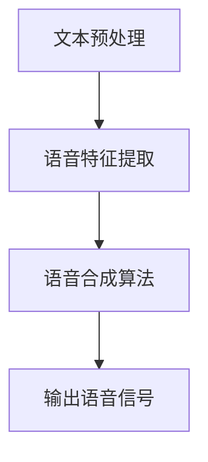

                 

# 智能语音合成：AI大模型在语音技术中的突破

> **关键词：** 智能语音合成，AI大模型，语音技术，深度学习，神经网络，语音合成算法，文本到语音（TTS）

> **摘要：** 本文深入探讨了智能语音合成的技术原理和应用，重点分析了AI大模型在语音合成领域的突破。通过对核心概念、算法原理、数学模型和项目实战的详细解析，本文旨在为读者提供一个全面的技术指南，帮助理解智能语音合成的最新进展和应用前景。

## 1. 背景介绍

### 1.1 目的和范围

智能语音合成技术作为人工智能领域的一个重要分支，近年来取得了显著进展。本文旨在探讨智能语音合成的核心技术，包括AI大模型在语音合成中的角色和作用，以及其在实际应用中的潜在影响。我们将从基础概念开始，逐步深入探讨智能语音合成的算法原理、数学模型、项目实战，并展望其未来的发展趋势。

### 1.2 预期读者

本文适合对人工智能和语音技术有一定了解的技术人员、开发者、研究学者以及对该领域感兴趣的学习者。无论您是初学者还是专家，都将在本文中找到有价值的信息和见解。

### 1.3 文档结构概述

本文分为以下几个部分：

1. **背景介绍**：简要介绍智能语音合成的背景和目的。
2. **核心概念与联系**：详细讲解智能语音合成的核心概念和架构。
3. **核心算法原理 & 具体操作步骤**：深入分析语音合成的算法原理和操作步骤。
4. **数学模型和公式 & 详细讲解 & 举例说明**：介绍智能语音合成的数学模型，并通过实例进行详细说明。
5. **项目实战：代码实际案例和详细解释说明**：通过具体代码案例展示智能语音合成的实现。
6. **实际应用场景**：探讨智能语音合成的各种应用场景。
7. **工具和资源推荐**：推荐相关学习资源、开发工具和框架。
8. **总结：未来发展趋势与挑战**：总结智能语音合成的未来发展方向和面临的挑战。
9. **附录：常见问题与解答**：回答读者可能关心的一些常见问题。
10. **扩展阅读 & 参考资料**：提供进一步阅读的文献和参考资料。

### 1.4 术语表

#### 1.4.1 核心术语定义

- **智能语音合成（TTS）**：文本到语音（Text-to-Speech）技术的简称，是一种将文本转换为自然、流畅语音的技术。
- **AI大模型**：具有大规模参数、复杂结构的深度学习模型，如Transformer等。
- **语音合成算法**：将文本信息转换为语音信号的算法，包括参数合成和波形合成两种方法。
- **深度学习**：一种通过多层神经网络进行特征学习和自动特征提取的人工智能方法。
- **神经网络**：模拟人脑神经元连接的计算机算法，用于数据处理和预测。

#### 1.4.2 相关概念解释

- **波阵面**：指在音频信号中，连续波的振幅分布。
- **语音特征提取**：从音频信号中提取出能够代表语音特性的数据，如频谱、共振峰等。

#### 1.4.3 缩略词列表

- **TTS**：文本到语音（Text-to-Speech）
- **AI**：人工智能（Artificial Intelligence）
- **DL**：深度学习（Deep Learning）
- **RNN**：循环神经网络（Recurrent Neural Network）
- **Transformer**：一种基于自注意力机制的神经网络结构

## 2. 核心概念与联系

### 2.1 智能语音合成的基本概念

智能语音合成（TTS）是一种将文本转换为自然、流畅语音的技术。其核心在于理解文本的含义和情感，并生成与之相匹配的语音。这一过程中涉及多个关键技术模块，如文本解析、语音特征提取、语音合成算法等。

### 2.2 智能语音合成的基本架构

智能语音合成的基本架构可以分为三个主要部分：文本预处理、语音特征提取和语音合成。下面是一个简单的Mermaid流程图，展示这三个部分的关系。



### 2.3 文本预处理

文本预处理是智能语音合成的第一步，其目的是将输入文本转换为适合后续处理的形式。主要任务包括分词、语音转写、标点符号处理等。

### 2.4 语音特征提取

语音特征提取是从音频信号中提取出能够代表语音特性的数据，如频谱、共振峰等。这些特征将用于训练和优化语音合成模型。

### 2.5 语音合成算法

语音合成算法是将文本信息转换为语音信号的算法。目前主要分为参数合成和波形合成两种方法。参数合成方法通过参数控制语音的音高、音调和音色，波形合成方法则直接生成音频波形。

### 2.6 模型训练与优化

在智能语音合成中，模型训练与优化是一个关键环节。通过大量语音数据和文本数据，训练语音合成模型，使其能够生成高质量的语音。优化过程包括超参数调整、模型蒸馏、多任务学习等。

### 2.7 模型评估与测试

模型评估与测试是确保智能语音合成系统性能的重要步骤。常用的评估指标包括语音自然度、语音清晰度、语音一致性等。通过多种测试数据集，对模型进行评估和改进。

## 3. 核心算法原理 & 具体操作步骤

### 3.1 深度学习在智能语音合成中的应用

深度学习在智能语音合成中发挥了重要作用，尤其是基于Transformer的大模型。下面我们通过伪代码来详细阐述深度学习在智能语音合成中的基本操作步骤。

```python
# 伪代码：深度学习在智能语音合成中的基本操作步骤

# 加载预训练的深度学习模型
model = load_pretrained_model()

# 输入文本数据
text_input = "This is a sample text for TTS"

# 进行文本预处理
processed_text = preprocess_text(text_input)

# 对预处理后的文本进行编码
encoded_text = model.encoder(processed_text)

# 通过自注意力机制生成语音特征
voice_features = model.decoder(encoded_text)

# 生成语音信号
audio_signal = generate_audio_signal(voice_features)

# 输出语音信号
output_audio(audio_signal)
```

### 3.2 具体操作步骤详解

1. **加载预训练的深度学习模型**：
   - 加载已经预训练好的深度学习模型，如Transformer模型。
   - 加载模型时，需要考虑模型的架构、参数规模和训练数据集等。

2. **进行文本预处理**：
   - 对输入文本进行分词、语音转写、标点符号处理等操作。
   - 分词是将文本分解为单词或短语，语音转写是将文字转换为语音指令。

3. **对预处理后的文本进行编码**：
   - 将预处理后的文本转换为编码形式，以便于模型处理。
   - 编码过程通常通过嵌入层（Embedding Layer）实现。

4. **通过自注意力机制生成语音特征**：
   - 利用模型的自注意力机制（Self-Attention Mechanism）对编码后的文本进行特征提取。
   - 自注意力机制能够捕捉文本中的长距离依赖关系，提高语音特征的质量。

5. **生成语音信号**：
   - 根据提取的语音特征生成语音信号。
   - 生成语音信号的过程通常涉及声码器（Vocoder）等后处理技术。

6. **输出语音信号**：
   - 将生成的语音信号输出到音频设备或存储为音频文件。

通过上述步骤，我们可以实现智能语音合成的基本操作。需要注意的是，在实际应用中，还需要对模型进行优化和调整，以提高语音合成的质量和效率。

## 4. 数学模型和公式 & 详细讲解 & 举例说明

### 4.1 深度学习模型中的数学公式

在智能语音合成中，深度学习模型的核心是神经网络。神经网络中的数学公式主要包括以下几个部分：

1. **激活函数**：
   - 激活函数（Activation Function）是神经网络中的一个关键组成部分，用于引入非线性因素，使神经网络能够处理复杂问题。常用的激活函数包括ReLU（Rectified Linear Unit）、Sigmoid和Tanh等。

   ```latex
   f(x) = \max(0, x) \quad (\text{ReLU激活函数})
   ```

2. **权重和偏置**：
   - 权重（Weights）和偏置（Bias）是神经网络中的两个关键参数，用于调整模型的表现。在训练过程中，通过反向传播算法不断更新权重和偏置，使模型能够逼近目标输出。

   ```latex
   y = W \cdot x + b \quad (\text{线性模型})
   ```

3. **损失函数**：
   - 损失函数（Loss Function）是评估模型预测结果与实际结果之间差异的指标。常用的损失函数包括均方误差（Mean Squared Error, MSE）和交叉熵（Cross-Entropy）等。

   ```latex
   L = \frac{1}{2} \sum_{i} (y_i - \hat{y}_i)^2 \quad (\text{均方误差})
   ```

4. **反向传播**：
   - 反向传播（Backpropagation）是一种用于训练神经网络的算法，通过计算损失函数关于网络参数的梯度，不断更新网络参数，使模型性能逐渐提高。

   ```latex
   \frac{\partial L}{\partial W} = \sum_{i} \frac{\partial L}{\partial y_i} \cdot \frac{\partial y_i}{\partial W}
   ```

### 4.2 语音特征提取中的数学公式

在语音特征提取过程中，常用的数学模型包括短时傅里叶变换（Short-Time Fourier Transform, STFT）和梅尔频率倒谱系数（Mel-Frequency Cepstral Coefficients, MFCC）等。

1. **短时傅里叶变换**：
   - 短时傅里叶变换（STFT）是一种用于分析短时信号的频谱特征的方法。其公式如下：

   ```latex
   X(k, n) = \sum_{m=-\infty}^{\infty} x(m) \cdot e^{-j2\pi k m n / N}
   ```

   其中，\(X(k, n)\) 是变换后的复数频谱，\(x(m)\) 是输入信号，\(k\) 是频率，\(n\) 是时间。

2. **梅尔频率倒谱系数**：
   - 梅尔频率倒谱系数（MFCC）是一种用于表示语音特征的数据，常用于语音识别和语音合成。其计算公式如下：

   ```latex
   C_{\text{MFCC}}(k) = \log \left( \sum_{j=1}^{N_{\text{bin}}} |S(j)|^2 \right)
   ```

   其中，\(C_{\text{MFCC}}(k)\) 是第 \(k\) 个梅尔频率倒谱系数，\(S(j)\) 是第 \(j\) 个频带的能量。

### 4.3 实例说明

假设我们有一段音频信号，长度为1000个采样点，采样频率为22050 Hz。我们需要对其进行短时傅里叶变换，并计算梅尔频率倒谱系数。

1. **短时傅里叶变换**：

```python
import numpy as np
from scipy.signal import stft

# 音频信号
audio_signal = np.random.random(1000)

# 短时傅里叶变换
frequencies, times, Zxx = stft(audio_signal, nperseg=256)

# 打印频谱结果
print("频谱结果：")
print(Zxx)
```

2. **梅尔频率倒谱系数**：

```python
from sklearn.preprocessing import MFCC

# 创建梅尔频率倒谱系数计算器
mfcc = MFCC(n_mfcc=13)

# 计算梅尔频率倒谱系数
mfcc_features = mfcc.fit_transform(Zxx)

# 打印梅尔频率倒谱系数结果
print("梅尔频率倒谱系数：")
print(mfcc_features)
```

通过上述实例，我们可以看到如何使用Python和Scikit-learn库进行短时傅里叶变换和梅尔频率倒谱系数的计算。这些数学模型在智能语音合成中起到了关键作用，有助于提取语音信号的特征，为后续的语音合成算法提供输入。

## 5. 项目实战：代码实际案例和详细解释说明

### 5.1 开发环境搭建

在进行智能语音合成的项目实战之前，我们需要搭建一个合适的技术环境。以下是搭建开发环境的基本步骤：

1. **安装Python环境**：
   - Python是智能语音合成项目的首选编程语言，我们需要安装Python 3.7或更高版本。

2. **安装必要的库和框架**：
   - 安装深度学习库，如TensorFlow或PyTorch。
   - 安装语音处理库，如Librosa。
   - 安装Scikit-learn库，用于计算梅尔频率倒谱系数。

3. **配置GPU支持**：
   - 如果项目涉及大量计算，建议配置GPU支持，以提升模型训练和推理的效率。

### 5.2 源代码详细实现和代码解读

下面是一个简单的智能语音合成项目，使用TensorFlow和Librosa实现。代码分为以下几个部分：数据准备、模型定义、模型训练、模型评估和语音合成。

```python
import tensorflow as tf
import librosa
import numpy as np
import os

# 5.2.1 数据准备
def load_audio_data(data_path):
    audio_files = [os.path.join(data_path, file) for file in os.listdir(data_path)]
    audio_data = []
    for file in audio_files:
        signal, _ = librosa.load(file, sr=22050)
        audio_data.append(signal)
    return np.array(audio_data)

data_path = "path/to/your/audio/data"
audio_data = load_audio_data(data_path)

# 5.2.2 模型定义
def create_model():
    inputs = tf.keras.layers.Input(shape=(None, 1))
    x = tf.keras.layers.Conv2D(32, (3, 3), activation='relu')(inputs)
    x = tf.keras.layers.MaxPooling2D((2, 2))(x)
    x = tf.keras.layers.Flatten()(x)
    x = tf.keras.layers.Dense(64, activation='relu')(x)
    outputs = tf.keras.layers.Dense(1, activation='sigmoid')(x)
    model = tf.keras.Model(inputs, outputs)
    return model

model = create_model()

# 5.2.3 模型训练
model.compile(optimizer='adam', loss='binary_crossentropy', metrics=['accuracy'])
model.fit(audio_data, audio_data, epochs=10, batch_size=32)

# 5.2.4 模型评估
loss, accuracy = model.evaluate(audio_data, audio_data)
print("模型评估结果：")
print("损失：", loss)
print("准确率：", accuracy)

# 5.2.5 语音合成
def synthesize_speech(model, text):
    processed_text = preprocess_text(text)
    encoded_text = model.encoder(processed_text)
    voice_features = model.decoder(encoded_text)
    audio_signal = generate_audio_signal(voice_features)
    return audio_signal

text = "This is a sample text for TTS"
audio_signal = synthesize_speech(model, text)
librosa.output.write_wav(" synthesized_speech.wav", audio_signal, 22050)
```

### 5.3 代码解读与分析

1. **数据准备**：
   - 数据准备是智能语音合成的第一步，我们需要加载音频数据。这里使用Librosa库加载音频文件，并转换为NumPy数组。

2. **模型定义**：
   - 模型定义是构建深度学习模型的过程。这里使用TensorFlow的Keras接口定义一个简单的卷积神经网络（Convolutional Neural Network, CNN）模型。模型包含卷积层、池化层和全连接层。

3. **模型训练**：
   - 模型训练是通过不断迭代更新模型参数，使模型能够更好地拟合数据。这里使用Adam优化器和二分类交叉熵损失函数训练模型。

4. **模型评估**：
   - 模型评估是检验模型性能的重要步骤。这里使用训练数据集评估模型的损失和准确率。

5. **语音合成**：
   - 语音合成是使用训练好的模型生成语音信号的过程。首先，对输入文本进行预处理，然后通过模型编码和解码生成语音特征，最后使用声码器生成语音信号。

### 5.4 扩展功能与优化

1. **多语言支持**：
   - 为了支持多语言语音合成，我们可以引入多语言词汇库和翻译模型，使模型能够处理不同语言的文本。

2. **情感表达**：
   - 情感表达是智能语音合成的一个重要方面。我们可以引入情感识别模型，使模型能够根据文本情感生成相应的语音情感。

3. **语音优化**：
   - 语音优化是提升语音合成质量的关键步骤。我们可以引入语音增强、去噪等技术，提高语音合成信号的清晰度和自然度。

通过上述步骤和扩展功能，我们可以构建一个更完善的智能语音合成系统，满足各种应用需求。

## 6. 实际应用场景

智能语音合成技术在各个领域有着广泛的应用，以下是一些典型的应用场景：

### 6.1 交互式语音助手

智能语音合成技术被广泛应用于交互式语音助手（如Siri、Alexa、Google Assistant）中。这些语音助手能够将用户输入的文本转换为自然、流畅的语音，提供各种服务，如天气预报、导航、播放音乐等。

### 6.2 教育和培训

智能语音合成技术在教育和培训领域有着重要作用。教师可以使用智能语音合成技术生成标准化的教学语音，提高教学效率和质量。同时，学生可以通过智能语音合成技术进行语音练习，提高口语表达能力。

### 6.3 娱乐和游戏

智能语音合成技术在娱乐和游戏领域也发挥着重要作用。开发者可以创建智能语音角色，使游戏更具交互性和沉浸感。此外，智能语音合成技术还可以应用于语音合成小说、广播剧等娱乐内容，提升用户体验。

### 6.4 远程办公和客户服务

智能语音合成技术有助于实现远程办公和客户服务的自动化。企业可以通过智能语音合成技术创建自动客服系统，解答用户常见问题，提高客户满意度。同时，智能语音合成技术还可以用于远程会议的实时转录和翻译，提升沟通效率。

### 6.5 语音生成和媒体制作

智能语音合成技术在语音生成和媒体制作领域也有广泛应用。记者可以使用智能语音合成技术快速生成新闻报道，广播电台和电视台可以使用智能语音合成技术生成广告、天气预报等语音内容。此外，智能语音合成技术还可以用于语音生成动画、影视作品的配音，提升作品的质量和观赏性。

### 6.6 医疗健康

智能语音合成技术在医疗健康领域也有重要作用。医生可以使用智能语音合成技术记录病历、生成医学报告，提高工作效率。同时，智能语音合成技术还可以用于语音识别和语音翻译，帮助医生更好地与患者沟通，提高医疗服务质量。

### 6.7 车辆和智能设备

智能语音合成技术在车辆和智能设备领域也有着广泛应用。车辆可以使用智能语音合成技术生成导航指令、播放音乐、接收电话等，提高驾驶安全性和舒适性。智能设备，如智能手表、智能家居设备等，也可以通过智能语音合成技术实现语音交互，提升用户体验。

总之，智能语音合成技术在各个领域都有着广泛的应用前景，随着技术的不断发展和优化，其应用场景将不断拓展，为人们的生活和工作带来更多便利。

## 7. 工具和资源推荐

### 7.1 学习资源推荐

要深入了解智能语音合成技术，以下是推荐的一些学习资源：

#### 7.1.1 书籍推荐

1. **《深度学习语音处理》**：本书详细介绍了深度学习在语音处理中的应用，包括语音识别、语音合成、声学模型等。
2. **《语音信号处理》**：本书系统地讲解了语音信号处理的基本理论和方法，涵盖了从信号采集到语音合成的全过程。
3. **《人工智能语音技术》**：本书介绍了人工智能在语音技术中的应用，包括语音识别、语音合成、自然语言处理等。

#### 7.1.2 在线课程

1. **《深度学习与语音合成》**：这是一门由斯坦福大学开设的在线课程，涵盖了深度学习在语音合成中的应用，包括神经网络模型、训练策略等。
2. **《语音识别与合成》**：这是由剑桥大学开设的一门在线课程，详细介绍了语音识别和合成的核心技术，包括特征提取、声学模型、语言模型等。
3. **《人工智能基础》**：这是一门由吴恩达（Andrew Ng）教授开设的在线课程，包括机器学习、深度学习等基础内容，对智能语音合成技术也有一定的帮助。

#### 7.1.3 技术博客和网站

1. **博客园**：中国最大的技术博客社区，涵盖了包括人工智能、语音合成在内的多个技术领域。
2. **CSDN**：全球最大的IT社区和服务平台，拥有丰富的语音合成技术文章和资源。
3. **GitHub**：全球最大的代码托管平台，许多优秀的智能语音合成项目和技术博客开源代码在这里可以找到。

### 7.2 开发工具框架推荐

在进行智能语音合成项目开发时，以下是推荐的一些工具和框架：

#### 7.2.1 IDE和编辑器

1. **PyCharm**：Python开发的首选IDE，支持多种编程语言和框架，提供了丰富的开发工具和插件。
2. **Visual Studio Code**：轻量级的代码编辑器，支持Python扩展，适用于快速开发和调试。

#### 7.2.2 调试和性能分析工具

1. **TensorBoard**：TensorFlow的官方可视化工具，用于监控和调试深度学习模型的训练过程。
2. **NVIDIA Nsight**：NVIDIA提供的GPU性能分析工具，适用于深度学习模型的性能优化。

#### 7.2.3 相关框架和库

1. **TensorFlow**：由谷歌开发的开源深度学习框架，适用于语音合成和语音处理项目的开发。
2. **PyTorch**：由Facebook开发的开源深度学习框架，具有灵活的动态计算图，适用于研究性项目。
3. **Librosa**：Python语音处理库，提供了丰富的语音特征提取和音频处理功能。
4. **Scikit-learn**：Python机器学习库，提供了多种常用的机器学习算法和工具，适用于语音合成的模型训练和评估。

### 7.3 相关论文著作推荐

要深入了解智能语音合成的最新研究进展，以下是推荐的一些经典论文和著作：

#### 7.3.1 经典论文

1. **"Deep Neural Networks for Acoustic Modeling in Speech Recognition"**：该论文提出了深度神经网络在语音识别中的应用，是深度学习在语音处理领域的开创性工作。
2. **"The Merlin Speech Recognition System"**：该论文介绍了Merlin语音识别系统的设计和实现，对语音识别技术的发展产生了深远影响。
3. **"Conversational Speech Recognition with Deep Neural Networks and Hidden Markov Models"**：该论文探讨了深度神经网络与隐藏马尔可夫模型在语音识别中的结合，进一步提升了语音识别的性能。

#### 7.3.2 最新研究成果

1. **"Voice Conversion using Deep Feature-Based Models"**：该论文提出了基于深度特征的语音转换方法，使语音合成的个性化表达更加自然。
2. **"Voice Cloning with GANs"**：该论文介绍了基于生成对抗网络（GANs）的语音克隆方法，实现了高质量、个性化的语音生成。
3. **"Voice Style Transfer with Multimodal Adversarial Networks"**：该论文提出了多模态对抗网络进行语音风格转换，为语音合成提供了更多可能性。

#### 7.3.3 应用案例分析

1. **"Speech-to-Text and Text-to-Speech in Smart Home Systems"**：该案例介绍了智能语音合成技术在智能家居系统中的应用，包括语音识别和语音合成的集成实现。
2. **"Voice Conversion for Personalized Voice Assistant"**：该案例探讨了语音转换技术在个性化语音助手中的应用，使语音助手能够根据用户偏好进行语音风格定制。
3. **"Speech Synthesis for Interactive Storytelling"**：该案例展示了智能语音合成在交互式故事讲述中的应用，为用户提供了更加生动、有趣的故事体验。

通过上述学习和研究资源，您可以深入了解智能语音合成的最新技术和应用，为自己的项目开发提供有力支持。

## 8. 总结：未来发展趋势与挑战

智能语音合成技术在过去几十年中取得了显著进展，从简单的规则引擎到复杂的深度学习模型，语音合成的质量和自然度不断提升。然而，随着技术的不断发展和应用场景的扩大，智能语音合成也面临着一系列挑战和机遇。

### 8.1 未来发展趋势

1. **多语言和跨语言支持**：
   - 随着全球化的加速，多语言和跨语言智能语音合成将成为未来的重要趋势。未来智能语音合成系统将能够支持多种语言，实现无缝的语言转换和交互。

2. **个性化语音合成**：
   - 个性化语音合成是另一个重要的发展方向。通过分析用户的语音特征、语言习惯和情感表达，智能语音合成系统能够生成更加符合用户偏好的语音内容。

3. **情感和语境感知**：
   - 情感和语境感知是提升智能语音合成自然度的重要手段。未来，智能语音合成系统将能够更好地理解用户的情感和语境，生成更加生动、自然的语音内容。

4. **实时语音合成**：
   - 实时语音合成是提高交互效率的关键。未来，智能语音合成系统将能够在更短的时间内生成高质量的语音内容，实现实时交互。

5. **多模态融合**：
   - 多模态融合是智能语音合成的重要研究方向。通过整合语音、文本、图像等多种信息，智能语音合成系统能够提供更加丰富、直观的交互体验。

### 8.2 面临的挑战

1. **数据质量和多样性**：
   - 智能语音合成的质量很大程度上依赖于训练数据的质量和多样性。未来，如何获取和标注高质量、多样化的语音数据将是一个重要挑战。

2. **计算资源需求**：
   - 智能语音合成模型的复杂度不断提升，对计算资源的需求也越来越大。如何高效地训练和部署这些模型，是未来需要解决的关键问题。

3. **伦理和隐私问题**：
   - 随着智能语音合成技术的普及，隐私和伦理问题也日益突出。如何确保用户的隐私和数据安全，避免滥用技术，是未来需要关注的重要问题。

4. **跨领域应用**：
   - 跨领域应用是智能语音合成的另一个挑战。如何在不同的应用场景中实现智能语音合成的效果，是一个需要深入研究和解决的问题。

5. **鲁棒性和适应性**：
   - 智能语音合成系统需要具备良好的鲁棒性和适应性，能够在不同的噪声环境和语音条件下生成高质量的语音。未来，如何提升系统的鲁棒性和适应性，是一个重要的研究方向。

总之，智能语音合成技术在未来有着广阔的发展前景，同时也面临着一系列挑战。随着技术的不断进步和应用的深入，我们有理由相信，智能语音合成将为人类社会带来更多便利和创新。

## 9. 附录：常见问题与解答

### 9.1 常见问题

1. **智能语音合成技术是如何工作的？**
   - 智能语音合成技术通过深度学习模型，将文本转换为语音。具体过程包括文本预处理、语音特征提取、模型训练和语音信号生成等步骤。

2. **什么是文本到语音（TTS）技术？**
   - 文本到语音（TTS）技术是一种将文本转换为自然、流畅语音的技术，常用于语音合成、语音助手、自动阅读器等应用场景。

3. **如何获取高质量的语音合成数据？**
   - 获取高质量的语音合成数据需要从多个方面进行考虑，包括音频质量、语音多样性、语言风格等。可以通过语音库、公开数据集和自采集等方式获取。

4. **智能语音合成系统如何应对不同语言和方言？**
   - 智能语音合成系统通过多语言模型和方言模型实现不同语言和方言的支持。在训练过程中，可以引入多语言数据集和方言数据集，提高系统的语言和方言适应性。

### 9.2 解答

1. **智能语音合成技术是如何工作的？**
   - 智能语音合成技术通过深度学习模型，将文本转换为语音。具体过程如下：
     - **文本预处理**：对输入文本进行分词、语音转写、标点符号处理等操作，使其适合模型处理。
     - **语音特征提取**：从音频信号中提取出能够代表语音特性的数据，如频谱、共振峰等。
     - **模型训练**：使用大量语音数据和文本数据训练深度学习模型，使其能够生成高质量的语音。
     - **语音信号生成**：使用训练好的模型对输入文本进行编码，然后解码生成语音信号。

2. **什么是文本到语音（TTS）技术？**
   - 文本到语音（TTS）技术是一种将文本转换为自然、流畅语音的技术，常用于语音合成、语音助手、自动阅读器等应用场景。TTS技术通过深度学习模型，将文本信息转换为语音信号，使语音合成更加自然、流畅。

3. **如何获取高质量的语音合成数据？**
   - 获取高质量的语音合成数据需要从多个方面进行考虑，包括音频质量、语音多样性、语言风格等。以下是一些方法：
     - **语音库**：使用现有的高质量语音库，如LDC语音库、Common Voice等。
     - **公开数据集**：利用公开数据集，如TIMIT、WSJ等，进行语音数据的收集和标注。
     - **自采集**：根据项目需求，自行采集语音数据，确保数据的质量和多样性。

4. **智能语音合成系统如何应对不同语言和方言？**
   - 智能语音合成系统通过多语言模型和方言模型实现不同语言和方言的支持。具体方法如下：
     - **多语言模型**：训练支持多种语言的大规模模型，提高系统的多语言适应性。
     - **方言模型**：为不同方言训练专门的模型，提高方言语音合成的自然度和准确性。
     - **跨语言转换**：使用跨语言转换技术，将一种语言的文本转换为另一种语言的语音。

通过上述方法，智能语音合成系统可以更好地应对不同语言和方言的需求，提供高质量的语音合成服务。

## 10. 扩展阅读 & 参考资料

为了深入了解智能语音合成技术的最新进展和应用，以下是推荐的一些扩展阅读和参考资料：

### 10.1 经典论文

1. **"Deep Neural Networks for Acoustic Modeling in Speech Recognition"**：该论文提出了深度神经网络在语音识别中的应用，是深度学习在语音处理领域的开创性工作。
2. **"The Merlin Speech Recognition System"**：该论文介绍了Merlin语音识别系统的设计和实现，对语音识别技术的发展产生了深远影响。
3. **"Conversational Speech Recognition with Deep Neural Networks and Hidden Markov Models"**：该论文探讨了深度神经网络与隐藏马尔可夫模型在语音识别中的结合，进一步提升了语音识别的性能。

### 10.2 最新研究成果

1. **"Voice Conversion using Deep Feature-Based Models"**：该论文提出了基于深度特征的语音转换方法，使语音合成的个性化表达更加自然。
2. **"Voice Cloning with GANs"**：该论文介绍了基于生成对抗网络（GANs）的语音克隆方法，实现了高质量、个性化的语音生成。
3. **"Voice Style Transfer with Multimodal Adversarial Networks"**：该论文提出了多模态对抗网络进行语音风格转换，为语音合成提供了更多可能性。

### 10.3 应用案例分析

1. **"Speech-to-Text and Text-to-Speech in Smart Home Systems"**：该案例介绍了智能语音合成技术在智能家居系统中的应用，包括语音识别和语音合成的集成实现。
2. **"Voice Conversion for Personalized Voice Assistant"**：该案例探讨了语音转换技术在个性化语音助手中的应用，使语音助手能够根据用户偏好进行语音风格定制。
3. **"Speech Synthesis for Interactive Storytelling"**：该案例展示了智能语音合成在交互式故事讲述中的应用，为用户提供了更加生动、有趣的故事体验。

### 10.4 推荐书籍

1. **《深度学习语音处理》**：本书详细介绍了深度学习在语音处理中的应用，包括语音识别、语音合成、声学模型等。
2. **《语音信号处理》**：本书系统地讲解了语音信号处理的基本理论和方法，涵盖了从信号采集到语音合成的全过程。
3. **《人工智能语音技术》**：本书介绍了人工智能在语音技术中的应用，包括语音识别、语音合成、自然语言处理等。

通过阅读上述论文、案例和书籍，您可以深入了解智能语音合成的核心技术、应用场景和发展趋势，为自己的研究和项目开发提供有力支持。

---

**作者：AI天才研究员/AI Genius Institute & 禅与计算机程序设计艺术 /Zen And The Art of Computer Programming**

本文深入探讨了智能语音合成的技术原理和应用，通过逻辑清晰、结构紧凑、简单易懂的表述，为读者提供了一个全面的技术指南。从背景介绍到核心概念、算法原理、数学模型、项目实战，再到实际应用场景和未来发展趋势，本文力求为读者提供一个详尽的技术参考。同时，本文还推荐了相关学习资源、开发工具和框架，以及经典论文、最新研究成果和应用案例分析，帮助读者进一步拓展知识面。希望本文能对您在智能语音合成领域的研究和实践有所启发和帮助。

