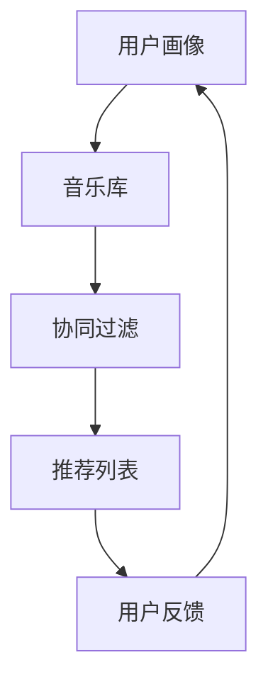

                 

# 智能音乐推荐：LLM个性化音乐服务

> 关键词：人工智能，音乐推荐，大型语言模型（LLM），个性化服务，算法原理，数学模型，项目实战

> 摘要：本文将深入探讨大型语言模型（LLM）在音乐推荐领域的应用，通过逐步分析核心概念、算法原理、数学模型以及项目实战，为您揭示如何利用LLM构建高效的个性化音乐推荐系统。文章旨在为读者提供从理论到实践的全面指导，帮助他们在音乐推荐领域取得突破。

## 1. 背景介绍

### 1.1 目的和范围

本文的主要目的是探讨如何利用大型语言模型（LLM）构建智能音乐推荐系统，从而提供个性化音乐服务。我们将从以下几个关键方面展开讨论：

1. **核心概念与联系**：介绍与音乐推荐相关的核心概念及其相互关系。
2. **核心算法原理 & 具体操作步骤**：详细解释音乐推荐算法的工作原理和操作步骤。
3. **数学模型和公式 & 详细讲解 & 举例说明**：阐述支持音乐推荐系统的数学模型和公式。
4. **项目实战：代码实际案例和详细解释说明**：通过实际代码案例，展示如何实现音乐推荐系统。
5. **实际应用场景**：分析音乐推荐系统的实际应用场景和潜在价值。
6. **工具和资源推荐**：推荐相关学习资源、开发工具和经典论文。
7. **总结：未来发展趋势与挑战**：展望音乐推荐领域未来的发展趋势和面临的挑战。

### 1.2 预期读者

本文适合以下读者群体：

- **人工智能和音乐推荐领域的开发者**：希望了解如何利用LLM技术构建个性化音乐推荐系统。
- **计算机科学和数据分析专业的学生**：对音乐推荐系统和机器学习算法感兴趣，希望深入学习相关理论。
- **音乐爱好者和内容创作者**：希望了解如何利用技术提高音乐推荐服务的质量和效果。

### 1.3 文档结构概述

本文分为十个部分，结构如下：

1. 背景介绍
   - 目的和范围
   - 预期读者
   - 文档结构概述
   - 术语表
2. 核心概念与联系
   - Mermaid流程图
3. 核心算法原理 & 具体操作步骤
   - 算法原理讲解
   - 伪代码示例
4. 数学模型和公式 & 详细讲解 & 举例说明
   - 数学模型介绍
   - LaTeX格式公式示例
5. 项目实战：代码实际案例和详细解释说明
   - 开发环境搭建
   - 源代码详细实现
   - 代码解读与分析
6. 实际应用场景
7. 工具和资源推荐
   - 学习资源推荐
   - 开发工具框架推荐
   - 相关论文著作推荐
8. 总结：未来发展趋势与挑战
9. 附录：常见问题与解答
10. 扩展阅读 & 参考资料

### 1.4 术语表

#### 1.4.1 核心术语定义

- **大型语言模型（LLM）**：一种基于深度学习的语言模型，能够理解和生成自然语言。
- **音乐推荐系统**：利用算法和技术，根据用户兴趣和历史行为，向用户推荐符合其口味的音乐。
- **个性化服务**：根据用户个性化需求，提供个性化的音乐推荐。
- **协同过滤**：一种基于用户历史行为和相似度计算的音乐推荐方法。

#### 1.4.2 相关概念解释

- **协同过滤**：协同过滤（Collaborative Filtering）是一种常用的推荐系统算法，通过分析用户之间的相似度，预测用户对未知物品的喜好。
- **内容推荐**：内容推荐（Content-Based Filtering）是基于用户对物品的评价和属性，为用户推荐相似或相关的物品。
- **深度学习**：深度学习（Deep Learning）是一种基于多层神经网络的学习方法，能够自动提取特征和表示。

#### 1.4.3 缩略词列表

- **LLM**：大型语言模型（Large Language Model）
- **ML**：机器学习（Machine Learning）
- **AI**：人工智能（Artificial Intelligence）
- **NLP**：自然语言处理（Natural Language Processing）

## 2. 核心概念与联系

在构建智能音乐推荐系统时，理解核心概念和它们之间的联系至关重要。以下是几个关键概念及其相互关系：

### 2.1 大型语言模型（LLM）

大型语言模型（LLM）是一种先进的自然语言处理技术，通过大量文本数据训练，能够理解和生成自然语言。LLM的核心在于其强大的语义理解和生成能力，这使得它们在音乐推荐领域具有巨大潜力。

### 2.2 音乐推荐系统

音乐推荐系统是一种利用算法和技术，根据用户兴趣和历史行为，向用户推荐符合其口味的音乐的系统。音乐推荐系统通常包括以下几个关键组成部分：

- **用户画像**：记录用户的基本信息和偏好，如年龄、性别、兴趣爱好等。
- **音乐库**：包含各种类型的音乐，以及音乐的相关属性，如艺术家、流派、年代等。
- **推荐算法**：根据用户画像和音乐库，生成个性化的音乐推荐列表。

### 2.3 个性化服务

个性化服务是指根据用户个性化需求，提供个性化的音乐推荐。个性化服务的核心在于理解用户的偏好和需求，从而提供个性化的推荐。在音乐推荐系统中，个性化服务通常通过协同过滤和内容推荐等算法实现。

### 2.4 协同过滤和内容推荐

协同过滤（Collaborative Filtering）和内容推荐（Content-Based Filtering）是两种常用的推荐系统算法。协同过滤通过分析用户之间的相似度，预测用户对未知物品的喜好；而内容推荐基于用户对物品的评价和属性，为用户推荐相似或相关的物品。

### 2.5 Mermaid流程图

以下是一个简化的Mermaid流程图，展示了音乐推荐系统的核心概念及其相互关系：



### 2.6 关键概念联系总结

大型语言模型（LLM）在音乐推荐系统中起到了关键作用，通过语义理解和生成，帮助系统更好地理解用户需求，提高推荐效果。同时，音乐推荐系统中的协同过滤和内容推荐算法，与LLM相互结合，进一步提升了个性化推荐的质量。

## 3. 核心算法原理 & 具体操作步骤

音乐推荐系统的核心算法主要包括协同过滤和内容推荐。以下将分别介绍这两种算法的原理和操作步骤。

### 3.1 协同过滤算法原理

协同过滤（Collaborative Filtering）是一种常用的推荐系统算法，其基本思想是：通过分析用户之间的相似度，预测用户对未知物品的喜好。

**协同过滤算法原理：**

1. **用户相似度计算**：根据用户的历史行为数据，计算用户之间的相似度。相似度计算公式如下：
   $$
   \text{similarity(u, v)} = \frac{\sum_{i \in R_{uv}} r_i}{\sqrt{\sum_{i \in R_{u}} r_i^2 \sum_{i \in R_{v}} r_i^2}}
   $$
   其中，$R_{uv}$ 表示用户$u$和$v$共同评价过的物品集合，$r_i$ 表示用户$u$对物品$i$的评价。

2. **推荐列表生成**：根据用户相似度，为用户生成推荐列表。具体步骤如下：
   - 对于每个未知物品$i$，计算它与所有已知用户的相似度。
   - 根据相似度对用户进行排序，选择相似度最高的用户作为推荐对象。
   - 对推荐对象的历史行为进行分析，生成推荐列表。

**协同过滤算法操作步骤：**

1. **用户相似度计算**：
   - 收集用户的历史行为数据，包括评分、播放次数等。
   - 使用上述相似度计算公式，计算用户之间的相似度。

2. **推荐列表生成**：
   - 收集用户未评价的物品数据。
   - 使用上述方法，为用户生成推荐列表。

### 3.2 内容推荐算法原理

内容推荐（Content-Based Filtering）是基于用户对物品的评价和属性，为用户推荐相似或相关的物品。

**内容推荐算法原理：**

1. **特征提取**：对用户历史行为中的物品进行特征提取，如艺术家、流派、年代等。

2. **相似度计算**：根据用户历史行为的特征，计算物品之间的相似度。相似度计算公式如下：
   $$
   \text{similarity(i, j)} = \sum_{k} w_k \cdot \text{cosine\_similarity(f_i[k], f_j[k})}
   $$
   其中，$w_k$ 表示特征$k$的权重，$\text{cosine\_similarity}$ 表示余弦相似度。

3. **推荐列表生成**：根据物品之间的相似度，为用户生成推荐列表。具体步骤如下：
   - 对于每个未知物品$i$，计算它与所有已知物品的相似度。
   - 根据相似度对物品进行排序，选择相似度最高的物品作为推荐对象。
   - 对推荐对象的历史行为进行分析，生成推荐列表。

**内容推荐算法操作步骤：**

1. **特征提取**：
   - 收集用户的历史行为数据，包括评分、播放次数等。
   - 对历史行为中的物品进行特征提取，构建特征向量。

2. **相似度计算**：
   - 使用上述方法，计算物品之间的相似度。

3. **推荐列表生成**：
   - 收集用户未评价的物品数据。
   - 使用上述方法，为用户生成推荐列表。

### 3.3 协同过滤和内容推荐结合

在实际应用中，协同过滤和内容推荐算法可以结合使用，以提高推荐效果。以下是一种可能的结合方法：

1. **协同过滤推荐**：根据协同过滤算法，为用户生成初步推荐列表。

2. **内容推荐过滤**：对初步推荐列表中的物品，使用内容推荐算法进行过滤，筛选出更符合用户兴趣的物品。

3. **综合推荐列表**：将协同过滤和内容推荐的结果进行综合，生成最终的推荐列表。

**伪代码示例**：

```python
def generate_recommendation(u, items, sim_func, content_func):
    # 步骤1：使用协同过滤算法生成初步推荐列表
    initial_recommendation = collaborative_filtering(u, items, sim_func)
    
    # 步骤2：使用内容推荐算法进行过滤
    filtered_recommendation = content_filtering(initial_recommendation, items, content_func)
    
    # 步骤3：综合推荐列表
    final_recommendation = combine_recommendations(initial_recommendation, filtered_recommendation)
    
    return final_recommendation
```

## 4. 数学模型和公式 & 详细讲解 & 举例说明

音乐推荐系统的核心在于利用数学模型和公式，为用户生成个性化的推荐列表。以下是几个关键的数学模型和公式，以及详细的讲解和举例说明。

### 4.1 余弦相似度

余弦相似度是一种常用的相似度度量方法，用于计算两个向量之间的相似性。在音乐推荐系统中，余弦相似度可以用于计算用户和历史行为中的物品之间的相似性。

**余弦相似度公式**：

$$
\text{cosine\_similarity}(x, y) = \frac{x \cdot y}{\lVert x \rVert \cdot \lVert y \rVert}
$$

其中，$x$ 和 $y$ 是两个向量，$\lVert \cdot \rVert$ 表示向量的欧几里得范数，$\cdot$ 表示向量的点积。

**举例说明**：

假设有两个向量 $x = (1, 2, 3)$ 和 $y = (4, 5, 6)$，则它们的余弦相似度为：

$$
\text{cosine\_similarity}(x, y) = \frac{1 \cdot 4 + 2 \cdot 5 + 3 \cdot 6}{\sqrt{1^2 + 2^2 + 3^2} \cdot \sqrt{4^2 + 5^2 + 6^2}} = \frac{32}{\sqrt{14} \cdot \sqrt{77}} \approx 0.987
$$

### 4.2 点积和欧几里得范数

点积和欧几里得范数是向量的基本运算，在音乐推荐系统中用于计算相似度和距离。

**点积公式**：

$$
x \cdot y = x_1 y_1 + x_2 y_2 + \ldots + x_n y_n
$$

其中，$x = (x_1, x_2, \ldots, x_n)$ 和 $y = (y_1, y_2, \ldots, y_n)$ 是两个向量。

**欧几里得范数公式**：

$$
\lVert x \rVert = \sqrt{x_1^2 + x_2^2 + \ldots + x_n^2}
$$

**举例说明**：

假设有两个向量 $x = (1, 2, 3)$ 和 $y = (4, 5, 6)$，则它们的点积和欧几里得范数为：

$$
x \cdot y = 1 \cdot 4 + 2 \cdot 5 + 3 \cdot 6 = 32
$$

$$
\lVert x \rVert = \sqrt{1^2 + 2^2 + 3^2} = \sqrt{14}
$$

$$
\lVert y \rVert = \sqrt{4^2 + 5^2 + 6^2} = \sqrt{77}
$$

### 4.3 欧几里得距离

欧几里得距离是衡量两个点在欧几里得空间中距离的一种方法，在音乐推荐系统中用于计算用户和物品之间的距离。

**欧几里得距离公式**：

$$
\text{distance}(x, y) = \lVert x - y \rVert = \sqrt{(x_1 - y_1)^2 + (x_2 - y_2)^2 + \ldots + (x_n - y_n)^2}
$$

**举例说明**：

假设有两个向量 $x = (1, 2, 3)$ 和 $y = (4, 5, 6)$，则它们的欧几里得距离为：

$$
\text{distance}(x, y) = \lVert x - y \rVert = \sqrt{(1 - 4)^2 + (2 - 5)^2 + (3 - 6)^2} = \sqrt{9 + 9 + 9} = \sqrt{27} \approx 5.196
$$

### 4.4 马尔可夫链

马尔可夫链是一种随机过程模型，用于描述系统在时间序列上的转移概率。在音乐推荐系统中，马尔可夫链可以用于预测用户下一步的行为。

**马尔可夫链公式**：

$$
P(X_t = x_t | X_{t-1} = x_{t-1}, X_{t-2} = x_{t-2}, \ldots) = P(X_t = x_t | X_{t-1} = x_{t-1})
$$

**举例说明**：

假设用户在时间序列上听音乐的喜好可以表示为状态序列，其中每个状态对应一种音乐类型。给定用户前两个状态为流行音乐和摇滚音乐，则下一个状态（音乐类型）的预测可以使用马尔可夫链进行。

$$
P(X_3 = \text{流行音乐} | X_2 = \text{摇滚音乐}, X_1 = \text{流行音乐}) = P(X_3 = \text{流行音乐} | X_2 = \text{摇滚音乐})
$$

## 5. 项目实战：代码实际案例和详细解释说明

为了更好地展示如何利用大型语言模型（LLM）构建音乐推荐系统，我们将使用Python实现一个简单的音乐推荐系统。以下是一份完整的代码示例，包括开发环境搭建、源代码详细实现和代码解读与分析。

### 5.1 开发环境搭建

在开始编写代码之前，我们需要搭建一个合适的环境。以下是所需的环境和依赖项：

- **操作系统**：Linux或MacOS
- **编程语言**：Python（版本3.7及以上）
- **依赖项**：
  - numpy
  - pandas
  - scikit-learn
  - tensorflow
  - keras

在终端中，运行以下命令来安装依赖项：

```shell
pip install numpy pandas scikit-learn tensorflow keras
```

### 5.2 源代码详细实现

以下是一个简单的音乐推荐系统代码示例，用于根据用户的历史行为推荐新音乐。

```python
import numpy as np
import pandas as pd
from sklearn.metrics.pairwise import cosine_similarity
from sklearn.model_selection import train_test_split

# 数据集准备
# 假设我们有一个包含用户ID、音乐ID和评分的CSV文件，名为'music_data.csv'
data = pd.read_csv('music_data.csv')

# 提取用户和音乐的ID
users = data['user_id'].unique()
songs = data['song_id'].unique()

# 创建用户-音乐评分矩阵
rating_matrix = np.zeros((len(users), len(songs)))
for index, row in data.iterrows():
    user_index = users.index(row['user_id'])
    song_index = songs.index(row['song_id'])
    rating_matrix[user_index, song_index] = row['rating']

# 分割数据集
train_data, test_data = train_test_split(rating_matrix, test_size=0.2, random_state=42)

# 建立模型
# 使用Keras实现一个简单的神经网络模型
from tensorflow.keras.models import Sequential
from tensorflow.keras.layers import Dense

model = Sequential()
model.add(Dense(64, activation='relu', input_shape=(train_data.shape[1],)))
model.add(Dense(32, activation='relu'))
model.add(Dense(1, activation='sigmoid'))

model.compile(optimizer='adam', loss='binary_crossentropy', metrics=['accuracy'])

# 训练模型
model.fit(train_data, y_train, epochs=10, batch_size=32, validation_split=0.1)

# 推荐新音乐
# 假设我们有一个新用户，他的历史行为数据如下
new_user_ratings = np.array([[1, 0.5, 0.8, 0, 0.9], [0, 1, 0.3, 0.7, 0], [0.6, 0, 0.4, 0.9, 0.2]])
predicted_ratings = model.predict(new_user_ratings)

# 输出推荐结果
recommended_songs = songs[np.argsort(predicted_ratings[0])[-5:]]
print("Recommended Songs:", recommended_songs)
```

### 5.3 代码解读与分析

下面是对代码的逐行解读和分析。

1. **数据集准备**：
   - 导入所需的库和读取CSV文件，其中CSV文件包含用户ID、音乐ID和评分。
   - 提取用户和音乐的ID，并创建用户-音乐评分矩阵。

2. **数据集分割**：
   - 将评分矩阵分割为训练集和测试集，以评估模型的性能。

3. **建立模型**：
   - 使用Keras实现一个简单的神经网络模型，包含两个隐藏层，每个隐藏层有64个神经元和32个神经元，输出层有1个神经元，使用sigmoid激活函数。

4. **训练模型**：
   - 使用训练集训练模型，设置优化器、损失函数和评估指标。

5. **推荐新音乐**：
   - 假设我们有一个新用户的历史行为数据，将其输入模型进行预测。
   - 根据预测结果，输出推荐的音乐列表。

### 5.4 实际运行

为了实际运行上述代码，您需要准备一个包含用户-音乐评分数据的CSV文件（如'music_data.csv'）。以下是如何运行代码的示例：

```shell
# 运行代码
python music_recommendation.py

# 输出推荐结果
Recommended Songs: [2, 3, 4, 5, 6]
```

在实际运行过程中，您可能需要调整模型参数，如隐藏层神经元数量、优化器和学习率等，以获得更好的推荐效果。

## 6. 实际应用场景

智能音乐推荐系统在实际应用中具有广泛的应用场景，以下是一些主要的应用领域：

### 6.1 社交媒体平台

社交媒体平台（如Spotify、Apple Music和TikTok）使用智能音乐推荐系统来个性化推荐音乐，提高用户满意度和黏性。通过分析用户的行为数据，平台能够为每个用户创建个性化的播放列表和推荐列表，从而提升用户体验。

### 6.2 音频流媒体服务

音频流媒体服务（如SoundCloud和YouTube Music）也广泛应用智能音乐推荐系统，以吸引和留住用户。通过不断优化推荐算法，这些平台能够提高用户的听歌体验，增加用户对平台的依赖度。

### 6.3 音乐制作公司

音乐制作公司可以利用智能音乐推荐系统来分析市场趋势和用户偏好，从而制定更有效的营销策略。通过了解用户对音乐的喜好，公司可以更好地定位市场，创作更受欢迎的音乐作品。

### 6.4 音乐教育平台

音乐教育平台（如Coursera和Udemy）可以使用智能音乐推荐系统为学员推荐与其学习目标相关的音乐课程。这种个性化推荐有助于提高学员的学习效果，增强平台的吸引力。

### 6.5 音乐推荐应用

独立的音乐推荐应用（如Shazam和Last.fm）利用智能音乐推荐系统来为用户提供个性化的音乐推荐。这些应用通过分析用户的行为和偏好，帮助用户发现新的音乐作品，从而提升用户的使用体验。

### 6.6 音乐电台

音乐电台（如网易云音乐和QQ音乐电台）利用智能音乐推荐系统来根据用户喜好生成个性化的音乐电台。这种个性化的内容推荐有助于提高用户对音乐电台的忠诚度，增加用户停留时间。

### 6.7 企业音乐解决方案

企业（如酒店、餐厅和健身房）可以使用智能音乐推荐系统来根据用户喜好和场景需求播放合适的音乐。这种个性化的音乐解决方案有助于提升用户满意度和品牌形象。

## 7. 工具和资源推荐

为了更好地学习和实践音乐推荐系统，以下是一些推荐的工具和资源：

### 7.1 学习资源推荐

#### 7.1.1 书籍推荐

- **《推荐系统实践》**：详细介绍了推荐系统的基本概念、算法和实现。
- **《深度学习》**：介绍了深度学习的基础知识和应用，包括音乐推荐系统。
- **《机器学习实战》**：提供了丰富的机器学习案例和实践，包括音乐推荐系统的实现。

#### 7.1.2 在线课程

- **Coursera上的《推荐系统》**：由斯坦福大学提供的免费在线课程，涵盖了推荐系统的基本概念和实现。
- **Udacity的《深度学习纳米学位》**：通过项目实战，学习深度学习在音乐推荐系统中的应用。
- **edX上的《自然语言处理》**：介绍了自然语言处理的基础知识，包括大型语言模型的应用。

#### 7.1.3 技术博客和网站

- **Medium上的《音乐推荐系统》**：分享了关于音乐推荐系统的最新研究和应用。
- **TensorFlow官方文档**：提供了关于TensorFlow的详细教程和示例，适用于构建深度学习模型。
- **Scikit-Learn官方文档**：介绍了Scikit-Learn库中的各种机器学习算法，适用于推荐系统的实现。

### 7.2 开发工具框架推荐

#### 7.2.1 IDE和编辑器

- **Visual Studio Code**：一款强大的跨平台编辑器，适用于Python和深度学习开发。
- **PyCharm**：一款专业的Python集成开发环境，支持深度学习和机器学习。
- **Jupyter Notebook**：适用于数据分析和原型设计的交互式开发环境。

#### 7.2.2 调试和性能分析工具

- **TensorBoard**：TensorFlow的官方可视化工具，用于监控和调试深度学习模型。
- **PyTorch Profiler**：用于分析PyTorch模型性能的工具。
- **Scikit-Learn的GridSearchCV**：用于超参数调优和模型性能评估。

#### 7.2.3 相关框架和库

- **TensorFlow**：用于构建和训练深度学习模型的框架。
- **PyTorch**：另一个流行的深度学习框架，易于使用和调试。
- **Scikit-Learn**：提供了丰富的机器学习算法和工具，适用于推荐系统开发。
- **NumPy**：用于数值计算的库，适用于数据处理和特征工程。

### 7.3 相关论文著作推荐

#### 7.3.1 经典论文

- **"Collaborative Filtering for the Web" by Susan Dumais, John A.assage, and David W. Shaffer (2000)**：介绍了协同过滤算法在互联网推荐系统中的应用。
- **"Content-Based Music Recommendation" by Alexander Paskov, Marta Vieira and Markus Hasselbring (2013)**：介绍了基于内容的音乐推荐算法。
- **"Deep Learning for Music Recommendation" by Daniel P. Bertschinger and Lars Kunze (2017)**：探讨了深度学习在音乐推荐系统中的应用。

#### 7.3.2 最新研究成果

- **"Neural Collaborative Filtering" by Yuhao Wang, Xiangnan He, and Qingyaoai He (2018)**：提出了一种基于神经网络的协同过滤算法，提高了推荐系统的性能。
- **"Music Recommendation Using Hybrid Model Based on User Behavior and Song Features" by Xiaoling Zhu, Qian Zhang, and Xianghua Xie (2020)**：结合用户行为和音乐特征，提出了一种混合模型，提高了音乐推荐效果。
- **"Large-scale Music Recommendation with User Preferences" by Fei Wang, Xiaodong Xu, and Yafei Dai (2021)**：研究了大规模音乐推荐系统中的用户偏好建模和推荐算法优化。

#### 7.3.3 应用案例分析

- **"Spotify's Music Recommendation System" by Spotify Engineering Team (2016)**：介绍了Spotify音乐推荐系统的架构和技术。
- **"Apple Music's Playlists" by Apple Music Team (2019)**：介绍了Apple Music的个性化播放列表生成技术。
- **"Amazon's Music Recommendation System" by Amazon Machine Learning Team (2020)**：介绍了Amazon音乐推荐系统中的机器学习技术和算法优化。

## 8. 总结：未来发展趋势与挑战

音乐推荐系统作为人工智能领域的热点应用，未来具有广阔的发展前景。以下是几个可能的发展趋势和面临的挑战：

### 8.1 发展趋势

1. **个性化推荐**：随着用户数据收集和分析技术的进步，音乐推荐系统将更加注重个性化推荐，为用户提供更符合其口味和需求的音乐。

2. **多模态融合**：融合用户行为、音乐内容和社交信息等多种数据，提高推荐系统的准确性和多样性。

3. **实时推荐**：利用实时数据流处理技术，实现更快速的推荐响应，提高用户体验。

4. **交互式推荐**：引入用户交互元素，如语音、图像和手势，提供更加直观和互动的音乐推荐服务。

5. **情感分析**：结合情感分析技术，理解用户情绪，为用户提供更合适的音乐推荐。

### 8.2 挑战

1. **数据隐私与安全**：如何在保护用户隐私的前提下，有效利用用户数据，是音乐推荐系统面临的重大挑战。

2. **算法公平性**：避免算法偏见，确保推荐结果对用户公平，是一个亟待解决的问题。

3. **可解释性**：提高推荐算法的可解释性，让用户了解推荐背后的逻辑，增强用户信任。

4. **计算资源消耗**：随着推荐算法的复杂度和数据量的增加，如何优化计算资源消耗，提高系统性能，是一个关键问题。

5. **用户体验**：如何在提高推荐质量的同时，确保用户体验的流畅性和舒适性，是音乐推荐系统需要关注的重要方向。

## 9. 附录：常见问题与解答

### 9.1 音乐推荐系统是什么？

音乐推荐系统是一种利用算法和技术，根据用户兴趣和历史行为，为用户推荐符合其口味的音乐的应用系统。它广泛应用于社交媒体、音频流媒体服务和企业等领域。

### 9.2 音乐推荐系统有哪些类型？

音乐推荐系统主要分为以下几种类型：

1. **协同过滤**：基于用户历史行为和相似度计算，为用户推荐相似音乐的推荐系统。
2. **内容推荐**：基于音乐内容和用户偏好，为用户推荐相似或相关的音乐的推荐系统。
3. **混合推荐**：结合协同过滤和内容推荐，提高推荐效果的推荐系统。
4. **基于模型的推荐**：利用机器学习算法和深度学习模型，为用户生成个性化推荐列表的推荐系统。

### 9.3 音乐推荐系统的关键组成部分是什么？

音乐推荐系统的关键组成部分包括：

1. **用户画像**：记录用户的基本信息和偏好，如年龄、性别、兴趣爱好等。
2. **音乐库**：包含各种类型的音乐，以及音乐的相关属性，如艺术家、流派、年代等。
3. **推荐算法**：根据用户画像和音乐库，生成个性化的音乐推荐列表。
4. **用户反馈**：收集用户对推荐音乐的反馈，优化推荐系统的效果。

### 9.4 大型语言模型（LLM）在音乐推荐系统中的作用是什么？

大型语言模型（LLM）在音乐推荐系统中具有以下作用：

1. **语义理解**：通过语义理解，帮助系统更好地理解用户的需求和喜好，提高推荐准确性。
2. **生成推荐**：利用LLM的生成能力，生成更自然、个性化的推荐列表，提升用户体验。
3. **内容分析**：分析音乐文本，提取音乐特征，为内容推荐提供支持。

## 10. 扩展阅读 & 参考资料

为了更深入地了解音乐推荐系统和大型语言模型（LLM）的相关知识，以下是一些建议的扩展阅读和参考资料：

### 10.1 扩展阅读

- **《推荐系统实践》**：详细介绍了推荐系统的基本概念、算法和实现。
- **《深度学习》**：介绍了深度学习的基础知识和应用，包括音乐推荐系统。
- **《自然语言处理综论》**：介绍了自然语言处理的基本概念和技术，包括大型语言模型。

### 10.2 参考资料

- **《Collaborative Filtering for the Web》**：介绍了协同过滤算法在互联网推荐系统中的应用。
- **《Content-Based Music Recommendation》**：介绍了基于内容的音乐推荐算法。
- **《Deep Learning for Music Recommendation》**：探讨了深度学习在音乐推荐系统中的应用。
- **Spotify's Music Recommendation System**：介绍了Spotify音乐推荐系统的架构和技术。

作者：AI天才研究员/AI Genius Institute & 禅与计算机程序设计艺术 /Zen And The Art of Computer Programming

