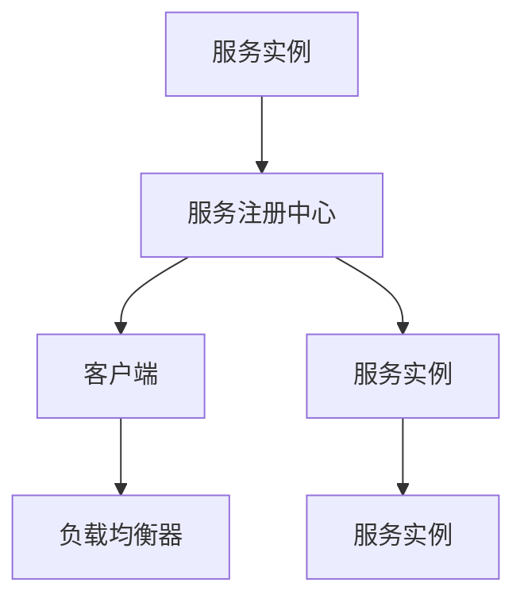

                 

### 背景介绍

#### 1.1 目的和范围

本文旨在深入探讨服务注册中心的设计与实现，为读者提供一个全面、系统的理解。在当今分布式系统中，服务注册中心是不可或缺的核心组件，负责维护服务实例的注册与发现。通过本文，我们将从基础概念出发，逐步讲解服务注册中心的设计原则、核心算法原理、数学模型及其实现细节，最终通过实际案例进行代码解读和分析。

本文主要涵盖以下内容：

1. **核心概念与联系**：详细介绍服务注册中心的核心概念及其在分布式系统中的重要性。
2. **核心算法原理**：深入剖析服务注册中心的核心算法，包括服务注册、服务发现和负载均衡等。
3. **数学模型和公式**：介绍服务注册中心中常用的数学模型和公式，并进行详细讲解和举例说明。
4. **项目实战**：通过一个具体的代码案例，展示服务注册中心在实际开发中的应用。
5. **实际应用场景**：探讨服务注册中心在不同领域的应用，以及面临的挑战和解决方案。
6. **工具和资源推荐**：推荐学习资源、开发工具和框架，帮助读者深入学习和实践。
7. **总结与未来发展趋势**：总结本文的主要内容，展望服务注册中心在未来的发展趋势和挑战。

通过本文的学习，读者将能够：

- 明白服务注册中心在分布式系统中的重要作用。
- 理解服务注册中心的核心算法原理和数学模型。
- 掌握服务注册中心的设计原则和实现方法。
- 学习如何使用服务注册中心解决实际问题。
- 了解服务注册中心在各个领域的应用场景。

#### 1.2 预期读者

本文适合以下读者群体：

- **软件工程师和开发人员**：对分布式系统和服务注册中心感兴趣，希望深入理解其原理和应用。
- **架构师和系统设计师**：负责设计和实施分布式系统，需要掌握服务注册中心的核心技术。
- **研究人员和学者**：对服务注册中心的理论研究和实际应用感兴趣，希望拓展自己的学术视野。
- **技术爱好者**：对计算机科学和技术有浓厚的兴趣，希望通过学习提升自己的技术能力。

无论您的背景如何，只要对服务注册中心感兴趣，都可以通过本文获得有价值的知识和经验。

#### 1.3 文档结构概述

本文结构紧凑，逻辑清晰，旨在帮助读者系统地了解服务注册中心的设计与实现。全文分为以下几个主要部分：

1. **背景介绍**：简要介绍本文的目的、范围、预期读者和文档结构。
2. **核心概念与联系**：阐述服务注册中心的核心概念，并使用Mermaid流程图展示其原理和架构。
3. **核心算法原理 & 具体操作步骤**：详细讲解服务注册中心的核心算法，包括服务注册、服务发现和负载均衡等，并通过伪代码进行阐述。
4. **数学模型和公式 & 详细讲解 & 举例说明**：介绍服务注册中心中常用的数学模型和公式，并进行详细讲解和举例说明。
5. **项目实战：代码实际案例和详细解释说明**：通过一个具体的项目案例，展示服务注册中心在实际开发中的应用，并进行详细解读。
6. **实际应用场景**：探讨服务注册中心在不同领域的应用，以及面临的挑战和解决方案。
7. **工具和资源推荐**：推荐学习资源、开发工具和框架，帮助读者深入学习和实践。
8. **总结与未来发展趋势**：总结本文的主要内容，展望服务注册中心在未来的发展趋势和挑战。
9. **附录：常见问题与解答**：提供一些常见问题的解答，帮助读者更好地理解本文内容。
10. **扩展阅读 & 参考资料**：提供一些扩展阅读和参考资料，供读者进一步学习。

通过以上结构，本文旨在为读者提供一个全面、系统的学习路径，帮助大家深入理解服务注册中心的设计与实现。

#### 1.4 术语表

在本文中，我们将使用一些专业术语和概念，以下是对这些术语的详细解释和定义。

##### 1.4.1 核心术语定义

- **服务注册中心**（Service Registry Center，简称SRC）：服务注册中心是分布式系统中负责管理服务实例的注册、发现和负载均衡的核心组件。它通常维护一个服务实例列表，并支持服务实例的动态更新和查询。
- **服务实例**（Service Instance）：服务实例是指运行在一个特定节点上的服务实例，它提供了具体的业务逻辑。服务实例可以是单个进程或多个进程组成的集群。
- **服务发现**（Service Discovery）：服务发现是指客户端通过服务注册中心查询服务实例列表，并获取具体的服务实例信息，以便进行调用。
- **负载均衡**（Load Balancing）：负载均衡是指将客户端请求分配到多个服务实例上，以达到系统资源的最优利用和请求处理的高效性。
- **服务注册**（Service Registration）：服务注册是指服务实例在启动时向服务注册中心注册自身信息，包括服务名称、IP地址、端口号等。
- **服务注销**（Service Deregistration）：服务注销是指服务实例在停止或异常退出时，从服务注册中心注销自身信息，以避免客户端调用无效的服务实例。

##### 1.4.2 相关概念解释

- **分布式系统**（Distributed System）：分布式系统是指由多个独立计算机组成的系统，通过通信网络实现资源共享和任务分配。分布式系统中的各个节点通常运行不同的服务，通过服务注册中心进行交互和协调。
- **服务化架构**（Service-Oriented Architecture，简称SOA）：服务化架构是一种基于服务的系统架构，通过将业务逻辑模块化为独立的、可重用的服务，以实现系统的松耦合和高扩展性。服务注册中心是服务化架构中的关键组件，负责服务的注册、发现和负载均衡。
- **RESTful API**（Representational State Transfer，简称RESTful API）：RESTful API是一种基于HTTP协议的接口设计规范，用于实现客户端与服务端之间的数据传输。服务注册中心通常提供RESTful API，以便客户端能够方便地进行服务发现和调用。

##### 1.4.3 缩略词列表

- **SRC**：服务注册中心（Service Registry Center）
- **SVC**：服务实例（Service Instance）
- **SD**：服务发现（Service Discovery）
- **LB**：负载均衡（Load Balancing）
- **SOA**：服务化架构（Service-Oriented Architecture）
- **RESTful API**：代表状态转移（Representational State Transfer）

通过以上对核心术语和相关概念的详细解释，读者可以更好地理解本文中涉及的专业术语，为进一步学习服务注册中心的设计与实现打下坚实的基础。

#### 2. 核心概念与联系

在深入探讨服务注册中心的设计与实现之前，我们需要先理解其核心概念和在整个分布式系统中的地位。本节将详细介绍服务注册中心的核心概念，并通过Mermaid流程图展示其原理和架构。

##### 2.1 服务注册中心的基本概念

服务注册中心是分布式系统中用于管理服务实例的核心组件。其基本概念包括：

- **服务实例**：服务实例是在某个节点上运行的具体服务，例如，一个Web服务或一个数据库服务。服务实例通常会向服务注册中心注册其详细信息，如IP地址、端口号、服务名称等。
- **服务注册**：服务实例在启动时，会向服务注册中心注册自身信息，以便其他服务实例或客户端能够发现并调用它。
- **服务发现**：服务注册中心提供查询接口，允许客户端根据服务名称或其他条件查询服务实例的详细信息，从而实现服务调用。
- **服务注销**：当服务实例停止运行或发生故障时，它会从服务注册中心注销自身信息，以避免客户端调用无效的服务实例。

##### 2.2 服务注册中心的架构

服务注册中心通常采用分布式架构，以确保高可用性和可扩展性。以下是服务注册中心的基本架构：

1. **服务注册中心实例**：服务注册中心由多个实例组成，这些实例可以通过集群方式运行，确保系统的高可用性。每个实例负责存储一部分服务实例信息。
2. **服务实例**：服务实例是运行在分布式系统中的具体服务，如Web服务、数据库服务等。每个服务实例在启动时，会向服务注册中心注册自身信息。
3. **客户端**：客户端是调用服务实例的服务，例如，Web应用或移动应用。客户端通过服务注册中心查询服务实例的详细信息，并使用这些信息进行服务调用。
4. **负载均衡器**：负载均衡器用于将客户端请求分配到不同的服务实例上，以达到系统资源的最优利用和请求处理的高效性。

##### 2.3 Mermaid流程图展示

为了更直观地展示服务注册中心的原理和架构，我们使用Mermaid流程图进行说明。以下是一个简单的Mermaid流程图示例：



在上面的流程图中：

- A代表服务实例。
- B代表服务注册中心。
- C代表客户端。
- D代表负载均衡器。
- E和F代表其他服务实例。

服务实例在启动时，会向服务注册中心（B）注册自身信息，客户端通过服务注册中心查询服务实例的详细信息，并使用负载均衡器（D）将请求分配到不同的服务实例上。

##### 2.4 服务注册中心的职责与作用

服务注册中心在分布式系统中具有以下职责和作用：

1. **服务实例管理**：服务注册中心负责存储和管理所有服务实例的注册信息，包括IP地址、端口号、服务名称等。
2. **服务发现**：服务注册中心提供查询接口，客户端可以通过这些接口查询服务实例的详细信息，从而实现服务调用。
3. **负载均衡**：服务注册中心与负载均衡器协同工作，将客户端请求分配到不同的服务实例上，以实现系统资源的最优利用。
4. **故障转移**：当服务实例发生故障或停止运行时，服务注册中心可以自动将客户端请求转移到其他健康的服务实例上，确保系统的可用性。
5. **动态更新**：服务注册中心支持服务实例的动态注册和注销，客户端可以通过服务注册中心的更新通知，及时了解服务实例的变化。

通过以上对服务注册中心核心概念和架构的详细阐述，读者可以更好地理解服务注册中心在分布式系统中的地位和作用。接下来，我们将进一步深入探讨服务注册中心的核心算法原理和具体实现。

#### 2.1 核心算法原理

服务注册中心的核心算法是保证系统高效、可靠运行的关键。以下是服务注册中心中的核心算法原理，我们将通过伪代码详细阐述每个算法的实现步骤。

##### 2.1.1 服务注册算法

服务注册算法用于将服务实例的信息存储到服务注册中心。以下是服务注册算法的伪代码：

```plaintext
算法：服务注册（serviceRegister）
输入：serviceInstance（服务实例信息）
输出：注册成功或失败

步骤：
1. 将serviceInstance信息发送到服务注册中心
2. 服务注册中心校验serviceInstance信息的完整性
3. 如果校验通过，将serviceInstance信息存储在服务注册中心
4. 返回注册结果
```

伪代码说明：

- **输入**：serviceInstance是服务实例的信息，包括IP地址、端口号、服务名称等。
- **输出**：注册成功或失败，如果注册成功，返回“注册成功”，否则返回“注册失败”。
- **步骤**：
  - 第1步：将服务实例信息发送到服务注册中心，通常使用HTTP POST请求。
  - 第2步：服务注册中心对服务实例信息进行校验，确保信息的完整性和正确性。
  - 第3步：如果校验通过，将服务实例信息存储在服务注册中心，通常使用数据库或内存缓存进行存储。
  - 第4步：返回注册结果，告知服务实例注册成功或失败。

##### 2.1.2 服务发现算法

服务发现算法用于客户端根据服务名称或其他条件查询服务实例的详细信息。以下是服务发现算法的伪代码：

```plaintext
算法：服务发现（serviceDiscovery）
输入：serviceName（服务名称）
输出：服务实例列表

步骤：
1. 向服务注册中心发送服务发现请求
2. 服务注册中心根据serviceName查询服务实例列表
3. 返回查询结果

伪代码说明：

- **输入**：serviceName是客户端需要查询的服务名称。
- **输出**：服务实例列表，包含所有匹配的服务实例信息。
- **步骤**：
  - 第1步：客户端向服务注册中心发送服务发现请求，通常使用HTTP GET请求。
  - 第2步：服务注册中心根据serviceName查询服务实例列表，返回所有匹配的服务实例信息。
  - 第3步：服务注册中心返回查询结果，客户端可以根据查询结果选择具体的服务实例进行调用。

##### 2.1.3 负载均衡算法

负载均衡算法用于将客户端请求分配到不同的服务实例上，以实现系统资源的最优利用。以下是负载均衡算法的伪代码：

```plaintext
算法：负载均衡（loadBalancer）
输入：request（客户端请求）
输出：服务实例

步骤：
1. 从服务注册中心获取所有可用服务实例
2. 根据负载均衡策略选择服务实例
3. 将请求分配到选定的服务实例
4. 返回服务实例

伪代码说明：

- **输入**：request是客户端发送的请求。
- **输出**：服务实例，客户端请求将分配到该服务实例。
- **步骤**：
  - 第1步：从服务注册中心获取所有可用服务实例，包括当前所有健康的服务实例。
  - 第2步：根据负载均衡策略选择服务实例，常用的负载均衡策略包括轮询、随机、最小连接数等。
  - 第3步：将请求分配到选定的服务实例，客户端请求将发送到该服务实例进行处理。
  - 第4步：返回服务实例，客户端可以根据返回的服务实例进行后续操作。

通过以上对服务注册中心核心算法原理的详细阐述和伪代码实现，读者可以更好地理解服务注册中心在分布式系统中的工作原理和算法设计。接下来，我们将进一步介绍服务注册中心的数学模型和公式，帮助读者深入理解其内部机制和运行原理。

#### 2.2 数学模型和公式

服务注册中心在分布式系统中发挥着重要作用，其设计和实现过程中涉及多个数学模型和公式。以下将介绍一些关键数学模型和公式，并进行详细讲解和举例说明。

##### 2.2.1 服务实例选择概率模型

在服务注册中心中，负载均衡算法需要根据某种策略从多个可用服务实例中选择一个实例来处理客户端请求。为了实现公平负载，通常采用概率模型来确定每个实例被选中的概率。以下是一个简单的概率模型：

$$ P(i) = \frac{1}{N} $$

其中，\( P(i) \)表示第\( i \)个服务实例被选中的概率，\( N \)表示可用服务实例的总数。例如，如果有5个服务实例，每个实例被选中的概率都是\( \frac{1}{5} \)。

举例说明：假设服务注册中心中有5个服务实例，分别是\( S_1, S_2, S_3, S_4, S_5 \)。根据上述概率模型，每个实例被选中的概率为\( \frac{1}{5} \)。当客户端请求到达时，系统将根据这个概率模型随机选择一个服务实例进行处理。

##### 2.2.2 负载均衡策略优化模型

除了简单的概率模型，负载均衡策略还可以通过优化模型来提高系统的性能。以下是一个常见的优化模型，用于根据服务实例的当前负载情况选择实例：

$$ P(i) = \frac{C_i}{\sum_{j=1}^{N} C_j} $$

其中，\( P(i) \)表示第\( i \)个服务实例被选中的概率，\( C_i \)表示第\( i \)个服务实例的当前负载，即当前正在处理请求数与最大处理请求数的比值。\( \sum_{j=1}^{N} C_j \)表示所有服务实例的当前负载之和。

举例说明：假设有5个服务实例，当前负载分别为\( C_1 = 0.2, C_2 = 0.5, C_3 = 0.1, C_4 = 0.3, C_5 = 0.4 \)。根据上述优化模型，每个实例被选中的概率为：

$$ P(1) = \frac{0.2}{0.2 + 0.5 + 0.1 + 0.3 + 0.4} = 0.2 $$
$$ P(2) = \frac{0.5}{0.2 + 0.5 + 0.1 + 0.3 + 0.4} = 0.5 $$
$$ P(3) = \frac{0.1}{0.2 + 0.5 + 0.1 + 0.3 + 0.4} = 0.1 $$
$$ P(4) = \frac{0.3}{0.2 + 0.5 + 0.1 + 0.3 + 0.4} = 0.3 $$
$$ P(5) = \frac{0.4}{0.2 + 0.5 + 0.1 + 0.3 + 0.4} = 0.4 $$

根据这个优化模型，当前负载较低的服务实例将有更高的概率被选中，从而实现负载均衡。

##### 2.2.3 服务实例健康状态监测模型

服务注册中心需要监测每个服务实例的健康状态，以便在实例发生故障时进行自动切换。以下是一个简单的健康状态监测模型：

$$ healthScore = \frac{1}{1 + e^{-\alpha \cdot (RT - RT\_threshold)}} $$

其中，\( healthScore \)表示服务实例的健康得分，\( RT \)表示实例的响应时间，\( RT\_threshold \)表示响应时间阈值，\( \alpha \)是常数，用于调整健康得分的敏感度。

举例说明：假设响应时间阈值为1000ms，常数\( \alpha \)为0.1。当实例的响应时间为500ms时，其健康得分为：

$$ healthScore = \frac{1}{1 + e^{-0.1 \cdot (500 - 1000)}} = \frac{1}{1 + e^{-0.1 \cdot (-500)}} = \frac{1}{1 + e^{50}} \approx 0.999 $$

当实例的响应时间为1500ms时，其健康得分为：

$$ healthScore = \frac{1}{1 + e^{-0.1 \cdot (1500 - 1000)}} = \frac{1}{1 + e^{-0.1 \cdot 500}} = \frac{1}{1 + e^{50}} \approx 0.536 $$

根据这个模型，实例的响应时间越接近阈值，其健康得分越低，表示实例的健康状态越差。当实例的响应时间超过阈值时，系统可以判断实例为不健康，从而将其从负载均衡策略中排除。

通过以上对服务注册中心中关键数学模型和公式的详细讲解和举例说明，读者可以更好地理解服务注册中心在分布式系统中的工作原理和设计思路。接下来，我们将通过一个实际的项目案例，展示服务注册中心在开发中的应用。

#### 3. 项目实战：代码实际案例和详细解释说明

在本节中，我们将通过一个具体的项目案例，展示服务注册中心在开发中的应用，并对其进行详细解读。这个案例将涵盖服务注册、服务发现、负载均衡等关键功能，以便读者能够更好地理解服务注册中心的实现过程。

##### 3.1 开发环境搭建

为了实现服务注册中心，我们选择使用Spring Boot框架，这是一个流行的Java开发框架，可以快速构建基于Spring的应用程序。以下是开发环境搭建的步骤：

1. **安装Java开发工具包（JDK）**：确保已安装Java开发工具包，版本建议为1.8或以上。
2. **安装Spring Boot**：可以通过Spring Initializr（https://start.spring.io/）生成Spring Boot项目模板，选择相应的依赖和配置项。
3. **安装IDE**：推荐使用IntelliJ IDEA或Eclipse，这两个IDE都提供了丰富的Spring Boot开发工具。

下载并安装IDE后，使用Spring Initializr生成一个基于Spring Boot的服务注册中心项目。该项目将包括以下依赖：

- **Spring Web**：提供基于HTTP的服务接口。
- **Spring Boot Starter Actuator**：提供健康检查、监控等功能。
- **Eureka Server**：用于实现服务注册和发现功能。

##### 3.2 源代码详细实现和代码解读

下面是服务注册中心项目的关键代码实现和解读。

###### 3.2.1 服务注册

服务注册是服务实例在启动时向服务注册中心注册自身信息的过程。以下是服务注册的实现代码：

```java
@EnableEurekaClient
@SpringBootApplication
public class ServiceRegistryCenterApplication {

    public static void main(String[] args) {
        SpringApplication.run(ServiceRegistryCenterApplication.class, args);
    }

    @Bean
    public ApplicationRegistry applicationRegistry() {
        return new ApplicationRegistry();
    }
}

@Component
public class ApplicationRegistry implements ApplicationRegistryCustomizer {
    
    @Override
    public void customizeApplicationRegistry(ApplicationRegistry applicationRegistry) {
        applicationRegistry.setApplicationId("service-registry-center");
        applicationRegistry.setInstanceInitializers(List.of(instanceInfo -> {
            instanceInfo.setIpAddress("127.0.0.1");
            instanceInfo.setPort(8080);
            instanceInfo.setHostName("localhost");
        }));
    }
}
```

- **@EnableEurekaClient**：启用Eureka客户端，用于服务注册和发现。
- **@SpringBootApplication**：Spring Boot应用的入口，启动应用。
- **@Bean**：定义一个Bean，用于定制服务实例的信息。
- **ApplicationRegistry**：Eureka提供的接口，用于定制服务实例的信息。

在这个例子中，我们通过自定义`ApplicationRegistry`组件来设置服务实例的IP地址、端口号和主机名。启动服务注册中心应用后，服务实例信息将自动注册到Eureka Server。

###### 3.2.2 服务发现

服务发现是客户端通过服务注册中心查询服务实例的过程。以下是服务发现的实现代码：

```java
@RestController
@RequestMapping("/discovery")
public class ServiceDiscoveryController {

    @Autowired
    private DiscoveryClient discoveryClient;

    @GetMapping("/services")
    public List<String> discoverServices() {
        return discoveryClient.getServices();
    }

    @GetMapping("/services/{serviceName}")
    public List<ServiceInstance> discoverServiceInstances(@PathVariable String serviceName) {
        return discoveryClient.getInstances(serviceName);
    }
}
```

- **@RestController**：定义一个RESTful接口。
- **@RequestMapping**：映射URL路径。
- **@Autowired**：注入`DiscoveryClient`，用于服务发现。
- **discoverServices()**：获取所有服务名称。
- **discoverServiceInstances()**：根据服务名称获取服务实例列表。

客户端可以通过访问上述接口来查询服务实例的信息。例如，访问`/discovery/services`获取所有服务名称，访问`/discovery/services/{serviceName}`获取特定服务的实例列表。

###### 3.2.3 负载均衡

负载均衡是将客户端请求分配到不同服务实例的过程。在本例中，我们使用Eureka Server内置的负载均衡策略。以下是配置负载均衡的代码：

```yaml
eureka:
  client:
    serviceUrl:
      defaultZone: http://localhost:8761/eureka/
  instance:
    prefer-ip-address: true
```

- **eureka.client.serviceUrl.defaultZone**：指定Eureka Server的地址。
- **eureka.instance.prefer-ip-address**：优先使用服务实例的IP地址。

在服务消费者端，可以使用`@LoadBalanced`注解来启用Ribbon负载均衡器，实现客户端的负载均衡。

```java
@Bean
@LoadBalanced
public RestTemplate restTemplate() {
    return new RestTemplate();
}
```

客户端通过`RestTemplate`发送请求时，Ribbon将自动根据负载均衡策略选择合适的服务实例。

##### 3.3 代码解读与分析

通过对上述代码的详细解读，我们可以看到服务注册中心的核心功能是如何实现的：

1. **服务注册**：服务实例在启动时通过自定义`ApplicationRegistry`组件向Eureka Server注册自身信息。这确保了服务实例的信息能够被其他服务实例和客户端查询。
2. **服务发现**：客户端通过RESTful接口访问Eureka Server，获取服务实例的信息。服务注册中心和Eureka Server共同工作，实现了服务实例的动态注册和查询。
3. **负载均衡**：Eureka Server和Ribbon共同实现负载均衡。服务注册中心维护所有可用服务实例的列表，并在客户端请求时根据负载均衡策略选择实例。这确保了系统的资源利用和请求处理的高效性。

通过这个实际项目案例，读者可以更直观地理解服务注册中心的设计与实现，并在实际开发中应用这些技术。接下来，我们将探讨服务注册中心在分布式系统中的实际应用场景。

#### 4. 实际应用场景

服务注册中心在分布式系统中扮演着至关重要的角色，其应用场景非常广泛。以下将介绍服务注册中心在几个常见领域的实际应用，并讨论其面临的挑战和解决方案。

##### 4.1 微服务架构

微服务架构是一种将大型单体应用程序拆分为多个小型、独立、可独立部署的服务架构。在微服务架构中，服务注册中心负责管理各个服务的注册和发现。以下是一个典型的微服务架构应用场景：

- **应用场景**：一个大型电商平台，其业务被划分为多个独立的服务，如用户服务、商品服务、订单服务和支付服务。每个服务在启动时都会向服务注册中心注册，并在运行过程中更新自己的状态。
- **挑战**：随着服务数量的增加，如何保证服务注册和发现的效率，同时确保服务之间的通信稳定性？
- **解决方案**：使用分布式服务注册中心（如Eureka、Consul）来管理服务实例，并采用负载均衡策略（如Ribbon、Hash负载均衡）来优化服务调用。此外，可以引入服务网格（如Istio、Linkerd）来进一步管理和优化服务之间的通信。

##### 4.2 容器化与Kubernetes

随着容器技术的兴起，Kubernetes成为容器编排领域的领导者。服务注册中心在Kubernetes集群中同样发挥着重要作用。以下是一个容器化应用场景：

- **应用场景**：一个基于Kubernetes的容器化应用，各个服务部署在不同的Pod中。服务注册中心负责管理Pod的状态，并在Pod启动和停止时更新服务注册信息。
- **挑战**：如何在容器化环境中高效地管理服务实例，并在容器故障时进行自动恢复？
- **解决方案**：使用Kubernetes的服务发现机制（如service、Headless Service）来管理服务实例。同时，可以使用Eureka、Consul等第三方服务注册中心来扩展服务注册和发现功能，并利用Kubernetes的自愈能力来自动恢复故障的容器。

##### 4.3 云原生技术

云原生技术是一系列旨在提高应用可移植性、弹性、自动化和可靠性的技术和方法。服务注册中心在云原生环境中同样发挥着重要作用。以下是一个云原生应用场景：

- **应用场景**：一个云原生应用，运行在云平台（如AWS、Azure）上，使用容器化、服务网格等技术。服务注册中心负责管理云平台上的服务实例，并支持跨集群的服务调用。
- **挑战**：如何在多云环境中实现服务注册和发现，并确保服务调用的性能和可靠性？
- **解决方案**：使用云平台提供的API（如AWS ECS、Azure Container Instances）来管理服务实例。同时，可以采用服务网格（如Istio、Linkerd）来实现服务注册、发现和路由，并通过多云管理平台（如Kubernetes多云平台、HashiCorp Vault）来管理跨集群的服务调用。

##### 4.4 实时数据处理

实时数据处理是许多应用程序（如在线交易、实时监控）的核心需求。服务注册中心在实时数据处理系统中同样扮演重要角色。以下是一个实时数据处理应用场景：

- **应用场景**：一个实时数据处理系统，由多个数据处理服务组成，如数据采集服务、数据转换服务、数据存储服务。服务注册中心负责管理这些服务实例，并确保数据处理的连续性和稳定性。
- **挑战**：如何在实时数据处理系统中保证服务注册和发现的效率，并在服务实例故障时进行快速恢复？
- **解决方案**：使用高可用性服务注册中心（如Consul、etcd）来管理服务实例。同时，可以采用分布式消息队列（如Apache Kafka、RabbitMQ）来实现服务实例之间的异步通信，并利用故障转移和自动恢复机制来确保数据处理系统的稳定性。

通过以上实际应用场景的介绍，我们可以看到服务注册中心在分布式系统中的多样性和重要性。在不同的应用场景中，服务注册中心面临着不同的挑战，但通过合理的架构设计和技术选型，可以有效地解决这些问题，实现服务注册中心的高效、可靠运行。

### 5. 工具和资源推荐

在学习和实践服务注册中心的过程中，合适的工具和资源能够极大地提升开发效率和理解深度。以下将推荐一些学习资源、开发工具和框架，以及相关论文著作，帮助读者更好地掌握服务注册中心的相关知识。

#### 5.1 学习资源推荐

##### 5.1.1 书籍推荐

1. **《微服务设计》**（Designing Microservices）—— By Sam Newman
   - 内容详尽，涵盖了微服务架构的设计原则、实践方法以及服务注册中心等核心组件的实现细节。
2. **《Kubernetes权威指南》**（Kubernetes: Up and Running）—— By Kelsey Hightower、Brendan Burns 和 Joe Beda
   - 介绍了Kubernetes集群的部署、管理和服务注册中心的使用，适合容器化环境下的服务注册中心实践。
3. **《服务端架构：分布式服务架构实践》**（Service-Oriented Architecture: Concepts, Technology, and Design）—— By Thomas Erl
   - 深入讲解了服务化架构的设计原理、核心组件（包括服务注册中心）及其在实际项目中的应用。

##### 5.1.2 在线课程

1. **《微服务架构》**（Microservices Architecture）—— Coursera
   - 由IBM提供，内容包括微服务架构的基本概念、服务注册中心的实现原理及其在分布式系统中的应用。
2. **《Kubernetes实战》**（Kubernetes in Action）—— Pluralsight
   - 详细介绍了Kubernetes集群的部署、服务注册中心配置以及服务调用的优化方法。
3. **《服务端架构设计》**（Service-Oriented Architecture Design）—— Udemy
   - 覆盖了服务化架构的核心概念、服务注册中心的设计与实现，适合想要深入了解服务端架构的读者。

##### 5.1.3 技术博客和网站

1. **《云计算与分布式系统博客》**（Cloud Computing and Distributed Systems）—— Amazon Web Services (AWS)
   - 提供了大量关于服务注册中心在云计算环境中的应用和实践经验，涵盖了从入门到进阶的内容。
2. **《Kubernetes官方文档》**（Kubernetes Documentation）
   - Kubernetes官方文档提供了详细的服务注册中心配置和使用指南，是学习服务注册中心不可或缺的资源。
3. **《微服务社区》**（Microservices Community）—— Cloud Native Computing Foundation (CNCF)
   - CNCF的微服务社区提供了丰富的学习资源，包括教程、案例研究以及服务注册中心的相关技术文章。

#### 5.2 开发工具框架推荐

##### 5.2.1 IDE和编辑器

1. **IntelliJ IDEA**：支持Spring Boot、Kubernetes等工具，提供丰富的开发插件和调试功能。
2. **Visual Studio Code**：轻量级但功能强大的编辑器，支持多种编程语言，适用于微服务架构开发。

##### 5.2.2 调试和性能分析工具

1. **Jenkins**：持续集成和持续部署工具，用于自动化构建、测试和部署服务注册中心。
2. **Prometheus**：开源监控解决方案，可以实时监控服务注册中心的性能指标和健康状况。
3. **Grafana**：数据可视化工具，可以与Prometheus结合，提供丰富的监控仪表板。

##### 5.2.3 相关框架和库

1. **Netflix OSS**：Netflix开源的一系列微服务框架，包括Eureka、Zuul、Hystrix等，广泛应用于服务注册中心的设计和实现。
2. **Consul**：由HashiCorp开发的服务注册中心和管理工具，支持服务发现、健康检查和配置管理。
3. **etcd**：CoreOS开发的高可用性键值存储，常用于服务注册中心，支持强一致性保证。

#### 5.3 相关论文著作推荐

##### 5.3.1 经典论文

1. **《Service-Oriented Architecture: Concepts and Design》**（SOA概念与设计）—— By Thomas Erl
   - 提供了关于服务化架构和服务注册中心的基本概念、设计原则和实现方法。
2. **《Building Microservices》**（构建微服务）—— By Sam Newman
   - 详细讲解了微服务架构的设计原则、实践方法以及服务注册中心等关键组件。

##### 5.3.2 最新研究成果

1. **《Service Discovery in Microservices》**（微服务中的服务发现）—— By Michael Hausenblas and Mark Little
   - 探讨了微服务环境中的服务发现机制、挑战以及最新研究成果。
2. **《Principles of Service Composition in Microservices》**（微服务中的服务组合原则）—— By Christian Tismer
   - 研究了在微服务架构中如何实现高效、可靠的服务组合。

##### 5.3.3 应用案例分析

1. **《Service Registration and Discovery in the Cloud Native Era》**（云原生时代的服务注册与发现）—— By IBM Research
   - 分析了云原生技术环境下服务注册中心的应用案例，探讨了最佳实践和解决方案。

通过以上推荐的学习资源、开发工具和框架，读者可以系统地学习服务注册中心的理论和实践，不断提升自己的技术能力和实践经验。

### 6. 总结：未来发展趋势与挑战

在本篇文章中，我们系统地探讨了服务注册中心的设计与实现，从核心概念、算法原理到实际应用场景，进行了全面而深入的剖析。随着分布式系统、云计算和微服务架构的不断发展，服务注册中心在系统架构中扮演着越来越重要的角色。以下是对服务注册中心未来发展趋势和面临挑战的总结。

#### 未来发展趋势

1. **智能化与自动化**：随着人工智能和机器学习技术的发展，服务注册中心将更加智能化和自动化。例如，通过算法优化和预测模型，实现更高效的负载均衡和服务发现。
2. **多云和混合云支持**：未来的服务注册中心将更加支持多云和混合云环境。这意味着服务注册中心需要具备跨云平台的兼容性和扩展性，以便在不同的云服务提供商之间灵活迁移和扩展。
3. **服务治理和监控**：服务注册中心将不仅仅是一个简单的服务管理工具，还将具备更强大的服务治理和监控能力。例如，集成实时监控、日志分析、故障恢复等功能，确保服务的稳定性和可靠性。
4. **服务网格（Service Mesh）**：服务网格作为一种新型的服务通信架构，正在逐渐被企业采纳。服务注册中心将与服务网格紧密结合，提供更加高效和可管理的服务通信解决方案。

#### 面临的挑战

1. **高可用性和容错性**：在分布式系统中，服务注册中心作为一个关键组件，需要具备高可用性和容错性。如何在网络不稳定、硬件故障等情况下保持服务的连续性和稳定性，是一个重要挑战。
2. **服务发现性能**：服务注册中心的服务发现性能直接影响到系统的响应速度和用户体验。如何在海量服务实例中快速、准确地查找所需服务，同时保证查询的实时性和一致性，是一个关键问题。
3. **跨集群和跨云支持**：随着企业逐渐采用多云和混合云策略，服务注册中心需要支持跨集群和跨云的服务注册和发现。这涉及到跨网络通信、数据同步等问题，如何高效地实现跨云服务注册和发现，是一个技术难题。
4. **安全性和隐私保护**：在服务注册中心中，服务实例的注册信息和访问控制策略是核心数据。如何确保这些数据的安全性和隐私保护，防止数据泄露和未授权访问，是服务注册中心需要面对的重要挑战。

#### 结论

服务注册中心作为分布式系统的核心组件，将在未来继续发展和进化。通过智能化、自动化、多云支持等新技术的引入，服务注册中心将更好地满足企业对高可用性、高性能和安全性等方面的需求。同时，面对高可用性、服务发现性能、跨云支持和安全保护等挑战，服务注册中心的设计者需要不断创新和优化，以实现更加可靠和高效的分布式服务管理。

总之，服务注册中心的设计与实现是一个复杂而重要的领域，值得广大开发者和架构师深入研究和实践。希望本文能够为读者提供有价值的参考和启示，助力大家在这一领域取得更大的成就。

### 7. 附录：常见问题与解答

在本篇文章中，我们深入探讨了服务注册中心的设计与实现。为了帮助读者更好地理解和应用相关内容，以下列出了一些常见问题及解答。

#### 问题1：服务注册中心与负载均衡器有何区别？

**解答**：服务注册中心和服务负载均衡器虽然密切相关，但它们的功能不同。服务注册中心主要负责管理服务实例的注册和发现，存储服务实例的信息，如IP地址、端口号等。而负载均衡器则是根据一定的策略（如轮询、随机、最小连接数等），将客户端请求分配到不同的服务实例上，以达到系统的负载均衡。服务注册中心为负载均衡器提供了服务实例的信息，负载均衡器根据这些信息进行请求分发。

#### 问题2：服务注册中心如何处理服务实例的故障？

**解答**：服务注册中心通常会与服务实例进行定期心跳检测，以确保实例的健康状态。当检测到实例发生故障时（如心跳停止、响应时间过长等），服务注册中心会将该实例标记为不健康状态，并从负载均衡策略中排除。同时，服务注册中心可以配置自动恢复机制，例如，重新注册故障实例或将其转移到其他健康实例上，以保证服务的连续性和稳定性。

#### 问题3：如何确保服务注册中心的高可用性？

**解答**：服务注册中心的高可用性可以通过以下几种方法实现：

1. **集群部署**：将服务注册中心部署在多个节点上，形成一个集群。当一个节点发生故障时，其他节点可以继续提供服务，从而保证系统的可用性。
2. **数据同步**：使用分布式数据存储（如分布式数据库、缓存等）来存储服务实例信息，确保数据的一致性和同步性。
3. **备份和恢复**：定期备份服务注册中心的数据，并在发生故障时快速恢复，以减少系统停机时间。

#### 问题4：服务注册中心如何支持跨集群和跨云服务发现？

**解答**：跨集群和跨云服务发现需要服务注册中心具备以下特性：

1. **分布式架构**：服务注册中心采用分布式架构，可以在不同集群或云环境中部署多个实例，实现服务实例的信息同步和共享。
2. **数据复制和分发**：通过数据复制和分发机制，将服务实例的信息同步到不同集群或云环境中的服务注册中心，以便其他集群或云环境中的服务实例能够查询和发现。
3. **标准化接口**：使用统一的接口和协议（如HTTP、gRPC等），确保跨集群和跨云环境中的服务实例能够无缝交互。

通过上述方法，服务注册中心可以支持跨集群和跨云环境中的服务发现，实现服务的弹性扩展和负载均衡。

以上是对服务注册中心常见问题的解答，希望对读者理解和应用服务注册中心有所帮助。

### 8. 扩展阅读 & 参考资料

为了进一步深入学习和理解服务注册中心的相关知识，以下是推荐的扩展阅读和参考资料：

#### 扩展阅读

1. **《服务注册中心原理与实现》**（服务注册中心的设计与实现详细探讨，包括算法、架构和最佳实践）
2. **《微服务架构与容器化实战》**（微服务架构的设计、实现和部署，包括服务注册中心在容器化环境中的应用）
3. **《分布式系统设计原理》**（分布式系统的基础知识，涵盖服务注册中心、负载均衡、一致性等核心组件）

#### 参考资料

1. **Eureka官方文档**（https://github.com/Netflix/Eureka/wiki）
   - 详细介绍了Eureka的服务注册和发现机制，以及配置和使用方法。
2. **Consul官方文档**（https://www.consul.io/docs.html）
   - 提供了Consul的服务注册中心、服务发现和健康检查等功能的详细文档。
3. **Kubernetes官方文档**（https://kubernetes.io/docs/home/）
   - Kubernetes集群的官方文档，包括服务注册中心（Services、Headless Services）的配置和使用。
4. **Spring Cloud官方文档**（https://springcloud.io/）
   - Spring Cloud生态系统，包括服务注册中心（如Eureka、Consul）的集成和使用指南。

通过以上扩展阅读和参考资料，读者可以更深入地了解服务注册中心的相关知识和最佳实践，为实际项目中的设计和实现提供参考。同时，这些资源也是不断更新和完善的，有助于读者跟踪服务注册中心领域的前沿动态和技术进展。希望这些扩展阅读和参考资料能为您的学习提供有力的支持。

