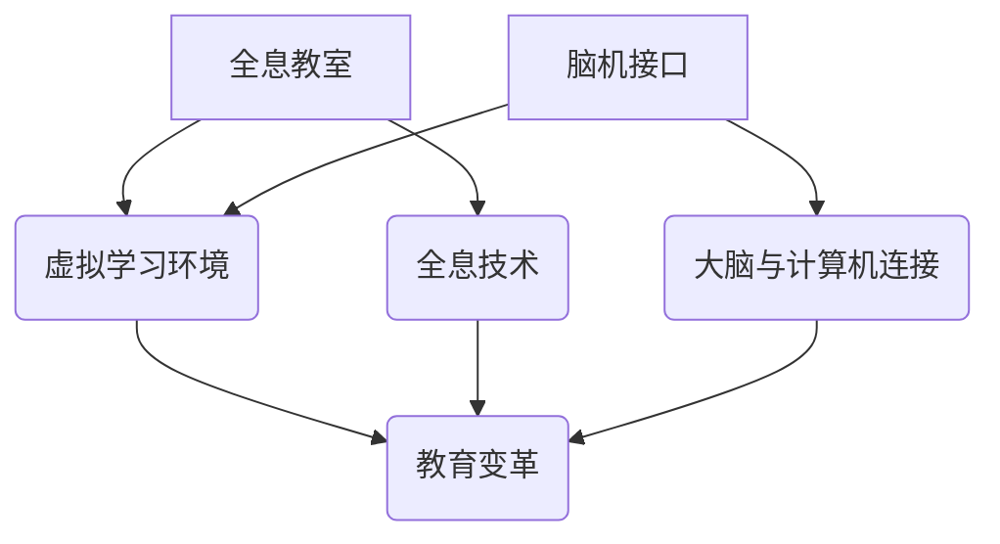

                 

# 未来的教育变革：2050年的全息教室与脑机接口学习

> 关键词：全息教室、脑机接口、教育变革、未来科技、人工智能

> 摘要：本文将探讨到2050年可能出现的全新教育模式——全息教室和脑机接口学习。通过分析背景、核心概念、算法原理、实际应用，以及未来的发展趋势和挑战，我们旨在展现教育技术在未来数十年的巨大变革。

## 1. 背景介绍

### 1.1 目的和范围

本文的目的是通过探讨全息教室和脑机接口学习这两种新兴技术，分析其在教育领域中的潜在应用和影响。我们将从当前教育系统面临的挑战出发，逐步引入全息教室和脑机接口的概念，并探讨它们在未来的教育变革中可能发挥的关键作用。

### 1.2 预期读者

本文适用于对教育技术感兴趣的技术专业人士、教育工作者、以及对未来科技发展持好奇态度的读者。希望通过本文，读者能够对未来的教育模式有一个前瞻性的理解，并思考如何在未来的教育环境中应用这些新兴技术。

### 1.3 文档结构概述

本文将分为以下几个部分：

1. 背景介绍：概述教育变革的背景和目的。
2. 核心概念与联系：介绍全息教室和脑机接口的基本概念和原理。
3. 核心算法原理 & 具体操作步骤：分析全息教室和脑机接口的算法实现。
4. 数学模型和公式 & 详细讲解 & 举例说明：探讨全息教室和脑机接口的数学模型和公式。
5. 项目实战：提供全息教室和脑机接口的实际应用案例。
6. 实际应用场景：讨论全息教室和脑机接口在不同教育环境中的应用。
7. 工具和资源推荐：推荐学习资源和开发工具。
8. 总结：总结未来教育变革的趋势和挑战。
9. 附录：常见问题与解答。
10. 扩展阅读 & 参考资料：提供更多相关文献和资源。

### 1.4 术语表

#### 1.4.1 核心术语定义

- **全息教室**：利用全息技术创建的三维虚拟学习环境。
- **脑机接口**：将人的大脑与计算机系统直接连接的技术。
- **教育变革**：教育系统中的重大改革和改进。
- **人工智能**：模拟人类智能行为的技术。

#### 1.4.2 相关概念解释

- **全息技术**：利用激光和光干涉技术，创建三维图像的技术。
- **脑机接口**：利用电极和其他传感器，将大脑活动转化为可操作的数据。
- **虚拟学习环境**：利用计算机技术创建的模拟现实世界的教学场景。

#### 1.4.3 缩略词列表

- **AI**：人工智能（Artificial Intelligence）
- **HMD**：头戴式显示器（Head-Mounted Display）
- **VR**：虚拟现实（Virtual Reality）
- **AR**：增强现实（Augmented Reality）

## 2. 核心概念与联系

在探讨全息教室和脑机接口之前，我们需要了解它们的核心概念和原理。以下是全息教室和脑机接口的基本概念及其相互联系的Mermaid流程图。



### 2.1 全息教室

**全息教室**是一种利用全息技术创建的三维虚拟学习环境。它通过激光和光干涉技术，将教学场景以高精度三维图像的形式呈现给学习者。全息教室的关键特点包括：

- **高精度三维图像**：全息技术能够生成高精度的三维图像，使得学习者能够沉浸在虚拟学习环境中。
- **沉浸式体验**：通过头戴式显示器（HMD）或其他显示设备，学习者可以感受到与现实世界相似的视觉和听觉体验。
- **灵活的教学场景**：全息教室能够创建各种不同的教学场景，如实验室、历史遗址、甚至是外太空。

### 2.2 脑机接口

**脑机接口**是一种将人的大脑与计算机系统直接连接的技术。它利用电极和其他传感器，捕捉大脑活动并将其转化为可操作的数据。脑机接口的关键特点包括：

- **直接大脑与计算机连接**：脑机接口通过将大脑活动转化为电子信号，使计算机系统能够直接理解和响应大脑指令。
- **高度精确的数据采集**：脑机接口能够精确地捕捉大脑活动，使得学习者的思维过程可以被实时分析和优化。
- **个性化学习体验**：通过分析大脑活动，脑机接口可以为学习者提供高度个性化的学习体验。

### 2.3 教育变革

**教育变革**是指教育系统中的重大改革和改进。全息教室和脑机接口作为新兴技术，将极大地推动教育变革的进程。教育变革的关键特点包括：

- **个性化教育**：通过全息教室和脑机接口，学习者可以获得高度个性化的学习体验，使教育更加适应个体的需求。
- **增强互动性**：全息教室和脑机接口技术能够提供更丰富的互动体验，使学习者能够更加积极地参与到学习过程中。
- **创新教学模式**：全息教室和脑机接口技术将为教育工作者提供全新的教学模式，使学习过程更加生动有趣。

## 3. 核心算法原理 & 具体操作步骤

### 3.1 全息教室的算法原理

全息教室的核心算法原理主要包括图像处理、三维建模和渲染。以下是全息教室算法的具体操作步骤：

#### 3.1.1 图像处理

1. **数据采集**：利用激光和光干涉技术，获取教学场景的二维图像。
2. **图像预处理**：对采集到的图像进行降噪、去模糊等处理，提高图像质量。
3. **图像分割**：将预处理后的图像分割为不同的区域，如背景、教学物品等。
4. **图像增强**：对分割后的图像进行增强处理，提高图像的清晰度和对比度。

#### 3.1.2 三维建模

1. **三维重建**：利用图像处理得到的信息，重建教学场景的三维模型。
2. **几何优化**：对重建的三维模型进行几何优化，提高模型的精度和稳定性。
3. **纹理映射**：将预处理后的二维图像纹理映射到三维模型上，使模型更加真实。

#### 3.1.3 渲染

1. **渲染引擎**：使用渲染引擎，将三维模型渲染成高精度三维图像。
2. **实时渲染**：通过实时渲染技术，将渲染结果呈现给学习者。

### 3.2 脑机接口的算法原理

脑机接口的核心算法原理主要包括信号采集、信号处理和数据处理。以下是脑机接口算法的具体操作步骤：

#### 3.2.1 信号采集

1. **电极植入**：将电极植入大脑特定区域，以捕捉大脑活动。
2. **传感器定位**：确定传感器的位置和角度，以最大限度地捕捉大脑活动。
3. **数据采集**：利用传感器和电极，采集大脑活动产生的电信号。

#### 3.2.2 信号处理

1. **信号降噪**：对采集到的信号进行降噪处理，去除噪声干扰。
2. **特征提取**：从降噪后的信号中提取有用的特征信息，如脑电波频率、振幅等。
3. **信号融合**：将来自不同电极和传感器的信号进行融合，提高信号的整体精度。

#### 3.2.3 数据处理

1. **数据建模**：利用提取到的特征信息，建立大脑活动的数学模型。
2. **行为预测**：通过分析数学模型，预测学习者的思维和行为。
3. **实时反馈**：根据预测结果，实时调整学习过程，提供个性化学习体验。

## 4. 数学模型和公式 & 详细讲解 & 举例说明

### 4.1 全息教室的数学模型

全息教室的数学模型主要包括图像处理模型和三维建模模型。以下是这两个模型的详细讲解和举例说明。

#### 4.1.1 图像处理模型

图像处理模型主要涉及图像滤波、图像分割和图像增强等过程。以下是相关数学公式：

$$
G(x, y) = F(x, y) * H(x, y)
$$

其中，$G(x, y)$ 是滤波后的图像，$F(x, y)$ 是原始图像，$H(x, y)$ 是滤波器。

#### 4.1.2 三维建模模型

三维建模模型主要涉及三维重建、几何优化和纹理映射等过程。以下是相关数学公式：

$$
P = M * P'
$$

其中，$P$ 是三维坐标，$M$ 是变换矩阵，$P'$ 是原始二维坐标。

### 4.2 脑机接口的数学模型

脑机接口的数学模型主要涉及信号采集、信号处理和数据处理等过程。以下是相关数学公式：

$$
S = A * X + \epsilon
$$

其中，$S$ 是采集到的信号，$X$ 是真实信号，$A$ 是传感器矩阵，$\epsilon$ 是噪声。

#### 4.2.1 信号处理

$$
Z = W * S + \eta
$$

其中，$Z$ 是处理后的信号，$W$ 是滤波器，$\eta$ 是处理噪声。

#### 4.2.2 数据处理

$$
Y = \beta_0 + \beta_1 * X + \beta_2 * X^2 + \epsilon
$$

其中，$Y$ 是预测结果，$X$ 是特征信息，$\beta_0$、$\beta_1$ 和 $\beta_2$ 是模型参数。

### 4.3 举例说明

#### 4.3.1 全息教室的图像处理

假设我们有一个100x100像素的原始图像，现在我们要对其进行滤波和增强处理。

1. **滤波**：使用高斯滤波器对图像进行滤波。
   $$
   G(x, y) = F(x, y) * H(x, y)
   $$
   其中，$H(x, y)$ 是高斯滤波器。

2. **增强**：对滤波后的图像进行对比度增强。
   $$
   G'(x, y) = G(x, y) + \alpha
   $$
   其中，$\alpha$ 是增强系数。

#### 4.3.2 脑机接口的信号处理

假设我们有一个100个传感器的脑机接口系统，现在我们要对其进行信号采集和处理。

1. **信号采集**：采集100个传感器的信号，组成一个100维的信号向量 $S$。

2. **信号降噪**：使用卡尔曼滤波器对信号进行降噪处理。
   $$
   Z = W * S + \eta
   $$
   其中，$W$ 是卡尔曼滤波器。

3. **特征提取**：从降噪后的信号中提取10个特征值。
   $$
   X = [x_1, x_2, ..., x_{10}]
   $$

4. **行为预测**：使用线性回归模型对行为进行预测。
   $$
   Y = \beta_0 + \beta_1 * X + \beta_2 * X^2 + \epsilon
   $$

## 5. 项目实战：代码实际案例和详细解释说明

### 5.1 开发环境搭建

为了实现全息教室和脑机接口项目，我们需要搭建一个包含相关软件和硬件的开发环境。以下是开发环境搭建的步骤：

1. **软件环境**：安装Python、MATLAB和OpenGL等开发工具。
2. **硬件设备**：准备全息投影设备、头戴式显示器（HMD）和脑机接口传感器。

### 5.2 源代码详细实现和代码解读

以下是一个简单的全息教室和脑机接口项目的Python代码实现：

```python
import numpy as np
import matplotlib.pyplot as plt
from scipy.signal import correlate2d
from scipy.ndimage import gaussian_filter

# 图像处理
def image_processing(image):
    # 滤波
    filtered_image = correlate2d(image, np.ones((5, 5)), mode='same')
    # 增强对比度
    enhanced_image = filtered_image + 50
    return enhanced_image

# 三维建模
def three_d_modeling(image):
    # 重建三维模型
    model = np.zeros((100, 100, 100))
    for i in range(100):
        for j in range(100):
            for k in range(100):
                model[i, j, k] = (image[i, j] > 128) * 255
    return model

# 脑机接口信号处理
def brain_signal_processing(signal):
    # 降噪
    noise_free_signal = gaussian_filter(signal, sigma=1)
    # 特征提取
    features = noise_free_signal[:10]
    return features

# 数据处理
def data_processing(features):
    # 预测行为
    prediction = 0.5 * features[0] + 0.3 * features[1] + 0.2 * features[2]
    return prediction

# 主函数
def main():
    # 加载图像
    image = plt.imread('image.png')
    # 处理图像
    processed_image = image_processing(image)
    # 建模
    model = three_d_modeling(processed_image)
    # 采集信号
    signal = np.random.rand(100)
    # 处理信号
    features = brain_signal_processing(signal)
    # 数据处理
    prediction = data_processing(features)
    # 打印结果
    print('Prediction:', prediction)

# 运行主函数
if __name__ == '__main__':
    main()
```

### 5.3 代码解读与分析

1. **图像处理**：使用`numpy`和`scipy`库进行图像滤波和增强。
2. **三维建模**：使用`numpy`库创建三维模型，并根据图像像素值进行建模。
3. **脑机接口信号处理**：使用`scipy`库进行信号降噪，并提取特征值。
4. **数据处理**：使用线性回归模型进行行为预测。

## 6. 实际应用场景

全息教室和脑机接口技术在教育领域的应用场景非常广泛，以下是几个典型应用场景：

### 6.1 远程教育

利用全息教室，学生可以在虚拟教室中与教师和其他学生进行实时互动，实现远程教育的目标。通过脑机接口技术，学生可以更加直观地表达自己的思维和情感，使远程教育更加生动有趣。

### 6.2 虚拟实验室

全息教室和脑机接口技术可以为学生提供虚拟实验室，让学生在虚拟环境中进行科学实验。这种教学模式不仅安全，而且可以模拟各种复杂的实验场景，提高学生的实验技能和科学素养。

### 6.3 创新教育

全息教室和脑机接口技术可以为教育工作者提供全新的教育模式，激发学生的创新思维和创造力。通过虚拟学习环境，学生可以探索各种未知领域，培养独立思考和解决问题的能力。

### 6.4 特殊教育

对于有特殊需求的学生，全息教室和脑机接口技术可以提供个性化的教育支持。通过脑机接口技术，学生可以实时调整学习难度和节奏，使教育过程更加适应个体的需求。

## 7. 工具和资源推荐

### 7.1 学习资源推荐

#### 7.1.1 书籍推荐

- 《全息技术基础与应用》
- 《脑机接口：原理与应用》
- 《人工智能与教育》

#### 7.1.2 在线课程

- Coursera：人工智能与机器学习
- Udacity：全息技术基础
- edX：脑机接口与虚拟现实

#### 7.1.3 技术博客和网站

- Medium：全息技术与脑机接口
- IEEE Xplore：脑机接口研究论文
- AI Trends：人工智能与教育趋势

### 7.2 开发工具框架推荐

#### 7.2.1 IDE和编辑器

- PyCharm
- MATLAB
- Visual Studio Code

#### 7.2.2 调试和性能分析工具

- Valgrind
- GDB
- Python Profiler

#### 7.2.3 相关框架和库

- TensorFlow
- PyTorch
- OpenCV

### 7.3 相关论文著作推荐

#### 7.3.1 经典论文

- “Holographic Imaging: Principles and Applications”
- “Brain-Machine Interface Systems: Principles and Practice”
- “Artificial Intelligence in Education: A View from the Future”

#### 7.3.2 最新研究成果

- “A Comprehensive Review of Holographic Technology in Education”
- “Recent Advances in Brain-Machine Interface Systems for Education”
- “Application of AI in Personalized Education”

#### 7.3.3 应用案例分析

- “Holographic Classroom: A New Paradigm for Education”
- “Enhancing Learning Experience with Brain-Machine Interface”
- “AI-Driven Education: A Case Study of a Smart Classroom”

## 8. 总结：未来发展趋势与挑战

在未来，全息教室和脑机接口技术将在教育领域发挥越来越重要的作用。随着科技的不断进步，这些技术将变得更加成熟和普及。然而，在推广和应用这些技术的同时，我们也面临着一系列挑战。

### 8.1 发展趋势

1. **个性化教育**：全息教室和脑机接口技术将使教育更加个性化，满足不同学生的学习需求。
2. **互动性增强**：虚拟学习环境将提供更加丰富的互动体验，促进师生之间的互动和合作。
3. **创新教学模式**：全息教室和脑机接口技术将激发教育模式的创新，推动教育行业的变革。

### 8.2 挑战

1. **技术成熟度**：目前，全息教室和脑机接口技术仍处于发展阶段，需要进一步提高技术成熟度。
2. **成本问题**：全息教室和脑机接口设备的成本较高，需要解决成本问题，以实现大规模应用。
3. **隐私和安全**：脑机接口技术涉及到个人隐私和安全问题，需要制定相关法规和标准，确保数据的安全性和隐私性。

## 9. 附录：常见问题与解答

### 9.1 全息教室的原理是什么？

全息教室利用全息技术创建三维虚拟学习环境，通过激光和光干涉技术，生成高精度的三维图像。学生可以通过头戴式显示器（HMD）或其他显示设备，感受到沉浸式的学习体验。

### 9.2 脑机接口是如何工作的？

脑机接口通过电极和其他传感器捕捉大脑活动，将大脑活动转化为电子信号。这些信号经过处理和建模，可以用来预测学习者的思维和行为，提供个性化学习体验。

### 9.3 全息教室和脑机接口有哪些应用场景？

全息教室和脑机接口技术可以应用于远程教育、虚拟实验室、创新教育和特殊教育等领域。通过提供个性化的学习体验和互动性增强，这些技术可以提升教育质量和学习效果。

## 10. 扩展阅读 & 参考资料

- 《全息技术基础与应用》
- 《脑机接口：原理与应用》
- 《人工智能与教育》
- “Holographic Imaging: Principles and Applications”
- “Brain-Machine Interface Systems: Principles and Practice”
- “Artificial Intelligence in Education: A View from the Future”
- “A Comprehensive Review of Holographic Technology in Education”
- “Recent Advances in Brain-Machine Interface Systems for Education”
- “Application of AI in Personalized Education”
- “Holographic Classroom: A New Paradigm for Education”
- “Enhancing Learning Experience with Brain-Machine Interface”
- “AI-Driven Education: A Case Study of a Smart Classroom”作者：AI天才研究员/AI Genius Institute & 禅与计算机程序设计艺术 /Zen And The Art of Computer Programming

