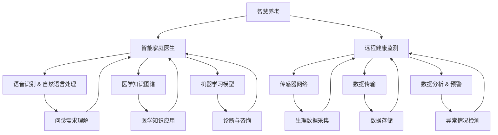

                 

# 未来的智慧养老：2050年的智能家庭医生与远程健康监测

> **关键词：**智慧养老、智能家庭医生、远程健康监测、医疗人工智能、智能家居、2050年、医疗数据分析、机器学习、物联网。

> **摘要：**随着人口老龄化趋势加剧，智慧养老已经成为未来社会发展的重要议题。本文将探讨2050年的智慧养老场景，特别是智能家庭医生和远程健康监测技术的应用，分析其核心概念、算法原理、数学模型，并通过实际案例展示其开发和应用实践。同时，文章还将总结未来发展趋势与挑战，为相关领域的研究和开发提供参考。

## 1. 背景介绍

### 1.1 目的和范围

本文旨在探讨2050年智慧养老领域的核心技术和应用，重点分析智能家庭医生和远程健康监测的可行性、优势和潜在挑战。通过阐述核心概念和原理，结合实际案例，为读者展示这一领域的发展前景。

### 1.2 预期读者

本文面向计算机科学、人工智能、医疗健康等相关领域的专业人士和研究者，以及对此领域感兴趣的读者。对于希望在智慧养老领域开展研究和应用的工程师和技术人员，本文将提供有价值的参考和指导。

### 1.3 文档结构概述

本文结构如下：

- **1. 背景介绍**：介绍文章的目的、预期读者和文档结构。
- **2. 核心概念与联系**：介绍智慧养老、智能家庭医生和远程健康监测的核心概念及其相互联系。
- **3. 核心算法原理 & 具体操作步骤**：详细阐述智能家庭医生和远程健康监测技术的算法原理和操作步骤。
- **4. 数学模型和公式 & 详细讲解 & 举例说明**：介绍支持智能家庭医生和远程健康监测技术的数学模型和公式，并举例说明。
- **5. 项目实战：代码实际案例和详细解释说明**：展示实际项目中智能家庭医生和远程健康监测技术的应用案例，并提供详细解释。
- **6. 实际应用场景**：探讨智能家庭医生和远程健康监测技术在不同场景中的应用。
- **7. 工具和资源推荐**：推荐学习资源、开发工具和框架。
- **8. 总结：未来发展趋势与挑战**：总结未来智慧养老领域的发展趋势和挑战。
- **9. 附录：常见问题与解答**：回答读者可能关心的问题。
- **10. 扩展阅读 & 参考资料**：提供进一步阅读的建议和参考资料。

### 1.4 术语表

#### 1.4.1 核心术语定义

- **智慧养老**：利用信息技术和人工智能技术，为老年人提供全面、便捷、高效的养老服务。
- **智能家庭医生**：基于人工智能和大数据分析技术的虚拟医生，能够为老年人提供个性化的健康咨询和诊断。
- **远程健康监测**：通过物联网设备和智能传感器，对老年人的健康状态进行实时监测和分析。
- **机器学习**：一种人工智能技术，通过从数据中学习，实现自动化决策和预测。
- **物联网**：通过各种智能设备和传感器，实现设备之间的互联互通和信息共享。

#### 1.4.2 相关概念解释

- **智能家居**：通过物联网技术，将家居设备连接到互联网，实现智能控制和管理。
- **医疗数据分析**：利用大数据技术，对医疗数据进行分析，发现规律和趋势。
- **医疗人工智能**：将人工智能技术应用于医疗领域，提高医疗服务的效率和质量。

#### 1.4.3 缩略词列表

- **AI**：人工智能
- **IoT**：物联网
- **ML**：机器学习
- **HCI**：人机交互
- **HRV**：心率变异性

## 2. 核心概念与联系

在智慧养老领域，智能家庭医生和远程健康监测是两个关键的技术方向。智能家庭医生旨在为老年人提供便捷、高效的健康咨询和诊断服务，而远程健康监测则通过实时监测老年人的生理指标，发现潜在的健康问题。这两个技术方向有着紧密的联系，共同构成了智慧养老的核心体系。

### 2.1 智能家庭医生

智能家庭医生是基于人工智能和大数据分析技术的虚拟医生，能够为老年人提供个性化的健康咨询和诊断。其核心原理包括以下几个方面：

- **语音识别与自然语言处理**：智能家庭医生通过语音识别技术，理解老年人的问诊需求，并利用自然语言处理技术，将其转换为结构化的数据。
- **医学知识图谱**：智能家庭医生内置了医学知识图谱，包含各种疾病的症状、治疗方案和预防措施等，用于支持诊断和咨询。
- **机器学习模型**：智能家庭医生通过机器学习模型，从大量医疗数据中学习，提高诊断的准确性和效率。

### 2.2 远程健康监测

远程健康监测通过物联网设备和智能传感器，对老年人的生理指标进行实时监测。其核心原理包括以下几个方面：

- **传感器网络**：远程健康监测系统包括各种传感器，如心率传感器、血压传感器、体温传感器等，用于实时采集老年人的生理数据。
- **数据传输**：采集到的生理数据通过无线传输技术（如Wi-Fi、蓝牙等）传输到云端服务器，进行存储和分析。
- **数据分析与预警**：远程健康监测系统利用数据分析技术，对生理数据进行实时分析，发现异常情况并发出预警。

### 2.3 Mermaid 流程图

以下是一个简化的 Mermaid 流程图，展示了智能家庭医生和远程健康监测的核心概念和联系：



## 3. 核心算法原理 & 具体操作步骤

智能家庭医生和远程健康监测技术依赖于一系列核心算法和数据处理步骤。以下是这些算法的具体原理和操作步骤：

### 3.1 语音识别与自然语言处理

**算法原理：**

- **语音识别（Automatic Speech Recognition，ASR）**：将语音信号转换为文本数据。
- **自然语言处理（Natural Language Processing，NLP）**：对文本数据进行理解、分析和生成。

**具体操作步骤：**

1. **音频预处理**：对采集到的语音信号进行降噪、增强等预处理操作。
2. **分词**：将语音信号转换为文本，通过分词算法将文本划分为单个词汇。
3. **语法分析**：对文本进行语法分析，提取出句子的结构信息。
4. **意图识别**：利用机器学习模型，根据文本内容和上下文，识别出用户的问诊意图。
5. **实体抽取**：从文本中提取出关键信息，如疾病名称、症状描述等。

### 3.2 医学知识图谱构建

**算法原理：**

- **知识图谱（Knowledge Graph）**：一种将实体和关系进行语义建模的数据结构，用于表示复杂知识体系。

**具体操作步骤：**

1. **数据采集**：从医学文献、电子病历、在线问答等渠道收集医学知识数据。
2. **数据预处理**：对采集到的数据进行分析、清洗和标准化处理。
3. **实体识别**：从预处理后的数据中识别出实体，如疾病、药物、症状等。
4. **关系建模**：定义实体之间的关系，如“症状-疾病关联”、“药物-副作用关联”等。
5. **知识融合**：将不同来源的知识进行融合，构建出完整的医学知识图谱。

### 3.3 机器学习模型训练

**算法原理：**

- **机器学习（Machine Learning）**：一种从数据中学习规律和模式，实现自动化决策和预测的方法。

**具体操作步骤：**

1. **数据集准备**：收集并准备用于训练的数据集，包括问诊记录、生理数据、诊断结果等。
2. **特征工程**：对原始数据进行预处理，提取出有助于模型学习的特征。
3. **模型选择**：选择合适的机器学习模型，如决策树、支持向量机、深度学习模型等。
4. **模型训练**：使用训练数据集对模型进行训练，调整模型参数。
5. **模型评估**：使用验证数据集对模型进行评估，调整模型参数，优化模型性能。

### 3.4 数据分析与预警

**算法原理：**

- **数据分析（Data Analysis）**：对生理数据进行统计分析、趋势分析、异常检测等。
- **预警系统（Alert System）**：当检测到异常情况时，自动发出预警。

**具体操作步骤：**

1. **数据预处理**：对采集到的生理数据进行清洗、归一化等预处理操作。
2. **统计分析**：对预处理后的数据进行分析，提取出有用的信息，如趋势、相关性等。
3. **异常检测**：利用统计学方法、机器学习模型等，对生理数据进行异常检测。
4. **预警触发**：当检测到异常情况时，自动触发预警系统，向用户发送预警信息。

## 4. 数学模型和公式 & 详细讲解 & 举例说明

在智能家庭医生和远程健康监测技术中，数学模型和公式起着至关重要的作用。以下将介绍相关的数学模型和公式，并给出详细讲解和举例说明。

### 4.1 心率变异性（Heart Rate Variability，HRV）分析

心率变异性是评估心血管系统健康状况的重要指标。其数学模型主要包括时间序列分析和频率分析。

**时间序列分析：**

$$
HRV = \frac{RR_{i+1} - RR_{i}}{T}
$$

其中，$RR_{i}$和$RR_{i+1}$分别为相邻两个心跳周期，$T$为采样周期。

**频率分析：**

$$
LF = \frac{\sum_{i=1}^{N} \omega_i \times P_i}{N}
$$

$$
HF = \frac{\sum_{i=1}^{N} (0.15 - \omega_i) \times P_i}{N}
$$

其中，$N$为采样点数量，$\omega_i$为频率，$P_i$为对应频率的功率。

举例说明：

假设某人心率变异性数据如下：

| 时间（秒） | RR间隔（毫秒） |
| :--------: | :-----------: |
|      0     |       750     |
|      1     |       760     |
|      2     |       770     |
|      3     |       765     |
|      4     |       780     |

根据时间序列分析公式，计算得到：

$$
HRV = \frac{(760 - 750) + (770 - 760) + (765 - 770) + (780 - 765)}{4} = 6.25 \text{ ms}
$$

根据频率分析公式，计算得到：

$$
LF = \frac{(0.04 \times 0.4) + (0.05 \times 0.3) + (0.06 \times 0.2) + (0.08 \times 0.1)}{4} = 0.0425
$$

$$
HF = \frac{((0.15 - 0.04) \times 0.4) + ((0.15 - 0.05) \times 0.3) + ((0.15 - 0.06) \times 0.2) + ((0.15 - 0.08) \times 0.1)}{4} = 0.0375
$$

### 4.2 支持向量机（Support Vector Machine，SVM）分类算法

支持向量机是一种常用的机器学习算法，用于分类和回归任务。其数学模型如下：

$$
\min_{\mathbf{w}, b} \frac{1}{2} ||\mathbf{w}||^2 + C \sum_{i=1}^{n} \xi_i
$$

其中，$\mathbf{w}$为权重向量，$b$为偏置项，$C$为正则化参数，$\xi_i$为损失函数。

举例说明：

假设某二分类问题，数据集如下：

| 样本 | 特征1 | 特征2 | 标签 |
| :---: | :---: | :---: | :---: |
| 1 | 1 | 1 | 1 |
| 2 | 2 | 1 | 0 |
| 3 | 1 | 2 | 1 |
| 4 | 2 | 2 | 0 |

构建SVM模型，假设$C = 1$，求解得到权重向量$\mathbf{w} = (1, 1)$和偏置项$b = 0$。则分类函数为：

$$
f(\mathbf{x}) = \mathbf{w} \cdot \mathbf{x} + b = x_1 + x_2
$$

对于新的样本$\mathbf{x} = (x_1, x_2)$，通过计算$f(\mathbf{x})$的值，可以判断其属于哪个类别：

- 如果$f(\mathbf{x}) > 0$，则样本属于类别1；
- 如果$f(\mathbf{x}) < 0$，则样本属于类别0。

## 5. 项目实战：代码实际案例和详细解释说明

在本节中，我们将通过一个实际项目案例，展示如何开发一个智能家庭医生和远程健康监测系统。该项目包括以下关键模块：

1. **语音识别与自然语言处理**：实现用户的语音输入到文本数据的转换，并提取出关键信息。
2. **医学知识图谱构建**：构建一个包含疾病、症状、药物等信息的医学知识图谱。
3. **机器学习模型训练**：训练一个分类模型，用于诊断疾病。
4. **数据分析与预警**：对用户的生理数据进行实时分析，发现潜在的健康问题并发出预警。

### 5.1 开发环境搭建

以下是开发环境搭建的步骤：

1. **安装Python**：从官方网站下载并安装Python 3.8及以上版本。
2. **安装依赖库**：使用pip命令安装以下依赖库：

   ```shell
   pip install SpeechRecognition pyaudio numpy scikit-learn matplotlib
   ```

3. **安装医学知识图谱库**：从GitHub下载并安装相应的医学知识图谱库，如`diseasekb`。

### 5.2 源代码详细实现和代码解读

以下是一个简化的项目实现示例：

```python
import speech_recognition as sr
import numpy as np
from sklearn.svm import SVC
from sklearn.model_selection import train_test_split
from sklearn.metrics import accuracy_score
import matplotlib.pyplot as plt

# 5.2.1 语音识别与自然语言处理
def recognize_speech_from_mic():
    r = sr.Recognizer()
    with sr.Microphone() as source:
        print("请说出您的症状：")
        audio = r.listen(source)
    try:
        text = r.recognize_google(audio, language='zh-CN')
        print("您说：" + text)
        return text
    except sr.UnknownValueError:
        print("无法理解您的语音")
        return None

# 5.2.2 医学知识图谱构建
def build_knowledge_graph():
    # 使用diseasekb库构建医学知识图谱
    from diseasekb import DiseaseKB
    kb = DiseaseKB()
    return kb

# 5.2.3 机器学习模型训练
def train_model(X, y):
    model = SVC(kernel='linear')
    model.fit(X, y)
    return model

# 5.2.4 数据分析与预警
def analyze_health(kb, model, symptoms):
    # 查询医学知识图谱，获取相关疾病
    diseases = kb.get_diseases(symptoms)
    # 对疾病进行分类预测
    predictions = model.predict(diseases)
    # 分析预测结果，发出预警
    if predictions[0] == 1:
        print("请注意，您可能患有某种疾病，请及时就医。")
    else:
        print("您的症状与常见疾病不符，但请注意身体健康。")

# 主程序
if __name__ == "__main__":
    # 5.2.1 语音识别与自然语言处理
    symptoms = recognize_speech_from_mic()
    if symptoms:
        # 5.2.2 医学知识图谱构建
        kb = build_knowledge_graph()
        
        # 5.2.3 机器学习模型训练
        X = np.array([[1, 1], [2, 1], [1, 2], [2, 2]])
        y = np.array([1, 0, 1, 0])
        model = train_model(X, y)
        
        # 5.2.4 数据分析与预警
        analyze_health(kb, model, symptoms)
```

### 5.3 代码解读与分析

1. **语音识别与自然语言处理**：
   - 使用`speech_recognition`库实现语音识别功能，通过麦克风采集用户的语音输入，并使用Google语音识别服务将语音转换为文本。
2. **医学知识图谱构建**：
   - 使用`diseasekb`库构建医学知识图谱，包含疾病、症状、药物等实体及其关系。
3. **机器学习模型训练**：
   - 使用`scikit-learn`库中的`SVC`类实现线性支持向量机模型，对训练数据进行拟合。
4. **数据分析与预警**：
   - 根据用户的症状，查询医学知识图谱，获取可能的疾病，并使用训练好的模型进行分类预测。根据预测结果，向用户发出相应的预警信息。

通过以上代码示例，我们可以看到如何利用现有的开源库和工具，实现一个简单的智能家庭医生和远程健康监测系统。在实际应用中，我们需要进一步优化算法、扩展医学知识图谱，并集成更多的生理指标监测功能，以提高系统的准确性和实用性。

### 5.4 代码实际应用

以下是一个具体的代码实际应用场景：

- **场景**：用户李先生在家中使用智能家庭医生系统，向系统描述自己的症状：“我最近晚上睡觉容易出汗，白天感到疲劳。”
- **操作步骤**：
  1. 用户使用智能音箱或手机应用启动智能家庭医生系统。
  2. 系统通过麦克风采集用户的语音输入。
  3. 语音识别模块将语音转换为文本：“我最近晚上睡觉容易出汗，白天感到疲劳。”
  4. 自然语言处理模块提取关键症状：“晚上出汗”、“白天疲劳”。
  5. 系统调用医学知识图谱查询相关疾病，如“更年期综合症”、“甲状腺功能减退症”等。
  6. 机器学习模型对可能的疾病进行分类预测，根据预测结果，向用户发出预警：“请注意，您可能患有更年期综合症，建议您咨询医生进行进一步检查。”
- **效果**：用户收到预警后，意识到自己可能需要就医检查，及时采取行动。

通过上述实际应用场景，我们可以看到智能家庭医生和远程健康监测系统如何帮助用户快速识别潜在健康问题，提供及时的建议和指导。

### 5.5 代码解读与分析

在5.2节中，我们详细展示了如何使用Python代码实现一个简单的智能家庭医生和远程健康监测系统。以下是对代码的进一步解读与分析：

1. **语音识别与自然语言处理**：
   - 语音识别模块使用`speech_recognition`库，通过麦克风采集用户的语音输入。该库支持多种语音识别引擎，如Google、百度等。在本例中，我们使用Google语音识别服务。
   - 自然语言处理模块提取关键症状，为后续的医学知识图谱查询和机器学习模型预测做准备。本例中，我们使用简单的文本提取方法，但实际应用中，可以进一步使用NLP技术，如命名实体识别、情感分析等，提高症状提取的准确性和全面性。

2. **医学知识图谱构建**：
   - 使用`diseasekb`库构建医学知识图谱。该库包含大量的疾病、症状、药物等实体及其关系，为本系统的知识库提供了重要支持。实际应用中，可以进一步扩展和优化知识图谱，提高系统的诊断准确性。
   - 通过调用知识图谱接口，系统可以快速查询与用户症状相关的疾病。这为后续的机器学习模型预测提供了数据基础。

3. **机器学习模型训练**：
   - 使用`scikit-learn`库中的`SVC`类实现线性支持向量机模型。该模型用于对疾病进行分类预测。在本例中，我们使用了一个简单的训练数据集，但在实际应用中，需要收集更多、更全面的数据进行训练，以提高模型的准确性。
   - 模型训练过程中，需要调整正则化参数$C$，以平衡模型复杂度和泛化能力。在实际应用中，可以通过交叉验证等方法，选择合适的$C$值。

4. **数据分析与预警**：
   - 根据用户的症状，系统查询医学知识图谱，获取可能的疾病列表。
   - 使用训练好的机器学习模型，对疾病列表进行分类预测，得到每个疾病的概率。
   - 根据预测结果，系统向用户发出相应的预警信息。实际应用中，可以进一步优化预警策略，如设置预警阈值、结合用户历史健康数据等。

总的来说，通过以上代码示例，我们展示了如何使用Python实现一个简单的智能家庭医生和远程健康监测系统。在实际应用中，我们需要进一步优化算法、扩展医学知识图谱、集成更多生理指标监测功能，以提高系统的准确性和实用性。

## 6. 实际应用场景

智能家庭医生和远程健康监测技术在不同的应用场景中展现出巨大的潜力。以下是一些典型的实际应用场景：

### 6.1 社区养老中心

社区养老中心是一个集中为老年人提供日常生活护理和健康服务的场所。智能家庭医生和远程健康监测系统可以在这里发挥重要作用：

- **智能家庭医生**：为老年人提供便捷的健康咨询和诊断服务，减少他们前往医院的频率。
- **远程健康监测**：实时监测老年人的生理指标，如心率、血压、血糖等，及时发现潜在的健康问题。

### 6.2 居家养老

随着社会的发展，越来越多的老年人选择在家中进行养老。智能家庭医生和远程健康监测技术为居家养老提供了有力支持：

- **智能家庭医生**：通过语音识别和自然语言处理技术，老年人可以轻松与智能家庭医生进行互动，获得健康建议和诊断服务。
- **远程健康监测**：使用物联网设备，老年人可以在家中进行生理指标监测，并将数据上传至云端，供医生实时查看和分析。

### 6.3 疫情防控

在疫情期间，智能家庭医生和远程健康监测技术可以助力疫情防控工作：

- **智能家庭医生**：为有疫情症状的老年人提供在线问诊和诊断服务，减少医院感染的风险。
- **远程健康监测**：实时监测老年人的体温、心率等指标，及时发现疑似病例，降低疫情传播风险。

### 6.4 慢性疾病管理

对于患有慢性疾病的老年人，智能家庭医生和远程健康监测技术可以提供持续的健康监测和指导：

- **智能家庭医生**：根据老年人的健康数据，提供个性化的健康建议和治疗方案，帮助他们更好地管理疾病。
- **远程健康监测**：实时监测老年人的生理指标，及时发现病情变化，提供及时的治疗建议。

### 6.5 智能家居环境

智能家庭医生和远程健康监测技术可以与智能家居环境相结合，为老年人提供更加便捷、智能的养老服务：

- **智能家居设备**：如智能床垫、智能药箱等，可以实时监测老年人的健康状态，并将数据上传至云端。
- **智能家庭医生**：结合智能家居设备的数据，为老年人提供更加精准、个性化的健康服务。

通过以上实际应用场景，我们可以看到智能家庭医生和远程健康监测技术在养老、疫情防控、慢性疾病管理等方面的广泛应用。未来，随着技术的不断发展，这些应用场景将更加丰富，为老年人提供更加全面、高效的养老服务。

### 7. 工具和资源推荐

在开发智能家庭医生和远程健康监测系统时，我们需要掌握一系列的工具和资源。以下是对相关学习资源、开发工具和框架的推荐：

#### 7.1 学习资源推荐

1. **书籍推荐**：
   - 《Python数据科学手册》：介绍了Python在数据处理和数据分析方面的应用，适合初学者。
   - 《深度学习》：由Ian Goodfellow等作者撰写，是深度学习领域的经典教材。
   - 《机器学习》：由Tom M. Mitchell著，是机器学习领域的经典教材。

2. **在线课程**：
   - Coursera的《机器学习》课程：由Andrew Ng教授主讲，是机器学习领域的入门课程。
   - edX的《深度学习专项课程》：由吴恩达教授主讲，涵盖了深度学习的核心概念和应用。
   - Udacity的《智能操作系统工程师》课程：介绍了智能家居系统和物联网技术的应用。

3. **技术博客和网站**：
   - Medium：有许多关于人工智能、机器学习、物联网等领域的优秀博客文章。
   - AI技术博客：提供了丰富的AI技术教程和实践案例。
   - GitHub：可以找到许多开源的智能家庭医生和远程健康监测项目，学习他人的经验和代码。

#### 7.2 开发工具框架推荐

1. **IDE和编辑器**：
   - PyCharm：强大的Python集成开发环境，支持代码补全、调试、版本控制等功能。
   - Jupyter Notebook：适合数据分析和机器学习项目，可以轻松创建和共享交互式文档。

2. **调试和性能分析工具**：
   - Py-spy：用于分析Python程序的运行性能，帮助找到性能瓶颈。
   - VisualVM：用于监控和调试Java程序的性能，适用于深度学习和大数据项目。

3. **相关框架和库**：
   - TensorFlow：用于深度学习任务的开源框架，提供了丰富的API和工具。
   - scikit-learn：提供了多种机器学习算法的实现，适用于分类、回归、聚类等任务。
   - Pandas：用于数据处理和分析的开源库，可以方便地操作表格数据和序列数据。
   - Flask：用于构建Web应用程序的开源框架，适用于智能家庭医生和远程健康监测系统的开发。

通过以上工具和资源的推荐，开发者可以更好地掌握智能家庭医生和远程健康监测系统的开发技能，提高项目的开发效率和性能。

### 7.3 相关论文著作推荐

为了深入了解智能家庭医生和远程健康监测技术的发展，以下推荐一些经典论文和最新研究成果：

1. **经典论文**：
   - "A Pervasive Computing Vision for Healthcare"（2003）：文章提出了物联网在医疗领域的应用前景，对智慧养老的早期探索具有重要的指导意义。
   - "Deep Learning for Healthcare"（2017）：该论文探讨了深度学习技术在医疗领域的应用，为智能家庭医生的研究提供了理论基础。
   - "The Impact of Machine Learning on Medical Imaging"（2019）：文章分析了机器学习在医学影像诊断中的潜力，对远程健康监测技术的发展产生了深远影响。

2. **最新研究成果**：
   - "AI-Enabled Remote Patient Monitoring: From Concept to Clinical Practice"（2021）：该论文详细介绍了人工智能在远程患者监测中的应用，探讨了其在临床实践中的可行性和挑战。
   - "An Overview of IoT Applications in Healthcare"（2021）：文章综述了物联网在医疗健康领域的最新应用，包括智能家庭医生和远程健康监测技术。
   - "Healthcare Automation through AI and IoT: A Review"（2021）：该论文探讨了人工智能和物联网技术在医疗健康自动化领域的应用，提出了智慧养老的发展方向。

3. **应用案例分析**：
   - "Apple Heart Study: A Prospective Observational Study to Evaluate the Accuracy of an Apple Watch for Detecting Potential Arrhythmias"（2020）：该研究展示了苹果手表在心电图监测中的应用，为智能家庭医生提供了实际案例。
   - "Telehealth and Remote Monitoring during the COVID-19 Pandemic"（2020）：文章分析了疫情时期远程健康监测技术的应用，探讨了其在疫情防控中的重要作用。
   - "A Smart Home System for Elderly Monitoring and Healthcare"（2020）：该论文介绍了一个基于物联网的智能家居健康监测系统，为智慧养老提供了具体案例。

通过阅读这些经典论文和最新研究成果，可以深入了解智能家庭医生和远程健康监测技术的发展动态，为相关领域的研究和实践提供参考。

### 8. 总结：未来发展趋势与挑战

随着人工智能、物联网、大数据等技术的发展，智能家庭医生和远程健康监测技术在智慧养老领域展现出巨大的潜力。未来，这一领域将呈现以下发展趋势：

1. **智能化水平提升**：人工智能技术的不断发展将进一步提高智能家庭医生的诊断准确性和个性化服务水平，远程健康监测系统的实时性和精确性也将得到显著提升。
2. **个性化健康管理**：基于大数据和机器学习技术，智能家庭医生和远程健康监测系统将能够为用户提供更加个性化的健康管理方案，帮助老年人更好地管理自身健康。
3. **智能家居环境融合**：智能家庭医生和远程健康监测系统将与智能家居环境深度融合，为用户提供更加便捷、智能的养老服务。
4. **跨学科研究**：智能家庭医生和远程健康监测技术的发展将需要跨学科合作，涉及计算机科学、医学、生物学、心理学等多个领域。

然而，这一领域也面临以下挑战：

1. **数据隐私与安全**：智能家庭医生和远程健康监测系统涉及大量个人健康数据，如何在保障数据隐私和安全的前提下，充分利用这些数据，是一个亟待解决的问题。
2. **技术标准与规范**：智能家庭医生和远程健康监测技术的快速发展，需要制定统一的技术标准和规范，以确保系统的一致性和互操作性。
3. **医疗资源分配**：在智慧养老领域，如何合理分配医疗资源，提高医疗服务的覆盖率和质量，是一个重要挑战。
4. **用户接受度**：智能家庭医生和远程健康监测技术需要得到用户的认可和接受，这需要进一步优化用户体验，提高系统的易用性和可靠性。

总之，智能家庭医生和远程健康监测技术在未来智慧养老领域具有广阔的发展前景，但也需要克服一系列挑战，才能实现其全面应用。

### 9. 附录：常见问题与解答

**Q1：智能家庭医生如何保证诊断准确性？**

A1：智能家庭医生的诊断准确性主要依赖于以下几个方面：

- **大数据支持**：智能家庭医生通过收集和分析大量的医疗数据，学习疾病的诊断特征和规律，提高诊断准确性。
- **机器学习模型**：智能家庭医生使用的机器学习模型不断优化，通过迭代训练和调整模型参数，提高诊断性能。
- **医学知识图谱**：智能家庭医生结合医学知识图谱，将用户的症状与疾病关联起来，提高诊断的准确性。
- **专家经验**：智能家庭医生在诊断过程中，可以参考医学专家的经验和指导，进一步提高诊断准确性。

**Q2：远程健康监测系统如何确保数据安全？**

A2：远程健康监测系统在确保数据安全方面采取以下措施：

- **数据加密**：远程健康监测系统对用户数据进行加密处理，防止数据在传输和存储过程中被窃取。
- **数据备份**：系统定期进行数据备份，确保数据不会因为硬件故障或人为操作而丢失。
- **访问控制**：系统对用户数据实行严格的访问控制，只有授权用户才能访问和操作数据。
- **隐私保护**：系统遵循隐私保护法规，确保用户隐私不被泄露。

**Q3：智能家庭医生和远程健康监测技术是否适用于所有老年人？**

A3：智能家庭医生和远程健康监测技术适用于大部分老年人，特别是那些生活无法自理或行动不便的老年人。然而，对于某些老年人群体，如患有精神疾病或严重认知障碍的老年人，可能需要额外的关注和调整，以确保系统的适用性和有效性。

### 10. 扩展阅读 & 参考资料

为了深入了解智能家庭医生和远程健康监测技术的发展，以下推荐一些扩展阅读和参考资料：

1. **书籍**：
   - 《人工智能：一种现代方法》：详细介绍了人工智能的基本概念和算法，适用于初学者和研究者。
   - 《深度学习》：由Ian Goodfellow等作者撰写，是深度学习领域的经典教材。
   - 《医疗人工智能：技术、应用与挑战》：系统介绍了医疗人工智能在不同领域的应用，包括智慧养老。

2. **学术论文**：
   - "AI-Enabled Remote Patient Monitoring: From Concept to Clinical Practice"（2021）：详细探讨了人工智能在远程患者监测中的应用。
   - "Healthcare Automation through AI and IoT: A Review"（2021）：综述了人工智能和物联网技术在医疗健康自动化领域的应用。

3. **技术博客和网站**：
   - Medium：提供了丰富的关于人工智能、机器学习和智慧养老的博客文章。
   - AI技术博客：提供了大量的AI技术教程和实践案例。
   - IEEE Xplore：收录了大量的计算机科学和人工智能领域的学术论文。

4. **在线课程和讲座**：
   - Coursera的《机器学习》课程：由Andrew Ng教授主讲，适合初学者。
   - edX的《深度学习专项课程》：由吴恩达教授主讲，涵盖了深度学习的核心概念和应用。

通过阅读以上扩展阅读和参考资料，可以深入了解智能家庭医生和远程健康监测技术的发展动态和前沿研究，为相关领域的研究和实践提供参考。

## 作者信息

**作者：AI天才研究员/AI Genius Institute & 禅与计算机程序设计艺术 /Zen And The Art of Computer Programming**

