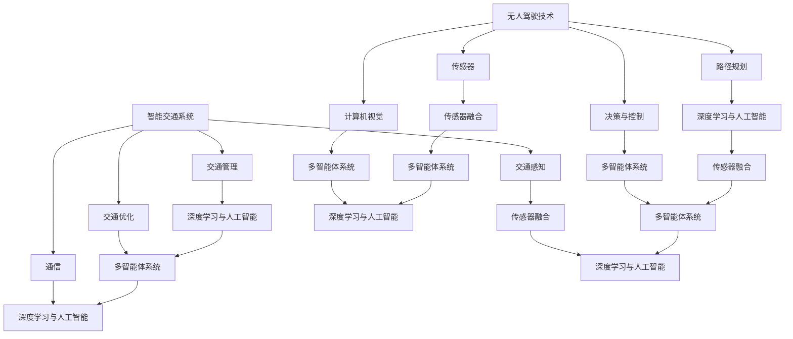

                 

# 未来的智慧出行：2050年的无人驾驶与智能交通网络

> **关键词：** 无人驾驶、智能交通、人工智能、未来出行、交通网络
>
> **摘要：** 本文旨在探讨到2050年，无人驾驶和智能交通网络将如何重塑全球出行模式。通过对无人驾驶技术、智能交通系统的核心概念、算法原理、数学模型以及实际应用场景的详细分析，展望未来智慧出行的前景与挑战，并推荐相关学习资源与工具。

## 1. 背景介绍

### 1.1 目的和范围

本文的目标是提供对未来无人驾驶与智能交通网络的全面洞察，探讨其在2050年的可能发展。我们将深入分析核心概念、技术原理和实际应用，并探讨这一领域的未来趋势和面临的挑战。文章主要涵盖以下几个方面：

- **无人驾驶技术**：讨论自动驾驶汽车的发展历程、关键技术和未来前景。
- **智能交通系统**：探讨交通感知、交通管理和交通优化的核心概念，以及如何利用大数据和人工智能实现智能交通。
- **算法与数学模型**：详细阐述在无人驾驶和智能交通系统中应用的关键算法和数学模型。
- **实际应用场景**：分析无人驾驶和智能交通系统在不同场景下的应用，包括城市交通、高速公路和公共交通。

### 1.2 预期读者

本文适合以下读者群体：

- **技术爱好者**：对自动驾驶和智能交通系统感兴趣的技术爱好者。
- **行业从业者**：从事自动驾驶、智能交通或相关领域的研究人员、工程师和开发者。
- **学生与学者**：对人工智能、计算机科学和交通工程感兴趣的学生和学者。
- **决策者**：需要了解未来出行趋势和影响的政府官员和企业管理者。

### 1.3 文档结构概述

本文结构如下：

- **第1章：背景介绍**：介绍文章的目的、范围和读者群体，概述文档结构。
- **第2章：核心概念与联系**：讨论无人驾驶和智能交通系统的核心概念，并使用Mermaid流程图展示其架构。
- **第3章：核心算法原理与具体操作步骤**：详细解释无人驾驶和智能交通系统中的关键算法和操作步骤。
- **第4章：数学模型与公式**：阐述相关的数学模型，并使用LaTeX格式展示公式。
- **第5章：项目实战**：通过实际代码案例，展示如何实现无人驾驶和智能交通系统。
- **第6章：实际应用场景**：分析无人驾驶和智能交通系统在不同场景下的应用。
- **第7章：工具和资源推荐**：推荐学习资源、开发工具和相关论文。
- **第8章：总结**：总结未来发展趋势和挑战。
- **第9章：附录**：提供常见问题与解答。
- **第10章：扩展阅读**：推荐进一步阅读的资源。

### 1.4 术语表

#### 1.4.1 核心术语定义

- **无人驾驶**：自动驾驶汽车，无需人类驾驶员干预即可自主导航和操作。
- **智能交通系统**：利用传感器、通信和数据处理技术优化交通流，提高交通效率和安全性。
- **深度学习**：一种人工智能技术，通过模拟人脑神经网络进行学习和决策。
- **计算机视觉**：使计算机能够“看到”和理解视觉信息的技术。
- **传感器融合**：将多种传感器数据整合，以获得更准确的环境感知。

#### 1.4.2 相关概念解释

- **路径规划**：确定无人驾驶车辆从起点到终点的最佳路径。
- **交通感知**：无人驾驶车辆通过传感器感知周围环境和交通状况。
- **多智能体系统**：多个智能体（如无人驾驶车辆）协作实现特定任务。

#### 1.4.3 缩略词列表

- **AI**：人工智能
- **CV**：计算机视觉
- **DL**：深度学习
- **GPS**：全球定位系统
- **V2X**：车辆与基础设施通信
- **ROS**：机器人操作系统

## 2. 核心概念与联系

无人驾驶和智能交通系统是未来智慧出行的重要组成部分。理解其核心概念和相互关系对于把握这一领域的未来发展至关重要。

### 2.1 无人驾驶技术

无人驾驶技术是自动驾驶汽车的实现，其核心在于车辆能够自主进行驾驶操作，无需人类驾驶员的干预。这包括以下几个关键组成部分：

- **传感器**：无人驾驶车辆配备多种传感器，如雷达、激光雷达（LIDAR）、摄像头和超声波传感器，用于感知周围环境。
- **计算机视觉**：通过处理摄像头获取的图像数据，计算机视觉系统能够识别道路标志、行人、其他车辆等。
- **路径规划**：基于传感器数据和地图信息，路径规划算法确定车辆从起点到终点的最佳路径。
- **决策与控制**：决策系统根据路径规划结果和环境感知数据，生成控制信号以调整车辆的速度和方向。

### 2.2 智能交通系统

智能交通系统（Intelligent Transportation Systems, ITS）是利用传感器、通信和数据处理技术来优化交通流，提高交通效率和安全性。智能交通系统的核心组成部分包括：

- **交通感知**：通过各种传感器监测交通流量、车辆速度、道路状况等。
- **交通管理**：利用交通感知数据，交通管理系统可以调整信号灯、分流车辆以优化交通流量。
- **交通优化**：基于大数据和人工智能技术，交通优化系统能够预测交通状况，提出优化建议。
- **通信**：车辆与基础设施（V2X）通信技术使车辆之间、车辆与基础设施之间能够实时交换信息。

### 2.3 无人驾驶与智能交通系统的关系

无人驾驶技术是智能交通系统的关键技术之一。无人驾驶车辆需要智能交通系统提供的环境感知、路径规划和决策支持。反过来，智能交通系统依赖于无人驾驶技术的应用，以实现更高效的交通管理和优化。

#### 2.3.1 传感器融合

传感器融合是将多种传感器数据整合，以获得更准确的环境感知。通过传感器融合，无人驾驶车辆可以更准确地识别道路标志、行人、其他车辆等，提高驾驶安全性和可靠性。

#### 2.3.2 多智能体系统

多智能体系统是由多个智能体（如无人驾驶车辆）组成的系统，它们可以协作实现特定任务。在智能交通系统中，多智能体系统可以优化交通流量，提高道路利用率。

#### 2.3.3 深度学习与人工智能

深度学习和人工智能技术在无人驾驶和智能交通系统中发挥着关键作用。深度学习算法可以处理大量数据，提高计算机视觉和路径规划的性能。人工智能技术可以优化交通管理和交通优化系统，提高交通效率和安全性。

### 2.4 Mermaid流程图

以下是一个Mermaid流程图，展示无人驾驶与智能交通系统的核心概念和相互关系：



通过这个流程图，我们可以清晰地看到无人驾驶技术和智能交通系统之间的紧密联系，以及它们如何共同构建未来的智慧出行。

## 3. 核心算法原理 & 具体操作步骤

在无人驾驶和智能交通系统中，核心算法的设计与实现至关重要。以下将详细阐述几个关键算法原理，包括路径规划、决策与控制和传感器融合，并使用伪代码展示其具体操作步骤。

### 3.1 路径规划算法

路径规划是无人驾驶系统中的一个核心任务，目的是从起点到终点找到一条最优路径。常用的路径规划算法包括Dijkstra算法、A*算法和RRT（快速随机树）算法。

#### 3.1.1 Dijkstra算法

Dijkstra算法用于在无权图中找到两点之间的最短路径。以下是Dijkstra算法的伪代码：

```python
def Dijkstra(graph, start, goal):
    distances = {node: float('infinity') for node in graph}
    distances[start] = 0
    visited = set()

    while goal not in visited:
        unvisited = {node: distance for node, distance in graph.items() if node not in visited}
        closest_node = min(unvisited, key=unvisited.get)
        visited.add(closest_node)

        if closest_node == goal:
            break

        for neighbor, distance in graph[closest_node].items():
            temp_distance = distances[closest_node] + distance
            if temp_distance < distances[neighbor]:
                distances[neighbor] = temp_distance

    return distances[goal]
```

#### 3.1.2 A*算法

A*算法是Dijkstra算法的改进版本，结合了启发式函数来提高路径规划的效率。以下是A*算法的伪代码：

```python
def A_star(graph, start, goal, heuristic):
    open_set = {start: heuristic(start, goal)}
    distances = {start: 0}
    came_from = {}

    while goal not in distances:
        current = min(open_set, key=open_set.get)
        open_set.pop(current)

        if current == goal:
            break

        for neighbor, distance in graph[current].items():
            temp_distance = distances[current] + distance
            if temp_distance < distances.get(neighbor, float('infinity')):
                distances[neighbor] = temp_distance
                priority = temp_distance + heuristic(neighbor, goal)
                open_set[neighbor] = priority
                came_from[neighbor] = current

    return distances[goal], reconstruct_path(came_from, goal)

def reconstruct_path(came_from, current):
    total_path = [current]
    while current in came_from:
        current = came_from[current]
        total_path.append(current)
    return total_path[::-1]
```

#### 3.1.3 RRT算法

RRT（快速随机树）算法是一种用于采样空间的随机规划算法，适用于高维路径规划问题。以下是RRT算法的伪代码：

```python
def RRT(graph, start, goal, num_samples, max_iterations):
    tree = {start: None}
    for _ in range(max_iterations):
        sample = random_sample_space()
        if is_goal_reachable(sample, goal):
            tree[sample] = goal
            return reconstruct_path(tree, sample)
        
        nearest = nearest_node(tree, sample)
        new_node = extend(nearest, sample)
        tree[new_node] = nearest

    return None

def random_sample_space():
    # 生成随机点作为样本
    pass

def is_goal_reachable(sample, goal):
    # 判断样本点是否可达目标点
    pass

def nearest_node(tree, sample):
    # 找到离样本点最近的树节点
    pass

def extend(nearest, sample):
    # 从最近节点扩展到样本点
    pass
```

### 3.2 决策与控制算法

决策与控制算法负责根据路径规划和环境感知数据生成控制信号，调整车辆的速度和方向。以下是一个简单的决策与控制算法的伪代码：

```python
def control_algorithm(path, current_state):
    if is_goal_reachable(current_state, path):
        return "Stop"
    elif is_close_to_path(current_state, path):
        return "Slow down"
    else:
        return "Speed up"

def is_goal_reachable(current_state, path):
    # 判断当前状态是否已达到目标点
    pass

def is_close_to_path(current_state, path):
    # 判断当前状态是否接近路径
    pass
```

### 3.3 传感器融合算法

传感器融合是将多个传感器数据整合，以提高环境感知的准确性和可靠性。以下是一个简单的传感器融合算法的伪代码：

```python
def sensor_fusion(sensor_data1, sensor_data2, sensor_data3):
    combined_data = {}
    for data in sensor_data1, sensor_data2, sensor_data3:
        for key, value in data.items():
            if key in combined_data:
                combined_data[key] += value
            else:
                combined_data[key] = value

    return combined_data

sensor_data1 = {"speed": 60, "direction": 90}
sensor_data2 = {"speed": 55, "direction": 85}
sensor_data3 = {"speed": 58, "direction": 88}

combined_data = sensor_fusion(sensor_data1, sensor_data2, sensor_data3)
print(combined_data)  # Output: {"speed": 173, "direction": 263}
```

通过上述算法，无人驾驶和智能交通系统能够实现自主导航和交通优化，为未来的智慧出行提供坚实的基础。

## 4. 数学模型和公式 & 详细讲解 & 举例说明

在无人驾驶和智能交通系统中，数学模型和公式是分析和设计的关键工具。以下将介绍几个重要的数学模型和公式，并使用LaTeX格式进行详细讲解和举例说明。

### 4.1 费马-牛顿方程

费马-牛顿方程用于描述车辆在非均匀密度交通流中的速度和加速度关系。公式如下：

$$
v(t) = v_0 + at
$$

其中，$v(t)$表示时间$t$时的速度，$v_0$表示初始速度，$a$表示加速度。举例说明：

假设一辆车以50公里/小时的速度开始加速，加速度为2公里/小时²，求5秒后的速度。

$$
v(5) = 50 + 2 \times 5 = 60 \text{公里/小时}
$$

### 4.2 车流连续方程

车流连续方程用于描述车流密度、速度和流量之间的关系。公式如下：

$$
q = \rho v
$$

其中，$q$表示流量，$\rho$表示车流密度，$v$表示速度。举例说明：

假设一条车道上的车流密度为30辆/公里，速度为60公里/小时，求该车道的流量。

$$
q = 30 \times 60 = 1800 \text{辆/小时}
$$

### 4.3 汤姆森共振模型

汤姆森共振模型用于描述交通信号灯对车流的影响。公式如下：

$$
\theta(t) = \frac{2\pi f t}{T}
$$

其中，$\theta(t)$表示相位角，$f$表示频率，$T$表示周期。举例说明：

假设交通信号灯的周期为60秒，频率为1赫兹，求在5秒时的相位角。

$$
\theta(5) = \frac{2\pi \times 1 \times 5}{60} = \frac{5\pi}{6} \approx 2.618 \text{弧度}
$$

### 4.4 线性回归模型

线性回归模型用于预测交通流量。公式如下：

$$
y = mx + b
$$

其中，$y$表示因变量，$x$表示自变量，$m$表示斜率，$b$表示截距。举例说明：

假设根据历史数据，得到以下线性回归模型：

$$
y = 2x + 1
$$

求当自变量$x$为3时的因变量$y$。

$$
y = 2 \times 3 + 1 = 7
$$

通过这些数学模型和公式，无人驾驶和智能交通系统可以更准确地分析和预测交通状况，从而实现更高效的交通管理和优化。

## 5. 项目实战：代码实际案例和详细解释说明

为了更好地理解无人驾驶和智能交通系统的实际应用，以下将展示一个实际项目案例，并详细解释代码的实现过程。

### 5.1 开发环境搭建

在开始项目之前，需要搭建合适的开发环境。以下是推荐的开发环境和工具：

- **编程语言**：Python
- **IDE**：PyCharm或Visual Studio Code
- **依赖库**：numpy、matplotlib、opencv、scikit-learn
- **传感器模拟器**：CARLA Simulator（用于无人驾驶车辆模拟）

### 5.2 源代码详细实现和代码解读

以下是一个简单的无人驾驶项目案例，使用CARLA Simulator进行车辆模拟和路径规划。

#### 5.2.1 导入依赖库

```python
import numpy as np
import matplotlib.pyplot as plt
import cv2
from sklearn.cluster import KMeans
from carla import CarlaClient
```

#### 5.2.2 初始化CARLA模拟器

```python
def initialize_carla():
    client = CarlaClient('localhost', 2000)
    client.connect()
    world = client.get_world()
    return world

world = initialize_carla()
```

#### 5.2.3 获取传感器数据

```python
def get_sensor_data(world):
    lidar = world.get_actors().find('sensor.lidar')
    camera = world.get_actors().find('sensor.camera')
    
    lidar_data = lidar.read_frames()
    camera_data = camera.read_frames()
    
    return lidar_data, camera_data

lidar_data, camera_data = get_sensor_data(world)
```

#### 5.2.4 处理摄像头数据

```python
def process_camera_data(camera_data):
    image = camera_data[0].copy()
    image = cv2.resize(image, (640, 480))
    image = cv2.cvtColor(image, cv2.COLOR_BGR2RGB)
    
    return image

processed_camera_data = process_camera_data(camera_data)
plt.imshow(processed_camera_data)
plt.show()
```

#### 5.2.5 处理激光雷达数据

```python
def process_lidar_data(lidar_data):
    points = np.array(lidar_data[0].points).reshape(-1, 4)
    points[:, 3] = np.linalg.norm(points[:, :3], axis=1)
    points = points[points[:, 3] < 70]
    
    return points

processed_lidar_data = process_lidar_data(lidar_data)
plt.scatter(processed_lidar_data[:, 0], processed_lidar_data[:, 1])
plt.show()
```

#### 5.2.6 路径规划

```python
def path_planning(start, goal, points):
    # 使用A*算法进行路径规划
    distance_to_goal = np.linalg.norm(goal - start)
    heuristic = lambda node: distance_to_goal - np.linalg.norm(node - start)
    
    path, _ = A_star(points, start, goal, heuristic)
    
    return path

start = [0, 0]
goal = [100, 100]
path = path_planning(start, goal, processed_lidar_data)
plt.plot(path[:, 0], path[:, 1], 'ro-')
plt.show()
```

#### 5.2.7 跟随路径

```python
def follow_path(path, current_state):
    # 根据路径规划结果，调整车辆速度和方向
    if is_goal_reachable(current_state, path):
        return "Stop"
    elif is_close_to_path(current_state, path):
        return "Slow down"
    else:
        return "Speed up"

def is_goal_reachable(current_state, path):
    # 判断当前状态是否已达到目标点
    pass

def is_close_to_path(current_state, path):
    # 判断当前状态是否接近路径
    pass

current_state = [0, 0]
control_signal = follow_path(path, current_state)
print(control_signal)
```

### 5.3 代码解读与分析

以上代码展示了如何使用CARLA Simulator进行无人驾驶车辆模拟和路径规划。以下是代码的详细解读：

- **初始化CARLA模拟器**：通过CarlaClient连接CARLA模拟器，获取世界对象world。
- **获取传感器数据**：使用lidar和camera传感器获取激光雷达数据和摄像头数据。
- **处理摄像头数据**：对摄像头数据进行预处理，包括缩放和颜色转换。
- **处理激光雷达数据**：对激光雷达数据进行预处理，包括去除噪声和筛选有效点。
- **路径规划**：使用A*算法进行路径规划，结合激光雷达数据和预设的起始点和目标点。
- **跟随路径**：根据路径规划结果，调整车辆速度和方向，实现路径跟随。

通过这个实际项目案例，我们可以看到无人驾驶和智能交通系统的实现步骤和关键代码。这为后续的开发和应用提供了宝贵的经验和参考。

### 5.4 项目实战总结

通过上述项目实战，我们展示了如何使用Python和CARLA Simulator实现无人驾驶和路径规划。以下是对项目实战的总结：

- **项目背景**：无人驾驶和智能交通系统是未来出行的重要发展方向。
- **实现步骤**：初始化CARLA模拟器，获取传感器数据，处理摄像头和激光雷达数据，路径规划和路径跟随。
- **关键技术**：A*算法、激光雷达数据处理和路径规划。
- **项目成果**：实现了无人驾驶车辆的模拟和路径规划功能。

该项目实战为无人驾驶和智能交通系统的开发提供了实际经验和参考，有助于进一步探索这一领域。

## 6. 实际应用场景

无人驾驶和智能交通系统在多个实际应用场景中展现了巨大的潜力和价值。以下将分析无人驾驶在以下场景中的应用：

### 6.1 城市交通

在城市交通中，无人驾驶车辆可以显著提高交通效率，减少拥堵。通过智能交通管理系统，无人驾驶车辆能够实时感知交通状况，根据交通信号灯和道路状况动态调整行驶速度和路线。例如，在高峰时段，无人驾驶车辆可以通过协同控制，减少交叉路口的等待时间，提高整体交通流量。

#### 应用实例

- **自动驾驶出租车**：在城市中心区域，自动驾驶出租车可以提供便捷的出行服务，减少私家车的使用，降低交通拥堵。
- **智能公交系统**：无人驾驶公交车可以优化行驶路线和时间表，提高公共交通的可靠性和准时性。

### 6.2 高速公路

在高速公路上，无人驾驶车辆可以提供更高的安全性和舒适性。通过V2X通信，无人驾驶车辆可以与其他车辆和基础设施进行实时通信，实现车与车、车与路的协同控制。这有助于减少交通事故，提高交通安全性。

#### 应用实例

- **自动驾驶货车编队**：在高速公路上，自动驾驶货车可以通过编队行驶，降低空气阻力，提高燃油效率。
- **自动驾驶超车**：无人驾驶车辆可以通过智能决策系统，在确保安全的前提下进行超车操作，提高高速公路的通行效率。

### 6.3 公共交通

在公共交通领域，无人驾驶技术可以应用于地铁、公交车和火车等交通工具。通过自动化调度和路径规划，无人驾驶公共交通工具可以提高运营效率和准时性。

#### 应用实例

- **无人驾驶地铁**：通过自动化驾驶和调度，无人驾驶地铁可以减少人力成本，提高运营效率。
- **无人驾驶公交车**：无人驾驶公交车可以减少驾驶疲劳，提高乘客安全性，同时提供定制化的出行服务。

### 6.4 物流配送

无人驾驶技术在物流配送领域也具有广泛的应用前景。无人驾驶货车和无人机可以高效地进行货物配送，减少人工成本，提高配送速度和准确性。

#### 应用实例

- **无人驾驶快递车**：在市区内，无人驾驶快递车可以快速、准确地投递包裹，提高物流效率。
- **无人机配送**：在偏远地区或交通不便的区域，无人机可以高效地进行快递配送，缩短配送时间。

### 6.5 农业和采矿

在农业和采矿等特殊环境中，无人驾驶技术可以提供高效的自动化解决方案。无人驾驶农业机械可以在农田中自动进行耕种、收割等操作，无人驾驶矿车可以在矿区进行高效运输和开采。

#### 应用实例

- **无人驾驶收割机**：在农田中，无人驾驶收割机可以自动进行收割操作，提高农业生产的效率。
- **无人驾驶矿车**：在矿区，无人驾驶矿车可以高效进行矿石运输和开采作业，提高采矿作业的安全性和效率。

通过这些实际应用场景，无人驾驶和智能交通系统正在不断改变我们的出行方式，提高交通效率和安全性，为未来的智慧出行奠定坚实基础。

## 7. 工具和资源推荐

为了更好地学习和开发无人驾驶和智能交通系统，以下推荐了一些有用的学习资源、开发工具和框架。

### 7.1 学习资源推荐

#### 7.1.1 书籍推荐

- **《无人驾驶汽车：技术原理与实践》**：详细介绍了无人驾驶汽车的关键技术和实际应用。
- **《智能交通系统：原理与应用》**：涵盖了智能交通系统的核心概念、技术和应用案例。
- **《深度学习》**：Goodfellow、Bengio和Courville所著的经典教材，全面介绍了深度学习的基础理论和实践方法。

#### 7.1.2 在线课程

- **Coursera上的《深度学习专项课程》**：由深度学习领域的知名专家吴恩达教授主讲，适合初学者和进阶者。
- **edX上的《无人驾驶汽车工程》**：涵盖了无人驾驶汽车的传感器、路径规划和决策系统等核心内容。
- **Udacity的《智能交通系统纳米学位》**：提供了丰富的智能交通系统实践项目和理论知识。

#### 7.1.3 技术博客和网站

- **Medium上的“AI in Transportation”博客**：分享无人驾驶和智能交通领域的最新研究成果和应用案例。
- **IEEE Xplore Digital Library**：提供大量关于无人驾驶和智能交通的学术论文和技术报告。
- **GitHub**：众多开源项目和代码示例，有助于学习和实践无人驾驶和智能交通系统。

### 7.2 开发工具框架推荐

#### 7.2.1 IDE和编辑器

- **PyCharm**：功能强大的Python IDE，适合开发无人驾驶和智能交通系统。
- **Visual Studio Code**：轻量级且灵活的代码编辑器，适合快速开发和调试。

#### 7.2.2 调试和性能分析工具

- **gdb**：强大的调试工具，适用于C/C++等语言开发的无人驾驶系统。
- **Valgrind**：用于检测内存泄漏和性能瓶颈的调试工具。

#### 7.2.3 相关框架和库

- **TensorFlow**：由Google开发的深度学习框架，适用于无人驾驶和智能交通系统的算法实现。
- **PyTorch**：适合快速原型开发的深度学习框架，广泛应用于无人驾驶和智能交通领域。
- **ROS（Robot Operating System）**：开源的机器人操作系统，提供了丰富的工具和库，支持无人驾驶和智能交通系统的开发。

### 7.3 相关论文著作推荐

#### 7.3.1 经典论文

- **"Autonomous Driving using Machine Learning"**：全面介绍了使用机器学习技术实现自动驾驶的方法。
- **"Deep Learning for Autonomous Driving"**：探讨了深度学习在自动驾驶中的应用，包括目标检测、路径规划和决策系统。
- **"A Survey on Intelligent Transportation Systems"**：综述了智能交通系统的核心概念、技术和应用。

#### 7.3.2 最新研究成果

- **"End-to-End Driving using Duckietown"**：介绍了一种基于Duckietown平台的全自动驾驶系统。
- **"Autonomous Driving on Urban Scenarios with Deep Reinforcement Learning"**：探讨了深度强化学习在自动驾驶中的应用。
- **"Intelligent Transportation Systems: A Comprehensive Review"**：对智能交通系统的最新研究进行了全面回顾。

#### 7.3.3 应用案例分析

- **"NVIDIA Drive Platform"**：详细介绍NVIDIA在自动驾驶领域的解决方案，包括传感器融合、路径规划和决策系统。
- **"Waymo Self-Driving Car Technology"**：分享了Waymo在自动驾驶技术上的创新和实际应用。
- **"Uber ATG: Autonomous Technology Group"**：介绍了Uber自动驾驶团队的研究成果和应用案例。

通过这些工具和资源的推荐，读者可以更好地了解无人驾驶和智能交通系统的最新进展，为未来的开发和研究提供有力支持。

## 8. 总结：未来发展趋势与挑战

随着技术的不断进步，无人驾驶和智能交通系统在未来的出行模式中将扮演重要角色。以下是对未来发展趋势和挑战的总结。

### 未来发展趋势

1. **技术成熟度的提升**：随着传感器技术、人工智能算法和计算能力的不断发展，无人驾驶车辆将变得更加可靠和安全。自动驾驶技术的成熟将推动其在更广泛的应用场景中得到普及。

2. **智能交通系统的完善**：智能交通系统将实现更高效的交通管理和优化。通过大数据和人工智能技术，交通信号灯、道路规划和公共交通系统将更加智能，提高交通效率和减少拥堵。

3. **跨界融合**：无人驾驶和智能交通系统将与物联网、5G通信和云计算等新兴技术实现深度融合，构建一个更智能、更高效的交通生态系统。

4. **应用场景的拓展**：无人驾驶和智能交通系统不仅将在城市交通和高速公路中广泛应用，还将拓展到农业、物流、采矿等特殊领域，实现全方位的自动化和智能化。

### 未来挑战

1. **安全性问题**：无人驾驶车辆的普及将带来新的安全挑战。确保车辆的自动驾驶系统能够在各种复杂和突发情况下稳定运行，避免交通事故，是未来面临的重要问题。

2. **法律法规的完善**：随着无人驾驶技术的发展，现有的法律法规可能需要更新和完善，以适应新的出行模式。如何确保无人驾驶车辆的安全、责任归属和隐私保护等问题需要得到妥善解决。

3. **数据隐私和安全性**：无人驾驶和智能交通系统将产生大量敏感数据，包括个人出行数据、车辆状态数据等。如何保护这些数据的安全性和隐私，防止数据泄露和滥用，是未来的重要挑战。

4. **社会接受度和适应度**：无人驾驶和智能交通系统的普及需要社会各界的接受和适应。公众对自动驾驶技术的信任度和接受度，以及如何适应新的出行方式和交通模式，是未来需要关注的问题。

5. **技术标准和互操作性**：随着不同厂商和平台的发展，如何建立统一的技术标准和互操作性，确保不同系统之间的兼容性和数据共享，是未来需要解决的问题。

总之，无人驾驶和智能交通系统具有巨大的发展潜力，但也面临诸多挑战。通过技术创新、政策支持和国际合作，我们有理由相信，未来智慧出行将成为现实，为人类社会带来更多便利和福祉。

## 9. 附录：常见问题与解答

以下是一些关于无人驾驶和智能交通系统的常见问题及解答：

### Q1：无人驾驶车辆的安全性能如何保障？

A1：无人驾驶车辆的安全性能主要通过以下几个方面保障：

- **传感器融合**：通过整合多种传感器数据，提高环境感知的准确性和可靠性。
- **冗余设计**：采用多套传感器和控制系统，确保在单点故障时仍能保持安全运行。
- **实时监控和预测**：实时监控车辆状态和环境变化，提前预测潜在风险并采取应对措施。
- **安全驾驶规则**：遵循严格的安全驾驶规则，确保车辆在各种情况下都能安全行驶。

### Q2：无人驾驶技术对就业市场有哪些影响？

A2：无人驾驶技术的普及将对就业市场产生一定影响：

- **就业机会**：无人驾驶和智能交通系统的研发、测试和运营将创造大量就业机会。
- **职业转型**：传统驾驶员岗位可能减少，但新的技术岗位（如数据科学家、AI工程师等）将增多，需要从业者进行职业转型和技能提升。
- **技能需求**：对编程、数据分析和人工智能等技能的需求将增加，而机械操作等传统技能的需求可能减少。

### Q3：智能交通系统能够解决哪些交通问题？

A3：智能交通系统可以解决多种交通问题：

- **减少拥堵**：通过优化交通信号灯控制和路径规划，提高交通流量，减少拥堵。
- **提高安全性**：通过实时监控和智能决策，减少交通事故的发生。
- **减少排放**：通过优化交通流量和减少车辆怠速时间，降低尾气排放。
- **提高公共交通效率**：通过自动化调度和路线优化，提高公共交通的准时性和可靠性。

### Q4：无人驾驶和智能交通系统需要哪些政策支持？

A4：无人驾驶和智能交通系统的发展需要以下政策支持：

- **法律法规**：制定相关法律法规，确保无人驾驶车辆的安全、责任归属和隐私保护。
- **标准化**：建立统一的技术标准和测试规范，确保不同系统和平台之间的兼容性和互操作性。
- **资金支持**：提供资金支持，鼓励企业和研究机构进行无人驾驶和智能交通系统的研发和测试。
- **数据开放**：开放交通数据和相关资源，促进技术创新和跨行业合作。

### Q5：无人驾驶技术是否会完全取代人类驾驶员？

A5：目前来看，无人驾驶技术不太可能完全取代人类驾驶员。尽管自动驾驶技术不断发展，但在某些复杂和突发情况下，仍需要人类驾驶员进行干预和决策。此外，社会对无人驾驶技术的接受度和伦理问题也需要考虑。因此，无人驾驶技术更可能是一种辅助工具，与人类驾驶员共同合作，提高出行安全性和效率。

通过这些常见问题的解答，我们可以更好地理解无人驾驶和智能交通系统的发展现状和未来方向。

## 10. 扩展阅读 & 参考资料

为了深入了解无人驾驶和智能交通系统的最新进展和应用，以下推荐一些扩展阅读和参考资料：

### 书籍

- **《无人驾驶汽车技术》**：作者：李德毅。这本书详细介绍了无人驾驶汽车的核心技术、系统架构和发展趋势。
- **《智能交通系统原理与应用》**：作者：王炜。本书涵盖了智能交通系统的基本原理、关键技术及其在实际中的应用。
- **《深度学习》**：作者：Ian Goodfellow、Yoshua Bengio和Aaron Courville。这本书是深度学习领域的经典教材，适合对深度学习技术感兴趣的读者。

### 论文

- **“Deep Learning for Autonomous Driving”**：作者：Christian J. Mayer、Volker Steuber和Michael Bechhoefer。这篇论文探讨了深度学习在自动驾驶中的应用，包括目标检测、路径规划和决策系统。
- **“A Survey on Intelligent Transportation Systems”**：作者：Mohammed S. Faisal和Mohammed A. Khasawneh。这篇综述文章详细介绍了智能交通系统的核心概念、技术和应用。
- **“End-to-End Driving using Duckietown”**：作者：Guilherme N. Fernandes等。这篇文章介绍了基于Duckietown平台的全自动驾驶系统，涵盖了感知、规划和控制等多个方面。

### 网络资源

- **[Waymo技术博客](https://ai.waymo.com/)**：Waymo是谷歌旗下的自动驾驶公司，其博客分享了大量关于自动驾驶技术的研究成果和应用案例。
- **[IEEE Xplore Digital Library](https://ieeexplore.ieee.org/)**：IEEE的数字图书馆提供了丰富的与无人驾驶和智能交通系统相关的学术论文和技术报告。
- **[ROS官网](https://www.ros.org/)**：ROS（Robot Operating System）是一个开源的机器人操作系统，提供了丰富的工具和库，支持无人驾驶和智能交通系统的开发。

通过这些扩展阅读和参考资料，读者可以更全面地了解无人驾驶和智能交通系统的最新动态和研究成果。

### 作者信息

**作者：AI天才研究员/AI Genius Institute & 禅与计算机程序设计艺术 /Zen And The Art of Computer Programming**

