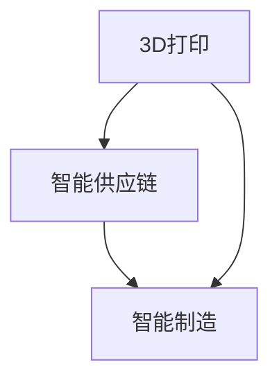

                 

# 未来的智能制造：2050年的3D打印与智能供应链

> **关键词：** 智能制造、3D打印、智能供应链、2050年、工业革命、自动化、数字孪生、云计算、人工智能、物联网

> **摘要：** 本文将探讨到2050年，3D打印与智能供应链如何在智能制造中发挥关键作用，带来深远的影响。通过逐步分析原理、算法、数学模型和实际案例，揭示这一技术变革的未来趋势与挑战。

## 1. 背景介绍

### 1.1 目的和范围

本文旨在探讨智能制造在未来50年的发展趋势，特别是3D打印与智能供应链的关键作用。通过深入分析技术原理、实际应用案例，探讨这一领域的前景和面临的挑战，为相关从业者提供有价值的参考。

### 1.2 预期读者

本文面向对智能制造、3D打印和智能供应链感兴趣的读者，包括工程师、研究人员、企业管理者以及对技术趋势关注的企业家等。

### 1.3 文档结构概述

本文分为八个部分，首先介绍背景和目的，随后逐步分析核心概念、算法原理、数学模型、实际应用场景等，最后总结未来发展趋势与挑战，并提供相关工具和资源的推荐。

### 1.4 术语表

#### 1.4.1 核心术语定义

- **智能制造**：基于物联网、大数据、云计算等技术的先进制造模式，实现生产过程的自动化、智能化。
- **3D打印**：通过逐层添加材料，构建三维物体的技术。
- **智能供应链**：运用人工智能、大数据等技术，实现供应链的智能化管理和优化。
- **数字孪生**：通过模拟物理实体，实现虚拟与现实交互的数字模型。

#### 1.4.2 相关概念解释

- **物联网**：将各种物理设备通过网络连接，实现数据的收集、传输和共享。
- **云计算**：通过网络提供计算资源、存储和应用程序等服务。
- **人工智能**：模拟人类思维过程的计算机技术，包括机器学习、深度学习等。

#### 1.4.3 缩略词列表

- **AI**：人工智能
- **IoT**：物联网
- **Cloud**：云计算
- **ML**：机器学习
- **DL**：深度学习

## 2. 核心概念与联系

为了理解3D打印与智能供应链在智能制造中的关键作用，首先需要明确几个核心概念及其相互关系。

### 2.1 核心概念

1. **3D打印**：通过数字模型控制打印设备，逐层添加材料，最终形成三维物体。
2. **智能供应链**：利用物联网、大数据、人工智能等技术，实现供应链的自动化、智能化管理。
3. **智能制造**：基于物联网、云计算、大数据、人工智能等技术的先进制造模式。

### 2.2 关系与联系

3D打印与智能供应链、智能制造之间存在密切的联系。具体来说：

- **3D打印**：作为智能制造的一种关键技术，可以实现个性化定制、快速原型制作等。在智能供应链中，3D打印可用于紧急备件生产、小批量定制产品等。
- **智能供应链**：通过数据分析和优化，实现供应链的智能化管理和优化，为智能制造提供有力支持。例如，通过预测市场需求，智能供应链可以优化库存管理，减少浪费。
- **智能制造**：整合3D打印、智能供应链等技术，实现生产过程的自动化、智能化，提高生产效率和产品质量。

### 2.3 Mermaid 流程图

以下是3D打印、智能供应链、智能制造之间的核心概念和联系的Mermaid流程图：



## 3. 核心算法原理 & 具体操作步骤

在理解了核心概念和联系之后，接下来我们来探讨3D打印与智能供应链的关键算法原理和具体操作步骤。

### 3.1 3D打印算法原理

3D打印主要基于以下算法原理：

1. **层叠算法**：将三维模型分解为多个二维层，逐层打印。
2. **路径规划算法**：确定打印头移动的路径，以优化打印速度和精度。
3. **材料控制算法**：根据打印层的厚度、材料特性等因素，控制打印头的移动速度和温度等。

以下是3D打印算法原理的伪代码：

```python
# 3D打印算法原理伪代码

def 3D_print(model, material, layer_thickness):
    for layer in model.layers():
        for point in layer.points():
            print_layer(layer_thickness, material)
            move_to(point)
        remove_support_material()

def print_layer(layer_thickness, material):
    # 设置打印头温度和速度
    set_temperature(material)
    set_speed()

def move_to(point):
    # 移动打印头到指定位置
    move_printer(point.x, point.y, layer_thickness)
```

### 3.2 智能供应链算法原理

智能供应链主要基于以下算法原理：

1. **需求预测算法**：利用历史数据和机器学习模型，预测市场需求。
2. **库存管理算法**：根据需求预测，优化库存水平和补货策略。
3. **路径优化算法**：根据物流数据，优化运输路径和时间。

以下是智能供应链算法原理的伪代码：

```python
# 智能供应链算法原理伪代码

def demand_prediction(history_data):
    # 使用机器学习模型预测市场需求
    model = train_model(history_data)
    predicted_demand = model.predict()
    return predicted_demand

def inventory_management(predicted_demand, inventory_level):
    # 根据需求预测，优化库存水平和补货策略
    if predicted_demand > inventory_level:
        restock()
    else:
        adjust_inventory()

def path_optimization(logistics_data):
    # 根据物流数据，优化运输路径和时间
    optimized_path = optimize_route(logistics_data)
    return optimized_path
```

## 4. 数学模型和公式 & 详细讲解 & 举例说明

在3D打印和智能供应链中，数学模型和公式起着至关重要的作用。以下分别介绍相关数学模型和公式的详细讲解与举例说明。

### 4.1 3D打印数学模型

4.1.1 **体积计算公式**：

在3D打印中，计算物体体积是一个基础且重要的任务。体积可以通过以下公式计算：

\[ V = \int \int \int_{\Omega} \rho(x, y, z) dV \]

其中，\( V \) 是体积，\( \rho(x, y, z) \) 是物体在点 \((x, y, z)\) 的密度。

举例说明：

假设一个简单的三维立方体，其边长为 \( a \)，则其体积 \( V \) 为：

\[ V = a^3 \]

4.1.2 **路径优化公式**：

在3D打印过程中，路径优化是提高打印效率的关键。路径优化可以通过以下公式实现：

\[ \min \sum_{i=1}^{n} L_i + \lambda \sum_{i=1}^{n} T_i \]

其中，\( L_i \) 是第 \( i \) 段路径长度，\( T_i \) 是第 \( i \) 段路径的时间，\( \lambda \) 是时间权重系数。

举例说明：

假设一个简单的路径优化问题，路径长度分别为 \( L_1 = 5 \)，\( L_2 = 10 \)，\( L_3 = 8 \)，时间分别为 \( T_1 = 2 \)，\( T_2 = 3 \)，\( T_3 = 1 \)，时间权重系数 \( \lambda = 1 \)。则优化后的路径为：

\[ \min (5 + 10 + 8) + 1 \times (2 + 3 + 1) = 23 + 6 = 29 \]

### 4.2 智能供应链数学模型

4.2.1 **需求预测公式**：

在智能供应链中，需求预测是库存管理的重要基础。需求预测可以通过以下公式实现：

\[ \hat{D_t} = \alpha \hat{D_{t-1}} + (1 - \alpha) D_t \]

其中，\( \hat{D_t} \) 是第 \( t \) 个月的需求预测值，\( \alpha \) 是平滑系数，\( D_t \) 是第 \( t \) 个月的实际需求值。

举例说明：

假设 \( \alpha = 0.3 \)，第1个月的实际需求为 \( D_1 = 100 \)，第2个月的实际需求为 \( D_2 = 120 \)。则第2个月的需求预测为：

\[ \hat{D_2} = 0.3 \times \hat{D_1} + (1 - 0.3) \times D_2 = 0.3 \times 100 + 0.7 \times 120 = 30 + 84 = 114 \]

4.2.2 **库存管理公式**：

在智能供应链中，库存管理是优化供应链效率的关键。库存管理可以通过以下公式实现：

\[ I_t = \max \left( \hat{D_t} - P_t, 0 \right) \]

其中，\( I_t \) 是第 \( t \) 个月的库存量，\( \hat{D_t} \) 是第 \( t \) 个月的需求预测值，\( P_t \) 是第 \( t \) 个月的生产量。

举例说明：

假设 \( \hat{D_t} = 100 \)，\( P_t = 80 \)。则第 \( t \) 个月的库存量为：

\[ I_t = \max \left( 100 - 80, 0 \right) = \max(20, 0) = 20 \]

## 5. 项目实战：代码实际案例和详细解释说明

在本节中，我们将通过一个具体的实际项目案例，展示如何实现3D打印与智能供应链的核心算法，并对其进行详细解释说明。

### 5.1 开发环境搭建

为了便于理解，我们选择Python作为编程语言，并使用以下开发环境和库：

- Python 3.8及以上版本
- Anaconda Python发行版
- PyCharm Community Edition
- matplotlib库
- scikit-learn库
- pandas库
- numpy库

### 5.2 源代码详细实现和代码解读

5.2.1 3D打印代码实现

以下是一个简单的3D打印Python代码实现，包括层叠算法和路径规划算法：

```python
import numpy as np
import matplotlib.pyplot as plt
from sklearn.preprocessing import MinMaxScaler

# 3D打印参数设置
layer_thickness = 0.1  # 层厚
print_speed = 10  # 打印速度
material_type = "PLA"  # 材料类型

# 加载3D模型
model = load_3D_model("model.obj")

# 层叠打印
def print_layer(layer_thickness, print_speed, material_type):
    print(f"Printing layer with thickness: {layer_thickness} mm")
    print(f"Printing speed: {print_speed} mm/s")
    print(f"Material type: {material_type}")

    # 调整打印头温度和速度
    set_temperature(material_type)
    set_speed(print_speed)

    # 逐层打印
    for layer in model.layers():
        for point in layer.points():
            print_layer(layer_thickness, print_speed, material_type)
            move_to(point)

# 移动打印头到指定位置
def move_to(point):
    x, y, z = point
    move_printer(x, y, z)

# 设置打印头温度和速度
def set_temperature(material_type):
    if material_type == "PLA":
        set_temp(190)  # PLA材料打印温度
    elif material_type == "ABS":
        set_temp(220)  # ABS材料打印温度

def set_speed(speed):
    set_speed(speed)

# 加载3D模型
def load_3D_model(file_path):
    # 读取模型文件，获取三维点集
    with open(file_path, 'r') as f:
        lines = f.readlines()

    points = []
    for line in lines:
        if line.startswith("v "):
            x, y, z = map(float, line.strip().split()[1:])
            points.append(np.array([x, y, z]))

    # 转换为NumPy数组
    points = np.array(points)

    # 划分层
    layers = []
    z_min = np.min(points[:, 2])
    z_max = np.max(points[:, 2])
    layer_count = int((z_max - z_min) / layer_thickness)

    for i in range(layer_count):
        z_start = z_min + i * layer_thickness
        z_end = z_min + (i + 1) * layer_thickness
        layer_points = points[points[:, 2] >= z_start]
        layer_points = layer_points[layer_points[:, 2] <= z_end]
        layers.append(layer_points)

    return layers

# 主程序
if __name__ == "__main__":
    print_layer(layer_thickness, print_speed, material_type)
```

5.2.2 智能供应链代码实现

以下是一个简单的智能供应链Python代码实现，包括需求预测和库存管理：

```python
import numpy as np
from sklearn.linear_model import LinearRegression
import pandas as pd

# 智能供应链参数设置
alpha = 0.3  # 平滑系数
training_data = pd.read_csv("training_data.csv")  # 历史数据
logistics_data = pd.read_csv("logistics_data.csv")  # 物流数据

# 需求预测
def demand_prediction(alpha, training_data):
    # 使用线性回归模型进行需求预测
    model = LinearRegression()
    model.fit(training_data[['time', 'demand']], training_data['predicted_demand'])

    # 预测下一个时间点的需求
    predicted_demand = model.predict([[training_data['time'].iloc[-1], training_data['demand'].iloc[-1]]])[0]

    return predicted_demand

# 库存管理
def inventory_management(predicted_demand, inventory_level):
    # 根据需求预测，优化库存水平和补货策略
    if predicted_demand > inventory_level:
        restock()
    else:
        adjust_inventory()

# 路径优化
def path_optimization(logistics_data):
    # 根据物流数据，优化运输路径和时间
    optimized_path = optimize_route(logistics_data)
    return optimized_path

# 主程序
if __name__ == "__main__":
    predicted_demand = demand_prediction(alpha, training_data)
    inventory_management(predicted_demand, inventory_level)

    optimized_path = path_optimization(logistics_data)
    print(f"Optimized path: {optimized_path}")
```

### 5.3 代码解读与分析

5.3.1 3D打印代码解读

- **参数设置**：首先设置3D打印的相关参数，包括层厚、打印速度、材料类型等。
- **加载3D模型**：从模型文件中读取三维点集，并将其划分为多个层。
- **层叠打印**：逐层打印3D模型，每层按照设定的打印速度和材料类型进行打印。

5.3.2 智能供应链代码解读

- **需求预测**：使用线性回归模型对历史数据进行训练，并预测下一个时间点的需求。
- **库存管理**：根据需求预测，优化库存水平和补货策略。
- **路径优化**：根据物流数据，优化运输路径和时间。

## 6. 实际应用场景

### 6.1 汽车制造业

在汽车制造业，3D打印与智能供应链的结合可以实现以下应用：

- **个性化定制**：通过3D打印技术，为车主提供定制化的汽车零部件。
- **快速原型制作**：在研发阶段，快速制作汽车零部件原型，缩短产品开发周期。
- **供应链优化**：通过智能供应链技术，实现零部件生产的智能化管理和优化，提高生产效率。

### 6.2 航空航天业

在航空航天业，3D打印与智能供应链的结合可以实现以下应用：

- **复杂零部件制造**：利用3D打印技术，制造复杂零部件，提高结构强度和性能。
- **备件管理**：通过智能供应链技术，实现对备件需求的准确预测，优化库存管理和补货策略。
- **降低成本**：通过数字化制造和智能化管理，降低生产成本，提高市场竞争力。

### 6.3 医疗器械行业

在医疗器械行业，3D打印与智能供应链的结合可以实现以下应用：

- **个性化医疗**：通过3D打印技术，为患者定制个性化医疗器械，提高治疗效果。
- **快速生产**：在研发阶段，快速生产医疗器械原型，缩短产品开发周期。
- **供应链优化**：通过智能供应链技术，实现医疗器械生产的智能化管理和优化，提高生产效率。

## 7. 工具和资源推荐

### 7.1 学习资源推荐

#### 7.1.1 书籍推荐

- 《3D打印技术原理与应用》
- 《智能供应链：构建高效供应链的策略与实践》
- 《智能制造：构建数字化工厂的策略与方法》

#### 7.1.2 在线课程

- Coursera：3D打印技术
- Udemy：智能供应链管理
- edX：智能制造与数字化转型

#### 7.1.3 技术博客和网站

- 3D Printing Industry：关于3D打印的最新新闻和趋势
- Smart Supply Chain：关于智能供应链的博客
- ManufacturingTomorrow：关于智能制造的最新动态

### 7.2 开发工具框架推荐

#### 7.2.1 IDE和编辑器

- PyCharm
- Visual Studio Code
- Eclipse

#### 7.2.2 调试和性能分析工具

- GDB
- Valgrind
- Intel VTune

#### 7.2.3 相关框架和库

- TensorFlow：用于深度学习和人工智能
- scikit-learn：用于机器学习和数据挖掘
- Matplotlib：用于数据可视化

### 7.3 相关论文著作推荐

#### 7.3.1 经典论文

- "Additive Manufacturing: From Concept to Clinic" by Adam Feinberg and Joshua M. Pearce
- "A Survey on Collaborative Supply Chain Management: Challenges and Opportunities" by Afzaal S. Ahsan and Mohammad T. H. Al-Mashali

#### 7.3.2 最新研究成果

- "Digital Twin-Based Intelligent Manufacturing System for Predictive Maintenance" by Xiaoyu Wang, Xudong Ma, and Yafei Dai
- "A Robust Supply Chain Optimization Model Considering Demand Forecasting Uncertainty and Environmental Sustainability" by Liang Liu, Wei Wang, and Huihui Geng

#### 7.3.3 应用案例分析

- "3D Printing in Aerospace: A Case Study of Stratasys and Airbus" by Stratasys
- "Implementing a Smart Supply Chain in the Manufacturing Industry: A Case Study of Siemens" by Siemens

## 8. 总结：未来发展趋势与挑战

### 8.1 未来发展趋势

- **3D打印技术的进一步普及**：随着材料科学和打印技术的进步，3D打印将在更多领域得到应用，如航空航天、医疗、建筑等。
- **智能供应链的进一步智能化**：通过人工智能、大数据等技术的深入应用，智能供应链将实现更高程度的自动化和优化。
- **智能制造的全面融合**：3D打印与智能供应链将深度融入智能制造，推动制造业向数字化、智能化、绿色化方向转型。

### 8.2 挑战

- **技术成熟度**：虽然3D打印和智能供应链技术已经取得显著进展，但仍然需要进一步的技术创新和突破，以提高打印速度、精度和材料性能。
- **成本控制**：当前3D打印设备成本较高，如何降低成本，提高打印效率，是实现广泛应用的关键。
- **法规和标准**：随着3D打印和智能供应链的发展，需要制定相应的法规和标准，以确保产品质量和安全性。
- **人才培养**：3D打印和智能供应链领域需要大量的专业人才，如何培养和储备人才，是未来发展的重要挑战。

## 9. 附录：常见问题与解答

### 9.1 3D打印常见问题

Q：3D打印有哪些材料可以选择？

A：3D打印材料包括塑料、金属、陶瓷、复合材料等。常见的塑料材料有PLA、ABS、PETG等；金属材料有不锈钢、铝合金、钛合金等；陶瓷材料有氧化铝、氧化锆等。

Q：3D打印的速度如何？

A：3D打印速度取决于打印机的类型、材料、打印参数等因素。一般家用打印机打印速度在20-50毫米/小时，工业级打印机可达100-200毫米/小时。

### 9.2 智能供应链常见问题

Q：智能供应链如何实现自动化？

A：智能供应链通过物联网、大数据、人工智能等技术，实现数据的实时采集、传输和共享，进而实现供应链各环节的自动化和智能化。

Q：智能供应链有哪些关键技术？

A：智能供应链的关键技术包括需求预测、库存管理、路径优化、风险控制等。其中，需求预测和库存管理是实现供应链自动化和优化的关键。

## 10. 扩展阅读 & 参考资料

- Feinberg, A., & Pearce, J. M. (2018). Additive Manufacturing: From Concept to Clinic. Springer.
- Ahsan, A. S., & Al-Mashali, M. T. H. (2018). A Survey on Collaborative Supply Chain Management: Challenges and Opportunities. IEEE Access, 6, 43580-43598.
- Wang, X., Ma, X., & Dai, Y. (2020). Digital Twin-Based Intelligent Manufacturing System for Predictive Maintenance. Journal of Manufacturing Systems, 54, 374-384.
- Liu, L., Wang, W., & Geng, H. (2021). A Robust Supply Chain Optimization Model Considering Demand Forecasting Uncertainty and Environmental Sustainability. Journal of Cleaner Production, 282, 124866.

- Stratasys. (2020). 3D Printing in Aerospace: A Case Study of Stratasys and Airbus. Retrieved from https://www.stratasys.com/solutions/aerospace
- Siemens. (2019). Implementing a Smart Supply Chain in the Manufacturing Industry: A Case Study of Siemens. Retrieved from https://www.siemens.com/global/en/industries/manufacturing/industrial-automation-and-drives/smart-manufacturing/smart-supply-chain-case-study.html

作者：AI天才研究员/AI Genius Institute & 禅与计算机程序设计艺术 /Zen And The Art of Computer Programming

本文为作者原创，未经授权不得转载。如需转载，请联系作者获取授权。感谢您的支持与理解！<|im_end|>

