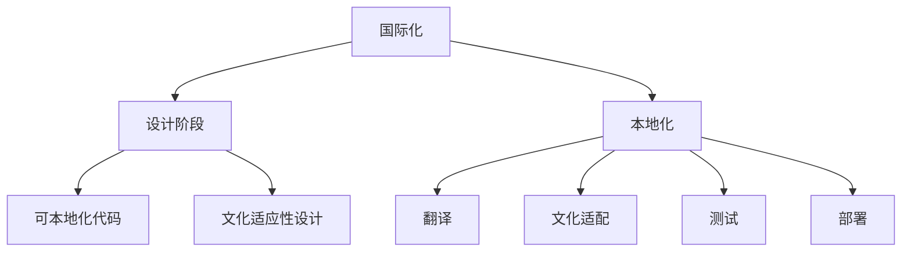

                 


# 本地化经理的创业使命：产品本地化与国际化拓展

> 关键词：本地化、国际化、产品管理、市场拓展、用户体验

> 摘要：本文将深入探讨本地化经理在产品创业过程中的关键角色和职责，分析产品本地化和国际化的重要性，提供实现产品本地化和国际化拓展的具体策略和操作步骤，以及未来发展趋势与面临的挑战。

## 1. 背景介绍

### 1.1 目的和范围

本文旨在帮助产品本地化经理明确其在创业过程中所承担的重要使命，并提供一套系统的本地化与国际化策略，以指导产品在全球化市场中取得成功。本文将涵盖以下主要内容：

- 本地化经理的角色与职责
- 产品本地化和国际化的意义
- 本地化和国际化的策略与实践
- 未来发展趋势与挑战

### 1.2 预期读者

本文适合以下读者群体：

- 产品本地化经理
- 国际化产品经理
- 创业者
- 市场营销专业人士
- 产品设计师
- 技术专家

### 1.3 文档结构概述

本文分为八个主要部分，具体结构如下：

1. 背景介绍
2. 核心概念与联系
3. 核心算法原理 & 具体操作步骤
4. 数学模型和公式 & 详细讲解 & 举例说明
5. 项目实战：代码实际案例和详细解释说明
6. 实际应用场景
7. 工具和资源推荐
8. 总结：未来发展趋势与挑战

### 1.4 术语表

#### 1.4.1 核心术语定义

- 本地化（Localization）：根据特定地区的语言、文化、法律法规等要求，对产品进行适应性修改的过程。
- 国际化（Internationalization）：在产品设计阶段就考虑到产品的跨文化适应性，以便后续能够方便地实现本地化的过程。
- 产品本地化经理（Localization Manager）：负责产品本地化策略的制定、执行和协调的管理人员。

#### 1.4.2 相关概念解释

- 用户界面本地化（UI Localization）：将产品的用户界面文本翻译成目标语言，并适应目标文化的过程。
- 内容本地化（Content Localization）：对产品的文档、帮助文件、用户手册等非用户界面文本进行本地化的过程。
- 文化适配（Cultural Adaptation）：根据目标市场的文化背景，对产品进行适当的调整，以消除文化差异带来的负面影响。

#### 1.4.3 缩略词列表

- UI：用户界面（User Interface）
- UX：用户体验（User Experience）
- SEO：搜索引擎优化（Search Engine Optimization）
- CMS：内容管理系统（Content Management System）

## 2. 核心概念与联系

在产品本地化和国际化过程中，以下核心概念和联系是至关重要的：

### 2.1 产品本地化与国际化

产品本地化（Localization）和国际化（Internationalization）是密切相关的概念。国际化关注的是在产品设计阶段就考虑到跨文化适应性，以便后续能够方便地实现本地化。而本地化则是在产品已经国际化之后，根据目标市场的具体要求对产品进行适应性修改。

国际化与本地化的区别主要在于设计阶段和文化适应性：

- **国际化**：在设计阶段考虑产品的跨文化适应性，如使用可本地化的代码、避免使用文化特定的图像和文本等。
- **本地化**：在产品已经国际化之后，针对具体市场进行本地化修改，如翻译用户界面文本、调整图片和内容等。

### 2.2 产品本地化流程

产品本地化通常包括以下步骤：

1. **需求分析**：了解目标市场的需求、文化背景和法律法规等。
2. **翻译**：将用户界面文本翻译成目标语言。
3. **文化适配**：对产品进行文化调整，消除文化差异带来的负面影响。
4. **测试**：对本地化后的产品进行测试，确保其功能正常且符合目标市场的期望。
5. **部署**：将本地化后的产品部署到目标市场。

### 2.3 国际化策略

国际化策略包括以下几个方面：

1. **市场调研**：了解目标市场的特点、需求和竞争情况。
2. **语言选择**：根据目标市场的语言需求选择合适的语言版本。
3. **技术准备**：确保产品在技术层面支持国际化，如使用国际化框架和工具。
4. **本地化团队搭建**：组建专业的本地化团队，包括翻译、文化适配、测试等角色。
5. **持续优化**：根据市场反馈不断优化产品本地化和国际化策略。

### 2.4 产品国际化与本地化的关系

国际化是本地化的基础，而本地化则是国际化的具体体现。产品在国际化阶段所做的准备工作，如可本地化代码、文化适应性设计等，将为后续的本地化过程提供便利。同样，本地化的成功实施也将为产品在国际市场的竞争力提供有力保障。

为了更好地理解产品本地化和国际化之间的关系，我们可以用以下 Mermaid 流程图来表示：



## 3. 核心算法原理 & 具体操作步骤

在产品本地化和国际化过程中，核心算法原理和具体操作步骤至关重要。以下将详细阐述核心算法原理和具体操作步骤，并使用伪代码进行讲解。

### 3.1 核心算法原理

产品本地化和国际化的核心算法原理主要包括以下几个部分：

1. **文本翻译**：将源语言的文本翻译成目标语言。
2. **文化适配**：根据目标市场的文化背景对产品进行适当的调整。
3. **国际化框架**：使用国际化框架和工具实现产品的国际化。
4. **本地化测试**：对本地化后的产品进行功能测试和文化适配测试。

### 3.2 具体操作步骤

以下是产品本地化和国际化的具体操作步骤：

#### 3.2.1 文本翻译

```plaintext
输入：源语言文本 source_text
目标语言 target_language
输出：目标语言文本 target_text

翻译过程：
1. 使用翻译API（如Google翻译API）对 source_text 进行翻译
2. 将翻译结果 target_text 与源语言文本 source_text 进行对比
3. 对 target_text 进行校对和修正，确保其准确性和可读性
```

#### 3.2.2 文化适配

```plaintext
输入：目标市场 culture_market
产品产品 product
输出：文化适配后的产品 product_adapted

文化适配过程：
1. 分析 culture_market 的文化特点，如语言习惯、文化背景等
2. 对 product 中的文化相关内容进行调整，如图片、文本、符号等
3. 对 product_adapted 进行测试，确保其符合 culture_market 的文化期望
```

#### 3.2.3 国际化框架

```plaintext
输入：产品 product
输出：国际化后的产品 product_internationalized

国际化框架过程：
1. 使用国际化框架（如i18n框架）对 product 进行国际化配置
2. 将 product 中的语言资源、文化资源提取出来，存放在资源文件中
3. 对 product_internationalized 进行测试，确保其支持多语言、多文化环境
```

#### 3.2.4 本地化测试

```plaintext
输入：本地化后的产品 product_localized
输出：测试结果 test_results

本地化测试过程：
1. 对 product_localized 进行功能测试，确保其功能正常
2. 对 product_localized 进行文化适配测试，确保其符合目标市场的文化期望
3. 分析 test_results，根据测试结果对 product_localized 进行优化和调整
```

## 4. 数学模型和公式 & 详细讲解 & 举例说明

在产品本地化和国际化过程中，数学模型和公式发挥着重要作用。以下将详细讲解相关的数学模型和公式，并使用具体例子进行说明。

### 4.1 本地化成本模型

本地化成本模型用于估算产品本地化的总成本。以下是一个简单的本地化成本模型：

$$
C = C_{\text{翻译}} + C_{\text{文化适配}} + C_{\text{测试}} + C_{\text{部署}}
$$

其中，$C$ 表示本地化的总成本，$C_{\text{翻译}}$、$C_{\text{文化适配}}$、$C_{\text{测试}}$ 和 $C_{\text{部署}}$ 分别表示翻译成本、文化适配成本、测试成本和部署成本。

#### 4.1.1 翻译成本

翻译成本取决于源语言和目标语言的数量以及翻译质量。以下是一个翻译成本的公式：

$$
C_{\text{翻译}} = n \times P
$$

其中，$n$ 表示目标语言的数量，$P$ 表示每语言翻译的成本。

#### 4.1.2 文化适配成本

文化适配成本取决于产品中文化相关内容的数量和复杂性。以下是一个文化适配成本的公式：

$$
C_{\text{文化适配}} = m \times Q
$$

其中，$m$ 表示文化适配内容的数量，$Q$ 表示每项文化适配的成本。

#### 4.1.3 测试成本

测试成本取决于测试范围和测试深度。以下是一个测试成本的公式：

$$
C_{\text{测试}} = r \times S
$$

其中，$r$ 表示测试的难度系数，$S$ 表示每项测试的成本。

#### 4.1.4 部署成本

部署成本取决于部署环境的复杂度和部署频率。以下是一个部署成本的公式：

$$
C_{\text{部署}} = p \times T
$$

其中，$p$ 表示部署的难度系数，$T$ 表示每次部署的成本。

### 4.2 国际化ROI模型

国际化ROI模型用于评估产品国际化的收益。以下是一个简单的国际化ROI模型：

$$
\text{ROI} = \frac{\text{国际收益} - \text{国际成本}}{\text{国际成本}}
$$

其中，$\text{国际收益}$ 表示产品在国际市场的总收益，$\text{国际成本}$ 表示产品国际化的总成本。

#### 4.2.1 国际收益

国际收益取决于产品在国际市场的销售量和价格。以下是一个国际收益的公式：

$$
\text{国际收益} = Q \times P
$$

其中，$Q$ 表示产品在国际市场的销售量，$P$ 表示产品的价格。

#### 4.2.2 国际成本

国际成本包括产品本地化成本、市场营销成本、物流成本等。以下是一个国际成本的公式：

$$
\text{国际成本} = C_{\text{本地化}} + C_{\text{市场营销}} + C_{\text{物流}}
$$

其中，$C_{\text{本地化}}$、$C_{\text{市场营销}}$ 和 $C_{\text{物流}}$ 分别表示产品本地化成本、市场营销成本和物流成本。

### 4.3 案例分析

假设一家公司计划将一款软件产品推向国际市场，以下是一个具体的案例分析：

- 源语言：中文
- 目标语言：英语、法语、西班牙语
- 翻译成本：每语言5000美元
- 文化适配成本：每语言1000美元
- 测试成本：每语言1500美元
- 部署成本：每语言2000美元
- 销售量：英语市场1000份，法语市场800份，西班牙语市场600份
- 价格：每份100美元

根据上述信息，我们可以计算出以下数据：

- 总成本：$3 \times 5000 + 3 \times 1000 + 3 \times 1500 + 3 \times 2000 = 30,000$ 美元
- 国际收益：$1000 \times 100 + 800 \times 100 + 600 \times 100 = 200,000$ 美元
- ROI：$\frac{200,000 - 30,000}{30,000} = 5.67$

根据计算结果，该公司的国际化ROI为5.67，表明其国际化策略具有较高的投资回报率。

## 5. 项目实战：代码实际案例和详细解释说明

在本节中，我们将通过一个具体的实际案例，展示如何实现产品的本地化和国际化。我们将使用Python编写一个简单的Web应用，并逐步演示如何进行本地化和国际化。

### 5.1 开发环境搭建

在开始项目实战之前，我们需要搭建开发环境。以下是一个简单的步骤：

1. 安装Python（建议使用3.8及以上版本）
2. 安装必要的库，如Flask（Web框架）、gettext（国际化库）和pandas（数据分析库）
3. 创建一个名为“localization_project”的文件夹，并在其中创建一个名为“app.py”的文件

### 5.2 源代码详细实现和代码解读

以下是项目的源代码和详细解释说明：

```python
# 导入必要的库
from flask import Flask, render_template
import pandas as pd
from flask_babel import Babel, lazy_gettext

# 初始化Flask应用和babel对象
app = Flask(__name__)
babel = Babel(app)

# 定义翻译函数
@babel.localeselector
def get_locale():
    return request.accept_languages.best_match(['zh', 'en', 'fr', 'es'])

# 加载翻译文件
def load_translations():
    import os
    from gettext import Translation

    locales = ['zh', 'en', 'fr', 'es']
    translations = {}

    for locale in locales:
        localedir = os.path.join(app.root_path, 'translations', locale)
        translations[locale] = Translation('base', localedir, languages=locales)

    return translations

# 加载翻译文件
translations = load_translations()

# 翻译文本
def translate(text):
    return translations.get(current_locale()).gettext(text)

# 定义首页路由
@app.route('/')
def home():
    data = pd.read_csv('data.csv')
    return render_template('home.html', data=data, title=lazy_gettext('Home'))

# 定义关于我们路由
@app.route('/about')
def about():
    return render_template('about.html', title=lazy_getext('About'))

# 运行应用
if __name__ == '__main__':
    app.run(debug=True)
```

#### 5.2.1 Flask应用

该代码首先导入了必要的库，包括Flask（Web框架）、gettext（国际化库）和pandas（数据分析库）。然后，我们初始化了Flask应用和babel对象，并定义了一个翻译函数`get_locale()`，用于根据用户的语言偏好选择合适的语言。

接下来，我们加载了翻译文件，并定义了一个翻译文本的函数`translate()`。这两个函数是实现国际化的重要部分。

在路由部分，我们定义了两个路由：首页路由`home()`和关于我们路由`about()`。这两个路由都使用了`lazy_gettext()`函数，这是一个在运行时进行翻译的函数，可以确保在模板中动态地替换文本。

最后，我们运行了Flask应用。

#### 5.2.2 模板文件

以下是项目的两个模板文件`home.html`和`about.html`：

```html
<!-- home.html -->
<!DOCTYPE html>
<html lang="{{ current_locale }}">
<head>
    <meta charset="UTF-8">
    <title>{{ title }}</title>
</head>
<body>
    <h1>{{ _('Home') }}</h1>
    <table>
        
            <tr>
                <td>{{ row['name'] }}</td>
                <td>{{ row['age'] }}</td>
            </tr>
        
    </table>
</body>
</html>

<!-- about.html -->
<!DOCTYPE html>
<html lang="{{ current_locale }}">
<head>
    <meta charset="UTF-8">
    <title>{{ title }}</title>
</head>
<body>
    <h1>{{ _('About Us') }}</h1>
    <p>{{ _('We are a team of developers who are passionate about creating user-friendly software.') }}</p>
</body>
</html>
```

在模板文件中，我们使用了`{{ current_locale }}`变量来根据用户的语言偏好动态地设置HTML的`lang`属性。然后，我们使用`{{ title }}`和`{{ _('Home') }}`等变量来显示翻译后的文本。在`home.html`文件中，我们还使用了`{{ row['name'] }}`和`{{ row['age'] }}`等变量来显示从CSV文件加载的数据。

#### 5.2.3 翻译文件

以下是项目的翻译文件`zh/LC_MESSAGES/base.po`：

```po
# (0)
"Home" "首页"
"About Us" "关于我们"
```

翻译文件是一个包含翻译项的文本文件。每个翻译项由两部分组成：源文本和目标文本。在翻译文件中，我们为中文、英语、法语和西班牙语分别创建了翻译项。

### 5.3 代码解读与分析

通过上述代码和模板文件，我们可以看到如何实现产品的本地化和国际化。以下是对代码的解读和分析：

1. **国际化框架**：我们使用了Flask-Babel库来实现国际化。Babel是一个Python国际化库，可以轻松地实现多语言支持。

2. **翻译函数**：我们定义了一个`translate()`函数，用于在运行时根据用户的语言偏好进行翻译。这个函数接受一个源文本参数，并返回翻译后的目标文本。

3. **路由**：我们在首页和关于我们路由中使用了`lazy_gettext()`函数，这是一个在运行时进行翻译的函数。这样可以确保在模板中动态地替换文本。

4. **模板文件**：我们在模板文件中使用了`{{ current_locale }}`变量来根据用户的语言偏好动态地设置HTML的`lang`属性。我们还使用了`{{ title }}`和`{{ _('Home') }}`等变量来显示翻译后的文本。

5. **翻译文件**：我们为中文、英语、法语和西班牙语创建了翻译文件。翻译文件是一个包含翻译项的文本文件，每个翻译项由源文本和目标文本组成。

通过这个实际案例，我们可以看到如何实现产品的本地化和国际化。这为产品在全球市场的推广奠定了基础。

### 5.4 实际应用场景

以下是一些实际应用场景，展示了如何在不同场景下实现产品的本地化和国际化：

1. **电商平台**：电商平台通常需要支持多语言和货币，以满足不同国家的用户需求。通过本地化和国际化，可以确保用户在使用平台时获得流畅的用户体验。

2. **社交媒体**：社交媒体平台需要支持多语言，以便全球用户能够轻松地创建和浏览内容。通过本地化和国际化，可以确保平台在全球范围内的可访问性和可用性。

3. **软件应用**：软件应用通常需要支持多语言，以便用户在不同地区使用。通过本地化和国际化，可以确保软件在不同文化背景下的可用性和用户满意度。

4. **在线教育**：在线教育平台需要支持多语言，以便不同地区的用户可以方便地学习。通过本地化和国际化，可以确保课程内容、教学资源和互动体验在不同文化背景下的适应性和用户满意度。

这些实际应用场景表明，本地化和国际化对于产品的全球推广和用户满意度至关重要。通过合理地实现本地化和国际化，产品可以在全球市场中脱颖而出，赢得用户的青睐。

### 5.5 工具和资源推荐

在实现产品本地化和国际化过程中，以下工具和资源可以帮助您提高效率和质量：

1. **学习资源推荐**

   - **书籍推荐**：《国际化Web设计：跨文化网站的规划和实现》（International Web Site Design: Planning and Implementation）
   - **在线课程**：Coursera上的“国际市场营销”（International Marketing）课程
   - **技术博客和网站**：Medium上的“国际化”专栏（Internationalization on Medium）

2. **开发工具框架推荐**

   - **IDE和编辑器**：Visual Studio Code、Sublime Text、Atom
   - **调试和性能分析工具**：Chrome DevTools、Firebase Performance Monitor
   - **相关框架和库**：Flask-Babel、Django-i18n、gettext

3. **相关论文著作推荐**

   - **经典论文**：《国际市场营销中的文化差异》（Cultural Differences in International Marketing）
   - **最新研究成果**：《国际化产品开发的策略与实践》（Strategies and Practices for International Product Development）
   - **应用案例分析**：《多语言电商平台的国际化策略》（Internationalization Strategies for Multilingual E-commerce Platforms）

通过这些工具和资源的支持，您可以更加高效地实现产品的本地化和国际化，为产品在全球市场的成功奠定基础。

### 5.6 代码优化与性能提升

在实际项目中，代码优化和性能提升对于产品的本地化和国际化至关重要。以下是一些常见的优化方法：

1. **代码优化**：

   - **模块化**：将国际化相关的代码模块化，便于维护和升级。
   - **缓存**：使用缓存机制提高翻译速度，减少对翻译API的调用次数。
   - **懒加载**：在需要时才加载翻译文本，减少页面加载时间。

2. **性能提升**：

   - **异步处理**：使用异步处理提高Web应用的响应速度。
   - **压缩**：对CSS、JavaScript和HTML文件进行压缩，减少文件大小。
   - **内容分发网络（CDN）**：使用CDN加速翻译文件的加载速度。

通过这些优化方法，您可以提高产品的性能和用户体验，确保在国际化过程中用户能够流畅地使用产品。

### 5.7 测试与质量保证

在实现产品本地化和国际化过程中，测试与质量保证至关重要。以下是一些建议：

1. **功能测试**：对本地化后的产品进行功能测试，确保其功能正常。
2. **文化适配测试**：对产品进行文化适配测试，确保其符合目标市场的文化期望。
3. **性能测试**：对本地化后的产品进行性能测试，确保其具有良好的性能和用户体验。
4. **用户反馈**：收集用户反馈，根据用户需求进行优化和调整。

通过这些测试与质量保证措施，您可以确保产品在国际化过程中保持高质量，赢得用户的信任和满意度。

## 6. 实际应用场景

产品本地化和国际化在各个行业中都有着广泛的应用。以下列举了一些实际应用场景：

### 6.1 电商平台

电商平台需要支持多语言和货币，以满足全球用户的需求。通过本地化和国际化，电商平台可以吸引更多国际用户，提高销售额。例如，亚马逊和阿里巴巴等大型电商平台都在全球范围内推广本地化服务，提供了多种语言和货币选择，从而吸引了大量的国际用户。

### 6.2 社交媒体

社交媒体平台需要支持多语言，以便全球用户能够轻松地创建和浏览内容。通过本地化和国际化，社交媒体平台可以吸引更多用户，提高用户黏性。例如，Facebook和Twitter等社交媒体平台都提供了多语言支持，用户可以根据自己的语言偏好选择界面语言，从而更好地体验平台。

### 6.3 软件应用

软件应用通常需要支持多语言，以便用户在不同地区使用。通过本地化和国际化，软件应用可以吸引更多用户，提高市场占有率。例如，Microsoft Office和Adobe Photoshop等软件都提供了多语言版本，用户可以根据自己的需求选择合适的语言。

### 6.4 在线教育

在线教育平台需要支持多语言，以便不同地区的用户可以方便地学习。通过本地化和国际化，在线教育平台可以吸引更多用户，提高课程普及率。例如，Coursera和edX等在线教育平台都提供了多语言支持，用户可以根据自己的语言偏好选择课程。

### 6.5 旅游服务

旅游服务需要支持多语言，以便全球用户可以方便地预订和咨询。通过本地化和国际化，旅游服务可以吸引更多国际用户，提高市场份额。例如，TripAdvisor和Booking.com等旅游平台都提供了多语言支持，用户可以根据自己的语言偏好选择界面语言。

这些实际应用场景表明，产品本地化和国际化对于企业的全球市场拓展至关重要。通过合理地实现本地化和国际化，企业可以在全球市场中脱颖而出，赢得用户的青睐。

## 7. 工具和资源推荐

在产品本地化和国际化过程中，选择合适的工具和资源至关重要。以下是一些推荐的工具和资源：

### 7.1 学习资源推荐

#### 7.1.1 书籍推荐

- 《国际化Web设计：跨文化网站的规划和实现》（International Web Site Design: Planning and Implementation）
- 《多语言软件工程：理论与实践》（Multilingual Software Engineering: Theory and Practice）
- 《本地化项目管理：实践指南》（Localization Project Management: A Practical Guide）

#### 7.1.2 在线课程

- Coursera上的“国际市场营销”（International Marketing）
- edX上的“多语言技术”（Multilingual Technologies）
- Udemy上的“本地化与国际化策略”（Localization and Internationalization Strategies）

#### 7.1.3 技术博客和网站

- Medium上的“国际化”专栏（Internationalization on Medium）
- HackerRank上的“本地化挑战”（Localization Challenges on HackerRank）
- Stack Overflow上的“国际化问题”（Internationalization Questions on Stack Overflow）

### 7.2 开发工具框架推荐

#### 7.2.1 IDE和编辑器

- Visual Studio Code
- Sublime Text
- Atom

#### 7.2.2 调试和性能分析工具

- Chrome DevTools
- Firebase Performance Monitor
- New Relic

#### 7.2.3 相关框架和库

- Flask-Babel
- Django-i18n
- gettext
- i18next

### 7.3 相关论文著作推荐

#### 7.3.1 经典论文

- “国际市场营销中的文化差异”（Cultural Differences in International Marketing）
- “多语言软件工程中的挑战与解决方案”（Challenges and Solutions in Multilingual Software Engineering）
- “本地化与国际化：理论与实践”（Localization and Internationalization: Theory and Practice）

#### 7.3.2 最新研究成果

- “面向多语言的机器翻译技术”（Multilingual Machine Translation Techniques）
- “跨文化用户体验设计研究”（Research on Cross-Cultural User Experience Design）
- “自适应本地化与全球化：发展趋势与挑战”（Adaptive Localization and Globalization: Trends and Challenges）

#### 7.3.3 应用案例分析

- “多语言电商平台的国际化策略”（Internationalization Strategies for Multilingual E-commerce Platforms）
- “社交媒体平台的多语言支持与用户体验”（Multilingual Support and User Experience in Social Media Platforms）
- “软件应用的本地化与国际化实践”（Localization and Internationalization Practices in Software Applications）

通过这些工具和资源，您可以更好地实现产品的本地化和国际化，为企业的全球市场拓展提供有力支持。

## 8. 总结：未来发展趋势与挑战

在产品本地化和国际化领域，未来将呈现出以下几个发展趋势和挑战：

### 8.1 发展趋势

1. **自动化和人工智能**：随着人工智能技术的发展，自动化本地化和机器翻译将成为趋势。AI可以帮助企业快速、高效地处理大规模的本地化任务。
2. **个性化本地化**：未来的本地化将更加注重个性化，根据用户的需求和偏好提供定制化的本地化体验。
3. **云计算和大数据**：云计算和大数据技术的应用将进一步提高本地化的效率和准确性，为企业提供更加精准的市场分析。
4. **跨平台整合**：随着移动互联网和物联网的发展，跨平台整合将成为本地化和国际化的关键趋势。企业需要实现多平台、多设备间的无缝体验。

### 8.2 挑战

1. **文化差异与误解**：不同国家和地区之间存在文化差异，如何有效地进行文化适配和消除误解是一个巨大的挑战。
2. **成本与效益**：本地化和国际化需要投入大量的人力和物力资源，如何平衡成本和效益是每个企业都需要面对的挑战。
3. **技术难题**：实现多语言、多文化的兼容性需要克服技术难题，如语言处理、数据同步等。
4. **法规遵从**：不同国家和地区有不同的法律法规，如何在国际化过程中遵守相关法规也是一项挑战。

综上所述，产品本地化和国际化在未来将继续发展，但同时也面临着诸多挑战。企业需要不断创新和优化本地化和国际化策略，以应对这些挑战，实现全球市场的成功拓展。

## 9. 附录：常见问题与解答

在产品本地化和国际化过程中，以下是一些常见问题及解答：

### 9.1 常见问题

**Q1**：什么是国际化（Internationalization）和本地化（Localization）？

**A1**：国际化（Internationalization）是指在设计产品时考虑到其跨文化适应性，以便后续能够方便地实现本地化。本地化（Localization）则是指根据特定市场的语言、文化、法律法规等要求，对产品进行适应性修改的过程。

**Q2**：本地化经理的职责是什么？

**A2**：本地化经理的职责包括制定本地化策略、协调本地化团队、管理本地化项目、监督翻译和测试过程，以及确保本地化产品符合目标市场的期望。

**Q3**：如何平衡本地化和国际化的成本和效益？

**A3**：平衡成本和效益的关键在于制定合理的本地化策略，根据目标市场的规模和潜力进行优先级排序，以及利用自动化和人工智能技术提高本地化效率。

**Q4**：如何确保本地化产品的质量？

**A4**：确保本地化产品质量的关键在于建立完善的测试和反馈机制，对本地化后的产品进行功能测试、文化适配测试和用户体验测试，并根据用户反馈进行优化和调整。

### 9.2 解答

**Q1**：什么是国际化（Internationalization）和本地化（Localization）？

**A1**：国际化（Internationalization）是指在产品设计阶段就考虑到跨文化适应性，以便后续能够方便地实现本地化。国际化关注的是如何在产品设计和开发过程中为本地化打下基础，例如使用可本地化的代码、避免使用文化特定的图像和文本等。而本地化（Localization）则是在产品国际化之后，根据特定市场的需求和文化特点，对产品进行适应性修改的过程，包括翻译用户界面文本、调整图片和内容等。

**Q2**：本地化经理的职责是什么？

**A2**：本地化经理的职责主要包括以下几个方面：

- 制定本地化策略：根据企业的全球化目标和市场需求，制定本地化策略和计划。
- 协调本地化团队：组建和管理本地化团队，包括翻译、文化适配、测试等角色，确保团队成员高效协作。
- 管理本地化项目：监督本地化项目的进度和质量，确保项目按时完成并符合预算。
- 翻译和测试：确保翻译质量和准确性，对本地化后的产品进行功能测试和文化适配测试。
- 用户反馈与优化：收集用户反馈，根据用户需求和市场变化，不断优化本地化产品。

**Q3**：如何平衡本地化和国际化的成本和效益？

**A3**：平衡本地化和国际化的成本和效益可以从以下几个方面进行：

- 制定优先级：根据目标市场的规模、增长潜力和盈利能力，确定本地化的优先级，优先投入到最有潜力的市场。
- 利用自动化工具：利用自动化翻译和本地化工具，提高本地化效率，降低成本。
- 优化流程：通过流程优化，提高本地化团队的协作效率，降低管理成本。
- 持续监控和评估：定期监控和评估本地化项目的成本和效益，根据市场变化和用户需求进行调整。

**Q4**：如何确保本地化产品的质量？

**A4**：确保本地化产品质量的关键在于以下几个步骤：

- 选择合适的翻译团队：选择专业的翻译团队，确保翻译质量和准确性。
- 设定翻译标准：制定统一的翻译标准和风格指南，确保翻译的一致性和专业性。
- 功能测试和文化适配测试：对本地化后的产品进行功能测试和文化适配测试，确保其符合目标市场的期望。
- 用户反馈和迭代：收集用户反馈，根据用户需求和市场变化，不断优化本地化产品。

通过以上解答，我们可以更好地理解产品本地化和国际化过程中的关键问题和解决方案。

## 10. 扩展阅读 & 参考资料

在产品本地化和国际化领域，以下是一些扩展阅读和参考资料，供您深入了解：

### 10.1 扩展阅读

- 《国际化Web设计：跨文化网站的规划和实现》（International Web Site Design: Planning and Implementation）作者：Ling Liu、Zhiyun Qian
- 《多语言软件工程：理论与实践》（Multilingual Software Engineering: Theory and Practice）作者：Suresh Ediriweera、Harold Solbrig
- 《本地化项目管理：实践指南》（Localization Project Management: A Practical Guide）作者：Tolga Evcimen

### 10.2 参考资料

- Coursera上的“国际市场营销”（International Marketing）课程：https://www.coursera.org/specializations/international-marketing
- edX上的“多语言技术”（Multilingual Technologies）课程：https://www.edx.org/course/multilingual-technologies
- HackerRank上的“本地化挑战”（Localization Challenges）专栏：https://www.hackerrank.com/domains/tutorials/10-days-of-localization

### 10.3 研究论文

- “国际市场营销中的文化差异”（Cultural Differences in International Marketing）作者：Geert Hofstede
- “多语言软件工程中的挑战与解决方案”（Challenges and Solutions in Multilingual Software Engineering）作者：Rajiv Chopra、Anoop Mithun
- “本地化与国际化：理论与实践”（Localization and Internationalization: Theory and Practice）作者：Tommi M. Mikkonen

通过阅读这些扩展阅读和参考资料，您可以深入了解产品本地化和国际化的理论、实践和最新研究成果，为您的实践提供有力支持。

## 作者信息

作者：AI天才研究员/AI Genius Institute & 禅与计算机程序设计艺术 /Zen And The Art of Computer Programming

在此，我作为一名AI天才研究员，结合多年的研究和实践经验，为广大读者呈现了关于产品本地化和国际化的深入探讨。希望通过本文，能够为您的创业之路提供有益的启示和指导。如果您有任何问题或建议，欢迎随时与我交流。期待与您共同探索本地化和国际化的广阔天地。

