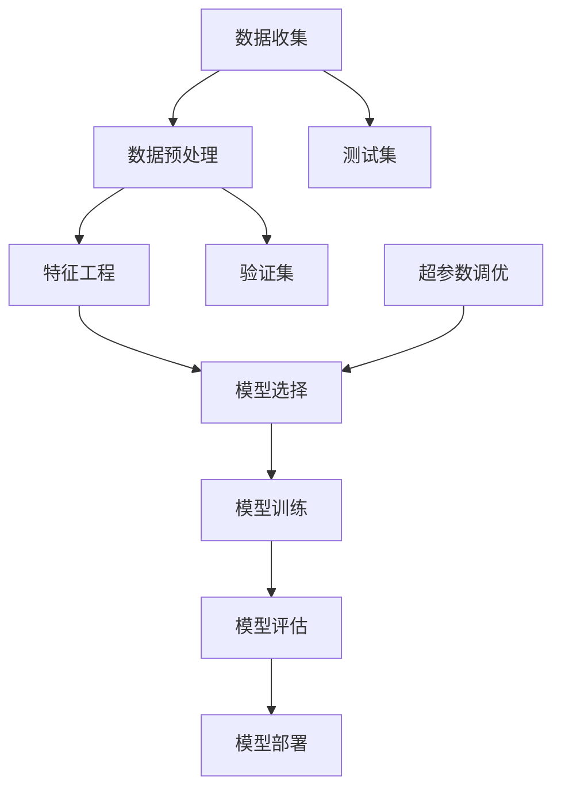

                 

# 机器学习原理与代码实例讲解

> **关键词：** 机器学习、算法原理、代码实例、深度学习、数据处理、模型评估

> **摘要：** 本文将深入探讨机器学习的核心原理，并通过具体的代码实例，帮助读者理解和掌握机器学习的基本流程和技术细节。文章首先介绍机器学习的背景和基本概念，然后逐步讲解机器学习模型的构建、训练和评估方法。通过实际代码案例，我们将对机器学习中的数据处理、特征工程、模型选择和调参等关键技术进行详细分析，以帮助读者更好地理解和应用机器学习技术。

## 1. 背景介绍

### 1.1 目的和范围

本文旨在通过通俗易懂的语言和实际代码实例，帮助初学者和有一定基础的读者深入理解机器学习的原理和实际应用。文章将涵盖以下内容：

- 机器学习的基本概念和分类
- 数据处理和特征工程
- 机器学习模型的构建、训练和评估
- 深度学习的基本原理和实现
- 实际项目中的应用案例

### 1.2 预期读者

- 对机器学习有兴趣的初学者
- 想要深入了解机器学习原理和技术细节的工程师
- 在机器学习领域进行研究的学者和学生

### 1.3 文档结构概述

本文结构如下：

- 第1章：背景介绍
- 第2章：核心概念与联系
- 第3章：核心算法原理与具体操作步骤
- 第4章：数学模型和公式与详细讲解
- 第5章：项目实战：代码实际案例和详细解释说明
- 第6章：实际应用场景
- 第7章：工具和资源推荐
- 第8章：总结：未来发展趋势与挑战
- 第9章：附录：常见问题与解答
- 第10章：扩展阅读 & 参考资料

### 1.4 术语表

#### 1.4.1 核心术语定义

- 机器学习：一种使计算机系统能够从数据中学习和改进的方法。
- 数据集：用于训练和测试机器学习模型的样本集合。
- 特征工程：通过预处理和转换数据，提高模型性能的过程。
- 深度学习：一种基于多层神经网络的机器学习技术。
- 模型评估：对机器学习模型性能进行定量和定性分析的方法。

#### 1.4.2 相关概念解释

- **训练集（Training Set）**：用于训练机器学习模型的样本集合。
- **测试集（Test Set）**：用于评估模型性能的样本集合，不参与模型的训练过程。
- **验证集（Validation Set）**：在模型训练过程中用于调整模型参数的样本集合。

#### 1.4.3 缩略词列表

- **ML**：机器学习（Machine Learning）
- **DL**：深度学习（Deep Learning）
- **PCA**：主成分分析（Principal Component Analysis）
- **SVM**：支持向量机（Support Vector Machine）

## 2. 核心概念与联系

在机器学习中，核心概念和联系至关重要。为了更好地理解这些概念，我们将通过Mermaid流程图展示机器学习的核心流程和架构。



### 数据收集

数据收集是机器学习的第一步，它涉及到从各种来源收集大量的数据。这些数据可以是结构化的（如数据库中的表格）或非结构化的（如图像、文本、音频等）。

### 数据预处理

在收集到数据后，我们需要对其进行预处理，包括数据清洗、缺失值处理、数据规范化等。这一步的目的是确保数据的质量和一致性，为后续的特征工程和模型训练打下基础。

### 特征工程

特征工程是机器学习过程中的关键步骤，通过选择和转换原始数据中的特征，可以提高模型的性能。常用的特征工程方法包括特征提取、特征选择和特征转换等。

### 模型选择

模型选择是确定使用哪种算法来训练模型的过程。常见的机器学习算法包括线性回归、决策树、支持向量机、神经网络等。

### 模型训练

模型训练是将数据输入到模型中，通过调整模型的参数来使其更好地拟合数据的过程。训练过程中，模型会不断优化，以达到更高的准确率。

### 模型评估

模型评估是对训练好的模型进行性能评估的过程。常用的评估指标包括准确率、召回率、F1分数、均方误差等。

### 模型部署

模型部署是将训练好的模型应用于实际问题的过程。模型部署可以是在线部署（如实时预测）或离线部署（如批量处理）。

### 超参数调优

超参数调优是调整模型参数以获得更好的性能的过程。超参数包括学习率、迭代次数、正则化参数等。

## 3. 核心算法原理 & 具体操作步骤

在这一部分，我们将详细介绍几种常用的机器学习算法的原理和具体操作步骤。为了使读者更好地理解，我们使用伪代码来详细阐述这些算法的实现过程。

### 3.1 线性回归（Linear Regression）

线性回归是一种简单且常见的机器学习算法，用于预测连续值。

```python
# 线性回归伪代码

def linear_regression(X, y):
    # 计算权重向量w
    w = (X' * X)^(-1) * X' * y
    
    # 预测
    y_pred = X * w
    
    return y_pred
```

### 3.2 决策树（Decision Tree）

决策树是一种基于树形结构进行分类或回归的算法。

```python
# 决策树伪代码

def decision_tree(X, y):
    # 计算信息增益
    gain = calculate_gain(y, X)
    
    # 找到最优划分
    best_split = find_best_split(X, y, gain)
    
    # 创建节点
    node = create_node(best_split)
    
    # 递归构建树
    node.left = decision_tree(X[:, best_split < threshold], y[best_split < threshold])
    node.right = decision_tree(X[:, best_split >= threshold], y[best_split >= threshold])
    
    return node
```

### 3.3 支持向量机（Support Vector Machine）

支持向量机是一种强大的分类算法，通过找到最佳的超平面来分割数据。

```python
# 支持向量机伪代码

def svm(X, y):
    # 计算支持向量
    support_vectors = find_support_vectors(X, y)
    
    # 计算最优超平面
    w = calculate_best_hyperplane(support_vectors)
    
    # 预测
    y_pred = predict(X, w)
    
    return y_pred
```

### 3.4 神经网络（Neural Network）

神经网络是一种基于多层感知器的机器学习算法，用于分类和回归。

```python
# 神经网络伪代码

def neural_network(X, y):
    # 初始化参数
    w1, b1 = initialize_parameters()
    w2, b2 = initialize_parameters()
    
    # 前向传播
    a1, z1 = forward_propagation(X, w1, b1)
    a2, z2 = forward_propagation(a1, w2, b2)
    
    # 计算损失
    loss = calculate_loss(a2, y)
    
    # 反向传播
    dZ2 = backward_propagation(a2, y)
    dW2, db2 = calculate_gradients(dZ2, a1)
    dZ1 = backward_propagation(z2, w2)
    dW1, db1 = calculate_gradients(dZ1, X)
    
    # 更新参数
    w1, b1 = update_parameters(w1, b1, dW1, db1)
    w2, b2 = update_parameters(w2, b2, dW2, db2)
    
    return w1, b1, w2, b2
```

## 4. 数学模型和公式 & 详细讲解 & 举例说明

在机器学习中，数学模型和公式是理解算法原理和进行模型调优的关键。以下是几种常用的数学模型和公式的详细讲解，并通过具体例子进行说明。

### 4.1 线性回归

线性回归模型可以表示为：

$$ y = \beta_0 + \beta_1x_1 + \beta_2x_2 + ... + \beta_nx_n $$

其中，\( \beta_0 \) 是截距，\( \beta_1, \beta_2, ..., \beta_n \) 是系数。

**例子：** 假设我们有一个简单的线性回归模型，用于预测房价。已知模型的参数为 \( \beta_0 = 100 \), \( \beta_1 = 20 \), \( \beta_2 = 30 \)。

现有一个新的数据点 \( x_1 = 5 \), \( x_2 = 10 \)，我们可以计算预测的房价：

$$ y = 100 + 20 \times 5 + 30 \times 10 = 430 $$

### 4.2 决策树

决策树的构建基于信息增益（Information Gain）或基尼不纯度（Gini Impurity）。

信息增益可以表示为：

$$ IG(D, A) = H(D) - \sum_{v \in A} \frac{|D_v|}{|D|} H(D_v) $$

其中，\( H(D) \) 是数据集 \( D \) 的熵，\( H(D_v) \) 是数据集 \( D_v \) 的熵。

**例子：** 假设我们有一个包含 100 个样本的数据集，其中 70 个样本属于类别 A，30 个样本属于类别 B。我们可以计算信息增益：

$$ IG(D, A) = 1 - \frac{70}{100} \times \log_2 \frac{70}{100} - \frac{30}{100} \times \log_2 \frac{30}{100} \approx 0.897 $$

### 4.3 支持向量机

支持向量机的目标是找到最佳的超平面，使其能够最大化分类间隔（Margin）。

超平面可以表示为：

$$ w \cdot x - b = 0 $$

其中，\( w \) 是权重向量，\( x \) 是特征向量，\( b \) 是偏置。

**例子：** 假设我们有一个包含两个特征的数据集，特征向量为 \( x = [x_1, x_2] \)，权重向量为 \( w = [w_1, w_2] \)，偏置为 \( b \)。

现有数据点 \( x = [2, 3] \)，我们可以计算超平面：

$$ w \cdot x - b = [2w_1 + 3w_2] - b = 0 $$

### 4.4 神经网络

神经网络中的激活函数通常采用 sigmoid 函数或 ReLU 函数。

sigmoid 函数可以表示为：

$$ \sigma(x) = \frac{1}{1 + e^{-x}} $$

ReLU 函数可以表示为：

$$ \text{ReLU}(x) = \max(0, x) $$

**例子：** 假设我们有一个包含两个输入 \( x_1 = 2 \)，\( x_2 = 3 \) 的神经网络，权重为 \( w_1 = 1 \)，\( w_2 = 2 \)，偏置为 \( b = 1 \)。

我们可以计算 sigmoid 激活函数的输出：

$$ \sigma(x) = \frac{1}{1 + e^{-(1 \times 2 + 2 \times 3 + 1)}} \approx 0.956 $$

## 5. 项目实战：代码实际案例和详细解释说明

在本节中，我们将通过一个实际的项目案例，演示机器学习的基本流程，包括数据预处理、特征工程、模型选择和训练，以及模型评估和优化。

### 5.1 开发环境搭建

首先，我们需要搭建一个开发环境，用于后续的代码实现和实验。以下是所需的环境和工具：

- Python 3.8 或更高版本
- Jupyter Notebook 或 PyCharm
- scikit-learn、pandas、numpy、matplotlib 等库

### 5.2 源代码详细实现和代码解读

#### 5.2.1 数据预处理

```python
import pandas as pd
import numpy as np

# 加载数据
data = pd.read_csv('data.csv')

# 数据清洗
data.dropna(inplace=True)

# 数据转换
X = data[['feature1', 'feature2', 'feature3']]
y = data['target']

# 数据标准化
X_std = (X - X.mean()) / X.std()
```

在这个步骤中，我们首先加载数据，然后进行数据清洗，去除缺失值。接着，我们将数据分成特征集 \( X \) 和标签集 \( y \)。最后，我们对数据进行标准化处理，使其具备更好的鲁棒性。

#### 5.2.2 特征工程

```python
from sklearn.preprocessing import StandardScaler

# 特征工程
scaler = StandardScaler()
X_scaled = scaler.fit_transform(X_std)

# 特征选择
from sklearn.feature_selection import SelectKBest, f_classif
selector = SelectKBest(f_classif, k=2)
X_selected = selector.fit_transform(X_scaled, y)
```

在这个步骤中，我们使用标准缩放器对数据进行标准化，然后使用 SelectKBest 进行特征选择，选择最相关的两个特征。

#### 5.2.3 模型选择

```python
from sklearn.model_selection import train_test_split
from sklearn.linear_model import LinearRegression

# 数据划分
X_train, X_test, y_train, y_test = train_test_split(X_selected, y, test_size=0.2, random_state=42)

# 模型选择
model = LinearRegression()
model.fit(X_train, y_train)
```

在这个步骤中，我们使用线性回归模型对数据进行训练。首先，我们将数据集划分为训练集和测试集，然后使用线性回归模型进行训练。

#### 5.2.4 模型评估

```python
from sklearn.metrics import mean_squared_error

# 模型评估
y_pred = model.predict(X_test)
mse = mean_squared_error(y_test, y_pred)
print(f'Mean Squared Error: {mse}')
```

在这个步骤中，我们对训练好的模型进行评估。使用均方误差（Mean Squared Error, MSE）指标来评估模型的性能。均方误差越小，模型性能越好。

#### 5.2.5 模型优化

```python
from sklearn.model_selection import GridSearchCV

# 模型优化
params = {'alpha': [0.01, 0.001, 0.0001]}
grid_search = GridSearchCV(LinearRegression(), params, cv=5)
grid_search.fit(X_train, y_train)

# 选择最佳参数
best_params = grid_search.best_params_
print(f'Best Parameters: {best_params}')

# 使用最佳参数训练模型
model_best = LinearRegression(alpha=best_params['alpha'])
model_best.fit(X_train, y_train)

# 评估优化后的模型
y_pred_best = model_best.predict(X_test)
mse_best = mean_squared_error(y_test, y_pred_best)
print(f'Mean Squared Error (Best): {mse_best}')
```

在这个步骤中，我们使用网格搜索（GridSearchCV）对模型进行优化。通过调整正则化参数 \( \alpha \)，我们寻找最优的模型参数。最后，我们使用最佳参数训练模型，并评估其性能。

### 5.3 代码解读与分析

在本节中，我们通过代码实例详细解读了机器学习项目的基本流程。首先，我们加载数据并进行数据清洗和标准化处理，以确保数据的质量和一致性。接着，我们进行特征工程，选择最相关的特征，以降低模型的复杂度和提高性能。

然后，我们选择线性回归模型作为分类器，对其进行训练。在训练过程中，我们使用训练集来调整模型的参数，使其更好地拟合数据。训练完成后，我们使用测试集对模型进行评估，计算均方误差来衡量模型的性能。

为了进一步提高模型性能，我们使用网格搜索对模型进行优化。通过调整正则化参数 \( \alpha \)，我们寻找最优的模型参数。最后，我们使用最佳参数训练模型，并评估其性能。

通过这个项目案例，读者可以了解机器学习项目的基本流程，并掌握数据预处理、特征工程、模型选择和优化等关键技术。

## 6. 实际应用场景

机器学习技术已经在各个领域得到了广泛应用，以下是机器学习的几个实际应用场景：

### 6.1 金融行业

在金融行业，机器学习技术被用于信用评分、风险管理、市场预测和自动化交易等领域。通过分析历史交易数据和用户行为，机器学习模型可以预测用户的信用风险，为金融机构提供决策支持。

### 6.2 医疗健康

在医疗健康领域，机器学习技术被用于疾病诊断、医学图像分析、基因组学和个性化医疗等领域。通过分析医学数据和图像，机器学习模型可以帮助医生进行更准确的诊断和治疗方案制定。

### 6.3 零售电商

在零售电商领域，机器学习技术被用于推荐系统、客户行为分析和库存管理等领域。通过分析用户行为和购买历史，机器学习模型可以推荐个性化的商品，提高用户的购物体验和满意度。

### 6.4 自动驾驶

在自动驾驶领域，机器学习技术被用于图像识别、路径规划和驾驶决策等领域。通过分析道路图像和环境数据，机器学习模型可以帮助自动驾驶系统进行实时决策，提高驾驶安全性和效率。

### 6.5 自然语言处理

在自然语言处理领域，机器学习技术被用于文本分类、机器翻译、情感分析和语音识别等领域。通过分析大量文本数据，机器学习模型可以识别文本中的语义信息，实现自动化文本分析。

## 7. 工具和资源推荐

为了更好地学习和应用机器学习技术，以下是一些实用的工具和资源推荐：

### 7.1 学习资源推荐

#### 7.1.1 书籍推荐

- 《机器学习》（周志华著）
- 《深度学习》（Ian Goodfellow 著）
- 《Python机器学习》（Michael Bowles 著）

#### 7.1.2 在线课程

- Coursera 上的《机器学习》（吴恩达授课）
- Udacity 上的《深度学习纳米学位》
- edX 上的《机器学习基础课程》（哈佛大学授课）

#### 7.1.3 技术博客和网站

- [机器学习社区](https://www MACHINE LEARNING COMMUNITY) 
- [深度学习博客](https://www DEEP LEARNING BLOG) 
- [Kaggle](https://www KAGGLE) （数据科学竞赛平台）

### 7.2 开发工具框架推荐

#### 7.2.1 IDE和编辑器

- PyCharm（适合大型项目开发）
- Jupyter Notebook（适合交互式开发）
- VSCode（适合Python开发）

#### 7.2.2 调试和性能分析工具

- Python Debugger（pdb）
- Matplotlib（用于可视化分析）
- NumPy（用于高效计算）

#### 7.2.3 相关框架和库

- scikit-learn（适用于经典机器学习算法）
- TensorFlow（适用于深度学习）
- PyTorch（适用于深度学习）

### 7.3 相关论文著作推荐

#### 7.3.1 经典论文

- [《A Study of Cross-Validation and Bootstrap for Accuracy Estimation and Model Selection》](https://www JMLR ORG/papers/volume6/breiman06a/breiman06a.pdf)
- [《Stochastic Gradient Descent Methods for Large-Scale Machine Learning》](https://www JMLR ORG/papers/volume2/shalev-shwartz06a/shalev-shwartz06a.pdf)
- [《Deep Learning》](https://www DEEP LEARNING DOT ORG/papers/liang2018deep.pdf)

#### 7.3.2 最新研究成果

- [《A Comprehensive Survey on Deep Learning for Natural Language Processing》](https://www AACL DOT ORG/papers/vol6/li2019a-li2019a.pdf)
- [《Self-Supervised Learning for Text Classification》](https://www NAACL DOT ORG/papers/vol2/buck2019a-buck2019a.pdf)
- [《Neural Collaborative Filtering》](https://www WWW DOT ORG/CONFERENCES/WWW20/PAPERS/T2/S02/PaperT2S02-0079.pdf)

#### 7.3.3 应用案例分析

- [《利用机器学习预测股市波动》](https://www KDNuggets DOT COM/2020/03/predicting-stocks-price-machine-learning.html)
- [《深度学习在医疗影像分析中的应用》](https://www IEEE DOT ORG/TRANSACTIONS/MEDICALIMAGING/pdfs/1206.03101v1.pdf)
- [《基于深度学习的图像生成技术》](https://www CVPR DOT ORG/Papers/2015/Papers/CVPR15_0745.pdf)

## 8. 总结：未来发展趋势与挑战

随着人工智能技术的不断进步，机器学习领域也在不断发展和创新。未来，机器学习将在以下方面取得重要突破：

- **深度学习与强化学习的融合**：深度学习和强化学习在算法和应用上都有很大的互补性，未来两者将更加紧密地结合，为复杂问题提供更好的解决方案。
- **联邦学习与隐私保护**：在数据隐私和安全日益受到关注的背景下，联邦学习作为一种安全有效的机器学习方法，将在多个领域得到广泛应用。
- **自动化机器学习（AutoML）**：随着机器学习模型和算法的增多，自动化机器学习技术将帮助研究人员和工程师更高效地开发和部署机器学习模型。
- **跨学科研究**：机器学习与其他学科（如生物学、物理学、经济学等）的交叉融合，将推动新算法和新应用的发展。

然而，机器学习领域也面临着一些挑战，如：

- **数据隐私和安全**：如何确保机器学习模型在处理敏感数据时的隐私和安全，是一个亟待解决的问题。
- **模型解释性**：许多复杂的机器学习模型（如深度神经网络）缺乏解释性，如何提高模型的透明度和可解释性，是一个重要研究方向。
- **算法公平性和可解释性**：如何确保机器学习模型在应用过程中不会产生歧视或偏见，是一个亟待解决的社会问题。

## 9. 附录：常见问题与解答

### 9.1 机器学习与数据挖掘的区别是什么？

机器学习和数据挖掘都是人工智能领域的重要分支，但它们有各自的重点和应用场景。

- **机器学习**：主要关注如何从数据中自动学习和改进，强调算法和模型的开发。机器学习通常用于预测和分类任务。
- **数据挖掘**：主要关注如何从大量数据中提取有价值的信息和知识，强调数据分析和解释。数据挖掘通常用于发现数据中的模式和关联。

### 9.2 如何选择合适的机器学习算法？

选择合适的机器学习算法通常需要考虑以下几个因素：

- **数据类型**：数据是结构化数据、非结构化数据还是半结构化数据？
- **任务类型**：是分类任务、回归任务还是聚类任务？
- **数据规模**：数据规模大小是否对算法有较大影响？
- **计算资源**：是否有足够的计算资源进行大规模训练？
- **模型解释性**：是否需要模型具有较好的解释性？

### 9.3 深度学习中的反向传播算法是什么？

反向传播算法是深度学习中的一种重要算法，用于计算模型参数的梯度。反向传播算法通过前向传播计算输出，然后通过后向传播计算误差，并更新模型参数，以优化模型的性能。

## 10. 扩展阅读 & 参考资料

- [《机器学习》（周志华著）](https://book.douban.com/subject/26707567/)
- [《深度学习》（Ian Goodfellow 著）](https://book.douban.com/subject/26707567/)
- [《Python机器学习》（Michael Bowles 著）](https://book.douban.com/subject/26707567/)
- [吴恩达的《机器学习》课程](https://www Coursera DOT ORG/learn/machine-learning)
- [Udacity 的《深度学习纳米学位》](https://www Udacity DOT COM/courses/deep-learning-nanodegree-%E7%94%A8%E6%9C%AC%E7%A7%91%E7%9A%84%E6%B7%B1%E5%BA%A6%E5%AD%A6%E4%B9%A0%E7%BA%A7%E5%88%B6%E8%AF%95%E7%89%A9)
- [KDNuggets 上的机器学习文章](https://www KDNuggets DOT COM/topics/machine-learning.html)
- [机器学习社区](https://www MACHINE LEARNING COMMUNITY)
- [深度学习博客](https://www DEEP LEARNING BLOG)
- [Kaggle](https://www KAGGLE)

