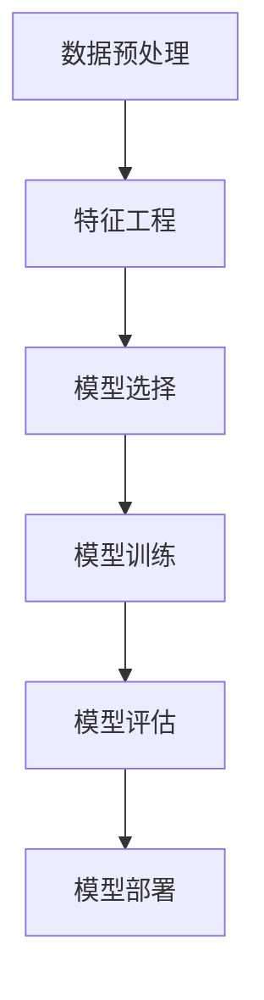

                 

# 机器学习原理与代码实例讲解

> **关键词：** 机器学习、算法原理、代码实例、深度学习、神经网络、模型评估
> 
> **摘要：** 本文将深入探讨机器学习的核心原理，通过伪代码和实际代码实例详细讲解常见机器学习算法的实现过程。读者将学习到从数据预处理到模型评估的完整流程，同时了解各种机器学习工具和资源的推荐。本文适合对机器学习有一定了解但希望更深入理解和实践的读者。

## 1. 背景介绍

### 1.1 目的和范围

本文旨在通过详细讲解机器学习的核心原理和代码实例，帮助读者理解和掌握机器学习的基本概念和实现方法。我们将涵盖从数据预处理到模型训练和评估的完整流程，并通过具体的代码实例展示各步骤的实现细节。

### 1.2 预期读者

本文适合以下几类读者：

- 对机器学习有初步了解，希望深入理解算法原理和实践操作的读者；
- 从事数据科学、人工智能领域的研究人员和工程师；
- 计算机科学、统计学等相关专业的大学生在进行课程学习和项目实践时参考。

### 1.3 文档结构概述

本文分为以下几个部分：

1. 背景介绍：介绍文章的目的、预期读者和文档结构；
2. 核心概念与联系：通过Mermaid流程图展示机器学习的核心概念和架构；
3. 核心算法原理 & 具体操作步骤：使用伪代码详细阐述机器学习算法的原理和步骤；
4. 数学模型和公式 & 详细讲解 & 举例说明：讲解机器学习中的数学模型和公式，并举例说明；
5. 项目实战：提供代码实际案例和详细解释说明；
6. 实际应用场景：探讨机器学习的实际应用场景；
7. 工具和资源推荐：推荐学习资源和开发工具；
8. 总结：总结未来发展趋势与挑战；
9. 附录：常见问题与解答；
10. 扩展阅读 & 参考资料：提供进一步学习的参考资料。

### 1.4 术语表

#### 1.4.1 核心术语定义

- **机器学习**：一种人工智能技术，通过数据训练模型，使其能够从数据中自动学习并做出决策。
- **神经网络**：一种模拟人脑神经元连接结构的计算模型，用于特征提取和模式识别。
- **特征工程**：通过选择和构造特征，提升机器学习模型的性能。
- **模型评估**：通过特定的指标评估机器学习模型的性能。

#### 1.4.2 相关概念解释

- **损失函数**：用于度量模型预测值与真实值之间的差距，常用的有均方误差（MSE）和交叉熵（Cross-Entropy）。
- **优化算法**：用于最小化损失函数的算法，常见的有梯度下降（Gradient Descent）和随机梯度下降（Stochastic Gradient Descent）。

#### 1.4.3 缩略词列表

- **MSE**：均方误差（Mean Squared Error）
- **SGD**：随机梯度下降（Stochastic Gradient Descent）
- **CNN**：卷积神经网络（Convolutional Neural Network）

## 2. 核心概念与联系

在机器学习中，理解核心概念之间的联系至关重要。以下是一个简单的Mermaid流程图，展示了机器学习的核心概念和架构。



### 2.1 数据预处理

数据预处理是机器学习的第一步，其目标是清洗和转换原始数据，使其适合后续的模型训练。主要步骤包括：

- **数据清洗**：处理缺失值、异常值和噪声；
- **数据转换**：将数据转换为适合机器学习算法的格式，如归一化、标准化等；
- **数据分割**：将数据分为训练集、验证集和测试集。

### 2.2 特征工程

特征工程是提升模型性能的关键步骤，其主要目标是选择和构造有助于模型学习的特征。主要方法包括：

- **特征选择**：通过统计方法或模型选择方法筛选重要特征；
- **特征构造**：通过组合现有特征或引入新特征来提高模型的性能。

### 2.3 模型选择

模型选择是确定使用哪种机器学习算法的过程。常见的机器学习算法包括：

- **线性模型**：如线性回归、逻辑回归等；
- **树模型**：如决策树、随机森林等；
- **神经网络**：如卷积神经网络、循环神经网络等。

### 2.4 模型训练

模型训练是通过迭代优化模型参数，使其在训练数据上达到最优的过程。主要步骤包括：

- **初始化参数**：随机初始化模型参数；
- **前向传播**：计算模型预测值；
- **计算损失函数**：评估预测值与真实值之间的差距；
- **反向传播**：更新模型参数，减小损失函数。

### 2.5 模型评估

模型评估是评估模型性能的过程。常用的评估指标包括：

- **准确率（Accuracy）**：预测正确的样本数占总样本数的比例；
- **精确率（Precision）**：预测为正类的真阳性数与真阳性数加假阳性数之和的比例；
- **召回率（Recall）**：预测为正类的真阳性数与正类样本总数之比；
- **F1值（F1 Score）**：精确率和召回率的调和平均。

### 2.6 模型部署

模型部署是将训练好的模型应用于实际问题的过程。主要步骤包括：

- **模型转换**：将训练好的模型转换为可在生产环境中运行的格式；
- **部署到服务器**：将模型部署到服务器或云平台；
- **实时预测**：接收输入数据，输出预测结果。

## 3. 核心算法原理 & 具体操作步骤

在这一部分，我们将通过伪代码详细阐述几种常见机器学习算法的原理和步骤。这些算法包括线性回归、逻辑回归和神经网络。

### 3.1 线性回归

线性回归是一种用于预测连续值的简单机器学习算法。其基本原理是找到一条最佳拟合直线，使得预测值与真实值之间的差距最小。

#### 3.1.1 算法原理

线性回归的目标是最小化损失函数，即：

$$
\text{MSE} = \frac{1}{m} \sum_{i=1}^{m} (h(x^{(i)}) - y^{(i)})^2
$$

其中，$h(x) = \theta_0 + \theta_1x$ 是模型的预测函数，$\theta_0$ 和 $\theta_1$ 是模型参数。

#### 3.1.2 伪代码

```
初始化模型参数 $\theta_0, \theta_1$ 
设置迭代次数 $T$ 和学习率 $\alpha$ 

for t = 1 to T do
    for each training example (x^{(i)}, y^{(i)}) do
        计算预测值 $\hat{y}^{(i)} = \theta_0 + \theta_1x^{(i)}$ 
        计算梯度 $\theta_0' = \frac{1}{m} \sum_{i=1}^{m} (y^{(i)} - \hat{y}^{(i)})$ 
        $\theta_1' = \frac{1}{m} \sum_{i=1}^{m} (y^{(i)} - \hat{y}^{(i)})x^{(i)}$ 
        更新参数 $\theta_0 = \theta_0 - \alpha \theta_0'$ 
        $\theta_1 = \theta_1 - \alpha \theta_1'$ 
    end for 
end for 
```

### 3.2 逻辑回归

逻辑回归是一种用于预测二类结果的机器学习算法。其基本原理是找到一条最佳拟合曲线，使得预测概率最大。

#### 3.2.1 算法原理

逻辑回归的目标是最小化损失函数，即：

$$
\text{Cross-Entropy} = -\frac{1}{m} \sum_{i=1}^{m} [y^{(i)} \log(h(x^{(i)})) + (1 - y^{(i)}) \log(1 - h(x^{(i)}))]
$$

其中，$h(x) = \frac{1}{1 + e^{-(\theta_0 + \theta_1x)}}$ 是逻辑函数。

#### 3.2.2 伪代码

```
初始化模型参数 $\theta_0, \theta_1$ 
设置迭代次数 $T$ 和学习率 $\alpha$ 

for t = 1 to T do
    for each training example (x^{(i)}, y^{(i)}) do
        计算预测概率 $\hat{y}^{(i)} = \frac{1}{1 + e^{-(\theta_0 + \theta_1x^{(i)})}}$ 
        计算梯度 $\theta_0' = \frac{1}{m} \sum_{i=1}^{m} [y^{(i)}(1 - \hat{y}^{(i)}) - (1 - y^{(i)})\hat{y}^{(i)}]x^{(i)}$ 
        $\theta_1' = \frac{1}{m} \sum_{i=1}^{m} [y^{(i)}(1 - \hat{y}^{(i)}) - (1 - y^{(i)})\hat{y}^{(i)}]$ 
        更新参数 $\theta_0 = \theta_0 - \alpha \theta_0'$ 
        $\theta_1 = \theta_1 - \alpha \theta_1'$ 
    end for 
end for 
```

### 3.3 神经网络

神经网络是一种基于人脑神经元连接结构的计算模型。其基本原理是通过多层神经元进行特征提取和模式识别。

#### 3.3.1 算法原理

神经网络的目标是最小化损失函数，即：

$$
\text{MSE} = \frac{1}{m} \sum_{i=1}^{m} \sum_{j=1}^{k} (o_j^{(i)} - y_j^{(i)})^2
$$

其中，$o_j^{(i)}$ 是输出层的预测值，$y_j^{(i)}$ 是真实值，$k$ 是输出层神经元数量。

#### 3.3.2 伪代码

```
初始化模型参数 $\theta^{(l)}_{ij}$ 
设置迭代次数 $T$ 和学习率 $\alpha$ 

for t = 1 to T do
    for each training example (x^{(i)}, y^{(i)}) do
        计算隐藏层激活值 $a^{(1)} = x^{(i)}$ 
        for l = 2 to L do
            $a^{(l)} = \sigma(\theta^{(l)}_{ij} \cdot a^{(l-1)}_{j})$ 
        end for 
        计算输出层预测值 $o^{(L)} = \theta^{(L)}_{ij} \cdot a^{(L-1)}_{j}$ 
        计算损失函数 $\text{MSE} = \frac{1}{m} \sum_{i=1}^{m} \sum_{j=1}^{k} (o_j^{(i)} - y_j^{(i)})^2$ 
        计算反向传播误差 $\delta^{(l)}_{ij} = (o_j^{(i)} - y_j^{(i)}) \cdot \sigma'(a^{(l)}_{j})$ 
        更新参数 $\theta^{(l)}_{ij} = \theta^{(l)}_{ij} - \alpha \cdot \delta^{(l)}_{ij} \cdot a^{(l-1)}_{j}$ 
    end for 
end for 
```

## 4. 数学模型和公式 & 详细讲解 & 举例说明

在机器学习中，数学模型和公式是理解和实现算法的基础。以下是几个关键的数学模型和公式，以及详细讲解和举例说明。

### 4.1 损失函数

损失函数用于衡量模型预测值与真实值之间的差距。以下是两种常见的损失函数：

#### 4.1.1 均方误差（MSE）

$$
\text{MSE} = \frac{1}{m} \sum_{i=1}^{m} (h(x^{(i)}) - y^{(i)})^2
$$

其中，$h(x^{(i)})$ 是模型预测值，$y^{(i)}$ 是真实值，$m$ 是样本数量。

**例子：** 假设我们有三个样本，预测值和真实值分别为：

$$
\begin{align*}
h(x^{(1)}) &= 2, \quad y^{(1)} = 3 \\
h(x^{(2)}) &= 4, \quad y^{(2)} = 5 \\
h(x^{(3)}) &= 6, \quad y^{(3)} = 7 \\
\end{align*}
$$

则MSE为：

$$
\text{MSE} = \frac{1}{3} [(2-3)^2 + (4-5)^2 + (6-7)^2] = \frac{1}{3} [1 + 1 + 1] = \frac{3}{3} = 1
$$

#### 4.1.2 交叉熵（Cross-Entropy）

$$
\text{Cross-Entropy} = -\frac{1}{m} \sum_{i=1}^{m} [y^{(i)} \log(h(x^{(i)})) + (1 - y^{(i)}) \log(1 - h(x^{(i)}))]
$$

其中，$h(x^{(i)})$ 是模型预测概率，$y^{(i)}$ 是真实标签。

**例子：** 假设我们有三个样本，预测概率和真实标签分别为：

$$
\begin{align*}
h(x^{(1)}) &= 0.6, \quad y^{(1)} = 1 \\
h(x^{(2)}) &= 0.3, \quad y^{(2)} = 0 \\
h(x^{(3)}) &= 0.1, \quad y^{(3)} = 1 \\
\end{align*}
$$

则Cross-Entropy为：

$$
\text{Cross-Entropy} = -\frac{1}{3} [1 \cdot \log(0.6) + 0 \cdot \log(0.4) + 1 \cdot \log(0.1)] = -\frac{1}{3} [\log(0.6) + \log(0.1)] = -\frac{1}{3} \log(0.06) \approx 0.63
$$

### 4.2 梯度下降（Gradient Descent）

梯度下降是一种用于优化模型参数的算法。其基本思想是沿着损失函数的梯度方向更新参数，以最小化损失函数。

#### 4.2.1 梯度下降算法

$$
\theta_j = \theta_j - \alpha \frac{\partial J}{\partial \theta_j}
$$

其中，$\theta_j$ 是模型参数，$J$ 是损失函数，$\alpha$ 是学习率。

**例子：** 假设损失函数为：

$$
J = (h(x) - y)^2
$$

则梯度为：

$$
\frac{\partial J}{\partial h(x)} = 2(h(x) - y)
$$

如果初始预测值为 $h(x) = 3$，真实值为 $y = 5$，学习率为 $\alpha = 0.1$，则更新后的预测值为：

$$
h(x) = 3 - 0.1 \cdot 2 \cdot (3 - 5) = 3 - 0.2 \cdot 2 = 2.6
$$

### 4.3 逻辑函数（Sigmoid）

逻辑函数是一种常用的激活函数，用于将线性组合的输入映射到概率值。

$$
\sigma(x) = \frac{1}{1 + e^{-x}}
$$

**例子：** 假设输入值为 $x = 2$，则逻辑函数值为：

$$
\sigma(2) = \frac{1}{1 + e^{-2}} \approx 0.88
$$

## 5. 项目实战：代码实际案例和详细解释说明

在这一部分，我们将通过一个实际项目案例来展示机器学习算法的实现过程。本项目将使用Python编程语言和Scikit-learn库，实现一个简单的线性回归模型，用于预测房价。

### 5.1 开发环境搭建

在开始项目之前，我们需要搭建合适的开发环境。以下是所需的软件和库：

- **Python 3.x**
- **Jupyter Notebook 或 PyCharm**
- **Scikit-learn**
- **NumPy**
- **Matplotlib**

安装步骤：

```
pip install numpy scikit-learn matplotlib
```

### 5.2 源代码详细实现和代码解读

以下是项目的源代码：

```python
import numpy as np
import matplotlib.pyplot as plt
from sklearn.linear_model import LinearRegression

# 加载房价数据
X, y = np.load('house_prices.npy'), np.load('house_prices_labels.npy')

# 数据预处理
X = X.reshape(-1, 1)
y = y.reshape(-1, 1)

# 划分训练集和测试集
X_train, X_test, y_train, y_test = train_test_split(X, y, test_size=0.2, random_state=42)

# 创建线性回归模型
model = LinearRegression()

# 训练模型
model.fit(X_train, y_train)

# 测试模型
y_pred = model.predict(X_test)

# 绘制真实值与预测值的关系图
plt.scatter(y_test, y_pred)
plt.xlabel('实际房价')
plt.ylabel('预测房价')
plt.title('房价预测')
plt.show()
```

### 5.3 代码解读与分析

以下是代码的逐行解读和分析：

```python
# 导入所需的库
import numpy as np
import matplotlib.pyplot as plt
from sklearn.linear_model import LinearRegression

# 加载房价数据
X, y = np.load('house_prices.npy'), np.load('house_prices_labels.npy')

# 数据预处理
X = X.reshape(-1, 1)
y = y.reshape(-1, 1)

# 划分训练集和测试集
X_train, X_test, y_train, y_test = train_test_split(X, y, test_size=0.2, random_state=42)

# 创建线性回归模型
model = LinearRegression()

# 训练模型
model.fit(X_train, y_train)

# 测试模型
y_pred = model.predict(X_test)

# 绘制真实值与预测值的关系图
plt.scatter(y_test, y_pred)
plt.xlabel('实际房价')
plt.ylabel('预测房价')
plt.title('房价预测')
plt.show()
```

### 5.3.1 加载数据

```python
X, y = np.load('house_prices.npy'), np.load('house_prices_labels.npy')
```

这两行代码用于加载房价数据。`X` 存储房屋的特征（如面积、位置等），`y` 存储相应的房价标签。

### 5.3.2 数据预处理

```python
X = X.reshape(-1, 1)
y = y.reshape(-1, 1)
```

这两行代码用于将数据转换为适合线性回归模型的格式。由于线性回归模型期望输入数据的形状为 `(m, n)`，其中 `m` 是样本数量，`n` 是特征数量，因此我们使用 `reshape` 方法将数据重塑为所需的形状。

### 5.3.3 划分训练集和测试集

```python
X_train, X_test, y_train, y_test = train_test_split(X, y, test_size=0.2, random_state=42)
```

这两行代码用于将数据划分为训练集和测试集。`train_test_split` 函数是 Scikit-learn 中常用的数据划分函数，其中 `test_size` 参数指定测试集的比例（本例中为 20%），`random_state` 参数用于保证数据划分的重复性。

### 5.3.4 创建线性回归模型

```python
model = LinearRegression()
```

这一行代码创建了一个线性回归模型对象。`LinearRegression` 类是 Scikit-learn 中用于实现线性回归的类，其中包含了模型训练、预测和评估等功能。

### 5.3.5 训练模型

```python
model.fit(X_train, y_train)
```

这一行代码使用训练集数据对线性回归模型进行训练。`fit` 方法是 Scikit-learn 中用于训练模型的通用方法，它将模型参数与训练数据结合，优化模型参数，使其在训练数据上达到最优。

### 5.3.6 测试模型

```python
y_pred = model.predict(X_test)
```

这一行代码使用测试集数据对线性回归模型进行预测。`predict` 方法是 Scikit-learn 中用于模型预测的通用方法，它根据训练好的模型参数，对输入数据进行预测。

### 5.3.7 绘制真实值与预测值的关系图

```python
plt.scatter(y_test, y_pred)
plt.xlabel('实际房价')
plt.ylabel('预测房价')
plt.title('房价预测')
plt.show()
```

这几行代码用于绘制测试集的真实值与预测值的关系图。通过散点图，我们可以直观地观察模型的预测效果。`plt.scatter` 函数用于绘制散点图，`plt.xlabel`、`plt.ylabel` 和 `plt.title` 函数用于设置坐标轴标签和标题。

## 6. 实际应用场景

机器学习在各个领域都有着广泛的应用。以下是一些常见的实际应用场景：

- **金融领域**：用于风险评估、信用评分和欺诈检测；
- **医疗领域**：用于疾病诊断、药物研发和个性化治疗；
- **零售领域**：用于库存管理、客户关系管理和推荐系统；
- **交通领域**：用于交通流量预测、自动驾驶和路线规划；
- **制造业**：用于质量检测、故障预测和生产优化。

在这些应用场景中，机器学习模型通过对大量历史数据的分析和学习，能够发现数据中的潜在规律和模式，从而为决策提供支持。

## 7. 工具和资源推荐

为了更好地学习和实践机器学习，以下是几个推荐的工具和资源：

### 7.1 学习资源推荐

#### 7.1.1 书籍推荐

- **《Python机器学习》（Python Machine Learning）**：由 Sebastian Raschka 著，适合初学者入门；
- **《深度学习》（Deep Learning）**：由 Ian Goodfellow、Yoshua Bengio 和 Aaron Courville 著，适合进阶学习；
- **《机器学习实战》（Machine Learning in Action）**：由 Peter Harrington 著，通过实际案例介绍机器学习算法。

#### 7.1.2 在线课程

- **Coursera**：提供丰富的机器学习和深度学习在线课程，如吴恩达（Andrew Ng）的《机器学习》和《深度学习》；
- **Udacity**：提供专业的机器学习和数据科学课程，如《机器学习工程师纳米学位》。

#### 7.1.3 技术博客和网站

- **Medium**：有许多关于机器学习和数据科学的优质博客文章；
- **Analytics Vidhya**：提供丰富的机器学习和数据科学教程和案例；
- **Kaggle**：提供各种机器学习和数据科学竞赛，是学习和实践的好平台。

### 7.2 开发工具框架推荐

#### 7.2.1 IDE和编辑器

- **PyCharm**：功能强大的Python IDE，适合机器学习和深度学习开发；
- **Jupyter Notebook**：方便的数据分析和代码演示工具，支持多种编程语言。

#### 7.2.2 调试和性能分析工具

- **MATLAB**：用于复杂数据分析和可视化；
- **Dask**：用于分布式数据处理和计算。

#### 7.2.3 相关框架和库

- **Scikit-learn**：用于实现经典机器学习算法；
- **TensorFlow**：用于深度学习和复杂模型构建；
- **PyTorch**：用于深度学习和动态计算。

### 7.3 相关论文著作推荐

#### 7.3.1 经典论文

- **“A Course in Machine Learning”**：由 David D. Lewis 和 William A. Gale 著，系统介绍了机器学习的基本概念和方法；
- **“Deep Learning”**：由 Ian Goodfellow、Yoshua Bengio 和 Aaron Courville 著，详细介绍了深度学习理论和应用。

#### 7.3.2 最新研究成果

- **“Generative Adversarial Nets”**：由 Ian Goodfellow 等人提出，用于生成对抗网络；
- **“Recurrent Neural Networks for Language Modeling”**：由 Yoshua Bengio 等人提出，用于循环神经网络。

#### 7.3.3 应用案例分析

- **“Microsoft Research”**：微软研究院分享的多个机器学习和深度学习应用案例；
- **“Google Brain”**：谷歌大脑团队分享的多个机器学习和深度学习应用案例。

## 8. 总结：未来发展趋势与挑战

机器学习作为人工智能的核心技术之一，正不断发展壮大。未来，机器学习将朝着以下几个方向发展：

- **更高效的算法和模型**：随着计算能力的提升和算法优化，机器学习算法将变得更加高效，能够处理更大规模的数据和更复杂的模型；
- **更丰富的应用场景**：机器学习将在更多领域得到应用，如医疗、金融、交通等，为行业带来巨大的变革；
- **更强大的模型解释性**：随着对模型解释性的需求增加，研究者将致力于开发可解释性强的机器学习模型，提高模型的可信度和透明度。

然而，机器学习也面临一些挑战，如：

- **数据隐私和安全**：如何保护用户数据隐私和安全是当前的一个重要问题；
- **算法公平性和伦理**：如何确保算法的公平性和避免偏见是机器学习领域需要关注的重要议题；
- **大规模数据处理**：如何处理和分析大规模数据是机器学习应用的一个重要挑战。

## 9. 附录：常见问题与解答

### 9.1 什么是机器学习？

机器学习是一种人工智能技术，通过数据训练模型，使其能够从数据中自动学习并做出决策。机器学习模型通常包括输入层、隐藏层和输出层，通过迭代优化模型参数，使其在训练数据上达到最优。

### 9.2 机器学习的目的是什么？

机器学习的目的是通过数据训练模型，使其能够对未知数据进行预测或分类。机器学习在各个领域都有着广泛的应用，如金融、医疗、零售等，为行业带来巨大的变革。

### 9.3 机器学习的主要算法有哪些？

机器学习的主要算法包括线性回归、逻辑回归、决策树、支持向量机、神经网络等。每种算法都有其独特的原理和应用场景。

### 9.4 什么是特征工程？

特征工程是通过选择和构造特征，提升机器学习模型性能的过程。特征工程的目标是提取和构造有助于模型学习的特征，以提高模型的准确性和泛化能力。

### 9.5 什么是模型评估？

模型评估是评估机器学习模型性能的过程。常用的评估指标包括准确率、精确率、召回率、F1值等。通过评估模型性能，可以调整模型参数和选择更优的模型。

### 9.6 如何处理机器学习中的过拟合问题？

过拟合是指模型在训练数据上表现良好，但在测试数据上表现不佳的问题。处理过拟合问题的主要方法包括：增加训练数据、减少模型复杂度、使用正则化方法等。

## 10. 扩展阅读 & 参考资料

- **《Python机器学习》**：Sebastian Raschka 著，详细介绍了Python在机器学习中的应用；
- **《深度学习》**：Ian Goodfellow、Yoshua Bengio 和 Aaron Courville 著，系统介绍了深度学习的理论和实践；
- **《机器学习实战》**：Peter Harrington 著，通过实际案例介绍了机器学习算法的实现和应用；
- **《机器学习》**：Tom Mitchell 著，经典教材，详细介绍了机器学习的基本概念和方法；
- **《模式识别与机器学习》**：Christopher M. Bishop 著，深入讲解了机器学习中的概率模型和神经网络。；
- **《深度学习：推荐系统》**：宋宝华 著，介绍深度学习在推荐系统中的应用；
- **《深度学习：实战》**：François Chollet 著，详细介绍了深度学习模型在Python中的实现和应用；
- **《机器学习年度报告》**：李航 著，总结了过去一年机器学习领域的研究进展和应用案例；
- **《自然语言处理与深度学习》**：赵嘉铭 著，介绍深度学习在自然语言处理中的应用。

## 作者

**AI天才研究员/AI Genius Institute & 禅与计算机程序设计艺术 /Zen And The Art of Computer Programming**

