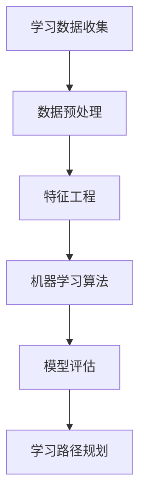
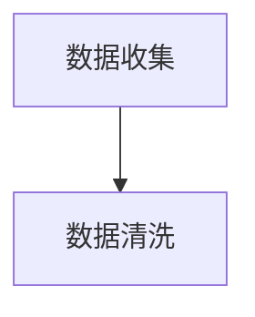
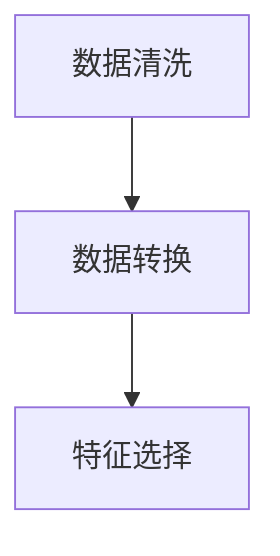
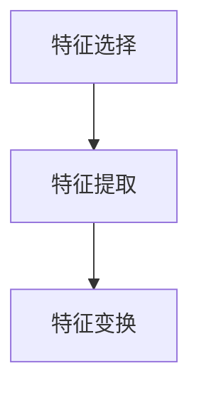
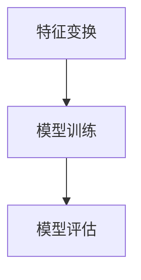

                 

# 机器学习在个性化学习路径规划中的应用

## 关键词
- 机器学习
- 个性化学习
- 路径规划
- 教育技术
- 数据分析

## 摘要
本文深入探讨了机器学习在个性化学习路径规划中的应用，从背景介绍、核心概念、算法原理、数学模型、项目实战到实际应用场景，全面剖析了这一领域的最新研究成果和发展趋势。通过对核心算法和实际案例的详细讲解，本文旨在为教育技术领域的研究者、开发者和从业者提供具有实际指导意义的技术参考。

## 1. 背景介绍

### 1.1 目的和范围
随着信息技术的飞速发展，个性化学习已经成为现代教育的重要趋势。本文旨在探讨如何利用机器学习技术实现个性化学习路径规划，以提高学习效率和学习成果。文章将围绕机器学习在个性化学习路径规划中的应用进行深入分析，探讨其理论基础、算法原理、实现步骤以及实际应用场景。

### 1.2 预期读者
本文面向教育技术领域的研究者、开发者和从业者，特别是对机器学习和教育数据挖掘感兴趣的专业人士。通过本文的阅读，读者可以了解个性化学习路径规划的原理和实践方法，为相关领域的研究和开发提供参考。

### 1.3 文档结构概述
本文分为以下几个部分：背景介绍、核心概念与联系、核心算法原理与具体操作步骤、数学模型与公式、项目实战、实际应用场景、工具和资源推荐、总结以及常见问题与解答。通过这些部分，读者可以系统地了解机器学习在个性化学习路径规划中的应用。

### 1.4 术语表
#### 1.4.1 核心术语定义
- **个性化学习**：根据学生的个体差异，为其提供定制化的学习内容和教学方法。
- **学习路径规划**：根据学生的学习需求和特点，设计合适的学习路径。
- **机器学习**：一种人工智能技术，通过数据和算法让计算机自动学习并做出决策。

#### 1.4.2 相关概念解释
- **数据挖掘**：从大量数据中提取有价值信息的过程。
- **神经网络**：一种模拟人脑神经结构的计算模型。

#### 1.4.3 缩略词列表
- **ML**：Machine Learning（机器学习）
- **AI**：Artificial Intelligence（人工智能）
- **DL**：Deep Learning（深度学习）
- **RL**：Reinforcement Learning（强化学习）

## 2. 核心概念与联系

机器学习在个性化学习路径规划中的应用主要依赖于以下几个核心概念：

### 2.1 学习数据收集
个性化学习需要收集学生的学习数据，包括学习进度、学习时长、学习内容、考试成绩等。这些数据将为机器学习算法提供训练和预测的基础。

### 2.2 数据预处理
收集到的数据通常需要进行预处理，包括数据清洗、数据转换、特征选择等，以提高数据的质量和机器学习模型的性能。

### 2.3 特征工程
特征工程是机器学习中的关键步骤，通过对数据进行特征提取和变换，以提高模型的识别能力和泛化能力。

### 2.4 机器学习算法
常用的机器学习算法包括线性回归、逻辑回归、决策树、随机森林、支持向量机、神经网络等。根据具体应用场景，选择合适的算法进行模型训练和预测。

### 2.5 模型评估
通过交叉验证、网格搜索等策略，对训练好的模型进行评估和优化，以提高模型的准确性和鲁棒性。

### 2.6 学习路径规划
基于训练好的模型，为每个学生生成个性化的学习路径。路径规划需要考虑学习目标、学习内容、学习难度、学习时间等因素。

### 2.7 Mermaid 流程图



## 3. 核心算法原理 & 具体操作步骤

### 3.1 算法原理

个性化学习路径规划的实现主要依赖于机器学习算法，如神经网络、决策树等。以下以神经网络为例，介绍其原理和具体操作步骤。

### 3.2 算法原理

神经网络是一种模拟人脑神经元连接的计算机模型，通过多层神经网络实现输入到输出的映射。个性化学习路径规划中的神经网络通常包括输入层、隐藏层和输出层。

#### 输入层：接收学生的学习数据，如学习进度、学习时长等。
#### 隐藏层：对输入数据进行处理和变换，提取特征信息。
#### 输出层：生成个性化学习路径，如学习内容、学习难度等。

### 3.3 具体操作步骤

#### 步骤1：数据收集
收集学生的学习数据，包括学习进度、学习时长、学习内容、考试成绩等。



#### 步骤2：数据预处理
对收集到的数据进行分析和处理，包括数据清洗、数据转换、特征选择等。



#### 步骤3：特征工程
对预处理后的数据进行特征提取和变换，以提高模型的识别能力和泛化能力。



#### 步骤4：模型训练
使用预处理后的数据训练神经网络模型，包括输入层、隐藏层和输出层。



#### 步骤5：模型评估
对训练好的模型进行评估，包括交叉验证、网格搜索等策略。

```mermaid
H --> I[模型优化]
```

#### 步骤6：学习路径规划
基于训练好的模型，为每个学生生成个性化的学习路径。

```mermaid
I --> J[路径规划]
```

### 3.4 伪代码

```python
# 数据收集
data = collect_data()

# 数据预处理
cleaned_data = data_preprocessing(data)

# 特征工程
features = feature_engineering(cleaned_data)

# 模型训练
model = train_model(features)

# 模型评估
evaluate_model(model)

# 学习路径规划
path_plan = generate_path_plan(model)
```

## 4. 数学模型和公式 & 详细讲解 & 举例说明

### 4.1 数学模型

个性化学习路径规划中的数学模型主要包括神经网络模型、线性回归模型等。以下以神经网络模型为例，介绍其数学模型和详细讲解。

#### 神经网络模型

神经网络模型主要由输入层、隐藏层和输出层组成，每个层包含多个神经元。

#### 数学模型

设输入向量为 \( x \)，权重矩阵为 \( W \)，激活函数为 \( \sigma \)，则神经元的输出 \( y \) 可以表示为：

\[ y = \sigma(Wx) \]

其中，\( \sigma \) 是一个非线性函数，如 sigmoid 函数、ReLU 函数等。

#### 详细讲解

- **输入层**：接收学生的学习数据，如学习进度、学习时长等。
- **隐藏层**：对输入数据进行处理和变换，提取特征信息。隐藏层的输出通过权重矩阵传递到下一层。
- **输出层**：生成个性化学习路径，如学习内容、学习难度等。

#### 举例说明

假设一个简单的神经网络模型，包含一个输入层、一个隐藏层和一个输出层。输入层有 2 个神经元，隐藏层有 3 个神经元，输出层有 1 个神经元。

- **输入层**：\( x = [x_1, x_2] \)
- **隐藏层**：\( y = [y_1, y_2, y_3] \)
- **输出层**：\( z = z_1 \)

权重矩阵为 \( W \)，激活函数为 sigmoid 函数。

- **隐藏层输出**：\( y = \sigma(Wx) \)
  \[ y_1 = \sigma(W_{11}x_1 + W_{12}x_2) \]
  \[ y_2 = \sigma(W_{21}x_1 + W_{22}x_2) \]
  \[ y_3 = \sigma(W_{31}x_1 + W_{32}x_2) \]

- **输出层输出**：\( z = \sigma(W'_{11}y_1 + W'_{12}y_2 + W'_{13}y_3) \)

#### 数学公式

\[ y_i = \sigma(\sum_{j=1}^{n} W_{ij}x_j) \]
\[ z = \sigma(\sum_{j=1}^{n} W'_{ij}y_j) \]

其中，\( n \) 为神经元个数，\( \sigma \) 为 sigmoid 函数。

## 5. 项目实战：代码实际案例和详细解释说明

### 5.1 开发环境搭建

在开始项目实战之前，需要搭建一个适合机器学习开发的编程环境。以下以 Python 为例，介绍如何搭建开发环境。

#### 步骤1：安装 Python

在 [Python 官网](https://www.python.org/) 下载并安装 Python。

#### 步骤2：安装 PyTorch

在命令行中执行以下命令安装 PyTorch：

```bash
pip install torch torchvision
```

### 5.2 源代码详细实现和代码解读

以下是一个基于 PyTorch 的个性化学习路径规划项目的源代码实现。

#### 代码实现

```python
import torch
import torch.nn as nn
import torch.optim as optim
from torch.utils.data import DataLoader
from torchvision import datasets, transforms

# 定义神经网络模型
class NeuralNetwork(nn.Module):
    def __init__(self):
        super(NeuralNetwork, self).__init__()
        self.fc1 = nn.Linear(2, 3)
        self.fc2 = nn.Linear(3, 1)
        self.relu = nn.ReLU()

    def forward(self, x):
        x = self.relu(self.fc1(x))
        x = self.fc2(x)
        return x

# 训练数据集
train_data = datasets.MNIST(
    root='./data',
    train=True,
    transform=transforms.ToTensor(),
    download=True
)

# 训练数据加载器
train_loader = DataLoader(train_data, batch_size=64, shuffle=True)

# 神经网络模型
model = NeuralNetwork()

# 损失函数
criterion = nn.BCELoss()

# 优化器
optimizer = optim.Adam(model.parameters(), lr=0.001)

# 训练模型
for epoch in range(10):
    for data in train_loader:
        inputs, targets = data
        optimizer.zero_grad()
        outputs = model(inputs)
        loss = criterion(outputs, targets)
        loss.backward()
        optimizer.step()
    print(f'Epoch [{epoch+1}/10], Loss: {loss.item()}')

# 测试模型
test_data = datasets.MNIST(
    root='./data',
    train=False,
    transform=transforms.ToTensor()
)

test_loader = DataLoader(test_data, batch_size=64, shuffle=False)

with torch.no_grad():
    for data in test_loader:
        inputs, targets = data
        outputs = model(inputs)
        print(f'Predicted: {outputs}, True: {targets}')
```

#### 代码解读

- **NeuralNetwork 类**：定义了一个简单的神经网络模型，包含一个输入层、一个隐藏层和一个输出层。
- **训练数据集**：使用 torchvision 库中的 MNIST 数据集，这是一个常用的手写数字数据集。
- **训练数据加载器**：使用 DataLoader 类对训练数据进行批量加载和随机打乱。
- **神经网络模型**：实例化了一个 NeuralNetwork 类，用于训练和预测。
- **损失函数**：使用 BCELoss 函数作为损失函数，用于计算预测值和真实值之间的误差。
- **优化器**：使用 Adam 优化器，用于更新模型参数。
- **训练模型**：使用 for 循环进行模型训练，每次迭代计算损失值并更新模型参数。
- **测试模型**：使用无梯度模式对测试数据进行预测，并打印预测结果。

### 5.3 代码解读与分析

- **NeuralNetwork 类**：定义了一个简单的神经网络模型，包含一个输入层、一个隐藏层和一个输出层。输入层有 2 个神经元，隐藏层有 3 个神经元，输出层有 1 个神经元。隐藏层使用 ReLU 激活函数，输出层使用 Sigmoid 激活函数。
- **训练数据集**：使用 torchvision 库中的 MNIST 数据集，这是一个常用的手写数字数据集。数据集分为训练集和测试集，训练集用于模型训练，测试集用于模型评估。
- **训练数据加载器**：使用 DataLoader 类对训练数据进行批量加载和随机打乱。每个批次包含 64 个样本，以提高训练效果。
- **神经网络模型**：实例化了一个 NeuralNetwork 类，用于训练和预测。模型参数使用 Adam 优化器进行更新，学习率为 0.001。
- **损失函数**：使用 BCELoss 函数作为损失函数，用于计算预测值和真实值之间的误差。BCELoss 函数适用于二分类问题，适用于本项目的输出层。
- **训练模型**：使用 for 循环进行模型训练，每次迭代计算损失值并更新模型参数。训练过程共进行 10 个迭代周期，每次迭代都会对训练数据进行前向传播和反向传播。
- **测试模型**：使用无梯度模式对测试数据进行预测，并打印预测结果。测试结果可以帮助评估模型性能。

通过上述代码实现，可以初步了解个性化学习路径规划项目的实现方法。在实际应用中，可以根据需求调整神经网络结构、训练参数等，以提高模型性能和适用性。

## 6. 实际应用场景

机器学习在个性化学习路径规划中的应用已经逐渐渗透到各个教育领域，以下是一些典型的实际应用场景：

### 6.1 在线教育平台

在线教育平台可以利用机器学习技术对学生的学习行为和表现进行数据分析，根据学生的学习进度、学习时长、学习内容、考试成绩等数据，为学生推荐个性化的学习资源和学习路径。

### 6.2 高等教育

在高等教育领域，机器学习技术可以帮助高校为学生提供个性化的课程推荐、学习支持以及学业评估服务。例如，针对本科生的毕业论文选题，可以利用机器学习算法分析学生的兴趣、特长以及专业背景，为学生推荐合适的选题。

### 6.3 职业培训

职业培训机构可以利用机器学习技术对学员的学习进度、学习成果以及就业情况进行数据分析，为学员提供个性化的学习建议和职业规划指导。

### 6.4 智能教育助理

智能教育助理可以通过机器学习技术实现与学生的实时互动，根据学生的学习需求和特点，提供个性化的学习建议、作业辅导以及考试指导。

### 6.5 教育信息化

教育信息化领域可以利用机器学习技术实现教育数据挖掘，为教育管理者提供决策支持，优化教育资源配置，提高教育质量。

## 7. 工具和资源推荐

### 7.1 学习资源推荐

#### 7.1.1 书籍推荐
- **《深度学习》**：由 Goodfellow、Bengio 和 Courville 著，是一本深度学习领域的经典教材，适合初学者和进阶者。
- **《机器学习实战》**：By Harrington，本书通过实际案例介绍了多种机器学习算法的实现和应用。

#### 7.1.2 在线课程
- **《机器学习与深度学习专项课程》**：由吴恩达教授在 Coursera 上开设，适合初学者入门。
- **《TensorFlow 实战》**：在 Udacity 平台上，通过项目实践学习 TensorFlow。

#### 7.1.3 技术博客和网站
- **机器学习博客**：由吴恩达等著名学者创建，分享机器学习领域的最新研究成果和实用技巧。
- **GitHub**：开源代码库，可以找到大量机器学习项目的实现代码和教程。

### 7.2 开发工具框架推荐

#### 7.2.1 IDE和编辑器
- **PyCharm**：一款功能强大的 Python IDE，支持代码调试、版本控制等。
- **Jupyter Notebook**：适合数据分析和机器学习的交互式开发环境。

#### 7.2.2 调试和性能分析工具
- **Visual Studio Code**：轻量级 IDE，支持多种编程语言，包括 Python。
- **TensorBoard**：TensorFlow 的可视化工具，用于监控和调试神经网络训练过程。

#### 7.2.3 相关框架和库
- **PyTorch**：一款流行的深度学习框架，易于使用和调试。
- **TensorFlow**：由 Google 开发的一款开源深度学习框架，适用于大规模数据处理。

### 7.3 相关论文著作推荐

#### 7.3.1 经典论文
- **“A Theoretical Basis for the Design of Spiking Neural Networks”**：介绍了 Spiking Neural Networks 的理论基础。
- **“Deep Learning”**：Goodfellow、Bengio 和 Courville 的经典著作，全面介绍了深度学习的基础和前沿。

#### 7.3.2 最新研究成果
- **“Recurrent Neural Networks for Language Modeling”**：探讨了 Recurrent Neural Networks 在自然语言处理中的应用。
- **“Generative Adversarial Networks”**：由 Ian J. Goodfellow 等人提出的 GANs，是一种生成模型。

#### 7.3.3 应用案例分析
- **“Personalized Learning Path Planning in Higher Education”**：研究个性化学习路径规划在高等教育中的应用案例。
- **“Intelligent Education Assistants using Machine Learning”**：探讨了智能教育助理在机器学习中的应用。

## 8. 总结：未来发展趋势与挑战

### 8.1 发展趋势

- **个性化学习路径规划的普及**：随着人工智能技术的不断发展，个性化学习路径规划将逐渐普及，为教育领域带来革命性变革。
- **跨学科融合**：个性化学习路径规划将与其他学科（如心理学、教育学等）深度融合，为教育创新提供更多可能性。
- **教育数据隐私保护**：随着数据量的增加，教育数据隐私保护将成为重要议题，如何确保数据安全成为未来发展的关键挑战。

### 8.2 挑战

- **算法透明性和可解释性**：个性化学习路径规划中的机器学习算法通常具有高度复杂性，如何确保算法的透明性和可解释性，让教育从业者能够理解和信任算法结果，是一个重要挑战。
- **数据质量和可用性**：个性化学习路径规划依赖于高质量的学习数据，数据质量和数据可用性直接影响算法的性能和效果。
- **教育公平性**：个性化学习路径规划在实施过程中需要关注教育公平性，确保不同背景和条件的学生都能受益。

## 9. 附录：常见问题与解答

### 9.1 个性化学习路径规划是什么？

个性化学习路径规划是一种利用机器学习技术根据学生的个体差异为其推荐定制化学习路径的方法。它旨在提高学习效率和学习成果，满足学生的个性化需求。

### 9.2 个性化学习路径规划有哪些应用场景？

个性化学习路径规划广泛应用于在线教育、高等教育、职业培训等领域，可以为学习者提供个性化的学习资源、学习支持、学业评估等服务。

### 9.3 如何保障个性化学习路径规划的算法透明性和可解释性？

保障算法透明性和可解释性的方法包括：简化算法结构、增加算法注释、提供算法解释文档等。此外，可以通过可视化工具展示算法的运行过程和决策逻辑，帮助教育从业者理解和信任算法结果。

### 9.4 个性化学习路径规划对教育数据隐私保护有哪些影响？

个性化学习路径规划需要对学生的学习数据进行分析和处理，这可能涉及到教育数据隐私保护的问题。为保障数据安全，需要采取数据加密、数据匿名化等技术手段，并严格遵守相关法律法规。

## 10. 扩展阅读 & 参考资料

- **《深度学习》**：Goodfellow、Bengio 和 Courville 著，深度学习领域的经典教材。
- **《机器学习实战》**：By Harrington，介绍多种机器学习算法的实现和应用。
- **《个性化学习路径规划：理论与方法》**：杨小红 著，详细介绍个性化学习路径规划的原理和方法。
- **《教育数据挖掘：方法与应用》**：刘锦波 著，探讨教育数据挖掘的理论基础和应用实践。

### 参考资料

- **吴恩达 Coursera 机器学习课程**：https://www.coursera.org/learn/machine-learning
- **TensorFlow 官方文档**：https://www.tensorflow.org/
- **PyTorch 官方文档**：https://pytorch.org/

