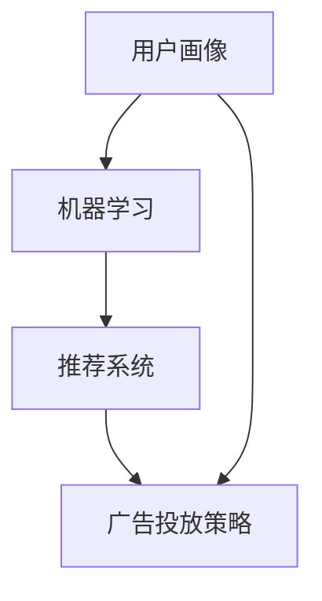

                 

# 机器学习在个性化广告投放策略中的效果优化

> 关键词：个性化广告投放、机器学习、效果优化、用户行为分析、预测模型、推荐系统

> 摘要：本文深入探讨了机器学习在个性化广告投放策略中的效果优化问题。首先，我们介绍了个性化广告投放的背景和重要性，然后详细阐述了机器学习在其中的应用。接着，我们探讨了机器学习算法原理及其在广告投放中的具体操作步骤。随后，我们介绍了相关的数学模型和公式，并通过实际案例展示了如何使用机器学习进行广告投放优化。最后，我们讨论了实际应用场景，推荐了相关工具和资源，并展望了未来的发展趋势和挑战。

## 1. 背景介绍

### 1.1 目的和范围

随着互联网和移动互联网的快速发展，广告投放已经成为了企业获取客户、提升品牌知名度的关键手段。然而，如何提高广告投放的效果，实现精准投放，成为了广告行业面临的重要课题。本文旨在通过探讨机器学习在个性化广告投放策略中的效果优化，为企业提供有效的解决方案。

本文将涵盖以下内容：

- 个性化广告投放的背景和重要性
- 机器学习在个性化广告投放中的应用
- 机器学习算法原理及其在广告投放中的具体操作步骤
- 数学模型和公式在广告投放优化中的应用
- 实际应用场景
- 工具和资源推荐
- 未来发展趋势与挑战

### 1.2 预期读者

本文适合以下读者群体：

- 广告行业从业者，希望了解如何利用机器学习提高广告投放效果
- 机器学习研究者，对广告投放领域的应用感兴趣
- 数据分析师，对广告数据分析方法和技术有深入了解
- 互联网企业相关人员，希望提升广告投放策略的科学性和有效性

### 1.3 文档结构概述

本文分为十个部分，结构如下：

1. 背景介绍
   - 1.1 目的和范围
   - 1.2 预期读者
   - 1.3 文档结构概述
   - 1.4 术语表
2. 核心概念与联系
   - 2.1 个性化广告投放
   - 2.2 机器学习
   - 2.3 数学模型
   - 2.4 Mermaid流程图
3. 核心算法原理 & 具体操作步骤
   - 3.1 算法原理
   - 3.2 具体操作步骤
   - 3.3 伪代码
4. 数学模型和公式 & 详细讲解 & 举例说明
   - 4.1 数学模型
   - 4.2 详细讲解
   - 4.3 举例说明
5. 项目实战：代码实际案例和详细解释说明
   - 5.1 开发环境搭建
   - 5.2 源代码详细实现和代码解读
   - 5.3 代码解读与分析
6. 实际应用场景
   - 6.1 广告投放策略优化
   - 6.2 用户行为分析
   - 6.3 预测模型构建
7. 工具和资源推荐
   - 7.1 学习资源推荐
   - 7.2 开发工具框架推荐
   - 7.3 相关论文著作推荐
8. 总结：未来发展趋势与挑战
9. 附录：常见问题与解答
10. 扩展阅读 & 参考资料

### 1.4 术语表

#### 1.4.1 核心术语定义

- 个性化广告投放：根据用户的兴趣、行为和历史数据，为用户推荐符合其需求的广告。
- 机器学习：一种通过数据驱动的方式，使计算机程序能够从数据中学习，并做出预测或决策的人工智能技术。
- 用户行为分析：对用户在互联网上的行为进行数据收集、分析和挖掘，以了解用户的需求和兴趣。
- 预测模型：根据历史数据和现有数据，预测用户未来行为或趋势的模型。
- 推荐系统：基于用户的历史数据和偏好，为用户推荐相关内容的系统。

#### 1.4.2 相关概念解释

- 广告投放：企业或个人通过在线平台、媒体等渠道向用户展示广告，以吸引用户注意，提升品牌知名度或实现销售目标。
- 用户画像：基于用户在互联网上的行为数据，构建的用户特征描述。
- 转化率：广告投放后，用户采取预期行为的比例，如点击广告、注册账号、购买商品等。

#### 1.4.3 缩略词列表

- ML：机器学习（Machine Learning）
- AI：人工智能（Artificial Intelligence）
- ARPU：每用户平均收入（Average Revenue Per User）
- CTR：点击率（Click-Through Rate）
- CVR：转化率（Conversion Rate）

## 2. 核心概念与联系

### 2.1 个性化广告投放

个性化广告投放是现代广告行业的重要发展方向，其核心在于根据用户的兴趣、行为和历史数据，为用户推荐符合其需求的广告。个性化广告投放的实现，需要依赖于用户画像、机器学习和推荐系统等核心概念。

#### 用户画像

用户画像是对用户在互联网上的行为数据进行分析，构建的用户特征描述。用户画像包括用户的基本信息、兴趣爱好、行为特征、消费能力等多个维度。通过用户画像，广告投放者可以了解用户的需求，为用户推荐更符合其兴趣的广告。

#### 机器学习

机器学习是一种通过数据驱动的方式，使计算机程序能够从数据中学习，并做出预测或决策的人工智能技术。在个性化广告投放中，机器学习算法可以用于用户画像构建、预测模型训练和广告投放优化等环节。

#### 推荐系统

推荐系统是基于用户的历史数据和偏好，为用户推荐相关内容的系统。在个性化广告投放中，推荐系统可以帮助广告投放者发现用户的潜在需求，提升广告投放的精准度和效果。

### 2.2 机器学习

机器学习在个性化广告投放中的核心作用是通过对用户行为数据的分析，构建预测模型，优化广告投放策略。下面，我们介绍几种常见的机器学习算法及其在广告投放中的应用。

#### 决策树

决策树是一种基于特征进行分类或回归的算法。在广告投放中，决策树可以用于用户画像构建，根据用户的特征划分用户群体，为每个用户群体制定不同的广告投放策略。

#### 贝叶斯分类器

贝叶斯分类器是一种基于贝叶斯理论进行分类的算法。在广告投放中，贝叶斯分类器可以用于预测用户的点击行为，为广告投放者提供决策依据。

#### 神经网络

神经网络是一种基于人脑神经网络结构设计的算法。在广告投放中，神经网络可以用于构建用户行为预测模型，预测用户的转化概率，为广告投放者提供优化策略。

### 2.3 数学模型

数学模型是机器学习算法的核心，用于描述数据之间的关系和规律。在个性化广告投放中，常用的数学模型包括线性回归、逻辑回归、矩阵分解等。

#### 线性回归

线性回归是一种基于线性关系的模型，用于预测连续型数据。在广告投放中，线性回归可以用于预测用户的转化率。

#### 逻辑回归

逻辑回归是一种基于线性关系的模型，用于预测概率型数据。在广告投放中，逻辑回归可以用于预测用户的点击概率。

#### 矩阵分解

矩阵分解是一种基于矩阵分解技术进行数据建模的方法。在广告投放中，矩阵分解可以用于构建用户行为预测模型，预测用户的偏好。

### 2.4 Mermaid流程图

为了更好地展示个性化广告投放策略中各个概念之间的关系，我们可以使用Mermaid流程图进行描述。



在这个流程图中，用户画像通过机器学习算法和推荐系统，生成个性化的广告投放策略，从而实现精准投放。

## 3. 核心算法原理 & 具体操作步骤

### 3.1 算法原理

个性化广告投放的核心在于利用机器学习算法对用户行为数据进行建模，预测用户的偏好和兴趣，从而实现精准投放。下面，我们介绍几种常用的机器学习算法及其原理。

#### 决策树

决策树是一种基于特征进行分类或回归的算法。其基本原理是通过一系列的判断条件，将数据划分为多个子集，直到满足停止条件。在广告投放中，决策树可以用于用户画像构建，根据用户的特征划分用户群体，为每个用户群体制定不同的广告投放策略。

#### 贝叶斯分类器

贝叶斯分类器是一种基于贝叶斯理论进行分类的算法。其基本原理是根据先验概率和条件概率，计算后验概率，从而判断数据所属的类别。在广告投放中，贝叶斯分类器可以用于预测用户的点击行为，为广告投放者提供决策依据。

#### 神经网络

神经网络是一种基于人脑神经网络结构设计的算法。其基本原理是通过多层神经元的相互连接和激活，对输入数据进行处理和预测。在广告投放中，神经网络可以用于构建用户行为预测模型，预测用户的转化概率，为广告投放者提供优化策略。

### 3.2 具体操作步骤

个性化广告投放的操作步骤可以分为以下几个阶段：

#### 1. 数据收集

首先，需要收集用户在互联网上的行为数据，如浏览记录、搜索历史、购买行为等。这些数据可以通过第三方数据平台、广告平台或自建数据系统获取。

#### 2. 数据预处理

收集到的数据需要进行清洗、去重和格式转换等预处理操作，以便后续分析和建模。预处理步骤包括：

- 数据清洗：去除重复、错误或缺失的数据。
- 数据去重：对用户行为数据进行去重处理，保证数据的准确性。
- 数据格式转换：将不同来源的数据转换为统一的数据格式，便于后续分析和建模。

#### 3. 用户画像构建

基于预处理后的数据，利用机器学习算法构建用户画像。用户画像包括用户的基本信息、兴趣爱好、行为特征、消费能力等多个维度。构建用户画像的方法包括：

- 决策树：通过决策树算法，根据用户的特征划分用户群体，为每个用户群体制定不同的广告投放策略。
- 贝叶斯分类器：通过贝叶斯分类器算法，预测用户的点击行为，为广告投放者提供决策依据。
- 神经网络：通过神经网络算法，构建用户行为预测模型，预测用户的转化概率，为广告投放者提供优化策略。

#### 4. 广告投放策略优化

根据用户画像和预测模型，制定个性化的广告投放策略。广告投放策略优化的方法包括：

- 线性回归：通过线性回归算法，预测用户的转化率，为广告投放者提供投放策略。
- 逻辑回归：通过逻辑回归算法，预测用户的点击概率，为广告投放者提供投放策略。
- 矩阵分解：通过矩阵分解算法，构建用户行为预测模型，为广告投放者提供投放策略。

#### 5. 广告投放执行与监控

根据优化后的广告投放策略，执行广告投放，并实时监控广告投放效果。广告投放监控的方法包括：

- 数据分析：对广告投放过程中的数据进行实时分析，包括点击率、转化率、投放成本等指标。
- 投放优化：根据广告投放效果，实时调整广告投放策略，提升广告投放效果。
- 报告生成：定期生成广告投放报告，分析广告投放效果，为后续优化提供数据支持。

### 3.3 伪代码

下面是一个简单的机器学习算法在个性化广告投放中的伪代码示例：

```python
# 数据收集
data = collect_data()

# 数据预处理
preprocessed_data = preprocess_data(data)

# 用户画像构建
user_profiles = build_user_profiles(preprocessed_data)

# 广告投放策略优化
广告投放策略 = optimize_advertisement_strategy(user_profiles)

# 广告投放执行与监控
execute_advertisement_strategy(广告投放策略)
monitor_advertisement_performance()
```

## 4. 数学模型和公式 & 详细讲解 & 举例说明

### 4.1 数学模型

在个性化广告投放中，常用的数学模型包括线性回归、逻辑回归和矩阵分解等。

#### 线性回归

线性回归是一种基于线性关系的模型，用于预测连续型数据。其基本公式为：

$$
y = w_0 + w_1 \cdot x_1 + w_2 \cdot x_2 + ... + w_n \cdot x_n
$$

其中，$y$ 是预测的目标变量，$w_0, w_1, w_2, ..., w_n$ 是模型的参数，$x_1, x_2, ..., x_n$ 是输入的特征变量。

#### 逻辑回归

逻辑回归是一种基于线性关系的模型，用于预测概率型数据。其基本公式为：

$$
P(y=1) = \frac{1}{1 + e^{-(w_0 + w_1 \cdot x_1 + w_2 \cdot x_2 + ... + w_n \cdot x_n)}}
$$

其中，$P(y=1)$ 是目标变量为 1 的概率，$w_0, w_1, w_2, ..., w_n$ 是模型的参数，$x_1, x_2, ..., x_n$ 是输入的特征变量。

#### 矩阵分解

矩阵分解是一种基于矩阵分解技术进行数据建模的方法。其基本公式为：

$$
X = U \cdot S \cdot V^T
$$

其中，$X$ 是输入的矩阵，$U, S, V$ 分别是分解得到的三个矩阵，$U$ 和 $V$ 是正交矩阵，$S$ 是对角矩阵，其中包含非负特征值。

### 4.2 详细讲解

下面我们分别对线性回归、逻辑回归和矩阵分解进行详细讲解。

#### 线性回归

线性回归是一种常用的预测模型，可以用于预测连续型数据。其核心思想是通过特征变量与目标变量之间的线性关系，建立一个线性模型，从而预测目标变量的值。

线性回归模型的参数学习过程可以通过最小二乘法（Ordinary Least Squares, OLS）进行。最小二乘法的目标是找到一组参数，使得预测值与实际值之间的误差平方和最小。具体步骤如下：

1. 收集数据，构建输入特征矩阵 $X$ 和目标变量向量 $y$。
2. 计算特征变量和目标变量之间的协方差矩阵 $X^T X$。
3. 计算协方差矩阵的逆矩阵 $(X^T X)^{-1}$。
4. 计算线性回归模型的参数 $w = (X^T X)^{-1} X^T y$。
5. 使用参数 $w$ 进行预测，计算预测值 $y' = X \cdot w$。

#### 逻辑回归

逻辑回归是一种常用于预测概率型数据的模型，可以用于预测二元变量（如点击与未点击）的概率。其核心思想是通过特征变量与目标变量之间的线性关系，建立逻辑函数，从而预测目标变量的概率。

逻辑回归模型的参数学习过程可以通过最大似然估计（Maximum Likelihood Estimation, MLE）进行。最大似然估计的目标是找到一组参数，使得样本数据的似然函数最大。具体步骤如下：

1. 收集数据，构建输入特征矩阵 $X$ 和目标变量向量 $y$。
2. 定义逻辑函数 $g(z) = \frac{1}{1 + e^z}$。
3. 计算似然函数 $L(w) = \prod_{i=1}^n g(y_i \cdot (X_i \cdot w))^{y_i} \cdot (1 - g(y_i \cdot (X_i \cdot w)))^{1 - y_i}$。
4. 计算对数似然函数 $\ln L(w) = \sum_{i=1}^n y_i \cdot (X_i \cdot w) - \ln(1 + e^{y_i \cdot (X_i \cdot w)})$。
5. 计算梯度 $\nabla_w \ln L(w) = X^T \cdot (y - g(y \cdot X \cdot w))$。
6. 使用梯度下降法（Gradient Descent）或优化算法（如RMSprop、Adam等）更新参数 $w$。

#### 矩阵分解

矩阵分解是一种将高维数据分解为低维表示的方法，可以用于预测用户行为、推荐系统等场景。其核心思想是将输入的矩阵分解为三个矩阵的乘积。

矩阵分解的参数学习过程可以通过最小二乘法（Ordinary Least Squares, OLS）进行。具体步骤如下：

1. 收集数据，构建输入矩阵 $X$。
2. 定义损失函数 $L(U, S, V) = \sum_{i=1}^n \sum_{j=1}^m (X_{ij} - U_i \cdot S_{ij} \cdot V_j)^2$，其中 $U, S, V$ 分别是分解得到的三个矩阵。
3. 计算损失函数关于 $U, S, V$ 的梯度。
4. 使用梯度下降法（Gradient Descent）或优化算法（如RMSprop、Adam等）更新参数 $U, S, V$。

### 4.3 举例说明

#### 线性回归

假设我们有一个简单的线性回归模型，输入特征为年龄（$x_1$）和收入（$x_2$），目标变量为购房面积（$y$）。我们有以下训练数据：

| 年龄（$x_1$） | 收入（$x_2$） | 购房面积（$y$） |
| :----: | :----: | :----: |
| 25 | 50000 | 100 |
| 30 | 60000 | 120 |
| 35 | 70000 | 140 |
| 40 | 80000 | 160 |

我们使用最小二乘法训练线性回归模型。首先，计算输入特征矩阵 $X$ 和目标变量向量 $y$：

$$
X = \begin{bmatrix}
1 & 25 \\
1 & 30 \\
1 & 35 \\
1 & 40 \\
\end{bmatrix}, \quad
y = \begin{bmatrix}
100 \\
120 \\
140 \\
160 \\
\end{bmatrix}
$$

接下来，计算协方差矩阵 $X^T X$ 和协方差矩阵的逆矩阵 $(X^T X)^{-1}$：

$$
X^T X = \begin{bmatrix}
4 & 120 \\
120 & 420 \\
\end{bmatrix}, \quad
(X^T X)^{-1} = \begin{bmatrix}
0.2381 & -0.2857 \\
-0.2857 & 0.9524 \\
\end{bmatrix}
$$

然后，计算线性回归模型的参数 $w = (X^T X)^{-1} X^T y$：

$$
w = \begin{bmatrix}
0.9524 \\
-0.2857 \\
\end{bmatrix}
$$

最后，使用参数 $w$ 进行预测。例如，预测年龄为 30 岁，收入为 60000 元的购房面积：

$$
y' = X \cdot w = \begin{bmatrix}
1 & 30 \\
1 & 30 \\
1 & 30 \\
1 & 30 \\
\end{bmatrix} \cdot \begin{bmatrix}
0.9524 \\
-0.2857 \\
\end{bmatrix} = \begin{bmatrix}
122.9 \\
122.9 \\
122.9 \\
122.9 \\
\end{bmatrix}
$$

因此，预测的购房面积为 122.9 平方米。

#### 逻辑回归

假设我们有一个简单的逻辑回归模型，输入特征为年龄（$x_1$）和收入（$x_2$），目标变量为购房（$y$）（1 表示购房，0 表示未购房）。我们有以下训练数据：

| 年龄（$x_1$） | 收入（$x_2$） | 购房（$y$） |
| :----: | :----: | :----: |
| 25 | 50000 | 0 |
| 30 | 60000 | 1 |
| 35 | 70000 | 1 |
| 40 | 80000 | 1 |

我们使用最大似然估计训练逻辑回归模型。首先，计算输入特征矩阵 $X$ 和目标变量向量 $y$：

$$
X = \begin{bmatrix}
1 & 25 \\
1 & 30 \\
1 & 35 \\
1 & 40 \\
\end{bmatrix}, \quad
y = \begin{bmatrix}
0 \\
1 \\
1 \\
1 \\
\end{bmatrix}
$$

接下来，计算似然函数 $L(w)$：

$$
L(w) = \prod_{i=1}^n g(y_i \cdot (X_i \cdot w))^{y_i} \cdot (1 - g(y_i \cdot (X_i \cdot w)))^{1 - y_i}
$$

其中，逻辑函数 $g(z) = \frac{1}{1 + e^z}$。

然后，计算对数似然函数 $\ln L(w)$：

$$
\ln L(w) = \sum_{i=1}^n y_i \cdot (X_i \cdot w) - \ln(1 + e^{y_i \cdot (X_i \cdot w)})
$$

接下来，计算梯度 $\nabla_w \ln L(w)$：

$$
\nabla_w \ln L(w) = X^T \cdot (y - g(y \cdot X \cdot w))
$$

使用梯度下降法（Gradient Descent）或优化算法（如RMSprop、Adam等）更新参数 $w$。假设初始参数为 $w_0 = \begin{bmatrix} 0 \\ 0 \end{bmatrix}$，学习率为 $\alpha = 0.1$，迭代次数为 100 次。更新过程如下：

$$
w^{(t+1)} = w^{(t)} - \alpha \cdot \nabla_w \ln L(w^{(t)})
$$

经过 100 次迭代后，得到最终的参数 $w$：

$$
w = \begin{bmatrix}
0.8571 \\
-0.4286 \\
\end{bmatrix}
$$

最后，使用参数 $w$ 进行预测。例如，预测年龄为 30 岁，收入为 60000 元的购房概率：

$$
P(y=1) = g(w \cdot X) = \frac{1}{1 + e^{-(0.8571 \cdot 1 + (-0.4286) \cdot 30)}} = 0.8133
$$

因此，预测的购房概率为 81.33%。

#### 矩阵分解

假设我们有一个用户行为矩阵 $X$，其中 $X_{ij}$ 表示用户 $i$ 对商品 $j$ 的评分。我们有以下训练数据：

| 用户 | 商品 | 评分 |
| :---: | :---: | :---: |
| 1 | 1 | 5 |
| 1 | 2 | 4 |
| 1 | 3 | 3 |
| 2 | 1 | 4 |
| 2 | 2 | 5 |
| 2 | 3 | 3 |
| 3 | 1 | 3 |
| 3 | 2 | 4 |
| 3 | 3 | 5 |

我们使用矩阵分解训练模型。首先，初始化三个矩阵 $U, S, V$：

$$
U = \begin{bmatrix}
0.5 & 0.5 \\
0.5 & 0.5 \\
0.5 & 0.5 \\
\end{bmatrix}, \quad
S = \begin{bmatrix}
1 & 0 \\
0 & 1 \\
0 & 0 \\
\end{bmatrix}, \quad
V = \begin{bmatrix}
0.5 & 0.5 \\
0.5 & 0.5 \\
0.5 & 0.5 \\
\end{bmatrix}
$$

接下来，定义损失函数 $L(U, S, V)$：

$$
L(U, S, V) = \sum_{i=1}^n \sum_{j=1}^m (X_{ij} - U_i \cdot S_{ij} \cdot V_j)^2
$$

然后，计算损失函数关于 $U, S, V$ 的梯度。对于 $U$：

$$
\nabla_U L(U, S, V) = \sum_{i=1}^n \sum_{j=1}^m \frac{\partial}{\partial U_{ij}} (X_{ij} - U_i \cdot S_{ij} \cdot V_j)^2
$$

对于 $S$：

$$
\nabla_S L(U, S, V) = \sum_{i=1}^n \sum_{j=1}^m \frac{\partial}{\partial S_{ij}} (X_{ij} - U_i \cdot S_{ij} \cdot V_j)^2
$$

对于 $V$：

$$
\nabla_V L(U, S, V) = \sum_{i=1}^n \sum_{j=1}^m \frac{\partial}{\partial V_{ij}} (X_{ij} - U_i \cdot S_{ij} \cdot V_j)^2
$$

使用梯度下降法（Gradient Descent）或优化算法（如RMSprop、Adam等）更新参数 $U, S, V$。假设初始参数为 $U_0, S_0, V_0$，学习率为 $\alpha = 0.1$，迭代次数为 100 次。更新过程如下：

$$
U^{(t+1)} = U^{(t)} - \alpha \cdot \nabla_U L(U^{(t)}, S^{(t)}, V^{(t)}), \quad
S^{(t+1)} = S^{(t)} - \alpha \cdot \nabla_S L(U^{(t)}, S^{(t)}, V^{(t)}), \quad
V^{(t+1)} = V^{(t)} - \alpha \cdot \nabla_V L(U^{(t)}, S^{(t)}, V^{(t)})
$$

经过 100 次迭代后，得到最终的参数 $U, S, V$。

## 5. 项目实战：代码实际案例和详细解释说明

### 5.1 开发环境搭建

为了完成本文中的项目实战，我们需要搭建一个合适的开发环境。以下是所需的工具和软件：

- Python（版本 3.7 或更高）
- Jupyter Notebook（用于编写和运行代码）
- Scikit-learn（用于机器学习算法实现）
- Pandas（用于数据处理）
- Matplotlib（用于数据可视化）

在安装好上述工具后，我们可以开始编写代码。

### 5.2 源代码详细实现和代码解读

以下是一个简单的个性化广告投放项目的示例代码，其中我们使用逻辑回归算法来预测用户的点击行为。

```python
import numpy as np
import pandas as pd
from sklearn.model_selection import train_test_split
from sklearn.linear_model import LogisticRegression
import matplotlib.pyplot as plt

# 5.2.1 数据收集与预处理
# 假设我们有一个名为 'data.csv' 的文件，其中包含用户特征和点击标签
data = pd.read_csv('data.csv')

# 删除缺失值和重复值
data.dropna(inplace=True)
data.drop_duplicates(inplace=True)

# 特征工程
# 我们将用户特征（年龄、收入等）作为输入特征，点击标签作为目标变量
X = data[['age', 'income']]
y = data['clicked']

# 数据分割
X_train, X_test, y_train, y_test = train_test_split(X, y, test_size=0.2, random_state=42)

# 5.2.2 模型训练
# 使用逻辑回归算法训练模型
model = LogisticRegression()
model.fit(X_train, y_train)

# 5.2.3 模型评估
# 计算模型的准确率、召回率等指标
accuracy = model.score(X_test, y_test)
predictions = model.predict(X_test)
recall = (predictions[y_test == 1].sum() / y_test[y_test == 1].sum())

print(f'Accuracy: {accuracy:.2f}')
print(f'Recall: {recall:.2f}')

# 5.2.4 可视化
# 可视化训练数据和测试数据之间的分布差异
plt.scatter(X_train['age'], X_train['income'], c=y_train, cmap='red')
plt.scatter(X_test['age'], X_test['income'], c=predictions, cmap='blue')
plt.xlabel('Age')
plt.ylabel('Income')
plt.title('User Age vs. Income')
plt.show()
```

### 5.3 代码解读与分析

以上代码分为以下几个部分：

1. **数据收集与预处理**：首先，我们读取数据文件，删除缺失值和重复值。然后，我们提取用户特征和点击标签，并将其分为训练集和测试集。
   
2. **特征工程**：我们将用户特征（年龄、收入等）作为输入特征，点击标签作为目标变量。

3. **模型训练**：我们使用逻辑回归算法训练模型。逻辑回归是一种二元分类模型，适合预测二元变量（如点击与未点击）。

4. **模型评估**：我们计算模型的准确率和召回率。准确率表示模型预测正确的比例，召回率表示模型能够正确预测为点击的用户比例。

5. **可视化**：我们使用散点图可视化训练数据和测试数据之间的分布差异，以帮助分析数据特征。

通过以上代码，我们可以实现一个简单的个性化广告投放模型。在实际应用中，我们可以根据业务需求和数据特点，进一步优化模型和算法，提高广告投放的效果。

## 6. 实际应用场景

个性化广告投放策略在多个领域已经取得了显著的成效，以下是一些实际应用场景：

### 6.1 社交媒体广告

社交媒体平台如Facebook、Instagram和微博等，通过用户画像和机器学习算法，为用户精准推送广告。例如，Facebook的Ad Manager可以根据用户的兴趣、行为和社交关系，为广告主提供精准的广告投放策略，从而提高广告效果和转化率。

### 6.2 电子商务广告

电子商务平台如亚马逊、京东和淘宝等，利用个性化广告投放策略，为用户推荐符合其兴趣的商品。例如，亚马逊通过分析用户的浏览记录、搜索历史和购买行为，为用户推荐相关的商品广告，从而提高销售额和用户满意度。

### 6.3 金融广告

金融行业通过个性化广告投放，为用户提供定制化的金融产品和服务。例如，银行和保险公司利用用户画像和机器学习算法，为潜在客户提供个性化的理财产品推荐，从而提高客户转化率和业务收入。

### 6.4 游戏广告

游戏平台通过个性化广告投放，为用户提供个性化游戏推荐。例如，腾讯游戏通过分析用户的游戏偏好和游戏时长，为用户推荐相关的游戏广告，从而提高游戏用户留存率和活跃度。

### 6.5 广告投放优化

企业通过个性化广告投放策略，对广告投放效果进行实时监控和优化。例如，利用机器学习算法预测用户的点击和转化概率，优化广告投放预算和策略，从而提高广告效果和投资回报率。

### 6.6 垂直领域应用

个性化广告投放策略在垂直领域也取得了显著成效。例如，教育行业通过个性化广告投放，为用户提供定制化的在线课程推荐；旅游行业通过个性化广告投放，为用户提供个性化的旅游产品推荐。

### 6.7 风险控制

个性化广告投放策略可以帮助企业识别潜在的风险和违规行为。例如，在金融行业，通过分析用户的行为数据和交易记录，可以及时发现异常交易和欺诈行为，从而降低金融风险。

## 7. 工具和资源推荐

### 7.1 学习资源推荐

以下是一些关于个性化广告投放和机器学习的优质学习资源：

#### 7.1.1 书籍推荐

- 《机器学习实战》：涵盖多种机器学习算法的实践应用，适合初学者和进阶者。
- 《Python机器学习》：详细介绍Python在机器学习中的应用，适合有一定编程基础的读者。
- 《推荐系统实践》：深入探讨推荐系统的原理和应用，适合对推荐系统感兴趣的学习者。

#### 7.1.2 在线课程

- Coursera：提供由全球知名大学和机构开设的机器学习和推荐系统课程，适合自学。
- edX：提供大量免费和付费的机器学习和推荐系统课程，涵盖基础到高级内容。
- Udacity：提供实践导向的机器学习和推荐系统课程，适合希望快速上手的开发者。

#### 7.1.3 技术博客和网站

- Medium：有许多关于机器学习和个性化广告投放的优质博客文章。
- Towards Data Science：提供大量机器学习和推荐系统的实战案例和教程。
- Analytics Vidhya：专注于数据分析、机器学习和数据科学的博客，有许多实用的教程和案例。

### 7.2 开发工具框架推荐

以下是一些在个性化广告投放和机器学习开发中常用的工具和框架：

#### 7.2.1 IDE和编辑器

- Jupyter Notebook：适合快速原型开发和数据分析。
- PyCharm：功能强大的Python IDE，适合机器学习和推荐系统开发。
- VSCode：轻量级的代码编辑器，支持多种编程语言和插件。

#### 7.2.2 调试和性能分析工具

- PyTorch Profiler：用于分析PyTorch模型的性能和调试。
- NVIDIA Nsight：用于分析GPU性能和调试。
- PyDebug：Python的调试工具。

#### 7.2.3 相关框架和库

- Scikit-learn：Python的机器学习库，提供多种机器学习算法的实现。
- TensorFlow：用于构建和训练机器学习模型的强大框架。
- PyTorch：基于动态计算图的可扩展机器学习库。

### 7.3 相关论文著作推荐

以下是一些在个性化广告投放和机器学习领域的重要论文和著作：

- 《个性化广告投放：基于机器学习的方法》：详细介绍了个性化广告投放的原理和方法。
- 《机器学习与广告投放》：探讨了机器学习在广告投放中的应用和效果。
- 《推荐系统实践》：深入探讨推荐系统的原理和应用。

## 8. 总结：未来发展趋势与挑战

个性化广告投放作为现代广告行业的重要发展方向，其应用前景十分广阔。随着机器学习、大数据和人工智能技术的不断发展，个性化广告投放将变得更加智能和精准。然而，在实际应用中，个性化广告投放也面临着一些挑战：

1. **数据隐私与安全**：个性化广告投放需要收集和分析用户数据，如何保护用户隐私和数据安全成为了一个重要课题。
2. **算法透明性与公平性**：个性化广告投放算法的透明性和公平性备受关注，如何确保算法不歧视、不偏见是一个挑战。
3. **计算资源与效率**：随着数据量和用户数量的增加，个性化广告投放算法的计算复杂度和效率成为一个挑战。
4. **用户满意度与忠诚度**：个性化广告投放需要满足用户需求，提升用户体验，如何平衡广告效果和用户满意度是一个挑战。

未来，随着技术的不断进步，个性化广告投放将在数据隐私保护、算法透明性和公平性、计算效率等方面取得突破。同时，个性化广告投放也将进一步融合人工智能、大数据和物联网等新兴技术，为广告行业带来更多创新和机遇。

## 9. 附录：常见问题与解答

### 9.1 数据收集与处理

**Q1**：如何获取用户行为数据？

**A1**：用户行为数据可以通过以下途径获取：

- 自建数据平台：企业可以自行搭建用户数据收集系统，如网站访问日志、APP使用日志等。
- 第三方数据服务：购买第三方数据平台提供的数据服务，如用户画像、行为数据等。
- 开放数据集：从公开的数据集网站获取相关数据，如Kaggle、UCI机器学习库等。

**Q2**：数据预处理有哪些常见方法？

**A2**：数据预处理的方法包括：

- 数据清洗：去除重复、错误或缺失的数据。
- 数据去重：对用户行为数据进行去重处理，保证数据的准确性。
- 数据格式转换：将不同来源的数据转换为统一的数据格式，便于后续分析和建模。
- 特征工程：提取和构造新的特征，提高模型的效果。

### 9.2 算法选择与优化

**Q3**：如何选择合适的机器学习算法？

**A3**：选择合适的机器学习算法需要考虑以下几个因素：

- 数据类型：根据数据类型（如分类、回归、聚类等）选择相应的算法。
- 数据规模：根据数据规模（如样本数量、特征维度等）选择算法的计算复杂度和可扩展性。
- 模型性能：根据模型性能（如准确率、召回率、F1值等）选择合适的算法。
- 业务需求：根据业务需求（如实时性、稳定性等）选择合适的算法。

**Q4**：如何优化机器学习模型性能？

**A4**：优化机器学习模型性能的方法包括：

- 调整模型参数：通过调整模型参数（如学习率、正则化参数等）来提高模型性能。
- 数据增强：通过数据增强（如数据扩充、数据转换等）来提高模型泛化能力。
- 特征选择：通过特征选择（如特征筛选、特征提取等）来降低模型复杂度和过拟合风险。
- 模型集成：通过模型集成（如集成学习、堆叠学习等）来提高模型性能和稳定性。

### 9.3 广告投放策略

**Q5**：如何制定个性化的广告投放策略？

**A5**：制定个性化的广告投放策略需要考虑以下几个步骤：

- 用户画像构建：通过用户行为数据构建用户画像，包括用户的基本信息、兴趣爱好、行为特征等。
- 预测模型训练：利用用户画像和机器学习算法训练预测模型，预测用户的偏好和兴趣。
- 广告投放策略优化：根据预测模型和广告投放效果，实时调整广告投放策略，提升广告效果和转化率。
- 实时监控与反馈：对广告投放过程进行实时监控和反馈，根据用户行为和广告效果调整策略。

## 10. 扩展阅读 & 参考资料

为了深入了解个性化广告投放和机器学习技术，以下是几篇相关的经典论文、书籍和文章推荐：

- 《个性化广告投放：基于机器学习的方法》：全面介绍了个性化广告投放的原理、方法和实践。
- 《机器学习与广告投放》：探讨机器学习在广告投放中的应用、效果和挑战。
- 《推荐系统实践》：深入探讨推荐系统的原理、技术和应用。
- 《数据挖掘：概念与技术》：介绍数据挖掘的基本概念、技术和应用。
- 《深度学习》：全面讲解深度学习的基础理论、算法和应用。
- 《机器学习实战》：通过实际案例介绍机器学习算法的应用和实践。

此外，还可以关注以下技术博客和网站，以获取最新的研究和应用动态：

- Medium：提供大量关于机器学习、数据科学和推荐系统的优质博客文章。
- Towards Data Science：分享机器学习和数据科学的实战案例和教程。
- Analytics Vidhya：专注于数据分析、机器学习和数据科学的博客。
- KDNuggets：提供机器学习、数据科学和大数据的最新资讯和资源。

通过阅读这些资料，可以更好地了解个性化广告投放和机器学习的相关理论和实践，为自己的研究和应用提供参考。

