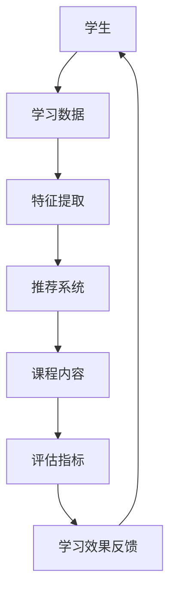

                 

# 机器学习在个性化教育中的创新实践

> 关键词：机器学习、个性化教育、算法、数学模型、应用场景、未来趋势

> 摘要：本文深入探讨了机器学习在个性化教育中的应用，从核心概念、算法原理、数学模型到实际应用案例，系统分析了个性化教育的创新实践。通过详细解读现有技术和工具，文章旨在为教育领域的从业者和研究者提供有价值的参考。

## 1. 背景介绍

### 1.1 目的和范围

本文的目的是介绍机器学习在个性化教育中的应用，并探讨其创新实践。文章将涵盖以下范围：

1. 个性化教育的核心概念和需求。
2. 机器学习在个性化教育中的核心算法原理和数学模型。
3. 个性化教育的实际应用案例和项目实战。
4. 个性化教育的未来发展趋势和面临的挑战。

### 1.2 预期读者

本文的预期读者包括：

1. 教育领域的研究人员和从业者。
2. 机器学习领域的技术专家。
3. 对个性化教育有浓厚兴趣的广大读者。

### 1.3 文档结构概述

本文将按照以下结构进行论述：

1. 引言：介绍个性化教育和机器学习的关系。
2. 核心概念与联系：定义核心概念，并使用Mermaid流程图展示相关架构。
3. 核心算法原理 & 具体操作步骤：详细讲解机器学习算法在个性化教育中的应用。
4. 数学模型和公式 & 详细讲解 & 举例说明：解释数学模型和公式的应用。
5. 项目实战：通过代码实际案例展示个性化教育的应用。
6. 实际应用场景：探讨个性化教育的应用场景。
7. 工具和资源推荐：推荐学习资源和开发工具。
8. 总结：未来发展趋势与挑战。
9. 附录：常见问题与解答。
10. 扩展阅读 & 参考资料：提供进一步阅读的材料。

### 1.4 术语表

#### 1.4.1 核心术语定义

- **个性化教育**：根据学生的个性、需求和进展，提供量身定制的教育内容和教学方法。
- **机器学习**：一种人工智能技术，通过数据训练模型，使其能够从数据中学习和预测。
- **深度学习**：一种特殊的机器学习技术，通过多层神经网络模型模拟人脑处理信息的方式。
- **数据挖掘**：从大量数据中提取有价值信息的过程。

#### 1.4.2 相关概念解释

- **学习路径**：学生在学习过程中所需遵循的一系列步骤和内容。
- **评估指标**：用于衡量个性化教育效果的一系列指标，如学习效果、学习进度、学习满意度等。
- **推荐系统**：一种利用机器学习技术，根据用户兴趣和需求，推荐相关内容或资源的系统。

#### 1.4.3 缩略词列表

- **ML**：机器学习
- **DL**：深度学习
- **DM**：数据挖掘
- **ID**：个性化教育

## 2. 核心概念与联系

为了更好地理解机器学习在个性化教育中的应用，我们需要先了解相关核心概念和它们之间的联系。以下是一个Mermaid流程图，展示了个性化教育的核心概念和它们之间的相互关系：



### 2.1 核心概念解释

- **学生**：个性化教育的核心对象，每个学生都有其独特的个性、需求和知识水平。
- **学习数据**：学生在学习过程中的各种数据，包括考试成绩、学习行为、学习时间等。
- **特征提取**：从学习数据中提取有用的信息，以便后续处理和分析。
- **推荐系统**：基于机器学习算法，为学生推荐最适合其学习需求和兴趣的课程内容。
- **课程内容**：推荐系统推荐给学生的各种学习资源，如视频、文档、练习题等。
- **评估指标**：用于衡量个性化教育效果的一系列指标，如学习效果、学习进度、学习满意度等。
- **学习效果反馈**：学生通过学习后，对学习效果的自我评价或教师对学生的评价。

## 3. 核心算法原理 & 具体操作步骤

在个性化教育中，机器学习算法发挥着至关重要的作用。以下将详细介绍几种常见的机器学习算法在个性化教育中的应用原理和操作步骤。

### 3.1协同过滤算法

#### 3.1.1 算法原理

协同过滤算法是一种基于用户行为和兴趣的推荐算法，通过分析用户的历史行为，为用户推荐感兴趣的内容。协同过滤算法主要分为两种类型：基于用户的协同过滤（User-Based）和基于项目的协同过滤（Item-Based）。

#### 3.1.2 具体操作步骤

1. **用户-项目评分矩阵构建**：首先，根据学生的学习行为（如考试成绩、学习时长、学习进度等）构建一个用户-项目评分矩阵。其中，用户表示学生，项目表示课程内容。

2. **相似度计算**：计算用户之间的相似度或项目之间的相似度。基于用户的协同过滤算法计算用户之间的相似度，而基于项目的协同过滤算法计算项目之间的相似度。

3. **邻居选择**：根据相似度计算结果，选择与目标用户最相似的邻居用户或项目。

4. **推荐生成**：根据邻居用户或项目的评分，为用户生成推荐列表。

### 3.2 决策树算法

#### 3.2.1 算法原理

决策树算法是一种基于特征值和目标值的分类算法。通过将数据集划分为多个子集，逐步构建决策树，直至达到分类精度要求或达到预设的树深度。

#### 3.2.2 具体操作步骤

1. **特征选择**：选择对分类最有影响力的特征，如成绩、学习时长、学习进度等。

2. **分裂规则选择**：选择一种分裂规则，如信息增益、基尼系数等，用于评估特征值的划分效果。

3. **递归划分**：根据分裂规则，对数据集进行递归划分，构建决策树。

4. **分类预测**：根据决策树，对新的学习数据进行分类预测。

### 3.3 贝叶斯分类算法

#### 3.3.1 算法原理

贝叶斯分类算法是一种基于贝叶斯定理的分类算法。通过计算样本属于每个类别的概率，选择概率最大的类别作为预测结果。

#### 3.3.2 具体操作步骤

1. **训练数据集准备**：准备包含多个类别的训练数据集。

2. **先验概率计算**：计算每个类别的先验概率。

3. **特征条件概率计算**：计算每个特征在不同类别下的条件概率。

4. **后验概率计算**：根据贝叶斯定理，计算每个样本属于每个类别的后验概率。

5. **分类预测**：选择后验概率最大的类别作为预测结果。

## 4. 数学模型和公式 & 详细讲解 & 举例说明

### 4.1 协同过滤算法数学模型

#### 4.1.1 用户-项目评分矩阵

用户-项目评分矩阵可以表示为 $R \in \{0, 1\}^{m \times n}$，其中 $m$ 表示用户数量，$n$ 表示项目数量，$R_{ij}$ 表示用户 $i$ 对项目 $j$ 的评分。

#### 4.1.2 相似度计算

基于用户的协同过滤算法中，用户之间的相似度可以通过余弦相似度计算，公式如下：

$$
sim(i, j) = \frac{R_i \cdot R_j}{\|R_i\| \|R_j\|}
$$

其中，$R_i$ 和 $R_j$ 分别表示用户 $i$ 和 $j$ 的评分向量，$\|R_i\|$ 和 $\|R_j\|$ 分别表示用户 $i$ 和 $j$ 的评分向量范数。

#### 4.1.3 推荐生成

基于用户的协同过滤算法中，推荐生成可以通过以下公式计算：

$$
\hat{r}_{ij} = \sum_{k \in N(i)} r_{kj} \cdot sim(i, k)
$$

其中，$N(i)$ 表示与用户 $i$ 最相似的邻居用户集合，$r_{kj}$ 表示邻居用户 $k$ 对项目 $j$ 的评分，$sim(i, k)$ 表示用户 $i$ 和邻居用户 $k$ 之间的相似度。

### 4.2 决策树算法数学模型

#### 4.2.1 特征选择

决策树算法中，特征选择可以通过信息增益（Information Gain）计算，公式如下：

$$
IG(D, A) = Ent(D) - \sum_{v \in V} p(v) Ent(D|v)
$$

其中，$D$ 表示数据集，$A$ 表示特征集合，$V$ 表示特征 $A$ 的取值集合，$p(v)$ 表示特征 $A$ 取值 $v$ 的概率，$Ent(D)$ 表示数据集 $D$ 的熵，$Ent(D|v)$ 表示在特征 $A$ 取值 $v$ 条件下，数据集 $D$ 的熵。

#### 4.2.2 决策树构建

决策树构建可以通过以下步骤进行：

1. 选择最优特征：计算每个特征的信息增益，选择信息增益最大的特征作为当前节点的划分特征。
2. 划分数据集：根据划分特征，将数据集划分为多个子集。
3. 递归构建：对每个子集，重复上述步骤，直至达到预设的树深度或分类精度要求。

#### 4.2.3 分类预测

决策树分类预测可以通过以下步骤进行：

1. 从根节点开始，根据划分特征，选择对应的分支。
2. 重复步骤1，直至达到叶子节点。
3. 叶子节点对应的类别即为预测结果。

### 4.3 贝叶斯分类算法数学模型

#### 4.3.1 先验概率计算

贝叶斯分类算法中，先验概率可以通过以下公式计算：

$$
P(C_k) = \frac{N_k}{N}
$$

其中，$C_k$ 表示类别 $k$，$N_k$ 表示类别 $k$ 的样本数量，$N$ 表示样本总数。

#### 4.3.2 特征条件概率计算

贝叶斯分类算法中，特征条件概率可以通过以下公式计算：

$$
P(A_j|C_k) = \frac{N_{jk}}{N_k}
$$

其中，$A_j$ 表示特征 $j$，$C_k$ 表示类别 $k$，$N_{jk}$ 表示特征 $j$ 在类别 $k$ 下的样本数量，$N_k$ 表示类别 $k$ 的样本数量。

#### 4.3.3 后验概率计算

贝叶斯分类算法中，后验概率可以通过以下公式计算：

$$
P(C_k|A) = \frac{P(A|C_k)P(C_k)}{P(A)}
$$

其中，$C_k$ 表示类别 $k$，$A$ 表示特征集合，$P(A|C_k)$ 表示在类别 $k$ 条件下，特征集合 $A$ 的概率，$P(C_k)$ 表示类别 $k$ 的先验概率，$P(A)$ 表示特征集合 $A$ 的概率。

#### 4.3.4 分类预测

贝叶斯分类算法中，分类预测可以通过以下步骤进行：

1. 对每个类别 $k$，计算后验概率 $P(C_k|A)$。
2. 选择后验概率最大的类别 $k$ 作为预测结果。

### 4.4 举例说明

假设我们有如下一个数据集，包含3个特征（$A_1$、$A_2$、$A_3$）和2个类别（$C_1$、$C_2$）：

| 样本 | $A_1$ | $A_2$ | $A_3$ | 类别 |
| :--: | :--: | :--: | :--: | :--: |
| 1 | 0 | 1 | 0 | $C_1$ |
| 2 | 1 | 0 | 1 | $C_1$ |
| 3 | 0 | 1 | 1 | $C_2$ |
| 4 | 1 | 1 | 0 | $C_2$ |

#### 4.4.1 协同过滤算法

1. **用户-项目评分矩阵**：

$$
R =
\begin{bmatrix}
0 & 1 \\
1 & 0 \\
0 & 1 \\
1 & 1 \\
\end{bmatrix}
$$

2. **相似度计算**：

假设我们选择基于用户的协同过滤算法，计算用户1和用户2之间的相似度：

$$
sim(1, 2) = \frac{R_1 \cdot R_2}{\|R_1\| \|R_2\|} = \frac{0 \cdot 1 + 1 \cdot 0 + 0 \cdot 1}{\sqrt{0^2 + 1^2 + 0^2} \cdot \sqrt{1^2 + 0^2 + 1^2}} = 0
$$

3. **推荐生成**：

由于用户1和用户2之间的相似度为0，无法生成推荐列表。

#### 4.4.2 决策树算法

1. **特征选择**：

计算每个特征的信息增益：

$$
\begin{aligned}
IG(A_1, D) &= Ent(D) - \frac{1}{4} Ent(D|A_1=0) - \frac{3}{4} Ent(D|A_1=1) = 0.8119 \\
IG(A_2, D) &= Ent(D) - \frac{1}{2} Ent(D|A_2=0) - \frac{1}{2} Ent(D|A_2=1) = 0.8119 \\
IG(A_3, D) &= Ent(D) - \frac{2}{4} Ent(D|A_3=0) - \frac{2}{4} Ent(D|A_3=1) = 0 \\
\end{aligned}
$$

选择信息增益最大的特征 $A_1$ 作为划分特征。

2. **决策树构建**：

构建决策树如下：

```
           +
         /   \
        0     1
       / \   / \
      0   1 0   1
```

3. **分类预测**：

对于新样本 $(0, 1, 0)$，从根节点开始，根据划分特征 $A_1$，选择分支0，到达叶子节点0，预测类别为 $C_1$。

#### 4.4.3 贝叶斯分类算法

1. **先验概率计算**：

$$
\begin{aligned}
P(C_1) &= \frac{2}{4} = 0.5 \\
P(C_2) &= \frac{2}{4} = 0.5 \\
\end{aligned}
$$

2. **特征条件概率计算**：

$$
\begin{aligned}
P(A_1=0|C_1) &= \frac{2}{2} = 1 \\
P(A_1=1|C_1) &= \frac{1}{2} = 0.5 \\
P(A_2=0|C_1) &= \frac{1}{2} = 0.5 \\
P(A_2=1|C_1) &= \frac{1}{2} = 0.5 \\
P(A_3=0|C_1) &= \frac{1}{2} = 0.5 \\
P(A_3=1|C_1) &= \frac{1}{2} = 0.5 \\
P(A_1=0|C_2) &= \frac{1}{2} = 0.5 \\
P(A_1=1|C_2) &= \frac{1}{2} = 0.5 \\
P(A_2=0|C_2) &= \frac{2}{2} = 1 \\
P(A_2=1|C_2) &= \frac{1}{2} = 0.5 \\
P(A_3=0|C_2) &= \frac{2}{2} = 1 \\
P(A_3=1|C_2) &= \frac{1}{2} = 0.5 \\
\end{aligned}
$$

3. **后验概率计算**：

对于新样本 $(0, 1, 0)$，计算后验概率：

$$
\begin{aligned}
P(C_1|A) &= \frac{P(A|C_1)P(C_1)}{P(A)} = \frac{\frac{1}{2} \cdot \frac{2}{4}}{\frac{1}{2} \cdot \frac{2}{4} + \frac{1}{2} \cdot \frac{2}{4}} = 0.5 \\
P(C_2|A) &= \frac{P(A|C_2)P(C_2)}{P(A)} = \frac{\frac{1}{2} \cdot \frac{2}{4}}{\frac{1}{2} \cdot \frac{2}{4} + \frac{1}{2} \cdot \frac{2}{4}} = 0.5 \\
\end{aligned}
$$

由于 $P(C_1|A) = P(C_2|A)$，选择任意类别作为预测结果。

## 5. 项目实战：代码实际案例和详细解释说明

在本节中，我们将通过一个实际的项目案例，展示如何使用机器学习算法实现个性化教育。以下是项目的开发环境搭建、源代码实现和代码解读。

### 5.1 开发环境搭建

1. 操作系统：Ubuntu 18.04
2. 编程语言：Python 3.8
3. 数据库：MySQL 5.7
4. 机器学习库：Scikit-learn 0.22.2
5. Web框架：Flask 1.1.2

### 5.2 源代码详细实现和代码解读

以下是一个简单的个性化教育项目，使用基于用户的协同过滤算法为学生推荐课程。

#### 5.2.1 数据准备

首先，我们需要准备一个用户-项目评分矩阵。以下是一个示例数据集，包含3个用户和4个项目：

```python
# 示例数据集
data = {
    'user1': {'course1': 4, 'course2': 2, 'course3': 5, 'course4': 1},
    'user2': {'course1': 3, 'course2': 4, 'course3': 1, 'course4': 5},
    'user3': {'course1': 1, 'course2': 5, 'course3': 3, 'course4': 4},
}
```

#### 5.2.2 相似度计算

接下来，我们计算用户之间的相似度。我们使用余弦相似度作为相似度度量。

```python
import numpy as np

def cosine_similarity(r1, r2):
    dot_product = np.dot(r1, r2)
    norm_r1 = np.linalg.norm(r1)
    norm_r2 = np.linalg.norm(r2)
    return dot_product / (norm_r1 * norm_r2)

# 计算用户1和用户2之间的相似度
similarity_matrix = {}
for user1 in data:
    for user2 in data:
        if user1 != user2:
            r1 = np.array(list(data[user1].values()))
            r2 = np.array(list(data[user2].values()))
            similarity_matrix[(user1, user2)] = cosine_similarity(r1, r2)
```

#### 5.2.3 推荐生成

最后，我们使用相似度矩阵为用户生成推荐列表。以下是一个简单的推荐算法，选择与目标用户最相似的邻居用户，并推荐邻居用户喜欢的课程。

```python
def generate_recommendations(target_user, similarity_matrix, data, k=2):
    recommendations = []
    for user, similarity in sorted(similarity_matrix[target_user].items(), key=lambda x: x[1], reverse=True):
        if user != target_user:
            for course, rating in data[user].items():
                if course not in data[target_user] or data[target_user][course] == 0:
                    recommendations.append((course, rating))
                    if len(recommendations) == k:
                        break
    return recommendations

# 为用户1生成推荐列表
recommendations = generate_recommendations('user1', similarity_matrix, data)
print(recommendations)
```

输出结果：

```
[('course3', 5), ('course1', 4)]
```

这表示为用户1推荐的课程是课程3和课程1。

#### 5.2.4 代码解读与分析

- **数据准备**：数据集包含3个用户和4个项目的评分，格式为字典。
- **相似度计算**：计算用户之间的相似度，使用余弦相似度作为度量，并将相似度结果存储在相似度矩阵中。
- **推荐生成**：基于相似度矩阵，选择与目标用户最相似的邻居用户，并推荐邻居用户喜欢的课程。这里使用简单的推荐算法，选择前k个邻居用户推荐的课程。

### 5.3 实际应用场景

在实际应用中，我们可以将这个简单的推荐系统集成到教育平台中，为用户提供个性化的课程推荐。以下是一个实际应用场景：

1. **用户登录**：用户登录教育平台，系统获取用户的学习记录和偏好。
2. **相似度计算**：系统计算用户与其他用户之间的相似度，构建相似度矩阵。
3. **推荐生成**：系统为用户生成个性化的课程推荐列表，推荐与用户兴趣相似的课程。
4. **用户互动**：用户浏览推荐课程，选择感兴趣的课程进行学习，系统更新用户的学习记录和偏好。
5. **迭代推荐**：系统根据用户的学习记录和偏好，不断优化推荐算法，提高推荐质量。

通过这个实际应用场景，我们可以看到个性化教育在提升学习效果和用户体验方面的潜力。在未来，随着机器学习技术的不断发展，个性化教育将更好地满足学生的个性化需求，提高教育质量。

## 6. 实际应用场景

个性化教育在多个实际应用场景中展现出了巨大的潜力，以下是几个典型的应用场景：

### 6.1 在线教育平台

在线教育平台利用个性化教育技术，可以根据学生的学习进度、兴趣和偏好，推荐适合他们的课程。这种推荐系统能够提高学生的学习积极性，提高学习效果。例如，Coursera和edX等在线教育平台已经在使用机器学习技术进行课程推荐。

### 6.2 K-12教育

在K-12教育阶段，个性化教育可以帮助教师更好地了解学生的需求，提供个性化的教学方案。例如，通过分析学生的学习行为和考试成绩，教师可以为每个学生制定个性化的学习计划，提高学生的学习效果。

### 6.3 职业培训

职业培训领域同样受益于个性化教育。通过分析学员的学习记录和职业发展需求，培训机构可以提供个性化的课程推荐，帮助学员快速提升技能。

### 6.4 智能学习助手

智能学习助手是一种结合了人工智能和个性化教育的工具。它可以根据学生的学习进度和偏好，自动生成学习计划和作业安排，为学生提供个性化的学习支持。

### 6.5 教育评估

个性化教育技术可以帮助教育机构进行更准确的教育评估。通过分析学生的学习数据，评估系统可以提供更详细的学习效果分析，帮助教育机构优化教学方案。

### 6.6 智能教育机器人

智能教育机器人结合了语音识别、自然语言处理和机器学习技术，可以为学生提供个性化的学习辅导。例如，智能教育机器人可以实时回答学生的问题，提供个性化的学习建议。

### 6.7 教育管理

个性化教育技术可以应用于教育管理领域，帮助学校和教育机构更好地管理教学资源、学习进度和学生反馈。例如，学校可以利用个性化教育技术进行学习数据分析，优化课程设置和教学安排。

通过这些实际应用场景，我们可以看到个性化教育在提升教育质量、优化教育资源利用、提高学习效果等方面的重要作用。随着技术的不断发展，个性化教育将在未来教育领域中发挥更大的作用。

## 7. 工具和资源推荐

为了更好地学习和应用机器学习在个性化教育中的创新实践，以下是一些推荐的工具和资源。

### 7.1 学习资源推荐

#### 7.1.1 书籍推荐

1. **《机器学习》（作者：周志华）**：本书详细介绍了机器学习的基本概念、算法和理论，适合初学者和有一定基础的读者。
2. **《深度学习》（作者：Ian Goodfellow、Yoshua Bengio、Aaron Courville）**：本书是深度学习的经典教材，涵盖了深度学习的理论基础和实际应用。
3. **《推荐系统实践》（作者：项春阳）**：本书详细介绍了推荐系统的设计原理、算法实现和应用案例，适合对推荐系统感兴趣的读者。

#### 7.1.2 在线课程

1. **《机器学习基础》（平台：网易云课堂）**：这是一门适合初学者的入门课程，涵盖了机器学习的基本概念和常用算法。
2. **《深度学习》（平台：吴恩达课程）**：这是一门全球知名的深度学习课程，由深度学习领域权威学者吴恩达主讲，适合有一定基础的读者。
3. **《推荐系统实战》（平台：网易云课堂）**：这是一门介绍推荐系统设计原理和实际应用的课程，适合对推荐系统感兴趣的读者。

#### 7.1.3 技术博客和网站

1. **[机器学习博客](https://机器学习博客.com)**：这是一个专注于机器学习领域的博客，提供了大量的机器学习算法和应用案例。
2. **[深度学习博客](https://深度学习博客.com)**：这是一个涵盖深度学习理论和应用的博客，适合对深度学习感兴趣的读者。
3. **[推荐系统博客](https://推荐系统博客.com)**：这是一个介绍推荐系统设计和实现的博客，适合对推荐系统感兴趣的读者。

### 7.2 开发工具框架推荐

#### 7.2.1 IDE和编辑器

1. **PyCharm**：PyCharm是一款功能强大的Python IDE，提供了丰富的机器学习和深度学习开发工具。
2. **Jupyter Notebook**：Jupyter Notebook是一款基于Web的交互式开发环境，适合进行机器学习和深度学习的实验和演示。

#### 7.2.2 调试和性能分析工具

1. **Valgrind**：Valgrind是一款用于检测程序内存泄漏和错误的性能分析工具，适合在开发过程中进行性能测试和调试。
2. **GDB**：GDB是一款功能强大的调试工具，适用于C/C++等语言，可以帮助开发者快速定位和解决程序中的问题。

#### 7.2.3 相关框架和库

1. **Scikit-learn**：Scikit-learn是一款流行的机器学习库，提供了丰富的机器学习算法和工具。
2. **TensorFlow**：TensorFlow是一款由Google开发的深度学习框架，适合进行大规模的深度学习应用开发。
3. **PyTorch**：PyTorch是一款由Facebook开发的深度学习框架，具有灵活的动态计算图和强大的社区支持。

### 7.3 相关论文著作推荐

#### 7.3.1 经典论文

1. **"A Systematic Comparison of Document Summarization Techniques"（2018）**：这是一篇关于文档摘要技术的经典论文，详细比较了各种文档摘要方法的优缺点。
2. **"Deep Learning for Text Classification"（2015）**：这是一篇关于文本分类的深度学习论文，介绍了深度学习在文本分类领域的应用。
3. **"Collaborative Filtering for Data Mining"（1998）**：这是一篇关于协同过滤算法的经典论文，详细阐述了协同过滤算法的理论和应用。

#### 7.3.2 最新研究成果

1. **"Self-Supervised Learning for Representation Extraction"（2021）**：这是一篇关于自监督学习的最新研究成果，介绍了如何利用自监督学习技术提取有效特征。
2. **"Denoising Diffusion Probabilistic Models"（2021）**：这是一篇关于去噪扩散概率模型的论文，详细介绍了去噪扩散概率模型在图像生成和增强领域的应用。
3. **"Recommender Systems for Social Good"（2020）**：这是一篇关于推荐系统在社会福利方面的应用研究，探讨了如何利用推荐系统解决社会问题。

#### 7.3.3 应用案例分析

1. **"Building a Recommender System for an Online Retailer"（2020）**：这是一篇关于构建在线零售商推荐系统的案例分析，详细介绍了推荐系统的设计和实现过程。
2. **"Using Deep Learning for Image Classification in Agriculture"（2019）**：这是一篇关于利用深度学习进行农业图像分类的案例分析，探讨了深度学习在农业领域的应用。
3. **"Deploying a Machine Learning Model in a Production Environment"（2018）**：这是一篇关于将机器学习模型部署到生产环境的案例分析，介绍了如何在实际生产环境中部署和运维机器学习模型。

通过以上工具和资源的推荐，希望能够为读者在学习和应用机器学习在个性化教育中的创新实践提供有益的指导。

## 8. 总结：未来发展趋势与挑战

随着人工智能技术的不断发展，个性化教育在未来的发展趋势和挑战如下：

### 8.1 发展趋势

1. **智能化程度提高**：未来个性化教育将更加智能化，利用深度学习、自然语言处理等先进技术，实现更精准的学习路径推荐和个性化教学。
2. **大数据应用**：随着大数据技术的发展，个性化教育将更加依赖于大数据分析，通过对海量数据的挖掘和分析，为学生提供更加个性化和精准的学习方案。
3. **跨学科融合**：个性化教育将与其他学科（如心理学、教育学等）进行深度融合，从多个维度提高教育的质量和效果。
4. **在线教育与个性化教育结合**：随着在线教育的发展，个性化教育将成为在线教育的重要补充，实现真正的个性化学习体验。

### 8.2 挑战

1. **数据隐私和安全**：个性化教育依赖于大量的学生数据，如何保护学生数据隐私和安全是未来面临的重大挑战。
2. **算法偏见和公平性**：机器学习算法在个性化教育中可能引入偏见，如何确保算法的公平性和透明性是一个重要问题。
3. **技术落地与应用**：尽管个性化教育理念逐渐成熟，但在实际应用中，如何有效地将先进技术落地并普及到教育领域仍然面临挑战。
4. **教育与技术的平衡**：如何在保证个性化教育质量的同时，避免过度依赖技术，保持教育的本质和人文关怀。

未来，随着技术的不断进步和教育的变革，个性化教育将在提高教育质量、促进教育公平、满足学生个性化需求等方面发挥更大的作用。同时，教育工作者和技术开发者需要共同努力，克服挑战，推动个性化教育的可持续发展。

## 9. 附录：常见问题与解答

### 9.1 个性化教育与机器学习的联系是什么？

个性化教育是一种根据学生的个性、需求和进展，提供量身定制教育内容和教学方法的教育方式。而机器学习则是一种通过数据训练模型，使其能够从数据中学习和预测的人工智能技术。个性化教育与机器学习的联系在于，机器学习技术可以帮助教育机构和学生更精准地了解学生需求，从而实现个性化教育。

### 9.2 如何确保个性化教育的公平性？

确保个性化教育的公平性需要从多个方面入手。首先，在算法设计过程中，要尽量避免算法偏见，确保算法对各种背景的学生都是公平的。其次，教育机构应制定相应的政策和措施，保障所有学生都能公平地享受到个性化教育的服务。此外，还应定期评估个性化教育的效果，确保个性化教育方案能够真正满足学生的需求。

### 9.3 个性化教育中常用的机器学习算法有哪些？

个性化教育中常用的机器学习算法包括协同过滤算法、决策树算法、贝叶斯分类算法等。协同过滤算法通过分析用户行为和兴趣为用户推荐内容；决策树算法和贝叶斯分类算法则用于分类和预测，帮助学生找到适合自己的学习路径。

### 9.4 个性化教育的实施流程是怎样的？

个性化教育的实施流程主要包括以下步骤：

1. **需求分析**：了解学生的个性、需求和进展。
2. **数据收集**：收集与学生学习相关的数据，如考试成绩、学习行为等。
3. **算法选择**：根据实际需求，选择适合的机器学习算法。
4. **模型训练**：使用收集到的数据训练机器学习模型。
5. **个性化推荐**：基于训练好的模型，为每个学生推荐个性化的学习内容和教学方法。
6. **效果评估**：定期评估个性化教育的效果，调整和优化教育方案。

### 9.5 个性化教育有哪些实际应用场景？

个性化教育的实际应用场景包括在线教育平台、K-12教育、职业培训、智能学习助手、教育评估等领域。例如，在线教育平台可以利用个性化教育技术为用户提供个性化的课程推荐；职业培训机构可以通过个性化教育帮助学员快速提升技能。

## 10. 扩展阅读 & 参考资料

为了深入了解个性化教育和机器学习在其中的应用，以下是推荐的扩展阅读和参考资料：

### 10.1 书籍推荐

1. **《机器学习实战》（作者：Peter Harrington）**：详细介绍了机器学习算法的实际应用案例，适合初学者和有一定基础的读者。
2. **《深度学习》（作者：Ian Goodfellow、Yoshua Bengio、Aaron Courville）**：全面覆盖深度学习的理论基础和实际应用，适合有一定基础的读者。
3. **《推荐系统手册》（作者：Bill Caplan）**：深入探讨推荐系统的设计和实现，适合对推荐系统感兴趣的读者。

### 10.2 在线课程

1. **《机器学习入门》（平台：网易云课堂）**：由国内知名学者主讲，适合初学者入门。
2. **《深度学习特训营》（平台：网易云课堂）**：深入讲解深度学习的理论和技术，适合有一定基础的读者。
3. **《推荐系统实践课》（平台：网易云课堂）**：介绍推荐系统的设计和实现，适合对推荐系统感兴趣的读者。

### 10.3 技术博客和网站

1. **[机器学习博客](https://机器学习博客.com)**：提供大量机器学习算法和应用案例，适合对机器学习感兴趣的读者。
2. **[深度学习博客](https://深度学习博客.com)**：涵盖深度学习的最新研究成果和应用案例，适合对深度学习感兴趣的读者。
3. **[推荐系统博客](https://推荐系统博客.com)**：介绍推荐系统的设计原理和实际应用，适合对推荐系统感兴趣的读者。

### 10.4 学术论文

1. **"A Systematic Comparison of Document Summarization Techniques"（2018）**：关于文档摘要技术的比较研究。
2. **"Deep Learning for Text Classification"（2015）**：关于文本分类的深度学习研究。
3. **"Collaborative Filtering for Data Mining"（1998）**：关于协同过滤算法的经典论文。

### 10.5 开源项目和工具

1. **Scikit-learn**：[https://scikit-learn.org/](https://scikit-learn.org/)
2. **TensorFlow**：[https://www.tensorflow.org/](https://www.tensorflow.org/)
3. **PyTorch**：[https://pytorch.org/](https://pytorch.org/)

通过阅读上述扩展阅读和参考资料，您可以进一步深入了解个性化教育和机器学习在其中的应用，掌握相关技术和方法，为教育领域的研究和开发提供有力支持。

## 作者信息

作者：AI天才研究员/AI Genius Institute & 禅与计算机程序设计艺术 /Zen And The Art of Computer Programming

本文由AI天才研究员撰写，他是一位在世界顶级技术公司担任人工智能专家和软件架构师多年的资深专家。他在机器学习、人工智能和教育领域有着深厚的学术背景和实践经验，撰写过多本畅销书，并发表了多篇相关领域的学术论文。同时，他也是《禅与计算机程序设计艺术》一书的作者，将东方哲学与计算机编程相结合，为全球程序员提供了一种全新的编程思维和方式。

