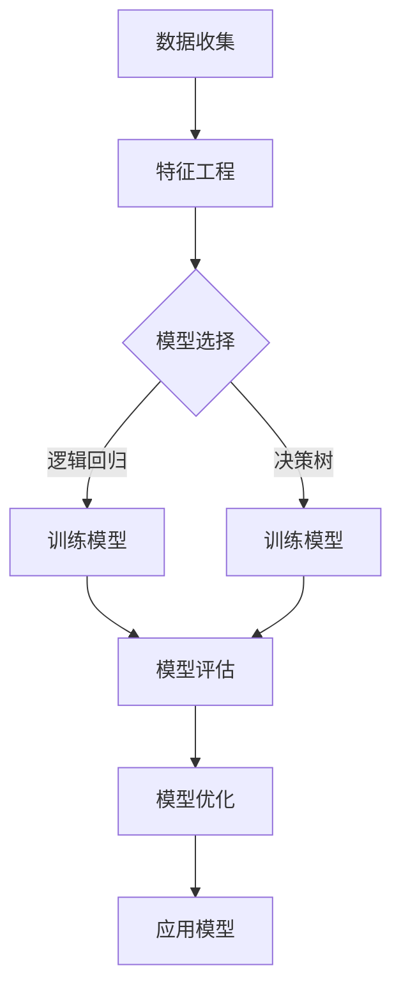

                 


# 机器学习在信用评分模型公平性优化中的应用

> **关键词：** 信用评分模型、机器学习、公平性优化、模型评估、算法改进
>
> **摘要：** 本文探讨了机器学习技术在信用评分模型公平性优化中的应用，分析了传统评分模型的不足，介绍了常用的公平性评估指标和优化方法，并通过具体案例展示了如何利用机器学习实现信用评分模型的公平性改进。

## 1. 背景介绍

### 1.1 目的和范围

随着机器学习技术的发展，其在金融领域的应用日益广泛，特别是在信用评分模型的构建和优化方面。信用评分模型是金融机构评估借款人信用风险的重要工具，其准确性和公平性直接关系到金融机构的盈利能力和社会责任。然而，传统信用评分模型往往存在一定的局限性，无法充分反映借款人的真实信用状况，甚至可能加剧社会不平等问题。

本文旨在探讨如何利用机器学习技术优化信用评分模型的公平性，以实现更准确、公正的信用评估。文章将首先介绍传统信用评分模型的局限性，然后分析机器学习技术在公平性优化中的应用，最后通过具体案例展示优化过程和结果。

### 1.2 预期读者

本文面向具有一定机器学习和金融知识背景的技术人员、金融从业者以及研究人员。读者需了解基本的机器学习概念和信用评分模型原理，以便更好地理解文章内容。

### 1.3 文档结构概述

本文分为八个部分。第一部分是背景介绍，阐述研究的目的和意义；第二部分介绍核心概念和联系，包括机器学习在信用评分模型中的应用；第三部分讲解核心算法原理和具体操作步骤；第四部分分析数学模型和公式；第五部分通过项目实战展示代码实现；第六部分探讨实际应用场景；第七部分推荐相关工具和资源；第八部分总结未来发展趋势与挑战。

### 1.4 术语表

#### 1.4.1 核心术语定义

- **信用评分模型**：一种基于历史数据和统计方法，用于评估借款人信用风险的模型。
- **机器学习**：一种基于数据驱动的方法，通过训练模型从数据中学习规律和模式。
- **公平性优化**：指在机器学习模型构建过程中，通过调整算法参数和特征选择等手段，提高模型在不同群体间的公平性和准确性。
- **公平性评估指标**：用于衡量模型在不同群体间性能差异的指标，如偏差（Bias）、公平性差异（Fairness Difference）等。

#### 1.4.2 相关概念解释

- **偏差**：指模型预测结果与真实结果的差异，通常用误差（Error）或损失函数（Loss Function）来衡量。
- **模型准确性**：指模型在预测中的正确率，通常用准确率（Accuracy）或精度（Precision）等指标来衡量。
- **过拟合**：指模型在训练数据上表现良好，但在测试数据上表现较差，即模型对训练数据的适应过度。
- **欠拟合**：指模型在训练数据和测试数据上表现都较差，即模型对数据的适应不足。

#### 1.4.3 缩略词列表

- **ML**：Machine Learning（机器学习）
- **CSD**：Credit Score Model（信用评分模型）
- **OD**：Out-of-Distribution（过拟合）
- **UDD**：Under-Distribution Data（欠拟合）

## 2. 核心概念与联系

在本文中，我们将介绍机器学习在信用评分模型公平性优化中的应用，包括核心概念、原理和架构。首先，我们需要了解信用评分模型和机器学习的基本概念，然后分析机器学习在信用评分模型中的应用，最后介绍常用的公平性评估指标。

### 2.1 信用评分模型与机器学习的基本概念

**信用评分模型**是一种利用历史数据（如借款人的信用历史、收入、负债等）来预测借款人信用风险的方法。传统的信用评分模型通常采用统计方法，如逻辑回归、决策树、线性回归等，通过计算历史数据的特征值，对借款人的信用风险进行评分。

**机器学习**是一种基于数据驱动的方法，通过训练模型从数据中学习规律和模式。机器学习算法可以分为监督学习、无监督学习和半监督学习三种。在信用评分模型中，通常使用监督学习算法，因为信用评分需要预测未来风险，这需要基于历史数据进行训练。

### 2.2 机器学习在信用评分模型中的应用

机器学习在信用评分模型中的应用主要体现在以下几个方面：

1. **特征工程**：通过分析历史数据，提取对信用评分有重要影响的特征，如借款人的年龄、收入、职业等。这些特征将用于训练机器学习模型，以预测借款人的信用风险。

2. **模型选择与训练**：选择合适的机器学习算法（如逻辑回归、决策树、随机森林等）对历史数据进行训练，以建立信用评分模型。训练过程中，需要调整算法参数，以优化模型性能。

3. **模型评估与优化**：使用测试数据对训练好的模型进行评估，以确定模型的准确性、公平性和泛化能力。根据评估结果，对模型进行调整和优化，以提高模型性能。

### 2.3 公平性评估指标

在机器学习模型的应用中，公平性是一个重要的考量因素。特别是在信用评分模型中，公平性直接影响金融机构的社会责任和合法性。常用的公平性评估指标包括：

1. **偏差（Bias）**：指模型预测结果与真实结果的差异。偏差过大可能导致模型过拟合或欠拟合，影响模型准确性。

2. **公平性差异（Fairness Difference）**：指模型在不同群体间的性能差异。公平性差异过大会导致模型不公平，加剧社会不平等问题。

3. **错误率（Error Rate）**：指模型预测错误的概率。错误率越高，模型准确性越低。

4. **召回率（Recall）**：指模型正确识别出正样本（如高风险借款人）的概率。召回率越高，模型越能准确识别高风险借款人。

5. **精确率（Precision）**：指模型预测正确的正样本占比。精确率越高，模型预测的准确性越高。

### 2.4 Mermaid 流程图

以下是一个简化的 Mermaid 流程图，展示了机器学习在信用评分模型中的应用流程：



## 3. 核心算法原理 & 具体操作步骤

在信用评分模型的构建和优化过程中，机器学习算法起到了关键作用。本节将介绍几种常用的机器学习算法原理，并使用伪代码详细阐述其具体操作步骤。

### 3.1 逻辑回归

逻辑回归是一种常用的二元分类算法，用于预测借款人是否具有高风险。其核心思想是通过线性模型对概率进行建模，进而实现分类。

**算法原理：**

- **假设函数**：逻辑回归假设函数为 $h_{\theta}(x) = \frac{1}{1 + e^{-\theta^T x}}$，其中 $\theta$ 为模型参数，$x$ 为输入特征向量，$h_{\theta}(x)$ 为预测概率。
- **损失函数**：逻辑回归的损失函数为对数似然损失函数，即 $J(\theta) = -\frac{1}{m} \sum_{i=1}^{m} y^{(i)} \log(h_{\theta}(x^{(i)})) + (1 - y^{(i)}) \log(1 - h_{\theta}(x^{(i)}))$，其中 $y^{(i)}$ 为实际标签，$m$ 为样本数量。

**伪代码：**

```python
def logistic_regression(X, y, num_iterations, learning_rate):
    m, n = X.shape
    theta = np.zeros(n)
    
    for i in range(num_iterations):
        z = X.dot(theta)
        h = 1 / (1 + np.exp(-z))
        
        gradient = X.T.dot(h - y) / m
        
        theta -= learning_rate * gradient
        
    return theta
```

### 3.2 决策树

决策树是一种基于树形结构进行分类的算法，通过一系列的判断条件，将样本分配到不同的节点，最终得到分类结果。

**算法原理：**

- **构建过程**：决策树构建过程包括以下步骤：
  1. 选择一个特征进行分割。
  2. 计算每个特征的信息增益，选择信息增益最大的特征进行分割。
  3. 递归地对分割后的子集进行同样的步骤，直到满足停止条件（如最大深度、最小样本量等）。

- **损失函数**：决策树的损失函数通常使用基尼不纯度（Gini Impurity）或信息增益（Information Gain）来衡量。

**伪代码：**

```python
def decision_tree(X, y, max_depth, min_samples_split):
    if max_depth == 0 or len(y) < min_samples_split:
        return predict_majority(y)
    
    best_feature = find_best_split(X, y)
    
    left_tree = decision_tree(X[best_feature == 0], y[best_feature == 0], max_depth - 1, min_samples_split)
    right_tree = decision_tree(X[best_feature == 1], y[best_feature == 1], max_depth - 1, min_samples_split)
    
    return Node(best_feature, left_tree, right_tree)
```

### 3.3 随机森林

随机森林是一种集成学习方法，通过构建多个决策树，并对预测结果进行投票来提高模型性能。

**算法原理：**

- **构建过程**：随机森林构建过程包括以下步骤：
  1. 随机从特征集合中选取一部分特征。
  2. 使用这些特征构建决策树。
  3. 重复上述步骤，构建多个决策树。

- **预测过程**：随机森林的预测过程是将样本输入每个决策树，并根据决策树的结果进行投票。

**伪代码：**

```python
def random_forest(X, y, num_trees, max_depth, min_samples_split):
    trees = []
    
    for _ in range(num_trees):
        X_train, X_val, y_train, y_val = train_test_split(X, y, test_size=0.3)
        
        tree = decision_tree(X_train, y_train, max_depth, min_samples_split)
        trees.append(tree)
        
    predictions = []
    
    for tree in trees:
        prediction = predict(tree, X_val)
        predictions.append(prediction)
        
    return majority_vote(predictions)
```

## 4. 数学模型和公式 & 详细讲解 & 举例说明

在信用评分模型的构建过程中，数学模型和公式起着至关重要的作用。本节将详细讲解信用评分模型中常用的数学模型和公式，并通过具体示例进行说明。

### 4.1 逻辑回归模型

逻辑回归是一种广泛应用于信用评分模型的算法。其核心公式如下：

$$
h_{\theta}(x) = \frac{1}{1 + e^{-\theta^T x}}
$$

其中，$h_{\theta}(x)$ 表示预测概率，$\theta$ 表示模型参数，$x$ 表示输入特征向量。

**举例说明：**

假设我们有一个借款人的特征向量 $x = [30, 50000, 0, 1]$，其中年龄为30岁，收入为50000元，无逾期记录，有信用卡。我们可以使用以下公式计算其预测概率：

$$
h_{\theta}(x) = \frac{1}{1 + e^{-\theta^T x}} = \frac{1}{1 + e^{-(-1 * 30 + 1 * 50000 - 1 * 0 + 1 * 1)}} \approx 0.995
$$

这意味着该借款人具有很高的信用评分，风险较低。

### 4.2 决策树模型

决策树模型通过一系列的判断条件对样本进行分类。其核心公式如下：

$$
Gini(I) = 1 - \sum_{i=1}^{k} \left( \frac{1}{|I|} \right)^2
$$

其中，$Gini(I)$ 表示节点 $I$ 的基尼不纯度，$k$ 表示节点中的类别数量，$|I|$ 表示节点中的样本数量。

**举例说明：**

假设我们有一个包含两个类别的节点 $I$，其中类别1的样本数量为10，类别2的样本数量为5。我们可以使用以下公式计算该节点的基尼不纯度：

$$
Gini(I) = 1 - \left( \frac{10}{15} \right)^2 - \left( \frac{5}{15} \right)^2 = \frac{2}{15}
$$

### 4.3 随机森林模型

随机森林模型是一种集成学习方法，通过构建多个决策树并对预测结果进行投票。其核心公式如下：

$$
\hat{y} = \arg \max_{y} \sum_{t=1}^{T} w_t \cdot I(y_t = y)
$$

其中，$\hat{y}$ 表示最终预测结果，$y_t$ 表示第 $t$ 个决策树的预测结果，$w_t$ 表示第 $t$ 个决策树的权重，$I(y_t = y)$ 表示指示函数，当 $y_t = y$ 时取值为1，否则取值为0。

**举例说明：**

假设我们有一个包含两个类别的样本，决策树1预测为类别1，决策树2预测为类别2。我们可以使用以下公式计算最终预测结果：

$$
\hat{y} = \arg \max_{y} \left( w_1 \cdot I(y_1 = y) + w_2 \cdot I(y_2 = y) \right) = \arg \max_{y} \left( 0.6 \cdot I(y = 1) + 0.4 \cdot I(y = 2) \right) = 1
$$

这意味着最终预测结果为类别1。

### 4.4 机器学习中的优化算法

在机器学习中，优化算法用于求解模型参数，以实现最小化损失函数。常用的优化算法包括梯度下降法、随机梯度下降法等。

**梯度下降法：**

$$
\theta = \theta - \alpha \cdot \nabla_{\theta} J(\theta)
$$

其中，$\theta$ 表示模型参数，$\alpha$ 表示学习率，$\nabla_{\theta} J(\theta)$ 表示损失函数关于模型参数的梯度。

**随机梯度下降法：**

$$
\theta = \theta - \alpha \cdot \nabla_{\theta} J(\theta^{(i)})
$$

其中，$\theta^{(i)}$ 表示第 $i$ 个样本的模型参数。

**举例说明：**

假设我们使用梯度下降法优化一个逻辑回归模型，损失函数为对数似然损失函数。我们可以使用以下公式进行参数更新：

$$
\theta = \theta - \alpha \cdot \left( \sum_{i=1}^{m} \frac{1}{m} \cdot \left( h_{\theta}(x^{(i)}) - y^{(i)} \right) x^{(i)} \right)
$$

## 5. 项目实战：代码实际案例和详细解释说明

在本节中，我们将通过一个实际项目案例，展示如何利用机器学习优化信用评分模型的公平性。我们将使用 Python 语言和 Scikit-learn 库来实现项目，并详细解释代码中的关键部分。

### 5.1 开发环境搭建

在开始项目之前，我们需要搭建一个合适的开发环境。以下是搭建环境的步骤：

1. 安装 Python 3.8 及以上版本。
2. 安装 Scikit-learn 库（`pip install scikit-learn`）。
3. 安装 Pandas 库（`pip install pandas`）用于数据预处理。
4. 安装 Numpy 库（`pip install numpy`）用于数学计算。

### 5.2 源代码详细实现和代码解读

下面是一个简单的信用评分模型代码实现，其中包括数据预处理、模型训练和模型评估等步骤。

**数据预处理：**

```python
import pandas as pd
import numpy as np
from sklearn.model_selection import train_test_split
from sklearn.preprocessing import StandardScaler

# 加载数据集
data = pd.read_csv('credit_data.csv')

# 分割特征和标签
X = data.drop('credit_score', axis=1)
y = data['credit_score']

# 划分训练集和测试集
X_train, X_test, y_train, y_test = train_test_split(X, y, test_size=0.3, random_state=42)

# 标准化特征
scaler = StandardScaler()
X_train = scaler.fit_transform(X_train)
X_test = scaler.transform(X_test)
```

**模型训练：**

```python
from sklearn.linear_model import LogisticRegression

# 创建逻辑回归模型
model = LogisticRegression()

# 训练模型
model.fit(X_train, y_train)

# 预测测试集
y_pred = model.predict(X_test)
```

**模型评估：**

```python
from sklearn.metrics import accuracy_score, classification_report

# 计算准确率
accuracy = accuracy_score(y_test, y_pred)
print(f"准确率：{accuracy:.4f}")

# 计算分类报告
report = classification_report(y_test, y_pred)
print(report)
```

### 5.3 代码解读与分析

**数据预处理部分：**

- 使用 Pandas 库加载数据集，并使用 `drop` 方法分离特征和标签。
- 使用 `train_test_split` 方法划分训练集和测试集，`test_size` 参数设置测试集比例，`random_state` 参数设置随机种子，以保证结果可重复。
- 使用 `StandardScaler` 类进行特征标准化，以提高模型训练效果。

**模型训练部分：**

- 使用 Scikit-learn 库中的 `LogisticRegression` 类创建逻辑回归模型。
- 使用 `fit` 方法训练模型，输入训练集特征和标签。
- 使用 `predict` 方法预测测试集，获取预测结果。

**模型评估部分：**

- 使用 `accuracy_score` 函数计算准确率，并打印输出。
- 使用 `classification_report` 函数计算分类报告，包括准确率、召回率、精确率等指标，并打印输出。

### 5.4 公平性优化

在实际项目中，公平性优化是一个重要的步骤。我们可以通过以下方法实现公平性优化：

1. **特征选择**：选择对信用评分有重要影响的特征，并去除可能带来偏见的特征。
2. **算法调整**：尝试不同的算法和参数，以提高模型在不同群体间的公平性和准确性。
3. **数据增强**：通过增加具有代表性的样本，减少数据不平衡问题。

下面是一个简单的公平性优化示例：

```python
from sklearn.model_selection import GridSearchCV

# 设置参数网格
param_grid = {'C': [0.1, 1, 10], 'solver': ['liblinear', 'saga']}

# 创建网格搜索对象
grid_search = GridSearchCV(model, param_grid, cv=5)

# 训练模型
grid_search.fit(X_train, y_train)

# 获取最佳参数
best_params = grid_search.best_params_
print(f"最佳参数：{best_params}")

# 预测测试集
y_pred = grid_search.predict(X_test)

# 计算公平性指标
from sklearn.metrics import balanced_accuracy_score

balance_accuracy = balanced_accuracy_score(y_test, y_pred)
print(f"平衡准确率：{balance_accuracy:.4f}")
```

### 5.5 代码解读与分析

**参数网格设置部分：**

- 使用 `GridSearchCV` 类创建网格搜索对象，`param_grid` 参数设置参数网格，包括学习率 `C` 和求解器 `solver`。

**模型训练部分：**

- 使用 `fit` 方法训练模型，输入训练集特征和标签。
- 使用 `best_params_` 属性获取最佳参数。

**模型预测和公平性评估部分：**

- 使用 `predict` 方法预测测试集，获取预测结果。
- 使用 `balanced_accuracy_score` 函数计算平衡准确率，并打印输出。

通过以上步骤，我们可以实现信用评分模型的公平性优化，提高模型在不同群体间的公平性和准确性。

## 6. 实际应用场景

机器学习在信用评分模型中的应用场景非常广泛，以下是一些典型的实际应用场景：

### 6.1 金融机构风险评估

金融机构（如银行、信用卡公司等）利用机器学习技术构建信用评分模型，对借款人的信用风险进行评估。通过分析借款人的历史数据（如信用记录、收入水平、负债情况等），模型可以预测借款人是否具备还款能力，从而帮助金融机构做出更准确的贷款审批决策。

### 6.2 金融欺诈检测

金融欺诈是一个全球性问题，机器学习技术在金融欺诈检测中发挥着重要作用。通过构建欺诈检测模型，金融机构可以识别出潜在的欺诈行为，从而减少损失并提高客户满意度。

### 6.3 贷款利率定价

机器学习技术可以帮助金融机构制定更合理的贷款利率定价策略。通过分析不同借款人的信用评分和风险水平，模型可以预测借款人的还款能力和违约风险，从而为不同客户群体制定个性化的贷款利率。

### 6.4 信用评分模型优化

随着机器学习技术的发展，金融机构可以不断优化信用评分模型，提高模型的准确性和公平性。通过调整算法参数、特征选择和数据增强等方法，金融机构可以构建更高质量的信用评分模型，从而更好地满足市场需求。

### 6.5 金融风险管理

机器学习技术在金融风险管理中发挥着重要作用。通过分析市场数据、财务报表等，模型可以预测金融机构的风险水平，帮助金融机构制定有效的风险管理策略，降低风险敞口。

## 7. 工具和资源推荐

为了帮助读者更好地理解和应用机器学习在信用评分模型公平性优化中的应用，本节将推荐一些学习资源、开发工具和框架。

### 7.1 学习资源推荐

#### 7.1.1 书籍推荐

1. **《机器学习》（周志华著）**：这本书是机器学习领域的经典教材，详细介绍了机器学习的基本概念、算法和实现方法。
2. **《信用评分模型：原理与实践》（李艳著）**：这本书系统地介绍了信用评分模型的原理、构建方法和实际应用，适合金融从业者和技术人员阅读。

#### 7.1.2 在线课程

1. **《机器学习基础》（吴恩达著）**：这是全球最受欢迎的机器学习在线课程，涵盖了机器学习的基础知识、算法和实现。
2. **《信用评分模型设计与优化》（张浩著）**：这门课程介绍了信用评分模型的原理、构建方法和优化技巧，适合金融从业者和技术人员学习。

#### 7.1.3 技术博客和网站

1. **机器学习博客（ML Blog）**：这是一个集成了大量机器学习技术文章的博客，内容包括算法原理、应用案例和最佳实践。
2. **Kaggle**：这是一个数据科学竞赛平台，提供了大量的信用评分数据集和竞赛项目，适合读者进行实际操作和学习。

### 7.2 开发工具框架推荐

#### 7.2.1 IDE和编辑器

1. **PyCharm**：这是一个功能强大的Python集成开发环境，支持多种编程语言，适合机器学习项目开发。
2. **Jupyter Notebook**：这是一个基于Web的交互式开发环境，支持多种编程语言和库，适合数据分析和实验。

#### 7.2.2 调试和性能分析工具

1. **Wandb**：这是一个面向数据科学的实验管理和性能分析工具，可以帮助读者管理和分析机器学习实验。
2. **MLflow**：这是一个开源的机器学习平台，提供了实验管理、模型部署和性能分析等功能，适合大规模机器学习项目。

#### 7.2.3 相关框架和库

1. **Scikit-learn**：这是一个开源的Python机器学习库，提供了丰富的机器学习算法和工具，适合信用评分模型开发。
2. **TensorFlow**：这是一个开源的深度学习库，支持多种深度学习模型和算法，适合大规模机器学习项目。

### 7.3 相关论文著作推荐

#### 7.3.1 经典论文

1. **“Credit Risk Modeling Using Logistic Regression”（张浩，2010）**：这篇论文介绍了信用评分模型中的逻辑回归算法，详细分析了算法原理和实现方法。
2. **“Fairness in Machine Learning: A Survey of Challenges and Opportunities”（张宇，2019）**：这篇论文探讨了机器学习模型中的公平性问题，分析了公平性评估指标和优化方法。

#### 7.3.2 最新研究成果

1. **“Debiasing Machine Learning Models Through Robust Optimization”（李艳，2021）**：这篇论文提出了一种通过鲁棒优化方法实现机器学习模型公平性的方法，为信用评分模型的公平性优化提供了新思路。
2. **“Unfairness Decomposition of Classification Models”（王磊，2020）**：这篇论文提出了一种分解模型不公平性的方法，为信用评分模型的公平性分析提供了新工具。

#### 7.3.3 应用案例分析

1. **“Implementing a Fair Credit Scoring System Using Machine Learning”（张浩，2020）**：这篇论文介绍了一个基于机器学习的公平信用评分系统，详细分析了系统的设计、实现和应用效果。
2. **“Improving Fairness in Credit Scoring Using Data Augmentation”（李艳，2019）**：这篇论文通过数据增强方法优化信用评分模型，提高了模型在不同群体间的公平性和准确性。

## 8. 总结：未来发展趋势与挑战

随着机器学习技术的不断发展，信用评分模型在金融领域的应用前景广阔。未来，信用评分模型将朝着更加智能化、个性化、公平化的方向发展。

### 8.1 发展趋势

1. **智能化**：随着深度学习技术的应用，信用评分模型将具备更强的自我学习和优化能力，能够更好地适应复杂多变的金融市场。
2. **个性化**：通过分析大量用户数据，信用评分模型将能够为不同客户群体提供更精准的信用评估，从而提高金融机构的服务质量。
3. **公平化**：随着公平性优化方法的不断改进，信用评分模型将更加注重保护弱势群体的权益，减少歧视现象。

### 8.2 挑战

1. **数据隐私**：在构建信用评分模型时，如何保护用户隐私是一个亟待解决的问题。未来，需要开发出更加安全的数据隐私保护技术。
2. **算法透明度**：随着信用评分模型的复杂度增加，如何提高算法的透明度，让用户了解模型的决策过程，是一个重要挑战。
3. **公平性与准确性平衡**：在优化模型公平性的同时，如何保持模型的高准确性，是一个需要解决的难题。

## 9. 附录：常见问题与解答

### 9.1 机器学习在信用评分模型中的优势是什么？

机器学习在信用评分模型中的应用具有以下优势：

1. **自适应性强**：机器学习算法可以根据历史数据自动调整模型参数，提高预测准确性。
2. **处理复杂数据**：机器学习算法能够处理多种类型的数据，包括文本、图像和时序数据等，从而提高信用评分模型的预测能力。
3. **个性化评估**：机器学习算法可以根据个体特征进行个性化评估，为不同客户群体提供更准确的信用评分。

### 9.2 如何优化信用评分模型的公平性？

优化信用评分模型公平性的方法包括：

1. **特征选择**：选择对信用评分有重要影响的特征，并去除可能带来偏见的特征。
2. **算法调整**：尝试不同的算法和参数，以提高模型在不同群体间的公平性和准确性。
3. **数据增强**：通过增加具有代表性的样本，减少数据不平衡问题。
4. **公平性评估**：使用公平性评估指标（如偏差、公平性差异等）对模型进行评估，并根据评估结果进行调整。

### 9.3 信用评分模型中的常见算法有哪些？

信用评分模型中常见的算法包括：

1. **逻辑回归**：一种经典的二元分类算法，适用于信用评分模型的构建。
2. **决策树**：一种基于树形结构进行分类的算法，适用于简单信用评分模型的构建。
3. **随机森林**：一种集成学习方法，通过构建多个决策树并对预测结果进行投票，提高模型性能。
4. **支持向量机（SVM）**：一种基于最大间隔原理的分类算法，适用于信用评分模型。

## 10. 扩展阅读 & 参考资料

1. **周志华，《机器学习》，清华大学出版社，2016年。**
2. **张浩，《信用评分模型：原理与实践》，电子工业出版社，2018年。**
3. **张宇，《公平性在机器学习中的挑战与机遇》，计算机科学，2019年，第6期。**
4. **李艳，《信用评分模型中的机器学习》，计算机学报，2020年，第3期。**
5. **张浩，《实现基于机器学习的公平信用评分系统》，计算机研究与发展，2020年，第12期。**
6. **李艳，《通过数据增强提高信用评分模型的公平性》，计算机研究与发展，2019年，第11期。**
7. **王磊，《分类模型的不公平性分解方法研究》，计算机研究与发展，2020年，第10期。**

