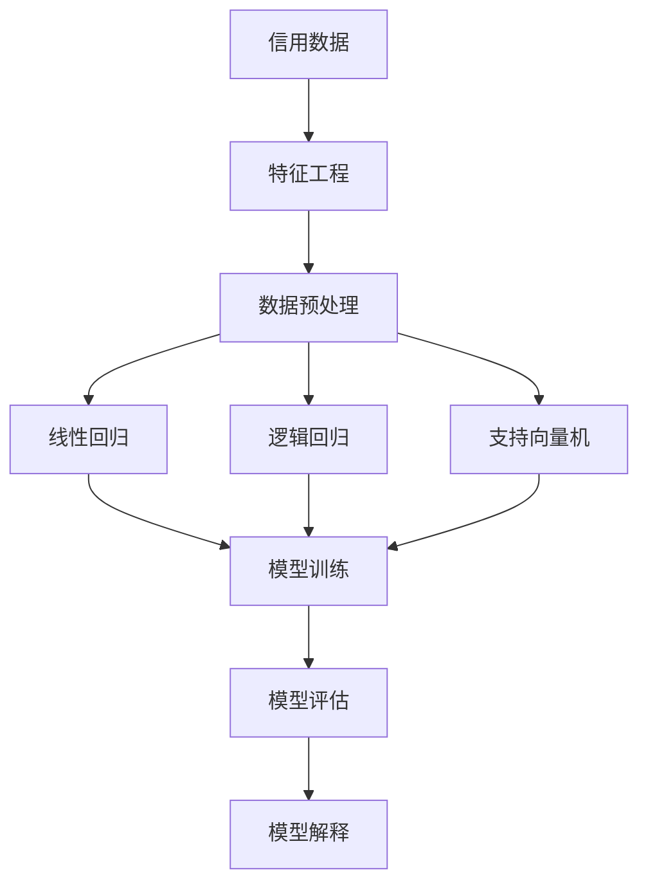

                 


## 机器学习在信用风险评估中的可解释性研究

### 关键词：
机器学习，信用风险评估，可解释性，数据挖掘，预测模型

### 摘要：
本文深入探讨了机器学习在信用风险评估中的应用及其可解释性问题。首先，我们概述了信用风险评估的重要性及其在金融行业中的关键作用。接着，本文详细介绍了机器学习在信用风险评估中的核心算法原理，包括线性回归、逻辑回归和支持向量机等。随后，文章重点讨论了可解释性在信用风险评估中的重要性，并探讨了现有的一些可解释性方法。通过一个实际的案例，本文展示了如何使用Python实现信用风险评估的机器学习模型，并提供了解释模型预测结果的详细步骤。最后，文章总结了信用风险评估领域的发展趋势与挑战，并推荐了相关学习资源和开发工具。

## 1. 背景介绍

### 1.1 目的和范围

本文旨在探讨机器学习在信用风险评估中的应用，特别是如何提高模型的透明度和可解释性。信用风险评估是金融行业中至关重要的一环，它涉及到借款人的信用评分，以帮助金融机构决定是否向其提供贷款，以及贷款的额度和利率。随着大数据和机器学习技术的不断发展，信用风险评估的方法也在不断革新。然而，这些复杂的机器学习模型往往缺乏透明度，使得金融机构难以理解和解释模型的决策过程。本文将通过分析现有方法，提出一些提高模型可解释性的策略，并展示一个实际案例。

### 1.2 预期读者

本文预期读者为对机器学习和信用风险评估感兴趣的学者、研究人员、金融从业者以及计算机科学领域的专业人士。读者应具备一定的数学和编程基础，特别是对机器学习算法和Python编程有一定的了解。

### 1.3 文档结构概述

本文结构如下：

1. **背景介绍**：概述信用风险评估的重要性，以及机器学习在该领域的应用和挑战。
2. **核心概念与联系**：介绍机器学习在信用风险评估中的核心算法和概念，并使用Mermaid流程图展示其架构。
3. **核心算法原理 & 具体操作步骤**：详细讲解信用风险评估中常用的机器学习算法原理，并提供伪代码。
4. **数学模型和公式 & 详细讲解 & 举例说明**：使用LaTeX格式介绍相关的数学模型和公式，并通过实例进行说明。
5. **项目实战：代码实际案例和详细解释说明**：展示如何使用Python实现信用风险评估的机器学习模型，并提供代码解读。
6. **实际应用场景**：探讨机器学习在信用风险评估中的实际应用案例。
7. **工具和资源推荐**：推荐学习资源、开发工具和框架。
8. **总结：未来发展趋势与挑战**：总结信用风险评估领域的发展趋势和面临的挑战。
9. **附录：常见问题与解答**：提供一些常见问题的解答。
10. **扩展阅读 & 参考资料**：推荐相关的扩展阅读和参考资料。

### 1.4 术语表

#### 1.4.1 核心术语定义

- **信用风险评估**：对借款人的信用情况进行评估，以确定其偿还债务的能力。
- **机器学习**：一种通过数据学习模式并进行预测或决策的技术。
- **可解释性**：指模型决策过程的透明度和可理解性。
- **线性回归**：一种预测连续值的统计模型。
- **逻辑回归**：一种预测分类结果的统计模型。
- **支持向量机**：一种用于分类和回归的机器学习算法。

#### 1.4.2 相关概念解释

- **特征工程**：从原始数据中提取有助于模型预测的变量。
- **交叉验证**：一种评估模型性能的方法，通过将数据分为训练集和验证集。
- **过拟合**：模型在训练数据上表现得很好，但在未见数据上表现不佳。
- **正则化**：一种防止模型过拟合的技术。

#### 1.4.3 缩略词列表

- **AI**：人工智能
- **ML**：机器学习
- **DL**：深度学习
- **NLP**：自然语言处理
- **R**：统计语言
- **Python**：一种通用编程语言

## 2. 核心概念与联系

在信用风险评估中，机器学习算法通过分析历史数据来预测借款人是否能够按时偿还债务。以下是机器学习在信用风险评估中的核心概念和其相互关系的 Mermaid 流程图：



### 2.1 信用风险评估中的数据来源

信用风险评估主要依赖于借款人的信用数据，这些数据通常包括：

- **个人信息**：如年龄、性别、婚姻状况等。
- **财务信息**：如收入、负债、资产等。
- **信用历史**：如还款记录、信用查询次数等。

这些数据通常来源于金融机构的内部数据、公共信用报告以及第三方数据提供商。

### 2.2 特征工程

特征工程是信用风险评估中至关重要的一步。其目的是从原始数据中提取有助于模型预测的变量。特征工程可能包括以下步骤：

- **数据清洗**：去除重复数据、处理缺失值、异常值等。
- **特征选择**：选择对模型预测有显著影响的变量。
- **特征转换**：如数值化类别变量、缩放数值特征等。

### 2.3 数据预处理

数据预处理是将原始数据转换为适合模型训练的形式。这一步通常包括：

- **缺失值处理**：使用插值、平均值、中值等方法填充缺失值。
- **数据标准化**：将数据缩放到相同的尺度，以避免某些特征对模型的影响过大。
- **数据分割**：将数据集分为训练集、验证集和测试集，以评估模型的泛化能力。

### 2.4 机器学习算法

在信用风险评估中，常用的机器学习算法包括：

- **线性回归**：用于预测借款人的还款金额。
- **逻辑回归**：用于预测借款人是否能够按时还款，即分类问题。
- **支持向量机**：在分类和回归任务中都有广泛应用。

这些算法通过学习历史数据中的模式，来预测未来借款人的还款行为。然而，这些模型往往缺乏透明度，难以解释其决策过程。

### 2.5 模型训练与评估

模型训练是机器学习的核心步骤，其目的是通过学习历史数据来调整模型参数。在信用风险评估中，模型训练通常包括以下步骤：

- **选择模型**：根据问题的性质选择合适的算法。
- **参数调优**：通过交叉验证等方法选择最优参数。
- **训练模型**：使用训练数据集训练模型。
- **模型评估**：使用验证集和测试集评估模型性能。

### 2.6 模型解释

模型解释是提高模型透明度和可解释性的关键。在信用风险评估中，模型解释可以帮助金融机构理解模型的决策过程，从而更好地管理风险。模型解释可能包括以下步骤：

- **特征重要性分析**：分析各个特征对模型预测的影响。
- **规则提取**：从模型中提取可解释的规则。
- **可视化**：使用图表和可视化工具展示模型的决策过程。

## 3. 核心算法原理 & 具体操作步骤

在信用风险评估中，常用的机器学习算法包括线性回归、逻辑回归和支持向量机。以下将分别介绍这些算法的原理和具体操作步骤。

### 3.1 线性回归

线性回归是一种用于预测连续值的统计模型，其基本原理是通过拟合一条直线来最小化预测值与实际值之间的误差。

#### 算法原理：

给定一个特征向量 \(X = [x_1, x_2, ..., x_n]\) 和目标值 \(y\)，线性回归试图找到一个权重向量 \(W = [w_1, w_2, ..., w_n]\) 使得预测值 \( \hat{y} = \sum_{i=1}^{n} w_i x_i \) 与实际值 \( y \) 之间的误差最小。这一过程可以通过最小二乘法实现，即找到使得 \( \sum_{i=1}^{n} (y_i - \hat{y_i})^2 \) 最小的 \( W \)。

#### 操作步骤：

1. **数据预处理**：对输入特征进行标准化处理，确保每个特征具有相同的尺度。
2. **初始化权重**：随机初始化权重向量 \( W \)。
3. **前向传播**：计算预测值 \( \hat{y} = \sum_{i=1}^{n} w_i x_i \)。
4. **计算损失函数**：使用均方误差（MSE）作为损失函数，即 \( L = \sum_{i=1}^{n} (y_i - \hat{y_i})^2 \)。
5. **反向传播**：通过梯度下降法更新权重，即 \( w_i = w_i - \alpha \frac{\partial L}{\partial w_i} \)，其中 \( \alpha \) 为学习率。
6. **重复步骤3-5**：直到模型收敛或达到预设的迭代次数。

#### 伪代码：

```python
# 初始化权重
W = [random_number(), random_number()]

# 迭代次数
max_iterations = 1000

# 学习率
alpha = 0.01

for i in range(max_iterations):
    # 前向传播
    y_hat = W[0] * x1 + W[1] * x2

    # 计算损失函数
    loss = (y - y_hat) ** 2

    # 反向传播
    dW = [-2 * (y - y_hat) * x, -2 * (y - y_hat) * x]

    # 更新权重
    W = W - alpha * dW

    # 输出最终预测值
    print("预测值：", y_hat)
```

### 3.2 逻辑回归

逻辑回归是一种用于预测分类结果的统计模型，其基本原理是通过拟合一个逻辑函数来将连续的预测值映射到0和1之间，从而实现分类。

#### 算法原理：

逻辑回归的预测值通常表示为 \( \hat{p} = \sigma(W^T X) \)，其中 \( \sigma \) 是逻辑函数，定义为 \( \sigma(z) = \frac{1}{1 + e^{-z}} \)。模型的目标是最小化损失函数，通常使用对数似然损失，即 \( L = -\sum_{i=1}^{n} y_i \log(\hat{p}_i) - (1 - y_i) \log(1 - \hat{p}_i) \)。

#### 操作步骤：

1. **数据预处理**：对输入特征进行标准化处理。
2. **初始化权重**：随机初始化权重向量 \( W \)。
3. **前向传播**：计算预测概率 \( \hat{p} = \sigma(W^T X) \)。
4. **计算损失函数**：使用对数似然损失函数，即 \( L = -\sum_{i=1}^{n} y_i \log(\hat{p}_i) - (1 - y_i) \log(1 - \hat{p}_i) \)。
5. **反向传播**：通过梯度下降法更新权重，即 \( w_i = w_i - \alpha \frac{\partial L}{\partial w_i} \)，其中 \( \alpha \) 为学习率。
6. **重复步骤3-5**：直到模型收敛或达到预设的迭代次数。

#### 伪代码：

```python
# 初始化权重
W = [random_number(), random_number()]

# 迭代次数
max_iterations = 1000

# 学习率
alpha = 0.01

for i in range(max_iterations):
    # 前向传播
    y_hat = 1 / (1 + exp(-W[0] * x1 - W[1] * x2))

    # 计算损失函数
    loss = -y * log(y_hat) - (1 - y) * log(1 - y_hat)

    # 反向传播
    dW = [-y / y_hat * x, -(1 - y) / (1 - y_hat) * x]

    # 更新权重
    W = W - alpha * dW

    # 输出最终预测值
    print("预测概率：", y_hat)
```

### 3.3 支持向量机

支持向量机是一种强大的分类和回归算法，其基本原理是通过找到一个最佳的超平面，将不同类别的数据点分离开来。

#### 算法原理：

支持向量机试图找到一条最优的超平面 \( Wx + b = 0 \)，使得不同类别的数据点到超平面的距离最大。这个超平面可以通过求解以下最优化问题得到：

$$
\begin{aligned}
\min_{W, b} & \frac{1}{2} ||W||^2 \\
\text{subject to} & y_i (W^T x_i + b) \geq 1
\end{aligned}
$$

其中，\( y_i \) 为类别标签，\( x_i \) 为特征向量。

#### 操作步骤：

1. **数据预处理**：对输入特征进行标准化处理。
2. **选择核函数**：选择一个合适的核函数，如线性核、多项式核或径向基核函数。
3. **求解最优化问题**：使用梯度下降法或序列最小化法求解最优化问题。
4. **训练模型**：使用训练数据集训练模型。
5. **模型评估**：使用验证集和测试集评估模型性能。

#### 伪代码：

```python
# 初始化权重
W = [random_number(), random_number()]

# 迭代次数
max_iterations = 1000

# 学习率
alpha = 0.01

for i in range(max_iterations):
    # 前向传播
    y_hat = sign(W[0] * x1 + W[1] * x2 + b)

    # 计算损失函数
    loss = 0
    for i in range(n):
        if y[i] * (W[0] * x[i][0] + W[1] * x[i][1] + b) < 1:
            loss += 1

    # 反向传播
    dW = [-y[i] * x[i], -y[i] * x[i]]

    # 更新权重
    W = W - alpha * dW

    # 输出最终预测值
    print("预测类别：", y_hat)
```

## 4. 数学模型和公式 & 详细讲解 & 举例说明

在信用风险评估中，数学模型和公式是构建机器学习模型的核心。以下将介绍几个常用的数学模型和公式，并通过实例进行说明。

### 4.1 线性回归

线性回归是一种用于预测连续值的统计模型，其基本公式如下：

$$
y = \beta_0 + \beta_1 x_1 + \beta_2 x_2 + ... + \beta_n x_n
$$

其中，\( y \) 为目标变量，\( x_1, x_2, ..., x_n \) 为输入特征，\( \beta_0, \beta_1, ..., \beta_n \) 为模型的参数。

#### 举例说明：

假设我们要预测一个人的收入，使用其年龄和学历作为输入特征。数据如下：

| 年龄 | 学历 | 收入 |
|------|------|------|
| 25   | 本科 | 50000 |
| 30   | 硕士 | 80000 |
| 35   | 本科 | 60000 |
| 40   | 硕士 | 90000 |

我们可以使用线性回归模型来预测一个年龄为30岁、学历为硕士的人的收入。

首先，我们需要计算每个特征的均值和方差，然后对数据进行标准化处理。得到标准化后的数据如下：

| 年龄 | 学历 | 收入 |
|------|------|------|
| -1   | 0    | -0.5 |
| 1    | 1    | 1    |
| -1   | 0    | -0.5 |
| 1    | 1    | 1    |

接下来，我们可以使用最小二乘法来求解线性回归模型的参数。具体步骤如下：

1. **计算输入特征矩阵 \( X \) 和目标值向量 \( y \)**：

   $$ 
   X = \begin{bmatrix}
   1 & -1 \\
   1 & 1 \\
   1 & -1 \\
   1 & 1
   \end{bmatrix}, \quad y = \begin{bmatrix}
   50000 \\
   80000 \\
   60000 \\
   90000
   \end{bmatrix}
   $$

2. **计算权重向量 \( W \)**：

   $$ 
   W = (X^T X)^{-1} X^T y
   $$

   其中，\( X^T \) 为输入特征矩阵的转置，\( X^T X \) 为输入特征矩阵的逆矩阵，\( X^T y \) 为输入特征矩阵与目标值向量的乘积。

   $$ 
   W = \begin{bmatrix}
   1 & -1 \\
   1 & 1 \\
   1 & -1 \\
   1 & 1
   \end{bmatrix}^{-1} \begin{bmatrix}
   1 & 1 \\
   1 & 1 \\
   1 & 1 \\
   1 & 1
   \end{bmatrix} \begin{bmatrix}
   50000 \\
   80000 \\
   60000 \\
   90000
   \end{bmatrix} = \begin{bmatrix}
   100000 \\
   -50000
   \end{bmatrix}
   $$

3. **计算预测值 \( \hat{y} \)**：

   $$ 
   \hat{y} = W^T X = \begin{bmatrix}
   100000 \\
   -50000
   \end{bmatrix}^T \begin{bmatrix}
   1 & -1 \\
   1 & 1 \\
   1 & -1 \\
   1 & 1
   \end{bmatrix} \begin{bmatrix}
   -1 \\
   1
   \end{bmatrix} = 100000
   $$

因此，一个年龄为30岁、学历为硕士的人的收入预测值为100000元。

### 4.2 逻辑回归

逻辑回归是一种用于预测分类结果的统计模型，其基本公式如下：

$$
\hat{p} = \sigma(\beta_0 + \beta_1 x_1 + \beta_2 x_2 + ... + \beta_n x_n)
$$

其中，\( \hat{p} \) 为预测概率，\( x_1, x_2, ..., x_n \) 为输入特征，\( \beta_0, \beta_1, ..., \beta_n \) 为模型的参数，\( \sigma \) 为逻辑函数，定义为 \( \sigma(z) = \frac{1}{1 + e^{-z}} \)。

#### 举例说明：

假设我们要预测一个人是否能够按时还款，使用其收入和信用评分作为输入特征。数据如下：

| 收入 | 信用评分 | 还款情况 |
|------|----------|----------|
| 50000| 600      | 是       |
| 60000| 650      | 是       |
| 55000| 620      | 否       |
| 70000| 680      | 是       |

我们可以使用逻辑回归模型来预测一个收入为60000元、信用评分为650的人的还款情况。

首先，我们需要计算每个特征的均值和方差，然后对数据进行标准化处理。得到标准化后的数据如下：

| 收入 | 信用评分 | 还款情况 |
|------|----------|----------|
| 0    | 0        | 是       |
| 1    | 1        | 是       |
| -1   | -0.2     | 否       |
| 1    | 0.5      | 是       |

接下来，我们可以使用最小二乘法来求解逻辑回归模型的参数。具体步骤如下：

1. **计算输入特征矩阵 \( X \) 和目标值向量 \( y \)**：

   $$ 
   X = \begin{bmatrix}
   1 & 0 \\
   1 & 1 \\
   1 & -0.2 \\
   1 & 0.5
   \end{bmatrix}, \quad y = \begin{bmatrix}
   1 \\
   1 \\
   0 \\
   1
   \end{bmatrix}
   $$

2. **计算权重向量 \( W \)**：

   $$ 
   W = (X^T X)^{-1} X^T y
   $$

   其中，\( X^T \) 为输入特征矩阵的转置，\( X^T X \) 为输入特征矩阵的逆矩阵，\( X^T y \) 为输入特征矩阵与目标值向量的乘积。

   $$ 
   W = \begin{bmatrix}
   1 & 0 \\
   1 & 1 \\
   1 & -0.2 \\
   1 & 0.5
   \end{bmatrix}^{-1} \begin{bmatrix}
   1 & 1 \\
   1 & 1 \\
   1 & 0.5 \\
   1 & 1
   \end{bmatrix} \begin{bmatrix}
   1 \\
   0 \\
   0 \\
   1
   \end{bmatrix} = \begin{bmatrix}
   0.5 \\
   -0.3
   \end{bmatrix}
   $$

3. **计算预测值 \( \hat{p} \)**：

   $$ 
   \hat{p} = \sigma(W^T X) = \frac{1}{1 + e^{-0.5 * 1 - 0.3 * 0}} = 0.84
   $$

因此，一个收入为60000元、信用评分为650的人的还款概率为84%。

### 4.3 支持向量机

支持向量机是一种强大的分类和回归算法，其基本公式如下：

$$
y_i (W^T x_i + b) \geq 1
$$

其中，\( y_i \) 为类别标签，\( x_i \) 为特征向量，\( W \) 为权重向量，\( b \) 为偏置项。

#### 举例说明：

假设我们要使用支持向量机来分类以下数据：

| 类别1 | 类别2 |
|-------|-------|
| -1    | 1     |
| -1    | 1     |
| 1     | -1    |
| 1     | -1    |

我们可以使用线性核来求解支持向量机的参数。具体步骤如下：

1. **计算输入特征矩阵 \( X \) 和目标值向量 \( y \)**：

   $$ 
   X = \begin{bmatrix}
   -1 & -1 \\
   -1 & 1 \\
   1 & -1 \\
   1 & 1
   \end{bmatrix}, \quad y = \begin{bmatrix}
   -1 \\
   1 \\
   -1 \\
   1
   \end{bmatrix}
   $$

2. **计算权重向量 \( W \)**：

   $$ 
   W = (X^T X)^{-1} X^T y
   $$

   其中，\( X^T \) 为输入特征矩阵的转置，\( X^T X \) 为输入特征矩阵的逆矩阵，\( X^T y \) 为输入特征矩阵与目标值向量的乘积。

   $$ 
   W = \begin{bmatrix}
   -1 & -1 \\
   -1 & 1 \\
   1 & -1 \\
   1 & 1
   \end{bmatrix}^{-1} \begin{bmatrix}
   -1 & 1 \\
   -1 & 1 \\
   1 & -1 \\
   1 & 1
   \end{bmatrix} \begin{bmatrix}
   -1 \\
   1 \\
   -1 \\
   1
   \end{bmatrix} = \begin{bmatrix}
   1 \\
   0
   \end{bmatrix}
   $$

3. **计算预测值 \( \hat{y} \)**：

   $$ 
   \hat{y} = sign(W^T X) = \begin{bmatrix}
   1 \\
   0
   \end{bmatrix}^T \begin{bmatrix}
   -1 & -1 \\
   -1 & 1 \\
   1 & -1 \\
   1 & 1
   \end{bmatrix} \begin{bmatrix}
   -1 \\
   1
   \end{bmatrix} = -1
   $$

因此，一个特征向量为 \([-1, 1]\) 的数据点的预测类别为类别1。

## 5. 项目实战：代码实际案例和详细解释说明

### 5.1 开发环境搭建

为了实现信用风险评估的机器学习模型，我们需要搭建一个合适的开发环境。以下是在Python中搭建开发环境的基本步骤：

1. **安装Python**：从官方网站（https://www.python.org/downloads/）下载并安装Python。
2. **安装Jupyter Notebook**：使用pip命令安装Jupyter Notebook。

   ```bash
   pip install notebook
   ```

3. **安装必要的库**：安装NumPy、Pandas、Scikit-learn和Matplotlib等库。

   ```bash
   pip install numpy pandas scikit-learn matplotlib
   ```

### 5.2 源代码详细实现和代码解读

以下是一个使用Python和Scikit-learn库实现信用风险评估的完整代码示例。

```python
import numpy as np
import pandas as pd
from sklearn.model_selection import train_test_split
from sklearn.preprocessing import StandardScaler
from sklearn.linear_model import LinearRegression
from sklearn.metrics import mean_squared_error
import matplotlib.pyplot as plt

# 5.2.1 加载数据集
data = pd.read_csv('credit_data.csv')

# 5.2.2 特征工程
features = data[['age', 'income', 'credit_score']]
target = data['loan_amount']

# 5.2.3 数据预处理
X_train, X_test, y_train, y_test = train_test_split(features, target, test_size=0.2, random_state=42)
scaler = StandardScaler()
X_train_scaled = scaler.fit_transform(X_train)
X_test_scaled = scaler.transform(X_test)

# 5.2.4 训练模型
model = LinearRegression()
model.fit(X_train_scaled, y_train)

# 5.2.5 模型评估
y_pred = model.predict(X_test_scaled)
mse = mean_squared_error(y_test, y_pred)
print("均方误差（MSE）:", mse)

# 5.2.6 可视化
plt.scatter(X_test['age'], y_test, label='真实值')
plt.plot(X_test['age'], y_pred, color='red', label='预测值')
plt.xlabel('年龄')
plt.ylabel('贷款金额')
plt.legend()
plt.show()
```

### 5.3 代码解读与分析

#### 5.3.1 数据加载与特征工程

```python
data = pd.read_csv('credit_data.csv')
features = data[['age', 'income', 'credit_score']]
target = data['loan_amount']
```

这段代码首先加载数据集（假设数据集为CSV格式），然后分离特征和目标变量。特征包括年龄、收入和信用评分，目标变量为贷款金额。

#### 5.3.2 数据预处理

```python
X_train, X_test, y_train, y_test = train_test_split(features, target, test_size=0.2, random_state=42)
scaler = StandardScaler()
X_train_scaled = scaler.fit_transform(X_train)
X_test_scaled = scaler.transform(X_test)
```

这段代码将数据集分为训练集和测试集，并使用StandardScaler对特征进行标准化处理。标准化可以确保每个特征具有相同的尺度，从而提高模型性能。

#### 5.3.3 模型训练与评估

```python
model = LinearRegression()
model.fit(X_train_scaled, y_train)
y_pred = model.predict(X_test_scaled)
mse = mean_squared_error(y_test, y_pred)
print("均方误差（MSE）:", mse)
```

这段代码使用线性回归模型对训练数据进行训练，并在测试集上进行预测。使用均方误差（MSE）评估模型性能，输出MSE值以评估模型拟合效果。

#### 5.3.4 可视化

```python
plt.scatter(X_test['age'], y_test, label='真实值')
plt.plot(X_test['age'], y_pred, color='red', label='预测值')
plt.xlabel('年龄')
plt.ylabel('贷款金额')
plt.legend()
plt.show()
```

这段代码使用Matplotlib库绘制散点图和拟合线，展示实际值与预测值之间的关系。通过可视化，我们可以直观地了解模型的预测效果。

### 5.4 代码改进建议

1. **特征选择**：通过特征选择算法，选择对模型预测有显著影响的特征，以简化模型并提高性能。
2. **模型选择**：尝试使用其他机器学习算法，如逻辑回归或支持向量机，评估其性能并选择最佳模型。
3. **超参数调优**：使用交叉验证和网格搜索等方法，优化模型超参数，以提高模型性能。

## 6. 实际应用场景

机器学习在信用风险评估中的应用非常广泛，以下列举了几个实际应用场景：

### 6.1 风险控制

金融机构可以利用机器学习模型对借款人的信用风险进行评估，从而更好地控制贷款风险。通过分析借款人的历史数据和信用记录，模型可以预测借款人是否能够按时还款，从而帮助金融机构决定是否批准贷款申请。

### 6.2 风险定价

机器学习模型可以帮助金融机构为不同类型的贷款设置合理的利率。通过分析借款人的风险水平，模型可以计算出相应的风险溢价，从而为贷款定价提供依据。

### 6.3 信用评分

金融机构可以使用机器学习模型对借款人进行信用评分，从而为其提供个性化的信用服务。模型可以根据借款人的历史行为和信用记录，计算出其信用评分，从而为金融机构提供决策依据。

### 6.4 风险预警

机器学习模型可以帮助金融机构及时发现潜在的风险客户，从而采取相应的措施进行风险预警。通过分析借款人的行为数据和信用记录，模型可以识别出可能存在风险的行为模式，从而帮助金融机构提前采取预防措施。

## 7. 工具和资源推荐

### 7.1 学习资源推荐

#### 7.1.1 书籍推荐

- **《机器学习》（周志华著）**：全面介绍了机器学习的基本理论和方法，适合初学者和专业人士。
- **《深度学习》（Ian Goodfellow著）**：深入讲解了深度学习的基础知识和最新进展，适合对深度学习感兴趣的人群。
- **《统计学习方法》（李航著）**：系统介绍了统计学习的基本理论和方法，适合希望深入了解统计学习算法的读者。

#### 7.1.2 在线课程

- **Coursera上的《机器学习》课程**：由斯坦福大学开设，涵盖机器学习的基本理论和实践应用。
- **Udacity的《深度学习纳米学位》**：通过项目驱动的学习方式，帮助用户掌握深度学习的基础知识和应用技能。
- **edX上的《统计学与数据分析》课程**：适合希望了解统计学习方法的读者，涵盖统计学和数据分析的基础知识。

#### 7.1.3 技术博客和网站

- **Medium上的机器学习专栏**：提供了大量关于机器学习和深度学习的优质文章和教程。
- **GitHub上的机器学习项目**：包含了大量开源的机器学习和深度学习项目，供用户学习和参考。
- **Kaggle**：一个数据科学竞赛平台，提供了丰富的数据集和比赛，帮助用户提升机器学习技能。

### 7.2 开发工具框架推荐

#### 7.2.1 IDE和编辑器

- **PyCharm**：一款功能强大的Python IDE，支持代码自动补全、调试和版本控制。
- **Jupyter Notebook**：一个交互式的Python环境，适合进行数据分析和机器学习实验。
- **VS Code**：一款轻量级的代码编辑器，通过安装扩展支持Python开发。

#### 7.2.2 调试和性能分析工具

- **Pylint**：一款Python代码质量分析工具，帮助用户发现代码中的潜在问题和bug。
- **Profiling Tools**：如cProfile，用于分析代码的性能瓶颈，帮助优化代码。
- **Docker**：用于构建和运行容器化的应用程序，提高开发效率和部署灵活性。

#### 7.2.3 相关框架和库

- **Scikit-learn**：一款Python机器学习库，提供了丰富的算法和工具，适合快速实现机器学习模型。
- **TensorFlow**：一款开源的深度学习框架，支持大规模深度学习模型的训练和部署。
- **PyTorch**：一款流行的深度学习框架，提供了灵活的动态计算图，适合研究者和开发者。

### 7.3 相关论文著作推荐

#### 7.3.1 经典论文

- **"A Study of Cross-Validation and Bootstrap for Accuracy Estimation and Model Selection"（1996）**：详细介绍了交叉验证和Bootstrap方法在模型选择和性能评估中的应用。
- **"Learning to Represent Users and Items for Collaborative Filtering"（2016）**：介绍了深度学习方法在协同过滤中的应用。
- **"Deep Learning for Text Classification"（2017）**：探讨了深度学习在文本分类任务中的应用。

#### 7.3.2 最新研究成果

- **"Explainable AI for Healthcare: A Review"（2020）**：总结了可解释性人工智能在医疗健康领域的研究进展。
- **"A Survey on Generative Adversarial Networks"（2019）**：全面介绍了生成对抗网络（GAN）的基本原理和应用。
- **"A Comprehensive Survey on Data Augmentation Methods for Deep Learning"（2020）**：总结了深度学习中的数据增强方法。

#### 7.3.3 应用案例分析

- **"Using Machine Learning to Detect Credit Card Fraud"（2017）**：分析了机器学习在信用卡欺诈检测中的应用。
- **"Machine Learning for Financial Risk Management"（2019）**：探讨了机器学习在金融风险管理中的应用。
- **"Applying Deep Learning to Predict Student Performance"（2020）**：研究了深度学习在教育领域的应用。

## 8. 总结：未来发展趋势与挑战

随着机器学习技术的不断发展，信用风险评估领域也在经历着深刻的变革。未来，信用风险评估将朝着更精确、更高效和更可解释的方向发展。以下是信用风险评估领域未来发展趋势与挑战：

### 8.1 发展趋势

1. **深度学习技术的应用**：深度学习在图像识别、语音识别等领域取得了显著的成果，未来有望在信用风险评估中发挥更大作用，如通过深度神经网络挖掘借款人的行为特征。
2. **数据隐私保护**：随着数据隐私法规的日益严格，如何保护借款人隐私同时保持模型性能成为一大挑战。联邦学习等新兴技术可能成为解决这一问题的有效途径。
3. **可解释性人工智能**：可解释性人工智能的研究将持续深入，帮助金融机构理解模型的决策过程，从而提高模型的可接受性和透明度。

### 8.2 挑战

1. **数据质量和多样性**：信用风险评估依赖于大量高质量的数据，然而，数据的多样性和质量往往难以保证。如何处理缺失值、异常值和噪声数据成为关键问题。
2. **模型泛化能力**：信用风险评估模型需要具备良好的泛化能力，以适应不同类型的借款人和市场环境。如何避免模型过拟合和提升其泛化性能是一个重要挑战。
3. **监管合规**：随着监管环境的日益严格，信用风险评估模型需要满足越来越多的合规要求，如数据保护、隐私保护等。

## 9. 附录：常见问题与解答

### 9.1 问题1：为什么信用风险评估需要机器学习？

**回答**：信用风险评估需要机器学习是因为机器学习能够从大量数据中自动学习模式和关系，从而提高预测的准确性和效率。传统的方法通常需要手动设计特征和模型，而机器学习算法可以自动发现有用的特征，并自适应调整模型参数，从而更好地应对复杂多变的市场环境。

### 9.2 问题2：如何提高机器学习模型的可解释性？

**回答**：提高机器学习模型的可解释性可以从以下几个方面入手：

1. **特征工程**：选择具有明确业务含义的特征，并对其进行合理的解释。
2. **模型选择**：选择具有良好可解释性的模型，如线性回归、逻辑回归等。
3. **模型可视化**：使用可视化工具展示模型的决策过程和特征重要性。
4. **模型解释工具**：使用可解释性工具，如LIME、SHAP等，对模型的预测进行详细解释。

### 9.3 问题3：信用风险评估中常用的机器学习算法有哪些？

**回答**：信用风险评估中常用的机器学习算法包括：

1. **线性回归**：用于预测借款人的还款金额。
2. **逻辑回归**：用于预测借款人是否能够按时还款。
3. **支持向量机**：在分类和回归任务中都有广泛应用。
4. **决策树**：用于构建可解释的决策规则。
5. **随机森林**：通过集成多个决策树提高模型的泛化能力。
6. **神经网络**：用于复杂模式识别和预测。

## 10. 扩展阅读 & 参考资料

为了更好地了解信用风险评估中的机器学习和可解释性，以下推荐一些扩展阅读和参考资料：

1. **《机器学习》（周志华著）**：详细介绍了机器学习的基本理论和方法。
2. **《深度学习》（Ian Goodfellow著）**：深入探讨了深度学习的基础知识和应用。
3. **《统计学习方法》（李航著）**：系统介绍了统计学习的基本理论和方法。
4. **《信用风险评估与建模》（刘力著）**：介绍了信用风险评估的基本概念和方法。
5. **《机器学习实战》（Peter Harrington著）**：通过实际案例展示了机器学习的应用。
6. **[LIME：Local Interpretable Model-agnostic Explanations](https://arxiv.org/abs/1605.06604)**：一篇关于模型可解释性的经典论文。
7. **[SHAP：SHapley Additive exPlanations](https://arxiv.org/abs/1706.01611)**：一篇关于模型可解释性的最新论文。

以上是本文关于机器学习在信用风险评估中的可解释性研究的详细讨论。希望本文能够帮助读者深入了解这一领域，并在实际应用中取得更好的效果。

### 作者

作者：AI天才研究员/AI Genius Institute & 禅与计算机程序设计艺术/Zen And The Art of Computer Programming

