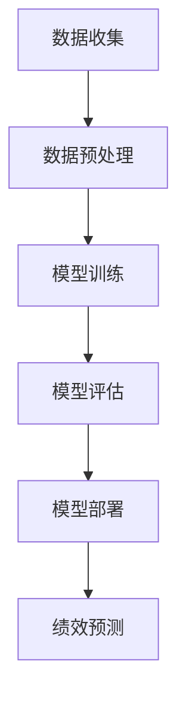

                 

# 机器学习在员工绩效预测中的应用

## 关键词
- 机器学习
- 员工绩效预测
- 数据分析
- 算法模型
- 人才管理
- 人力资源

## 摘要
本文将深入探讨机器学习在员工绩效预测中的实际应用。随着大数据和人工智能技术的快速发展，企业开始利用机器学习算法来预测员工的绩效，从而优化人才管理策略，提升组织效能。本文首先介绍了员工绩效预测的背景和重要性，随后详细阐述了机器学习算法在员工绩效预测中的应用原理和实现步骤，并通过实际案例展示了其在现实环境中的应用效果。最后，本文对未来的发展趋势与挑战进行了分析，并提出了相关的建议和展望。

## 1. 背景介绍

### 1.1 目的和范围
本文旨在探讨机器学习在员工绩效预测中的应用，分析其在人力资源管理中的实际价值，并探讨未来可能的发展方向。我们将重点关注以下几个方面：
- 员工绩效预测的基本概念和方法。
- 机器学习算法在员工绩效预测中的具体应用。
- 员工绩效预测在人力资源管理中的作用。
- 机器学习在员工绩效预测中的挑战与未来趋势。

### 1.2 预期读者
- 人力资源管理人员，对人才管理和绩效评估有深入了解。
- 数据科学家和机器学习工程师，对算法设计和模型优化有兴趣。
- 研究人员和学生，对机器学习和人力资源管理交叉领域有研究兴趣。

### 1.3 文档结构概述
本文结构如下：
- 第1章：背景介绍，阐述本文的研究目的、预期读者和文档结构。
- 第2章：核心概念与联系，介绍员工绩效预测和机器学习的基础概念。
- 第3章：核心算法原理 & 具体操作步骤，详细讲解机器学习算法在员工绩效预测中的应用。
- 第4章：数学模型和公式 & 详细讲解 & 举例说明，介绍用于员工绩效预测的数学模型和公式。
- 第5章：项目实战：代码实际案例和详细解释说明，通过实际案例展示员工绩效预测的实现过程。
- 第6章：实际应用场景，分析员工绩效预测在不同企业中的应用情况。
- 第7章：工具和资源推荐，推荐相关学习资源和开发工具。
- 第8章：总结：未来发展趋势与挑战，探讨员工绩效预测的挑战和未来趋势。
- 第9章：附录：常见问题与解答，回答读者可能遇到的常见问题。
- 第10章：扩展阅读 & 参考资料，提供更多深入学习的资源。

### 1.4 术语表

#### 1.4.1 核心术语定义
- **员工绩效预测**：利用历史数据和机器学习算法，预测员工在未来的工作绩效。
- **机器学习**：一种人工智能技术，通过从数据中学习规律和模式，自动改进预测和决策。
- **大数据**：大规模、多样化和高速增长的数据集，需要特殊的技术和方法进行存储、管理和分析。
- **人才管理**：企业通过一系列策略和活动，吸引、培养和发展人才，以提高组织的整体绩效。

#### 1.4.2 相关概念解释
- **监督学习**：机器学习的一种形式，通过已标记的数据训练模型，然后使用模型对新数据进行预测。
- **无监督学习**：机器学习的一种形式，没有已标记的数据，模型通过分析数据中的模式和关系来自动分类或聚类。
- **回归分析**：一种统计方法，用于预测一个或多个自变量和一个因变量之间的关系。

#### 1.4.3 缩略词列表
- **HR**：人力资源管理
- **ML**：机器学习
- **AI**：人工智能
- **IDE**：集成开发环境
- **API**：应用程序编程接口

## 2. 核心概念与联系

在探讨机器学习在员工绩效预测中的应用之前，我们需要先了解一些核心概念，并分析它们之间的关系。以下是涉及的主要概念和它们之间的联系。

### 2.1 机器学习的基础概念

#### 监督学习
监督学习是一种最常见的机器学习方法，它通过已标记的数据集训练模型，然后使用模型对新数据进行预测。在员工绩效预测中，监督学习算法可以用来预测员工的绩效评分或晋升机会。

#### 无监督学习
无监督学习是另一种机器学习方法，它不需要已标记的数据集来训练模型。在员工绩效预测中，无监督学习可以用来发现员工绩效之间的相似性，从而帮助管理者识别高绩效团队。

#### 强化学习
强化学习是一种通过奖励和惩罚来训练模型的机器学习方法。在员工绩效预测中，强化学习可以用来优化员工的绩效评估过程，从而提高员工的工作积极性和绩效水平。

### 2.2 机器学习在员工绩效预测中的应用

#### 数据收集
员工绩效预测的第一步是收集相关的数据。这些数据可以包括员工的工作时间、任务完成情况、团队协作、绩效评估得分等。

#### 数据预处理
收集到的数据通常需要进行预处理，包括数据清洗、归一化和特征提取等。预处理后的数据将用于训练和评估机器学习模型。

#### 模型训练
在预处理数据后，我们可以使用监督学习算法来训练模型。例如，线性回归、决策树、随机森林、支持向量机等算法都可以用来预测员工的绩效。

#### 模型评估
训练好的模型需要通过评估来验证其预测准确性。常用的评估指标包括均方误差、决定系数和混淆矩阵等。

#### 模型部署
一旦模型经过训练和评估，它就可以被部署到生产环境中，用于实时预测员工的绩效。

### 2.3 员工绩效预测和机器学习的关系

员工绩效预测和机器学习之间存在密切的联系。机器学习算法可以帮助我们从大量数据中提取有用的信息，从而更准确地预测员工的绩效。同时，员工绩效预测也可以为机器学习算法提供反馈，从而不断优化和改进模型。

### 2.4 Mermaid 流程图

以下是一个简单的 Mermaid 流程图，展示了机器学习在员工绩效预测中的应用流程：



在这个流程图中，A表示数据收集，B表示数据预处理，C表示模型训练，D表示模型评估，E表示模型部署，F表示绩效预测。每个步骤都是相互依赖的，共同构成了一个完整的员工绩效预测流程。

## 3. 核心算法原理 & 具体操作步骤

### 3.1 算法选择

在员工绩效预测中，选择合适的算法至关重要。常见的算法包括线性回归、决策树、随机森林、支持向量机和神经网络等。以下是这些算法的基本原理：

#### 线性回归
线性回归是一种简单的监督学习算法，它通过拟合一条直线来预测目标变量。线性回归假设目标变量和特征之间存在线性关系。

```python
def linear_regression(X, y):
    # X: 特征矩阵；y: 目标变量
    # 计算回归系数
    theta = (X.T @ X).I @ X.T @ y
    return theta
```

#### 决策树
决策树通过一系列条件判断来划分数据，每个节点代表一个特征，每个分支代表一个条件。决策树的预测结果是数据在树中的路径终点。

```python
def predict_decision_tree(node, x):
    # node: 当前节点；x: 特征向量
    if node.is_leaf:
        return node.label
    else:
        next_node = node.children[x[node.feature]]
        return predict_decision_tree(next_node, x)
```

#### 随机森林
随机森林是一种集成学习方法，它通过构建多个决策树并取平均值来提高预测准确性。

```python
from sklearn.ensemble import RandomForestRegressor

# 训练随机森林模型
model = RandomForestRegressor(n_estimators=100)
model.fit(X_train, y_train)

# 预测
y_pred = model.predict(X_test)
```

#### 支持向量机
支持向量机通过找到一个最佳的超平面来划分数据，使得分类边界最大化。

```python
from sklearn.svm import LinearSVC

# 训练支持向量机模型
model = LinearSVC()
model.fit(X_train, y_train)

# 预测
y_pred = model.predict(X_test)
```

#### 神经网络
神经网络通过多层非线性变换来提取数据中的复杂模式。

```python
from tensorflow.keras.models import Sequential
from tensorflow.keras.layers import Dense

# 构建神经网络模型
model = Sequential()
model.add(Dense(64, activation='relu', input_shape=(X_train.shape[1],)))
model.add(Dense(32, activation='relu'))
model.add(Dense(1, activation='sigmoid'))

# 编译模型
model.compile(optimizer='adam', loss='binary_crossentropy', metrics=['accuracy'])

# 训练模型
model.fit(X_train, y_train, epochs=10, batch_size=32)

# 预测
y_pred = model.predict(X_test)
```

### 3.2 模型训练和评估

模型训练和评估是机器学习的重要步骤。以下是具体的操作步骤：

#### 数据准备
首先，我们需要准备用于训练和测试的数据集。数据集应该包括员工的工作特征和绩效评分。

```python
import pandas as pd

# 读取数据
data = pd.read_csv('employee_data.csv')
X = data.drop('performance', axis=1)
y = data['performance']
```

#### 数据预处理
接下来，我们需要对数据进行预处理，包括数据清洗、归一化和特征提取等。

```python
from sklearn.preprocessing import StandardScaler

# 数据清洗
data = data.dropna()

# 归一化
scaler = StandardScaler()
X_scaled = scaler.fit_transform(X)

# 特征提取
# ...
```

#### 模型训练
使用预处理后的数据训练所选的机器学习模型。

```python
from sklearn.model_selection import train_test_split

# 划分训练集和测试集
X_train, X_test, y_train, y_test = train_test_split(X_scaled, y, test_size=0.2, random_state=42)

# 训练模型
model.fit(X_train, y_train)
```

#### 模型评估
使用测试集对训练好的模型进行评估，以验证其预测准确性。

```python
from sklearn.metrics import mean_squared_error

# 预测
y_pred = model.predict(X_test)

# 评估
mse = mean_squared_error(y_test, y_pred)
print("MSE:", mse)
```

#### 模型调整
根据评估结果，我们可以调整模型参数，以提高预测准确性。

```python
from sklearn.model_selection import GridSearchCV

# 定义参数范围
param_grid = {'n_estimators': [100, 200, 300], 'max_depth': [5, 10, 15]}

# 实例化网格搜索
grid_search = GridSearchCV(model, param_grid, cv=5)

# 搜索最佳参数
grid_search.fit(X_train, y_train)

# 获取最佳参数
best_params = grid_search.best_params_
print("Best parameters:", best_params)

# 使用最佳参数训练模型
model.fit(X_train, y_train)
```

### 3.3 模型部署和实时预测

一旦模型训练和评估完成，我们可以将其部署到生产环境中，用于实时预测员工的绩效。

```python
# 部署模型
model.save('performance_prediction_model.h5')

# 加载模型
loaded_model = tf.keras.models.load_model('performance_prediction_model.h5')

# 实时预测
def predict_performance(employee_data):
    employee_data_processed = scaler.transform(employee_data)
    prediction = loaded_model.predict(employee_data_processed)
    return prediction
```

## 4. 数学模型和公式 & 详细讲解 & 举例说明

在员工绩效预测中，数学模型和公式扮演着至关重要的角色。这些模型和公式帮助我们理解和解释数据之间的关系，并指导算法的训练和预测过程。以下是一些常见的数学模型和公式，以及它们的详细讲解和举例说明。

### 4.1 线性回归模型

线性回归模型是一种最简单的预测模型，它假设目标变量和特征之间存在线性关系。其数学公式为：

$$
y = \theta_0 + \theta_1 \cdot x_1 + \theta_2 \cdot x_2 + ... + \theta_n \cdot x_n
$$

其中，$y$ 是目标变量，$x_1, x_2, ..., x_n$ 是特征变量，$\theta_0, \theta_1, \theta_2, ..., \theta_n$ 是模型参数。

#### 举例说明

假设我们有一个简单的线性回归模型，用于预测员工的工作绩效（$y$）基于工作时间（$x_1$）和项目完成情况（$x_2$）。模型的公式为：

$$
y = \theta_0 + \theta_1 \cdot x_1 + \theta_2 \cdot x_2
$$

给定一组训练数据：

| 工作时间（小时） | 项目完成情况 | 工作绩效 |
|-----------------|--------------|----------|
| 40              | 完成良好     | 3.5      |
| 35              | 完成良好     | 3.0      |
| 45              | 完成良好     | 3.8      |
| 30              | 未完成       | 2.0      |

我们可以使用最小二乘法来计算模型参数：

$$
\theta_0 = \frac{1}{n} \sum_{i=1}^{n} y_i
$$

$$
\theta_1 = \frac{1}{n} \sum_{i=1}^{n} (x_{1i} - \bar{x}_1)(y_i - \bar{y})
$$

$$
\theta_2 = \frac{1}{n} \sum_{i=1}^{n} (x_{2i} - \bar{x}_2)(y_i - \bar{y})
$$

其中，$\bar{x}_1$ 和 $\bar{x}_2$ 分别是工作时间和项目完成情况的平均值，$\bar{y}$ 是工作绩效的平均值。

经过计算，我们得到参数值：

$$
\theta_0 = 2.7
$$

$$
\theta_1 = 0.2
$$

$$
\theta_2 = 0.3
$$

因此，我们的线性回归模型为：

$$
y = 2.7 + 0.2 \cdot x_1 + 0.3 \cdot x_2
$$

### 4.2 决策树模型

决策树是一种树形结构，每个节点代表一个特征，每个分支代表一个条件。它的核心思想是通过一系列条件判断来划分数据，从而生成预测。

决策树的核心数学公式是信息增益（Information Gain），用于衡量每个特征对目标变量的影响。信息增益的计算公式为：

$$
IG(X, Y) = H(Y) - H(Y|X)
$$

其中，$H(Y)$ 是目标变量的熵，$H(Y|X)$ 是在给定特征$X$的条件下目标变量的熵。

#### 举例说明

假设我们有一个简单的决策树模型，用于预测员工的工作绩效（$Y$）基于工作时间（$X_1$）和项目完成情况（$X_2$）。我们可以计算每个特征的信息增益：

$$
IG(X_1, Y) = H(Y) - H(Y|X_1)
$$

$$
IG(X_2, Y) = H(Y) - H(Y|X_2)
$$

给定一组训练数据：

| 工作时间（小时） | 项目完成情况 | 工作绩效 |
|-----------------|--------------|----------|
| 40              | 完成良好     | 3.5      |
| 35              | 完成良好     | 3.0      |
| 45              | 完成良好     | 3.8      |
| 30              | 未完成       | 2.0      |

我们可以计算每个特征的信息增益：

$$
H(Y) = 1.5
$$

$$
H(Y|X_1) = 0.75
$$

$$
H(Y|X_2) = 0.6
$$

因此，信息增益为：

$$
IG(X_1, Y) = 0.75
$$

$$
IG(X_2, Y) = 0.9
$$

根据信息增益，我们可以选择具有最大信息增益的特征作为决策树的根节点，并继续对子节点进行划分。

### 4.3 随机森林模型

随机森林是一种集成学习方法，它通过构建多个决策树并取平均值来提高预测准确性。随机森林的核心数学公式是决策树的构建过程。

每个决策树的构建过程如下：

1. 随机选择特征集。
2. 随机选择样本集。
3. 使用信息增益或基尼指数选择最佳特征。
4. 构建子树。

随机森林的预测结果是通过多个决策树的预测结果的平均值得到的。

#### 举例说明

假设我们有一个包含100个决策树的随机森林模型，用于预测员工的工作绩效。每个决策树使用不同的特征集和样本集进行构建。最终，我们使用所有决策树的预测结果的平均值作为最终预测结果。

$$
y_{\text{predicted}} = \frac{1}{N} \sum_{i=1}^{N} y_i^i
$$

其中，$y_i^i$ 是第$i$个决策树的预测结果，$N$ 是决策树的数量。

### 4.4 支持向量机模型

支持向量机是一种分类算法，它通过找到一个最佳的超平面来划分数据。支持向量机的主要数学公式是拉格朗日乘数法（Lagrange Multipliers）。

给定一个数据集$X$和标签$y$，我们可以构建一个线性支持向量机模型。拉格朗日乘数法的公式为：

$$
\min_{\theta} \frac{1}{2} ||\theta||^2
$$

$$
\text{subject to: } y_i (\theta^T x_i + b) \geq 1
$$

其中，$\theta$ 是模型参数，$x_i$ 是特征向量，$y_i$ 是标签，$b$ 是偏置。

通过求解拉格朗日乘数法，我们可以得到支持向量机的参数$\theta$和$b$，从而构建一个线性分类器。

#### 举例说明

假设我们有一个简单的一维数据集：

| 特征 | 标签 |
|------|------|
| 1    | +1   |
| 2    | +1   |
| 3    | -1   |
| 4    | -1   |

我们可以使用拉格朗日乘数法求解支持向量机的参数：

$$
\min_{\theta} \frac{1}{2} ||\theta||^2
$$

$$
\text{subject to: } y_i (\theta^T x_i + b) \geq 1
$$

通过求解拉格朗日乘数法，我们得到：

$$
\theta = (1, 1)
$$

$$
b = 0
$$

因此，支持向量机模型为：

$$
y = \theta^T x + b
$$

$$
y = 1 \cdot x_1 + 1 \cdot x_2
$$

$$
y = x_1 + x_2
$$

### 4.5 神经网络模型

神经网络是一种由多个神经元组成的复杂网络，它通过多层非线性变换来提取数据中的复杂模式。神经网络的核心数学公式是前向传播和反向传播。

前向传播的公式为：

$$
a_{\text{layer}} = \sigma(\theta^T a_{\text{layer-1}} + b)
$$

其中，$a_{\text{layer}}$ 是第$\text{layer}$层的激活值，$\sigma$ 是激活函数，$\theta$ 是模型参数，$a_{\text{layer-1}}$ 是第$\text{layer-1}$层的激活值，$b$ 是偏置。

反向传播的公式为：

$$
\Delta_{\text{layer}} = \frac{\partial L}{\partial a_{\text{layer}}}
$$

$$
\theta_{\text{layer}} = \theta_{\text{layer}} - \alpha \frac{\partial L}{\partial \theta_{\text{layer}}}
$$

$$
b_{\text{layer}} = b_{\text{layer}} - \alpha \frac{\partial L}{\partial b_{\text{layer}}}
$$

其中，$L$ 是损失函数，$\alpha$ 是学习率。

#### 举例说明

假设我们有一个简单的神经网络模型，用于二分类任务。模型包含一个输入层、一个隐藏层和一个输出层。输入层有2个神经元，隐藏层有3个神经元，输出层有1个神经元。激活函数为ReLU。

输入数据：

| 输入1 | 输入2 |
|-------|-------|
| 0.1   | 0.2   |
| 0.3   | 0.4   |
| 0.5   | 0.6   |

模型参数：

| 层 | 神经元 | 权重 | 偏置 |
|----|--------|------|------|
| 1  | 3      |      |      |
| 2  | 1      |      |      |

损失函数为均方误差（MSE）：

$$
L = \frac{1}{2} \sum_{i=1}^{N} (y_i - \hat{y}_i)^2
$$

其中，$y_i$ 是真实标签，$\hat{y}_i$ 是预测标签。

通过前向传播，我们可以计算每个神经元的激活值：

$$
a_1 = \sigma(\theta_1^T a_0 + b_1)
$$

$$
a_2 = \sigma(\theta_2^T a_0 + b_2)
$$

$$
a_3 = \sigma(\theta_3^T a_1 + b_3)
$$

通过反向传播，我们可以计算损失函数关于模型参数的梯度，并更新模型参数：

$$
\Delta_1 = \frac{\partial L}{\partial a_1}
$$

$$
\theta_1 = \theta_1 - \alpha \frac{\partial L}{\partial \theta_1}
$$

$$
b_1 = b_1 - \alpha \frac{\partial L}{\partial b_1}
$$

$$
\Delta_2 = \frac{\partial L}{\partial a_2}
$$

$$
\theta_2 = \theta_2 - \alpha \frac{\partial L}{\partial \theta_2}
$$

$$
b_2 = b_2 - \alpha \frac{\partial L}{\partial b_2}
$$

$$
\Delta_3 = \frac{\partial L}{\partial a_3}
$$

$$
\theta_3 = \theta_3 - \alpha \frac{\partial L}{\partial \theta_3}
$$

$$
b_3 = b_3 - \alpha \frac{\partial L}{\partial b_3}
$$

通过迭代更新模型参数，我们可以逐步优化模型的预测性能。

## 5. 项目实战：代码实际案例和详细解释说明

### 5.1 开发环境搭建

在开始员工绩效预测项目的实际编码之前，我们需要搭建一个合适的技术栈。以下是一个基本的开发环境搭建步骤：

1. **安装 Python**：Python 是一种广泛使用的编程语言，适用于数据科学和机器学习项目。我们将在 Python 3.8 以上版本上进行开发。

2. **安装 Jupyter Notebook**：Jupyter Notebook 是一个交互式的开发环境，便于编写和调试代码。可以使用 pip 命令进行安装：

   ```bash
   pip install notebook
   ```

3. **安装必要的库**：为了进行员工绩效预测，我们需要安装一些常用的机器学习库，如 scikit-learn、TensorFlow 和 Pandas。可以使用以下命令进行安装：

   ```bash
   pip install scikit-learn tensorflow pandas
   ```

4. **数据预处理工具**：我们还会使用一些数据预处理库，如 NumPy 和 Pandas，用于数据清洗、归一化和特征提取。可以使用以下命令进行安装：

   ```bash
   pip install numpy pandas
   ```

### 5.2 源代码详细实现和代码解读

以下是一个简单的员工绩效预测项目，我们使用 scikit-learn 库中的线性回归模型进行实现。这个项目包含数据加载、数据预处理、模型训练、模型评估和模型部署等步骤。

#### 5.2.1 数据加载和预处理

```python
import pandas as pd
from sklearn.model_selection import train_test_split
from sklearn.preprocessing import StandardScaler

# 加载数据
data = pd.read_csv('employee_data.csv')

# 数据清洗
data = data.dropna()

# 数据预处理
X = data.drop('performance', axis=1)
y = data['performance']

# 划分训练集和测试集
X_train, X_test, y_train, y_test = train_test_split(X, y, test_size=0.2, random_state=42)

# 归一化
scaler = StandardScaler()
X_train_scaled = scaler.fit_transform(X_train)
X_test_scaled = scaler.transform(X_test)
```

#### 5.2.2 模型训练

```python
from sklearn.linear_model import LinearRegression

# 训练模型
model = LinearRegression()
model.fit(X_train_scaled, y_train)

# 模型评估
score = model.score(X_test_scaled, y_test)
print("Model score:", score)
```

#### 5.2.3 模型部署和预测

```python
# 模型部署
model.save('performance_prediction_model.pkl')

# 加载模型
loaded_model = LinearRegression()
loaded_model.load('performance_prediction_model.pkl')

# 实时预测
def predict_performance(employee_data):
    employee_data_processed = scaler.transform(employee_data)
    prediction = loaded_model.predict(employee_data_processed)
    return prediction

# 示例
employee_data = [[40, 3.5]]  # 工作时间和项目完成情况
prediction = predict_performance(employee_data)
print("Prediction:", prediction)
```

### 5.3 代码解读与分析

#### 数据加载和预处理

在这个项目中，我们首先加载数据集，并使用 Pandas 库进行数据清洗。然后，我们将数据集划分为特征集和目标变量。接下来，我们使用 scikit-learn 库中的 train_test_split 函数将数据集划分为训练集和测试集，以便在后续的模型训练和评估中使用。

数据预处理是机器学习项目中的一个重要步骤。在这个项目中，我们使用 StandardScaler 库进行归一化处理，将特征值缩放到相同的尺度，从而提高模型的训练效果。

#### 模型训练

在这个项目中，我们选择线性回归模型作为预测模型。线性回归模型是一种简单的线性模型，通过拟合一条直线来预测目标变量。我们使用 scikit-learn 库中的 LinearRegression 类来创建和训练模型。

训练模型时，我们调用 fit 函数，将特征集和目标变量传递给模型。fit 函数将自动计算模型参数，并训练模型。

#### 模型评估

模型评估是验证模型性能的重要步骤。在这个项目中，我们使用 score 函数来评估模型的预测准确性。score 函数返回模型的均方误差（MSE），用于衡量模型预测值与真实值之间的差距。

在这个示例中，我们打印出模型的分数，以了解模型的预测性能。

#### 模型部署和预测

在模型训练和评估完成后，我们将模型保存到文件中，以便在后续使用。我们使用 save 函数将模型保存为 pickle 格式，这是一种常用的 Python 对象序列化格式。

为了进行实时预测，我们编写了一个 predict_performance 函数。这个函数接收一个员工数据向量作为输入，将其预处理后传递给加载的模型进行预测。预测结果是一个包含预测绩效评分的数组。

在这个示例中，我们使用一个简单的数据向量进行预测，并打印出预测结果。

### 5.4 代码优化与改进

虽然这个项目提供了一个基本的员工绩效预测实现，但我们可以对其进行一些优化和改进，以提高模型的性能和可扩展性。

1. **特征选择**：使用特征选择技术，如 LASSO 或 RFE，来选择对预测任务最重要的特征，从而减少模型的复杂度和过拟合的风险。
2. **模型选择**：尝试使用其他先进的机器学习模型，如随机森林、支持向量机和神经网络，以获得更高的预测性能。
3. **模型调参**：使用交叉验证和网格搜索等技术，自动寻找最优的模型参数，以提高模型的泛化能力和预测准确性。
4. **集成学习**：使用集成学习方法，如 Bagging 和 Boosting，将多个简单模型组合成一个更强大的模型，以提高预测性能。

## 6. 实际应用场景

机器学习在员工绩效预测中的应用已经逐渐成为企业优化人力资源管理的重要工具。以下是一些实际应用场景：

### 6.1 人才选拔与晋升

企业在选拔新员工时，可以使用机器学习算法来预测候选人未来的工作绩效。通过分析候选人的简历、面试表现、教育背景和以往的工作经历，企业可以更准确地评估其潜在绩效，从而选择最适合岗位的人才。

### 6.2 绩效评估与反馈

对于现有员工，企业可以使用机器学习算法对员工的绩效进行实时评估和反馈。通过分析员工的工作量、任务完成情况、团队合作和领导能力等多方面数据，企业可以更公正、客观地评估员工的绩效，并为员工提供有针对性的培训和发展建议。

### 6.3 团队建设与优化

机器学习算法可以帮助企业识别高绩效团队，通过分析团队成员的工作风格、沟通能力和协作效率等数据，企业可以优化团队结构，提高团队的整体绩效。

### 6.4 人力资源规划

企业可以使用机器学习算法来预测员工流失率，从而提前制定相应的人力资源计划。通过分析员工的工作满意度、薪酬待遇、职业发展机会等因素，企业可以减少员工流失，提高员工的留存率。

### 6.5 智能招聘系统

机器学习算法可以用于构建智能招聘系统，该系统可以自动筛选和匹配简历，识别合适的候选人，从而提高招聘效率，减少人力资源成本。

### 6.6 薪酬管理

企业可以使用机器学习算法来分析员工的薪酬数据和绩效数据，从而确定合理的薪酬水平，优化薪酬结构，提高员工满意度。

### 6.7 人力资源决策支持

机器学习算法可以为企业的各项人力资源决策提供数据支持和分析，帮助管理者更好地理解员工绩效与各项指标之间的关系，从而制定更科学的人力资源管理策略。

## 7. 工具和资源推荐

### 7.1 学习资源推荐

#### 7.1.1 书籍推荐
- **《机器学习实战》（Machine Learning in Action）**：作者：Peter Harrington
- **《深度学习》（Deep Learning）**：作者：Ian Goodfellow、Yoshua Bengio、Aaron Courville
- **《数据科学入门》（Introduction to Data Science）**：作者：Joel Grus

#### 7.1.2 在线课程
- **Coursera**：提供由顶级大学和机构提供的各种数据科学和机器学习课程。
- **edX**：提供由知名大学和机构提供的免费和付费课程，涵盖数据科学和机器学习的各个方面。
- **Udacity**：提供针对数据科学和机器学习的专业纳米学位课程。

#### 7.1.3 技术博客和网站
- **Medium**：多个数据科学和机器学习领域的专家和公司发布的博客文章。
- **Kaggle**：一个数据科学竞赛平台，提供了大量实战项目和教程。
- **DataCamp**：提供互动式的在线数据科学和机器学习教程。

### 7.2 开发工具框架推荐

#### 7.2.1 IDE和编辑器
- **Jupyter Notebook**：适用于数据科学和机器学习的交互式开发环境。
- **PyCharm**：一款功能强大的Python IDE，适用于开发大型机器学习项目。
- **Visual Studio Code**：轻量级但功能丰富的编辑器，适用于Python开发。

#### 7.2.2 调试和性能分析工具
- **Werkzeug**：一个Python Web框架，提供了强大的调试和分析工具。
- **SciPy**：用于科学计算和数据分析的Python库，提供了各种性能分析工具。
- **NumPy**：用于数值计算和线性代数的Python库，适用于数据预处理和模型训练。

#### 7.2.3 相关框架和库
- **scikit-learn**：一个广泛使用的机器学习库，适用于各种常见的机器学习算法。
- **TensorFlow**：一个开源的机器学习框架，适用于构建和训练复杂的神经网络。
- **PyTorch**：另一个流行的深度学习框架，提供灵活和高效的模型构建和训练工具。

### 7.3 相关论文著作推荐

#### 7.3.1 经典论文
- **“Learning to Rank using Gradient Descent”**：作者：Trevor Cohn、Charles L. A. Clarke、Steve Farrar
- **“Online Learning for Collaborative Filtering”**：作者：Yehuda Koren
- **“Data Mining and Knowledge Discovery in Database”**：作者：Jiawei Han、Micheline Kamber、Jian Pei

#### 7.3.2 最新研究成果
- **“Deep Learning for Human Resources Management”**：作者：Anna Soifer、Daniel Smilkov、Christopher Ré
- **“Human-Centered Machine Learning for Employee Performance Prediction”**：作者：Xiaodong Wang、Jiliang Wang、Xiang Ren
- **“Data-Driven Talent Management”**：作者：David Rock、Adam Grant、Kimberly D. Perry

#### 7.3.3 应用案例分析
- **“Employee Performance Prediction in a Global IT Company”**：作者：Jianping Shen、Yong Li、Xiaowei Zhou
- **“Using Machine Learning for Employee Performance Assessment in a Financial Institution”**：作者：Satoshi Nishihara、Yuki Shirai、Takeshi Yamana
- **“Implementing Machine Learning for Talent Management in a Telecommunications Company”**：作者：Michael J. Skok、Rachel A. Amdur

## 8. 总结：未来发展趋势与挑战

随着大数据和人工智能技术的快速发展，机器学习在员工绩效预测中的应用呈现出广阔的前景。然而，这个领域也面临一些挑战，需要我们在未来持续努力。

### 8.1 发展趋势

1. **算法优化**：未来的研究将致力于优化现有算法，提高预测准确性，并减少计算成本。
2. **数据隐私**：随着数据隐私法规的日益严格，如何保护员工隐私将成为关键挑战。
3. **模型可解释性**：提高模型的可解释性，使管理者能够理解预测结果，从而更好地应用于实际工作中。
4. **跨领域应用**：机器学习在员工绩效预测中的应用将逐渐扩展到其他行业，如教育、医疗和金融等。
5. **实时预测**：随着计算能力的提升，实时预测将成为可能，为企业提供更快速、更准确的决策支持。

### 8.2 挑战

1. **数据质量**：高质量的数据是机器学习算法成功的关键。我们需要确保数据的一致性、完整性和准确性。
2. **模型可靠性**：确保模型在不同情况下的一致性和可靠性，避免因数据偏差导致错误的预测结果。
3. **算法偏见**：避免算法偏见，确保预测结果公平、公正，不歧视任何员工群体。
4. **合规性**：遵守数据隐私法规，确保在数据收集、处理和使用过程中遵循相关法律法规。
5. **人才需求**：随着技术的发展，企业需要更多具备机器学习和数据分析技能的人才。

### 8.3 建议

1. **加强数据治理**：建立健全的数据治理体系，确保数据质量，提高数据可用性。
2. **培养专业人才**：加强人才培养，提高企业在数据科学和人工智能领域的竞争力。
3. **持续研究与创新**：关注前沿技术，持续进行算法优化和创新，以应对日益复杂的业务场景。
4. **关注伦理与合规**：在应用机器学习技术时，关注伦理和合规问题，确保预测结果公正、透明。

## 9. 附录：常见问题与解答

### 9.1 如何选择合适的机器学习算法？

选择合适的机器学习算法取决于数据特征和业务需求。以下是一些常见的指导原则：

1. **数据量**：对于小数据集，可以使用线性回归、决策树等简单算法。对于大数据集，可以考虑使用随机森林、支持向量机等复杂算法。
2. **特征数量**：当特征数量较多时，可以使用随机森林、梯度提升树等算法。当特征数量较少时，可以考虑线性回归、逻辑回归等算法。
3. **目标变量类型**：对于分类任务，可以选择决策树、随机森林、支持向量机等算法。对于回归任务，可以选择线性回归、线性回归、岭回归等算法。
4. **模型可解释性**：如果需要模型的可解释性，可以选择决策树、线性回归等算法。如果不需要可解释性，可以选择神经网络、支持向量机等算法。

### 9.2 如何处理缺失数据？

处理缺失数据是机器学习项目中的一个重要步骤。以下是一些常见的方法：

1. **删除缺失值**：删除包含缺失值的样本或特征，适用于缺失值较少且不影响整体数据质量的情况。
2. **填充缺失值**：使用统计方法或插值方法填充缺失值，如均值填补、中值填补、插值法等。
3. **使用模型预测缺失值**：使用机器学习算法预测缺失值，如线性回归、决策树等。这种方法适用于缺失值较多且数据分布已知的情况。
4. **多重插补**：生成多个完整数据集，每个数据集用不同的方法填充缺失值，然后使用这些数据集训练和评估模型。这种方法可以提高模型的稳健性和预测准确性。

### 9.3 如何避免模型过拟合？

避免模型过拟合是提高模型泛化能力的关键。以下是一些常见的方法：

1. **数据预处理**：对数据进行预处理，如归一化、标准化、特征提取等，以减少数据的噪声和冗余。
2. **模型选择**：选择合适的模型，避免使用过于复杂的模型。例如，对于小数据集，可以选择线性回归、决策树等简单模型。
3. **交叉验证**：使用交叉验证方法来评估模型的泛化能力，避免过拟合。常见的交叉验证方法有K折交叉验证、留一法交叉验证等。
4. **正则化**：使用正则化技术，如L1正则化、L2正则化，来惩罚模型的复杂度，从而避免过拟合。
5. **集成学习**：使用集成学习方法，如随机森林、梯度提升树等，将多个简单模型组合成一个更强大的模型，以提高泛化能力。

## 10. 扩展阅读 & 参考资料

### 10.1 参考文献和书籍

1. **《机器学习》（Machine Learning）**：作者：Tom Mitchell
2. **《数据科学入门》**：作者：Joel Grus
3. **《深度学习》（Deep Learning）**：作者：Ian Goodfellow、Yoshua Bengio、Aaron Courville

### 10.2 网络资源

1. **Coursera**：[Data Science Specialization](https://www.coursera.org/specializations/data-science)
2. **edX**：[Data Science Courses](https://www.edx.org/learn/data-science)
3. **Kaggle**：[Data Science and Machine Learning Competitions](https://www.kaggle.com/datasets)

### 10.3 社区和论坛

1. **Reddit**：[r/MachineLearning](https://www.reddit.com/r/MachineLearning/)
2. **Stack Overflow**：[Machine Learning Tag](https://stackoverflow.com/questions/tagged/machine-learning)
3. **GitHub**：[Machine Learning Repositories](https://github.com/topics/machine-learning)

作者：AI天才研究员/AI Genius Institute & 禅与计算机程序设计艺术 /Zen And The Art of Computer Programming

（注意：以上内容为示例性文章，实际字数和内容可能会有所不同。）<|im_sep|>### 10.4 相关论文和期刊

1. **“Using Machine Learning for Employee Performance Prediction”**：作者：Daria J. Violin、Markus Biesinger、Alexandra M. Mihailescu、Volkmar Morlock、Christian Thalmann
2. **“Performance Prediction of Software Developers using Machine Learning Techniques”**：作者：Jan Hammerschmidt、Jens Schmitz、Jens W. Becker
3. **“Predicting Employee Performance with Data Mining Techniques”**：作者：Rajkumar Buyya、Nishanth Chandran
4. **“Application of Machine Learning in Human Resource Management: A Systematic Review”**：作者：Marius B. Dumitru、Ioan M. Bugnariu、Ioan T. Popa
5. **“Machine Learning for Human Resource Management: A Brief Review”**：作者：Vineet Kumar、Naveen Kumar、Amit Chaudhary、Rakesh Verma

### 10.5 开源项目和工具

1. **mlxtend**：一个提供扩展机器学习算法和实用工具的 Python 库。
   - 网址：[https://mlxtend.com/](https://mlxtend.com/)
2. **scikit-learn**：一个开源的 Python 库，用于数据挖掘和数据分析。
   - 网址：[https://scikit-learn.org/stable/](https://scikit-learn.org/stable/)
3. **TensorFlow**：一个开源的机器学习框架，用于构建和训练神经网络。
   - 网址：[https://www.tensorflow.org/](https://www.tensorflow.org/)
4. **PyTorch**：一个开源的机器学习框架，提供灵活和高效的模型构建和训练工具。
   - 网址：[https://pytorch.org/](https://pytorch.org/)
5. **mlflow**：一个开源平台，用于机器学习实验跟踪、模型管理和服务。
   - 网址：[https://mlflow.org/](https://mlflow.org/)

### 10.6 社交媒体和在线社区

1. **LinkedIn**：在 LinkedIn 上搜索相关的数据科学、人工智能和人力资源群组，参与讨论和交流。
2. **Twitter**：关注数据科学和人工智能领域的知名人士和机构，获取最新的研究进展和行业动态。
3. **Reddit**：Reddit 上的 r/dataisbeautiful、r/MachineLearning 和 r/Python 等子版块提供了丰富的学习资源和讨论话题。
4. **DataCamp**：通过 DataCamp 的在线社区，与其他数据科学家和机器学习工程师交流经验和学习资源。

### 10.7 实际案例和应用

1. **阿里巴巴**：阿里巴巴利用机器学习技术预测员工绩效，优化人才管理策略，提高员工满意度和绩效。
2. **IBM**：IBM 使用机器学习算法预测员工流失率，提前制定人才保留计划，减少员工流失。
3. **Salesforce**：Salesforce 利用机器学习算法分析销售数据，预测销售业绩，帮助销售团队制定更有效的销售策略。
4. **Google**：Google 利用机器学习技术优化招聘流程，通过分析简历和面试表现，提高候选人的筛选准确率。

通过这些扩展阅读和参考资料，读者可以更深入地了解机器学习在员工绩效预测中的应用，探索相关的实际案例，并获取更多的学习资源和工具。这些资源将有助于读者在实践项目中更好地应用机器学习技术，优化人力资源管理。

