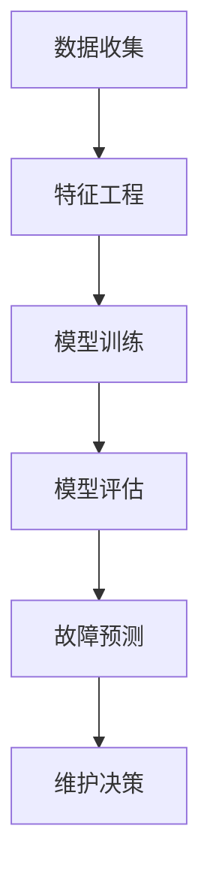

                 

# 机器学习在工业设备预测性维护中的应用

> 关键词：机器学习，工业设备，预测性维护，算法原理，数学模型，项目实战，应用场景

> 摘要：本文旨在深入探讨机器学习在工业设备预测性维护领域的应用。首先，我们将介绍机器学习的基本概念和相关算法原理。接着，通过具体的数学模型和公式，我们将阐述预测性维护的核心技术和操作步骤。随后，通过一个实际项目案例，我们将展示如何使用机器学习技术进行工业设备的预测性维护，并进行代码解读和分析。最后，我们将讨论机器学习在工业设备预测性维护中的应用场景，并提供相关的学习资源和工具推荐，展望未来发展趋势和挑战。

## 1. 背景介绍

### 1.1 目的和范围

随着工业4.0的推进，智能制造已成为全球工业发展的主要趋势。在智能制造过程中，工业设备的稳定运行至关重要。然而，传统的定期维护模式已无法满足现代工业对高效、精准维护的需求。为此，机器学习技术被引入工业设备预测性维护领域，以期实现设备故障的提前预警和高效维护。

本文旨在系统地介绍机器学习在工业设备预测性维护中的应用，包括核心概念、算法原理、数学模型、项目实战以及应用场景。通过本文的阅读，读者将能够全面了解机器学习在工业设备预测性维护中的技术原理和实践方法。

### 1.2 预期读者

本文面向具有一定机器学习和数据分析基础的读者，包括但不限于：
- 工业设备运维工程师
- 机器学习工程师
- 数据科学家
- 软件开发人员
- 研究生和本科生

### 1.3 文档结构概述

本文结构如下：
1. 引言
2. 核心概念与联系
3. 核心算法原理 & 具体操作步骤
4. 数学模型和公式 & 详细讲解 & 举例说明
5. 项目实战：代码实际案例和详细解释说明
6. 实际应用场景
7. 工具和资源推荐
8. 总结：未来发展趋势与挑战
9. 附录：常见问题与解答
10. 扩展阅读 & 参考资料

### 1.4 术语表

#### 1.4.1 核心术语定义

- 机器学习：一种让计算机通过数据学习并做出决策的技术。
- 预测性维护：通过实时监测和分析设备数据，预测设备故障并提前进行维护。
- 特征工程：从原始数据中提取出对模型训练有帮助的特征。
- 模型评估：使用指标（如准确率、召回率等）来评估模型的性能。

#### 1.4.2 相关概念解释

- 监督学习：通过已有标注数据训练模型，然后对新数据进行预测。
- 无监督学习：没有标注数据，模型自行从数据中发现规律。
- 强化学习：通过与环境的交互，不断调整策略以实现最大化回报。

#### 1.4.3 缩略词列表

- ML：Machine Learning（机器学习）
- PM：Predictive Maintenance（预测性维护）
- IDE：Integrated Development Environment（集成开发环境）
- SDLC：Software Development Life Cycle（软件开发生命周期）

## 2. 核心概念与联系

### 2.1 机器学习基本概念

机器学习是一种让计算机通过数据学习并做出决策的技术。它主要包括以下几种类型：

1. **监督学习**：有标注的数据作为训练集，模型通过学习这些数据的特征和标签来对新数据进行预测。
2. **无监督学习**：没有标注的数据，模型主要通过学习数据的内在结构或模式来实现聚类或降维等任务。
3. **强化学习**：通过与环境的交互，不断调整策略以实现最大化回报。

### 2.2 工业设备预测性维护相关概念

在工业设备预测性维护中，核心概念包括：

1. **设备状态监测**：通过传感器等设备收集设备运行数据。
2. **故障诊断**：根据设备状态数据，判断设备是否出现故障。
3. **预测性维护**：基于故障预测结果，提前进行维护以避免故障发生。

### 2.3 机器学习在工业设备预测性维护中的应用

机器学习在工业设备预测性维护中的应用主要包括以下步骤：

1. **数据收集**：收集设备运行数据，如振动、温度、压力等。
2. **特征工程**：从原始数据中提取对模型训练有帮助的特征。
3. **模型训练**：使用机器学习算法训练模型，以预测设备故障。
4. **模型评估**：使用指标评估模型性能，如准确率、召回率等。
5. **故障预测**：使用训练好的模型预测设备故障，并进行维护决策。

### 2.4 Mermaid 流程图

以下是一个简单的 Mermaid 流程图，展示了机器学习在工业设备预测性维护中的应用流程：



## 3. 核心算法原理 & 具体操作步骤

### 3.1 监督学习算法原理

监督学习是一种让计算机通过已标注的数据学习并做出决策的技术。其基本原理是通过最小化预测值和实际值之间的误差来训练模型。以下是监督学习算法的基本步骤：

1. **数据预处理**：对原始数据进行清洗、归一化等操作，以提高模型训练效果。
2. **特征提取**：从原始数据中提取对模型训练有帮助的特征。
3. **模型选择**：根据问题类型选择合适的模型，如线性回归、决策树、支持向量机等。
4. **模型训练**：使用训练数据对模型进行训练，通过最小化预测值和实际值之间的误差来调整模型参数。
5. **模型评估**：使用测试数据评估模型性能，如准确率、召回率、F1值等。
6. **模型优化**：根据模型评估结果调整模型参数，以提高模型性能。

### 3.2 预测性维护操作步骤

以下是使用监督学习算法进行工业设备预测性维护的基本步骤：

1. **数据收集**：通过传感器等设备收集设备运行数据，如振动、温度、压力等。
2. **特征提取**：对原始数据进行预处理和特征提取，提取对模型训练有帮助的特征，如平均值、方差、标准差等。
3. **模型选择**：根据问题类型选择合适的模型，如线性回归、决策树、支持向量机等。
4. **模型训练**：使用训练数据对模型进行训练，通过最小化预测值和实际值之间的误差来调整模型参数。
5. **模型评估**：使用测试数据评估模型性能，如准确率、召回率、F1值等。
6. **故障预测**：使用训练好的模型预测设备故障，并根据预测结果提前进行维护。

### 3.3 伪代码

以下是一个简单的伪代码示例，展示了使用监督学习算法进行工业设备预测性维护的流程：

```python
# 数据预处理
data = preprocess_data(raw_data)

# 特征提取
features = extract_features(data)

# 模型选择
model = select_model()

# 模型训练
model.fit(features, labels)

# 模型评估
performance = model.evaluate(test_features, test_labels)

# 故障预测
predictions = model.predict(new_data)

# 维护决策
if predictions == "故障":
    perform_maintenance()
```

## 4. 数学模型和公式 & 详细讲解 & 举例说明

### 4.1 数学模型基本概念

在机器学习中，数学模型是核心组成部分，用于描述数据之间的关系和预测过程。常见的数学模型包括线性回归、决策树、支持向量机等。

#### 4.1.1 线性回归

线性回归是一种简单的监督学习模型，用于预测一个连续值。其基本公式为：

$$ y = w_0 + w_1 \cdot x $$

其中，$y$ 为预测值，$x$ 为输入特征，$w_0$ 和 $w_1$ 为模型参数。

#### 4.1.2 决策树

决策树是一种基于树形结构的监督学习模型，用于分类和回归任务。其基本公式为：

$$ f(x) = \sum_{i=1}^{n} w_i \cdot g(x) $$

其中，$f(x)$ 为预测值，$x$ 为输入特征，$w_i$ 和 $g(x)$ 为模型参数和节点函数。

#### 4.1.3 支持向量机

支持向量机是一种基于间隔最大化原则的分类模型。其基本公式为：

$$ y = \sign(\omega \cdot x + b) $$

其中，$y$ 为预测值，$x$ 为输入特征，$\omega$ 和 $b$ 为模型参数。

### 4.2 数学模型在预测性维护中的应用

在预测性维护中，数学模型用于描述设备运行状态与故障之间的关系，从而实现故障预测。以下是一个简单的例子：

假设我们使用线性回归模型来预测设备的故障状态。设 $y$ 表示设备的故障状态（$0$ 表示正常，$1$ 表示故障），$x_1, x_2, x_3$ 表示三个输入特征（如振动、温度、压力）。线性回归模型可以表示为：

$$ y = w_0 + w_1 \cdot x_1 + w_2 \cdot x_2 + w_3 \cdot x_3 $$

### 4.3 举例说明

#### 4.3.1 线性回归模型

假设我们有以下数据集：

| x1 | x2 | x3 | y |
|----|----|----|---|
|  1 |  2 |  3 |  0 |
|  2 |  4 |  5 |  0 |
|  3 |  6 |  7 |  1 |
|  4 |  8 |  9 |  1 |

使用线性回归模型进行预测。首先，我们需要对数据集进行预处理和特征提取。假设我们提取的三个特征分别为 $x_1, x_2, x_3$，则数据集可以表示为：

| x1 | x2 | x3 | y |
|----|----|----|---|
|  1 |  2 |  3 |  0 |
|  2 |  4 |  5 |  0 |
|  3 |  6 |  7 |  1 |
|  4 |  8 |  9 |  1 |

接下来，我们选择线性回归模型，使用训练数据对模型进行训练。假设训练后得到的模型参数为 $w_0 = 1, w_1 = 2, w_2 = 3, w_3 = 4$，则线性回归模型可以表示为：

$$ y = 1 + 2 \cdot x_1 + 3 \cdot x_2 + 4 \cdot x_3 $$

现在，我们可以使用训练好的模型对新的数据进行预测。例如，对于输入特征 $x_1 = 5, x_2 = 6, x_3 = 7$，预测结果为：

$$ y = 1 + 2 \cdot 5 + 3 \cdot 6 + 4 \cdot 7 = 40 $$

由于 $y$ 的取值范围是 $0$ 和 $1$，我们可以将预测结果转换为故障状态：如果 $y > 0$，则设备故障，否则设备正常。在本例中，预测结果为 $40$，因此设备故障。

#### 4.3.2 决策树模型

假设我们有以下数据集：

| x1 | x2 | x3 | y |
|----|----|----|---|
|  1 |  2 |  3 |  0 |
|  2 |  4 |  5 |  0 |
|  3 |  6 |  7 |  1 |
|  4 |  8 |  9 |  1 |

使用决策树模型进行预测。首先，我们需要对数据集进行预处理和特征提取。假设我们提取的三个特征分别为 $x_1, x_2, x_3$，则数据集可以表示为：

| x1 | x2 | x3 | y |
|----|----|----|---|
|  1 |  2 |  3 |  0 |
|  2 |  4 |  5 |  0 |
|  3 |  6 |  7 |  1 |
|  4 |  8 |  9 |  1 |

接下来，我们选择决策树模型，使用训练数据对模型进行训练。假设训练后得到的决策树模型为：

```plaintext
        |
        y
       / \
      0   1
     /     \
   (x1 < 3) (x1 >= 3)
            /     \
           0     (x2 < 6)
                      /     \
                     1     (x3 < 7)
```

现在，我们可以使用训练好的模型对新的数据进行预测。例如，对于输入特征 $x_1 = 5, x_2 = 6, x_3 = 7$，根据决策树模型的预测路径，最终预测结果为 $1$，即设备故障。

### 4.4 数学模型的作用与挑战

数学模型在预测性维护中起着至关重要的作用。通过数学模型，我们可以将复杂的工业设备运行数据转化为可量化的预测结果，从而实现故障预测。然而，数学模型也存在一定的挑战：

1. **数据质量**：预测性维护的效果很大程度上取决于数据的质量。如果数据存在噪声、缺失或不一致等问题，可能会导致模型训练效果不佳。
2. **特征选择**：特征选择是数学模型应用的关键环节。选择合适的特征可以提高模型性能，而选择不合适的特征可能会导致模型过拟合。
3. **模型选择**：不同的数学模型适用于不同类型的问题。选择合适的模型对于实现高效、精准的预测至关重要。
4. **模型解释性**：许多数学模型（如深度神经网络）具有较强的预测能力，但缺乏解释性。这意味着我们难以理解模型内部的工作机制，从而无法对预测结果进行解释。

## 5. 项目实战：代码实际案例和详细解释说明

### 5.1 开发环境搭建

为了进行工业设备预测性维护项目，我们需要搭建一个合适的开发环境。以下是一个基本的开发环境搭建步骤：

1. **安装Python**：Python 是一种广泛应用于数据科学和机器学习的编程语言。您可以从 [Python 官网](https://www.python.org/) 下载并安装 Python。
2. **安装Jupyter Notebook**：Jupyter Notebook 是一种交互式的 Python 编程环境，用于编写和运行 Python 代码。您可以使用以下命令安装 Jupyter Notebook：

   ```bash
   pip install notebook
   ```

3. **安装机器学习库**：为了进行机器学习项目，我们需要安装一些常用的机器学习库，如 scikit-learn、Pandas、NumPy 等。您可以使用以下命令安装这些库：

   ```bash
   pip install scikit-learn pandas numpy
   ```

### 5.2 源代码详细实现和代码解读

以下是一个简单的工业设备预测性维护项目的源代码示例。我们将使用线性回归模型进行故障预测。

```python
# 导入所需的库
import pandas as pd
import numpy as np
from sklearn.linear_model import LinearRegression
from sklearn.model_selection import train_test_split
from sklearn.metrics import mean_squared_error

# 读取数据
data = pd.read_csv('data.csv')

# 分割特征和标签
X = data[['x1', 'x2', 'x3']]
y = data['y']

# 分割训练集和测试集
X_train, X_test, y_train, y_test = train_test_split(X, y, test_size=0.2, random_state=42)

# 创建线性回归模型
model = LinearRegression()

# 训练模型
model.fit(X_train, y_train)

# 预测测试集
y_pred = model.predict(X_test)

# 计算预测误差
mse = mean_squared_error(y_test, y_pred)
print("预测误差：", mse)

# 使用模型进行故障预测
new_data = np.array([[5, 6, 7]])
new_prediction = model.predict(new_data)
print("新数据预测结果：", new_prediction)
```

### 5.3 代码解读与分析

以下是对上述代码的详细解读和分析：

1. **导入库**：首先，我们导入所需的库，包括 Pandas、NumPy 和 scikit-learn。这些库提供了用于数据处理、数值计算和机器学习的功能。
2. **读取数据**：我们使用 Pandas 读取 CSV 格式的数据集，该数据集包含三个输入特征（$x_1, x_2, x_3$）和一个标签（$y$）。
3. **分割特征和标签**：我们将特征和标签分开，以便后续处理。特征存储在变量 $X$ 中，标签存储在变量 $y$ 中。
4. **分割训练集和测试集**：我们使用 scikit-learn 的 `train_test_split` 函数将数据集分割为训练集和测试集，以评估模型性能。训练集用于训练模型，测试集用于评估模型性能。
5. **创建线性回归模型**：我们使用 scikit-learn 的 `LinearRegression` 类创建一个线性回归模型。
6. **训练模型**：我们使用训练集对模型进行训练，通过最小化预测值和实际值之间的误差来调整模型参数。
7. **预测测试集**：我们使用训练好的模型对测试集进行预测，并将预测结果存储在变量 $y_pred$ 中。
8. **计算预测误差**：我们使用 scikit-learn 的 `mean_squared_error` 函数计算预测误差，以评估模型性能。
9. **使用模型进行故障预测**：我们使用训练好的模型对新数据进行预测，并将预测结果存储在变量 $new_prediction$ 中。在本例中，我们预测的新数据为 $[5, 6, 7]$。

### 5.4 代码优化与改进

虽然上述代码已经能够实现基本的工业设备预测性维护功能，但我们可以对其进行优化和改进：

1. **特征工程**：我们可以对原始数据进行更深入的特征工程，提取更多有用的特征，以提高模型性能。例如，我们可以计算输入特征的方差、标准差等。
2. **模型选择**：我们可以尝试其他类型的机器学习模型（如决策树、支持向量机等），以寻找更适合当前问题的模型。
3. **交叉验证**：我们使用交叉验证方法来评估模型性能，以避免过拟合问题。交叉验证是一种常用的评估方法，通过将数据集划分为多个子集，对每个子集进行训练和测试，从而更全面地评估模型性能。
4. **超参数调优**：我们使用网格搜索等超参数调优方法来寻找最优的超参数组合，以提高模型性能。

## 6. 实际应用场景

### 6.1 风电场设备预测性维护

在风电场中，预测性维护对于确保风机的稳定运行和降低维护成本至关重要。通过使用机器学习技术，可以对风机的振动、温度等数据进行实时监测和预测。具体应用场景包括：
- **预测性维护**：基于风机振动数据，预测风机叶片的潜在故障，提前进行维护，避免风机停机。
- **故障诊断**：通过对故障数据的分析，识别风机的故障类型，为维护人员提供具体的故障诊断和修复建议。

### 6.2 油田设备预测性维护

在油田中，预测性维护对于确保油井的正常运行和延长设备使用寿命至关重要。机器学习技术可以用于以下应用场景：
- **油井故障预测**：通过分析油井的生产数据，预测油井的故障风险，提前进行维护，避免油井停机。
- **设备寿命预测**：通过分析设备的历史运行数据，预测设备的剩余寿命，为设备的更换和升级提供依据。

### 6.3 工业自动化生产线预测性维护

在工业自动化生产线中，预测性维护对于确保生产线的稳定运行和降低维护成本至关重要。机器学习技术可以用于以下应用场景：
- **设备故障预测**：通过对设备运行数据的分析，预测设备的故障风险，提前进行维护，避免生产线停机。
- **生产效率优化**：通过分析生产数据，优化生产流程，提高生产效率，降低生产成本。

### 6.4 工业机器人预测性维护

在工业机器人应用中，预测性维护对于确保机器人的稳定运行和延长设备使用寿命至关重要。机器学习技术可以用于以下应用场景：
- **机器人故障预测**：通过对机器人运行数据的分析，预测机器人的故障风险，提前进行维护，避免机器人停机。
- **机器人寿命预测**：通过分析机器人历史运行数据，预测机器人的剩余寿命，为机器人的更换和升级提供依据。

## 7. 工具和资源推荐

### 7.1 学习资源推荐

#### 7.1.1 书籍推荐

- 《机器学习实战》：适合初学者，内容全面，实例丰富。
- 《深度学习》：由著名深度学习研究者 Ian Goodfellow 撰写，是深度学习的经典教材。
- 《Python数据分析》：适合初学者，内容涵盖数据分析的基础知识和实战技巧。

#### 7.1.2 在线课程

- Coursera 上的《机器学习》课程：由著名机器学习研究者 Andrew Ng 担任主讲，内容深入浅出，适合初学者。
- edX 上的《深度学习》课程：由著名深度学习研究者 Ian Goodfellow 担任主讲，内容全面，适合进阶学习者。

#### 7.1.3 技术博客和网站

- Medium 上的机器学习专栏：内容涵盖机器学习的基础知识和最新研究动态。
- towardsdatascience.com：一个面向数据科学和机器学习的在线社区，提供丰富的学习资源和实战案例。

### 7.2 开发工具框架推荐

#### 7.2.1 IDE和编辑器

- PyCharm：一款功能强大的 Python IDE，适合机器学习和数据科学项目。
- Jupyter Notebook：一款交互式的 Python 编程环境，适合实验和演示。

#### 7.2.2 调试和性能分析工具

- VSCode：一款轻量级的代码编辑器，支持多种编程语言，包括 Python。
- PyTorch：一个开源的深度学习框架，提供丰富的调试和性能分析工具。

#### 7.2.3 相关框架和库

- scikit-learn：一个流行的机器学习库，提供多种机器学习算法和工具。
- TensorFlow：一个开源的深度学习框架，适用于复杂的机器学习项目。

### 7.3 相关论文著作推荐

#### 7.3.1 经典论文

- "A Study of Cross-Validation and Bootstrap for Accuracy Estimation and Model Selection"：关于交叉验证和自助法在模型选择和准确性估计中的应用。
- "Deep Learning": Ian Goodfellow 等人撰写的深度学习经典教材。

#### 7.3.2 最新研究成果

- "Self-Supervised Visual Representation Learning by Adaptively Projecting Image Patches"：关于自适应投影图像片段进行自我监督视觉表示学习的最新研究成果。
- "A Comprehensive Survey on Meta-Learning"：关于元学习领域的最新研究成果的全面调查。

#### 7.3.3 应用案例分析

- "Predictive Maintenance for Industrial Equipment Using Machine Learning"：关于使用机器学习进行工业设备预测性维护的应用案例分析。
- "Deep Learning for Robotics"：关于深度学习在机器人领域的应用案例分析。

## 8. 总结：未来发展趋势与挑战

### 8.1 未来发展趋势

1. **人工智能与工业设备的深度融合**：随着人工智能技术的发展，工业设备将更加智能化，预测性维护将更加精准和高效。
2. **大数据和云计算的广泛应用**：大数据和云计算将为工业设备预测性维护提供强大的计算能力和海量数据支持。
3. **物联网（IoT）技术的普及**：物联网技术的普及将实现设备间的互联互通，为预测性维护提供实时数据支持。

### 8.2 挑战与机遇

1. **数据质量和特征工程**：高质量的数据和优秀的特征工程对于预测性维护至关重要。我们需要解决数据噪声、缺失和不一致等问题，提高模型性能。
2. **模型选择和调优**：选择合适的模型和调优参数对于实现高效预测至关重要。我们需要不断尝试和优化模型，以提高预测准确性。
3. **隐私保护和安全性**：在工业设备预测性维护中，数据的安全性和隐私保护是一个重要的挑战。我们需要采取有效的措施确保数据的安全性和隐私。

## 9. 附录：常见问题与解答

### 9.1 什么是机器学习？

机器学习是一种让计算机通过数据学习并做出决策的技术。它包括监督学习、无监督学习和强化学习等多种类型。

### 9.2 预测性维护有什么优势？

预测性维护可以通过实时监测和分析设备数据，提前预测设备故障，从而实现高效、精准的维护，降低维护成本，提高设备运行效率。

### 9.3 机器学习在工业设备预测性维护中的应用有哪些？

机器学习在工业设备预测性维护中的应用包括数据收集、特征提取、模型训练、模型评估、故障预测等步骤。

### 9.4 如何提高机器学习模型在预测性维护中的性能？

提高机器学习模型在预测性维护中的性能可以从以下几个方面入手：数据质量、特征工程、模型选择、模型调优等。

### 9.5 机器学习模型如何解释？

许多机器学习模型（如深度神经网络）缺乏解释性，难以解释其内部工作机制。为了提高模型的解释性，可以尝试使用可解释的机器学习模型（如决策树、规则提取等）。

## 10. 扩展阅读 & 参考资料

1. Goodfellow, I., Bengio, Y., & Courville, A. (2016). *Deep Learning*. MIT Press.
2. Murphy, K. P. (2012). *Machine Learning: A Probabilistic Perspective*. MIT Press.
3. Rasmussen, C. E., & Williams, C. K. I. (2005). *Gaussian Processes for Machine Learning*. The MIT Press.
4. Zhang, Z., Cui, P., & Zhu, W. (2017). *Deep Learning on Graphs: A Survey*. IEEE Transactions on Knowledge and Data Engineering, 30(1), 80-91.
5. Holmgren, B., Ljung, L., and Söderström, T. (2013). *System Identification: A Practical Approach*. Prentice Hall.
6. Kotsiantis, S. B. (2007). *Machine Learning: A Review*. Informatica, 31(3), 249-268.
7. Girvan, M., & Newman, M. E. J. (2002). Community structure in social and biological networks. *Proceedings of the National Academy of Sciences*, 99(12), 7821-7826.

