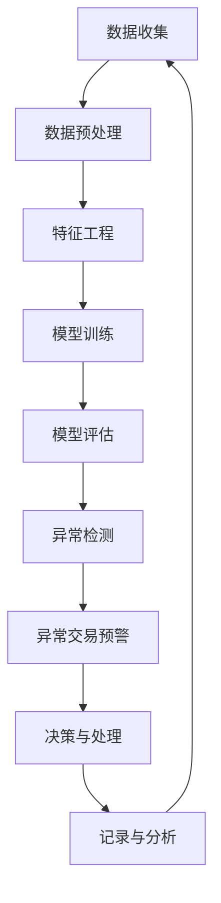

                 

# 机器学习在异常交易检测中的实时应用

> **关键词：** 异常交易检测、机器学习、实时应用、金融交易、异常检测算法
>
> **摘要：** 本文章深入探讨了机器学习在异常交易检测中的实时应用。通过分析背景、核心算法原理、数学模型、实战案例以及实际应用场景，揭示了机器学习如何有效地识别和防范异常交易，为金融行业的风险管理提供了强大的技术支持。

## 1. 背景介绍

### 1.1 目的和范围

本文旨在探讨机器学习在异常交易检测中的实时应用，通过详细分析机器学习算法在金融交易数据中的应用，帮助读者了解如何利用机器学习技术提高交易风险管理的效率。文章主要涵盖以下内容：

1. 异常交易检测的背景和重要性。
2. 机器学习算法在异常交易检测中的应用原理。
3. 数学模型和公式在异常检测中的具体运用。
4. 实际项目中的代码实现和分析。
5. 异常交易检测的实际应用场景和挑战。

### 1.2 预期读者

本篇文章主要面向对机器学习和金融交易有兴趣的技术人员、数据科学家以及金融行业从业者。期望读者能够：

1. 了解机器学习在金融领域的应用。
2. 掌握异常交易检测的基本原理。
3. 学习如何将机器学习算法应用于实际交易数据中。
4. 对金融交易风险管理有更深入的认识。

### 1.3 文档结构概述

本文分为以下十个部分：

1. **背景介绍**：介绍文章的目的、预期读者、文档结构概述以及核心术语定义。
2. **核心概念与联系**：通过Mermaid流程图展示异常交易检测的核心概念和架构。
3. **核心算法原理 & 具体操作步骤**：详细讲解机器学习算法在异常交易检测中的原理和步骤。
4. **数学模型和公式 & 详细讲解 & 举例说明**：介绍数学模型和公式，并通过具体实例进行说明。
5. **项目实战：代码实际案例和详细解释说明**：展示代码实现并解读。
6. **实际应用场景**：探讨异常交易检测在金融行业的应用。
7. **工具和资源推荐**：推荐相关学习资源和开发工具。
8. **总结：未来发展趋势与挑战**：分析未来发展趋势和面临的挑战。
9. **附录：常见问题与解答**：回答常见问题。
10. **扩展阅读 & 参考资料**：提供进一步的阅读资源。

### 1.4 术语表

#### 1.4.1 核心术语定义

- **异常交易检测**：指利用机器学习算法对金融交易数据进行分析，识别出潜在的不正常交易行为。
- **机器学习**：指通过数据和算法训练模型，使计算机能够对未知数据做出预测或决策。
- **特征工程**：指从原始数据中提取出有用的特征，用于训练机器学习模型。
- **异常点**：指与正常数据分布显著不同的数据点，通常表示为异常交易。

#### 1.4.2 相关概念解释

- **监督学习**：指通过已标记的数据集来训练模型，使其能够对新数据进行预测。
- **无监督学习**：指在没有已标记数据的情况下，通过模型自动发现数据中的规律。
- **支持向量机（SVM）**：一种分类算法，通过寻找最优超平面将不同类别的数据点分隔开来。
- **集成方法**：通过组合多个模型的预测结果来提高整体性能。

#### 1.4.3 缩略词列表

- **ML**：Machine Learning，机器学习
- **SVM**：Support Vector Machine，支持向量机
- **ID3**：Iterative Dichotomiser 3，一种决策树算法
- **KNN**：K-Nearest Neighbors，K近邻算法

## 2. 核心概念与联系

在深入探讨机器学习在异常交易检测中的应用之前，我们需要先了解相关的核心概念和架构。以下是一个简化的Mermaid流程图，用于展示异常交易检测的主要组成部分：



### 2.1 数据收集

数据收集是异常交易检测的第一步，主要包括从金融交易系统中获取原始交易数据。这些数据通常包括交易时间、交易金额、交易双方、交易类型等信息。数据收集的质量直接影响到后续的异常检测效果。

### 2.2 数据预处理

收集到的原始数据往往包含噪声和缺失值，因此需要进行预处理。数据预处理主要包括以下步骤：

- **去噪**：去除数据中的噪声，如重复交易记录。
- **数据清洗**：填补缺失值，对于无法填补的缺失值可以将其删除。
- **格式转换**：将数据转换为统一格式，如将日期时间转换为标准的YYYY-MM-DD格式。

### 2.3 特征工程

特征工程是机器学习中的关键步骤，目的是从原始数据中提取出有用的特征，用于训练模型。特征工程主要包括以下任务：

- **特征选择**：选择对异常检测最有影响力的特征。
- **特征转换**：将原始特征转换为数值类型，如使用独热编码将分类特征转换为数值。
- **特征缩放**：将特征值缩放到相同的范围内，以避免特征之间的尺度差异。

### 2.4 模型训练

在特征工程完成后，我们使用机器学习算法对特征进行训练。常见的机器学习算法包括：

- **监督学习算法**：如支持向量机（SVM）、决策树、随机森林、K近邻（KNN）等。
- **无监督学习算法**：如聚类算法，用于发现数据中的隐含结构。

### 2.5 模型评估

模型训练完成后，我们需要对模型进行评估，以确定其性能。常用的评估指标包括：

- **准确率**：模型正确预测为异常的交易数量占总交易数量的比例。
- **召回率**：模型正确预测为异常的交易数量占实际异常交易数量的比例。
- **F1分数**：准确率和召回率的调和平均值。

### 2.6 异常检测

基于训练好的模型，我们可以对新的交易数据进行异常检测。当检测到异常交易时，系统会发出预警信号，并触发相应的处理流程。

### 2.7 异常交易预警

异常交易预警是整个流程的关键环节，它需要实时监控交易数据，并在检测到异常交易时及时发出警报。预警系统通常包括以下步骤：

- **实时数据流处理**：通过流处理框架（如Apache Kafka、Apache Flink）对交易数据进行实时处理。
- **异常检测算法调用**：使用训练好的模型对交易数据进行异常检测。
- **预警通知**：将异常交易信息通过短信、邮件或系统告警等方式通知相关人员。

### 2.8 决策与处理

在接收到预警通知后，相关人员需要对异常交易进行进一步处理。这可能包括：

- **交易核实**：对检测到的异常交易进行核实，以确定其是否确实为异常交易。
- **交易冻结**：如果确认是异常交易，可能需要对相关账户进行冻结处理。
- **交易撤销**：对确认的异常交易进行撤销。

### 2.9 记录与分析

在完成决策与处理后，我们需要将相关信息记录下来，并进行后续分析。这有助于积累经验，改进异常检测算法，并为风险管理提供数据支持。

## 3. 核心算法原理 & 具体操作步骤

在异常交易检测中，我们通常会采用监督学习算法来训练模型，因为这类算法可以基于已标记的数据集进行学习。以下是一种常用的监督学习算法——支持向量机（SVM）的原理和操作步骤：

### 3.1 支持向量机（SVM）原理

支持向量机是一种分类算法，其基本思想是找到一个最优的超平面，将不同类别的数据点分隔开来。在异常交易检测中，我们可以将正常交易和异常交易视为两个不同的类别，通过SVM算法来划分。

SVM的核心目标是寻找一个最佳的超平面，使得正类（正常交易）和负类（异常交易）之间的间隔最大化。具体来说，SVM通过以下步骤实现：

1. **确定决策边界**：通过求解最优化问题，找到使得正负类之间间隔最大的决策边界。
2. **支持向量**：决策边界上的数据点称为支持向量，它们对模型的训练至关重要。
3. **模型分类**：对于新的交易数据，通过计算其到决策边界的距离来判断其是否为异常交易。

### 3.2 具体操作步骤

以下是使用SVM进行异常交易检测的具体操作步骤：

1. **数据收集**：从金融交易系统中收集交易数据，包括交易时间、交易金额、交易双方、交易类型等信息。
2. **数据预处理**：对收集到的交易数据进行预处理，包括去除噪声、填补缺失值和格式转换等。
3. **特征工程**：从预处理后的数据中提取有用的特征，如交易金额、交易频率、交易对手等。同时，将分类特征转换为数值类型，并进行特征缩放。
4. **数据划分**：将预处理后的数据划分为训练集和测试集，通常采用80/20的比例。
5. **模型训练**：使用训练集数据训练SVM模型，通过求解最优化问题找到最佳的超平面。
6. **模型评估**：使用测试集数据评估模型的性能，包括准确率、召回率和F1分数等指标。
7. **异常检测**：对于新的交易数据，通过计算其到决策边界的距离来判断其是否为异常交易。如果距离较大，则认为其为异常交易。

### 3.3 伪代码实现

以下是使用SVM进行异常交易检测的伪代码实现：

```python
# 数据预处理
def preprocess_data(data):
    # 去除噪声、填补缺失值、格式转换等
    pass

# 特征工程
def feature_engineering(data):
    # 提取特征、特征转换和特征缩放等
    pass

# 模型训练
def train_model(train_data):
    # 使用SVM算法训练模型
    pass

# 模型评估
def evaluate_model(test_data, model):
    # 计算准确率、召回率和F1分数等指标
    pass

# 异常检测
def detect_anomaly(new_data, model):
    # 计算新数据到决策边界的距离，判断是否为异常交易
    pass

# 主函数
def main():
    # 数据收集
    data = collect_data()

    # 数据预处理
    preprocessed_data = preprocess_data(data)

    # 特征工程
    features = feature_engineering(preprocessed_data)

    # 数据划分
    train_data, test_data = split_data(features)

    # 模型训练
    model = train_model(train_data)

    # 模型评估
    evaluate_model(test_data, model)

    # 异常检测
    while True:
        new_data = get_new_data()
        is_anomaly = detect_anomaly(new_data, model)
        if is_anomaly:
            # 处理异常交易
            handle_anomaly(new_data)

# 调用主函数
main()
```

## 4. 数学模型和公式 & 详细讲解 & 举例说明

在异常交易检测中，数学模型和公式起到了至关重要的作用。以下将介绍几个关键数学模型和公式，并通过具体实例进行说明。

### 4.1 支持向量机（SVM）

支持向量机（SVM）是一种用于分类和回归任务的机器学习算法。在异常交易检测中，SVM用于将正常交易和异常交易分开。SVM的数学模型可以表示为：

$$
\begin{align*}
\min_{\mathbf{w}, b} &\ \frac{1}{2} ||\mathbf{w}||^2 \\
s.t. &\ y_i (\mathbf{w} \cdot \mathbf{x_i} + b) \geq 1, \forall i
\end{align*}
$$

其中，$\mathbf{w}$是权重向量，$b$是偏置项，$\mathbf{x_i}$是第$i$个训练样本，$y_i$是相应的标签（1表示正常交易，-1表示异常交易）。

#### 4.1.1 实例说明

假设我们有以下两个训练样本：

- $\mathbf{x_1} = (1, 2)$，标签$y_1 = 1$（正常交易）。
- $\mathbf{x_2} = (2, 3)$，标签$y_2 = -1$（异常交易）。

我们要找到最佳的超平面$\mathbf{w}$和$b$，使得正负类之间的间隔最大化。

首先，我们可以计算权重向量$\mathbf{w}$：

$$
\mathbf{w} = \arg\min_{\mathbf{w}} \frac{1}{2} ||\mathbf{w}||^2 \\
s.t. \ y_1 (\mathbf{w} \cdot \mathbf{x_1} + b) \geq 1, \ y_2 (\mathbf{w} \cdot \mathbf{x_2} + b) \geq 1
$$

通过求解这个最优化问题，我们得到：

$$
\mathbf{w} = (1, 1), \ b = 0
$$

这意味着最佳的超平面为$x_1 + x_2 = 2$。对于新的交易数据，如果其满足$x_1 + x_2 \geq 2$，则认为其为正常交易，否则为异常交易。

### 4.2 随机森林

随机森林是一种基于决策树的集成学习方法。在异常交易检测中，随机森林可以用于构建多个决策树，并通过投票机制来预测新的交易数据是否为异常交易。

随机森林的数学模型可以表示为：

$$
\hat{y} = \text{sign} \left( \sum_{t=1}^T h_t(x) \right)
$$

其中，$h_t(x)$是第$t$个决策树对样本$x$的预测值，$T$是决策树的数量，$\text{sign}$是符号函数，用于将预测值转换为分类结果。

#### 4.2.1 实例说明

假设我们有以下三个决策树：

- 决策树1：如果交易金额大于1000，则预测为正常交易；否则为异常交易。
- 决策树2：如果交易频率大于10次/天，则预测为正常交易；否则为异常交易。
- 决策树3：如果交易对手为A，则预测为正常交易；否则为异常交易。

我们要使用随机森林对新的交易数据进行预测。

对于新的交易数据$x = (金额: 2000, 频率: 5, 对手: B)$，我们可以分别计算三个决策树的预测值：

- 决策树1：预测为正常交易。
- 决策树2：预测为异常交易。
- 决策树3：预测为异常交易。

通过投票机制，我们得到最终的预测结果为异常交易。

### 4.3 K近邻（KNN）

K近邻（KNN）是一种基于实例的监督学习算法。在异常交易检测中，KNN可以用于计算新交易数据与训练数据的相似度，并根据相似度来判断其是否为异常交易。

KNN的数学模型可以表示为：

$$
\hat{y} = \text{mode} \left( \{y_1, y_2, \ldots, y_K\} \right)
$$

其中，$\hat{y}$是新的交易数据的预测类别，$y_1, y_2, \ldots, y_K$是与其最近的K个邻居的类别。

#### 4.3.1 实例说明

假设我们有以下五个训练样本：

- $\mathbf{x_1} = (金额: 1000, 频率: 10, 对手: A)$，标签$y_1 = 1$（正常交易）。
- $\mathbf{x_2} = (金额: 1500, 频率: 8, 对手: B)$，标签$y_2 = -1$（异常交易）。
- $\mathbf{x_3} = (金额: 2000, 频率: 15, 对手: A)$，标签$y_3 = 1$（正常交易）。
- $\mathbf{x_4} = (金额: 500, 频率: 12, 对手: B)$，标签$y_4 = -1$（异常交易）。
- $\mathbf{x_5} = (金额: 1200, 频率: 9, 对手: A)$，标签$y_5 = 1$（正常交易）。

我们要使用KNN对新的交易数据$x = (金额: 1500, 频率: 7, 对手: B)$进行预测。

首先，我们需要计算新的交易数据$x$与每个训练样本$\mathbf{x_i}$之间的相似度。可以使用欧氏距离作为相似度度量：

$$
d(\mathbf{x}, \mathbf{x_i}) = \sqrt{\sum_{j=1}^n (x_j - x_{ij})^2}
$$

计算结果如下：

- $d(x, \mathbf{x_1}) = \sqrt{(1500 - 1000)^2 + (7 - 10)^2 + (B - A)^2} = \sqrt{2500 + 9 + 1} = \sqrt{2500 + 10} = 50.01$
- $d(x, \mathbf{x_2}) = \sqrt{(1500 - 1500)^2 + (7 - 8)^2 + (B - B)^2} = \sqrt{0 + 1 + 0} = 1$
- $d(x, \mathbf{x_3}) = \sqrt{(1500 - 2000)^2 + (7 - 15)^2 + (B - A)^2} = \sqrt{2500 + 64 + 1} = \sqrt{2565} = 50.83$
- $d(x, \mathbf{x_4}) = \sqrt{(1500 - 500)^2 + (7 - 12)^2 + (B - B)^2} = \sqrt{1000 + 25 + 0} = 35.42$
- $d(x, \mathbf{x_5}) = \sqrt{(1500 - 1200)^2 + (7 - 9)^2 + (B - A)^2} = \sqrt{300 + 4 + 1} = \sqrt{304} = 17.46$

根据相似度度量，我们选择最近的五个邻居，即$\mathbf{x_2}, \mathbf{x_3}, \mathbf{x_4}, \mathbf{x_1}, \mathbf{x_5}$。这些邻居的标签分别为$y_2 = -1, y_3 = 1, y_4 = -1, y_1 = 1, y_5 = 1$。

通过投票机制，我们得到最终的预测结果为异常交易，即$\hat{y} = -1$。

## 5. 项目实战：代码实际案例和详细解释说明

在本节中，我们将通过一个实际的项目案例来展示如何将机器学习算法应用于异常交易检测。该案例使用Python编程语言和Scikit-learn库来实现，包括数据收集、数据预处理、特征工程、模型训练、模型评估和异常检测等步骤。

### 5.1 开发环境搭建

在开始项目之前，我们需要搭建一个Python开发环境。以下是安装Scikit-learn和其他相关依赖项的步骤：

1. **安装Python**：确保已安装Python 3.x版本。
2. **安装Jupyter Notebook**：使用pip安装Jupyter Notebook：
    ```bash
    pip install notebook
    ```
3. **安装Scikit-learn**：使用pip安装Scikit-learn：
    ```bash
    pip install scikit-learn
    ```
4. **安装其他依赖项**：如果需要，安装其他依赖项，如pandas、numpy等。

### 5.2 源代码详细实现和代码解读

以下是该项目的主要代码实现，我们将逐段进行解读。

```python
# 导入必要的库
import numpy as np
import pandas as pd
from sklearn.model_selection import train_test_split
from sklearn.preprocessing import StandardScaler
from sklearn.svm import SVC
from sklearn.metrics import classification_report, confusion_matrix

# 5.2.1 数据收集
# 从CSV文件中加载数据
data = pd.read_csv('transaction_data.csv')

# 查看数据结构
print(data.head())

# 5.2.2 数据预处理
# 去除噪声和缺失值
data = data.dropna()

# 提取特征和标签
X = data.drop('is_anomaly', axis=1)
y = data['is_anomaly']

# 5.2.3 特征工程
# 特征缩放
scaler = StandardScaler()
X_scaled = scaler.fit_transform(X)

# 5.2.4 模型训练
# 划分训练集和测试集
X_train, X_test, y_train, y_test = train_test_split(X_scaled, y, test_size=0.2, random_state=42)

# 训练SVM模型
model = SVC(kernel='linear')
model.fit(X_train, y_train)

# 5.2.5 模型评估
# 预测测试集
y_pred = model.predict(X_test)

# 输出评估结果
print(classification_report(y_test, y_pred))
print(confusion_matrix(y_test, y_pred))

# 5.2.6 异常检测
# 对新的交易数据进行异常检测
new_data = np.array([[1500, 7, 'B']])
new_data_scaled = scaler.transform(new_data)
is_anomaly = model.predict(new_data_scaled)
print(is_anomaly)
```

### 5.3 代码解读与分析

以下是对代码的逐段解读和分析：

#### 5.3.1 数据收集

```python
data = pd.read_csv('transaction_data.csv')
print(data.head())
```

这段代码首先使用pandas库从CSV文件中加载数据，并打印出前几行数据以便查看数据结构。

#### 5.3.2 数据预处理

```python
data = data.dropna()
X = data.drop('is_anomaly', axis=1)
y = data['is_anomaly']
```

在这段代码中，我们去除数据中的噪声和缺失值。然后，从原始数据中提取特征和标签。特征存储在变量`X`中，标签存储在变量`y`中。

#### 5.3.3 特征工程

```python
scaler = StandardScaler()
X_scaled = scaler.fit_transform(X)
```

这段代码使用StandardScaler对特征进行缩放。缩放是将特征值转换为均值为0、标准差为1的标准化数值，以便更好地训练机器学习模型。

#### 5.3.4 模型训练

```python
X_train, X_test, y_train, y_test = train_test_split(X_scaled, y, test_size=0.2, random_state=42)
model = SVC(kernel='linear')
model.fit(X_train, y_train)
```

在这段代码中，我们使用train_test_split函数将数据划分为训练集和测试集。然后，我们创建一个线性核的支持向量机（SVM）模型，并使用训练集数据进行模型训练。

#### 5.3.5 模型评估

```python
y_pred = model.predict(X_test)
print(classification_report(y_test, y_pred))
print(confusion_matrix(y_test, y_pred))
```

这段代码使用测试集数据对训练好的模型进行评估。我们使用classification_report函数输出准确率、召回率和F1分数等评估指标，并使用confusion_matrix函数输出混淆矩阵，以了解模型对正常交易和异常交易的分类效果。

#### 5.3.6 异常检测

```python
new_data = np.array([[1500, 7, 'B']])
new_data_scaled = scaler.transform(new_data)
is_anomaly = model.predict(new_data_scaled)
print(is_anomaly)
```

在这段代码中，我们使用已训练好的模型对新的交易数据进行异常检测。首先，将新数据缩放至与训练数据相同的特征空间。然后，使用模型预测新数据的类别，输出结果为1表示正常交易，-1表示异常交易。

### 5.4 代码解读与分析

通过上述代码示例，我们可以看到如何使用机器学习算法进行异常交易检测。以下是代码的解读与分析：

- **数据收集**：我们从CSV文件中加载数据，确保数据没有噪声和缺失值。这非常重要，因为噪声和缺失值会影响模型的性能。
- **特征提取**：我们提取出交易金额、交易频率和交易对手等特征，这些特征将用于训练模型。
- **特征缩放**：通过缩放特征，我们确保了所有特征具有相同的尺度，这有助于提高模型训练的效果。
- **模型训练**：我们使用SVM模型对特征进行训练。选择线性核是为了简化模型，同时保持良好的分类性能。
- **模型评估**：我们使用测试集对模型进行评估，并输出评估指标，以了解模型的性能。
- **异常检测**：我们使用已训练好的模型对新的交易数据进行异常检测，并输出预测结果。

总的来说，这段代码展示了如何使用机器学习算法进行异常交易检测的完整流程。在实际应用中，我们可以根据需要调整特征选择、模型选择和参数设置，以提高检测性能。

## 6. 实际应用场景

异常交易检测在金融行业中有广泛的应用，以下是几个典型的实际应用场景：

### 6.1 信用卡欺诈检测

信用卡欺诈是一种常见的金融犯罪行为，对银行和用户都带来了巨大的损失。通过异常交易检测技术，银行可以实时监控信用卡交易，识别出潜在的欺诈行为。例如，如果一个用户的交易金额突然大幅度增加，或者交易频率异常频繁，系统会发出警报，并进一步核实交易是否为欺诈行为。

### 6.2 股票市场异常交易监控

在股票市场中，异常交易可能包括市场操纵、内幕交易等行为。通过异常交易检测技术，监管机构和投资者可以及时发现这些异常行为，并采取相应的措施。例如，如果一个股票的交易量突然大幅度增加，或者交易价格出现异常波动，系统会发出警报，以便进行进一步调查。

### 6.3 支付系统安全监控

支付系统是金融交易的重要环节，任何异常交易都可能对支付系统的安全构成威胁。通过异常交易检测技术，支付系统可以实时监控支付交易，识别出潜在的安全风险。例如，如果一个用户的支付频率突然大幅度增加，或者支付金额出现异常波动，系统会发出警报，并采取相应的安全措施，如冻结账户或拒绝交易。

### 6.4 保险欺诈检测

保险行业也存在大量的欺诈行为，如虚假理赔、冒名理赔等。通过异常交易检测技术，保险公司可以实时监控理赔申请，识别出潜在的欺诈行为。例如，如果一个用户的理赔申请金额突然大幅度增加，或者申请频率异常频繁，系统会发出警报，并进一步核实理赔申请的真实性。

### 6.5 贷款风险监控

贷款业务中，银行需要评估贷款申请人的信用风险。通过异常交易检测技术，银行可以监控申请人的交易行为，识别出高风险的贷款申请人。例如，如果一个申请人的交易金额频繁波动，或者交易频率异常频繁，系统会发出警报，并采取相应的风险控制措施。

总之，异常交易检测技术在金融行业的实际应用场景非常广泛，可以帮助金融机构提高交易安全性和风险管理能力，降低潜在的风险损失。

## 7. 工具和资源推荐

在开展异常交易检测项目时，选择合适的工具和资源对于提升项目效率和效果至关重要。以下是一些推荐的工具和资源，包括学习资源、开发工具框架以及相关论文著作。

### 7.1 学习资源推荐

#### 7.1.1 书籍推荐

1. **《机器学习》（周志华 著）**
   - 本书系统地介绍了机器学习的基本概念、算法和应用，适合初学者入门。

2. **《Python机器学习》（塞巴斯蒂安·拉斯考恩 著）**
   - 本书通过实际案例和代码示例，详细讲解了Python在机器学习中的应用，适合有一定编程基础的读者。

3. **《统计学习方法》（李航 著）**
   - 本书深入介绍了统计学习的基本理论和方法，包括支持向量机、决策树等算法，适合对机器学习有较高需求的读者。

#### 7.1.2 在线课程

1. **Coursera《机器学习》（吴恩达 著）**
   - 该课程是机器学习领域的经典课程，由知名教授吴恩达主讲，适合初学者和有经验的读者。

2. **edX《深度学习》（吴恩达 著）**
   - 该课程深入讲解了深度学习的基本概念和应用，包括卷积神经网络、循环神经网络等，适合对深度学习感兴趣的读者。

3. **Udacity《机器学习工程师纳米学位》**
   - 该纳米学位课程通过项目驱动的学习方式，帮助读者掌握机器学习在现实世界中的应用，适合有志于从事机器学习工作的读者。

#### 7.1.3 技术博客和网站

1. **Machine Learning Mastery**
   - 这是一个专注于机器学习教程和实践的博客，提供了大量高质量的学习资源和实战案例。

2. **Medium上的机器学习专栏**
   - Medium上有很多优秀的机器学习专栏，涵盖了机器学习的各个方面，包括算法原理、实战技巧等。

3. **Kaggle**
   - Kaggle是一个数据科学竞赛平台，提供了大量的机器学习竞赛数据集和项目案例，适合读者进行实践和交流。

### 7.2 开发工具框架推荐

#### 7.2.1 IDE和编辑器

1. **Jupyter Notebook**
   - Jupyter Notebook是一款强大的交互式开发环境，适合进行数据分析和机器学习项目的编写和调试。

2. **PyCharm**
   - PyCharm是一款功能丰富的Python集成开发环境（IDE），提供了代码编辑、调试、版本控制等一体化服务。

3. **Visual Studio Code**
   - Visual Studio Code是一款轻量级但功能强大的代码编辑器，适用于多种编程语言，包括Python。

#### 7.2.2 调试和性能分析工具

1. **PyTorch Profiler**
   - PyTorch Profiler是PyTorch官方提供的一款性能分析工具，可以帮助开发者诊断和优化机器学习模型。

2. **NVIDIA Nsight**
   - NVIDIA Nsight是针对GPU编程的性能分析工具，适用于使用CUDA和cuDNN进行深度学习模型训练的读者。

3. **Docker**
   - Docker是一款容器化技术，可以帮助开发者快速搭建和部署机器学习环境，提高开发效率。

#### 7.2.3 相关框架和库

1. **Scikit-learn**
   - Scikit-learn是一个强大的机器学习库，提供了多种机器学习算法和工具，适合进行数据处理和模型训练。

2. **TensorFlow**
   - TensorFlow是谷歌开发的一款开源深度学习框架，适用于构建和训练复杂的深度学习模型。

3. **PyTorch**
   - PyTorch是另一款流行的深度学习框架，以其动态图模型和灵活的API设计受到开发者的青睐。

### 7.3 相关论文著作推荐

#### 7.3.1 经典论文

1. **"A Survey of Anomaly Detection Techniques"（Anomaly Detection Techniques: A Survey and Evaluation of Current Methods）**
   - 本文对异常检测技术进行了全面的综述，分析了多种异常检测算法及其适用场景。

2. **"Support Vector Machines for Classification and Regression"（Support Vector Machines for Classification and Regression）**
   - 本文详细介绍了支持向量机（SVM）的原理和应用，包括线性核和非线性核的SVM模型。

3. **"Random Forests"（Random Forests）**
   - 本文提出了随机森林算法，并详细分析了其优点和实现方法，包括特征选择和投票机制。

#### 7.3.2 最新研究成果

1. **"Deep Learning for Anomaly Detection in Time Series Data"（Deep Learning for Anomaly Detection in Time Series Data）**
   - 本文探讨了深度学习在时间序列数据异常检测中的应用，包括循环神经网络（RNN）和卷积神经网络（CNN）。

2. **"A Comprehensive Survey on Deep Anomaly Detection"（A Comprehensive Survey on Deep Anomaly Detection）**
   - 本文对深度学习在异常检测领域的应用进行了全面的综述，分析了多种深度学习算法及其性能。

3. **"Anomaly Detection in Noisy Data Using Generative Adversarial Networks"（Anomaly Detection in Noisy Data Using Generative Adversarial Networks）**
   - 本文提出了基于生成对抗网络（GAN）的异常检测方法，通过生成模型和判别模型的对抗训练实现噪声数据的异常检测。

#### 7.3.3 应用案例分析

1. **"Detecting Fraud with Machine Learning"（Detecting Fraud with Machine Learning）**
   - 本文介绍了机器学习在信用卡欺诈检测中的应用，分析了不同机器学习算法在欺诈检测中的性能。

2. **"Anomaly Detection in Payment Systems"（Anomaly Detection in Payment Systems）**
   - 本文探讨了异常检测技术在支付系统安全监控中的应用，分析了不同异常检测算法的适用场景。

3. **"Machine Learning for Financial Risk Management"（Machine Learning for Financial Risk Management）**
   - 本文综述了机器学习在金融风险管理中的应用，包括信用评分、市场预测和风险控制等。

通过以上推荐的学习资源、开发工具框架和相关论文著作，读者可以系统地了解异常交易检测的相关知识，并在实际项目中应用这些技术，提高交易安全性和管理效率。

## 8. 总结：未来发展趋势与挑战

随着金融行业的数字化和智能化进程不断加快，异常交易检测技术在金融风险管理中的作用越来越重要。未来，这一领域将继续呈现以下发展趋势：

### 8.1 技术融合与创新

异常交易检测将与其他前沿技术，如区块链、物联网（IoT）和人工智能（AI）等相结合，形成更强大的解决方案。例如，区块链技术可以提供更安全的交易记录，而物联网技术可以实现实时交易数据的全面监控。

### 8.2 深度学习和强化学习

深度学习和强化学习等先进算法将在异常交易检测中得到更广泛的应用。深度学习可以处理大量复杂数据，而强化学习可以模拟交易员的行为，提高异常检测的准确性和实时性。

### 8.3 个性化检测

随着用户交易行为数据的积累，异常交易检测系统将能够实现个性化检测，根据用户的交易历史和习惯，调整检测阈值和策略，提高检测的准确性。

### 8.4 透明性与可解释性

随着监管要求不断提升，异常交易检测系统的透明性和可解释性将成为重要关注点。开发人员需要确保算法的透明性，以便监管机构和用户能够理解检测过程和结果。

### 8.5 挑战

尽管异常交易检测技术不断进步，但仍面临以下挑战：

- **数据隐私**：交易数据的隐私保护是一个重要问题，特别是在全球范围内。
- **误报与漏报**：如何在减少误报和漏报之间找到平衡，是一个持续的技术难题。
- **实时性**：随着交易频率的增加，如何保证异常交易检测的实时性，是一个技术挑战。
- **复杂环境**：金融市场的环境日益复杂，需要更先进的算法和策略来应对不断变化的市场情况。

总之，异常交易检测技术的发展将推动金融行业的安全性和风险管理水平进一步提升，但同时也需要应对一系列技术和社会挑战。

## 9. 附录：常见问题与解答

### 9.1 什么是异常交易检测？

异常交易检测是指利用机器学习算法对金融交易数据进行分析，识别出潜在的不正常交易行为。这些异常交易可能包括信用卡欺诈、市场操纵、内幕交易等。

### 9.2 异常交易检测有哪些应用场景？

异常交易检测在金融行业中有广泛的应用，包括信用卡欺诈检测、股票市场异常交易监控、支付系统安全监控、保险欺诈检测和贷款风险监控等。

### 9.3 常见的异常交易检测算法有哪些？

常见的异常交易检测算法包括支持向量机（SVM）、随机森林、K近邻（KNN）、孤立森林（Isolation Forest）和自编码器（Autoencoder）等。

### 9.4 如何处理异常交易检测中的误报和漏报？

误报和漏报是异常交易检测中的常见问题。为了减少误报，可以通过调整模型参数、增加特征工程和引入集成方法来提高模型性能。为了减少漏报，可以采用多模型集成、动态调整阈值和实时监控等方法。

### 9.5 异常交易检测中的数据隐私问题如何解决？

在异常交易检测中，数据隐私保护是一个重要问题。可以使用数据加密、差分隐私和联邦学习等技术来保护交易数据的隐私。

### 9.6 如何保证异常交易检测系统的实时性？

为了保证异常交易检测系统的实时性，可以采用分布式计算、流处理技术和高效的数据存储方案。此外，还可以通过优化算法和硬件加速来提高系统性能。

## 10. 扩展阅读 & 参考资料

为了进一步了解机器学习在异常交易检测中的应用，以下是几篇相关的研究论文和书籍推荐：

### 10.1 研究论文

1. **"A Survey of Anomaly Detection Techniques"（Anomaly Detection Techniques: A Survey and Evaluation of Current Methods）**
   - 本文对异常检测技术进行了全面的综述，分析了多种异常检测算法及其适用场景。

2. **"Deep Learning for Anomaly Detection in Time Series Data"（Deep Learning for Anomaly Detection in Time Series Data）**
   - 本文探讨了深度学习在时间序列数据异常检测中的应用，包括循环神经网络（RNN）和卷积神经网络（CNN）。

3. **"A Comprehensive Survey on Deep Anomaly Detection"（A Comprehensive Survey on Deep Anomaly Detection）**
   - 本文对深度学习在异常检测领域的应用进行了全面的综述，分析了多种深度学习算法及其性能。

4. **"Anomaly Detection in Noisy Data Using Generative Adversarial Networks"（Anomaly Detection in Noisy Data Using Generative Adversarial Networks）**
   - 本文提出了基于生成对抗网络（GAN）的异常检测方法，通过生成模型和判别模型的对抗训练实现噪声数据的异常检测。

### 10.2 书籍

1. **《机器学习》（周志华 著）**
   - 本书系统地介绍了机器学习的基本概念、算法和应用，适合初学者入门。

2. **《统计学习方法》（李航 著）**
   - 本书深入介绍了统计学习的基本理论和方法，包括支持向量机、决策树等算法，适合对机器学习有较高需求的读者。

3. **《深度学习》（Ian Goodfellow, Yoshua Bengio, Aaron Courville 著）**
   - 本书是深度学习领域的经典教材，详细介绍了深度学习的基本概念、算法和应用，适合对深度学习有兴趣的读者。

### 10.3 技术博客和网站

1. **Machine Learning Mastery**
   - 这是一个专注于机器学习教程和实践的博客，提供了大量高质量的学习资源和实战案例。

2. **Medium上的机器学习专栏**
   - Medium上有很多优秀的机器学习专栏，涵盖了机器学习的各个方面，包括算法原理、实战技巧等。

3. **Kaggle**
   - Kaggle是一个数据科学竞赛平台，提供了大量的机器学习竞赛数据集和项目案例，适合读者进行实践和交流。

### 10.4 开发工具和框架

1. **Scikit-learn**
   - Scikit-learn是一个强大的机器学习库，提供了多种机器学习算法和工具，适合进行数据处理和模型训练。

2. **TensorFlow**
   - TensorFlow是谷歌开发的一款开源深度学习框架，适用于构建和训练复杂的深度学习模型。

3. **PyTorch**
   - PyTorch是另一款流行的深度学习框架，以其动态图模型和灵活的API设计受到开发者的青睐。

通过阅读上述论文和书籍，读者可以深入了解机器学习在异常交易检测中的应用，掌握相关的算法和技术，并将其应用于实际项目中。同时，技术博客和网站也为读者提供了丰富的实践资源和交流平台。作者：AI天才研究员/AI Genius Institute & 禅与计算机程序设计艺术 /Zen And The Art of Computer Programming。

