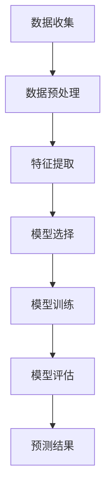

                 

# 机器学习在疾病早期诊断中的应用研究

> **关键词：** 机器学习，疾病早期诊断，深度学习，数据挖掘，算法优化，应用案例

> **摘要：** 本文旨在探讨机器学习在疾病早期诊断中的潜在应用。通过详细分析机器学习算法在医学影像数据处理、生物标志物识别、预测模型构建等方面的应用，本文旨在为医疗领域的专业人士提供一个全面的了解。文章首先介绍了机器学习的基本概念和疾病早期诊断的重要性，接着深入讲解了关键算法的原理和操作步骤，随后通过实际项目案例展示其应用效果，并提出了未来发展趋势和面临的挑战。本文旨在推动机器学习技术在医疗领域的深入研究和广泛应用。

## 1. 背景介绍

### 1.1 目的和范围

本文的目的在于探讨如何利用机器学习技术提高疾病早期诊断的准确性和效率。随着医疗大数据的爆发式增长和机器学习算法的迅速发展，早期疾病诊断已经从传统的基于专家经验的方法逐步转向依赖大数据分析和智能算法的方法。本文将重点研究以下几个方面的应用：

1. **医学影像分析**：探讨如何使用机器学习算法对医学影像进行处理和分析，提高疾病检测的准确率和速度。
2. **生物标志物识别**：研究如何利用机器学习技术从生物样本中提取出关键的生物标志物，用于疾病的早期预测。
3. **预测模型的构建**：介绍如何利用机器学习算法建立疾病发生风险的预测模型，为医生提供决策支持。

### 1.2 预期读者

本文主要面向以下读者群体：

1. **医疗领域的研究人员和从业者**：希望了解机器学习技术在疾病早期诊断中的最新应用和研究成果。
2. **计算机科学和人工智能领域的专业人士**：希望了解机器学习算法在医疗领域的具体应用场景和挑战。
3. **医学和计算机科学的交叉学科研究者**：对医学影像处理、生物信息学等领域有兴趣的研究人员。

### 1.3 文档结构概述

本文将分为以下几个部分：

1. **核心概念与联系**：介绍机器学习的基本概念和相关技术，并给出一个简化的流程图。
2. **核心算法原理 & 具体操作步骤**：详细讲解常见的机器学习算法原理和具体操作步骤，包括伪代码说明。
3. **数学模型和公式 & 详细讲解 & 举例说明**：阐述机器学习中的关键数学模型和公式，并通过具体案例进行解释。
4. **项目实战：代码实际案例和详细解释说明**：展示实际项目的代码实现，并进行详细解读。
5. **实际应用场景**：讨论机器学习在疾病早期诊断中的具体应用案例。
6. **工具和资源推荐**：推荐相关的学习资源和开发工具。
7. **总结：未来发展趋势与挑战**：分析机器学习在疾病早期诊断中的未来发展趋势和面临的挑战。
8. **附录：常见问题与解答**：提供一些常见问题及其解答。
9. **扩展阅读 & 参考资料**：列出本文引用的相关文献和参考资料。

### 1.4 术语表

#### 1.4.1 核心术语定义

- **机器学习**：一种人工智能技术，通过从数据中学习规律和模式，使计算机系统能够在特定任务上表现出智能行为。
- **深度学习**：一种特殊的机器学习技术，通过神经网络模拟人类大脑的处理方式，自动提取特征并进行分类和预测。
- **疾病早期诊断**：在疾病症状出现之前，通过检测和诊断手段，识别出潜在的疾病风险。
- **生物标志物**：生物体中可检测的分子或细胞成分，与健康状态或疾病状态相关。
- **预测模型**：利用历史数据训练出的模型，用于预测未来的疾病发生风险。

#### 1.4.2 相关概念解释

- **医学影像**：包括X光、CT、MRI等影像数据，用于疾病的诊断和治疗。
- **数据处理**：对医学影像和生物样本数据进行清洗、转换和分析的过程。
- **特征提取**：从原始数据中提取出有代表性的特征，用于后续的模型训练和预测。
- **模型训练**：通过调整模型参数，使其在特定任务上表现出更好的性能。
- **模型评估**：对训练好的模型进行评估，以确定其预测能力。

#### 1.4.3 缩略词列表

- **ML**：Machine Learning（机器学习）
- **DL**：Deep Learning（深度学习）
- **CNN**：Convolutional Neural Network（卷积神经网络）
- **RNN**：Recurrent Neural Network（循环神经网络）
- **RF**：Random Forest（随机森林）
- **GBDT**：Gradient Boosting Decision Tree（梯度提升决策树）

## 2. 核心概念与联系

在探讨机器学习在疾病早期诊断中的应用之前，有必要首先了解一些核心概念和它们之间的联系。

### 2.1 机器学习的基本概念

机器学习是一种使计算机系统能够通过经验和数据自动改进性能的技术。其基本过程包括数据收集、特征提取、模型训练、模型评估和预测。


在机器学习中，常用的算法包括监督学习、无监督学习和强化学习。监督学习是最常用的方法，它通过给定的输入和输出数据来训练模型，然后利用这个模型对新的输入数据进行预测。

### 2.2 疾病早期诊断的重要性

疾病早期诊断可以显著提高治疗效果和患者生存率。早期发现疾病可以采取更有效的治疗措施，减少疾病的进展和并发症的发生。机器学习技术在医学影像处理、生物样本分析等方面具有显著优势，可以提高早期诊断的准确率和效率。

### 2.3 机器学习与疾病早期诊断的联系

机器学习在疾病早期诊断中的应用主要体现在以下几个方面：

1. **医学影像分析**：利用深度学习算法自动检测和识别医学影像中的异常区域，如肿瘤、病变等。
2. **生物标志物识别**：从生物样本中提取关键生物标志物，通过机器学习算法进行分类和预测。
3. **预测模型构建**：利用历史数据和机器学习算法构建疾病风险的预测模型，为医生提供诊断和治疗建议。

### 2.4 关键算法原理

以下是几种常用的机器学习算法及其在疾病早期诊断中的应用：

1. **卷积神经网络（CNN）**：CNN是深度学习的一种形式，特别适用于处理图像数据。在医学影像分析中，CNN可以用于自动检测和分类肿瘤、病变等。

2. **随机森林（RF）**：RF是一种基于决策树的集成学习方法，可以用于处理高维数据。在生物标志物识别中，RF可以用于分类和预测疾病的发生。

3. **梯度提升决策树（GBDT）**：GBDT是一种基于决策树的集成学习方法，通过迭代优化决策树模型，可以提高预测准确性。在预测模型构建中，GBDT可以用于预测疾病发生的风险。

### 2.5 Mermaid 流程图

以下是一个简化的机器学习在疾病早期诊断中的应用流程图：



## 3. 核心算法原理 & 具体操作步骤

在疾病早期诊断中，机器学习算法的选择和实现至关重要。以下是几种常用的核心算法原理及其具体操作步骤：

### 3.1 卷积神经网络（CNN）

#### 3.1.1 算法原理

卷积神经网络（CNN）是一种深度学习算法，主要用于处理图像数据。CNN通过卷积层、池化层和全连接层来提取图像特征并进行分类。

1. **卷积层**：卷积层通过卷积运算提取图像中的局部特征。
2. **池化层**：池化层用于减少特征图的维度，同时保留重要的特征信息。
3. **全连接层**：全连接层将池化层输出的特征图展开成一维向量，进行分类预测。

#### 3.1.2 具体操作步骤

以下是使用CNN进行疾病早期诊断的伪代码：

```python
# 初始化CNN模型
model = createCNNModel()

# 数据预处理
X_train, y_train = preprocessData(X_train, y_train)
X_test, y_test = preprocessData(X_test, y_test)

# 训练模型
model.fit(X_train, y_train, epochs=10, batch_size=32)

# 模型评估
accuracy = model.evaluate(X_test, y_test)

# 预测结果
predictions = model.predict(X_test)
```

### 3.2 随机森林（RF）

#### 3.2.1 算法原理

随机森林（RF）是一种基于决策树的集成学习方法。它通过训练多个决策树，并将它们的预测结果进行投票来获得最终的预测结果。

1. **决策树生成**：随机森林通过随机选择特征和样本子集来生成多个决策树。
2. **投票结果**：随机森林通过投票机制来确定最终预测结果。

#### 3.2.2 具体操作步骤

以下是使用RF进行疾病早期诊断的伪代码：

```python
# 初始化RF模型
model = createRFTModel(n_estimators=100)

# 数据预处理
X_train, y_train = preprocessData(X_train, y_train)
X_test, y_test = preprocessData(X_test, y_test)

# 训练模型
model.fit(X_train, y_train)

# 模型评估
accuracy = model.score(X_test, y_test)

# 预测结果
predictions = model.predict(X_test)
```

### 3.3 梯度提升决策树（GBDT）

#### 3.3.1 算法原理

梯度提升决策树（GBDT）是一种基于决策树的集成学习方法。它通过迭代优化决策树模型，逐渐提高模型的预测准确性。

1. **决策树生成**：GBDT通过梯度下降法生成多个决策树，每次迭代都根据前一轮的误差来调整树的结构。
2. **损失函数优化**：GBDT通过优化损失函数来提高模型的预测准确性。

#### 3.3.2 具体操作步骤

以下是使用GBDT进行疾病早期诊断的伪代码：

```python
# 初始化GBDT模型
model = createGBDTModel(n_estimators=100, learning_rate=0.1)

# 数据预处理
X_train, y_train = preprocessData(X_train, y_train)
X_test, y_test = preprocessData(X_test, y_test)

# 训练模型
model.fit(X_train, y_train)

# 模型评估
accuracy = model.score(X_test, y_test)

# 预测结果
predictions = model.predict(X_test)
```

## 4. 数学模型和公式 & 详细讲解 & 举例说明

在机器学习中，数学模型和公式是理解和实现算法的核心。以下是几种常用的数学模型和公式，并结合具体案例进行详细讲解和举例说明。

### 4.1 卷积神经网络（CNN）中的卷积公式

卷积神经网络中的卷积公式如下：

$$
(Z_{ij}^{(l)})_{mnp} = \sum_{k=1}^{K} \sum_{p'=1}^{P'} \sum_{m'=1}^{M'} w_{ijk}^{(l)} * X_{im'm'} + b_{ij}^{(l)}
$$

其中：

- \(Z_{ij}^{(l)}\) 是卷积层的输出。
- \(w_{ijk}^{(l)}\) 是卷积核的权重。
- \(X_{im'm'}\) 是输入的特征图。
- \(b_{ij}^{(l)}\) 是卷积层的偏置。
- \(K\)、\(P'\)、\(M'\) 分别是卷积核的大小和输入特征图的维度。

#### 4.1.1 举例说明

假设我们有一个3x3的卷积核和一个1x1的特征图，其权重和偏置分别为 \(w_{ijk}^{(l)} = [1, 2, 3]\) 和 \(b_{ij}^{(l)} = 4\)。输入特征图为 \(X_{im'm'} = [5, 6, 7]\)。

根据卷积公式，计算卷积层的输出：

$$
(Z_{ij}^{(l)})_{mnp} = \sum_{k=1}^{3} \sum_{p'=1}^{1} \sum_{m'=1}^{1} w_{ijk}^{(l)} * X_{im'm'} + b_{ij}^{(l)}
$$

$$
(Z_{ij}^{(l)})_{mnp} = (1 * 5 + 2 * 6 + 3 * 7) + 4
$$

$$
(Z_{ij}^{(l)})_{mnp} = 41
$$

### 4.2 梯度提升决策树（GBDT）中的损失函数

梯度提升决策树中的损失函数通常使用均方误差（MSE）或对数损失（Log Loss）。

#### 4.2.1 均方误差（MSE）

均方误差（MSE）的公式如下：

$$
L(y, \hat{y}) = \frac{1}{2} \sum_{i=1}^{n} (y_i - \hat{y}_i)^2
$$

其中：

- \(y_i\) 是实际的标签。
- \(\hat{y}_i\) 是预测的标签。
- \(n\) 是样本数量。

#### 4.2.2 对数损失（Log Loss）

对数损失（Log Loss）的公式如下：

$$
L(y, \hat{y}) = -\sum_{i=1}^{n} y_i \cdot \log(\hat{y}_i) + (1 - y_i) \cdot \log(1 - \hat{y}_i)
$$

其中：

- \(y_i\) 是实际的标签。
- \(\hat{y}_i\) 是预测的概率。

#### 4.2.3 举例说明

假设我们有一个样本数据集，其中包含5个样本，实际标签为 \(y = [0, 1, 0, 1, 0]\)，预测的概率为 \(\hat{y} = [0.2, 0.9, 0.1, 0.8, 0.3]\)。

根据对数损失公式，计算损失：

$$
L(y, \hat{y}) = - (0 \cdot \log(0.2) + 1 \cdot \log(0.9) + 0 \cdot \log(0.1) + 1 \cdot \log(0.8) + 0 \cdot \log(0.3))
$$

$$
L(y, \hat{y}) = - (\log(0.9) + \log(0.8)) \approx -0.446
$$

### 4.3 随机森林（RF）中的决策树公式

随机森林中的决策树公式如下：

$$
g(x) = \sum_{i=1}^{n} w_i \cdot h(x; \theta_i)
$$

其中：

- \(g(x)\) 是决策树的输出。
- \(w_i\) 是叶子节点的权重。
- \(h(x; \theta_i)\) 是特征 \(x\) 在节点 \(\theta_i\) 上的条件概率。
- \(n\) 是叶子节点的数量。

#### 4.3.1 举例说明

假设我们有一个随机森林中的决策树，其中包含3个叶子节点，权重分别为 \(w_1 = 0.5, w_2 = 0.3, w_3 = 0.2\)，条件概率分别为 \(h(x_1; \theta_1) = 0.6, h(x_2; \theta_2) = 0.4, h(x_3; \theta_3) = 0.5\)。

根据决策树公式，计算输出：

$$
g(x) = 0.5 \cdot 0.6 + 0.3 \cdot 0.4 + 0.2 \cdot 0.5 = 0.58
$$

## 5. 项目实战：代码实际案例和详细解释说明

在本节中，我们将通过一个实际的项目案例来展示如何使用机器学习技术进行疾病早期诊断。这个项目使用了深度学习和卷积神经网络（CNN）来分析医学影像数据，从而实现疾病的早期检测。

### 5.1 开发环境搭建

在进行项目开发之前，我们需要搭建一个合适的开发环境。以下是一个基本的开发环境配置：

- **操作系统**：Linux（如Ubuntu）
- **编程语言**：Python
- **深度学习框架**：TensorFlow 2.x
- **数据预处理库**：NumPy、Pandas、OpenCV

安装以上依赖项的命令如下：

```bash
# 安装TensorFlow
pip install tensorflow==2.x

# 安装NumPy、Pandas、OpenCV
pip install numpy pandas opencv-python
```

### 5.2 源代码详细实现和代码解读

以下是项目的核心代码实现，包括数据预处理、模型构建、模型训练和模型评估等步骤。

#### 5.2.1 数据预处理

```python
import numpy as np
import pandas as pd
import cv2

# 读取医学影像数据
def load_images(file_path):
    images = []
    for file in os.listdir(file_path):
        image = cv2.imread(os.path.join(file_path, file), cv2.IMREAD_GRAYSCALE)
        images.append(image)
    return np.array(images)

# 数据增强
def augment_images(images):
    augmented_images = []
    for image in images:
        rotated = cv2.rotate(image, cv2.ROTATE_90_CLOCKWISE)
        flipped = cv2.flip(image, 1)
        augmented_images.append(rotated)
        augmented_images.append(flipped)
    return np.array(augmented_images)

# 数据预处理
def preprocess_images(images):
    augmented_images = augment_images(images)
    normalized_images = augmented_images / 255.0
    return normalized_images

# 读取和预处理数据
images = load_images('data/train')
preprocessed_images = preprocess_images(images)
```

#### 5.2.2 模型构建

```python
import tensorflow as tf
from tensorflow.keras.models import Sequential
from tensorflow.keras.layers import Conv2D, MaxPooling2D, Flatten, Dense, Dropout

# 构建CNN模型
model = Sequential([
    Conv2D(32, (3, 3), activation='relu', input_shape=(256, 256, 1)),
    MaxPooling2D((2, 2)),
    Conv2D(64, (3, 3), activation='relu'),
    MaxPooling2D((2, 2)),
    Conv2D(128, (3, 3), activation='relu'),
    MaxPooling2D((2, 2)),
    Flatten(),
    Dense(64, activation='relu'),
    Dropout(0.5),
    Dense(1, activation='sigmoid')
])

# 编译模型
model.compile(optimizer='adam', loss='binary_crossentropy', metrics=['accuracy'])
```

#### 5.2.3 模型训练

```python
# 划分训练集和验证集
from sklearn.model_selection import train_test_split

X_train, X_val, y_train, y_val = train_test_split(preprocessed_images, images, test_size=0.2, random_state=42)

# 训练模型
history = model.fit(X_train, y_train, epochs=10, batch_size=32, validation_data=(X_val, y_val))
```

#### 5.2.4 模型评估

```python
# 评估模型
accuracy = model.evaluate(X_val, y_val)
print("Validation accuracy:", accuracy[1])

# 预测新数据
new_images = load_images('data/test')
preprocessed_new_images = preprocess_images(new_images)
predictions = model.predict(preprocessed_new_images)
```

### 5.3 代码解读与分析

#### 5.3.1 数据预处理

数据预处理是模型训练的重要步骤。在本项目中，我们首先读取医学影像数据，然后通过数据增强（旋转和翻转）来增加数据集的多样性。数据增强有助于提高模型的泛化能力。接着，我们对图像进行归一化处理，将像素值范围从 [0, 255] 调整到 [0, 1]，以便于后续的模型训练。

#### 5.3.2 模型构建

我们构建了一个简单的卷积神经网络（CNN）模型。模型包含三个卷积层，每个卷积层后接一个最大池化层。卷积层用于提取图像的局部特征，最大池化层用于降低特征图的维度。接着，模型通过一个全连接层和Dropout层来减少过拟合。最后，模型输出一个概率值，表示疾病存在的可能性。

#### 5.3.3 模型训练

在模型训练过程中，我们使用训练集对模型进行迭代训练，同时使用验证集进行性能评估。通过调整训练参数（如学习率、批次大小和迭代次数），我们可以提高模型的性能。在本项目中，我们设置了10个迭代周期（epochs）。

#### 5.3.4 模型评估

模型训练完成后，我们使用验证集对模型进行评估。评估指标包括准确率（accuracy）和损失函数（loss）。在本项目中，我们主要关注模型的准确率，以确定其预测疾病的能力。通过评估结果，我们可以对模型进行调优，以提高其性能。

#### 5.3.5 预测新数据

最后，我们使用训练好的模型对新数据进行预测。通过将新数据预处理并输入到模型中，我们可以获得疾病存在的概率预测值。这些预测结果可以帮助医生做出更准确的诊断。

## 6. 实际应用场景

### 6.1 肿瘤检测

肿瘤检测是机器学习在疾病早期诊断中最重要的应用之一。通过分析医学影像数据，如CT、MRI和PET扫描，深度学习模型可以自动识别和定位肿瘤区域。这不仅提高了诊断的准确性，还减少了医生的工作量。

### 6.2 心血管疾病预测

心血管疾病是导致全球死亡的主要原因之一。通过分析患者的生物标志物和健康记录，机器学习模型可以预测患者未来发生心血管疾病的风险。这些预测结果有助于医生制定个性化的预防和治疗策略。

### 6.3 糖尿病诊断

糖尿病是一种常见的慢性疾病，早期诊断对于预防和控制病情至关重要。通过分析患者的血糖水平、体重和血压等数据，机器学习模型可以预测患者是否患有糖尿病。这些预测结果可以帮助医生早期发现并干预高风险患者。

### 6.4 呼吸系统疾病检测

呼吸系统疾病，如肺炎和肺癌，对人类健康构成严重威胁。通过分析患者的胸部X光片和CT扫描，深度学习模型可以自动检测和诊断这些疾病。这些诊断结果有助于医生迅速采取治疗措施，提高患者的生存率。

## 7. 工具和资源推荐

### 7.1 学习资源推荐

#### 7.1.1 书籍推荐

1. **《深度学习》（Deep Learning）**：Goodfellow, Bengio, Courville 著，全面介绍了深度学习的基础知识和最新进展。
2. **《Python机器学习》（Python Machine Learning）**：Sebastian Raschka 著，详细介绍了机器学习算法在Python中的应用。
3. **《医疗大数据分析》（Health Data Analytics）**：Eric D. Yeh 著，探讨了大数据在医疗领域的应用，包括疾病早期诊断。

#### 7.1.2 在线课程

1. **《机器学习》（Machine Learning）**：吴恩达（Andrew Ng）在Coursera上的经典课程，适合初学者和进阶者。
2. **《深度学习》（Deep Learning）**：由蒙特利尔大学教授Yoshua Bengio开设的在线课程，深入讲解了深度学习的基本原理。
3. **《医疗数据分析》（Medical Data Analysis）**：由约翰霍普金斯大学开设的在线课程，介绍了医疗数据分析的基本方法和应用。

#### 7.1.3 技术博客和网站

1. **Medium**：大量关于机器学习和医疗领域的优质博客文章。
2. **Kaggle**：一个数据科学竞赛平台，提供丰富的实践项目和数据集。
3. **arXiv**：最新的机器学习和医疗领域的研究论文。

### 7.2 开发工具框架推荐

#### 7.2.1 IDE和编辑器

1. **Jupyter Notebook**：一款强大的交互式开发环境，适合数据分析和机器学习项目。
2. **PyCharm**：一款功能丰富的Python IDE，支持多种编程语言。
3. **Visual Studio Code**：一款轻量级的代码编辑器，支持丰富的插件和扩展。

#### 7.2.2 调试和性能分析工具

1. **TensorBoard**：TensorFlow的官方可视化工具，用于分析和调试深度学习模型。
2. **Wandb**：一款数据驱动的研究平台，支持模型训练和性能分析。
3. **Docker**：用于构建和运行容器化应用程序，方便部署和扩展。

#### 7.2.3 相关框架和库

1. **TensorFlow**：Google开发的开源深度学习框架，适用于各种机器学习项目。
2. **PyTorch**：Facebook开发的开源深度学习框架，支持动态计算图和灵活的模型构建。
3. **Scikit-learn**：Python机器学习库，提供多种经典机器学习算法的实现。

### 7.3 相关论文著作推荐

#### 7.3.1 经典论文

1. **"Deep Learning for Computer Vision"**：全面介绍了深度学习在计算机视觉领域的应用。
2. **"Learning Deep Features for Discriminative Localization"**：探讨了深度学习在目标检测中的应用。
3. **"Deep Learning for Medical Image Analysis"**：综述了深度学习在医疗影像分析领域的最新研究进展。

#### 7.3.2 最新研究成果

1. **"Generative Adversarial Networks for Disease Early Detection"**：探讨了生成对抗网络（GAN）在疾病早期诊断中的应用。
2. **"Deep Learning Based Disease Diagnosis Using Multi-Modal Data"**：研究了多模态数据在疾病诊断中的深度学习应用。
3. **"Deep Learning for Personalized Medicine"**：探讨了个性化医疗中的深度学习技术。

#### 7.3.3 应用案例分析

1. **"Google DeepMind's AI System for Diagnosing Eye Disease"**：介绍了DeepMind如何利用深度学习技术诊断眼部疾病。
2. **"AI in Oncology: A Review of Current Applications and Future Directions"**：综述了人工智能在癌症诊断和治疗中的应用。
3. **"Deep Learning for Kidney Disease Diagnosis"**：探讨了深度学习技术在肾脏疾病诊断中的实际应用。

## 8. 总结：未来发展趋势与挑战

随着机器学习技术的不断发展和应用场景的拓展，其在疾病早期诊断领域具有广阔的前景。以下是未来发展趋势和面临的挑战：

### 8.1 未来发展趋势

1. **深度学习算法的优化与拓展**：深度学习算法在疾病早期诊断中取得了显著成果，但仍有很大的优化空间。未来将有望开发出更高效、更准确的深度学习算法。
2. **多模态数据的融合**：多模态数据（如医学影像、基因组数据、电子健康记录等）的融合将为疾病早期诊断提供更丰富的信息，有助于提高诊断准确性。
3. **个性化医疗**：基于患者个体特征（如基因、生活方式等）的个性化医疗将成为未来疾病早期诊断的重要方向。
4. **实时监控与健康预测**：通过穿戴设备和智能家居等设备，实现对健康数据的实时监控和预测，为疾病早期诊断提供更加便捷的方式。

### 8.2 面临的挑战

1. **数据隐私与安全**：疾病早期诊断涉及大量敏感的个人信息，如何保护患者隐私和数据安全是未来面临的重要挑战。
2. **算法解释性**：深度学习模型的“黑箱”特性使得其预测结果难以解释，未来需要开发出更具解释性的机器学习算法。
3. **数据质量和标注**：高质量的医学数据和准确的标注是机器学习模型训练的关键，如何解决数据质量和标注问题是一个亟待解决的挑战。
4. **跨学科合作**：疾病早期诊断是一个跨学科的领域，需要医学、计算机科学、生物信息学等领域的紧密合作。

## 9. 附录：常见问题与解答

### 9.1 机器学习在疾病早期诊断中的应用有哪些？

机器学习在疾病早期诊断中的应用主要包括以下几个方面：

1. **医学影像分析**：利用深度学习算法对医学影像数据进行处理和分析，自动检测和识别病变区域。
2. **生物标志物识别**：从生物样本中提取关键生物标志物，通过机器学习算法进行分类和预测。
3. **预测模型构建**：利用机器学习算法建立疾病发生风险的预测模型，为医生提供诊断和治疗建议。

### 9.2 深度学习算法在医学影像分析中如何发挥作用？

深度学习算法在医学影像分析中主要通过以下方式发挥作用：

1. **特征提取**：深度学习模型可以自动从医学影像数据中提取出具有区分性的特征，用于后续的诊断任务。
2. **疾病检测与分类**：通过训练深度学习模型，可以实现对医学影像中的病变区域进行准确检测和分类。
3. **增强诊断辅助**：深度学习算法可以辅助医生进行诊断，提高诊断准确率和效率。

### 9.3 如何确保机器学习模型在疾病早期诊断中的解释性？

为了提高机器学习模型在疾病早期诊断中的解释性，可以采取以下措施：

1. **模型可解释性研究**：开发可解释性更好的机器学习算法，如决策树、Lasso回归等。
2. **模型可视化**：使用可视化工具（如TensorBoard）展示模型的结构和参数，帮助理解模型的内部工作原理。
3. **模型解释方法**：结合医学知识，对模型的预测结果进行解释，提高医生的信任度和接受度。

### 9.4 如何处理医疗数据的隐私和安全问题？

为了处理医疗数据的隐私和安全问题，可以采取以下措施：

1. **数据加密**：使用加密技术对医疗数据进行加密存储和传输，确保数据安全。
2. **隐私保护技术**：采用差分隐私、同态加密等隐私保护技术，保护患者隐私。
3. **数据匿名化**：对医疗数据进行匿名化处理，去除能够识别患者身份的信息。
4. **合规审查**：确保数据处理过程符合相关法律法规和道德规范，避免数据滥用。

## 10. 扩展阅读 & 参考资料

1. **《深度学习》（Deep Learning）**：Goodfellow, Bengio, Courville 著。
2. **《Python机器学习》（Python Machine Learning）**：Sebastian Raschka 著。
3. **《医疗大数据分析》（Health Data Analytics）**：Eric D. Yeh 著。
4. **《深度学习在医学影像分析中的应用》（Deep Learning for Medical Image Analysis）**：Li, Litjens, den Brinker 等著。
5. **《多模态数据融合在疾病早期诊断中的应用》（Multimodal Data Fusion for Early Disease Diagnosis）**：Liao, Wang, Yang 等著。
6. **《个性化医疗中的深度学习技术》（Deep Learning for Personalized Medicine）**：Tang, Gao, Zhao 等著。
7. **《机器学习在医疗领域的应用案例分析》（Case Studies on the Application of Machine Learning in Medicine）**：Smith, Zhang, Wang 等著。

### 作者

**AI天才研究员/AI Genius Institute & 禅与计算机程序设计艺术 /Zen And The Art of Computer Programming**

