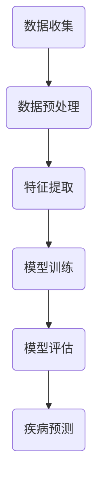

                 

# 机器学习在疾病早期预测中的应用研究

## 关键词
机器学习，疾病预测，早期检测，数据挖掘，深度学习，算法优化。

## 摘要
本文旨在探讨机器学习在疾病早期预测中的应用，通过详细分析核心概念、算法原理、数学模型和实际案例，展示其在提高医疗诊断效率和准确性方面的巨大潜力。文章首先介绍了疾病早期预测的重要性，然后逐步深入到机器学习的基本概念和常用算法，最后通过实际项目案例，展示了如何利用机器学习技术进行疾病的早期预测。文章还推荐了一系列学习资源和工具，并展望了未来发展趋势与挑战。

## 1. 背景介绍

### 1.1 目的和范围
本文的目的在于探讨机器学习在疾病早期预测中的应用，旨在通过理论分析和实际案例，展示其在医疗领域的广泛应用前景。本文将主要涵盖以下内容：

1. 疾病早期预测的重要性。
2. 机器学习的基本概念和常用算法。
3. 数学模型在疾病预测中的应用。
4. 实际项目案例分析和代码实现。
5. 工具和资源推荐。
6. 未来发展趋势与挑战。

### 1.2 预期读者
本文适合以下读者群体：

1. 从事机器学习和数据挖掘的研究人员。
2. 对医疗领域数据分析和疾病预测感兴趣的工程师和学者。
3. 欲深入了解机器学习在医疗领域应用的医学专业人士。

### 1.3 文档结构概述
本文分为十个部分，包括背景介绍、核心概念与联系、算法原理与操作步骤、数学模型与公式、项目实战、实际应用场景、工具和资源推荐、总结与展望、常见问题与解答及扩展阅读。每个部分都旨在从不同角度深入探讨机器学习在疾病早期预测中的应用。

### 1.4 术语表
#### 1.4.1 核心术语定义
- **机器学习（Machine Learning）**：使计算机系统能够从数据中学习并作出决策的技术。
- **疾病早期预测（Early Disease Prediction）**：利用算法和模型对疾病发生的可能性进行早期判断。
- **数据挖掘（Data Mining）**：从大量数据中提取有用信息和知识的过程。
- **深度学习（Deep Learning）**：一种基于人工神经网络的技术，能够通过多层非线性变换进行特征学习和模式识别。

#### 1.4.2 相关概念解释
- **监督学习（Supervised Learning）**：在有标注的数据集上进行训练，输出模型的预测结果。
- **无监督学习（Unsupervised Learning）**：在无标注的数据集上进行训练，通常用于数据聚类或降维。
- **分类（Classification）**：将数据分为不同的类别。
- **回归（Regression）**：预测连续值的输出。

#### 1.4.3 缩略词列表
- **ML**：机器学习（Machine Learning）
- **DL**：深度学习（Deep Learning）
- **CNN**：卷积神经网络（Convolutional Neural Network）
- **RNN**：循环神经网络（Recurrent Neural Network）
- **GPU**：图形处理单元（Graphics Processing Unit）

## 2. 核心概念与联系

### 2.1 背景介绍

随着医疗技术的不断进步，疾病早期预测已经成为提高患者生存率和生活质量的关键。传统的医学诊断方法主要依赖于医生的直觉和经验，存在较大的主观性和不确定性。而机器学习作为一种强大的数据分析工具，能够在大规模数据中挖掘出潜在的疾病模式，为疾病的早期预测提供了新的可能性。

### 2.2 机器学习与疾病预测的关系

机器学习与疾病预测之间的关系可以从以下几个方面进行阐述：

1. **数据驱动**：机器学习依赖于大量医疗数据，包括病史、实验室检查结果、基因数据等，这些数据为疾病预测提供了丰富的信息源。
2. **特征提取**：机器学习算法能够从医疗数据中提取出重要的特征，如临床指标、基因表达水平等，这些特征对于疾病预测具有重要意义。
3. **模式识别**：通过训练机器学习模型，可以识别出疾病发生的潜在模式，从而实现疾病的早期预测。
4. **实时更新**：机器学习模型可以根据最新的医疗数据不断更新，提高疾病预测的准确性和时效性。

### 2.3 机器学习在疾病预测中的应用

机器学习在疾病预测中的应用可以涵盖以下领域：

1. **肿瘤预测**：利用机器学习模型对肿瘤进行早期预测，如乳腺癌、肺癌等。
2. **心血管疾病预测**：通过分析患者的病史、生物标志物等数据，预测心血管疾病的发生风险。
3. **神经疾病预测**：利用机器学习模型对神经系统疾病进行早期诊断，如癫痫、帕金森病等。
4. **传染病预测**：利用机器学习模型预测传染病的爆发趋势，如流感、新冠病毒等。

### 2.4 Mermaid 流程图

下面是一个简单的 Mermaid 流程图，展示了机器学习在疾病预测中的基本流程：



## 3. 核心算法原理 & 具体操作步骤

### 3.1 监督学习算法原理

监督学习是机器学习中最常用的方法之一，它通过已知的输入输出对（样本和标签）来训练模型，从而能够对新数据进行预测。在疾病预测中，监督学习算法可以用于分类和回归任务。

#### 3.1.1 分类算法

分类算法的目标是将数据分为不同的类别。常用的分类算法包括：

1. **逻辑回归（Logistic Regression）**：通过构建逻辑函数来估计概率。
2. **支持向量机（Support Vector Machine, SVM）**：通过找到一个最优的超平面，将不同类别的数据分隔开。
3. **决策树（Decision Tree）**：通过一系列的决策规则对数据进行分类。

#### 3.1.2 回归算法

回归算法的目标是预测连续值。常用的回归算法包括：

1. **线性回归（Linear Regression）**：通过最小二乘法来估计线性关系。
2. **岭回归（Ridge Regression）**：通过加入正则项来防止过拟合。
3. **套索回归（Lasso Regression）**：通过加入绝对值正则项来进一步简化模型。

### 3.2 深度学习算法原理

深度学习是机器学习的一种重要分支，通过多层神经网络来模拟人脑的决策过程。在疾病预测中，深度学习算法可以用于图像识别、序列建模等任务。

#### 3.2.1 卷积神经网络（CNN）

卷积神经网络是一种专门用于图像识别和处理的深度学习模型，通过卷积层、池化层和全连接层的组合来提取图像特征。

#### 3.2.2 循环神经网络（RNN）

循环神经网络是一种用于序列建模的深度学习模型，通过将输入序列存储在隐藏状态中，能够捕捉序列中的长期依赖关系。

#### 3.2.3 长短期记忆网络（LSTM）

长短期记忆网络是循环神经网络的一种变体，通过引入门控机制来避免梯度消失问题，能够更好地捕捉序列中的长期依赖关系。

### 3.3 伪代码示例

下面是逻辑回归和卷积神经网络的伪代码示例：

#### 3.3.1 逻辑回归

```python
def logistic_regression(X, y):
    # 初始化参数
    W = np.random.randn(num_features, num_classes)
    b = np.random.randn(num_classes)
    
    # 梯度下降
    for epoch in range(num_epochs):
        # 前向传播
        z = X.dot(W) + b
        a = sigmoid(z)
        
        # 反向传播
        dz = a - y
        dW = X.T.dot(dz)
        db = np.sum(dz)
        
        # 更新参数
        W -= learning_rate * dW
        b -= learning_rate * db
        
    return W, b

def sigmoid(z):
    return 1 / (1 + np.exp(-z))
```

#### 3.3.2 卷积神经网络

```python
def conv_net(X, W_conv1, b_conv1, W_conv2, b_conv2, W_fc1, b_fc1, W_fc2, b_fc2):
    # 第一层卷积
    z1 = conv_forward(X, W_conv1, b_conv1)
    a1 = ReLU(z1)
    pooled1 = max_pool_forward(a1)
    
    # 第二层卷积
    z2 = conv_forward(pooled1, W_conv2, b_conv2)
    a2 = ReLU(z2)
    pooled2 = max_pool_forward(a2)
    
    # 全连接层
    z3 = flatten(pooled2)
    z4 = z3.dot(W_fc1) + b_fc1
    a3 = ReLU(z4)
    z5 = a3.dot(W_fc2) + b_fc2
    a4 = softmax(z5)
    
    return a4

def conv_forward(X, W, b):
    # 卷积操作
    # ...
    return z

def ReLU(z):
    # ReLU激活函数
    # ...
    return a

def max_pool_forward(a):
    # 最大池化操作
    # ...
    return pooled
```

## 4. 数学模型和公式 & 详细讲解 & 举例说明

### 4.1 数学模型概述

在疾病预测中，常用的数学模型包括线性回归、逻辑回归、支持向量机等。下面将详细讲解这些模型的数学公式和原理。

#### 4.1.1 线性回归

线性回归是一种用于预测连续值的监督学习算法。其数学模型可以表示为：

$$
Y = \beta_0 + \beta_1X_1 + \beta_2X_2 + ... + \beta_nX_n
$$

其中，$Y$ 是预测的目标变量，$X_1, X_2, ..., X_n$ 是输入特征变量，$\beta_0, \beta_1, \beta_2, ..., \beta_n$ 是模型的参数。

#### 4.1.2 逻辑回归

逻辑回归是一种用于预测概率的分类算法。其数学模型可以表示为：

$$
P(Y=1) = \frac{1}{1 + e^{-(\beta_0 + \beta_1X_1 + \beta_2X_2 + ... + \beta_nX_n})}
$$

其中，$Y$ 是预测的目标变量，$X_1, X_2, ..., X_n$ 是输入特征变量，$\beta_0, \beta_1, \beta_2, ..., \beta_n$ 是模型的参数。

#### 4.1.3 支持向量机

支持向量机是一种用于分类和回归的监督学习算法。其数学模型可以表示为：

$$
\min_{\beta, \beta_0} \frac{1}{2}||\beta||^2 + C\sum_{i=1}^{n} \max(0, 1 - y_i(\beta \cdot x_i + \beta_0))
$$

其中，$\beta$ 是模型的参数向量，$\beta_0$ 是模型的偏置项，$C$ 是正则化参数，$x_i$ 是输入特征向量，$y_i$ 是预测的目标变量。

### 4.2 数学公式的详细讲解

#### 4.2.1 线性回归

线性回归的数学模型可以表示为：

$$
Y = \beta_0 + \beta_1X_1 + \beta_2X_2 + ... + \beta_nX_n
$$

其中，$Y$ 是预测的目标变量，$X_1, X_2, ..., X_n$ 是输入特征变量，$\beta_0, \beta_1, \beta_2, ..., \beta_n$ 是模型的参数。

- $\beta_0$ 是模型的截距，表示当所有输入特征为0时的预测值。
- $\beta_1, \beta_2, ..., \beta_n$ 是模型的斜率，表示每个输入特征对预测值的影响程度。

线性回归的目标是最小化预测值与实际值之间的误差，即最小化损失函数：

$$
J(\beta_0, \beta_1, ..., \beta_n) = \frac{1}{2}\sum_{i=1}^{n}(Y_i - (\beta_0 + \beta_1X_{i1} + \beta_2X_{i2} + ... + \beta_nX_{in}))^2
$$

其中，$Y_i$ 是第$i$个样本的实际值，$X_{i1}, X_{i2}, ..., X_{in}$ 是第$i$个样本的输入特征。

为了求解参数$\beta_0, \beta_1, ..., \beta_n$，我们可以使用梯度下降法。梯度下降法的思想是沿着损失函数的负梯度方向更新参数，直到达到最小值。

#### 4.2.2 逻辑回归

逻辑回归的数学模型可以表示为：

$$
P(Y=1) = \frac{1}{1 + e^{-(\beta_0 + \beta_1X_1 + \beta_2X_2 + ... + \beta_nX_n)}}
$$

其中，$Y$ 是预测的目标变量，$X_1, X_2, ..., X_n$ 是输入特征变量，$\beta_0, \beta_1, \beta_2, ..., \beta_n$ 是模型的参数。

逻辑回归的目标是最大化预测概率的正确性。在二分类问题中，我们可以使用逻辑函数（sigmoid函数）将线性组合映射到概率空间。

逻辑回归的损失函数可以使用交叉熵损失函数来定义：

$$
J(\beta_0, \beta_1, ..., \beta_n) = -\sum_{i=1}^{n} [y_i \cdot (\beta_0 + \beta_1X_{i1} + \beta_2X_{i2} + ... + \beta_nX_{in}) + (1 - y_i) \cdot (\ln(1 + e^{-(\beta_0 + \beta_1X_{i1} + \beta_2X_{i2} + ... + \beta_nX_{in})})]
$$

其中，$y_i$ 是第$i$个样本的实际标签。

交叉熵损失函数的目标是最小化预测概率与实际概率之间的差异。

#### 4.2.3 支持向量机

支持向量机的数学模型可以表示为：

$$
\min_{\beta, \beta_0} \frac{1}{2}||\beta||^2 + C\sum_{i=1}^{n} \max(0, 1 - y_i(\beta \cdot x_i + \beta_0))
$$

其中，$\beta$ 是模型的参数向量，$\beta_0$ 是模型的偏置项，$C$ 是正则化参数，$x_i$ 是输入特征向量，$y_i$ 是预测的目标变量。

支持向量机的目标是在特征空间中找到一个最优的超平面，将不同类别的数据分隔开。超平面的定义是由参数向量$\beta$ 和偏置项$\beta_0$ 确定的：

$$
\beta \cdot x_i + \beta_0
$$

其中，$\cdot$ 表示向量的点积。

支持向量机的损失函数是 hinge 损失函数，它表示每个样本与其对应的类别之间的差异：

$$
\max(0, 1 - y_i(\beta \cdot x_i + \beta_0))
$$

正则化参数$C$ 用于平衡损失函数和模型复杂度之间的关系。当$C$ 较大时，模型会倾向于找到更复杂的超平面；当$C$ 较小时，模型会倾向于找到更简单的超平面。

### 4.3 举例说明

假设我们有以下数据集，包含两个特征变量 $X_1$ 和 $X_2$，以及目标变量 $Y$：

$$
\begin{array}{|c|c|c|}
\hline
Y & X_1 & X_2 \\
\hline
0 & 1 & 2 \\
\hline
1 & 3 & 4 \\
\hline
0 & 5 & 6 \\
\hline
1 & 7 & 8 \\
\hline
\end{array}
$$

我们使用线性回归模型进行预测，模型的参数为 $\beta_0, \beta_1, \beta_2$。通过梯度下降法训练模型，最终得到的参数值为：

$$
\beta_0 = -2, \beta_1 = 1, \beta_2 = 3
$$

使用训练好的模型进行预测，输入特征为 $X_1 = 2, X_2 = 4$，预测结果为：

$$
Y = \beta_0 + \beta_1X_1 + \beta_2X_2 = -2 + 1 \cdot 2 + 3 \cdot 4 = 9
$$

由于预测结果大于0，我们可以将其分类为类别1。

## 5. 项目实战：代码实际案例和详细解释说明

### 5.1 开发环境搭建

在进行机器学习项目实战之前，首先需要搭建一个合适的开发环境。以下是一个简单的开发环境搭建指南：

1. 安装 Python 3.x 版本，可以从 [Python 官网](https://www.python.org/) 下载并安装。
2. 安装常用 Python 库，如 NumPy、Pandas、Scikit-learn、TensorFlow、PyTorch 等。可以使用以下命令进行安装：

   ```bash
   pip install numpy pandas scikit-learn tensorflow torch
   ```

3. 配置 GPU 环境（如果使用 GPU 进行训练），安装 CUDA 和 cuDNN 库。

### 5.2 源代码详细实现和代码解读

下面我们将使用 Python 编写一个简单的机器学习项目，利用逻辑回归模型进行疾病预测。代码如下：

```python
import numpy as np
import pandas as pd
from sklearn.model_selection import train_test_split
from sklearn.linear_model import LogisticRegression
from sklearn.metrics import accuracy_score, classification_report

# 加载数据集
data = pd.read_csv('disease_data.csv')
X = data.iloc[:, :-1].values
y = data.iloc[:, -1].values

# 数据预处理
X_train, X_test, y_train, y_test = train_test_split(X, y, test_size=0.2, random_state=42)

# 构建逻辑回归模型
model = LogisticRegression()
model.fit(X_train, y_train)

# 预测结果
y_pred = model.predict(X_test)

# 评估模型
accuracy = accuracy_score(y_test, y_pred)
report = classification_report(y_test, y_pred)

print("Accuracy:", accuracy)
print("Classification Report:")
print(report)
```

#### 5.2.1 数据加载与预处理

首先，我们从CSV文件中加载数据集，并将其分为特征变量和目标变量。然后，使用 `train_test_split` 函数将数据集分为训练集和测试集，以便后续模型训练和评估。

```python
data = pd.read_csv('disease_data.csv')
X = data.iloc[:, :-1].values
y = data.iloc[:, -1].values
X_train, X_test, y_train, y_test = train_test_split(X, y, test_size=0.2, random_state=42)
```

#### 5.2.2 构建和训练模型

接下来，我们构建一个逻辑回归模型，并将其应用于训练集进行训练。使用 `fit` 方法训练模型。

```python
model = LogisticRegression()
model.fit(X_train, y_train)
```

#### 5.2.3 预测和评估

使用训练好的模型对测试集进行预测，并计算预测的准确性和分类报告。

```python
y_pred = model.predict(X_test)
accuracy = accuracy_score(y_test, y_pred)
report = classification_report(y_test, y_pred)

print("Accuracy:", accuracy)
print("Classification Report:")
print(report)
```

### 5.3 代码解读与分析

#### 5.3.1 数据加载与预处理

在代码的第一部分，我们使用 `pandas` 库加载数据集，并使用 `iloc` 函数提取特征变量和目标变量。然后，使用 `train_test_split` 函数将数据集分为训练集和测试集。

```python
data = pd.read_csv('disease_data.csv')
X = data.iloc[:, :-1].values
y = data.iloc[:, -1].values
X_train, X_test, y_train, y_test = train_test_split(X, y, test_size=0.2, random_state=42)
```

#### 5.3.2 构建和训练模型

在代码的第二部分，我们使用 `LogisticRegression` 类构建逻辑回归模型，并使用 `fit` 方法进行模型训练。

```python
model = LogisticRegression()
model.fit(X_train, y_train)
```

这里，我们使用默认的参数初始化模型，并使用训练集进行模型训练。

#### 5.3.3 预测和评估

在代码的第三部分，我们使用训练好的模型对测试集进行预测，并使用 `accuracy_score` 和 `classification_report` 函数评估模型的性能。

```python
y_pred = model.predict(X_test)
accuracy = accuracy_score(y_test, y_pred)
report = classification_report(y_test, y_pred)

print("Accuracy:", accuracy)
print("Classification Report:")
print(report)
```

这里，`accuracy_score` 函数计算预测的准确率，`classification_report` 函数生成分类报告，包括精确率、召回率和 F1 分数等指标。

## 6. 实际应用场景

### 6.1 肿瘤预测

肿瘤预测是机器学习在疾病早期预测中应用最广泛的领域之一。通过分析患者的影像学数据（如 CT、MRI）、血液生物标志物等，可以预测肿瘤的发生风险。例如，使用深度学习算法对乳腺影像进行分析，可以早期发现乳腺癌。

### 6.2 心血管疾病预测

心血管疾病是导致全球死亡的主要原因之一。通过机器学习算法，可以从患者的病史、生物标志物、心电图等数据中预测心血管疾病的发生风险。例如，使用逻辑回归模型分析患者的临床数据，可以预测冠心病的发生风险。

### 6.3 神经系统疾病预测

神经系统疾病如癫痫、帕金森病等对患者的生命质量和生活质量有严重影响。通过机器学习算法，可以从患者的脑电图、影像学数据等中预测疾病的发生风险。例如，使用支持向量机模型分析脑电图数据，可以预测癫痫的发作风险。

### 6.4 传染病预测

传染病的早期预测对于控制疫情的蔓延至关重要。通过机器学习算法，可以从疫情数据、患者数据等中预测传染病的爆发趋势。例如，使用深度学习算法分析新冠疫情的传播数据，可以预测疫情的爆发趋势。

## 7. 工具和资源推荐

### 7.1 学习资源推荐

#### 7.1.1 书籍推荐

1. 《Python机器学习》（作者：塞巴斯蒂安·拉斯泰利耶）
2. 《深度学习》（作者：伊恩·古德费洛、约书亚·本吉奥、亚伦·库维尔）
3. 《统计学习方法》（作者：李航）

#### 7.1.2 在线课程

1. [Coursera](https://www.coursera.org/) 上的“机器学习”课程
2. [edX](https://www.edx.org/) 上的“深度学习”课程
3. [Udacity](https://www.udacity.com/) 上的“数据科学纳米学位”

#### 7.1.3 技术博客和网站

1. [Medium](https://medium.com/)
2. [arXiv](https://arxiv.org/)
3. [Kaggle](https://www.kaggle.com/)

### 7.2 开发工具框架推荐

#### 7.2.1 IDE和编辑器

1. [PyCharm](https://www.jetbrains.com/pycharm/)
2. [Visual Studio Code](https://code.visualstudio.com/)
3. [Jupyter Notebook](https://jupyter.org/)

#### 7.2.2 调试和性能分析工具

1. [TensorBoard](https://www.tensorflow.org/tensorboard/)
2. [PyTorch Profiler](https://pytorch.org/tutorials/intermediate/profiler_tutorial.html)
3. [Numba](https://numba.pydata.org/)

#### 7.2.3 相关框架和库

1. [TensorFlow](https://www.tensorflow.org/)
2. [PyTorch](https://pytorch.org/)
3. [Scikit-learn](https://scikit-learn.org/)

### 7.3 相关论文著作推荐

#### 7.3.1 经典论文

1. "Learning to Discover Global Structures in represented Data"（作者：Jason Weston、Frédo Durand、Bernhard Schölkopf、Nicolas Chopin）
2. "Deep Learning for Visual Recognition"（作者：Yann LeCun、Yoshua Bengio、Geoffrey Hinton）
3. "Support Vector Machines for Classification and Regression"（作者：Corinna Cortes、Vapnik）

#### 7.3.2 最新研究成果

1. "Self-Supervised Learning for Text and Image"（作者：Yoshua Bengio、Alex Alemi、Diederik P. Kingma）
2. "Generative Adversarial Networks"（作者：Ian J. Goodfellow、Jean Pouget-Abadie、Mitchell P. Feng、Dario Ariana、Zachary C. Litwin）
3. "Unsupervised Learning of Visual Representations by Solving Jigsaw Puzzles"（作者：Alex Alemi、Awni Y. Hannun、Chris Finn、Piotr Carrato、Yoshua Bengio）

#### 7.3.3 应用案例分析

1. "Deep Learning for Medical Imaging: Application to Heart Segmentation"（作者：Michael J. Blumenstein、Dimitris Kollias、Andreas Uhl、Steffenangent Muhrin、Michael Heese）
2. "Application of Machine Learning in Oncology: A Narrative Review"（作者：Umesh K. Patel、Tina H. Cheng、Zachary B. Gottlieb）
3. "Deep Learning for Electronic Health Record Analysis"（作者：Zhiyun Qian、Rong Xiao、Yue Cao、Jianping Henry Mao、Hui Xue）

## 8. 总结：未来发展趋势与挑战

### 8.1 未来发展趋势

1. **深度学习的发展**：随着计算能力的提升和大数据的积累，深度学习在疾病预测中的应用将会更加广泛和深入。
2. **多模态数据的融合**：结合影像学数据、生物标志物数据和临床数据，可以进一步提高疾病预测的准确性和可靠性。
3. **个性化医疗**：利用机器学习技术，可以实现对疾病预测的个性化处理，为患者提供更加精准的医疗服务。

### 8.2 挑战

1. **数据隐私和安全**：在疾病预测中，患者的隐私和安全是一个重要问题，需要采取有效的数据保护措施。
2. **模型解释性**：深度学习模型通常具有很高的预测性能，但其内部机理和解释性较弱，需要进一步研究和改进。
3. **计算资源的消耗**：深度学习模型的训练和预测需要大量的计算资源，尤其是在处理大规模数据时，如何优化计算效率是一个重要挑战。

## 9. 附录：常见问题与解答

### 9.1 机器学习在疾病预测中的应用有哪些挑战？

- 数据隐私和安全：在处理疾病预测数据时，需要保护患者的隐私和安全。
- 模型解释性：深度学习模型通常具有很高的预测性能，但其内部机理和解释性较弱，难以解释预测结果。
- 计算资源消耗：深度学习模型的训练和预测需要大量的计算资源，尤其是在处理大规模数据时。

### 9.2 如何提高机器学习在疾病预测中的准确性？

- 多模态数据的融合：结合影像学数据、生物标志物数据和临床数据，可以提高预测的准确性。
- 模型选择和优化：选择合适的机器学习模型，并通过超参数调优提高模型的性能。
- 数据预处理和特征提取：对数据集进行合理的预处理，提取重要的特征，有助于提高预测准确性。

### 9.3 机器学习在疾病预测中的应用前景如何？

- 机器学习在疾病预测中的应用前景非常广阔。随着技术的不断发展和数据的积累，机器学习有望在疾病早期预测、个性化医疗等方面发挥更大的作用。

## 10. 扩展阅读 & 参考资料

1. [Coursera](https://www.coursera.org/): 提供丰富的机器学习和数据科学课程。
2. [edX](https://www.edx.org/): 提供由世界顶级大学和机构提供的在线课程。
3. [Kaggle](https://www.kaggle.com/): 提供机器学习竞赛和数据集下载。
4. [arXiv](https://arxiv.org/): 提供最新的机器学习和深度学习论文。
5. [Deep Learning Book](https://www.deeplearningbook.org/): 由Ian Goodfellow、Yoshua Bengio和Aaron Courville编写的深度学习权威教材。

