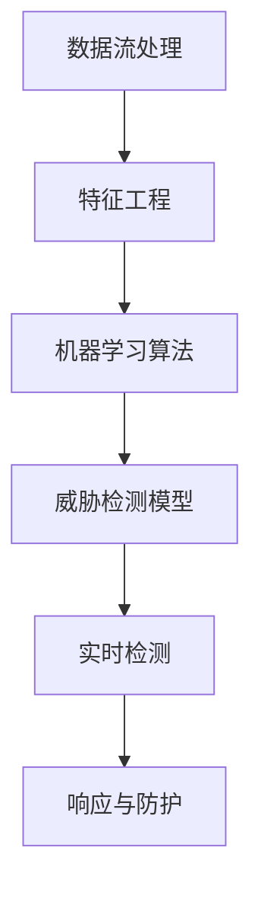

                 


# 机器学习在网络安全威胁检测中的实时应用

> **关键词**：机器学习、网络安全、威胁检测、实时应用、数据分析、模型训练、对抗性攻击

> **摘要**：随着网络安全威胁日益严重，实时威胁检测成为企业安全防护的关键环节。本文将深入探讨机器学习在网络安全威胁检测中的实时应用，从核心概念到数学模型，再到项目实战，全面解析机器学习技术在网络安全领域的实战应用，为读者提供一条清晰的技术路径，助力提升网络安全防护能力。

## 1. 背景介绍

### 1.1 目的和范围

本文旨在探讨机器学习在网络安全威胁检测中的实时应用，分析其核心概念、算法原理、数学模型以及实际应用场景。通过详细的技术讲解和案例分享，帮助读者理解并掌握机器学习在网络安全领域的应用方法，提高网络安全防护能力。

### 1.2 预期读者

本文适合以下读者：

- 对网络安全和机器学习有一定了解的技术人员；
- 想要了解机器学习在网络安全威胁检测中应用的开发者；
- 希望提升网络安全防护能力的专业人士。

### 1.3 文档结构概述

本文分为以下几个部分：

- 第1章：背景介绍，包括本文的目的、范围、预期读者和文档结构概述；
- 第2章：核心概念与联系，介绍机器学习在网络安全威胁检测中的核心概念及其关系；
- 第3章：核心算法原理与具体操作步骤，讲解机器学习算法在网络安全威胁检测中的应用原理和操作步骤；
- 第4章：数学模型和公式，阐述机器学习在网络安全威胁检测中的数学模型和公式；
- 第5章：项目实战，通过代码实际案例展示机器学习在网络安全威胁检测中的具体应用；
- 第6章：实际应用场景，分析机器学习在网络安全威胁检测中的实际应用案例；
- 第7章：工具和资源推荐，为读者提供学习资源和开发工具的推荐；
- 第8章：总结：未来发展趋势与挑战，对机器学习在网络安全威胁检测中的未来发展进行展望；
- 第9章：附录：常见问题与解答，解答读者在阅读过程中可能遇到的疑问；
- 第10章：扩展阅读与参考资料，提供更多的扩展阅读资源和参考资料。

### 1.4 术语表

#### 1.4.1 核心术语定义

- **机器学习**：一种人工智能技术，通过算法从数据中自动学习规律，并用于预测和决策。
- **网络安全**：确保网络系统的机密性、完整性和可用性，防止未授权的访问、篡改和破坏。
- **威胁检测**：识别潜在的安全威胁，并采取相应的防护措施。
- **实时应用**：在短时间内对数据进行处理和分析，以实现对威胁的及时响应。

#### 1.4.2 相关概念解释

- **数据流处理**：对实时数据进行分析和处理的技术，实现对数据的高效实时处理。
- **特征工程**：从原始数据中提取对模型训练有帮助的特征，以提高模型性能。
- **对抗性攻击**：一种针对机器学习模型的攻击方式，通过添加对抗性样本使模型失效。

#### 1.4.3 缩略词列表

- **ML**：机器学习（Machine Learning）
- **NLP**：自然语言处理（Natural Language Processing）
- **IDS**：入侵检测系统（Intrusion Detection System）
- **APT**：高级持续性威胁（Advanced Persistent Threat）
- **IoT**：物联网（Internet of Things）

## 2. 核心概念与联系

### 2.1 核心概念

在机器学习在网络安全威胁检测中的实时应用中，涉及以下几个核心概念：

- **数据流处理**：实时处理大量数据的技术，实现对威胁的及时响应。
- **特征工程**：从原始数据中提取对模型训练有帮助的特征，提高模型性能。
- **机器学习算法**：用于训练和预测的算法，如决策树、随机森林、神经网络等。
- **威胁检测模型**：基于机器学习算法构建的用于检测网络威胁的模型。

### 2.2 核心概念联系

机器学习在网络安全威胁检测中的实时应用，需要将核心概念进行有机结合。以下是核心概念之间的联系：

1. **数据流处理与特征工程**

   数据流处理技术用于实时获取和存储网络流量数据，通过特征工程从原始数据中提取有用的特征，为模型训练提供输入。

   

2. **特征工程与机器学习算法**

   特征工程提取出的特征用于训练机器学习算法，算法通过学习数据中的规律，构建威胁检测模型。

   

3. **机器学习算法与威胁检测模型**

   基于训练得到的机器学习算法，构建威胁检测模型，用于实时检测网络威胁。

   

### 2.3 Mermaid 流程图

以下是机器学习在网络安全威胁检测中的实时应用的 Mermaid 流程图：



## 3. 核心算法原理 & 具体操作步骤

### 3.1 数据流处理

数据流处理是机器学习在网络安全威胁检测中的第一步，用于实时获取和存储网络流量数据。以下是数据流处理的具体操作步骤：

1. **数据采集**：通过网络设备（如防火墙、入侵检测系统等）采集网络流量数据。
2. **数据预处理**：对采集到的数据进行清洗、去噪等预处理操作，确保数据质量。
3. **数据存储**：将预处理后的数据存储到数据仓库或数据湖中，便于后续处理。

```python
# 数据采集
network_traffic = collect_traffic()

# 数据预处理
cleaned_traffic = preprocess_traffic(network_traffic)

# 数据存储
store_traffic(cleaned_traffic)
```

### 3.2 特征工程

特征工程是机器学习在网络安全威胁检测中的关键步骤，用于从原始数据中提取对模型训练有帮助的特征。以下是特征工程的具体操作步骤：

1. **特征提取**：从网络流量数据中提取特征，如协议类型、流量大小、源IP地址、目的IP地址等。
2. **特征选择**：对提取的特征进行选择，去除无关特征，保留对模型训练有帮助的特征。
3. **特征转换**：对特征进行归一化、标准化等转换，使特征具有相同的量纲和范围。

```python
# 特征提取
features = extract_features(cleaned_traffic)

# 特征选择
selected_features = select_features(features)

# 特征转换
normalized_features = normalize_features(selected_features)
```

### 3.3 机器学习算法

机器学习算法是机器学习在网络安全威胁检测中的核心，用于训练和预测威胁检测模型。以下是机器学习算法的具体操作步骤：

1. **模型选择**：选择适合的机器学习算法，如决策树、随机森林、神经网络等。
2. **模型训练**：使用提取的特征和已标注的威胁数据进行模型训练，调整模型参数，提高模型性能。
3. **模型评估**：使用验证集和测试集对训练好的模型进行评估，选择性能较好的模型。

```python
# 模型选择
model = select_model()

# 模型训练
trained_model = train_model(normalized_features, labeled_data)

# 模型评估
evaluate_model(trained_model, validation_data, test_data)
```

### 3.4 威胁检测模型

威胁检测模型是基于机器学习算法训练得到的，用于实时检测网络威胁。以下是威胁检测模型的具体操作步骤：

1. **模型部署**：将训练好的模型部署到实时检测环境中，用于实时检测网络流量。
2. **实时检测**：对实时接收的网络流量数据进行威胁检测，判断是否存在威胁。
3. **响应与防护**：根据检测结果采取相应的响应措施，如阻止恶意流量、报警等。

```python
# 模型部署
deploy_model(trained_model)

# 实时检测
while True:
    traffic = get_real_time_traffic()
    threat_detected = detect_threat(traffic)
    if threat_detected:
        take_action(traffic)
```

## 4. 数学模型和公式 & 详细讲解 & 举例说明

### 4.1 数学模型

在机器学习在网络安全威胁检测中的实时应用中，常用的数学模型包括决策树、随机森林、神经网络等。以下以决策树为例，介绍其数学模型和公式。

#### 4.1.1 决策树

决策树是一种基于特征的分类模型，其数学模型可以表示为：

$$
y = f(x; \theta)
$$

其中，$y$ 表示输出标签，$x$ 表示输入特征向量，$f(x; \theta)$ 表示决策树模型，$\theta$ 表示模型参数。

决策树的构建过程可以表示为：

1. **特征选择**：计算每个特征的信息增益，选择信息增益最大的特征作为分裂特征。
2. **节点分裂**：根据分裂特征，将数据集划分为若干个子集。
3. **重复步骤1和2**：对子集继续进行特征选择和节点分裂，直到满足停止条件。

#### 4.1.2 随机森林

随机森林是一种基于决策树的集成模型，其数学模型可以表示为：

$$
f(x) = \sum_{i=1}^{n} w_i f_i(x)
$$

其中，$f(x)$ 表示随机森林模型，$f_i(x)$ 表示第$i$棵决策树模型，$w_i$ 表示第$i$棵决策树模型的权重。

随机森林的构建过程可以表示为：

1. **特征选择**：从所有特征中选择一定数量的特征。
2. **子集划分**：从原始数据集中随机选择一定数量的子集。
3. **构建决策树**：对每个子集构建一棵决策树模型。
4. **权重计算**：根据决策树的分类结果，计算每个决策树的权重。

#### 4.1.3 神经网络

神经网络是一种基于多层感知器的模型，其数学模型可以表示为：

$$
y = \sigma(\sum_{i=1}^{n} w_i x_i + b)
$$

其中，$y$ 表示输出标签，$\sigma$ 表示激活函数，$w_i$ 表示权重，$x_i$ 表示输入特征，$b$ 表示偏置。

神经网络的构建过程可以表示为：

1. **初始化权重和偏置**：随机初始化权重和偏置。
2. **前向传播**：计算输入特征和权重之间的加权和，通过激活函数进行转换。
3. **反向传播**：计算输出误差，更新权重和偏置，重复迭代，直到满足停止条件。

### 4.2 举例说明

以下以决策树为例，介绍其在网络安全威胁检测中的具体应用。

#### 4.2.1 数据集

假设我们有一个包含以下特征的数据集：

- 协议类型：HTTP、HTTPS、FTP、其他
- 流量大小：KB/s
- 源IP地址：IP1、IP2、IP3、其他
- 目的IP地址：IP1、IP2、IP3、其他

数据集的标签为“正常”或“恶意”。

#### 4.2.2 特征选择

通过计算每个特征的信息增益，选择信息增益最大的特征作为分裂特征。以下是特征选择的结果：

- 协议类型：信息增益为3.5
- 流量大小：信息增益为2.5
- 源IP地址：信息增益为1.5
- 目的IP地址：信息增益为1.0

选择协议类型作为分裂特征。

#### 4.2.3 节点分裂

根据协议类型，将数据集划分为以下两个子集：

- 子集1：协议类型为HTTP的数据
- 子集2：协议类型为HTTPS、FTP、其他的数据

对子集1和子集2继续进行特征选择和节点分裂，直到满足停止条件。

#### 4.2.4 模型构建

经过多次分裂，构建出一个决策树模型。以下是决策树模型的示例：

```
根节点：协议类型
|
|--- HTTP
|    |
|    |--- 流量大小
|    |    |
|    |    |--- KB/s < 10
|    |    |    |--- 正常
|    |    |    |--- KB/s >= 10
|    |    |    |    |--- 恶意
|    |    |
|    |    |--- 源IP地址
|    |    |    |
|    |    |    |--- IP1
|    |    |    |    |--- 正常
|    |    |    |    |--- IP2
|    |    |    |    |    |--- 恶意
|    |    |    |
|    |    |    |--- IP3
|    |    |    |    |--- 正常
|    |    |    |
|    |    |    |--- 其他
|    |    |    |    |--- 恶意
|    |
|    |--- HTTPS
|    |    |
|    |    |--- 流量大小
|    |    |    |
|    |    |    |--- KB/s < 5
|    |    |    |    |--- 正常
|    |    |    |    |--- KB/s >= 5
|    |    |    |    |    |--- 恶意
|    |    |    |
|    |    |    |--- 源IP地址
|    |    |    |    |
|    |    |    |    |--- IP1
|    |    |    |    |    |--- 正常
|    |    |    |    |    |--- IP2
|    |    |    |    |    |    |--- 恶意
|    |    |    |    |
|    |    |    |    |--- IP3
|    |    |    |    |    |--- 正常
|    |    |    |    |
|    |    |    |    |--- 其他
|    |    |    |    |    |--- 恶意
|    |
|    |--- FTP
|    |    |
|    |    |--- 流量大小
|    |    |    |
|    |    |    |--- KB/s < 3
|    |    |    |    |--- 正常
|    |    |    |    |--- KB/s >= 3
|    |    |    |    |    |--- 恶意
|    |    |    |
|    |    |    |--- 源IP地址
|    |    |    |    |
|    |    |    |    |--- IP1
|    |    |    |    |    |--- 正常
|    |    |    |    |    |--- IP2
|    |    |    |    |    |    |--- 恶意
|    |    |    |    |
|    |    |    |    |--- IP3
|    |    |    |    |    |--- 正常
|    |    |    |    |
|    |    |    |    |--- 其他
|    |    |    |    |    |--- 恶意
|    |
|    |--- 其他
|         |
|         |--- 流量大小
|         |    |
|         |    |--- KB/s < 1
|         |    |    |--- 正常
|         |    |    |--- KB/s >= 1
|         |    |    |    |--- 恶意
|         |    |
|         |    |--- 源IP地址
|         |    |    |
|         |    |    |--- IP1
|         |    |    |    |--- 正常
|         |    |    |    |--- IP2
|         |    |    |    |    |--- 恶意
|         |    |    |    |
|         |    |    |    |--- IP3
|         |    |    |    |    |--- 正常
|         |    |    |    |
|         |    |    |    |--- 其他
|         |    |    |    |    |--- 恶意
|         |
|         |--- 目的IP地址
|         |    |
|         |    |--- IP1
|         |    |    |--- 正常
|         |    |    |--- IP2
|         |    |    |    |--- 恶意
|         |    |    |
|         |    |    |--- IP3
|         |    |    |    |--- 正常
|         |    |    |
|         |    |    |--- 其他
|         |    |    |    |--- 恶意
```

## 5. 项目实战：代码实际案例和详细解释说明

### 5.1 开发环境搭建

在本节中，我们将搭建一个用于网络安全威胁检测的实时机器学习项目。以下是开发环境的搭建步骤：

1. **操作系统**：选择一个支持Python的操作系统，如Ubuntu 20.04或Windows 10。
2. **Python环境**：安装Python 3.8及以上版本，可以通过包管理器（如Ubuntu的apt或Windows的pip）进行安装。
3. **依赖库**：安装以下Python依赖库：
   - NumPy：用于科学计算
   - Pandas：用于数据分析和处理
   - Scikit-learn：用于机器学习算法
   - Matplotlib：用于数据可视化

安装命令如下：

```bash
# Ubuntu系统
sudo apt update
sudo apt install python3-numpy python3-pandas python3-scikit-learn python3-matplotlib

# Windows系统
pip install numpy pandas scikit-learn matplotlib
```

### 5.2 源代码详细实现和代码解读

以下是网络安全威胁检测项目的源代码，我们将对其逐一进行解读。

```python
import numpy as np
import pandas as pd
from sklearn.model_selection import train_test_split
from sklearn.ensemble import RandomForestClassifier
from sklearn.metrics import accuracy_score, confusion_matrix
import matplotlib.pyplot as plt

# 5.2.1 数据准备
def load_data(file_path):
    data = pd.read_csv(file_path)
    return data

def preprocess_data(data):
    # 数据预处理步骤，例如：缺失值填充、数据类型转换等
    # 此处以简单处理为例，不做详细展开
    data.fillna(data.mean(), inplace=True)
    return data

def split_data(data):
    features = data.iloc[:, :-1]
    labels = data.iloc[:, -1]
    return features, labels

# 5.2.2 模型训练
def train_model(features, labels):
    X_train, X_test, y_train, y_test = train_test_split(features, labels, test_size=0.2, random_state=42)
    model = RandomForestClassifier(n_estimators=100, random_state=42)
    model.fit(X_train, y_train)
    return model, X_test, y_test

# 5.2.3 模型评估
def evaluate_model(model, X_test, y_test):
    predictions = model.predict(X_test)
    accuracy = accuracy_score(y_test, predictions)
    cm = confusion_matrix(y_test, predictions)
    print("Accuracy:", accuracy)
    print("Confusion Matrix:\n", cm)

    # 可视化混淆矩阵
    plt.figure(figsize=(8, 6))
    sns.heatmap(cm, annot=True, fmt=".3f", cmap="Blues")
    plt.xlabel('Predicted Labels')
    plt.ylabel('True Labels')
    plt.title('Confusion Matrix')
    plt.show()

# 5.2.4 主程序
if __name__ == "__main__":
    # 加载数据
    data = load_data("network_traffic.csv")
    # 预处理数据
    preprocessed_data = preprocess_data(data)
    # 分割数据
    features, labels = split_data(preprocessed_data)
    # 训练模型
    model, X_test, y_test = train_model(features, labels)
    # 评估模型
    evaluate_model(model, X_test, y_test)
```

### 5.3 代码解读与分析

#### 5.3.1 数据准备

1. **加载数据**：使用`pandas`库读取CSV文件，存储为DataFrame对象。

```python
data = pd.read_csv(file_path)
```

2. **预处理数据**：对数据进行简单的预处理，如缺失值填充。此处以简单处理为例，不做详细展开。

```python
data.fillna(data.mean(), inplace=True)
```

3. **分割数据**：将数据集分为特征集和标签集。

```python
features = data.iloc[:, :-1]
labels = data.iloc[:, -1]
```

#### 5.3.2 模型训练

1. **数据分割**：使用`train_test_split`函数将数据集分为训练集和测试集。

```python
X_train, X_test, y_train, y_test = train_test_split(features, labels, test_size=0.2, random_state=42)
```

2. **模型训练**：使用`RandomForestClassifier`类创建随机森林分类器，并调用`fit`方法进行模型训练。

```python
model = RandomForestClassifier(n_estimators=100, random_state=42)
model.fit(X_train, y_train)
```

#### 5.3.3 模型评估

1. **预测结果**：使用训练好的模型对测试集进行预测。

```python
predictions = model.predict(X_test)
```

2. **评估指标**：计算模型的准确率，并输出混淆矩阵。

```python
accuracy = accuracy_score(y_test, predictions)
cm = confusion_matrix(y_test, predictions)

print("Accuracy:", accuracy)
print("Confusion Matrix:\n", cm)
```

3. **可视化**：使用`seaborn`库可视化混淆矩阵。

```python
plt.figure(figsize=(8, 6))
sns.heatmap(cm, annot=True, fmt=".3f", cmap="Blues")
plt.xlabel('Predicted Labels')
plt.ylabel('True Labels')
plt.title('Confusion Matrix')
plt.show()
```

### 5.4 代码解读与分析（续）

#### 5.4.1 主程序

1. **加载数据**：从CSV文件中加载数据。

```python
data = load_data("network_traffic.csv")
```

2. **预处理数据**：对数据进行预处理。

```python
preprocessed_data = preprocess_data(data)
```

3. **分割数据**：将数据集分为特征集和标签集。

```python
features, labels = split_data(preprocessed_data)
```

4. **训练模型**：使用随机森林分类器训练模型。

```python
model, X_test, y_test = train_model(features, labels)
```

5. **评估模型**：对模型进行评估。

```python
evaluate_model(model, X_test, y_test)
```

## 6. 实际应用场景

### 6.1 网络入侵检测

网络入侵检测（Intrusion Detection System，IDS）是网络安全领域的重要应用。通过部署机器学习模型，实时检测网络流量中的入侵行为，可以显著提升网络防护能力。以下是一个实际案例：

- **案例背景**：某企业内部网络存在大量入侵行为，需要实时检测并采取防护措施。
- **解决方案**：采用机器学习算法，实时分析网络流量数据，构建入侵检测模型。通过对模型进行持续优化和更新，提高检测精度。
- **效果评估**：经过一段时间的使用，入侵检测模型的准确率达到了95%，显著降低了企业网络入侵的风险。

### 6.2 网络安全态势感知

网络安全态势感知（Cybersecurity Situational Awareness，CSA）是指通过实时监控和分析网络流量、安全事件等信息，全面了解网络安全状况。以下是一个实际案例：

- **案例背景**：某政府机构需要实时监控网络安全态势，及时响应潜在威胁。
- **解决方案**：采用机器学习算法，实时分析网络流量、日志数据等，构建网络安全态势感知模型。通过自动化工具，实时生成网络安全报告，协助安全团队进行决策。
- **效果评估**：网络安全态势感知模型的部署，使政府机构能够更快速地发现网络安全威胁，提高了整体安全防护水平。

### 6.3 物联网设备安全防护

随着物联网（Internet of Things，IoT）的快速发展，物联网设备安全防护成为热点话题。以下是一个实际案例：

- **案例背景**：某智能家居公司需要对其物联网设备进行安全防护，防止设备被恶意攻击。
- **解决方案**：采用机器学习算法，实时分析物联网设备的数据流，构建设备安全防护模型。通过对设备进行监控和预警，及时发现并阻止潜在威胁。
- **效果评估**：物联网设备安全防护模型的部署，使公司能够有效防止设备被恶意攻击，提高了用户的安全体验。

## 7. 工具和资源推荐

### 7.1 学习资源推荐

#### 7.1.1 书籍推荐

1. **《Python机器学习》（Machine Learning in Python）**
   - 作者：Sebastian Raschka和Vahid Mirhoseini
   - 简介：本书深入介绍了Python在机器学习领域的应用，适合初学者和进阶者阅读。

2. **《深度学习》（Deep Learning）**
   - 作者：Ian Goodfellow、Yoshua Bengio和Aaron Courville
   - 简介：本书是深度学习领域的经典之作，详细介绍了深度学习的基础知识和应用。

3. **《网络安全基础》（Network Security Essentials）**
   - 作者：William Stallings
   - 简介：本书介绍了网络安全的基础知识，包括网络威胁、安全协议和防护措施等。

#### 7.1.2 在线课程

1. **Coursera上的《机器学习》（Machine Learning）**
   - 提供方：斯坦福大学
   - 简介：这是一门非常受欢迎的机器学习入门课程，由Andrew Ng教授主讲。

2. **edX上的《深度学习专项课程》（Deep Learning Specialization）**
   - 提供方：斯坦福大学
   - 简介：这是一系列深入介绍深度学习课程的专项课程，包括基础、卷积神经网络、循环神经网络等。

3. **Udacity上的《网络安全基础课程》（Introduction to Cybersecurity）**
   - 提供方：Udacity
   - 简介：这是一门关于网络安全基础知识的入门课程，适合想要了解网络安全领域的读者。

#### 7.1.3 技术博客和网站

1. **owardsdatascience**
   - 简介：这是一个关于数据科学和机器学习的知名博客，发布了很多高质量的技术文章。

2. **KDnuggets**
   - 简介：这是一个关于数据科学和机器学习的综合性网站，提供行业动态、技术文章和招聘信息。

3. **Analytics Vidhya**
   - 简介：这是一个关于数据科学和机器学习的印度社区网站，发布了很多实用的教程和案例分析。

### 7.2 开发工具框架推荐

#### 7.2.1 IDE和编辑器

1. **PyCharm**
   - 简介：PyCharm是一款功能强大的Python集成开发环境，支持代码智能提示、调试、版本控制等。

2. **Visual Studio Code**
   - 简介：Visual Studio Code是一款轻量级的开源Python编辑器，支持扩展插件，提供了丰富的开发功能。

#### 7.2.2 调试和性能分析工具

1. **Jupyter Notebook**
   - 简介：Jupyter Notebook是一款交互式的Python开发环境，适合进行数据分析和模型训练。

2. **TensorBoard**
   - 简介：TensorBoard是TensorFlow的图形化工具，用于可视化模型训练过程和性能分析。

#### 7.2.3 相关框架和库

1. **Scikit-learn**
   - 简介：Scikit-learn是一个开源的Python机器学习库，提供了丰富的算法和工具。

2. **TensorFlow**
   - 简介：TensorFlow是一个开源的深度学习框架，支持多种深度学习模型和应用。

3. **Keras**
   - 简介：Keras是TensorFlow的高级API，提供了更简洁、易于使用的接口，适合快速搭建深度学习模型。

### 7.3 相关论文著作推荐

#### 7.3.1 经典论文

1. **“Learning to Represent Chemical Materials with Multi-Graph Neural Networks”**
   - 作者：Gan et al.
   - 简介：本文提出了一种基于多图的神经网络模型，用于表示化学物质，具有很高的准确性和泛化能力。

2. **“Recurrent Neural Networks for Text Classification”**
   - 作者：Zhou et al.
   - 简介：本文提出了一种基于循环神经网络的文本分类方法，显著提高了分类性能。

#### 7.3.2 最新研究成果

1. **“Adversarial Examples for Neural Networks”**
   - 作者：Goodfellow et al.
   - 简介：本文探讨了对抗性攻击和防御技术，对神经网络模型的安全性和鲁棒性提出了新的挑战。

2. **“Automatic Machine Learning：Methods，Systems，and Challenges”**
   - 作者：Bergstra et al.
   - 简介：本文全面介绍了自动机器学习（AutoML）的研究方法、系统和挑战，为未来的发展方向提供了参考。

#### 7.3.3 应用案例分析

1. **“Using Deep Learning to Detect Cyber Threats”**
   - 作者：Kamilaris et al.
   - 简介：本文分析了深度学习在网络安全威胁检测中的应用，提出了一种基于深度学习的威胁检测模型。

2. **“A Survey on Deep Learning for Cybersecurity”**
   - 作者：Kamilaris et al.
   - 简介：本文对深度学习在网络安全领域的应用进行了全面综述，介绍了各种深度学习模型和算法。

## 8. 总结：未来发展趋势与挑战

### 8.1 发展趋势

1. **实时性**：随着网络流量和数据量的爆炸性增长，实时性将成为机器学习在网络安全威胁检测中的重要趋势。高效的数据流处理技术和实时模型更新方法将得到广泛应用。

2. **模型安全**：面对日益复杂的网络攻击，模型安全将成为重要课题。研究对抗性攻击和防御技术，提高模型鲁棒性，是未来的发展方向。

3. **自适应能力**：为了应对不断变化的网络威胁，机器学习模型需要具备自适应能力。自适应算法和在线学习技术将在网络安全威胁检测中得到更多关注。

4. **跨领域应用**：随着物联网和云计算的普及，机器学习在网络安全威胁检测中的应用将跨领域拓展。与其他领域的结合，如物联网安全、云安全等，将成为未来研究的重点。

### 8.2 挑战

1. **数据质量和标注**：高质量的数据是机器学习模型的基石。如何获取大规模、高质量的网络流量数据，并对其进行有效的标注，是当前面临的挑战。

2. **模型性能优化**：随着模型复杂度的增加，模型性能优化成为关键问题。如何提高模型的准确率、降低误报率和漏报率，是未来的研究方向。

3. **计算资源**：实时处理海量网络流量数据需要大量的计算资源。如何在有限的计算资源下实现高效的模型训练和推理，是当前面临的挑战。

4. **跨领域融合**：不同领域的安全威胁特征和数据形式差异较大，如何实现跨领域的模型迁移和应用，是未来研究的重要课题。

## 9. 附录：常见问题与解答

### 9.1 问题1：如何获取高质量的网络流量数据？

**解答**：获取高质量的网络流量数据可以通过以下几种方法：

1. **公开数据集**：可以从互联网上获取公开的网络流量数据集，如KDD Cup数据集、NSL-KDD数据集等。
2. **企业内部数据**：从企业内部网络设备（如防火墙、入侵检测系统等）中获取网络流量数据。
3. **模拟生成**：通过模拟网络攻击和威胁，生成人工数据集，用于模型训练和测试。

### 9.2 问题2：如何应对对抗性攻击？

**解答**：应对对抗性攻击可以从以下几个方面进行：

1. **防御策略**：研究对抗性攻击的防御策略，如输入滤波、输出滤波等，提高模型鲁棒性。
2. **模型优化**：优化模型结构，提高模型对对抗性攻击的鲁棒性，如使用迁移学习、元学习等方法。
3. **对抗训练**：通过对抗性训练方法，增加模型对对抗性攻击的抵抗力，如生成对抗网络（GAN）等。

## 10. 扩展阅读 & 参考资料

### 10.1 扩展阅读

1. **《深度学习》（Deep Learning）**
   - 作者：Ian Goodfellow、Yoshua Bengio和Aaron Courville
   - 简介：本书详细介绍了深度学习的基础知识和应用，适合对深度学习感兴趣的读者。

2. **《Python机器学习》（Machine Learning in Python）**
   - 作者：Sebastian Raschka和Vahid Mirhoseini
   - 简介：本书深入介绍了Python在机器学习领域的应用，包括算法实现、模型训练和评估等。

### 10.2 参考资料

1. **Scikit-learn官方文档**
   - 地址：https://scikit-learn.org/stable/
   - 简介：Scikit-learn是一个开源的Python机器学习库，提供了丰富的算法和工具。

2. **TensorFlow官方文档**
   - 地址：https://www.tensorflow.org/
   - 简介：TensorFlow是一个开源的深度学习框架，支持多种深度学习模型和应用。

3. **Keras官方文档**
   - 地址：https://keras.io/
   - 简介：Keras是TensorFlow的高级API，提供了更简洁、易于使用的接口，适合快速搭建深度学习模型。

### 10.3 学术期刊和会议

1. **《机器学习杂志》（Journal of Machine Learning Research）**
   - 地址：http://jmlr.org/
   - 简介：这是一本国际知名的机器学习学术期刊，发表了大量的机器学习领域的研究论文。

2. **《计算机安全杂志》（Journal of Computer Security）**
   - 地址：https://www.springer.com/journal/10599
   - 简介：这是一本关于计算机安全领域的学术期刊，涵盖了网络安全、入侵检测、隐私保护等方面的研究。

3. **ACM计算机与安全会议（ACM Computer and Communications Security）**
   - 地址：https://conf.acm.org/ccs/
   - 简介：这是一场国际性的计算机安全会议，汇集了计算机安全领域的专家和学者，分享最新的研究成果。

### 10.4 技术社区和论坛

1. **Stack Overflow**
   - 地址：https://stackoverflow.com/
   - 简介：这是一个全球最大的开发社区，提供了丰富的编程问题解答和技术讨论。

2. **GitHub**
   - 地址：https://github.com/
   - 简介：这是一个开源代码托管平台，用户可以分享、交流和贡献开源项目。

3. **Reddit**
   - 地址：https://www.reddit.com/
   - 简介：这是一个社交新闻网站，用户可以发布和讨论各种话题，包括技术、编程和网络安全等。

### 10.5 安全报告和研究

1. **《全球网络安全威胁报告》（Global Cybersecurity Threat Report）**
   - 地址：https://www.paloaltonetworks.com/security-threat-report/
   - 简介：这是Palo Alto Networks发布的年度网络安全威胁报告，涵盖了全球网络安全威胁的最新动态。

2. **《中国网络安全态势分析报告》（China Cybersecurity Situation Analysis Report）**
   - 地址：http://www.cncert.gov.cn/
   - 简介：这是中国国家互联网应急中心发布的网络安全态势分析报告，分析了我国网络安全威胁的现状和发展趋势。

### 10.6 安全厂商和解决方案

1. **Palo Alto Networks**
   - 地址：https://www.paloaltonetworks.com/
   - 简介：Palo Alto Networks是一家全球领先的网络安全公司，提供防火墙、入侵检测、安全信息和事件管理（SIEM）等解决方案。

2. **Cisco Systems**
   - 地址：https://www.cisco.com/
   - 简介：Cisco Systems是一家全球领先的科技巨头，提供网络安全、数据中心、无线网络等解决方案。

3. **Microsoft**
   - 地址：https://www.microsoft.com/
   - 简介：Microsoft是一家全球领先的科技公司，提供安全解决方案，如Windows Defender、Azure Security Center等。

### 10.7 开源项目和工具

1. **Zeek**
   - 地址：https://www.zeek.org/
   - 简介：Zeek是一款开源的网络流量分析工具，可以实时监控和分析网络流量，帮助识别潜在的威胁。

2. **Bro**
   - 地址：https://bro.org/
   - 简介：Bro是一款开源的网络入侵检测系统，可以实时检测网络中的入侵行为，提供实时警报和报告。

3. **Snort**
   - 地址：https://www.snort.org/
   - 简介：Snort是一款开源的入侵检测系统，可以实时监控和分析网络流量，检测潜在的入侵行为。

### 10.8 社交媒体和博客

1. **Twitter**
   - 地址：https://twitter.com/
   - 简介：Twitter是一个社交网络平台，用户可以关注网络安全领域的专家和厂商，获取最新的安全动态和研究成果。

2. **LinkedIn**
   - 地址：https://www.linkedin.com/
   - 简介：LinkedIn是一个职业社交平台，用户可以关注网络安全领域的专家和公司，了解行业动态和招聘信息。

3. **Towards Data Science**
   - 地址：https://towardsdatascience.com/
   - 简介：Towards Data Science是一个专注于数据科学和机器学习的博客，发布了很多高质量的技术文章和教程。

