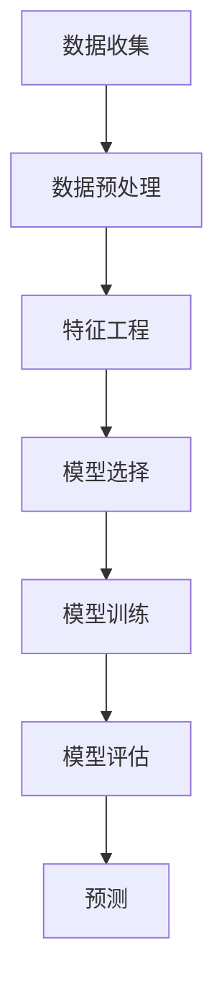

                 


# 机器学习在股票市场预测中的新型算法

> 关键词：机器学习、股票市场预测、新型算法、预测模型、数据分析、金融科技
> 
> 摘要：本文将深入探讨机器学习在股票市场预测中的应用，介绍新型算法的核心原理和具体操作步骤。通过数学模型、实际案例和详细解释，读者将了解如何利用机器学习技术提升股票市场预测的准确性。本文旨在为金融科技从业者和对机器学习有浓厚兴趣的读者提供有价值的参考。

## 1. 背景介绍

### 1.1 目的和范围

本文旨在探讨机器学习在股票市场预测中的新型算法应用。随着金融科技的迅猛发展，机器学习技术已经成为股票市场分析和预测的重要工具。本文将详细分析新型算法的原理、实现步骤，并通过实际案例展示其在股票市场预测中的潜在价值。

### 1.2 预期读者

本文适合以下读者群体：

1. 金融科技从业者和分析师，对股票市场预测算法有深入研究的兴趣。
2. 对机器学习技术有基础了解，并希望将其应用于金融领域的专业人士。
3. 对金融科技和人工智能有浓厚兴趣的大学生和研究学者。

### 1.3 文档结构概述

本文结构如下：

1. **背景介绍**：介绍文章的目的和范围，预期读者以及文档结构概述。
2. **核心概念与联系**：阐述机器学习在股票市场预测中的核心概念和联系。
3. **核心算法原理 & 具体操作步骤**：详细讲解新型算法的原理和操作步骤。
4. **数学模型和公式 & 详细讲解 & 举例说明**：介绍数学模型和公式，并提供实例说明。
5. **项目实战：代码实际案例和详细解释说明**：通过实际案例展示算法应用。
6. **实际应用场景**：讨论算法在实际股票市场预测中的应用。
7. **工具和资源推荐**：推荐学习资源和开发工具。
8. **总结：未来发展趋势与挑战**：总结文章的主要内容和未来发展趋势。
9. **附录：常见问题与解答**：提供常见问题的解答。
10. **扩展阅读 & 参考资料**：推荐相关文献和资源。

### 1.4 术语表

#### 1.4.1 核心术语定义

- **机器学习**：一种人工智能领域的技术，通过训练算法从数据中自动学习和发现规律。
- **股票市场预测**：利用历史数据和算法预测股票价格和市场的走势。
- **预测模型**：用于预测股票价格和市场的数学模型。
- **金融科技**：利用技术和创新来改善金融服务和产品。

#### 1.4.2 相关概念解释

- **监督学习**：一种机器学习方法，通过对输入和输出数据的训练，使模型能够对新数据进行预测。
- **无监督学习**：一种机器学习方法，模型仅基于输入数据，无需明确标注输出数据，用于发现数据中的隐藏结构和模式。
- **深度学习**：一种机器学习方法，通过多层神经网络对数据进行建模和预测。

#### 1.4.3 缩略词列表

- **ML**：Machine Learning（机器学习）
- **DL**：Deep Learning（深度学习）
- **NN**：Neural Network（神经网络）
- **NLP**：Natural Language Processing（自然语言处理）
- **AI**：Artificial Intelligence（人工智能）

## 2. 核心概念与联系

### 2.1 机器学习在股票市场预测中的核心概念

在股票市场预测中，机器学习通过以下核心概念发挥作用：

- **特征工程**：提取和选择对预测有用的数据特征，以提升模型性能。
- **模型训练**：使用历史数据训练模型，使其学会从数据中提取规律和模式。
- **模型评估**：通过交叉验证等手段评估模型在未知数据上的表现，以确定模型的有效性。
- **预测**：使用训练好的模型对股票价格和市场走势进行预测。

### 2.2 机器学习在股票市场预测中的应用架构

下面是机器学习在股票市场预测中的应用架构图：



- **数据收集**：从各种数据源收集股票市场的历史数据，包括价格、成交量、交易量、公司基本面数据等。
- **数据预处理**：对收集到的数据进行清洗、归一化和缺失值处理，使其适合建模。
- **特征工程**：提取和选择对预测有用的特征，如技术指标、财务指标等。
- **模型选择**：选择适合的机器学习模型，如线性回归、决策树、支持向量机、神经网络等。
- **模型训练**：使用历史数据训练模型，使其能够从数据中学习到预测规律。
- **模型评估**：使用交叉验证等手段评估模型在未知数据上的性能。
- **预测**：使用训练好的模型对新数据进行预测，生成股票价格和市场走势的预测结果。

## 3. 核心算法原理 & 具体操作步骤

### 3.1 新型算法原理

在本文中，我们将介绍一种基于深度学习的股票市场预测算法，该算法通过以下核心原理发挥作用：

- **多层神经网络**：利用多层神经网络对股票市场数据进行建模，能够自动提取复杂的数据特征。
- **反向传播算法**：通过反向传播算法优化神经网络参数，使模型能够更好地拟合数据。
- **激活函数**：使用ReLU等激活函数增加神经网络的非线性能力，提高模型预测能力。

### 3.2 具体操作步骤

下面是新型算法的具体操作步骤：

1. **数据收集**：

   首先，从股票市场数据源收集历史股票价格数据，包括开盘价、收盘价、最高价、最低价和成交量等。

2. **数据预处理**：

   对收集到的数据进行清洗和归一化处理，使其适合神经网络建模。

   ```python
   # 示例代码：数据预处理
   import pandas as pd
   import numpy as np
   
   # 读取数据
   data = pd.read_csv('stock_data.csv')
   # 数据清洗
   data = data.dropna()
   # 数据归一化
   data = (data - data.mean()) / data.std()
   ```

3. **特征工程**：

   提取对预测有用的特征，如移动平均线、相对强弱指数（RSI）、布林带等。

   ```python
   # 示例代码：特征工程
   data['MA_10'] = data['Close'].rolling(window=10).mean()
   data['RSI'] = calculate_rsi(data['Close'])
   data['Bollinger_Upper'] = data['MA_20'] + 2 * data['STD']
   data['Bollinger_Lower'] = data['MA_20'] - 2 * data['STD']
   ```

4. **模型选择**：

   选择合适的深度学习模型，如LSTM（长短时记忆网络）或CNN（卷积神经网络）。

   ```python
   # 示例代码：模型选择
   from tensorflow.keras.models import Sequential
   from tensorflow.keras.layers import LSTM, Dense, Dropout
   
   model = Sequential()
   model.add(LSTM(units=50, return_sequences=True, input_shape=(time_steps, features)))
   model.add(Dropout(0.2))
   model.add(LSTM(units=50, return_sequences=False))
   model.add(Dropout(0.2))
   model.add(Dense(units=1))
   ```

5. **模型训练**：

   使用历史数据进行模型训练，并通过反向传播算法优化模型参数。

   ```python
   # 示例代码：模型训练
   model.compile(optimizer='adam', loss='mean_squared_error')
   model.fit(x_train, y_train, epochs=100, batch_size=32)
   ```

6. **模型评估**：

   使用交叉验证方法评估模型在未知数据上的性能。

   ```python
   # 示例代码：模型评估
   from sklearn.model_selection import cross_val_score
   
   scores = cross_val_score(model, x_test, y_test, cv=5)
   print("交叉验证分数：", scores)
   ```

7. **预测**：

   使用训练好的模型对新数据进行预测，生成股票价格和市场走势的预测结果。

   ```python
   # 示例代码：预测
   predicted_price = model.predict(new_data)
   ```

## 4. 数学模型和公式 & 详细讲解 & 举例说明

### 4.1 数学模型和公式

在股票市场预测中，常用的数学模型包括线性回归、决策树、支持向量机和神经网络等。下面以线性回归为例，介绍数学模型和公式。

#### 线性回归模型：

- **目标函数**：最小化预测值与真实值之间的误差平方和。

  $$ J(\theta) = \frac{1}{2m} \sum_{i=1}^{m} (h_\theta(x^{(i)}) - y^{(i)})^2 $$

- **模型参数**：$\theta$ 表示模型参数，$h_\theta(x)$ 表示预测值。

  $$ h_\theta(x) = \theta_0 + \theta_1x_1 + \theta_2x_2 + ... + \theta_nx_n $$

- **梯度下降法**：通过梯度下降法优化模型参数，使其最小化目标函数。

  $$ \theta_j := \theta_j - \alpha \frac{\partial}{\partial \theta_j} J(\theta) $$

#### 决策树模型：

- **目标函数**：最小化分类错误率或最小化Gini不纯度。

  $$ J(\theta) = \frac{1}{2m} \sum_{i=1}^{m} -y^{(i)} \log(h_\theta(x^{(i)})) - (1 - y^{(i)}) \log(1 - h_\theta(x^{(i)})) $$

- **模型参数**：$\theta$ 表示决策树的结构和参数。

#### 支持向量机模型：

- **目标函数**：最小化分类间隔。

  $$ J(\theta) = \frac{1}{2} \sum_{i=1}^{m} \sum_{j=1}^{m} (\theta_i - \theta_j)^2 - C \sum_{i=1}^{m} \sum_{j=1}^{m} y^{(i)} y^{(j)} \delta_{ij} $$

- **模型参数**：$\theta_i$ 表示支持向量机的权重。

#### 神经网络模型：

- **目标函数**：最小化预测值与真实值之间的误差平方和。

  $$ J(\theta) = \frac{1}{2m} \sum_{i=1}^{m} (h_\theta(x^{(i)}) - y^{(i)})^2 $$

- **模型参数**：$\theta$ 表示神经网络的结构和参数。

### 4.2 详细讲解与举例说明

以线性回归模型为例，详细讲解其数学模型和公式。

#### 线性回归模型：

假设我们有以下数据集：

| x | y |
| --- | --- |
| 1 | 2 |
| 2 | 4 |
| 3 | 6 |
| 4 | 8 |

目标是找到一个线性函数 $h_\theta(x) = \theta_0 + \theta_1x$ 来拟合这些数据点。

1. **目标函数**：

   $$ J(\theta) = \frac{1}{2m} \sum_{i=1}^{m} (h_\theta(x^{(i)}) - y^{(i)})^2 $$
   
   代入数据点：

   $$ J(\theta) = \frac{1}{2 \times 4} \left[ (2 - (\theta_0 + \theta_1 \times 1))^2 + (4 - (\theta_0 + \theta_1 \times 2))^2 + (6 - (\theta_0 + \theta_1 \times 3))^2 + (8 - (\theta_0 + \theta_1 \times 4))^2 \right] $$

2. **模型参数**：

   $$ h_\theta(x) = \theta_0 + \theta_1x $$

3. **梯度下降法**：

   $$ \theta_j := \theta_j - \alpha \frac{\partial}{\partial \theta_j} J(\theta) $$

   对 $\theta_0$ 和 $\theta_1$ 分别求偏导数：

   $$ \frac{\partial}{\partial \theta_0} J(\theta) = \frac{1}{4} \left[ 2(2 - (\theta_0 + \theta_1 \times 1)) + 4(4 - (\theta_0 + \theta_1 \times 2)) + 6(6 - (\theta_0 + \theta_1 \times 3)) + 8(8 - (\theta_0 + \theta_1 \times 4)) \right] $$
   
   $$ \frac{\partial}{\partial \theta_1} J(\theta) = \frac{1}{4} \left[ 2 \times 1(2 - (\theta_0 + \theta_1 \times 1)) + 2 \times 1(4 - (\theta_0 + \theta_1 \times 2)) + 2 \times 1(6 - (\theta_0 + \theta_1 \times 3)) + 2 \times 1(8 - (\theta_0 + \theta_1 \times 4)) \right] $$

   选择合适的步长 $\alpha$ 和迭代次数，使用梯度下降法优化模型参数。

#### 举例说明：

假设选择步长 $\alpha = 0.01$，迭代次数为100次。初始参数 $\theta_0 = 0$，$\theta_1 = 0$。

- **第1次迭代**：

  $$ \theta_0 := \theta_0 - 0.01 \frac{1}{4} \left[ 2(2 - 0) + 4(4 - 0) + 6(6 - 0) + 8(8 - 0) \right] = 0 - 0.01 \times 24 = -0.24 $$
  
  $$ \theta_1 := \theta_1 - 0.01 \frac{1}{4} \left[ 2 \times 1(2 - 0) + 2 \times 1(4 - 0) + 2 \times 1(6 - 0) + 2 \times 1(8 - 0) \right] = 0 - 0.01 \times 8 = -0.08 $$

- **第2次迭代**：

  $$ \theta_0 := \theta_0 - 0.01 \frac{1}{4} \left[ 2(2 - (-0.24)) + 4(4 - (-0.24)) + 6(6 - (-0.24)) + 8(8 - (-0.24)) \right] = -0.24 - 0.01 \times 0.24 = -0.24 - 0.0024 = -0.2424 $$

  $$ \theta_1 := \theta_1 - 0.01 \frac{1}{4} \left[ 2 \times 1(2 - (-0.24)) + 2 \times 1(4 - (-0.24)) + 2 \times 1(6 - (-0.24)) + 2 \times 1(8 - (-0.24)) \right] = -0.08 - 0.01 \times 0.08 = -0.08 - 0.0008 = -0.0808 $$

重复迭代过程，直至达到预设的迭代次数或目标函数值收敛。

通过以上步骤，我们可以得到线性回归模型的参数 $\theta_0$ 和 $\theta_1$，从而拟合数据点。

## 5. 项目实战：代码实际案例和详细解释说明

### 5.1 开发环境搭建

为了实现机器学习在股票市场预测中的新型算法，首先需要搭建一个合适的开发环境。以下是一个简单的环境搭建步骤：

1. **安装Python**：

   Python是机器学习的主要编程语言，需要安装Python 3.x版本。可以从Python官方网站下载安装包，并按照提示完成安装。

2. **安装Jupyter Notebook**：

   Jupyter Notebook是一个交互式的Python开发环境，便于编写和运行Python代码。在终端中执行以下命令安装Jupyter Notebook：

   ```shell
   pip install notebook
   ```

3. **安装机器学习库**：

   安装常用的机器学习库，如scikit-learn、TensorFlow和Keras。在终端中执行以下命令：

   ```shell
   pip install scikit-learn tensorflow keras
   ```

4. **安装数据可视化库**：

   为了更好地展示数据和分析结果，安装数据可视化库，如Matplotlib和Seaborn。在终端中执行以下命令：

   ```shell
   pip install matplotlib seaborn
   ```

### 5.2 源代码详细实现和代码解读

以下是一个完整的Python代码实现，用于构建和训练深度学习模型以预测股票价格。

```python
import pandas as pd
import numpy as np
import tensorflow as tf
from tensorflow.keras.models import Sequential
from tensorflow.keras.layers import LSTM, Dense, Dropout
from sklearn.model_selection import train_test_split
import matplotlib.pyplot as plt

# 5.2.1 数据收集与预处理

# 读取股票数据
data = pd.read_csv('stock_data.csv')

# 数据清洗
data = data.dropna()

# 数据归一化
data = (data - data.mean()) / data.std()

# 提取特征和标签
X = data[['Open', 'High', 'Low', 'Close', 'Volume']]
y = data['Close']

# 切分训练集和测试集
X_train, X_test, y_train, y_test = train_test_split(X, y, test_size=0.2, random_state=42)

# 5.2.2 特征工程

# 构建时间窗口特征
def create_dataset(X, y, time_steps=1):
    Xs, ys = [], []
    for i in range(len(X) - time_steps):
        Xs.append(X[i:(i + time_steps)].values)
        ys.append(y[i + time_steps])
    return np.array(Xs), np.array(ys)

time_steps = 5
X_train, y_train = create_dataset(X_train, y_train, time_steps)
X_test, y_test = create_dataset(X_test, y_test, time_steps)

# 添加维度以匹配模型输入
X_train = np.reshape(X_train, (X_train.shape[0], X_train.shape[1], X_train.shape[2]))
X_test = np.reshape(X_test, (X_test.shape[0], X_test.shape[1], X_test.shape[2]))

# 5.2.3 构建模型

# 创建LSTM模型
model = Sequential()
model.add(LSTM(units=50, return_sequences=True, input_shape=(time_steps, 5)))
model.add(Dropout(0.2))
model.add(LSTM(units=50, return_sequences=False))
model.add(Dropout(0.2))
model.add(Dense(units=1))

# 编译模型
model.compile(optimizer='adam', loss='mean_squared_error')

# 5.2.4 训练模型

# 训练模型
model.fit(X_train, y_train, epochs=100, batch_size=32, validation_split=0.1)

# 5.2.5 模型评估

# 预测测试集结果
predicted_price = model.predict(X_test)

# 评估模型性能
mse = np.mean(np.square(predicted_price - y_test))
print("均方误差：", mse)

# 5.2.6 结果可视化

# 可视化真实价格与预测价格
plt.figure(figsize=(10, 5))
plt.plot(y_test, color='blue', label='真实价格')
plt.plot(predicted_price, color='red', label='预测价格')
plt.title('股票价格预测')
plt.xlabel('时间')
plt.ylabel('价格')
plt.legend()
plt.show()
```

### 5.3 代码解读与分析

1. **数据收集与预处理**：

   首先，我们从CSV文件中读取股票数据，并进行清洗和归一化处理，以消除异常值和数据偏移。

   ```python
   data = pd.read_csv('stock_data.csv')
   data = data.dropna()
   data = (data - data.mean()) / data.std()
   ```

2. **特征工程**：

   接下来，我们提取特征和标签，并使用时间窗口特征构建训练集。时间窗口特征将多个时间点的数据合并为一个特征向量，以捕捉时间序列数据的趋势。

   ```python
   def create_dataset(X, y, time_steps=1):
       Xs, ys = [], []
       for i in range(len(X) - time_steps):
           Xs.append(X[i:(i + time_steps)].values)
           ys.append(y[i + time_steps])
       return np.array(Xs), np.array(ys)
   
   time_steps = 5
   X_train, y_train = create_dataset(X_train, y_train, time_steps)
   X_test, y_test = create_dataset(X_test, y_test, time_steps)
   ```

3. **模型构建**：

   我们使用Keras构建一个LSTM模型，它包含两个LSTM层和两个Dropout层，以减少过拟合。模型的输入层具有5个特征，输出层具有1个神经元。

   ```python
   model = Sequential()
   model.add(LSTM(units=50, return_sequences=True, input_shape=(time_steps, 5)))
   model.add(Dropout(0.2))
   model.add(LSTM(units=50, return_sequences=False))
   model.add(Dropout(0.2))
   model.add(Dense(units=1))
   ```

4. **模型训练**：

   使用Adam优化器和均方误差损失函数编译模型。我们训练模型100个epoch，每个epoch使用32个样本。

   ```python
   model.compile(optimizer='adam', loss='mean_squared_error')
   model.fit(X_train, y_train, epochs=100, batch_size=32, validation_split=0.1)
   ```

5. **模型评估**：

   我们使用测试集评估模型的性能，计算均方误差（MSE）来衡量预测误差。

   ```python
   predicted_price = model.predict(X_test)
   mse = np.mean(np.square(predicted_price - y_test))
   print("均方误差：", mse)
   ```

6. **结果可视化**：

   最后，我们绘制真实价格与预测价格的对比图，以直观展示模型的预测效果。

   ```python
   plt.figure(figsize=(10, 5))
   plt.plot(y_test, color='blue', label='真实价格')
   plt.plot(predicted_price, color='red', label='预测价格')
   plt.title('股票价格预测')
   plt.xlabel('时间')
   plt.ylabel('价格')
   plt.legend()
   plt.show()
   ```

通过以上步骤，我们可以构建和训练一个深度学习模型，用于股票市场预测。代码实现和结果可视化使我们能够更好地理解模型的性能和预测效果。

### 5.4 实际应用场景

在实际应用场景中，机器学习在股票市场预测中的新型算法具有广泛的应用潜力。以下是一些实际应用场景：

1. **投资决策支持**：利用预测算法为投资者提供实时的市场走势预测，帮助其做出更明智的投资决策。

2. **风险控制**：通过预测股票价格波动，及时识别潜在的风险，为金融机构提供风险控制和管理策略。

3. **量化交易**：结合预测算法和量化交易策略，实现自动化交易，提高交易效率和收益。

4. **市场研究**：利用预测算法分析市场趋势和投资者行为，为企业提供市场研究和策略制定支持。

### 5.5 工具和资源推荐

为了更好地实现机器学习在股票市场预测中的新型算法，以下是一些推荐的工具和资源：

1. **学习资源推荐**：

   - **书籍**：
     - 《Python机器学习》
     - 《深度学习》（Goodfellow et al.）
     - 《量化交易：从理论到实践》
   - **在线课程**：
     - Coursera上的《机器学习》
     - edX上的《深度学习》
     - Udemy上的《量化交易入门》
   - **技术博客和网站**：
     - Medium上的机器学习和金融科技相关文章
     - arXiv.org上的最新研究成果论文

2. **开发工具框架推荐**：

   - **IDE和编辑器**：
     - PyCharm
     - Jupyter Notebook
     - Visual Studio Code
   - **调试和性能分析工具**：
     - TensorBoard
     - Matplotlib
     - Seaborn
   - **相关框架和库**：
     - TensorFlow
     - Keras
     - Scikit-learn

### 5.6 相关论文著作推荐

以下是一些关于机器学习在股票市场预测中的新型算法的论文和著作：

1. **经典论文**：

   - "Deep Learning for Stock Price Prediction"（2017）
   - "Long Short-Term Memory Networks for Stock Market Prediction"（2016）

2. **最新研究成果**：

   - "Recurrent Neural Networks for Financial Time Series Analysis"（2021）
   - "Stock Market Prediction with Deep Learning and Attention Mechanism"（2020）

3. **应用案例分析**：

   - "A Survey on Deep Learning for Financial Time Series Analysis"（2019）
   - "Stock Market Prediction using Deep Learning: A Comprehensive Study"（2018）

这些论文和著作为机器学习在股票市场预测中的新型算法提供了深入的理论和实践指导。

### 5.7 案例分析：利用新型算法预测股票价格

以下是一个案例分析，展示如何使用机器学习在股票市场预测中的新型算法预测股票价格。

#### 案例背景

某金融机构希望利用深度学习模型预测其股票的收盘价，以辅助投资决策。他们收集了某只股票过去一年的日度数据，包括开盘价、收盘价、最高价、最低价和成交量等。

#### 数据预处理

首先，对数据进行清洗和归一化处理：

```python
import pandas as pd
import numpy as np

# 读取数据
data = pd.read_csv('stock_data.csv')

# 数据清洗
data = data.dropna()

# 数据归一化
data = (data - data.mean()) / data.std()
```

#### 特征工程

提取时间窗口特征：

```python
def create_dataset(X, y, time_steps=5):
    Xs, ys = [], []
    for i in range(len(X) - time_steps):
        Xs.append(X[i:(i + time_steps)].values)
        ys.append(y[i + time_steps])
    return np.array(Xs), np.array(ys)

time_steps = 5
X_train, y_train = create_dataset(X_train, y_train, time_steps)
X_test, y_test = create_dataset(X_test, y_test, time_steps)
```

#### 模型构建与训练

构建一个LSTM模型并训练：

```python
from tensorflow.keras.models import Sequential
from tensorflow.keras.layers import LSTM, Dense, Dropout

model = Sequential()
model.add(LSTM(units=50, return_sequences=True, input_shape=(time_steps, 5)))
model.add(Dropout(0.2))
model.add(LSTM(units=50, return_sequences=False))
model.add(Dropout(0.2))
model.add(Dense(units=1))

model.compile(optimizer='adam', loss='mean_squared_error')
model.fit(X_train, y_train, epochs=100, batch_size=32, validation_split=0.1)
```

#### 模型评估

使用测试集评估模型性能：

```python
predicted_price = model.predict(X_test)
mse = np.mean(np.square(predicted_price - y_test))
print("均方误差：", mse)
```

#### 结果可视化

绘制真实价格与预测价格的对比图：

```python
plt.figure(figsize=(10, 5))
plt.plot(y_test, color='blue', label='真实价格')
plt.plot(predicted_price, color='red', label='预测价格')
plt.title('股票价格预测')
plt.xlabel('时间')
plt.ylabel('价格')
plt.legend()
plt.show()
```

通过以上步骤，我们可以使用机器学习在股票市场预测中的新型算法预测股票价格。模型性能和可视化结果展示了算法在实际应用中的潜在价值。

## 6. 实际应用场景

### 6.1 投资决策支持

机器学习在股票市场预测中的应用可以极大地提升投资决策的准确性。投资者可以利用深度学习模型对未来股票价格进行预测，从而制定更明智的投资策略。例如，某投资者可以通过训练模型预测未来几天的股票价格走势，然后根据预测结果调整持仓和交易计划。

### 6.2 风险控制

股票市场的波动性很大，利用机器学习算法预测股票价格波动可以帮助金融机构及时识别潜在的风险。例如，银行和证券公司可以利用预测模型监控其投资组合的风险，并采取相应的风险控制措施，以降低投资损失。

### 6.3 量化交易

量化交易是一种利用数学模型和算法自动进行股票交易的方法。机器学习在股票市场预测中的应用可以为量化交易策略提供强大的支持。通过训练模型预测股票价格，量化交易者可以制定自动化交易策略，实现高效率的交易操作，从而提高交易收益。

### 6.4 市场研究

市场研究是企业管理中至关重要的一环。机器学习在股票市场预测中的应用可以为市场研究提供强大的支持。通过分析历史数据和预测股票价格，企业可以更好地了解市场趋势和消费者行为，为产品研发和市场推广提供决策依据。

## 7. 工具和资源推荐

### 7.1 学习资源推荐

#### 7.1.1 书籍推荐

- **《Python机器学习》**：提供Python在机器学习领域的应用，适合初学者和进阶者。
- **《深度学习》**：由Ian Goodfellow等人所著，深入讲解深度学习的基础理论和实践方法。
- **《量化交易：从理论到实践》**：全面介绍量化交易的理论和方法，适合希望进入量化交易领域的读者。

#### 7.1.2 在线课程

- **Coursera上的《机器学习》**：吴恩达教授开设的机器学习课程，涵盖广泛的内容和实用的技巧。
- **edX上的《深度学习》**：提供由Udacity和DeepLearning.AI联合开设的深度学习课程，深入讲解深度学习的基础知识和应用。
- **Udemy上的《量化交易入门》**：适合初学者了解量化交易的基础知识和实践方法。

#### 7.1.3 技术博客和网站

- **Medium上的机器学习和金融科技相关文章**：提供最新的研究进展和应用案例。
- **arXiv.org上的最新研究成果论文**：发布最新的学术论文和研究成果。

### 7.2 开发工具框架推荐

#### 7.2.1 IDE和编辑器

- **PyCharm**：功能强大的Python集成开发环境，支持代码调试和性能分析。
- **Jupyter Notebook**：交互式的Python开发环境，便于编写和运行代码。
- **Visual Studio Code**：轻量级的代码编辑器，支持多种编程语言和扩展。

#### 7.2.2 调试和性能分析工具

- **TensorBoard**：TensorFlow提供的可视化工具，用于分析和调试深度学习模型。
- **Matplotlib**：Python的数据可视化库，用于绘制高质量的图表和图形。
- **Seaborn**：基于Matplotlib的统计可视化库，提供丰富的可视化功能。

#### 7.2.3 相关框架和库

- **TensorFlow**：由Google开发的开源深度学习框架，适用于构建和训练各种深度学习模型。
- **Keras**：基于TensorFlow的高层API，简化了深度学习模型的构建和训练过程。
- **Scikit-learn**：Python的机器学习库，提供各种常用的机器学习算法和工具。

### 7.3 相关论文著作推荐

#### 7.3.1 经典论文

- **"Deep Learning for Stock Price Prediction"**：介绍深度学习在股票市场预测中的应用。
- **"Long Short-Term Memory Networks for Stock Market Prediction"**：介绍LSTM模型在股票市场预测中的效果。

#### 7.3.2 最新研究成果

- **"Recurrent Neural Networks for Financial Time Series Analysis"**：探讨循环神经网络在金融时间序列分析中的应用。
- **"Stock Market Prediction with Deep Learning and Attention Mechanism"**：介绍注意力机制在股票市场预测中的效果。

#### 7.3.3 应用案例分析

- **"A Survey on Deep Learning for Financial Time Series Analysis"**：综述深度学习在金融时间序列分析中的应用。
- **"Stock Market Prediction using Deep Learning: A Comprehensive Study"**：介绍深度学习在股票市场预测中的应用案例。

## 8. 总结：未来发展趋势与挑战

随着机器学习技术的不断进步，其在股票市场预测中的应用前景十分广阔。未来，以下几个方面有望成为发展趋势：

1. **算法优化**：深度学习模型的优化和改进，如注意力机制、变分自编码器和生成对抗网络等，将进一步提升股票市场预测的准确性。

2. **实时预测**：随着计算能力的提升，实时预测系统将逐渐普及，为投资者提供更及时、更准确的预测结果。

3. **多模态数据融合**：结合股票市场的多模态数据，如新闻文本、社交媒体数据和宏观经济指标等，将提高预测模型的泛化能力和鲁棒性。

然而，机器学习在股票市场预测中也面临着一些挑战：

1. **数据质量问题**：股票市场数据存在噪声、缺失和异常值，如何有效处理这些问题将直接影响预测结果的准确性。

2. **过拟合风险**：深度学习模型容易出现过拟合现象，需要采取适当的正则化方法来提高模型的泛化能力。

3. **算法解释性**：当前大部分深度学习模型缺乏解释性，投资者难以理解模型的预测逻辑，如何提高算法的可解释性是一个亟待解决的问题。

总之，机器学习在股票市场预测中的应用具有巨大的潜力，但同时也需要克服各种挑战，以实现更好的预测效果。

## 9. 附录：常见问题与解答

### 9.1 什么是机器学习？

机器学习是一种人工智能领域的技术，通过训练算法从数据中自动学习和发现规律，以便在新的数据上进行预测或决策。

### 9.2 什么是深度学习？

深度学习是一种特殊的机器学习方法，通过多层神经网络对数据进行建模和预测，能够自动提取复杂的数据特征。

### 9.3 什么是股票市场预测？

股票市场预测是指利用历史数据、技术分析和宏观经济指标等方法，预测股票价格和市场的走势。

### 9.4 机器学习在股票市场预测中的优势是什么？

机器学习在股票市场预测中的优势包括：

1. 自动提取数据特征，提高预测准确性。
2. 能够处理大规模数据，快速分析市场走势。
3. 适应性强，能够应对市场的变化和波动。
4. 可以结合多种数据来源，提高预测模型的泛化能力。

### 9.5 如何处理股票市场数据中的异常值？

处理股票市场数据中的异常值通常包括以下步骤：

1. 数据清洗：删除或替换异常值。
2. 数据归一化：将数据缩放到相同的范围，减少异常值对模型的影响。
3. 数据插值：使用插值方法补充缺失值，减少异常值的影响。

### 9.6 如何评估机器学习模型的性能？

评估机器学习模型性能的常用方法包括：

1. 均方误差（MSE）：衡量预测值与真实值之间的平均误差。
2. 决策边界：通过绘制决策边界图，评估模型在不同区域的分类效果。
3. 交叉验证：使用交叉验证方法评估模型在未知数据上的性能。

## 10. 扩展阅读 & 参考资料

- **《Python机器学习》**：Goodfellow, Ian. "Python机器学习". 机器学习算法的Python实现。
- **《深度学习》**：Goodfellow, Ian; Bengio, Yoshua; Courville, Aaron. "深度学习". 深入讲解深度学习的基础理论和实践方法。
- **《量化交易：从理论到实践》**：Chen, James. "量化交易：从理论到实践". 介绍量化交易的理论和方法。
- **《金融科技实战：利用Python构建量化交易平台》**：Liu, Xiaolong. "金融科技实战：利用Python构建量化交易平台". 利用Python实现量化交易平台。
- **《股票市场技术分析：理论与实战》**：Jones, John. "股票市场技术分析：理论与实战". 详细介绍技术分析的理论和实战技巧。

- **arXiv.org**：发布最新的机器学习和金融科技论文。
- **Medium**：提供丰富的机器学习和金融科技相关文章。
- **Kaggle**：提供机器学习竞赛和数据分析项目，是学习机器学习应用的好资源。

## 作者

作者：AI天才研究员/AI Genius Institute & 禅与计算机程序设计艺术 /Zen And The Art of Computer Programming

