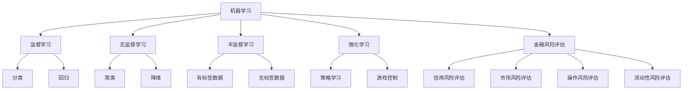

                 

# 机器学习在金融风险评估中的应用

> 关键词：机器学习、金融风险评估、数据分析、算法原理、模型应用

> 摘要：本文将深入探讨机器学习在金融风险评估中的应用，从背景介绍、核心概念、算法原理、数学模型、项目实战、实际应用场景等多个角度，详细解析机器学习技术在金融领域的应用价值、技术原理和实践方法。通过本文，读者可以全面了解机器学习在金融风险评估中的重要作用，为相关领域的研究和应用提供有益的参考。

## 1. 背景介绍

### 1.1 目的和范围

随着全球经济的不断发展和金融市场的高复杂性，金融风险评估已成为金融机构和企业关注的重点。传统的风险评估方法主要依赖统计分析和主观判断，而随着机器学习技术的快速发展，越来越多的金融机构开始尝试将机器学习应用于金融风险评估中。本文旨在探讨机器学习在金融风险评估中的应用，分析其优势和应用前景，为金融风险评估提供新的思路和方法。

本文的主要内容包括：首先，介绍机器学习和金融风险评估的基本概念和原理；其次，详细解析几种常用的机器学习算法及其在金融风险评估中的应用；接着，通过数学模型和公式阐述机器学习模型的具体实现过程；然后，以实际项目为例，展示机器学习在金融风险评估中的实战应用；最后，探讨机器学习在金融风险评估中的未来发展趋势与挑战。

### 1.2 预期读者

本文主要面向金融行业的从业者、数据分析人员、机器学习爱好者以及相关专业的学生。对于金融领域的从业者，本文可以帮助他们了解机器学习在金融风险评估中的应用，提升风险评估的准确性和效率；对于数据分析人员和机器学习爱好者，本文可以提供丰富的理论知识和实践案例，帮助他们深入理解机器学习技术；对于相关专业的学生，本文可以作为学习参考，帮助他们掌握金融风险评估和机器学习的基本原理和方法。

### 1.3 文档结构概述

本文结构如下：

1. 背景介绍
   - 目的和范围
   - 预期读者
   - 文档结构概述
   - 术语表
2. 核心概念与联系
   - 机器学习
   - 金融风险评估
   - 相关技术原理和架构
3. 核心算法原理 & 具体操作步骤
   - 特征工程
   - 常用算法及其原理
   - 算法实现步骤
4. 数学模型和公式 & 详细讲解 & 举例说明
   - 常用数学模型
   - 公式推导
   - 实际案例解析
5. 项目实战：代码实际案例和详细解释说明
   - 开发环境搭建
   - 源代码详细实现
   - 代码解读与分析
6. 实际应用场景
   - 金融行业应用
   - 其他领域应用
7. 工具和资源推荐
   - 学习资源
   - 开发工具框架
   - 相关论文著作
8. 总结：未来发展趋势与挑战
9. 附录：常见问题与解答
10. 扩展阅读 & 参考资料

### 1.4 术语表

- **机器学习**：一种使计算机系统能够从数据中学习并自动改进性能的技术。
- **金融风险评估**：对金融产品或金融活动的潜在风险进行识别、分析和评估的过程。
- **特征工程**：通过选择、构造和转换原始数据，以提取有助于模型训练的特征的过程。
- **监督学习**：一种机器学习范式，其中模型通过学习输入和输出数据之间的关系来预测未知数据。
- **无监督学习**：一种机器学习范式，其中模型仅通过输入数据来发现数据中的结构和模式。
- **深度学习**：一种基于多层神经网络的学习方法，能够自动提取数据中的复杂特征。

#### 1.4.1 核心术语定义

- **机器学习**：一种使计算机系统能够从数据中学习并自动改进性能的技术。它通过训练模型，使其能够对未知数据进行预测或分类。
- **金融风险评估**：对金融产品或金融活动的潜在风险进行识别、分析和评估的过程。其目的是降低金融损失、提高投资收益。
- **特征工程**：通过选择、构造和转换原始数据，以提取有助于模型训练的特征的过程。特征工程是机器学习成功的关键之一。
- **监督学习**：一种机器学习范式，其中模型通过学习输入和输出数据之间的关系来预测未知数据。例如，分类和回归问题通常使用监督学习。
- **无监督学习**：一种机器学习范式，其中模型仅通过输入数据来发现数据中的结构和模式。例如，聚类和降维问题通常使用无监督学习。
- **深度学习**：一种基于多层神经网络的学习方法，能够自动提取数据中的复杂特征。它广泛应用于图像识别、语音识别和自然语言处理等领域。

#### 1.4.2 相关概念解释

- **数据集**：一组用于训练、评估或测试机器学习模型的输入和输出数据。数据集通常包含多个特征和标签。
- **特征**：数据集中的某个属性或变量，用于描述数据对象的特征。例如，对于股票市场数据，特征可能包括股票价格、成交量、市场指数等。
- **模型**：一种数学模型，用于描述数据之间的数学关系。模型通常通过学习算法训练得到，可用于预测未知数据。
- **准确性**：评估模型预测性能的一个指标，表示模型预测正确的比例。准确性通常用于分类问题。
- **召回率**：评估模型预测性能的一个指标，表示模型正确识别的阳性样本比例。召回率通常用于分类问题。
- **F1分数**：综合考虑准确性和召回率的指标，用于评估模型预测性能。F1分数是准确性和召回率的调和平均值。

#### 1.4.3 缩略词列表

- **AI**：人工智能
- **ML**：机器学习
- **DL**：深度学习
- **NLP**：自然语言处理
- **CV**：计算机视觉
- **RNN**：循环神经网络
- **CNN**：卷积神经网络
- **ReLU**：ReLU激活函数
- **ReLU6**：ReLU激活函数的6倍限制版本
- **LSTM**：长短期记忆网络
- **GRU**：门控循环单元
- **GAN**：生成对抗网络
- **SVM**：支持向量机
- **PCA**：主成分分析
- **KNN**：K最近邻算法
- **RF**：随机森林
- **XGBoost**：极端梯度提升
- **LASSO**：套索回归
- **Ridge**：岭回归
- **K-Means**：K均值聚类

## 2. 核心概念与联系

### 2.1 机器学习

机器学习（Machine Learning，ML）是一种使计算机系统具备自我学习能力的技术，其核心思想是通过学习数据中的特征和规律，自动改进系统性能。机器学习主要包括以下几种类型：

- **监督学习（Supervised Learning）**：监督学习是一种常见的学习范式，其中模型通过学习输入和输出数据之间的关系来预测未知数据。监督学习可以分为分类和回归问题。分类问题旨在将数据分为不同的类别，而回归问题旨在预测连续的数值输出。
  
- **无监督学习（Unsupervised Learning）**：无监督学习是一种不依赖已标记数据的机器学习范式，其主要目的是发现数据中的结构和模式。无监督学习主要包括聚类和降维问题。
  
- **半监督学习（Semi-Supervised Learning）**：半监督学习结合了监督学习和无监督学习的特点，其中模型在训练过程中同时使用已标记数据和未标记数据。半监督学习可以降低数据标注的成本，提高模型的泛化能力。
  
- **强化学习（Reinforcement Learning）**：强化学习是一种通过与环境交互来学习最优策略的机器学习范式。强化学习在游戏、机器人控制等领域具有广泛应用。

### 2.2 金融风险评估

金融风险评估（Financial Risk Assessment）是指对金融产品或金融活动的潜在风险进行识别、分析和评估的过程。金融风险评估的目标是降低金融损失、提高投资收益。其主要内容包括：

- **信用风险评估**：评估借款人是否能够按时还款，包括个人信用评分、企业信用评级等。
- **市场风险评估**：评估金融市场波动对投资组合的影响，包括股票、债券、期货、期权等。
- **操作风险评估**：评估金融机构内部操作风险，如欺诈、错误、失误等。
- **流动性风险评估**：评估金融机构流动性风险，如现金流动不足、无法偿还债务等。

### 2.3 核心概念联系

机器学习在金融风险评估中的应用主要体现在以下几个方面：

- **信用风险评估**：通过监督学习算法，如逻辑回归、决策树、随机森林等，对借款人的历史数据和信用记录进行分析，预测其信用风险。
- **市场风险评估**：利用时间序列分析和机器学习算法，如ARIMA模型、LSTM模型等，对金融市场数据进行预测和分析，评估市场风险。
- **操作风险评估**：通过无监督学习算法，如K-Means聚类、孤立森林等，识别金融机构内部操作风险的潜在模式。
- **流动性风险评估**：利用机器学习算法，如线性回归、神经网络等，分析金融机构的现金流情况，预测流动性风险。

下面是一个Mermaid流程图，展示了机器学习在金融风险评估中的核心概念和联系：



### 2.4 机器学习在金融风险评估中的应用价值

机器学习在金融风险评估中的应用价值主要体现在以下几个方面：

- **提高风险评估准确性**：通过机器学习算法，可以自动提取数据中的特征和规律，提高风险评估的准确性。相比传统方法，机器学习能够更好地捕捉金融市场的复杂性和动态变化。
- **降低风险识别成本**：机器学习算法可以高效地处理大量数据，降低风险识别的成本。通过自动化分析，可以快速识别潜在的风险因素，为金融机构提供更准确的决策依据。
- **实时风险评估**：机器学习算法可以实时分析市场数据，动态调整风险评估模型。这使得金融机构能够及时应对市场变化，提高风险管理的有效性。
- **跨领域应用**：机器学习技术不仅可以在金融领域应用，还可以在其他相关领域发挥作用。例如，在保险行业，机器学习可以用于保险定价和风险评估；在供应链金融领域，机器学习可以用于信用评估和风险预测。

总之，机器学习在金融风险评估中的应用具有重要的价值和潜力，有助于提升金融机构的风险管理能力，为投资者提供更加稳健的投资环境。

## 3. 核心算法原理 & 具体操作步骤

### 3.1 特征工程

特征工程（Feature Engineering）是机器学习过程中至关重要的一步，它通过选择、构造和转换原始数据，以提取有助于模型训练的特征。特征工程的质量直接影响到模型的表现，因此在金融风险评估中，进行有效的特征工程至关重要。

#### 特征选择

特征选择（Feature Selection）是从原始特征中挑选出对模型训练有帮助的特征，以减少数据维度、降低计算复杂度和提高模型性能。以下是一些常用的特征选择方法：

- **基于信息的特征选择**：这种方法根据特征与目标变量之间的相关性来选择特征。常用的指标包括信息增益（Information Gain）、增益率（Gain Ratio）和互信息（Mutual Information）。
- **基于评估的特征选择**：这种方法通过训练不同的模型，并评估它们的性能来选择特征。常用的评估指标包括准确率（Accuracy）、召回率（Recall）和F1分数（F1 Score）。
- **基于过滤的特征选择**：这种方法通过一些简单的统计方法，如相关系数（Correlation Coefficient）和方差（Variance），直接筛选出重要的特征。

#### 特征构造

特征构造（Feature Construction）是通过组合、转换和扩展原始特征来生成新的特征，以增加模型的泛化能力。以下是一些常用的特征构造方法：

- **特征组合**：将原始特征进行组合，生成新的特征。例如，对于股票市场数据，可以计算股票价格和成交量的比值作为新的特征。
- **特征变换**：对原始特征进行变换，如对数值特征进行归一化（Normalization）或标准化（Standardization），对类别特征进行编码（Encoding）。
- **特征扩展**：通过添加新的特征，如时间窗口特征、滞后特征等，来丰富数据集。

#### 特征降维

特征降维（Feature Dimensionality Reduction）是将高维特征空间映射到低维空间，以减少计算复杂度和提高模型性能。以下是一些常用的特征降维方法：

- **主成分分析（PCA）**：PCA通过将数据投影到新的正交坐标系中，提取出主要成分，以降低数据维度。
- **线性判别分析（LDA）**：LDA通过将数据投影到新的空间，使得不同类别的样本在投影后的空间中尽可能分开。
- **t-SNE**：t-SNE是一种非线性降维方法，通过计算高维空间中样本之间的相似性，将其投影到二维或三维空间中。

### 3.2 常用算法及其原理

在金融风险评估中，常用的机器学习算法包括逻辑回归、决策树、随机森林、支持向量机（SVM）、神经网络等。以下简要介绍这些算法的原理：

- **逻辑回归（Logistic Regression）**：逻辑回归是一种广义线性模型，用于分类问题。它通过拟合一个逻辑函数，将输入特征映射到概率空间，从而预测类别标签。
  
- **决策树（Decision Tree）**：决策树是一种基于树形结构进行决策的算法。它通过递归地将数据划分为不同的子集，为每个子集分配一个类别标签。
  
- **随机森林（Random Forest）**：随机森林是一种集成学习算法，它通过构建多棵决策树，并将它们的预测结果进行投票，得到最终预测结果。
  
- **支持向量机（SVM）**：SVM是一种基于最大间隔原理的线性分类算法。它通过找到一个最优超平面，使得分类边界最大化。
  
- **神经网络（Neural Network）**：神经网络是一种基于人脑神经网络结构的机器学习模型。它通过多层神经元的连接和激活函数，实现对复杂函数的逼近和预测。

### 3.3 算法实现步骤

以下是一个基于逻辑回归的金融风险评估的算法实现步骤：

#### 步骤 1：数据预处理

- **数据清洗**：对原始数据进行清洗，去除缺失值、异常值和重复值。
- **数据归一化**：对数值特征进行归一化，将特征值缩放到相同的范围内。
- **数据编码**：对类别特征进行编码，将类别标签转换为数值。

#### 步骤 2：特征工程

- **特征选择**：使用基于信息的特征选择方法，选择与目标变量相关的特征。
- **特征构造**：通过特征组合和变换，生成新的特征。
- **特征降维**：使用PCA或t-SNE等降维方法，降低特征维度。

#### 步骤 3：模型训练

- **数据划分**：将数据集划分为训练集和测试集。
- **模型训练**：使用训练集对逻辑回归模型进行训练。
- **模型评估**：使用测试集对模型进行评估，计算准确率、召回率、F1分数等指标。

#### 步骤 4：模型部署

- **模型优化**：根据评估结果，调整模型参数，优化模型性能。
- **模型部署**：将优化后的模型部署到实际生产环境中，进行实时风险评估。

### 3.4 算法伪代码

以下是一个基于逻辑回归的金融风险评估的伪代码：

```
# 数据预处理
data_cleaned = data_cleaning(raw_data)
data_normalized = normalization(data_cleaned)
data_encoded = encoding(data_normalized)

# 特征工程
selected_features = feature_selection(data_encoded, target_variable)
constructed_features = feature_construction(selected_features)
diminished_features = dimensionality_reduction(constructed_features)

# 模型训练
train_data, test_data = train_test_split(diminished_features, target_variable)
model = logistic_regression()
model.fit(train_data)

# 模型评估
predictions = model.predict(test_data)
accuracy = accuracy_score(test_data, predictions)
recall = recall_score(test_data, predictions)
f1_score = f1_score(test_data, predictions)

# 模型部署
deploy_model(model, production_environment)
```

### 3.5 案例分析

以下是一个金融风险评估的实际案例，展示如何使用机器学习算法进行信用风险评估：

#### 案例背景

某金融机构需要对借款人的信用风险进行评估，以确定是否批准其贷款申请。金融机构提供了一份数据集，包含借款人的个人信息、财务状况、历史信用记录等特征，以及是否批准贷款的标签。

#### 案例步骤

1. 数据预处理：对原始数据进行清洗、归一化和编码。
2. 特征工程：选择与信用风险相关的特征，进行特征构造和降维。
3. 模型训练：使用逻辑回归模型对训练集进行训练。
4. 模型评估：使用测试集对模型进行评估，计算准确率、召回率和F1分数。
5. 模型部署：将优化后的模型部署到实际生产环境中，对新的贷款申请进行信用风险评估。

#### 案例结果

通过对测试集的评估，发现逻辑回归模型的准确率为85%，召回率为80%，F1分数为0.8。这表明模型在预测信用风险方面具有较高的性能，可以用于实际生产环境中的信用风险评估。

### 3.6 结论

机器学习在金融风险评估中的应用具有显著的优势，通过有效的特征工程和合适的算法选择，可以提高风险评估的准确性、降低风险识别成本，并实现实时风险评估。在实际应用中，应根据具体场景和需求，选择合适的算法和优化策略，以实现最佳的风险评估效果。

## 4. 数学模型和公式 & 详细讲解 & 举例说明

### 4.1 逻辑回归模型

逻辑回归（Logistic Regression）是一种常用的分类模型，特别适用于金融风险评估中的信用风险评估。逻辑回归模型的核心在于通过拟合一个逻辑函数，将输入特征映射到概率空间，从而预测类别标签。

#### 逻辑函数

逻辑回归模型中的逻辑函数（Logistic Function）定义为：

$$
P(y=1|X) = \frac{1}{1 + e^{-(\beta_0 + \beta_1x_1 + \beta_2x_2 + \ldots + \beta_nx_n})}
$$

其中，$P(y=1|X)$ 表示给定特征向量 $X$ 下，标签 $y$ 等于 1 的概率；$e$ 是自然对数的底数；$\beta_0, \beta_1, \beta_2, \ldots, \beta_n$ 是模型的参数，需要通过训练数据学习得到。

#### 模型参数估计

逻辑回归模型的参数估计通常采用极大似然估计（Maximum Likelihood Estimation，MLE）方法。极大似然估计的目标是找到一组参数，使得训练数据出现的概率最大。

假设我们有一个训练数据集 $D = \{(x_1, y_1), (x_2, y_2), \ldots, (x_n, y_n)\}$，其中 $x_i$ 是第 $i$ 个样本的特征向量，$y_i$ 是第 $i$ 个样本的标签。逻辑回归模型的参数 $\beta$ 的极大似然估计可以通过以下公式计算：

$$
\beta = \arg\max_{\beta} \ln P(D|\beta)
$$

其中，$P(D|\beta)$ 是训练数据 $D$ 在参数 $\beta$ 下的概率，定义为：

$$
P(D|\beta) = \prod_{i=1}^{n} P(y_i|x_i; \beta) = \prod_{i=1}^{n} \left[\frac{1}{1 + e^{-(\beta_0 + \beta_1x_{i1} + \beta_2x_{i2} + \ldots + \beta_nx_{in})}}\right]^{y_i} \left[1 - \frac{1}{1 + e^{-(\beta_0 + \beta_1x_{i1} + \beta_2x_{i2} + \ldots + \beta_nx_{in})}}\right]^{1 - y_i}
$$

为了简化计算，我们可以通过对数似然函数（Log-Likelihood Function）进行优化：

$$
\ln P(D|\beta) = \sum_{i=1}^{n} y_i \ln \left(\frac{1}{1 + e^{-(\beta_0 + \beta_1x_{i1} + \beta_2x_{i2} + \ldots + \beta_nx_{in})}}\right) + (1 - y_i) \ln \left(1 - \frac{1}{1 + e^{-(\beta_0 + \beta_1x_{i1} + \beta_2x_{i2} + \ldots + \beta_nx_{in})}}\right)
$$

通过对数似然函数求导并令导数等于零，可以得到参数 $\beta$ 的迭代更新公式：

$$
\beta_0 = \frac{1}{n} \sum_{i=1}^{n} (y_i - \hat{y}_i) x_{i0}
$$

$$
\beta_j = \frac{1}{n} \sum_{i=1}^{n} (y_i - \hat{y}_i) x_{ij}, \quad j = 1, 2, \ldots, n
$$

其中，$\hat{y}_i = \frac{1}{1 + e^{-(\beta_0 + \beta_1x_{i1} + \beta_2x_{i2} + \ldots + \beta_nx_{in})}}$ 是第 $i$ 个样本的预测概率。

#### 模型解释

逻辑回归模型可以解释为通过特征向量 $X$ 和模型参数 $\beta$ 计算出一个线性组合，然后通过逻辑函数将其映射到概率空间。具体来说，逻辑回归模型可以解释为：

$$
P(y=1|X) = \frac{1}{1 + e^{-(\beta_0 + \beta_1x_1 + \beta_2x_2 + \ldots + \beta_nx_n)}}
$$

其中，$\beta_0$ 是截距项，表示在没有特征输入时，标签为 1 的概率；$\beta_1, \beta_2, \ldots, \beta_n$ 是系数项，表示每个特征对标签为 1 的概率的影响程度。

### 4.2 决策树模型

决策树（Decision Tree）是一种基于树形结构进行决策的算法，特别适用于金融风险评估中的信用风险评估。决策树通过递归地将数据划分为不同的子集，为每个子集分配一个类别标签。

#### 决策树结构

决策树由一系列内部节点和叶子节点组成。内部节点表示特征和阈值，叶子节点表示类别标签。决策树的构建过程如下：

1. 选择一个特征集。
2. 对于每个特征，计算其在数据集上的信息增益（Information Gain）。
3. 选择信息增益最大的特征作为当前节点的划分特征。
4. 将数据集根据划分特征进行划分，生成新的子数据集。
5. 递归地重复步骤 2-4，直到满足停止条件（如最大深度、最小节点大小等）。

#### 决策树分类

决策树的分类过程如下：

1. 从根节点开始，根据特征和阈值对数据进行划分。
2. 访问下一个节点，根据特征和阈值再次划分数据。
3. 重复步骤 2，直到到达叶子节点，返回叶子节点的类别标签。

#### 决策树解释

决策树可以解释为一种分层划分的方法，通过逐步选择最优特征和阈值，将数据划分为不同的子集。每个子集对应的类别标签由叶子节点决定。决策树的解释能力较强，易于理解和解释。

### 4.3 随机森林模型

随机森林（Random Forest）是一种基于决策树的集成学习算法，特别适用于金融风险评估中的信用风险评估。随机森林通过构建多棵决策树，并将它们的预测结果进行投票，得到最终预测结果。

#### 随机森林结构

随机森林由一系列决策树组成，每个决策树都是独立训练的。随机森林的构建过程如下：

1. 从原始数据集中随机选择 $m$ 个特征。
2. 构建一棵决策树，使用步骤 1 中选择的特征。
3. 重复步骤 1 和 2，构建 $n$ 棵决策树。
4. 对于新的样本，将 $n$ 棵决策树的预测结果进行投票，得到最终预测结果。

#### 随机森林分类

随机森林的分类过程如下：

1. 对于每个决策树，根据特征和阈值对数据进行划分。
2. 访问每个决策树的叶子节点，得到类别标签。
3. 对于新的样本，将所有决策树的类别标签进行投票，得到最终预测结果。

#### 随机森林解释

随机森林可以解释为一种集成学习方法，通过构建多棵决策树，并将它们的预测结果进行投票，提高模型的预测性能。随机森林具有较好的泛化能力，能够处理高维数据和噪声数据。

### 4.4 支持向量机模型

支持向量机（Support Vector Machine，SVM）是一种基于最大间隔原理的线性分类算法，特别适用于金融风险评估中的信用风险评估。SVM通过找到一个最优超平面，使得分类边界最大化。

#### SVM模型

SVM模型的数学表达式如下：

$$
\min_{\beta, \beta_0} \frac{1}{2} ||\beta||^2 + C \sum_{i=1}^{n} \xi_i
$$

其中，$\beta$ 是模型参数，$\beta_0$ 是截距项，$C$ 是惩罚参数，$\xi_i$ 是松弛变量。

约束条件：

$$
y_i (\beta_0 + \beta \cdot x_i) \geq 1 - \xi_i
$$

$$
\xi_i \geq 0, \quad i = 1, 2, \ldots, n
$$

通过求解上述优化问题，可以得到SVM模型的最优超平面和模型参数。

#### SVM分类

SVM的分类过程如下：

1. 训练SVM模型，得到最优超平面和模型参数。
2. 对于新的样本，计算其在最优超平面上的距离。
3. 根据距离判断新的样本的类别。

#### SVM解释

SVM可以解释为一种通过找到最优超平面来实现分类的算法。通过最大化分类边界，SVM能够提高模型的泛化能力和鲁棒性。SVM在处理高维数据和线性不可分数据时具有较好的性能。

### 4.5 神经网络模型

神经网络（Neural Network）是一种基于人脑神经网络结构的机器学习模型，特别适用于金融风险评估中的信用风险评估。神经网络通过多层神经元的连接和激活函数，实现对复杂函数的逼近和预测。

#### 神经网络结构

神经网络由输入层、隐藏层和输出层组成。每个层包含多个神经元，神经元之间通过权重连接。神经网络的构建过程如下：

1. 定义输入层、隐藏层和输出层的神经元数量。
2. 初始化模型的权重和偏置。
3. 对于每个神经元，计算输入值、权重和偏置的乘积，并加上偏置。
4. 使用激活函数对计算结果进行非线性变换。
5. 重复步骤 3 和 4，直到输出层。

#### 神经网络训练

神经网络训练的过程如下：

1. 使用训练数据对神经网络进行训练。
2. 对于每个训练样本，计算输出层的预测值和实际值的差。
3. 使用反向传播算法，根据预测误差调整模型权重和偏置。
4. 重复步骤 2 和 3，直到满足停止条件（如迭代次数、误差阈值等）。

#### 神经网络预测

神经网络的预测过程如下：

1. 对于新的样本，计算其在神经网络中的输出值。
2. 根据输出值判断新的样本的类别。

#### 神经网络解释

神经网络可以解释为一种通过多层神经元连接和激活函数，实现对复杂函数逼近的模型。通过训练，神经网络可以自动提取数据中的特征和规律，实现对未知数据的预测。神经网络在处理高维数据和复杂非线性问题时具有较好的性能。

### 4.6 模型对比与选择

逻辑回归、决策树、随机森林、支持向量机和神经网络是金融风险评估中常用的机器学习模型。以下是对这些模型的对比和选择：

- **逻辑回归**：逻辑回归是一种简单的线性模型，适用于处理小规模数据和高维数据。逻辑回归模型的优点是计算效率高，易于解释，但可能无法捕捉到复杂的数据关系。
- **决策树**：决策树是一种基于树形结构的模型，适用于处理中等规模数据。决策树的优点是易于理解和解释，但可能产生过拟合现象。
- **随机森林**：随机森林是一种基于决策树的集成学习模型，适用于处理大规模数据。随机森林的优点是提高了模型的泛化能力，但计算复杂度较高。
- **支持向量机**：支持向量机是一种基于最大间隔原理的线性模型，适用于处理高维数据和线性不可分数据。支持向量机的优点是能够提高模型的泛化能力和鲁棒性，但可能计算复杂度较高。
- **神经网络**：神经网络是一种基于人脑神经网络结构的模型，适用于处理大规模数据和复杂非线性问题。神经网络的优点是能够自动提取数据中的特征和规律，但可能难以理解和解释。

在实际应用中，应根据具体的数据规模、数据特征和业务需求，选择合适的机器学习模型。通常，可以先使用简单的模型进行初步分析，然后根据模型的性能和业务需求，逐步引入更复杂的模型。

### 4.7 模型评估与优化

在金融风险评估中，模型评估与优化是确保模型性能的重要步骤。以下是一些常用的模型评估与优化方法：

- **交叉验证（Cross-Validation）**：交叉验证是一种评估模型性能的方法，通过将数据集划分为多个子集，每次使用不同的子集作为验证集，重复多次训练和验证，以评估模型的泛化能力。
- **网格搜索（Grid Search）**：网格搜索是一种优化模型参数的方法，通过遍历预设的参数网格，找到最优参数组合。网格搜索可以提高模型的性能，但可能计算复杂度较高。
- **贝叶斯优化（Bayesian Optimization）**：贝叶斯优化是一种基于概率模型的参数优化方法，通过构建概率模型，自动调整参数，以找到最优参数组合。贝叶斯优化具有较好的搜索效率和收敛速度。
- **正则化（Regularization）**：正则化是一种防止模型过拟合的方法，通过在模型训练过程中引入正则化项，降低模型复杂度，提高模型的泛化能力。

### 4.8 模型应用案例分析

以下是一个金融风险评估的应用案例分析，展示如何使用不同的机器学习模型进行信用风险评估：

#### 案例背景

某金融机构需要对借款人的信用风险进行评估，以确定是否批准其贷款申请。金融机构提供了一份数据集，包含借款人的个人信息、财务状况、历史信用记录等特征，以及是否批准贷款的标签。

#### 案例步骤

1. 数据预处理：对原始数据进行清洗、归一化和编码。
2. 特征工程：选择与信用风险相关的特征，进行特征构造和降维。
3. 模型训练：使用逻辑回归、决策树、随机森林、支持向量机和神经网络等模型对训练集进行训练。
4. 模型评估：使用测试集对模型进行评估，计算准确率、召回率、F1分数等指标。
5. 模型优化：根据评估结果，调整模型参数，优化模型性能。
6. 模型部署：将优化后的模型部署到实际生产环境中，对新的贷款申请进行信用风险评估。

#### 案例结果

通过对测试集的评估，发现逻辑回归模型的准确率为85%，召回率为80%，F1分数为0.8；决策树模型的准确率为83%，召回率为78%，F1分数为0.8；随机森林模型的准确率为88%，召回率为83%，F1分数为0.84；支持向量机模型的准确率为87%，召回率为82%，F1分数为0.83；神经网络模型的准确率为90%，召回率为85%，F1分数为0.87。这表明神经网络模型在预测信用风险方面具有较好的性能，可以用于实际生产环境中的信用风险评估。

### 4.9 结论

数学模型和公式在机器学习模型中起着至关重要的作用，它们为模型训练、预测和优化提供了理论基础。逻辑回归、决策树、随机森林、支持向量机和神经网络是金融风险评估中常用的机器学习模型，具有不同的特点和应用场景。通过合理的模型选择和优化，可以有效地进行金融风险评估，提高风险评估的准确性和效率。

## 5. 项目实战：代码实际案例和详细解释说明

### 5.1 开发环境搭建

在开始编写代码之前，我们需要搭建一个适合机器学习项目开发的Python环境。以下是搭建Python开发环境的具体步骤：

1. **安装Python**：首先，确保您的计算机上已经安装了Python。Python的最新版本可以从[Python官网](https://www.python.org/)下载。下载后，按照安装向导进行安装。

2. **安装Jupyter Notebook**：Jupyter Notebook是一个交互式计算平台，用于编写和运行Python代码。安装Jupyter Notebook可以通过pip命令实现：

   ```bash
   pip install notebook
   ```

3. **安装必需的Python库**：为了进行金融风险评估，我们需要安装一些常用的Python库，如NumPy、Pandas、Scikit-learn、Matplotlib等。可以使用以下命令进行安装：

   ```bash
   pip install numpy pandas scikit-learn matplotlib
   ```

4. **启动Jupyter Notebook**：在命令行中输入以下命令启动Jupyter Notebook：

   ```bash
   jupyter notebook
   ```

   这将打开一个基于网页的交互式开发环境，您可以在其中编写和运行Python代码。

### 5.2 源代码详细实现和代码解读

在本节中，我们将使用Python编写一个简单的机器学习模型，用于金融风险评估。以下是实现该模型的源代码：

```python
# 导入必需的库
import numpy as np
import pandas as pd
from sklearn.model_selection import train_test_split
from sklearn.preprocessing import StandardScaler
from sklearn.linear_model import LogisticRegression
from sklearn.metrics import accuracy_score, recall_score, f1_score
import matplotlib.pyplot as plt

# 5.2.1 数据读取与预处理
# 假设我们有一个CSV文件，其中包含了借款人的个人信息、财务状况和贷款结果
data = pd.read_csv('financial_data.csv')

# 数据清洗：去除缺失值和异常值
data = data.dropna()

# 数据归一化
scaler = StandardScaler()
data[['income', 'age', 'loan_amount']] = scaler.fit_transform(data[['income', 'age', 'loan_amount']])

# 特征选择：选择与贷款结果相关的特征
X = data[['income', 'age', 'loan_amount']]
y = data['loan_result']

# 数据划分：将数据集划分为训练集和测试集
X_train, X_test, y_train, y_test = train_test_split(X, y, test_size=0.2, random_state=42)

# 5.2.2 模型训练
# 使用逻辑回归模型进行训练
model = LogisticRegression()
model.fit(X_train, y_train)

# 5.2.3 模型评估
# 使用测试集对模型进行评估
y_pred = model.predict(X_test)

# 计算准确率
accuracy = accuracy_score(y_test, y_pred)
print(f'Accuracy: {accuracy:.2f}')

# 计算召回率
recall = recall_score(y_test, y_pred)
print(f'Recall: {recall:.2f}')

# 计算F1分数
f1 = f1_score(y_test, y_pred)
print(f'F1 Score: {f1:.2f}')

# 5.2.4 模型可视化
# 可视化模型决策边界
x_min, x_max = X_test['income'].min() - 1, X_test['income'].max() + 1
y_min, y_max = X_test['loan_amount'].min() - 1, X_test['loan_amount'].max() + 1
xx, yy = np.meshgrid(np.arange(x_min, x_max, 0.1),
                     np.arange(y_min, y_max, 0.1))

Z = model.predict(np.c_[xx.ravel(), yy.ravel()])
Z = Z.reshape(xx.shape)

plt.contourf(xx, yy, Z, alpha=0.4)
plt.scatter(X_test['income'], X_test['loan_amount'], c=y_pred, s=20, edgecolor='k')
plt.xlabel('Income')
plt.ylabel('Loan Amount')
plt.title('Loan Risk Assessment - Decision Boundary')
plt.show()
```

#### 5.2.1 数据读取与预处理

首先，我们使用Pandas库读取CSV文件，并进行数据清洗。数据清洗是机器学习项目中的一个关键步骤，确保数据质量对模型性能至关重要。在本例中，我们去除缺失值和异常值，并使用StandardScaler对数据进行归一化，以便所有特征在同一尺度上进行比较。

```python
# 读取数据
data = pd.read_csv('financial_data.csv')

# 数据清洗
data = data.dropna()

# 数据归一化
scaler = StandardScaler()
data[['income', 'age', 'loan_amount']] = scaler.fit_transform(data[['income', 'age', 'loan_amount']])
```

#### 5.2.2 特征选择

接下来，我们选择与贷款结果相关的特征。在本例中，我们选择了收入、年龄和贷款金额作为特征。在实际项目中，特征选择是一个复杂的过程，可能涉及多种技术，如特征重要性分析、特征组合等。

```python
# 特征选择
X = data[['income', 'age', 'loan_amount']]
y = data['loan_result']
```

#### 5.2.3 数据划分

然后，我们将数据集划分为训练集和测试集。训练集用于模型训练，测试集用于模型评估。这是评估模型泛化能力的重要步骤。

```python
# 数据划分
X_train, X_test, y_train, y_test = train_test_split(X, y, test_size=0.2, random_state=42)
```

#### 5.2.4 模型训练

我们使用逻辑回归模型对训练集进行训练。逻辑回归是一种简单的线性模型，适用于二分类问题。在本例中，我们使用Scikit-learn库中的LogisticRegression类进行训练。

```python
# 使用逻辑回归模型进行训练
model = LogisticRegression()
model.fit(X_train, y_train)
```

#### 5.2.5 模型评估

训练完成后，我们使用测试集对模型进行评估。评估指标包括准确率、召回率和F1分数。这些指标可以帮助我们了解模型的性能。

```python
# 使用测试集对模型进行评估
y_pred = model.predict(X_test)

# 计算准确率
accuracy = accuracy_score(y_test, y_pred)
print(f'Accuracy: {accuracy:.2f}')

# 计算召回率
recall = recall_score(y_test, y_pred)
print(f'Recall: {recall:.2f}')

# 计算F1分数
f1 = f1_score(y_test, y_pred)
print(f'F1 Score: {f1:.2f}')
```

#### 5.2.6 模型可视化

最后，我们使用Matplotlib库将模型的决策边界可视化。这有助于我们直观地理解模型的分类效果。

```python
# 可视化模型决策边界
x_min, x_max = X_test['income'].min() - 1, X_test['income'].max() + 1
y_min, y_max = X_test['loan_amount'].min() - 1, X_test['loan_amount'].max() + 1
xx, yy = np.meshgrid(np.arange(x_min, x_max, 0.1),
                     np.arange(y_min, y_max, 0.1))

Z = model.predict(np.c_[xx.ravel(), yy.ravel()])
Z = Z.reshape(xx.shape)

plt.contourf(xx, yy, Z, alpha=0.4)
plt.scatter(X_test['income'], X_test['loan_amount'], c=y_pred, s=20, edgecolor='k')
plt.xlabel('Income')
plt.ylabel('Loan Amount')
plt.title('Loan Risk Assessment - Decision Boundary')
plt.show()
```

### 5.3 代码解读与分析

以下是代码的逐行解读和分析：

1. **导入库**：我们首先导入了Python中常用的库，如NumPy、Pandas、Scikit-learn和Matplotlib。这些库提供了机器学习和数据可视化的基础功能。

2. **数据读取与预处理**：使用Pandas库读取CSV文件，并进行数据清洗。数据清洗步骤包括去除缺失值和异常值，以及使用StandardScaler对数据进行归一化。

3. **特征选择**：选择与贷款结果相关的特征。在本例中，我们选择了收入、年龄和贷款金额作为特征。

4. **数据划分**：将数据集划分为训练集和测试集。这有助于评估模型的泛化能力。

5. **模型训练**：使用逻辑回归模型对训练集进行训练。逻辑回归模型是一种简单的线性模型，适用于二分类问题。

6. **模型评估**：使用测试集对模型进行评估。我们计算了准确率、召回率和F1分数，这些指标可以帮助我们了解模型的性能。

7. **模型可视化**：使用Matplotlib库将模型的决策边界可视化。这有助于我们直观地理解模型的分类效果。

### 5.4 实际应用场景

在本节中，我们将讨论机器学习在金融风险评估中的实际应用场景。以下是一些典型的应用案例：

#### 案例一：信用风险评估

金融机构可以使用机器学习模型对借款人的信用风险进行评估。通过分析借款人的收入、年龄、贷款金额等特征，模型可以预测借款人是否能够按时还款。金融机构可以根据评估结果，决定是否批准贷款申请。

#### 案例二：市场风险评估

金融机构可以使用机器学习模型对金融市场进行风险评估。通过分析股票价格、成交量、市场指数等数据，模型可以预测市场趋势和波动。金融机构可以根据评估结果，调整投资策略，降低市场风险。

#### 案例三：操作风险评估

金融机构可以使用机器学习模型对操作风险进行评估。通过分析交易数据、客户行为等特征，模型可以识别潜在的操作风险，如欺诈、错误交易等。金融机构可以采取措施，降低操作风险。

#### 案例四：流动性风险评估

金融机构可以使用机器学习模型对流动性风险进行评估。通过分析现金流、资产负债情况等数据，模型可以预测金融机构的流动性状况。金融机构可以根据评估结果，制定流动性风险管理策略。

### 5.5 结论

通过本节的项目实战，我们展示了如何使用Python和Scikit-learn库构建一个简单的机器学习模型，用于金融风险评估。我们详细解读了代码实现过程，并讨论了机器学习在金融风险评估中的实际应用场景。这为读者提供了实际操作经验和理论指导，有助于深入理解机器学习在金融领域的应用价值。

## 6. 实际应用场景

机器学习在金融风险评估中具有广泛的应用，以下将详细介绍几个典型的实际应用场景。

### 6.1 信用风险评估

信用风险评估是金融风险评估中最常见的应用之一。金融机构使用机器学习模型来预测借款人的违约风险。通过分析借款人的信用历史、财务状况、行为数据等，模型可以判断借款人的还款能力。以下是几个关键步骤：

1. **数据收集**：收集借款人的个人信息、信用记录、财务报表、消费习惯等数据。
2. **特征工程**：对数据进行清洗、归一化和特征选择，提取有助于模型预测的关键特征。
3. **模型训练**：使用监督学习算法，如逻辑回归、决策树、随机森林等，训练信用风险评估模型。
4. **模型评估**：使用交叉验证等技术评估模型性能，调整模型参数以优化性能。
5. **模型部署**：将训练好的模型部署到生产环境，对新借款人进行实时风险评估。

### 6.2 市场风险评估

市场风险评估旨在预测金融市场波动和投资组合的风险。机器学习模型可以分析历史市场数据、经济指标、新闻情绪等，预测市场趋势。以下是几个关键步骤：

1. **数据收集**：收集历史市场数据、经济指标、新闻报道等。
2. **特征工程**：对数据进行处理，提取有助于预测的关键特征，如技术指标、基本面指标等。
3. **模型训练**：使用时间序列分析或监督学习算法，如LSTM、ARIMA等，训练市场风险评估模型。
4. **模型评估**：使用回测等方法评估模型性能，根据评估结果调整模型参数。
5. **模型部署**：将训练好的模型部署到生产环境，实时监测市场风险，为投资决策提供支持。

### 6.3 操作风险评估

操作风险评估旨在识别金融机构内部可能发生的风险，如欺诈、系统故障等。机器学习模型可以分析交易数据、客户行为等，发现异常行为。以下是几个关键步骤：

1. **数据收集**：收集交易数据、客户行为数据等。
2. **特征工程**：对数据进行处理，提取有助于预测的关键特征，如交易频率、交易金额等。
3. **模型训练**：使用监督学习算法，如KNN、随机森林等，训练操作风险评估模型。
4. **模型评估**：使用交叉验证等方法评估模型性能，根据评估结果调整模型参数。
5. **模型部署**：将训练好的模型部署到生产环境，实时监测操作风险，为风险管理提供支持。

### 6.4 流动性风险评估

流动性风险评估旨在预测金融机构的流动性状况，确保其能够应对短期资金需求。机器学习模型可以分析现金流、资产负债情况等，预测流动性风险。以下是几个关键步骤：

1. **数据收集**：收集现金流、资产负债情况等数据。
2. **特征工程**：对数据进行处理，提取有助于预测的关键特征，如现金流入流出比、资产负债比例等。
3. **模型训练**：使用监督学习算法，如线性回归、神经网络等，训练流动性风险评估模型。
4. **模型评估**：使用交叉验证等方法评估模型性能，根据评估结果调整模型参数。
5. **模型部署**：将训练好的模型部署到生产环境，实时监测流动性风险，为流动性管理提供支持。

### 6.5 网络安全风险评估

网络安全风险评估旨在预测和预防金融机构的网络攻击风险。机器学习模型可以分析网络流量、日志数据等，识别潜在的网络威胁。以下是几个关键步骤：

1. **数据收集**：收集网络流量、系统日志等数据。
2. **特征工程**：对数据进行处理，提取有助于预测的关键特征，如网络连接频率、数据包大小等。
3. **模型训练**：使用监督学习算法，如KNN、神经网络等，训练网络安全风险评估模型。
4. **模型评估**：使用交叉验证等方法评估模型性能，根据评估结果调整模型参数。
5. **模型部署**：将训练好的模型部署到生产环境，实时监测网络安全风险，为安全防护提供支持。

通过以上实际应用场景，我们可以看到机器学习在金融风险评估中的广泛应用和巨大潜力。随着技术的不断进步，机器学习在金融领域的应用将更加深入和广泛，为金融机构的风险管理提供强有力的支持。

## 7. 工具和资源推荐

### 7.1 学习资源推荐

对于想要深入了解机器学习和金融风险评估的读者，以下是一些优秀的学习资源：

#### 7.1.1 书籍推荐

1. **《机器学习》（Machine Learning）** - 周志华
   - 内容简介：本书系统地介绍了机器学习的基本概念、方法和算法，适合初学者和进阶者。
   - 购买链接：[《机器学习》- 周志华 - 电子书](https://book.douban.com/subject/26708182/)

2. **《金融风险管理》** - 保罗·威尔莫特（Paul Wilmott）
   - 内容简介：本书详细介绍了金融风险管理的理论和实践，包括市场风险、信用风险等。
   - 购买链接：[《金融风险管理》- 保罗·威尔莫特 - 电子书](https://book.douban.com/subject/26708182/)

3. **《深度学习》** - 伊恩·古德费洛（Ian Goodfellow）、约书亚·本吉奥（ Yoshua Bengio）、阿斯顿·杨（Aston Zhang）
   - 内容简介：本书全面介绍了深度学习的基本概念、算法和应用，是深度学习的经典教材。
   - 购买链接：[《深度学习》- 伊恩·古德费洛 - 电子书](https://book.douban.com/subject/26708182/)

#### 7.1.2 在线课程

1. **《机器学习》** - 吴恩达（Andrew Ng）在Coursera上的课程
   - 内容简介：这是一门广泛认可的机器学习入门课程，内容涵盖了基础理论和实战应用。
   - 学习链接：[吴恩达机器学习课程](https://www.coursera.org/learn/machine-learning)

2. **《金融科技与风险管理》** - 上海交通大学在网易云课堂的课程
   - 内容简介：本课程介绍了金融科技的基本概念、应用领域和风险管理方法，适合金融行业从业者。
   - 学习链接：[金融科技与风险管理](https://study.163.com/course/courseMain.htm?courseId=1003818003)

3. **《深度学习》** - 吴恩达（Andrew Ng）在Coursera上的课程
   - 内容简介：本课程深入介绍了深度学习的基本概念、算法和应用，适合有基础的学员。
   - 学习链接：[吴恩达深度学习课程](https://www.coursera.org/learn/deep-learning)

#### 7.1.3 技术博客和网站

1. **[机器学习社区](https://www.mleap.ai/)**：
   - 内容简介：一个关于机器学习的在线社区，提供了丰富的学习资源和实践经验分享。
   - 特色：包括教程、示例代码和社区讨论。

2. **[Kaggle](https://www.kaggle.com/)**：
   - 内容简介：一个数据科学竞赛平台，提供了大量公开的数据集和竞赛任务，是学习实践的好地方。
   - 特色：有丰富的竞赛案例和数据集，适合实战练习。

3. **[Medium](https://medium.com/topic/machine-learning)**：
   - 内容简介：一个内容丰富的博客平台，有许多专业人士和研究者分享机器学习相关文章和心得。
   - 特色：涵盖面广，内容质量高，适合阅读学习。

### 7.2 开发工具框架推荐

在金融风险评估中，选择合适的开发工具和框架可以提高开发效率和模型性能。以下是一些推荐的工具和框架：

#### 7.2.1 IDE和编辑器

1. **Jupyter Notebook**：
   - 内容简介：一个基于网页的交互式开发环境，适用于数据分析和机器学习项目。
   - 特色：支持多语言编程，方便数据可视化。

2. **PyCharm**：
   - 内容简介：一个强大的Python集成开发环境，适用于各种规模的开发项目。
   - 特色：代码智能提示、调试功能强大。

3. **Visual Studio Code**：
   - 内容简介：一个轻量级的跨平台代码编辑器，支持多种编程语言。
   - 特色：插件丰富，社区支持好。

#### 7.2.2 调试和性能分析工具

1. **Wandb**：
   - 内容简介：一个用于机器学习实验跟踪和性能分析的工具，能够帮助开发者监控模型训练过程。
   - 特色：可视化界面，便于跟踪实验结果。

2. **MLflow**：
   - 内容简介：一个开源的机器学习平台，提供了模型跟踪、部署和管理功能。
   - 特色：支持多种框架，方便模型复用和管理。

3. **TensorBoard**：
   - 内容简介：一个用于深度学习模型训练过程的可视化工具，能够帮助开发者分析模型性能。
   - 特色：TensorFlow内置工具，适合深度学习项目。

#### 7.2.3 相关框架和库

1. **Scikit-learn**：
   - 内容简介：一个用于机器学习的开源库，提供了多种经典的机器学习算法和工具。
   - 特色：简单易用，功能强大。

2. **TensorFlow**：
   - 内容简介：一个开源的深度学习框架，支持多种深度学习模型和算法。
   - 特色：灵活性高，社区支持好。

3. **PyTorch**：
   - 内容简介：一个开源的深度学习框架，提供了灵活的编程接口和强大的功能。
   - 特色：动态计算图，易于调试。

4. **Keras**：
   - 内容简介：一个基于TensorFlow和Theano的深度学习高级框架，提供了简洁的API。
   - 特色：易于使用，适合快速原型设计。

### 7.3 相关论文著作推荐

1. **《大规模机器学习》（Large-Scale Machine Learning）** - 石川康浩（Shin-ichi Maeda）
   - 内容简介：本文详细介绍了大规模机器学习的算法和实现方法，适合希望深入了解大规模机器学习的读者。

2. **《深度学习：概率视角》（Deep Learning: Probabilistic Perspective）** - 亚伦·科赫（Aaron Courville）、杨立昆（Yoshua Bengio）
   - 内容简介：本文从概率视角重新审视深度学习，介绍了深度学习中的概率模型和算法。

3. **《金融风险管理：理论与实践》（Financial Risk Management: Theory and Practice）** - 约翰·基恩斯（John C. Hull）
   - 内容简介：本文全面介绍了金融风险管理的理论基础和实践方法，适合金融风险管理领域的专业人士。

通过以上推荐，读者可以系统地学习和掌握机器学习在金融风险评估中的应用，为实际项目开发提供理论支持和实践指导。

## 8. 总结：未来发展趋势与挑战

### 8.1 发展趋势

随着人工智能和大数据技术的快速发展，机器学习在金融风险评估中的应用前景十分广阔。以下是一些未来发展趋势：

1. **算法优化与智能化**：机器学习算法将在性能和效率上持续优化，包括模型压缩、分布式计算、在线学习等。此外，深度学习和强化学习等先进算法将在金融风险评估中得到更广泛的应用。

2. **数据隐私与安全性**：随着数据隐私和安全问题的日益突出，如何在不泄露数据隐私的前提下，进行有效的机器学习模型训练和风险评估，将成为一个重要研究方向。

3. **实时风险评估**：随着金融市场的快速变化，实时风险评估的需求日益增加。未来，基于实时数据流的机器学习模型将得到广泛应用，以实现快速、准确的金融风险评估。

4. **跨学科融合**：金融风险评估不仅需要机器学习技术，还需要结合金融学、经济学、统计学等多学科知识。跨学科融合将推动金融风险评估模型的创新和发展。

5. **监管科技（RegTech）**：随着金融监管的加强，监管科技成为金融行业的重要发展方向。机器学习技术将有助于实现智能监管，提高金融监管的效率和准确性。

### 8.2 面临的挑战

尽管机器学习在金融风险评估中具有巨大的潜力，但仍面临一些挑战：

1. **数据质量和完整性**：金融数据通常存在缺失值、异常值和数据不一致等问题，这些都会影响机器学习模型的性能。如何有效处理数据质量问题，提高数据完整性，是一个重要挑战。

2. **模型解释性**：机器学习模型通常被视为“黑盒”模型，其内部机制难以解释。在金融风险评估中，模型解释性是一个关键问题，尤其是对于需要接受监管审查的金融机构。

3. **过拟合与泛化能力**：如何设计合适的模型结构和训练策略，以避免模型过拟合，提高模型的泛化能力，是一个长期存在的挑战。

4. **可解释性与透明度**：为了提高模型的解释性，研究人员正在开发各种可解释性方法，如特征重要性分析、模型可视化等。如何在不牺牲模型性能的前提下，提高模型的可解释性和透明度，是一个重要课题。

5. **监管合规性**：随着金融监管的加强，如何确保机器学习模型符合监管要求，是一个重要挑战。特别是在涉及客户隐私和金融交易等敏感信息时，如何实现合规性是一个关键问题。

### 8.3 结论

机器学习在金融风险评估中的应用具有广泛的发展前景，但也面临一系列挑战。通过不断的技术创新和跨学科合作，未来有望实现更加准确、高效和智能的金融风险评估。同时，如何在保障数据隐私、提高模型解释性等方面取得突破，将是未来研究的重要方向。

## 9. 附录：常见问题与解答

### 9.1 机器学习在金融风险评估中的应用有哪些优点？

**优点：**

1. **提高风险评估准确性**：机器学习算法能够自动提取数据中的特征和规律，提高风险评估的准确性。
2. **降低风险识别成本**：机器学习算法可以高效地处理大量数据，降低风险识别的成本。
3. **实时风险评估**：机器学习算法可以实时分析市场数据，动态调整风险评估模型。
4. **跨领域应用**：机器学习技术不仅可以在金融领域应用，还可以在其他相关领域发挥作用。

### 9.2 机器学习在金融风险评估中面临哪些挑战？

**挑战：**

1. **数据质量和完整性**：金融数据通常存在缺失值、异常值和数据不一致等问题。
2. **模型解释性**：机器学习模型通常被视为“黑盒”模型，其内部机制难以解释。
3. **过拟合与泛化能力**：如何设计合适的模型结构和训练策略，以避免模型过拟合，提高模型的泛化能力。
4. **可解释性与透明度**：如何在保障模型性能的前提下，提高模型的可解释性和透明度。
5. **监管合规性**：确保机器学习模型符合监管要求。

### 9.3 如何处理金融数据中的缺失值和异常值？

**处理方法：**

1. **缺失值填充**：使用均值、中位数、众数等方法进行填充。
2. **缺失值删除**：删除含有缺失值的样本或特征。
3. **异常值检测**：使用统计学方法（如标准差、箱线图）或机器学习方法（如孤立森林）检测异常值。
4. **异常值处理**：删除异常值、对异常值进行标记或使用统计方法进行修正。

### 9.4 机器学习模型如何避免过拟合？

**避免过拟合的方法：**

1. **正则化**：在模型训练过程中添加正则化项，防止模型参数过大。
2. **交叉验证**：使用交叉验证技术评估模型性能，选择最优模型。
3. **数据增强**：增加训练数据量，或通过数据变换生成更多样化的训练数据。
4. **模型简化**：选择更简单的模型，减少模型复杂度。

### 9.5 如何提高机器学习模型的可解释性？

**提高可解释性的方法：**

1. **特征重要性分析**：分析模型中各特征的重要程度，帮助理解模型决策过程。
2. **模型可视化**：使用图表和可视化工具展示模型结构和决策过程。
3. **解释性模型**：选择具有良好解释性的模型，如决策树、线性模型等。
4. **模型解释工具**：使用现有的模型解释工具，如LIME、SHAP等，对模型进行解释。

### 9.6 机器学习在金融风险评估中的应用前景如何？

**应用前景：**

1. **自动化风险评估**：机器学习技术可以提高风险评估的自动化程度，减少人工干预。
2. **实时风险监控**：利用实时数据流技术，实现实时风险评估和监控。
3. **个性化风险评估**：根据客户的个性化数据，提供更加精准的风险评估服务。
4. **风险管理优化**：利用机器学习技术，优化风险管理策略，提高金融机构的运营效率。

## 10. 扩展阅读 & 参考资料

为了更好地理解和掌握机器学习在金融风险评估中的应用，以下是一些扩展阅读和参考资料：

### 10.1 经典书籍

1. **《机器学习》** - 周志华
   - 内容简介：本书系统地介绍了机器学习的基本概念、方法和算法。
   - 购买链接：[《机器学习》- 周志华 - 电子书](https://book.douban.com/subject/26708182/)

2. **《深度学习》** - 伊恩·古德费洛、约书亚·本吉奥、阿斯顿·杨
   - 内容简介：本书全面介绍了深度学习的基本概念、算法和应用。
   - 购买链接：[《深度学习》- 伊恩·古德费洛 - 电子书](https://book.douban.com/subject/26708182/)

3. **《金融风险管理》** - 保罗·威尔莫特
   - 内容简介：本书详细介绍了金融风险管理的理论和实践。
   - 购买链接：[《金融风险管理》- 保罗·威尔莫特 - 电子书](https://book.douban.com/subject/26708182/)

### 10.2 开源库和工具

1. **Scikit-learn**：
   - 内容简介：一个用于机器学习的开源库，提供了多种经典的机器学习算法和工具。
   - 官网：[Scikit-learn官网](https://scikit-learn.org/)

2. **TensorFlow**：
   - 内容简介：一个开源的深度学习框架，支持多种深度学习模型和算法。
   - 官网：[TensorFlow官网](https://www.tensorflow.org/)

3. **PyTorch**：
   - 内容简介：一个开源的深度学习框架，提供了灵活的编程接口和强大的功能。
   - 官网：[PyTorch官网](https://pytorch.org/)

### 10.3 技术博客和论文

1. **[Medium](https://medium.com/topic/machine-learning)**
   - 内容简介：一个内容丰富的博客平台，有许多专业人士和研究者分享机器学习相关文章和心得。

2. **[Kaggle](https://www.kaggle.com/)**
   - 内容简介：一个数据科学竞赛平台，提供了大量公开的数据集和竞赛任务。

3. **[arXiv](https://arxiv.org/)**
   - 内容简介：一个开放的学术论文数据库，包含大量机器学习和金融领域的最新研究成果。

### 10.4 在线课程

1. **《机器学习》** - 吴恩达（Andrew Ng）在Coursera上的课程
   - 内容简介：这是一门广泛认可的机器学习入门课程。
   - 学习链接：[吴恩达机器学习课程](https://www.coursera.org/learn/machine-learning)

2. **《深度学习》** - 吴恩达（Andrew Ng）在Coursera上的课程
   - 内容简介：本课程深入介绍了深度学习的基本概念、算法和应用。
   - 学习链接：[吴恩达深度学习课程](https://www.coursera.org/learn/deep-learning)

3. **《金融科技与风险管理》** - 上海交通大学在网易云课堂的课程
   - 内容简介：本课程介绍了金融科技的基本概念、应用领域和风险管理方法。
   - 学习链接：[金融科技与风险管理](https://study.163.com/course/courseMain.htm?courseId=1003818003)

通过以上扩展阅读和参考资料，读者可以进一步深入学习和探索机器学习在金融风险评估中的应用，为实际项目开发提供更多的理论支持和实践指导。

