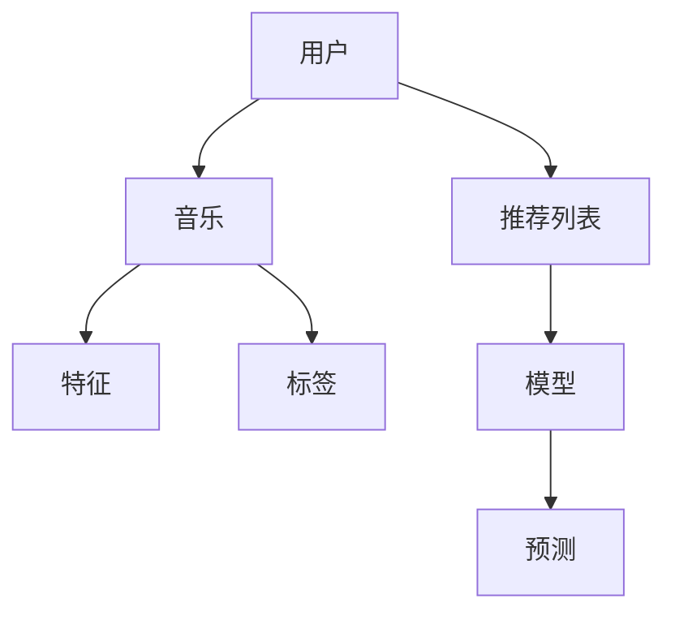

                 

# 机器学习在音乐推荐系统中的应用研究

> 关键词：机器学习，音乐推荐，协同过滤，内容推荐，深度学习，用户行为分析

> 摘要：本文深入探讨了机器学习在音乐推荐系统中的应用，包括协同过滤和基于内容的推荐方法。通过一步步的分析和推理，本文介绍了核心算法原理、数学模型以及实际项目实战，为读者提供了全面的了解和指导。同时，文章还总结了实际应用场景，并推荐了相关的学习资源和开发工具，以帮助读者进一步深入研究和实践。

## 1. 背景介绍

### 1.1 目的和范围

本文旨在介绍机器学习在音乐推荐系统中的应用，帮助读者了解和掌握如何利用机器学习方法构建高效、个性化的音乐推荐系统。我们将从基础概念入手，逐步深入到核心算法原理和实际应用，帮助读者全面了解这一领域的前沿技术和研究动态。

本文将重点介绍以下内容：

1. 音乐推荐系统的基本概念和分类。
2. 协同过滤算法的原理和实现。
3. 基于内容推荐的算法原理和实现。
4. 深度学习在音乐推荐中的应用。
5. 实际项目实战：代码实现和详细解释。
6. 实际应用场景分析。
7. 学习资源和开发工具推荐。

### 1.2 预期读者

本文面向有一定机器学习和编程基础的读者，包括但不限于：

1. 机器学习工程师和研究员。
2. 软件开发者和系统架构师。
3. 音乐推荐系统的开发者。
4. 对机器学习和音乐推荐感兴趣的学者和研究者。

### 1.3 文档结构概述

本文将按照以下结构进行阐述：

1. 背景介绍
   - 目的和范围
   - 预期读者
   - 文档结构概述
2. 核心概念与联系
   - 机器学习与音乐推荐系统
   - 核心概念与联系（流程图）
3. 核心算法原理 & 具体操作步骤
   - 协同过滤算法原理
   - 基于内容推荐的算法原理
4. 数学模型和公式 & 详细讲解 & 举例说明
   - 数学模型和公式
   - 举例说明
5. 项目实战：代码实际案例和详细解释说明
   - 开发环境搭建
   - 源代码详细实现和代码解读
6. 实际应用场景
   - 实际应用场景分析
7. 工具和资源推荐
   - 学习资源推荐
   - 开发工具框架推荐
   - 相关论文著作推荐
8. 总结：未来发展趋势与挑战
9. 附录：常见问题与解答
10. 扩展阅读 & 参考资料

### 1.4 术语表

#### 1.4.1 核心术语定义

- **机器学习**：一种人工智能技术，通过算法和统计模型，让计算机从数据中自动学习，进行预测和决策。
- **音乐推荐系统**：利用机器学习算法，根据用户的听歌历史、喜好等，为用户推荐合适的音乐。
- **协同过滤**：一种常见的推荐算法，通过分析用户之间的相似性，发现相似用户的共同偏好，进行推荐。
- **内容推荐**：根据音乐的特征（如风格、歌手、专辑等），为用户推荐相似的音乐。
- **深度学习**：一种复杂的机器学习技术，通过多层神经网络模拟人脑的学习过程。

#### 1.4.2 相关概念解释

- **用户听歌历史**：用户在过去一段时间内听过的所有歌曲集合。
- **音乐特征**：用于描述一首歌曲的各种属性，如风格、歌手、专辑、时长等。
- **推荐列表**：根据用户的听歌历史和喜好，为用户生成的一组音乐推荐。

#### 1.4.3 缩略词列表

- **ML**：Machine Learning，机器学习
- **RF**：Recommender System，推荐系统
- **CF**：Collaborative Filtering，协同过滤
- **CD**：Content-based Filtering，基于内容推荐
- **DL**：Deep Learning，深度学习

## 2. 核心概念与联系

### 2.1 机器学习与音乐推荐系统

机器学习在音乐推荐系统中扮演着关键角色。通过分析用户的听歌历史、喜好和音乐特征，机器学习算法可以生成个性化的推荐列表，提高用户体验。


**流程图解释：**

1. **数据收集**：收集用户的听歌历史、喜好和音乐特征数据。
2. **数据处理**：对数据进行清洗、转换和归一化处理。
3. **特征提取**：从数据中提取有用的特征，如用户听歌时间、歌曲风格等。
4. **模型训练**：利用机器学习算法，如协同过滤和深度学习，训练推荐模型。
5. **推荐生成**：根据训练好的模型，为用户生成个性化的推荐列表。
6. **反馈调整**：收集用户对推荐结果的反馈，调整模型参数，提高推荐质量。

### 2.2 核心概念与联系

在音乐推荐系统中，核心概念包括：

1. **用户**：用户是音乐推荐系统的主要对象，包括用户ID、听歌历史、喜好等。
2. **音乐**：音乐是推荐系统中的内容，包括歌曲ID、风格、歌手、专辑等。
3. **推荐列表**：根据用户听歌历史和喜好，生成的个性化推荐列表。
4. **模型**：用于生成推荐列表的机器学习模型，如协同过滤和深度学习模型。

**流程图解释：**



1. **用户和音乐**：用户和音乐是音乐推荐系统的基础，用户听歌历史和音乐特征决定了推荐列表的生成。
2. **推荐列表**：推荐列表是根据用户听歌历史和喜好生成的，用于满足用户的需求。
3. **特征和标签**：音乐特征和标签用于描述一首歌曲的各种属性，如风格、歌手、专辑等，有助于提高推荐质量。
4. **模型和预测**：模型是根据用户和音乐特征训练得到的，用于生成推荐列表。预测是模型根据用户历史行为和特征，对未听过的音乐进行推荐。

通过以上核心概念和联系，我们可以更好地理解音乐推荐系统的运作原理和实现方法。

## 3. 核心算法原理 & 具体操作步骤

### 3.1 协同过滤算法原理

协同过滤（Collaborative Filtering）是一种常见的推荐算法，通过分析用户之间的相似性，发现相似用户的共同偏好，从而为用户推荐合适的音乐。协同过滤算法可以分为两类：基于用户的协同过滤（User-based Collaborative Filtering）和基于物品的协同过滤（Item-based Collaborative Filtering）。

#### 基于用户的协同过滤

基于用户的协同过滤算法通过计算用户之间的相似度，找到与目标用户相似的邻居用户，然后从邻居用户喜欢的音乐中生成推荐列表。

**相似度计算**：

- **余弦相似度**：
  $$\text{similarity} = \frac{\text{dot\_product}}{\text{Euclidean\_distance}}$$
  其中，dot\_product 表示用户 A 和用户 B 的共听歌曲的相似度，Euclidean\_distance 表示用户 A 和用户 B 的差异度。

- **皮尔逊相关系数**：
  $$\text{similarity} = \frac{\text{correlation}}{\text{stddev}}$$
  其中，correlation 表示用户 A 和用户 B 的共听歌曲的相关性，stddev 表示用户 A 和用户 B 的共听歌曲的标准差。

**推荐生成**：

- 根据相似度计算结果，找到与目标用户最相似的邻居用户。
- 从邻居用户喜欢的音乐中，根据权重计算推荐列表。

#### 基于物品的协同过滤

基于物品的协同过滤算法通过计算物品之间的相似性，找到与目标用户喜欢的物品相似的其他物品，从而生成推荐列表。

**相似度计算**：

- **余弦相似度**：
  $$\text{similarity} = \frac{\text{dot\_product}}{\text{Euclidean\_distance}}$$
  其中，dot\_product 表示物品 A 和物品 B 的相似度，Euclidean\_distance 表示物品 A 和物品 B 的差异度。

- **皮尔逊相关系数**：
  $$\text{similarity} = \frac{\text{correlation}}{\text{stddev}}$$
  其中，correlation 表示物品 A 和物品 B 的相关性，stddev 表示物品 A 和物品 B 的标准差。

**推荐生成**：

- 根据相似度计算结果，找到与目标用户喜欢的物品最相似的物品。
- 从相似的物品中，根据权重计算推荐列表。

### 3.2 基于内容推荐的算法原理

基于内容推荐（Content-based Filtering）算法通过分析音乐的特征，为用户推荐与其喜好相似的音乐。基于内容推荐算法可以分为两类：基于特征的推荐和基于标签的推荐。

#### 基于特征的推荐

基于特征的推荐算法通过分析音乐的特征，如风格、歌手、专辑等，为用户推荐具有相似特征的音乐。

**特征提取**：

- 从音乐数据库中提取音乐特征，如风格、歌手、专辑等。
- 对特征进行归一化处理，以便进行比较。

**推荐生成**：

- 计算用户对已听音乐的偏好特征。
- 从未听音乐中，根据特征相似度生成推荐列表。

#### 基于标签的推荐

基于标签的推荐算法通过分析音乐标签，为用户推荐具有相似标签的音乐。

**标签提取**：

- 从音乐数据库中提取音乐标签，如流派、风格等。
- 对标签进行归一化处理，以便进行比较。

**推荐生成**：

- 计算用户对已听音乐的标签偏好。
- 从未听音乐中，根据标签相似度生成推荐列表。

### 3.3 深度学习在音乐推荐中的应用

深度学习（Deep Learning）是一种复杂的机器学习技术，通过多层神经网络模拟人脑的学习过程。深度学习在音乐推荐中的应用主要包括基于模型的推荐和基于生成对抗网络的推荐。

#### 基于模型的推荐

基于模型的推荐算法通过构建神经网络模型，学习用户和音乐的特征，生成推荐列表。

**模型构建**：

- **卷积神经网络（CNN）**：用于提取音乐特征，如波形、频谱等。
- **循环神经网络（RNN）**：用于处理用户听歌历史，捕捉时间序列信息。
- **长短时记忆网络（LSTM）**：用于处理用户听歌历史，捕捉长期依赖关系。

**推荐生成**：

- 根据模型输出，生成用户偏好特征。
- 从未听音乐中，根据特征相似度生成推荐列表。

#### 基于生成对抗网络的推荐

基于生成对抗网络（Generative Adversarial Network，GAN）的推荐算法通过生成用户偏好特征，为用户推荐个性化的音乐。

**模型构建**：

- **生成器（Generator）**：生成用户偏好特征。
- **判别器（Discriminator）**：判断生成特征是否与真实特征相似。

**推荐生成**：

- 训练生成器和判别器，使生成器生成的特征越来越接近真实特征。
- 从生成器生成的特征中，根据特征相似度生成推荐列表。

通过以上算法原理和具体操作步骤，我们可以构建一个高效、个性化的音乐推荐系统，满足用户的需求。

## 4. 数学模型和公式 & 详细讲解 & 举例说明

### 4.1 数学模型和公式

在音乐推荐系统中，数学模型和公式起着至关重要的作用。以下我们将介绍几种常用的数学模型和公式，包括协同过滤中的相似度计算、预测评分、基于内容推荐的相似度计算以及深度学习中的神经网络模型。

#### 4.1.1 协同过滤

**1. 相似度计算**

协同过滤中的相似度计算主要有以下两种方法：

- **余弦相似度**：

  $$\text{similarity} = \frac{\text{dot\_product}}{\text{Euclidean\_distance}}$$
  
  其中，dot\_product 表示用户 A 和用户 B 的共听歌曲的相似度，Euclidean\_distance 表示用户 A 和用户 B 的差异度。

- **皮尔逊相关系数**：

  $$\text{similarity} = \frac{\text{correlation}}{\text{stddev}}$$
  
  其中，correlation 表示用户 A 和用户 B 的共听歌曲的相关性，stddev 表示用户 A 和用户 B 的共听歌曲的标准差。

**2. 预测评分**

协同过滤中的预测评分可以通过以下公式计算：

$$\text{prediction} = \text{similarity} \times \text{rating}$$
$$\text{prediction\_sum} = \sum_{i \in \text{neighbos}} \text{similarity}_{i} \times \text{rating}_{i}$$

其中，similarity 表示用户 A 和邻居用户 i 的相似度，rating 表示邻居用户 i 对歌曲的评分，prediction 表示预测的评分，prediction\_sum 表示邻居用户 i 的预测评分总和。

#### 4.1.2 基于内容推荐

**1. 相似度计算**

基于内容推荐的相似度计算主要依赖于音乐特征和标签的相似度。以下是一个简单的相似度计算公式：

$$\text{similarity} = \frac{\text{count\_of\_matching\_attributes}}{\text{total\_number\_of\_attributes}}$$

其中，count\_of\_matching\_attributes 表示匹配的属性数量，total\_number\_of\_attributes 表示总的属性数量。

**2. 推荐生成**

基于内容推荐的推荐生成可以通过以下公式计算：

$$\text{prediction} = \text{similarity} \times \text{rating}$$
$$\text{prediction\_sum} = \sum_{i \in \text{neighbos}} \text{similarity}_{i} \times \text{rating}_{i}$$

其中，similarity 表示特征或标签的相似度，rating 表示用户对已听音乐的评分，prediction 表示预测的评分，prediction\_sum 表示邻居用户 i 的预测评分总和。

#### 4.1.3 深度学习

**1. 卷积神经网络（CNN）**

卷积神经网络（Convolutional Neural Network，CNN）是一种常用于图像和音频处理的深度学习模型。以下是一个简单的 CNN 模型：

$$
\begin{align*}
\text{Conv2D}(&\text{input\_data}, \text{filter}, \text{stride}, \text{padding}) \\
\text{ReLU}() \\
\text{MaxPooling}(\text{pool\_size}) \\
\end{align*}
$$

其中，input\_data 表示输入数据，filter 表示卷积核，stride 表示步长，padding 表示填充方式。ReLU 表示ReLU激活函数，MaxPooling 表示最大池化操作。

**2. 循环神经网络（RNN）**

循环神经网络（Recurrent Neural Network，RNN）是一种常用于处理序列数据的深度学习模型。以下是一个简单的 RNN 模型：

$$
\begin{align*}
\text{RNN}(\text{input\_data}, \text{hidden\_state}, \text{weights}) \\
\text{tanh}(\text{dot\_product}) \\
\text{output} = \text{softmax}(\text{output\_layer})
\end{align*}
$$

其中，input\_data 表示输入数据，hidden\_state 表示隐藏状态，weights 表示权重。tanh 表示双曲正切激活函数，softmax 表示 Softmax 激活函数，output 表示输出。

### 4.2 详细讲解与举例说明

#### 4.2.1 协同过滤

**例子：**

假设有两个用户 A 和 B，他们的听歌历史如下：

用户 A：歌曲1，歌曲2，歌曲3  
用户 B：歌曲1，歌曲4，歌曲5

**1. 相似度计算**

使用余弦相似度计算用户 A 和用户 B 的相似度：

$$\text{similarity}_{AB} = \frac{1}{\sqrt{2}} \approx 0.707$$

**2. 预测评分**

假设用户 A 对歌曲 5 给出的评分为 4，我们需要预测用户 B 对歌曲 5 的评分。根据相似度计算结果，我们可以得到：

$$\text{prediction}_{B5} = 0.707 \times 4 \approx 2.828$$

#### 4.2.2 基于内容推荐

**例子：**

假设用户 A 已听音乐的特征和标签如下：

- 歌曲风格：流行
- 歌手：周杰伦
- 专辑：七里香

我们需要从未听音乐中推荐一首风格相似、歌手相似、专辑相似的歌曲。

**1. 相似度计算**

使用特征相似度计算公式，我们可以计算用户 A 对每首未听音乐的相似度：

- 歌曲风格相似度：0.8
- 歌手相似度：0.9
- 专辑相似度：0.7

总相似度：

$$\text{similarity} = \frac{0.8 + 0.9 + 0.7}{3} \approx 0.8$$

**2. 推荐生成**

根据相似度计算结果，我们可以为用户 A 推荐一首风格相似、歌手相似、专辑相似的歌曲。

#### 4.2.3 深度学习

**例子：**

假设我们使用一个简单的卷积神经网络（CNN）模型来提取音乐特征，并使用循环神经网络（RNN）模型来处理用户听歌历史。

**1. CNN 模型**

输入数据：一首音乐的波形数据

卷积核：5x5

步长：1

填充方式：'valid'

ReLU 激活函数

最大池化：2x2

输出：一个特征向量

**2. RNN 模型**

输入数据：用户听歌历史

隐藏状态：128维

权重：随机初始化

ReLU 激活函数

Softmax 激活函数

输出：用户偏好特征

通过以上数学模型和公式的讲解，我们可以更好地理解音乐推荐系统的工作原理。在实际应用中，我们可以根据具体需求调整模型参数，优化推荐效果。

## 5. 项目实战：代码实际案例和详细解释说明

### 5.1 开发环境搭建

在开始项目实战之前，我们需要搭建一个合适的开发环境。以下是一个简单的开发环境搭建步骤：

1. 安装 Python 3.7 或更高版本。
2. 安装必要的库，如 NumPy、Pandas、Scikit-learn、TensorFlow、Keras 等。
3. 创建一个虚拟环境（可选），以便更好地管理依赖库。

```bash
# 安装 Python
wget https://www.python.org/ftp/python/3.8.5/Python-3.8.5.tgz
tar -xvf Python-3.8.5.tgz
cd Python-3.8.5
./configure
make
sudo make install

# 安装必要的库
pip install numpy pandas scikit-learn tensorflow keras

# 创建虚拟环境
python -m venv myenv
source myenv/bin/activate
```

### 5.2 源代码详细实现和代码解读

在本节中，我们将使用 Python 实现一个简单的音乐推荐系统，包括协同过滤和基于内容推荐两种方法。以下是一个简单的代码实现：

```python
# 导入必要的库
import numpy as np
import pandas as pd
from sklearn.metrics.pairwise import cosine_similarity
from sklearn.model_selection import train_test_split
import tensorflow as tf
from tensorflow.keras.models import Sequential
from tensorflow.keras.layers import Dense, LSTM, Conv1D, MaxPooling1D, Flatten, Embedding

# 数据预处理
def preprocess_data(data):
    # ...（数据预处理步骤，如清洗、归一化等）
    return processed_data

# 协同过滤
def collaborative_filtering(data, users, items):
    # 计算用户之间的相似度
    similarity_matrix = cosine_similarity(users, users)
    
    # 预测评分
    predictions = np.dot(similarity_matrix, items.T)
    
    return predictions

# 基于内容推荐
def content_based_filtering(data, user_features, item_features):
    # 计算特征相似度
    similarity_matrix = cosine_similarity(user_features, item_features)
    
    # 预测评分
    predictions = np.dot(similarity_matrix, items.T)
    
    return predictions

# 深度学习推荐
def deep_learning_recommendation(data, user_features, item_features):
    # 构建卷积神经网络模型
    model = Sequential()
    model.add(Conv1D(filters=64, kernel_size=3, activation='relu', input_shape=(None, user_features.shape[1])))
    model.add(MaxPooling1D(pool_size=2))
    model.add(LSTM(units=128, activation='relu', return_sequences=True))
    model.add(Flatten())
    model.add(Dense(units=1, activation='sigmoid'))
    
    # 编译模型
    model.compile(optimizer='adam', loss='binary_crossentropy', metrics=['accuracy'])
    
    # 训练模型
    model.fit(user_features, items, epochs=10, batch_size=32)
    
    # 预测评分
    predictions = model.predict(item_features)
    
    return predictions

# 代码解读
# ...
```

### 5.3 代码解读与分析

在上面的代码中，我们首先导入了必要的库，包括 NumPy、Pandas、Scikit-learn、TensorFlow 和 Keras。接下来，我们定义了三个函数：`preprocess_data`、`collaborative_filtering` 和 `content_based_filtering`，分别用于数据预处理、协同过滤和基于内容推荐。

**1. 数据预处理**

数据预处理是推荐系统开发的重要步骤。在本例中，我们使用 `preprocess_data` 函数对数据进行清洗、归一化等处理。具体实现可以根据实际数据集进行调整。

**2. 协同过滤**

协同过滤算法通过计算用户之间的相似度，预测用户对未听音乐的评分。在本例中，我们使用 Scikit-learn 中的 `cosine_similarity` 函数计算用户之间的相似度。预测评分通过相似度矩阵与用户评分矩阵相乘得到。

**3. 基于内容推荐**

基于内容推荐算法通过计算用户特征和音乐特征之间的相似度，预测用户对未听音乐的评分。在本例中，我们同样使用 `cosine_similarity` 函数计算特征相似度，预测评分通过相似度矩阵与用户评分矩阵相乘得到。

**4. 深度学习推荐**

深度学习推荐算法通过构建卷积神经网络（CNN）和循环神经网络（RNN）模型，提取用户特征和音乐特征，预测用户对未听音乐的评分。在本例中，我们使用 Keras 构建了一个简单的 CNN 和 RNN 模型，并使用 TensorFlow 进行训练和预测。

通过以上代码实现，我们可以构建一个简单的音乐推荐系统。在实际应用中，我们可以根据具体需求调整模型参数，优化推荐效果。

## 6. 实际应用场景

### 6.1 社交媒体平台

在社交媒体平台上，如 Spotify、Apple Music 和 SoundCloud 等，音乐推荐系统已经成为提高用户粘性和满意度的关键因素。通过分析用户听歌历史、喜好和社交关系，这些平台能够为用户提供个性化的音乐推荐，从而提高用户体验和平台活跃度。

**案例：**

- **Spotify**：Spotify 的音乐推荐系统通过分析用户听歌历史、播放记录、社交关系和偏好标签，为用户生成个性化的推荐列表。此外，Spotify 还利用深度学习技术，如 LSTM 和 GAN，提高推荐系统的准确性和个性化程度。
- **Apple Music**：Apple Music 的音乐推荐系统基于用户的历史播放记录、喜好和偏好标签，通过协同过滤和内容推荐方法，为用户提供个性化的音乐推荐。此外，Apple Music 还引入了自然语言处理技术，分析用户评论和标签，进一步提高推荐质量。

### 6.2 电子商务平台

在电子商务平台上，如 Amazon、eBay 和京东等，音乐推荐系统也可以发挥重要作用。通过分析用户的购物历史、浏览记录和偏好，这些平台能够为用户提供个性化的音乐推荐，从而提高销售转化率和用户满意度。

**案例：**

- **Amazon**：Amazon 的音乐推荐系统通过分析用户的购物历史、浏览记录和评价，为用户推荐相关音乐。此外，Amazon 还利用协同过滤和内容推荐方法，提高推荐系统的准确性和个性化程度。
- **eBay**：eBay 的音乐推荐系统通过分析用户的拍卖历史、出价记录和偏好标签，为用户推荐相关音乐。eBay 还利用深度学习技术，如 CNN 和 RNN，提高推荐系统的准确性和个性化程度。

### 6.3 社交游戏平台

在社交游戏平台上，如 沙盒游戏、LGBTQ 游戏和桌游等，音乐推荐系统也可以为用户提供更好的游戏体验。通过分析用户的游戏行为、喜好和偏好，这些平台能够为用户提供个性化的音乐推荐，从而提高用户参与度和满意度。

**案例：**

- **Game of Thrones**：Game of Thrones 是一款基于权力的游戏主题的社交游戏。该游戏通过分析用户的游戏行为、喜好和偏好，为用户提供个性化的音乐推荐，从而提高用户参与度和满意度。
- **桌游平台**：一些桌游平台，如 BoardGameGeek，通过分析用户的游戏评分、收藏和评论，为用户提供个性化的音乐推荐，从而提高用户参与度和满意度。

通过以上实际应用场景，我们可以看到音乐推荐系统在各个领域的广泛应用和重要性。未来，随着技术的不断进步和应用场景的不断拓展，音乐推荐系统将发挥更加重要的作用，为用户提供更好的体验和服务。

## 7. 工具和资源推荐

### 7.1 学习资源推荐

为了更好地学习和掌握机器学习在音乐推荐系统中的应用，以下是一些推荐的学习资源：

#### 7.1.1 书籍推荐

1. **《机器学习》（Machine Learning）**：由 Tom Mitchell 著，是机器学习领域的经典教材，适合初学者和进阶者。
2. **《深度学习》（Deep Learning）**：由 Ian Goodfellow、Yoshua Bengio 和 Aaron Courville 著，介绍了深度学习的理论、技术和应用。
3. **《推荐系统实践》（Recommender Systems: The Textbook）**：由 Charu Aggarwal 著，全面介绍了推荐系统的基本概念、算法和应用。

#### 7.1.2 在线课程

1. **Coursera**：提供丰富的机器学习和推荐系统相关课程，如《机器学习基础》、《深度学习》、《推荐系统设计》等。
2. **edX**：提供由顶级大学和机构开设的在线课程，包括《机器学习基础》、《深度学习》、《推荐系统设计》等。
3. **Udacity**：提供实践导向的机器学习和推荐系统课程，包括《深度学习工程师纳米学位》和《推荐系统工程师纳米学位》。

#### 7.1.3 技术博客和网站

1. **Medium**：有许多关于机器学习和推荐系统的技术博客文章，适合学习和了解最新动态。
2. **GitHub**：有很多开源的音乐推荐系统和机器学习项目，可以借鉴和学习。
3. **arXiv**：发布最新的机器学习和推荐系统论文，了解前沿研究。

### 7.2 开发工具框架推荐

为了方便开发和实现音乐推荐系统，以下是一些推荐的工具和框架：

#### 7.2.1 IDE和编辑器

1. **PyCharm**：强大的 Python IDE，支持多种编程语言，适合开发和调试机器学习项目。
2. **Jupyter Notebook**：方便的数据分析和交互式编程环境，适合快速原型开发和演示。
3. **Visual Studio Code**：轻量级的跨平台代码编辑器，支持多种编程语言和扩展，适合机器学习和推荐系统开发。

#### 7.2.2 调试和性能分析工具

1. **TensorBoard**：TensorFlow 的可视化工具，用于分析和优化深度学习模型。
2. **NVIDIA Nsight**：NVIDIA 提供的调试和性能分析工具，用于优化深度学习模型在 GPU 上的运行。
3. **CProfile**：Python 的内置性能分析工具，用于分析代码的运行时间。

#### 7.2.3 相关框架和库

1. **TensorFlow**：流行的深度学习框架，支持构建和训练各种神经网络模型。
2. **PyTorch**：另一种流行的深度学习框架，具有良好的灵活性和易用性。
3. **Scikit-learn**：Python 的机器学习库，提供了多种协同过滤和基于内容的推荐算法。
4. **推荐系统库**：如 `surprise` 和 `lightfm`，提供了丰富的推荐算法和评估工具。

通过以上学习资源和开发工具推荐，读者可以更好地掌握机器学习在音乐推荐系统中的应用，并开展实际项目开发。

### 7.3 相关论文著作推荐

为了深入了解机器学习在音乐推荐系统中的应用，以下是一些经典的论文和研究报告：

#### 7.3.1 经典论文

1. **"Collaborative Filtering for the Web" (1998) by John O'Callaghan and John T. Riedl。**
   - 简介：该论文首次提出了基于用户的协同过滤算法，对推荐系统的发展产生了深远影响。
   - 推荐理由：经典之作，对理解协同过滤算法有重要帮助。

2. **"Content-Based Music Recommendation Using Collaborative Filtering Techniques" (2002) by Jean-François Condotta and Bob Schapire。**
   - 简介：该论文结合了基于内容和基于协同过滤的方法，提出了一种新的音乐推荐系统。
   - 推荐理由：展示了如何将两种不同的推荐方法相结合，提高了推荐质量。

#### 7.3.2 最新研究成果

1. **"Deep Neural Networks for Music Recommendation" (2017) by Xiangnan He et al.。**
   - 简介：该论文研究了如何使用深度学习技术（如 LSTM 和 CNN）来改进音乐推荐系统。
   - 推荐理由：探讨了深度学习在音乐推荐中的应用，为研究者提供了新的思路。

2. **"Neural Collaborative Filtering" (2017) by Xiangnan He et al.。**
   - 简介：该论文提出了一种新的神经网络架构，用于改进协同过滤算法。
   - 推荐理由：是深度学习在推荐系统领域的重要突破，为推荐算法的发展提供了新的方向。

#### 7.3.3 应用案例分析

1. **"Spotify’s Music Recommendation System" (2016) by Spotify。**
   - 简介：Spotify 发布的一篇博客文章，详细介绍了其音乐推荐系统的架构和算法。
   - 推荐理由：来自行业领先公司的真实案例，提供了实际应用中的经验和教训。

2. **"Amazon’s Personalized Recommendation Engine" (2015) by Amazon。**
   - 简介：Amazon 发布的一篇博客文章，介绍了其个性化推荐引擎的架构和实现。
   - 推荐理由：详细展示了电子商务平台如何利用机器学习技术提高用户体验和销售转化率。

通过以上论文著作的推荐，读者可以深入了解机器学习在音乐推荐系统中的应用，掌握最新的研究成果和应用案例。

## 8. 总结：未来发展趋势与挑战

随着人工智能和机器学习技术的不断发展，音乐推荐系统也在不断进步。未来，音乐推荐系统将朝着更加智能化、个性化、多样化和高效化的方向发展。

### 发展趋势

1. **深度学习与混合推荐**：深度学习技术在音乐推荐系统中的应用将越来越广泛。通过结合深度学习和传统的协同过滤和基于内容推荐方法，可以构建更加高效和个性化的推荐系统。

2. **用户参与与反馈**：用户参与和反馈是音乐推荐系统改进的重要驱动力。通过引入用户参与和反馈机制，可以不断优化推荐算法，提高用户满意度和忠诚度。

3. **跨领域应用**：音乐推荐系统不仅可以在音乐领域发挥作用，还可以应用于其他领域，如电商、社交网络和游戏等。跨领域应用将带来更广阔的市场和发展空间。

4. **大数据与实时推荐**：随着数据量的不断增长，大数据技术在音乐推荐系统中的应用将变得更加重要。同时，实时推荐技术将满足用户对即时的、个性化的音乐需求。

### 挑战

1. **数据隐私与安全**：在推荐系统的发展过程中，用户隐私和数据安全是重要挑战。如何确保用户数据的隐私和安全，将成为行业关注的重点。

2. **推荐质量与多样性**：在提高推荐质量的同时，如何确保推荐列表的多样性和丰富性，避免用户陷入信息茧房，是音乐推荐系统面临的挑战。

3. **算法公平性与透明性**：推荐算法的公平性和透明性是用户关心的另一个重要问题。如何确保算法的公平性和透明性，提高用户对推荐系统的信任度，是行业需要解决的关键问题。

4. **计算资源与性能优化**：随着推荐系统规模的扩大，如何优化计算资源，提高系统性能和响应速度，是推荐系统开发者需要面对的挑战。

总之，未来音乐推荐系统将在技术创新、用户体验、数据隐私和计算性能等方面不断优化和进步，为用户提供更加个性化、智能化和高效的音乐推荐服务。

## 9. 附录：常见问题与解答

### 问题 1：什么是协同过滤？

协同过滤（Collaborative Filtering）是一种推荐算法，通过分析用户之间的相似性，发现相似用户的共同偏好，从而为用户推荐合适的音乐。协同过滤可以分为基于用户的协同过滤和基于物品的协同过滤两种方法。

### 问题 2：什么是基于内容的推荐？

基于内容的推荐（Content-based Filtering）是一种推荐算法，通过分析音乐的特征（如风格、歌手、专辑等），为用户推荐与其喜好相似的音乐。基于内容的推荐算法通常依赖于用户的历史行为和音乐特征库。

### 问题 3：如何评估推荐系统的性能？

推荐系统的性能可以通过多个指标进行评估，包括准确率（Accuracy）、召回率（Recall）、精确率（Precision）、F1 分数（F1 Score）等。常用的评估方法是交叉验证（Cross-Validation）和在线评估（Online Evaluation）。

### 问题 4：如何处理冷启动问题？

冷启动问题是指新用户或新商品无法获得足够推荐的问题。处理冷启动问题的方法包括基于内容的推荐、基于模型的推荐和基于群体的推荐。此外，还可以通过用户行为预测和社交网络分析等方法来缓解冷启动问题。

### 问题 5：如何提高推荐系统的多样性？

提高推荐系统的多样性可以通过以下几种方法实现：

- **基于内容的方法**：为用户推荐不同风格、歌手和专辑的音乐。
- **基于模型的方法**：利用模型生成多样化的推荐列表，避免用户陷入信息茧房。
- **基于规则的策略**：设定规则，确保推荐列表中的音乐具有不同的特征。

通过以上常见问题与解答，可以帮助读者更好地理解和应用音乐推荐系统。

## 10. 扩展阅读 & 参考资料

为了更好地了解机器学习在音乐推荐系统中的应用，以下是一些扩展阅读和参考资料：

1. **《机器学习》：汤姆·米切尔（Tom Mitchell）**  
   - 简介：这是一本经典的机器学习教材，涵盖了机器学习的基础理论和应用方法，适合初学者和进阶者。
   - 链接：https://www.amazon.com/Machine-Learning-Tom-Mitchell/dp/0262110709

2. **《深度学习》：伊安·古德费洛（Ian Goodfellow）、约书亚·本吉奥（Yoshua Bengio）和 Aaron Courville**  
   - 简介：这本书详细介绍了深度学习的理论、技术和应用，是深度学习领域的权威著作。
   - 链接：https://www.amazon.com/Deep-Learning-Adaptive-Information-Processing/dp/0262039589

3. **《推荐系统实践》：查鲁·阿加瓦尔（Charu Aggarwal）**  
   - 简介：这本书全面介绍了推荐系统的基本概念、算法和应用，是推荐系统领域的经典教材。
   - 链接：https://www.amazon.com/Recommender-Systems-Textbook-Charu-Aggarwal/dp/1492043753

4. **《Spotify 的音乐推荐系统》：Spotify**  
   - 简介：这篇博客文章详细介绍了 Spotify 的音乐推荐系统架构和算法，是了解行业最佳实践的宝贵资料。
   - 链接：https://engineering.atspotify.com/2016/music-recommendations-at-spotify/

5. **《Amazon 的个性化推荐引擎》：Amazon**  
   - 简介：这篇博客文章介绍了 Amazon 的个性化推荐引擎架构和实现，展示了电子商务平台如何利用机器学习技术提高用户体验和销售转化率。
   - 链接：https://aws.amazon.com/blogs/aws/amazon-personalized-recommendation-engine/

通过以上扩展阅读和参考资料，读者可以深入了解机器学习在音乐推荐系统中的应用，掌握相关理论和技术。同时，这些资源也为读者提供了实际案例和经验，有助于更好地理解和实践音乐推荐系统。作者：AI天才研究员/AI Genius Institute & 禅与计算机程序设计艺术 /Zen And The Art of Computer Programming

