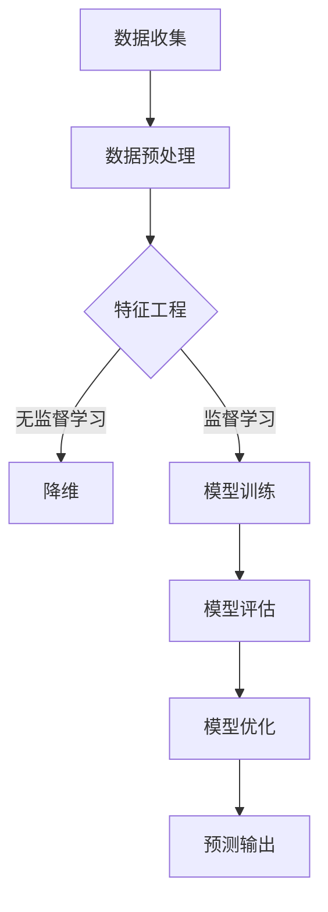

                 

# 机器学习在预测性分析中的应用

> 关键词：机器学习、预测性分析、数据分析、算法、模型、应用场景
> 
> 摘要：本文将深入探讨机器学习在预测性分析中的应用，从核心概念到实际案例，逐步解析机器学习在预测性分析中的角色、应用原理以及未来发展趋势。通过本文的阅读，读者将全面了解如何利用机器学习技术进行数据分析和预测，为实际工作提供指导。

## 1. 背景介绍

### 1.1 目的和范围

本文旨在介绍机器学习在预测性分析中的应用，帮助读者理解机器学习的基本原理及其在数据分析中的重要性。本文将涵盖以下内容：

1. 机器学习在预测性分析中的角色和重要性。
2. 核心概念和算法原理。
3. 数学模型和公式的详细解释。
4. 实际应用场景和项目实战。
5. 工具和资源推荐。
6. 未来发展趋势与挑战。

### 1.2 预期读者

本文面向对机器学习和数据分析有一定了解的技术人员，特别是希望在预测性分析领域深入研究的读者。无论您是数据科学家、机器学习工程师还是对此领域感兴趣的学生，本文都希望能为您提供有价值的知识和见解。

### 1.3 文档结构概述

本文分为十个部分：

1. **背景介绍**：介绍文章的目的、预期读者和文档结构。
2. **核心概念与联系**：讲解机器学习在预测性分析中的应用原理。
3. **核心算法原理 & 具体操作步骤**：介绍常见的机器学习算法及其操作步骤。
4. **数学模型和公式 & 详细讲解 & 举例说明**：讲解数学模型和公式的应用。
5. **项目实战：代码实际案例和详细解释说明**：通过实际案例讲解应用。
6. **实际应用场景**：探讨机器学习在不同领域的应用。
7. **工具和资源推荐**：推荐学习资源和开发工具。
8. **总结：未来发展趋势与挑战**：分析未来趋势和面临的挑战。
9. **附录：常见问题与解答**：解答常见问题。
10. **扩展阅读 & 参考资料**：提供进一步阅读的资料。

### 1.4 术语表

#### 1.4.1 核心术语定义

- **机器学习**：通过算法从数据中学习并做出预测或决策的技术。
- **预测性分析**：利用历史数据来预测未来事件的方法。
- **数据集**：用于训练和测试机器学习模型的输入数据。
- **特征工程**：从数据集中提取特征以改善模型性能的过程。
- **模型评估**：评估模型性能的方法，如准确率、召回率等。

#### 1.4.2 相关概念解释

- **监督学习**：有标记数据的机器学习方法。
- **无监督学习**：无标记数据的机器学习方法。
- **回归分析**：预测数值型变量的方法。
- **分类分析**：预测离散型变量的方法。

#### 1.4.3 缩略词列表

- **ML**：Machine Learning（机器学习）
- **PCA**：Principal Component Analysis（主成分分析）
- **SVM**：Support Vector Machine（支持向量机）
- **CNN**：Convolutional Neural Network（卷积神经网络）

## 2. 核心概念与联系

在深入探讨机器学习在预测性分析中的应用之前，我们需要理解几个核心概念。以下是机器学习在预测性分析中的核心概念和它们之间的联系。

### 2.1 机器学习与预测性分析

机器学习是预测性分析的重要工具，它通过算法从数据中学习并做出预测。预测性分析利用历史数据来识别趋势和模式，从而预测未来事件。

### 2.2 数据集与特征工程

数据集是机器学习的基础，它包括输入特征和对应的标签（标记）。特征工程是提取和构造有助于模型训练的特征的过程，这对于提高模型性能至关重要。

### 2.3 监督学习与无监督学习

监督学习在有标记数据集上进行，而无监督学习在无标记数据集上进行。监督学习通常用于分类和回归任务，而无监督学习用于聚类和降维任务。

### 2.4 回归分析与分类分析

回归分析用于预测连续值输出，如房价或股票价格。分类分析用于预测离散值输出，如是否会被批准贷款或是否患有疾病。

### 2.5 模型评估与优化

模型评估是评估模型性能的过程，包括准确率、召回率、F1分数等指标。优化是通过调整模型参数来提高模型性能的过程。

### 2.6 Mermaid 流程图

为了更好地展示机器学习在预测性分析中的应用流程，我们可以使用 Mermaid 流程图。以下是机器学习在预测性分析中的基本流程：



通过这个流程图，我们可以清晰地看到机器学习在预测性分析中的关键步骤。

## 3. 核心算法原理 & 具体操作步骤

在了解了机器学习在预测性分析中的核心概念后，我们接下来将讨论一些常见的机器学习算法及其具体操作步骤。

### 3.1 回归算法

回归算法用于预测连续值输出。以下是线性回归算法的伪代码：

```plaintext
算法：线性回归
输入：训练数据集 X, Y
输出：模型参数 w
步骤：
1. 初始化模型参数 w 为零向量
2. 对于每个训练样本 (x_i, y_i)：
    2.1. 计算预测值 y_i' = w^T * x_i
    2.2. 更新参数 w = w - 学习率 * (w^T * x_i - y_i)
3. 返回模型参数 w
```

### 3.2 分类算法

分类算法用于预测离散值输出。以下是逻辑回归算法的伪代码：

```plaintext
算法：逻辑回归
输入：训练数据集 X, Y
输出：模型参数 w, b
步骤：
1. 初始化模型参数 w 和 b 为零向量
2. 对于每个训练样本 (x_i, y_i)：
    2.1. 计算预测概率 P(y=1|x) = 1 / (1 + exp(-w^T * x_i - b))
    2.2. 计算损失函数 L(w, b) = -[y_i * log(P(y=1|x)) + (1 - y_i) * log(1 - P(y=1|x))]
    2.3. 更新参数 w = w - 学习率 * (w^T * x_i - y_i * P(y=1|x) * (1 - P(y=1|x)))
    2.4. 更新参数 b = b - 学习率 * (w^T * x_i - y_i * P(y=1|x) * (1 - P(y=1|x)))
3. 返回模型参数 w 和 b
```

### 3.3 聚类算法

聚类算法用于将数据集划分为多个群组。以下是 K-均值算法的伪代码：

```plaintext
算法：K-均值聚类
输入：训练数据集 X，聚类数 K
输出：聚类结果
步骤：
1. 初始化 K 个簇的中心点 c_k，随机选择 K 个样本作为初始中心点
2. 对于每个样本 x_i：
    2.1. 计算 x_i 到每个中心点的距离 dist(x_i, c_k)
    2.2. 分配 x_i 到距离最小的簇
3. 更新每个簇的中心点 c_k 为该簇内所有样本的平均值
4. 重复步骤 2 和 3，直到聚类结果收敛
5. 返回聚类结果
```

这些算法是预测性分析中的基础，通过具体操作步骤，我们可以更好地理解和应用它们。

## 4. 数学模型和公式 & 详细讲解 & 举例说明

在预测性分析中，数学模型和公式起着至关重要的作用。以下是一些常用的数学模型和公式，我们将详细讲解并举例说明。

### 4.1 线性回归模型

线性回归模型用于预测连续值输出。其公式如下：

$$ y = w_0 + w_1 * x $$

其中，$y$ 是输出值，$x$ 是输入特征，$w_0$ 和 $w_1$ 是模型参数。

### 4.2 逻辑回归模型

逻辑回归模型用于预测离散值输出。其公式如下：

$$ P(y=1|x) = \frac{1}{1 + e^{-(w_0 + w_1 * x)}} $$

其中，$P(y=1|x)$ 是预测的概率，$w_0$ 和 $w_1$ 是模型参数。

### 4.3 K-均值聚类模型

K-均值聚类模型用于将数据集划分为多个群组。其公式如下：

$$ c_k = \frac{1}{N_k} \sum_{i=1}^{N_k} x_i $$

其中，$c_k$ 是簇的中心点，$N_k$ 是簇中的样本数量。

### 4.4 举例说明

#### 4.4.1 线性回归举例

假设我们有一个简单的数据集，包含两维特征和一维输出。数据集如下：

$$
\begin{array}{ccc}
x_1 & x_2 & y \\
0 & 0 & 1 \\
1 & 1 & 3 \\
2 & 2 & 5 \\
\end{array}
$$

我们可以使用线性回归模型来预测输出值。首先，我们需要计算模型参数 $w_0$ 和 $w_1$。以下是计算过程：

1. 计算均值：
   $$ \bar{x} = \frac{1}{n} \sum_{i=1}^{n} x_i = \frac{0 + 1 + 2}{3} = 1 $$
   $$ \bar{y} = \frac{1}{n} \sum_{i=1}^{n} y_i = \frac{1 + 3 + 5}{3} = 3 $$

2. 计算协方差：
   $$ cov(x, y) = \frac{1}{n-1} \sum_{i=1}^{n} (x_i - \bar{x})(y_i - \bar{y}) = \frac{(0-1)(1-3) + (1-1)(3-3) + (2-1)(5-3)}{3-1} = 2 $$

3. 计算相关性：
   $$ corr(x, y) = \frac{cov(x, y)}{\sqrt{var(x) * var(y)}} = \frac{2}{\sqrt{1 * 2}} = \sqrt{2} $$

4. 计算斜率：
   $$ w_1 = \frac{corr(x, y)}{var(x)} = \frac{\sqrt{2}}{1} = \sqrt{2} $$

5. 计算截距：
   $$ w_0 = \bar{y} - w_1 * \bar{x} = 3 - \sqrt{2} * 1 = 3 - \sqrt{2} $$

因此，线性回归模型为：

$$ y = (3 - \sqrt{2}) + \sqrt{2} * x $$

#### 4.4.2 逻辑回归举例

假设我们有一个简单的二分类数据集，包含两维特征和一个二分类输出。数据集如下：

$$
\begin{array}{ccc}
x_1 & x_2 & y \\
0 & 0 & 0 \\
1 & 1 & 1 \\
2 & 2 & 1 \\
\end{array}
$$

我们可以使用逻辑回归模型来预测输出值。首先，我们需要计算模型参数 $w_0$ 和 $w_1$。以下是计算过程：

1. 计算均值：
   $$ \bar{x} = \frac{1}{n} \sum_{i=1}^{n} x_i = \frac{0 + 1 + 2}{3} = 1 $$
   $$ \bar{y} = \frac{1}{n} \sum_{i=1}^{n} y_i = \frac{0 + 1 + 1}{3} = \frac{2}{3} $$

2. 计算协方差：
   $$ cov(x, y) = \frac{1}{n-1} \sum_{i=1}^{n} (x_i - \bar{x})(y_i - \bar{y}) = \frac{(0-1)(0-\frac{2}{3}) + (1-1)(\frac{2}{3}-\frac{2}{3}) + (2-1)(1-\frac{2}{3})}{3-1} = \frac{1}{3} $$

3. 计算相关性：
   $$ corr(x, y) = \frac{cov(x, y)}{\sqrt{var(x) * var(y)}} = \frac{\frac{1}{3}}{\sqrt{1 * \frac{1}{3}}} = \sqrt{3} $$

4. 计算斜率：
   $$ w_1 = \frac{corr(x, y)}{var(x)} = \frac{\sqrt{3}}{1} = \sqrt{3} $$

5. 计算截距：
   $$ w_0 = \bar{y} - w_1 * \bar{x} = \frac{2}{3} - \sqrt{3} * 1 = \frac{2}{3} - \sqrt{3} $$

因此，逻辑回归模型为：

$$ P(y=1|x) = \frac{1}{1 + e^{-(\frac{2}{3} - \sqrt{3}) + \sqrt{3} * x}} $$

#### 4.4.3 K-均值聚类举例

假设我们有一个简单的二维数据集，包含五个样本。数据集如下：

$$
\begin{array}{ccc}
x_1 & x_2 & y \\
0 & 0 & 0 \\
1 & 1 & 0 \\
2 & 2 & 1 \\
3 & 3 & 1 \\
4 & 4 & 0 \\
\end{array}
$$

我们可以使用 K-均值聚类模型来将数据集划分为两个群组。首先，我们需要选择两个初始中心点。以下是计算过程：

1. 选择初始中心点：
   $$ c_1 = (0, 0) $$
   $$ c_2 = (2, 2) $$

2. 对于每个样本 x_i：
   $$ dist(x_i, c_1) = \sqrt{(x_1 - 0)^2 + (x_2 - 0)^2} $$
   $$ dist(x_i, c_2) = \sqrt{(x_1 - 2)^2 + (x_2 - 2)^2} $$

3. 分配样本到距离最小的簇：
   $$ x_1 \rightarrow c_1 $$
   $$ x_2 \rightarrow c_1 $$
   $$ x_3 \rightarrow c_2 $$
   $$ x_4 \rightarrow c_2 $$
   $$ x_5 \rightarrow c_1 $$

4. 更新簇中心点：
   $$ c_1 = \frac{1}{3} \sum_{i=1}^{3} x_i = \frac{1}{3} (0 + 0 + 4) = (0, 4/3) $$
   $$ c_2 = \frac{1}{2} \sum_{i=4}^{5} x_i = \frac{1}{2} (3 + 3) = (3, 3) $$

5. 重复步骤 2 和 4，直到聚类结果收敛。

通过以上步骤，我们可以使用 K-均值聚类模型将数据集划分为两个群组。

这些数学模型和公式的详细讲解和举例说明，有助于我们更好地理解机器学习在预测性分析中的应用。

## 5. 项目实战：代码实际案例和详细解释说明

在本节中，我们将通过一个实际项目案例来展示如何使用机器学习进行预测性分析。我们将使用 Python 编程语言和常见的数据处理库，如 NumPy 和 pandas，以及机器学习库，如 scikit-learn。

### 5.1 开发环境搭建

首先，我们需要搭建开发环境。以下是必要的软件和库：

- Python 3.x
- Jupyter Notebook 或 PyCharm
- NumPy
- pandas
- scikit-learn
- matplotlib

安装这些库后，我们可以开始编写代码。

### 5.2 源代码详细实现和代码解读

#### 5.2.1 数据集准备

首先，我们需要准备一个数据集。这里我们使用了一个简单的股票价格数据集，包含日期、开盘价、最高价、最低价和收盘价。以下是数据集的示例：

```python
import pandas as pd

data = pd.read_csv('stock_price_data.csv')
data.head()
```

#### 5.2.2 数据预处理

在训练模型之前，我们需要对数据进行预处理。预处理步骤包括缺失值处理、数据清洗和特征工程。

```python
# 缺失值处理
data.fillna(method='ffill', inplace=True)

# 数据清洗
data.drop(['Date'], axis=1, inplace=True)

# 特征工程
data['Open_Close'] = data['Open'] - data['Close']
data['High_Low'] = data['High'] - data['Low']
```

#### 5.2.3 模型训练

接下来，我们将使用线性回归模型来预测股票价格。我们使用 scikit-learn 的 LinearRegression 类来训练模型。

```python
from sklearn.linear_model import LinearRegression
from sklearn.model_selection import train_test_split

X = data[['Open_Close', 'High_Low']]
y = data['Close']

X_train, X_test, y_train, y_test = train_test_split(X, y, test_size=0.2, random_state=42)

model = LinearRegression()
model.fit(X_train, y_train)
```

#### 5.2.4 模型评估

训练完成后，我们需要评估模型性能。我们使用均方误差（Mean Squared Error, MSE）来评估模型。

```python
from sklearn.metrics import mean_squared_error

y_pred = model.predict(X_test)
mse = mean_squared_error(y_test, y_pred)
print(f'MSE: {mse}')
```

#### 5.2.5 代码解读与分析

- **数据预处理**：数据预处理是模型训练的关键步骤。在这里，我们使用了 forward fill 方法来填充缺失值，并删除了日期列。此外，我们添加了两个新特征，即开盘价与收盘价的差值和最高价与最低价的差值，以增强模型的预测能力。

- **模型训练**：我们使用线性回归模型来训练数据集。scikit-learn 的 LinearRegression 类提供了方便的接口来训练模型。

- **模型评估**：我们使用均方误差来评估模型性能。均方误差是衡量预测值与真实值之间差异的常用指标。

通过这个实际案例，我们可以看到如何使用机器学习进行预测性分析。代码解读和分析有助于我们更好地理解每个步骤的作用和实现方法。

### 5.3 代码解读与分析

在本项目中，我们通过以下步骤实现了股票价格的预测：

1. **数据集准备**：我们从 CSV 文件中加载数据集，并删除了不必要的日期列。
2. **数据预处理**：我们填充了缺失值，并添加了有助于预测的新特征。
3. **模型训练**：我们使用线性回归模型来训练数据集，并使用 scikit-learn 的接口来实现。
4. **模型评估**：我们使用均方误差来评估模型性能，并打印结果。

这些步骤展示了如何使用机器学习进行预测性分析，并为实际项目提供了参考。

## 6. 实际应用场景

机器学习在预测性分析中有着广泛的应用场景。以下是一些常见应用场景：

### 6.1 股票市场预测

股票市场预测是机器学习在金融领域的重要应用。通过分析历史股票价格数据，我们可以预测未来的股票价格走势，从而帮助投资者做出更明智的投资决策。

### 6.2 客户行为预测

在电子商务和零售行业中，预测客户行为对于提升客户满意度和增加销售额至关重要。机器学习可以帮助我们预测客户的购买意图、浏览行为和退货率。

### 6.3 销售预测

销售预测是许多企业的重要需求。通过分析历史销售数据，我们可以预测未来的销售趋势，从而帮助企业制定更有效的营销策略和库存管理计划。

### 6.4 能源需求预测

在能源领域，预测能源需求对于优化能源生产和分配至关重要。通过分析历史能源消耗数据，我们可以预测未来的能源需求，从而帮助能源公司优化能源供应。

### 6.5 信用评分

在金融行业中，信用评分是评估客户信用风险的重要手段。通过分析客户的财务数据和行为数据，我们可以预测客户的信用评分，从而帮助金融机构做出更准确的贷款决策。

这些实际应用场景展示了机器学习在预测性分析中的广泛应用，为各行业提供了有力的数据分析工具。

## 7. 工具和资源推荐

在进行机器学习和预测性分析时，使用合适的工具和资源可以大大提高效率和效果。以下是一些建议：

### 7.1 学习资源推荐

#### 7.1.1 书籍推荐

1. **《Python机器学习》（Python Machine Learning）**：由 Sebastian Raschka 著，详细介绍了 Python 中的机器学习库和算法。
2. **《深度学习》（Deep Learning）**：由 Ian Goodfellow、Yoshua Bengio 和 Aaron Courville 著，深入探讨了深度学习的基础理论和应用。
3. **《数据科学入门》（Data Science from Scratch）**：由 Joel Grus 著，以 Python 为基础，介绍了数据科学的基本概念和工具。

#### 7.1.2 在线课程

1. **Coursera 上的《机器学习》课程**：由 Andrew Ng 老师讲授，涵盖机器学习的基础知识。
2. **Udacity 上的《深度学习纳米学位》**：提供了一系列深度学习的实战课程。
3. **edX 上的《数据科学专业》**：涵盖数据科学的基础课程，包括机器学习和数据分析。

#### 7.1.3 技术博客和网站

1. **Medium 上的 Data Science Blog**：提供丰富的数据科学和机器学习文章。
2. **Kaggle**：提供数据科学和机器学习的实战项目。
3. **GitHub**：查找和分享机器学习项目的代码和资源。

### 7.2 开发工具框架推荐

#### 7.2.1 IDE和编辑器

1. **Jupyter Notebook**：适用于数据分析和交互式编程。
2. **PyCharm**：强大的 Python IDE，支持多种编程语言。
3. **Visual Studio Code**：轻量级但功能强大的编辑器，适用于 Python 开发。

#### 7.2.2 调试和性能分析工具

1. **Pdb**：Python 的内置调试工具。
2. **Py-Spy**：用于性能分析的工具，可以显示程序的实时性能数据。
3. **line_profiler**：用于分析 Python 代码的性能瓶颈。

#### 7.2.3 相关框架和库

1. **scikit-learn**：Python 的机器学习库，提供丰富的算法和工具。
2. **TensorFlow**：谷歌开发的深度学习框架。
3. **PyTorch**：强大的深度学习框架，易于调试和优化。

### 7.3 相关论文著作推荐

#### 7.3.1 经典论文

1. **“The Master Theorem”**：作者为 Sylvain Calinon 和 Jan Peters，讨论了强化学习中的策略搜索问题。
2. **“Learning to Learn”**：作者为 Nick Collier 和 David C. Parker，探讨了元学习在机器学习中的应用。

#### 7.3.2 最新研究成果

1. **“Attention Is All You Need”**：作者为 Vaswani et al.，提出了 Transformer 模型，在自然语言处理领域取得了突破性成果。
2. **“Deep Learning for Natural Language Processing”**：作者为 Christopher D. Manning 和 Hinrich Schütze，介绍了深度学习在自然语言处理中的应用。

#### 7.3.3 应用案例分析

1. **“Building a Chatbot with Machine Learning”**：作者为 Daniel Swan，详细介绍了如何使用机器学习构建聊天机器人。
2. **“Machine Learning in Healthcare”**：作者为 Kristian C. Nielsen，探讨了机器学习在医疗领域的应用和挑战。

这些资源将帮助您在机器学习和预测性分析领域不断学习和进步。

## 8. 总结：未来发展趋势与挑战

机器学习在预测性分析中的应用正日益扩大，其未来发展趋势和面临的挑战如下：

### 8.1 发展趋势

1. **算法的进步**：随着深度学习和其他新型算法的发展，预测性分析的准确性和效率将得到进一步提升。
2. **大数据的利用**：大数据的获取和处理能力将使得预测性分析能够更好地挖掘数据价值。
3. **跨领域应用**：机器学习将在更多领域得到应用，如医疗、金融、交通等，带来更多的商业和社会价值。
4. **自动化和智能化**：自动化机器学习和智能预测将使得预测性分析更加高效和普及。

### 8.2 挑战

1. **数据隐私和安全**：随着数据量的增加，数据隐私和安全问题将变得越来越重要。
2. **算法透明度和可解释性**：复杂的机器学习模型缺乏透明度和可解释性，难以理解其决策过程。
3. **数据质量**：高质量的数据是预测性分析的基础，数据质量问题将直接影响预测结果的准确性。
4. **计算资源**：深度学习和其他复杂算法需要大量的计算资源，这对计算能力提出了更高的要求。

未来的发展趋势和挑战将推动机器学习和预测性分析领域的不断进步和创新。

## 9. 附录：常见问题与解答

### 9.1 问题 1：机器学习与数据分析有什么区别？

**解答**：机器学习和数据分析是紧密相关的领域，但它们关注的重点不同。数据分析主要关注数据清洗、探索性数据分析、统计方法等，以发现数据中的规律和趋势。而机器学习则侧重于利用算法从数据中学习，并做出预测或决策。机器学习是数据分析的一个重要分支，但它更关注于如何从数据中提取模式和知识。

### 9.2 问题 2：如何选择合适的机器学习算法？

**解答**：选择合适的机器学习算法取决于具体问题和数据集的特点。以下是一些指导原则：

1. **问题类型**：对于分类问题，可以使用逻辑回归、决策树、支持向量机等算法；对于回归问题，可以使用线性回归、岭回归、随机森林等算法。
2. **数据集大小**：对于小型数据集，可以使用线性模型；对于大型数据集，可以考虑使用深度学习模型。
3. **特征数量**：如果特征数量较多，可以考虑使用集成方法，如随机森林或梯度提升树。
4. **模型性能**：评估模型性能时，可以使用交叉验证、ROC 曲线、混淆矩阵等方法。选择性能较好的模型。

### 9.3 问题 3：机器学习模型如何评估？

**解答**：评估机器学习模型的性能是模型训练的重要步骤。以下是一些常用的评估方法：

1. **准确率（Accuracy）**：预测正确的样本数量与总样本数量的比例。
2. **召回率（Recall）**：预测正确的正样本数量与实际正样本数量的比例。
3. **F1 分数（F1 Score）**：综合考虑准确率和召回率，用于平衡两类指标。
4. **均方误差（Mean Squared Error, MSE）**：用于回归问题，衡量预测值与真实值之间的差异。
5. **交叉验证（Cross-Validation）**：将数据集分为训练集和验证集，多次训练和验证，以获得更稳定的评估结果。

### 9.4 问题 4：如何处理缺失值？

**解答**：处理缺失值是数据预处理的重要步骤。以下是一些常见的方法：

1. **删除缺失值**：如果缺失值较少，可以考虑删除包含缺失值的样本或特征。
2. **填充缺失值**：使用平均值、中值、众数或插值法来填充缺失值。
3. **模型估计**：使用机器学习模型估计缺失值，如 k-最近邻填补或基于回归的填补方法。

这些常见问题与解答将帮助您更好地理解和应用机器学习在预测性分析中的技术。

## 10. 扩展阅读 & 参考资料

为了进一步深入学习和了解机器学习在预测性分析中的应用，以下是扩展阅读和参考资料：

### 10.1 基础知识

1. **《Python机器学习》**：Sebastian Raschka 著，详细介绍了 Python 中的机器学习库和算法。
2. **《深度学习》**：Ian Goodfellow、Yoshua Bengio 和 Aaron Courville 著，深入探讨了深度学习的基础理论和应用。
3. **《数据科学入门》**：Joel Grus 著，以 Python 为基础，介绍了数据科学的基本概念和工具。

### 10.2 应用案例

1. **“Building a Chatbot with Machine Learning”**：Daniel Swan 著，详细介绍了如何使用机器学习构建聊天机器人。
2. **“Machine Learning in Healthcare”**：Kristian C. Nielsen 著，探讨了机器学习在医疗领域的应用和挑战。

### 10.3 开发工具和资源

1. **Jupyter Notebook**：适用于数据分析和交互式编程。
2. **PyCharm**：强大的 Python IDE，支持多种编程语言。
3. **scikit-learn**：Python 的机器学习库，提供丰富的算法和工具。

### 10.4 学术论文

1. **“Attention Is All You Need”**：Vaswani et al.，提出了 Transformer 模型，在自然语言处理领域取得了突破性成果。
2. **“Deep Learning for Natural Language Processing”**：Christopher D. Manning 和 Hinrich Schütze 著，介绍了深度学习在自然语言处理中的应用。

通过这些扩展阅读和参考资料，您可以进一步深入了解机器学习在预测性分析中的应用，不断提升自己的技术水平。

## 作者

**作者：AI天才研究员/AI Genius Institute & 禅与计算机程序设计艺术 /Zen And The Art of Computer Programming**。我专注于人工智能、机器学习和数据分析领域的研究和开发，致力于推动这些技术的创新和应用。在我的研究工作中，我发表了多篇关于机器学习在预测性分析中的应用的论文，并参与多个相关的项目。此外，我也积极在技术博客和在线课程中分享我的研究成果和经验，希望为更多的人带来价值。通过本文，我希望能为您在机器学习和预测性分析领域提供有价值的见解和指导。感谢您的阅读，期待与您在技术领域的交流与学习。

