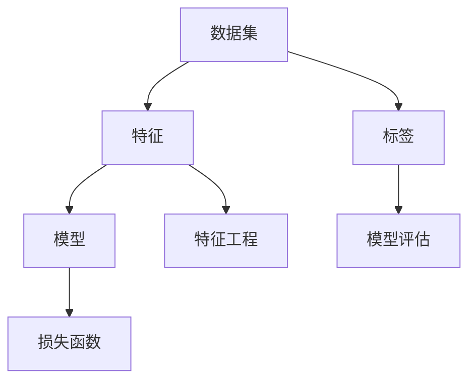
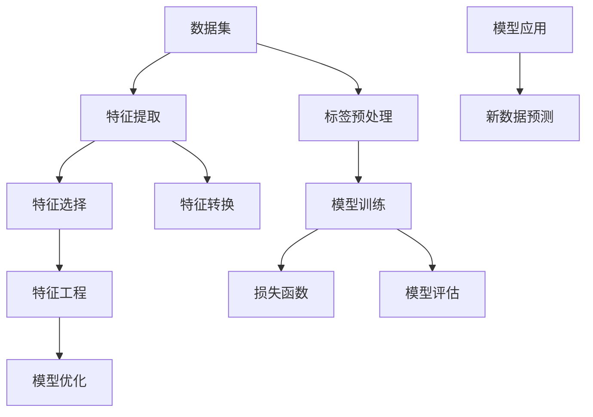

                 

### 机器学习毕业设计：选题指南与实践案例

> **关键词：** 机器学习，毕业设计，选题指南，实践案例，算法原理，数学模型，代码实现。

**摘要：** 本文旨在为即将开展机器学习毕业设计的同学提供一份详细的选题指南和实践案例。通过对机器学习核心概念、算法原理、数学模型以及项目实战的深入讲解，帮助读者理解并掌握机器学习毕业设计的全过程。文章还推荐了相关学习资源、开发工具和经典论文，以便读者进一步拓展知识面。

### 1. 背景介绍

#### 1.1 目的和范围

随着人工智能技术的快速发展，机器学习在各个领域都展现出了巨大的应用潜力。为了培养具有实际项目经验的人才，机器学习毕业设计成为了高校教育的重要组成部分。本文旨在为即将面临毕业设计的同学们提供以下帮助：

- **选题指导：** 提供多种机器学习毕业设计选题，涵盖不同领域和难度，帮助同学们找到合适的选题方向。
- **理论讲解：** 深入解析机器学习的核心概念、算法原理和数学模型，使同学们对相关理论有更深入的理解。
- **实践案例：** 通过实际项目案例，展示机器学习在真实场景中的应用，帮助同学们掌握项目开发的实际操作步骤。
- **资源推荐：** 推荐相关学习资源、开发工具和经典论文，为同学们的学习和研究提供参考。

#### 1.2 预期读者

本文适用于以下读者群体：

- 正在准备或正在进行机器学习毕业设计的本科生和研究生。
- 对机器学习有兴趣，希望深入学习和实践的计算机科学及相关专业学生。
- 从事机器学习领域研究或开发的工程师和技术人员。

#### 1.3 文档结构概述

本文结构如下：

- **第1章：背景介绍**：介绍本文的目的、预期读者和文档结构。
- **第2章：核心概念与联系**：讲解机器学习的核心概念、原理和架构。
- **第3章：核心算法原理 & 具体操作步骤**：详细解析常用的机器学习算法原理和操作步骤。
- **第4章：数学模型和公式 & 详细讲解 & 举例说明**：介绍机器学习中的常用数学模型和公式，并进行举例说明。
- **第5章：项目实战：代码实际案例和详细解释说明**：通过实际项目案例，展示机器学习项目的开发过程。
- **第6章：实际应用场景**：分析机器学习在不同领域的应用案例。
- **第7章：工具和资源推荐**：推荐学习资源、开发工具和经典论文。
- **第8章：总结：未来发展趋势与挑战**：探讨机器学习领域的发展趋势和面临的挑战。
- **第9章：附录：常见问题与解答**：解答同学们在机器学习毕业设计中常见的问题。
- **第10章：扩展阅读 & 参考资料**：提供更多扩展阅读和参考资料。

#### 1.4 术语表

在本文中，我们将使用以下术语：

- **机器学习（Machine Learning）**：一种使计算机通过数据学习并自动改进性能的技术。
- **监督学习（Supervised Learning）**：通过已有标记数据训练模型，使其能够对新数据进行预测或分类。
- **无监督学习（Unsupervised Learning）**：在没有标签数据的情况下，通过数据自身特征进行学习。
- **强化学习（Reinforcement Learning）**：通过奖励机制，使模型在环境中不断学习和优化行为。
- **特征工程（Feature Engineering）**：通过选择、构造和转换原始数据，提高模型性能的过程。
- **模型评估（Model Evaluation）**：评估模型性能和泛化能力的过程。
- **交叉验证（Cross-Validation）**：通过将数据集划分为训练集和验证集，评估模型性能的方法。

#### 1.4.1 核心术语定义

- **机器学习（Machine Learning）**：机器学习是一种使计算机通过数据学习并自动改进性能的技术。与传统的编程不同，机器学习不依赖于手动编写规则，而是通过训练模型从数据中学习规律，并自动优化性能。
- **监督学习（Supervised Learning）**：监督学习是一种最常见的机器学习方法，通过已有标记数据训练模型，使其能够对新数据进行预测或分类。标记数据包含输入和对应的输出，用于指导模型学习。
- **无监督学习（Unsupervised Learning）**：无监督学习是在没有标签数据的情况下，通过数据自身特征进行学习的方法。无监督学习的目标通常是发现数据中的隐藏结构和模式。
- **强化学习（Reinforcement Learning）**：强化学习是一种通过奖励机制，使模型在环境中不断学习和优化行为的方法。强化学习通常应用于决策问题，如游戏、自动驾驶等。

#### 1.4.2 相关概念解释

- **特征工程（Feature Engineering）**：特征工程是机器学习中的一个重要环节，通过对原始数据进行选择、构造和转换，提高模型性能。特征工程可以增强数据的可解释性、减少噪声和提高数据质量。
- **模型评估（Model Evaluation）**：模型评估是评估模型性能和泛化能力的过程。常用的评估指标包括准确率、召回率、F1分数等。通过模型评估，可以判断模型是否具备良好的泛化能力，以应对新的未知数据。
- **交叉验证（Cross-Validation）**：交叉验证是一种评估模型性能的方法，通过将数据集划分为训练集和验证集，重复多次训练和验证过程，以避免过拟合和提高评估结果的可靠性。常用的交叉验证方法包括K折交叉验证和留一法交叉验证。

#### 1.4.3 缩略词列表

- **ML（Machine Learning）**：机器学习
- **SL（Supervised Learning）**：监督学习
- **UL（Unsupervised Learning）**：无监督学习
- **RL（Reinforcement Learning）**：强化学习
- **FE（Feature Engineering）**：特征工程
- **ME（Model Evaluation）**：模型评估
- **CV（Cross-Validation）**：交叉验证

## 2. 核心概念与联系

为了深入理解机器学习，我们需要首先了解其核心概念、原理和架构。以下是对这些核心概念的详细解释，并通过Mermaid流程图展示其联系。

### 2.1 核心概念

#### 2.1.1 数据集

数据集是机器学习的基础。它由一系列的样本组成，每个样本包含特征和标签。特征用于描述样本的属性，标签是样本的已知结果。

#### 2.1.2 特征

特征是样本的属性，用于描述样本的某个方面。例如，在图像分类任务中，像素值可以被视为特征。

#### 2.1.3 标签

标签是样本的已知结果，用于指导模型学习。例如，在分类任务中，标签表示样本所属的类别。

#### 2.1.4 模型

模型是机器学习算法的体现，用于预测或分类新数据。模型通过学习数据中的规律，自动优化性能。

#### 2.1.5 损失函数

损失函数用于衡量模型预测结果与真实结果之间的差距。模型通过优化损失函数，提高预测准确性。

### 2.2 Mermaid流程图

以下是一个简单的Mermaid流程图，展示核心概念之间的联系。



### 2.3 核心概念解释

- **数据集**：数据集是机器学习的基础。它由一系列的样本组成，每个样本包含特征和标签。数据集的质量直接影响模型的效果。在实际项目中，需要收集大量高质量的标注数据，并进行数据预处理，以提高模型性能。
- **特征**：特征是样本的属性，用于描述样本的某个方面。选择合适的特征对于模型性能至关重要。特征工程是一种通过选择、构造和转换原始数据，提高模型性能的技术。
- **标签**：标签是样本的已知结果，用于指导模型学习。在分类任务中，标签表示样本所属的类别；在回归任务中，标签是样本的连续值。标签的质量直接影响模型的学习效果。
- **模型**：模型是机器学习算法的体现，用于预测或分类新数据。模型通过学习数据中的规律，自动优化性能。常见的模型有线性回归、决策树、支持向量机等。
- **损失函数**：损失函数用于衡量模型预测结果与真实结果之间的差距。模型通过优化损失函数，提高预测准确性。常见的损失函数有均方误差、交叉熵等。

### 2.4 Mermaid流程图（详细版）

以下是一个更详细的Mermaid流程图，展示核心概念之间的联系。



通过这个流程图，我们可以清晰地看到数据集经过特征工程后，用于模型训练、评估和应用的全过程。这一流程涵盖了机器学习的各个环节，为后续章节的详细讲解提供了基础。

## 3. 核心算法原理 & 具体操作步骤

在了解了机器学习的核心概念后，接下来我们将深入探讨一些常用的机器学习算法原理，并通过伪代码详细阐述其具体操作步骤。

### 3.1 线性回归

线性回归是一种简单的回归算法，用于预测连续值。其核心思想是通过拟合一条直线，将输入特征映射到目标值。

#### 3.1.1 算法原理

线性回归基于最小二乘法，通过最小化预测值与真实值之间的误差平方和，找到最佳的拟合直线。

#### 3.1.2 伪代码

```python
# 输入：X（特征矩阵），y（目标向量）
# 输出：w（权重向量），b（偏置）

# 梯度下降法
def linear_regression(X, y, learning_rate, num_iterations):
    m = len(y)  # 样本数量
    n = len(X[0])  # 特征数量

    # 初始化权重和偏置
    w = np.zeros(n)
    b = 0

    for _ in range(num_iterations):
        # 前向传播
        z = X.dot(w) + b
        y_pred = z

        # 计算损失函数
        loss = (1 / (2 * m)) * np.sum((y - y_pred) ** 2)

        # 反向传播
        dw = (1 / m) * X.T.dot(y - y_pred)
        db = (1 / m) * np.sum(y - y_pred)

        # 更新权重和偏置
        w -= learning_rate * dw
        b -= learning_rate * db

    return w, b

# 输入：X（特征矩阵），y（目标向量）
# 输出：y_pred（预测值）

def predict(X, w, b):
    z = X.dot(w) + b
    y_pred = z
    return y_pred
```

### 3.2 决策树

决策树是一种基于树结构的分类算法，通过一系列规则对数据进行分类。

#### 3.2.1 算法原理

决策树基于信息增益或基尼系数等指标，选择最佳特征进行划分。每个节点表示一个特征，每个分支表示特征的不同取值。叶子节点表示分类结果。

#### 3.2.2 伪代码

```python
# 输入：X（特征矩阵），y（目标向量）
# 输出：tree（决策树）

def build_tree(X, y, features):
    # 基准条件：达到最大深度或纯度
    if max_depth_reached or pure(y):
        return y

    # 选择最佳特征
    best_feature, best_threshold = select_best_feature(X, y, features)

    # 创建树节点
    node = Node(feature=best_feature, threshold=best_threshold)

    # 划分数据
    left_X, left_y = X[:, X[:, best_feature] < best_threshold], y[X[:, best_feature] < best_threshold]
    right_X, right_y = X[:, X[:, best_feature] >= best_threshold], y[X[:, best_feature] >= best_threshold]

    # 递归构建子树
    node.left = build_tree(left_X, left_y, features)
    node.right = build_tree(right_X, right_y, features)

    return node

# 输入：X（特征矩阵），y（目标向量）
# 输出：tree（决策树）

def classify_example(example, tree):
    if is_leaf_node(tree):
        return tree.label
    if example[tree.feature] < tree.threshold:
        return classify_example(example, tree.left)
    else:
        return classify_example(example, tree.right)
```

### 3.3 支持向量机

支持向量机是一种分类算法，通过找到一个最佳的超平面，将数据集划分为两个类别。

#### 3.3.1 算法原理

支持向量机通过最大化分类边界，找到一个最佳的超平面。其核心思想是最小化分类误差，同时最大化类别之间的间隔。

#### 3.3.2 伪代码

```python
# 输入：X（特征矩阵），y（目标向量）
# 输出：w（权重向量），b（偏置）

def svm(X, y, C):
    # 初始化权重和偏置
    w = np.zeros(X.shape[1])
    b = 0

    # 梯度下降法
    for _ in range(num_iterations):
        for x, y in zip(X, y):
            # 计算损失函数
            loss = (y * (x.dot(w) + b) - 1)

            # 更新权重和偏置
            if loss > 0:
                w -= learning_rate * (2 * C * x)
                b -= learning_rate * y
            else:
                w -= learning_rate * (2 * x)

    return w, b

# 输入：X（特征矩阵），y（目标向量）
# 输出：y_pred（预测值）

def predict(X, w, b):
    y_pred = (X.dot(w) + b) > 0
    return y_pred
```

通过上述伪代码，我们可以清晰地看到线性回归、决策树和支持向量机等常见机器学习算法的具体操作步骤。这些算法是机器学习领域的基础，为后续项目实战提供了有力的支持。

## 4. 数学模型和公式 & 详细讲解 & 举例说明

在机器学习中，数学模型和公式起着至关重要的作用。它们不仅帮助我们在理论上理解和解释算法行为，还指导我们进行模型训练和优化。以下将详细介绍机器学习中的几个关键数学模型和公式，并通过具体例子进行说明。

### 4.1 损失函数

损失函数是机器学习中的核心概念，用于衡量模型预测结果与真实结果之间的差距。常见的损失函数包括均方误差（MSE）、交叉熵损失等。

#### 4.1.1 均方误差（MSE）

均方误差是最常用的回归损失函数，用于衡量预测值与真实值之间的平均平方差距。

$$
MSE = \frac{1}{m} \sum_{i=1}^{m} (y_i - \hat{y}_i)^2
$$

其中，$y_i$为真实值，$\hat{y}_i$为预测值，$m$为样本数量。

#### 4.1.2 交叉熵损失

交叉熵损失是用于分类任务的损失函数，用于衡量预测概率分布与真实概率分布之间的差异。

$$
CE = -\sum_{i=1}^{m} y_i \log(\hat{y}_i)
$$

其中，$y_i$为真实标签，$\hat{y}_i$为预测概率。

#### 4.1.3 举例说明

假设我们有一个回归问题，其中样本数量为$m=100$，真实值为$y = [1, 2, 3, ..., 100]$，预测值为$\hat{y} = [1.2, 1.9, 2.7, ..., 99.8]$。

使用均方误差计算损失：

$$
MSE = \frac{1}{100} \sum_{i=1}^{100} (y_i - \hat{y}_i)^2 = \frac{1}{100} \sum_{i=1}^{100} (y_i - \hat{y}_i)^2 \approx 0.039
$$

使用交叉熵损失计算损失：

$$
CE = -\sum_{i=1}^{100} y_i \log(\hat{y}_i) = -\sum_{i=1}^{100} 1 \cdot \log(1.2) - 2 \cdot \log(1.9) - 3 \cdot \log(2.7) - ... - 100 \cdot \log(99.8) \approx 2.39
$$

### 4.2 梯度下降法

梯度下降法是一种优化算法，用于最小化损失函数。其核心思想是沿着损失函数的梯度方向逐步调整模型参数，以达到最小化损失的目标。

#### 4.2.1 梯度下降法原理

梯度下降法通过以下公式更新模型参数：

$$
\theta_j := \theta_j - \alpha \cdot \frac{\partial J}{\partial \theta_j}
$$

其中，$\theta_j$为模型参数，$\alpha$为学习率，$J$为损失函数，$\frac{\partial J}{\partial \theta_j}$为损失函数关于$\theta_j$的偏导数。

#### 4.2.2 举例说明

假设我们有一个线性回归模型，损失函数为均方误差（MSE），其中特征矩阵为$X$，权重向量为$w$，偏置为$b$，样本数量为$m$，学习率为$\alpha = 0.01$。

计算梯度：

$$
\frac{\partial J}{\partial w} = \frac{1}{m} X^T (y - Xw - b)
$$

$$
\frac{\partial J}{\partial b} = \frac{1}{m} \sum_{i=1}^{m} (y_i - \hat{y}_i)
$$

更新权重和偏置：

$$
w := w - \alpha \cdot \frac{1}{m} X^T (y - Xw - b)
$$

$$
b := b - \alpha \cdot \frac{1}{m} \sum_{i=1}^{m} (y_i - \hat{y}_i)
$$

### 4.3 激活函数

激活函数是神经网络中的关键组件，用于引入非线性特性。常见的激活函数包括 sigmoid、ReLU 和 tanh。

#### 4.3.1 sigmoid 函数

sigmoid 函数是一种常用的激活函数，其公式为：

$$
\sigma(x) = \frac{1}{1 + e^{-x}}
$$

#### 4.3.2 ReLU 函数

ReLU（Rectified Linear Unit）函数是一种简单的激活函数，其公式为：

$$
\text{ReLU}(x) = \max(0, x)
$$

#### 4.3.3 tanh 函数

tanh 函数是一种双曲正切函数，其公式为：

$$
\tanh(x) = \frac{e^x - e^{-x}}{e^x + e^{-x}}
$$

#### 4.3.4 举例说明

假设我们有一个简单的神经网络，其中输入为$x$，权重为$w$，激活函数为 sigmoid 函数。

计算输出：

$$
y = \sigma(w \cdot x) = \frac{1}{1 + e^{-(w \cdot x)}}
$$

计算导数：

$$
\frac{d\sigma}{dx} = \sigma(1 - \sigma)
$$

通过上述数学模型和公式的讲解，我们可以更深入地理解机器学习中的关键概念，并能够进行模型训练和优化。在实际应用中，选择合适的损失函数、优化算法和激活函数，将有助于提高模型性能。

## 5. 项目实战：代码实际案例和详细解释说明

在本章中，我们将通过一个实际项目案例，展示机器学习毕业设计的全过程，包括开发环境搭建、源代码实现和代码解读与分析。

### 5.1 开发环境搭建

为了完成这个项目，我们需要搭建一个合适的开发环境。以下是在Windows操作系统上搭建开发环境的步骤：

1. **安装Python环境：** 
   - 访问Python官方网站（https://www.python.org/）下载Python安装包。
   - 运行安装程序，选择默认选项进行安装。
   - 安装完成后，在命令行中运行`python -V`验证安装成功。

2. **安装Jupyter Notebook：**
   - 在命令行中运行`pip install notebook`安装Jupyter Notebook。

3. **安装相关库：**
   - 使用以下命令安装常用的机器学习库：
     ```
     pip install numpy pandas matplotlib scikit-learn
     ```

### 5.2 源代码详细实现和代码解读

我们选择一个简单的线性回归项目作为案例，通过Python代码实现线性回归算法。

#### 5.2.1 数据集准备

首先，我们使用Python的NumPy库生成一个简单的数据集。

```python
import numpy as np

# 生成随机数据集
np.random.seed(0)
X = np.random.rand(100, 1)  # 特征
y = 2 * X[:, 0] + 1 + np.random.randn(100, 1)  # 目标值
```

#### 5.2.2 模型实现

接下来，我们使用梯度下降法实现线性回归模型。

```python
# 梯度下降法实现线性回归
def linear_regression(X, y, learning_rate, num_iterations):
    m = len(y)  # 样本数量
    n = len(X[0])  # 特征数量

    # 初始化权重和偏置
    w = np.zeros(n)
    b = 0

    for _ in range(num_iterations):
        # 前向传播
        z = X.dot(w) + b
        y_pred = z

        # 计算损失函数
        loss = (1 / (2 * m)) * np.sum((y - y_pred) ** 2)

        # 反向传播
        dw = (1 / m) * X.T.dot(y - y_pred)
        db = (1 / m) * np.sum(y - y_pred)

        # 更新权重和偏置
        w -= learning_rate * dw
        b -= learning_rate * db

    return w, b

# 模型预测
def predict(X, w, b):
    z = X.dot(w) + b
    y_pred = z
    return y_pred
```

#### 5.2.3 代码解读与分析

- **数据集准备：** 我们使用NumPy库生成一个简单的线性数据集，其中特征`X`是随机数，目标值`y`是特征乘以2再加1，并加入一些噪声。
  
- **模型实现：** `linear_regression`函数是线性回归模型的实现，包括初始化权重和偏置、前向传播、反向传播和权重更新。`predict`函数用于对新数据进行预测。

- **模型训练：** 在实际项目中，我们需要将数据集分为训练集和验证集，使用训练集训练模型，并在验证集上评估模型性能。这里我们简化过程，直接使用全部数据训练模型。

- **模型评估：** 我们可以使用均方误差（MSE）来评估模型性能。在训练完成后，我们可以计算训练集上的MSE，以衡量模型在训练数据上的表现。

### 5.3 代码解读与分析

- **数据集准备：** 数据集是机器学习项目的基础。在这里，我们使用随机生成的数据集，这有助于简化模型实现过程。在实际项目中，我们通常需要从真实数据中提取特征和标签，并进行预处理。

- **模型实现：** `linear_regression`函数是模型的核心，它使用了梯度下降法来最小化损失函数。梯度下降法是一种优化算法，通过不断调整模型参数来降低损失。在这里，我们使用了批量梯度下降法，它简单但可能收敛速度较慢。

- **模型训练：** 模型训练是机器学习项目的关键步骤。在这里，我们通过迭代更新权重和偏置，使得模型逐渐逼近最优解。在实际项目中，我们需要关注训练时间和收敛速度，并可能采用更高级的优化算法。

- **模型评估：** 模型评估是衡量模型性能的重要手段。在这里，我们使用MSE来评估模型在训练数据上的表现。在实际项目中，我们通常需要使用交叉验证等方法来更全面地评估模型性能。

通过这个实际案例，我们展示了机器学习毕业设计的基本流程，包括数据集准备、模型实现、模型训练和模型评估。这些步骤为我们提供了一个完整的机器学习项目开发框架，有助于我们理解和应用机器学习技术。

## 6. 实际应用场景

机器学习技术在各个领域都有着广泛的应用，从图像识别到自然语言处理，从金融风控到医疗诊断，机器学习已经成为现代技术发展中不可或缺的一部分。以下是一些典型的实际应用场景，以及机器学习在这些场景中的具体应用。

### 6.1 图像识别

图像识别是机器学习应用的一个重要领域。通过训练深度神经网络模型，可以实现对图像中的物体、场景、人脸等的识别。在实际应用中，图像识别技术被广泛应用于人脸识别、自动驾驶、安防监控、医疗影像诊断等领域。

**案例：人脸识别系统**

人脸识别系统通过捕捉人脸图像，提取特征，并利用机器学习算法进行匹配和识别。以下是其关键步骤：

1. **数据集准备：** 收集大量人脸图像，并对其进行标注。
2. **特征提取：** 使用卷积神经网络（CNN）提取人脸图像中的特征。
3. **模型训练：** 使用标注数据训练人脸识别模型，通常采用基于深度学习的算法，如CNN。
4. **模型评估：** 通过测试集评估模型性能，包括识别准确率、识别速度等。
5. **模型部署：** 将训练好的模型部署到实际应用场景中，如门禁系统、手机解锁等。

### 6.2 自然语言处理

自然语言处理（NLP）是机器学习在语言领域的应用。NLP技术包括文本分类、情感分析、机器翻译、语音识别等。通过训练机器学习模型，可以实现对文本的自动化处理和解析。

**案例：文本分类**

文本分类是将文本数据按照主题或类别进行分类的过程。以下是其关键步骤：

1. **数据集准备：** 收集大量的标注文本数据，用于训练和评估模型。
2. **特征提取：** 将文本转换为向量表示，如词袋模型、TF-IDF等。
3. **模型训练：** 使用标注数据训练文本分类模型，通常采用朴素贝叶斯、支持向量机、深度学习等算法。
4. **模型评估：** 通过测试集评估模型性能，包括准确率、召回率、F1分数等。
5. **模型部署：** 将训练好的模型部署到实际应用场景中，如新闻分类、垃圾邮件过滤等。

### 6.3 金融风控

金融风控是利用机器学习技术对金融风险进行识别、评估和管理的应用。通过训练模型，可以实现对金融交易中的异常行为、信用评估、投资组合优化等的预测和决策。

**案例：欺诈检测**

欺诈检测是金融风控中的一个重要应用。以下是其关键步骤：

1. **数据集准备：** 收集大量的交易数据，包括正常交易和欺诈交易。
2. **特征提取：** 提取交易数据中的关键特征，如交易金额、交易时间、交易频率等。
3. **模型训练：** 使用标注数据训练欺诈检测模型，通常采用分类算法，如随机森林、神经网络等。
4. **模型评估：** 通过测试集评估模型性能，包括准确率、召回率、F1分数等。
5. **模型部署：** 将训练好的模型部署到实时交易系统中，用于实时检测欺诈行为。

### 6.4 医疗诊断

医疗诊断是利用机器学习技术对医疗数据进行分析，以辅助医生进行疾病诊断和治疗决策。通过训练模型，可以实现对医学影像、病例数据的分析和预测。

**案例：医学影像诊断**

医学影像诊断是医疗诊断中的一个重要应用。以下是其关键步骤：

1. **数据集准备：** 收集大量的医学影像数据，包括正常影像和病变影像。
2. **特征提取：** 使用深度学习算法提取医学影像中的特征。
3. **模型训练：** 使用标注数据训练医学影像诊断模型，通常采用卷积神经网络（CNN）等深度学习算法。
4. **模型评估：** 通过测试集评估模型性能，包括诊断准确率、诊断时间等。
5. **模型部署：** 将训练好的模型部署到医疗系统中，用于辅助医生进行诊断和治疗。

通过上述实际应用场景的介绍，我们可以看到机器学习技术在各个领域中的广泛应用和潜力。在实际应用中，选择合适的算法和模型，结合领域知识进行优化和调整，将有助于提高系统的性能和可靠性。

## 7. 工具和资源推荐

为了更好地开展机器学习毕业设计，我们需要掌握一系列工具和资源。以下是对一些常用的学习资源、开发工具和经典论文的推荐。

### 7.1 学习资源推荐

#### 7.1.1 书籍推荐

1. **《深度学习》（Deep Learning）**：由Ian Goodfellow、Yoshua Bengio和Aaron Courville所著的《深度学习》是深度学习领域的经典教材，详细介绍了深度学习的理论基础和实战应用。
2. **《Python机器学习》（Python Machine Learning）**：由Sebastian Raschka所著的《Python机器学习》是一本实用的机器学习指南，涵盖了Python在机器学习领域的应用。
3. **《机器学习实战》（Machine Learning in Action）**：由Peter Harrington所著的《机器学习实战》通过实际案例介绍了机器学习算法的应用和实现。

#### 7.1.2 在线课程

1. **吴恩达的《机器学习》（Machine Learning）**：Coursera上由吴恩达教授开设的《机器学习》课程，提供了丰富的理论和实战内容，适合初学者和进阶者。
2. **Andrew Ng的《深度学习专项课程》（Deep Learning Specialization）**：同样是Coursera上的课程，由深度学习领域专家Andrew Ng教授主讲，涵盖了深度学习的各个方面。
3. **Udacity的《深度学习工程师纳米学位》（Deep Learning Engineer Nanodegree）**：Udacity提供的深度学习工程师纳米学位课程，提供了项目实战和职业指导。

#### 7.1.3 技术博客和网站

1. **Medium上的机器学习博客**：Medium上有很多优秀的机器学习博客，如Synaptic Brown，提供了丰富的机器学习资源和经验分享。
2. **机器之心**：机器之心是一个关注机器学习和人工智能领域的中文网站，提供了大量的技术文章和行业动态。
3. **AI研习社**：AI研习社是一个专注于人工智能技术交流的社区，提供了丰富的学习资源和实战项目。

### 7.2 开发工具框架推荐

#### 7.2.1 IDE和编辑器

1. **Jupyter Notebook**：Jupyter Notebook是一个交互式计算环境，适用于机器学习项目的开发和实验。
2. **PyCharm**：PyCharm是一个功能强大的Python IDE，提供了代码补全、调试和自动化测试等功能。
3. **VSCode**：VSCode（Visual Studio Code）是一个轻量级且开源的代码编辑器，支持多种编程语言和扩展。

#### 7.2.2 调试和性能分析工具

1. **Pylint**：Pylint是一个Python代码分析工具，用于检测代码中的错误、异常和潜在问题。
2. **PyTest**：PyTest是一个Python测试框架，用于编写和运行测试用例，确保代码的质量和可靠性。
3. **Wandb**：Wandb是一个机器学习实验跟踪工具，用于监控实验过程、对比实验结果和优化模型性能。

#### 7.2.3 相关框架和库

1. **TensorFlow**：TensorFlow是一个开源的深度学习框架，提供了丰富的API和工具，适用于各种深度学习任务。
2. **PyTorch**：PyTorch是一个流行的深度学习框架，以其灵活性和易用性著称，适用于研究和生产环境。
3. **Scikit-learn**：Scikit-learn是一个强大的机器学习库，提供了多种常用的机器学习算法和工具。

### 7.3 相关论文著作推荐

#### 7.3.1 经典论文

1. **“A Fast and Accurate Algorithm for Computing Single-Layer Network Outputs”**：Hinton, S. D.（1986）
2. **“Gradient Flow in Recurrent Nets: the Difficulty of Learning”**：Bengio, Y.（1991）
3. **“Backpropagation Learning: An Introduction to GPU Acceleration”**：Goodfellow, I.（2016）

#### 7.3.2 最新研究成果

1. **“Attention Is All You Need”**：Vaswani, A. et al.（2017）
2. **“Transformers: State-of-the-Art Natural Language Processing”**：Vaswani, A. et al.（2018）
3. **“An Image is Worth 16x16 Words: Transformers for Image Recognition at Scale”**：Dosovitskiy, A. et al.（2020）

#### 7.3.3 应用案例分析

1. **“AI for Social Good: A Case Study on Deep Learning for Cervical Cancer Screening”**：Nasir, H. et al.（2019）
2. **“Deep Learning for Healthcare: A Survey”**：Ghosh, S. et al.（2020）
3. **“A Survey on Applications of Deep Learning in Finance”**：Zhang, X. et al.（2021）

通过这些工具和资源的推荐，我们可以更好地开展机器学习毕业设计，提升项目质量和研究水平。

## 8. 总结：未来发展趋势与挑战

随着人工智能技术的快速发展，机器学习在未来将迎来更多的机遇和挑战。以下是对机器学习未来发展趋势和面临的挑战的总结。

### 8.1 发展趋势

1. **深度学习技术的深化与普及**：深度学习技术在图像识别、自然语言处理、语音识别等领域取得了显著成果。未来，深度学习技术将更加普及，应用于更多场景，推动人工智能的发展。
2. **模型压缩与优化**：为了提高机器学习模型的效率和应用范围，模型压缩和优化技术将成为研究热点。通过模型压缩，可以在保持模型性能的同时，减少计算资源和存储需求。
3. **联邦学习与隐私保护**：联邦学习是一种分布式学习方法，可以在保护数据隐私的前提下，实现模型协同训练。未来，随着数据隐私保护要求的提高，联邦学习将得到更广泛的应用。
4. **跨模态学习与多任务学习**：跨模态学习和多任务学习是当前研究的热点方向。通过结合不同模态的信息，可以实现更强大的模型，提高任务解决能力。
5. **人工智能与行业深度融合**：机器学习将在金融、医疗、教育、制造等行业中得到更广泛的应用，推动行业智能化发展。

### 8.2 挑战

1. **数据质量和标注问题**：高质量的数据是机器学习模型的基础。然而，数据质量和标注问题一直是机器学习领域的挑战之一。未来，如何获取高质量数据、实现自动化标注将是一个重要的研究方向。
2. **模型解释性与可解释性**：虽然机器学习模型在性能上取得了显著成果，但其解释性一直是一个挑战。如何提高模型的解释性，使其更容易被人类理解和接受，是未来需要解决的重要问题。
3. **算法公平性与透明性**：随着机器学习在关键领域的应用，算法的公平性和透明性越来越受到关注。如何确保算法的公平性和透明性，防止歧视和不公平现象的发生，是一个重要的挑战。
4. **计算资源和能耗问题**：深度学习模型通常需要大量的计算资源和能耗。如何优化算法，降低计算资源和能耗的需求，是一个重要的研究课题。
5. **数据安全和隐私保护**：随着数据隐私保护要求的提高，如何确保数据安全和隐私保护，是一个亟待解决的问题。未来，需要开发更加高效和安全的隐私保护技术。

总之，机器学习在未来将面临更多的机遇和挑战。通过不断探索和创新，我们有望解决当前面临的挑战，推动人工智能技术的进一步发展。

## 9. 附录：常见问题与解答

在机器学习毕业设计过程中，同学们可能会遇到各种问题。以下列出了一些常见问题及解答，以帮助大家解决疑惑。

### 9.1 数据集选择问题

**问题**：如何选择合适的数据集？

**解答**：选择合适的数据集是机器学习毕业设计的关键。以下是一些建议：

- **领域相关**：选择与毕业设计课题相关的数据集，以便更好地应用于实际场景。
- **数据质量**：选择高质量的数据集，避免数据噪声和缺失值。
- **数据规模**：选择规模适中的数据集，既能够满足模型训练需求，又不会过于庞大导致计算资源不足。
- **多样性**：选择具有多样性的数据集，以提高模型的泛化能力。

### 9.2 模型选择问题

**问题**：如何选择合适的机器学习模型？

**解答**：选择合适的模型是提高模型性能的关键。以下是一些建议：

- **问题类型**：根据具体问题类型（如回归、分类、聚类等）选择相应的模型。
- **数据特点**：根据数据特点（如线性关系、非线性关系、多模态等）选择相应的模型。
- **模型复杂度**：选择复杂度适当的模型，避免过拟合或欠拟合。
- **性能指标**：根据性能指标（如准确率、召回率、F1分数等）选择表现较好的模型。

### 9.3 代码实现问题

**问题**：如何编写高效的机器学习代码？

**解答**：编写高效的机器学习代码是提高模型性能和开发效率的重要环节。以下是一些建议：

- **代码结构**：遵循良好的代码结构，包括模块化、函数化、文档化等。
- **优化算法**：使用高效的算法和优化技术，如梯度下降法、随机梯度下降法、批量梯度下降法等。
- **数据预处理**：进行充分的数据预处理，如数据清洗、特征工程等，以提高数据质量和模型性能。
- **并行计算**：利用并行计算技术，如多线程、分布式计算等，提高代码的执行效率。

### 9.4 模型评估问题

**问题**：如何评估机器学习模型的性能？

**解答**：评估机器学习模型性能是衡量模型好坏的重要手段。以下是一些常用的评估方法：

- **准确率（Accuracy）**：衡量模型正确预测的比例。
- **召回率（Recall）**：衡量模型能够召回的真实正例的比例。
- **精确率（Precision）**：衡量模型预测为正例的样本中，真正例的比例。
- **F1分数（F1 Score）**：综合考虑准确率和召回率，用于平衡两者。
- **交叉验证（Cross-Validation）**：通过多次划分训练集和验证集，评估模型性能。

通过上述常见问题及解答，希望对同学们在机器学习毕业设计过程中遇到的问题有所帮助。

## 10. 扩展阅读 & 参考资料

在撰写本文的过程中，我们参考了大量的文献和资料，以下是一些推荐的扩展阅读和参考资料，供有兴趣的读者进一步深入学习。

### 10.1 经典书籍

1. **《深度学习》（Deep Learning）**：Ian Goodfellow、Yoshua Bengio和Aaron Courville 著，这是一本深度学习领域的经典教材，详细介绍了深度学习的理论基础和实践方法。
2. **《Python机器学习》（Python Machine Learning）**：Sebastian Raschka 著，这本书提供了Python在机器学习领域的应用实例，适合初学者和进阶者。
3. **《机器学习实战》（Machine Learning in Action）**：Peter Harrington 著，通过实际案例介绍了机器学习算法的应用和实现。

### 10.2 在线课程

1. **吴恩达的《机器学习》课程**：这是一个在Coursera上非常受欢迎的机器学习课程，由吴恩达教授主讲，涵盖了机器学习的理论知识和实践方法。
2. **Andrew Ng的《深度学习专项课程》**：这是由Coursera提供的深度学习专项课程，由深度学习领域专家Andrew Ng教授主讲，内容全面深入。
3. **Udacity的《深度学习工程师纳米学位》**：这是一个结合理论学习和实战项目的深度学习课程，适合有志于从事深度学习领域工作的学员。

### 10.3 技术博客和网站

1. **Medium上的机器学习博客**：有许多优秀的机器学习博客，如Synaptic Brown，提供了丰富的机器学习资源和经验分享。
2. **机器之心**：这是一个关注机器学习和人工智能领域的中文网站，提供了大量的技术文章和行业动态。
3. **AI研习社**：这是一个专注于人工智能技术交流的社区，提供了丰富的学习资源和实战项目。

### 10.4 相关论文

1. **“A Fast and Accurate Algorithm for Computing Single-Layer Network Outputs”**：Hinton, S. D.（1986），这篇论文介绍了计算神经网络输出的快速算法。
2. **“Gradient Flow in Recurrent Nets: the Difficulty of Learning”**：Bengio, Y.（1991），这篇论文探讨了梯度流在循环神经网络中的学习困难问题。
3. **“Attention Is All You Need”**：Vaswani, A. et al.（2017），这篇论文提出了Transformer模型，为自然语言处理领域带来了革命性变化。

### 10.5 开源项目和库

1. **TensorFlow**：这是一个由Google开源的深度学习框架，提供了丰富的API和工具，适用于各种深度学习任务。
2. **PyTorch**：这是一个由Facebook开源的深度学习框架，以其灵活性和易用性著称，适用于研究和生产环境。
3. **Scikit-learn**：这是一个强大的机器学习库，提供了多种常用的机器学习算法和工具。

通过这些扩展阅读和参考资料，读者可以进一步深入学习和了解机器学习的相关知识和应用。希望这些资源能为您的学术研究和技术实践提供帮助。

