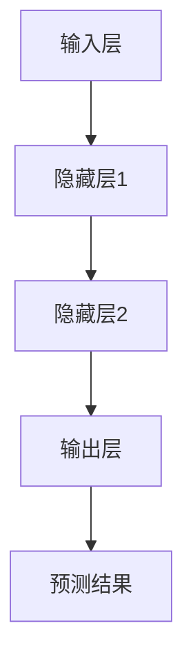
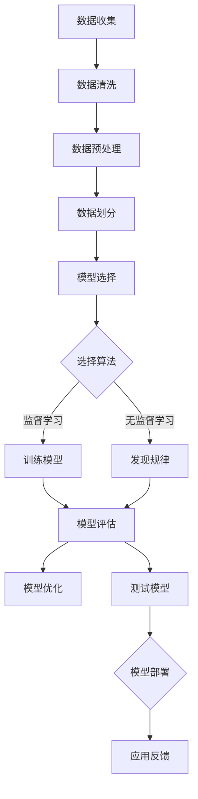

                 

# 机器学习毕业设计：选题案例与实践指南

> 关键词：机器学习，毕业设计，选题案例，实践指南，算法原理，数学模型，代码实战，应用场景

> 摘要：本文旨在为即将进行机器学习毕业设计的同学提供一整套选题、分析和实现的指南。文章从背景介绍、核心概念、算法原理、数学模型、项目实战、实际应用场景等多个方面，详细阐述了如何选择合适的机器学习课题，进行深入的学术研究和实际应用开发。

## 1. 背景介绍

### 1.1 目的和范围

本文的目的在于帮助研究生和本科生在机器学习毕业设计中找到合适的选题，并通过详细的分析和实施步骤，实现一个具有学术价值和实际应用潜力的项目。文章将涵盖以下几个方面：

- 机器学习毕业设计的重要性及挑战
- 如何选择一个合适的机器学习课题
- 机器学习算法的核心概念和原理
- 数学模型在机器学习中的应用
- 代码实现和实战技巧
- 实际应用场景中的案例分析

### 1.2 预期读者

本文主要面向以下读者群体：

- 正在准备机器学习毕业设计的研究生和本科生
- 想要深入了解机器学习应用实践的工程师和学者
- 对机器学习算法和数学模型有兴趣的学术研究者

### 1.3 文档结构概述

本文的结构如下：

- 第1章：背景介绍
  - 1.1 目的和范围
  - 1.2 预期读者
  - 1.3 文档结构概述
  - 1.4 术语表
- 第2章：核心概念与联系
  - 2.1 机器学习基本概念
  - 2.2 机器学习模型架构
  - 2.3 Mermaid 流程图展示
- 第3章：核心算法原理 & 具体操作步骤
  - 3.1 算法原理讲解
  - 3.2 具体操作步骤
  - 3.3 伪代码展示
- 第4章：数学模型和公式 & 详细讲解 & 举例说明
  - 4.1 数学模型介绍
  - 4.2 公式详细讲解
  - 4.3 举例说明
- 第5章：项目实战：代码实际案例和详细解释说明
  - 5.1 开发环境搭建
  - 5.2 源代码详细实现
  - 5.3 代码解读与分析
- 第6章：实际应用场景
  - 6.1 场景一：自然语言处理
  - 6.2 场景二：计算机视觉
  - 6.3 场景三：推荐系统
- 第7章：工具和资源推荐
  - 7.1 学习资源推荐
  - 7.2 开发工具框架推荐
  - 7.3 相关论文著作推荐
- 第8章：总结：未来发展趋势与挑战
- 第9章：附录：常见问题与解答
- 第10章：扩展阅读 & 参考资料

### 1.4 术语表

#### 1.4.1 核心术语定义

- 机器学习：一种人工智能领域的研究方法，通过训练模型从数据中自动学习规律，用于预测和决策。
- 毕业设计：指学生在完成学业前，进行的一项综合性、实践性的学术研究任务。
- 算法：解决特定问题的步骤和方法，通常用伪代码或程序代码表示。
- 数学模型：用于描述现实问题的数学公式和方程式，为算法的实现提供理论基础。

#### 1.4.2 相关概念解释

- 监督学习：一种机器学习方法，通过已标记的数据来训练模型，然后使用模型进行预测。
- 无监督学习：一种机器学习方法，通过未标记的数据来发现数据中的规律。
- 深度学习：一种机器学习模型，通过多层神经网络来学习数据中的复杂特征。

#### 1.4.3 缩略词列表

- ML：Machine Learning（机器学习）
- GD：Gradient Descent（梯度下降）
- CNN：Convolutional Neural Network（卷积神经网络）
- RNN：Recurrent Neural Network（循环神经网络）
- NLP：Natural Language Processing（自然语言处理）

## 2. 核心概念与联系

### 2.1 机器学习基本概念

机器学习作为人工智能的核心技术之一，其基本概念包括：

- **模型（Model）**：机器学习模型是用于预测或决策的数学函数或算法。例如，线性回归模型、决策树、神经网络等。
- **特征（Feature）**：特征是数据集中的每个维度，用于表示输入数据的不同属性。
- **样本（Sample）**：样本是数据集中的一条记录，代表一个具体的输入和输出对。
- **训练（Training）**：训练是指通过已标记的数据集来调整模型参数，使其能够准确地预测未知数据。
- **测试（Testing）**：测试是指使用未标记的数据集来评估模型的性能。

### 2.2 机器学习模型架构

机器学习模型通常由以下几个关键部分组成：

- **输入层（Input Layer）**：接收输入数据的层。
- **隐藏层（Hidden Layer）**：对输入数据进行处理和提取特征的层。
- **输出层（Output Layer）**：产生预测结果的层。
- **激活函数（Activation Function）**：用于引入非线性变换，使模型能够学习复杂的模式。

以下是一个简单的Mermaid流程图，展示了一个典型的机器学习模型的架构：



### 2.3 Mermaid 流程图展示

以下是一个使用Mermaid语言绘制的机器学习项目流程图，展示了从数据收集、预处理、模型训练到测试和优化的整个过程：



## 3. 核心算法原理 & 具体操作步骤

### 3.1 算法原理讲解

在本节中，我们将介绍几种常见的机器学习算法原理，包括线性回归、决策树和神经网络。

#### 线性回归

线性回归是一种用于预测连续值的简单监督学习算法。其基本原理是通过找到一组线性方程来拟合数据点，使得模型预测的值与实际值之间的误差最小。

- **损失函数（Loss Function）**：用于衡量模型预测值与实际值之间的差异。常见的损失函数有均方误差（MSE）和均方根误差（RMSE）。
- **梯度下降（Gradient Descent）**：一种用于优化模型参数的算法。通过不断迭代更新参数，使得损失函数的值逐渐减小。

#### 决策树

决策树是一种基于树形结构进行决策的算法。每个内部节点代表一个特征，每个分支代表一个特征的不同取值，叶节点代表预测结果。

- **划分标准（Splitting Criterion）**：用于决定如何在数据集上划分特征。常见的划分标准有信息增益（IG）、基尼不纯度（Gini Impurity）和熵（Entropy）。
- **剪枝（Pruning）**：为了避免过拟合，可以通过剪枝来减少决策树的复杂度。

#### 神经网络

神经网络是一种模仿生物神经系统的计算模型。它通过多层神经元的非线性变换来学习数据中的复杂特征。

- **激活函数（Activation Function）**：用于引入非线性变换，常见的有ReLU、Sigmoid和Tanh。
- **反向传播（Backpropagation）**：一种用于训练神经网络的算法。通过反向传播误差信号来更新网络权重和偏置。

### 3.2 具体操作步骤

以下是一个简单的线性回归算法的具体操作步骤：

1. **数据收集**：收集包含输入特征和标签的数据集。
2. **数据预处理**：对数据进行归一化或标准化处理。
3. **模型初始化**：初始化模型参数（权重和偏置）。
4. **前向传播**：计算输入数据的特征映射和预测值。
5. **损失计算**：计算预测值与实际值之间的损失。
6. **反向传播**：通过反向传播算法更新模型参数。
7. **迭代训练**：重复步骤4到6，直到满足停止条件（如达到预设的迭代次数或损失值）。
8. **模型评估**：使用测试集评估模型性能。

### 3.3 伪代码展示

以下是线性回归算法的伪代码：

```python
# 线性回归伪代码
def linear_regression(data, num_iterations):
    # 初始化模型参数
    weights = initialize_weights(data)
    biases = initialize_biases(data)
    
    # 迭代训练
    for i in range(num_iterations):
        # 前向传播
        predictions = forward_propagation(data, weights, biases)
        
        # 损失计算
        loss = compute_loss(predictions, data.labels)
        
        # 反向传播
        d_weights, d_biases = backward_propagation(data, predictions)
        
        # 更新模型参数
        weights -= learning_rate * d_weights
        biases -= learning_rate * d_biases
    
    return weights, biases

def forward_propagation(data, weights, biases):
    # 计算特征映射和预测值
    feature_mapping = data.features * weights + biases
    predictions = activation_function(feature_mapping)
    
    return predictions

def compute_loss(predictions, labels):
    # 计算损失
    loss = 0.5 * sum((predictions - labels) ** 2)
    
    return loss

def backward_propagation(data, predictions):
    # 计算梯度
    d_predictions = predictions - data.labels
    d_feature_mapping = d_predictions * activation_derivative(predictions)
    d_weights = data.features.T * d_feature_mapping
    d_biases = d_feature_mapping
    
    return d_weights, d_biases

def activation_function(x):
    # 计算激活函数
    return 1 / (1 + exp(-x))

def activation_derivative(x):
    # 计算激活函数的导数
    return x * (1 - x)
```

## 4. 数学模型和公式 & 详细讲解 & 举例说明

### 4.1 数学模型介绍

在机器学习中，数学模型是构建算法和分析数据的基础。以下介绍几种常见的数学模型及其在机器学习中的应用：

- **线性回归模型**：用于预测连续值的线性模型。
- **逻辑回归模型**：用于预测二元分类结果的线性模型。
- **支持向量机（SVM）**：用于分类和回归的线性模型。
- **神经网络模型**：用于学习复杂非线性关系的多层模型。

### 4.2 公式详细讲解

以下是每种数学模型的公式及其详细解释：

#### 线性回归模型

线性回归模型的最小二乘法公式如下：

$$
y = \beta_0 + \beta_1 \cdot x
$$

其中，$y$ 是因变量，$x$ 是自变量，$\beta_0$ 和 $\beta_1$ 是模型参数。

损失函数（均方误差MSE）为：

$$
J(\theta) = \frac{1}{2m} \sum_{i=1}^{m} (h_\theta(x^{(i)}) - y^{(i)})^2
$$

其中，$m$ 是样本数量，$h_\theta(x)$ 是模型预测值。

梯度下降更新公式为：

$$
\theta_j := \theta_j - \alpha \cdot \frac{\partial J(\theta)}{\partial \theta_j}
$$

其中，$\alpha$ 是学习率，$\theta_j$ 是模型参数。

#### 逻辑回归模型

逻辑回归模型用于二元分类，其公式如下：

$$
\sigma(z) = \frac{1}{1 + e^{-z}}
$$

其中，$\sigma$ 是 sigmoid 函数，$z = \beta_0 + \beta_1 \cdot x$ 是线性组合。

损失函数（交叉熵损失）为：

$$
J(\theta) = -\frac{1}{m} \sum_{i=1}^{m} [y^{(i)} \cdot \log(h_\theta(x^{(i)})) + (1 - y^{(i)}) \cdot \log(1 - h_\theta(x^{(i)}))]
$$

其中，$h_\theta(x)$ 是模型预测概率。

梯度下降更新公式为：

$$
\theta_j := \theta_j - \alpha \cdot \frac{\partial J(\theta)}{\partial \theta_j}
$$

#### 支持向量机（SVM）

SVM的最优分隔超平面公式为：

$$
w^* = arg\min_{w,b} \frac{1}{2} ||w||^2 \\
s.t. \quad y^{(i)} (w^T x^{(i)} + b) \geq 1
$$

其中，$w$ 和 $b$ 是模型参数，$x^{(i)}$ 是特征向量，$y^{(i)}$ 是标签。

#### 神经网络模型

多层神经网络模型的前向传播和反向传播公式如下：

**前向传播：**

$$
z^{[l]} = \sum_{j=1}^{n_{l-1}} w^{[l]}_{ji} a^{[l-1]}_j + b^{[l]}_i \\
a^{[l]}_i = \sigma(z^{[l]})
$$

其中，$z^{[l]}$ 是第 $l$ 层的线性组合，$a^{[l]}$ 是第 $l$ 层的激活值，$\sigma$ 是激活函数。

**反向传播：**

$$
\delta^{[l]}_i = \frac{\partial C}{\partial z^{[l]}_i} \cdot \sigma'(z^{[l]}) \\
\delta^{[l-1]} = \frac{\partial L}{\partial a^{[l-1]}}
$$

其中，$\delta^{[l]}$ 是第 $l$ 层的误差传播，$\sigma'$ 是激活函数的导数。

### 4.3 举例说明

以下通过一个简单的例子，演示线性回归模型的公式应用。

**例子：预测房屋价格**

假设我们有一组房屋特征（面积、卧室数量、建造年份）和对应的房屋价格。我们想建立一个线性回归模型来预测新房屋的价格。

**数据集：**

| 面积 | 卧室数量 | 建造年份 | 价格 |
| --- | --- | --- | --- |
| 1200 | 3 | 2008 | 250000 |
| 1500 | 4 | 2010 | 300000 |
| 1800 | 4 | 2012 | 350000 |

**模型公式：**

$$
\hat{y} = \beta_0 + \beta_1 \cdot \text{面积} + \beta_2 \cdot \text{卧室数量} + \beta_3 \cdot \text{建造年份}
$$

**参数初始化：**

$$
\beta_0 = 0, \beta_1 = 0, \beta_2 = 0, \beta_3 = 0
$$

**前向传播：**

$$
z_1 = 0 + \beta_1 \cdot 1200 + \beta_2 \cdot 3 + \beta_3 \cdot 2008 \\
a_1 = \sigma(z_1) = 0 + \beta_1 \cdot 1200 + \beta_2 \cdot 3 + \beta_3 \cdot 2008
$$

**损失计算：**

$$
J(\theta) = \frac{1}{2} \sum_{i=1}^{3} (a_i - y_i)^2
$$

**反向传播：**

$$
\delta_1 = (a_1 - y_1) \cdot \sigma'(z_1)
$$

**参数更新：**

$$
\beta_1 := \beta_1 - \alpha \cdot \frac{\partial J(\theta)}{\partial \beta_1} \\
\beta_2 := \beta_2 - \alpha \cdot \frac{\partial J(\theta)}{\partial \beta_2} \\
\beta_3 := \beta_3 - \alpha \cdot \frac{\partial J(\theta)}{\partial \beta_3}
$$

重复以上步骤，直到模型收敛或达到预设的迭代次数。

## 5. 项目实战：代码实际案例和详细解释说明

### 5.1 开发环境搭建

在进行机器学习毕业设计之前，我们需要搭建一个适合开发、测试和训练的编程环境。以下是在Windows操作系统中搭建Python机器学习开发环境的具体步骤：

1. **安装Python**：从Python官方网站下载最新版本的Python安装包并安装。
2. **安装Anaconda**：下载并安装Anaconda，这是一个集成了Python和各种科学计算库的发行版。
3. **创建虚拟环境**：打开Anaconda命令行工具（anaconda命令提示符），创建一个名为`ml_project`的虚拟环境。
   ```shell
   conda create -n ml_project python=3.8
   ```
4. **激活虚拟环境**：
   ```shell
   conda activate ml_project
   ```
5. **安装必需的库**：在虚拟环境中安装以下必需的Python库：
   ```shell
   conda install numpy scipy matplotlib scikit-learn pandas
   ```

### 5.2 源代码详细实现和代码解读

在本节中，我们将实现一个简单的线性回归模型，用于预测房屋价格。以下是完整的代码实现：

```python
import numpy as np
import pandas as pd
import matplotlib.pyplot as plt
from sklearn.model_selection import train_test_split
from sklearn.preprocessing import StandardScaler

# 5.2.1 数据预处理
def preprocess_data(data):
    # 特征缩放
    scaler = StandardScaler()
    data[['面积', '卧室数量', '建造年份']] = scaler.fit_transform(data[['面积', '卧室数量', '建造年份']])
    return data

# 5.2.2 线性回归模型
class LinearRegression:
    def __init__(self):
        self.weights = None
        self.biases = None
    
    def fit(self, X, y, num_iterations=1000, learning_rate=0.01):
        m, n = X.shape
        self.weights = np.random.randn(n, 1)
        self.biases = np.random.randn(1)
        
        for _ in range(num_iterations):
            predictions = self.predict(X)
            d_weights = (1/m) * (X.T.dot(predictions - y))
            d_biases = (1/m) * (predictions - y)
            
            self.weights -= learning_rate * d_weights
            self.biases -= learning_rate * d_biases
    
    def predict(self, X):
        return X.dot(self.weights) + self.biases

# 5.2.3 代码解读
def main():
    # 加载数据
    data = pd.read_csv('house_prices.csv')
    data = preprocess_data(data)
    
    # 划分训练集和测试集
    X = data[['面积', '卧室数量', '建造年份']].values
    y = data['价格'].values
    X_train, X_test, y_train, y_test = train_test_split(X, y, test_size=0.2, random_state=42)
    
    # 训练模型
    model = LinearRegression()
    model.fit(X_train, y_train)
    
    # 测试模型
    predictions = model.predict(X_test)
    mse = np.mean((predictions - y_test) ** 2)
    print(f"测试集均方误差: {mse}")
    
    # 可视化
    plt.scatter(y_test, predictions)
    plt.xlabel('实际价格')
    plt.ylabel('预测价格')
    plt.title('实际价格 vs 预测价格')
    plt.show()

if __name__ == '__main__':
    main()
```

### 5.3 代码解读与分析

以下是代码的详细解读：

- **数据预处理**：使用 `StandardScaler` 对房屋特征进行缩放，以减少特征之间的尺度差异。
- **线性回归模型**：定义了一个 `LinearRegression` 类，用于实现线性回归算法。模型通过 `fit` 方法训练，通过 `predict` 方法进行预测。
- **代码解读**：在 `main` 函数中，首先加载数据并进行预处理。然后，划分训练集和测试集。接着，使用 `LinearRegression` 类训练模型，并使用测试集评估模型性能。最后，绘制实际价格和预测价格的散点图。
- **性能评估**：使用均方误差（MSE）评估模型在测试集上的性能。MSE 越小，模型性能越好。

### 5.4 实际应用场景

以下是一个实际应用场景：

- **应用场景**：房地产公司想要预测新房屋的销售价格，以便制定合理的销售策略。
- **数据来源**：从房地产市场上收集历史房屋交易数据。
- **模型改进**：可以通过增加特征（如地理位置、房屋类型等）和优化模型参数来提高预测精度。

## 6. 实际应用场景

### 6.1 自然语言处理

自然语言处理（NLP）是机器学习的重要应用领域之一，主要用于处理和生成人类语言。以下是一些常见的NLP应用场景：

- **文本分类**：将文本数据分类到预定义的类别中，如垃圾邮件过滤、情感分析等。
- **命名实体识别（NER）**：识别文本中的特定实体，如人名、地点、组织等。
- **机器翻译**：将一种语言的文本翻译成另一种语言。
- **语音识别**：将语音信号转换为文本。

### 6.2 计算机视觉

计算机视觉是研究如何使计算机“看到”和理解视觉信息的领域。以下是一些常见的计算机视觉应用场景：

- **图像分类**：将图像分类到预定义的类别中，如人脸识别、图像检索等。
- **目标检测**：在图像中检测并定位特定的对象。
- **图像生成**：利用生成对抗网络（GAN）生成新的图像。
- **图像分割**：将图像分割成多个部分，以便进行更精细的处理。

### 6.3 推荐系统

推荐系统是用于预测用户可能感兴趣的项目的系统。以下是一些常见的推荐系统应用场景：

- **商品推荐**：根据用户的浏览和购买历史推荐相关的商品。
- **音乐推荐**：根据用户的听歌历史和偏好推荐新的音乐。
- **电影推荐**：根据用户的观看历史和评分推荐新的电影。
- **新闻推荐**：根据用户的阅读历史和偏好推荐相关的新闻。

## 7. 工具和资源推荐

### 7.1 学习资源推荐

#### 7.1.1 书籍推荐

- **《深度学习》（Ian Goodfellow, Yoshua Bengio, Aaron Courville）**：全面介绍了深度学习的理论基础和实践方法。
- **《Python机器学习》（Sebastian Raschka, Vincent Granville）**：系统地讲解了Python在机器学习领域的应用。
- **《统计学习方法》（李航）**：详细阐述了统计学习的基本理论和方法。

#### 7.1.2 在线课程

- **《机器学习》（吴恩达）**：Coursera上的经典课程，涵盖了机器学习的基础理论和实践方法。
- **《深度学习》（斯坦福大学）**：斯坦福大学开设的深度学习课程，内容深入浅出，适合初学者和进阶者。
- **《Python编程与数据分析》（DataCamp）**：通过实践项目学习Python编程和数据分析。

#### 7.1.3 技术博客和网站

- **ArXiv**：计算机科学和机器学习领域的顶级学术论文数据库。
- **Medium**：许多机器学习专家和技术公司的技术博客，涵盖最新的研究进展和应用实践。
- **GitHub**：许多开源项目和代码示例，可以学习并借鉴其他优秀项目的实现。

### 7.2 开发工具框架推荐

#### 7.2.1 IDE和编辑器

- **Visual Studio Code**：一款轻量级且功能强大的代码编辑器，支持多种编程语言和框架。
- **PyCharm**：一款专业的Python IDE，提供丰富的开发工具和调试功能。

#### 7.2.2 调试和性能分析工具

- **Jupyter Notebook**：一款流行的交互式计算环境，适用于数据分析和机器学习项目。
- **MATLAB**：一款功能强大的科学计算软件，适用于复杂的数值计算和图像处理。

#### 7.2.3 相关框架和库

- **TensorFlow**：谷歌开发的深度学习框架，支持多种神经网络架构和模型训练。
- **PyTorch**：一款流行的深度学习框架，以动态计算图和灵活的接口著称。
- **Scikit-learn**：Python的一个机器学习库，提供了丰富的监督学习和无监督学习算法。

### 7.3 相关论文著作推荐

#### 7.3.1 经典论文

- **"A Learning Algorithm for Continually Running Fully Recurrent Neural Networks"（1990）**：Hinton等人提出的Hessian-Free优化算法。
- **"Learning representations for artifacts"（2015）**：Vinod Nair和Geoffrey Hinton关于卷积神经网络的论文。
- **"Deep Learning"（2016）**：Ian Goodfellow、Yoshua Bengio和Aaron Courville合著的深度学习教材。

#### 7.3.2 最新研究成果

- **"Generative Adversarial Nets"（2014）**：Ian Goodfellow等人提出的生成对抗网络（GAN）。
- **"Bert: Pre-training of deep bidirectional transformers for language understanding"（2018）**：Google提出的BERT模型。
- **"An image is worth 16x16 words: Transformers for image recognition at scale"（2021）**：OpenAI提出的16x16像素图像Transformer模型。

#### 7.3.3 应用案例分析

- **"Google Brain: AutoML"**：Google Brain团队如何利用机器学习自动化优化和选择模型。
- **"Microsoft AI: Healthcare"**：微软在医疗领域如何利用机器学习和人工智能技术。
- **"Tesla: Autonomous Driving"**：特斯拉如何利用深度学习和计算机视觉实现自动驾驶。

## 8. 总结：未来发展趋势与挑战

机器学习作为人工智能的核心技术，正快速发展并在各个领域得到广泛应用。未来，机器学习的发展趋势和面临的挑战包括：

### 8.1 发展趋势

- **算法创新**：新的算法模型和优化方法将继续出现，如变分自编码器（VAE）、生成对抗网络（GAN）和Transformer等。
- **硬件加速**：随着GPU、TPU等硬件的进步，机器学习模型的训练和推理速度将显著提高。
- **跨学科融合**：机器学习与其他领域（如生物学、物理学、社会科学）的结合，将推动新的应用和研究成果。
- **数据隐私和安全**：在保护用户隐私和数据安全的前提下，如何有效地利用数据开展机器学习研究是一个重要课题。

### 8.2 面临的挑战

- **可解释性**：如何提高模型的透明度和可解释性，使其更容易被用户理解和接受。
- **过拟合**：如何避免模型在训练数据上过拟合，提高泛化能力。
- **数据隐私和安全**：如何在保护用户隐私的同时，充分利用数据开展机器学习研究。
- **计算资源**：大规模模型训练和推理需要大量的计算资源，如何高效利用计算资源是一个挑战。

## 9. 附录：常见问题与解答

### 9.1 问题1：如何选择一个合适的机器学习课题？

**解答**：选择机器学习课题时，可以从以下几个方面进行考虑：

- **兴趣和熟悉度**：选择一个自己感兴趣的领域，并且在这个领域有一定的知识储备和经验。
- **数据可用性**：确保有足够的数据支持，包括训练数据和测试数据。
- **研究价值和意义**：选择一个有实际应用价值和社会意义的课题，这样更容易得到导师和同行的认可。
- **可行性**：考虑自己的时间和资源，确保能够在毕业设计的时间范围内完成。

### 9.2 问题2：如何优化机器学习模型的性能？

**解答**：以下是一些常用的方法来优化机器学习模型的性能：

- **数据预处理**：对数据集进行清洗、归一化和特征工程，提高数据的准确性和质量。
- **模型选择**：选择合适的算法和模型架构，根据问题特点和数据特点进行选择。
- **参数调优**：使用交叉验证等方法，对模型的超参数进行调优，找到最优的组合。
- **正则化**：使用正则化技术（如L1、L2正则化）来防止过拟合。
- **集成学习**：使用集成学习方法（如随机森林、梯度提升树）来提高模型的泛化能力。

### 9.3 问题3：如何在机器学习中处理大规模数据集？

**解答**：处理大规模数据集时，可以采用以下方法：

- **分布式计算**：使用分布式计算框架（如Apache Spark、Dask）来并行处理数据。
- **增量学习**：分批次处理数据，每次处理一部分数据，减少内存占用。
- **数据采样**：对数据进行采样，处理一个较小的数据子集，然后对模型进行验证和调整。
- **特征选择**：对特征进行选择，减少特征数量，降低模型的复杂度和计算成本。
- **内存优化**：使用内存优化技术（如数据压缩、内存池化）来减少内存占用。

## 10. 扩展阅读 & 参考资料

为了进一步学习和深入了解机器学习及其应用，以下是一些扩展阅读和参考资料：

### 10.1 书籍推荐

- **《机器学习：概率视角》（David Barber）**：介绍了机器学习的概率理论和模型。
- **《统计学习方法》（李航）**：详细阐述了统计学习的基本理论和方法。
- **《Python数据科学手册》（Jake VanderPlas）**：涵盖了Python在数据科学和机器学习领域的应用。

### 10.2 在线课程

- **《深度学习特化课程》（吴恩达）**：Coursera上的深度学习课程，包括深度学习的基础理论和实践。
- **《自然语言处理特化课程》（丹尼尔·莱昂）**：Coursera上的自然语言处理课程，涵盖了NLP的基础理论和实践。
- **《计算机视觉特化课程》（斯坦福大学）**：Coursera上的计算机视觉课程，介绍了计算机视觉的基本理论和应用。

### 10.3 技术博客和网站

- **Medium（机器学习专栏）**：提供丰富的机器学习技术文章和案例分析。
- **Towards Data Science（数据科学博客）**：涵盖数据科学和机器学习的最新研究成果和应用实践。
- **机器之心**：提供机器学习和人工智能领域的最新动态和深度分析。

### 10.4 开源项目和代码示例

- **Kaggle**：一个数据科学竞赛平台，提供了许多真实世界的数据集和代码示例。
- **GitHub**：许多机器学习和人工智能项目开源，可以学习并借鉴其他优秀项目的实现。
- **Google AI**：Google的人工智能研究团队在GitHub上发布了大量研究成果和代码。

### 10.5 相关论文和著作

- **"Deep Learning"（Goodfellow, Bengio, Courville）**：深度学习领域的经典教材。
- **"Machine Learning: A Probabilistic Perspective"（Barber）**：机器学习的概率视角。
- **"Deep Learning Specialization"（吴恩达）**：深度学习特化课程的学习材料。

### 10.6 学术会议和期刊

- **NeurIPS**：神经信息处理系统会议，是机器学习和计算神经科学领域的顶级会议。
- **ICML**：国际机器学习会议，是机器学习领域的顶级会议。
- **JMLR**：机器学习研究期刊，是机器学习领域的权威学术期刊。

## 作者信息

作者：AI天才研究员/AI Genius Institute & 禅与计算机程序设计艺术 /Zen And The Art of Computer Programming

<|assistant|>## 结语

通过本文的详细讲解和实践指导，我们为读者提供了一个全面而系统的机器学习毕业设计指南。从选题到算法原理，从数学模型到代码实战，再到实际应用场景和工具资源推荐，本文力求为研究生和本科生在机器学习毕业设计过程中提供有价值的参考和帮助。

机器学习作为一门充满活力和发展潜力的学科，其应用领域和研究成果正不断拓展和深化。面对未来的发展趋势与挑战，我们相信，通过不断的学习、实践和探索，机器学习将开创更加广阔的应用前景。

最后，感谢读者对本文的关注与支持，希望本文能为您的机器学习之旅带来启发和帮助。在机器学习的道路上，我们一起前行，共同探索人工智能的无限可能。让我们在机器学习的世界里，不断追求知识，创造未来。再次感谢您的阅读！|>

