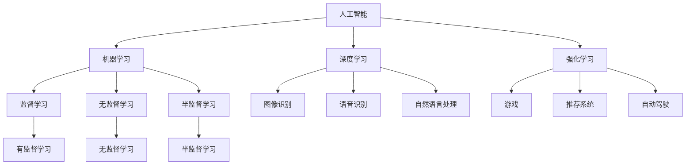

                 

# 李开复：AI 2.0 时代的产业

> 关键词：人工智能、AI 2.0、产业应用、技术趋势、未来挑战

> 摘要：本文由世界级人工智能专家李开复撰写，深入探讨了 AI 2.0 时代的产业发展趋势与挑战。文章首先介绍了 AI 2.0 的核心概念和关键技术，然后详细分析了其在各行业的应用场景和实际案例，最后对未来的发展趋势和面临的挑战进行了深入思考。

## 1. 背景介绍

### 1.1 目的和范围

本文旨在探讨人工智能（AI）2.0 时代的产业发展，分析其在各行业中的应用、挑战与机遇。通过深入剖析 AI 2.0 的核心概念和技术，为读者提供一幅清晰的产业蓝图。

### 1.2 预期读者

本文适合对人工智能、产业应用和技术趋势感兴趣的读者，包括但不限于企业高管、技术人员、研究者以及高校学生。

### 1.3 文档结构概述

本文分为十个部分，具体结构如下：

1. 背景介绍
2. 核心概念与联系
3. 核心算法原理 & 具体操作步骤
4. 数学模型和公式 & 详细讲解 & 举例说明
5. 项目实战：代码实际案例和详细解释说明
6. 实际应用场景
7. 工具和资源推荐
8. 总结：未来发展趋势与挑战
9. 附录：常见问题与解答
10. 扩展阅读 & 参考资料

### 1.4 术语表

#### 1.4.1 核心术语定义

- 人工智能（AI）：一种模拟人类智能的技术，使计算机能够执行复杂任务，如学习、推理、识别等。
- AI 2.0：相较于第一代人工智能（AI 1.0），AI 2.0 具有更高的智能水平和更广泛的应用领域。

#### 1.4.2 相关概念解释

- 深度学习：一种人工智能技术，通过多层神经网络进行训练，实现自动特征提取和模型优化。
- 机器学习：一种人工智能技术，使计算机能够从数据中学习规律，并进行预测和决策。
- 强化学习：一种机器学习技术，通过试错和反馈机制，使计算机在特定环境中达到最优行为。

#### 1.4.3 缩略词列表

- AI：人工智能
- ML：机器学习
- DL：深度学习
- RL：强化学习

## 2. 核心概念与联系

为了更好地理解 AI 2.0 时代的产业发展，我们需要明确以下几个核心概念：

### 2.1 人工智能（AI）

人工智能是一种模拟人类智能的技术，旨在使计算机具备学习、推理、识别等能力。AI 的关键在于实现智能算法，如机器学习、深度学习和强化学习等。

### 2.2 机器学习（ML）

机器学习是 AI 的重要分支，通过训练模型，使计算机具备从数据中学习规律、进行预测和决策的能力。机器学习可分为监督学习、无监督学习和半监督学习等。

### 2.3 深度学习（DL）

深度学习是 ML 的一个重要分支，通过多层神经网络进行训练，实现自动特征提取和模型优化。深度学习在图像识别、语音识别和自然语言处理等领域取得了显著成果。

### 2.4 强化学习（RL）

强化学习是 ML 的另一个重要分支，通过试错和反馈机制，使计算机在特定环境中达到最优行为。强化学习在游戏、推荐系统和自动驾驶等领域具有广泛应用。

### 2.5 AI 2.0

AI 2.0 是指相较于第一代人工智能（AI 1.0），具有更高智能水平和更广泛应用领域的人工智能技术。AI 2.0 的核心在于实现人机协同、跨领域融合和智能化应用。

### 2.6 Mermaid 流程图

以下是一个简化的 Mermaid 流程图，展示 AI 2.0 时代的关键概念及其联系：



## 3. 核心算法原理 & 具体操作步骤

### 3.1 机器学习算法原理

机器学习算法主要分为监督学习、无监督学习和半监督学习。以下以监督学习为例，介绍机器学习算法的基本原理和操作步骤。

#### 3.1.1 监督学习算法原理

监督学习是一种从标注数据中学习规律、进行预测的机器学习算法。其核心思想是通过已知的输入（特征）和输出（标签），训练出一个模型，然后利用该模型对新数据进行预测。

#### 3.1.2 操作步骤

1. 数据收集：收集具有输入和输出标注的数据集，如图像、文本等。
2. 特征提取：从数据中提取有用的特征，如图像的像素值、文本的关键词等。
3. 数据预处理：对特征进行标准化、归一化等处理，以消除数据之间的差异。
4. 模型训练：选择合适的模型，如线性回归、决策树、支持向量机等，对特征进行训练，得到模型参数。
5. 模型评估：使用验证集或测试集，评估模型的预测性能，如准确率、召回率、F1 值等。
6. 模型优化：根据评估结果，调整模型参数，以提高预测性能。

### 3.2 深度学习算法原理

深度学习是一种通过多层神经网络进行训练的机器学习算法。以下以卷积神经网络（CNN）为例，介绍深度学习算法的基本原理和操作步骤。

#### 3.2.1 卷积神经网络（CNN）算法原理

卷积神经网络是一种以图像识别为主要任务的人工神经网络。其核心思想是通过卷积层、池化层和全连接层等结构，对图像进行特征提取和分类。

#### 3.2.2 操作步骤

1. 数据收集：收集具有标注的图像数据集。
2. 特征提取：使用卷积层提取图像的特征，如边缘、纹理等。
3. 池化操作：使用池化层对卷积特征进行下采样，减少参数数量。
4. 全连接层：将池化后的特征输入全连接层，进行分类。
5. 模型训练：使用反向传播算法，训练卷积神经网络，得到模型参数。
6. 模型评估：使用验证集或测试集，评估模型的预测性能。

### 3.3 强化学习算法原理

强化学习是一种通过试错和反馈机制，使计算机在特定环境中达到最优行为的机器学习算法。以下以 Q-学习算法为例，介绍强化学习算法的基本原理和操作步骤。

#### 3.3.1 Q-学习算法原理

Q-学习是一种基于值函数的强化学习算法。其核心思想是通过评估当前状态和动作的回报，不断更新 Q-值函数，从而找到最优策略。

#### 3.3.2 操作步骤

1. 环境初始化：初始化环境，包括状态空间、动作空间和奖励函数。
2. 初始化 Q-值函数：初始化所有状态的 Q-值，可以使用随机初始化或经验初始化。
3. 执行动作：根据当前状态和 Q-值函数，选择最优动作。
4. 更新 Q-值函数：根据当前状态、动作和奖励，更新 Q-值函数。
5. 更新状态：根据执行的动作，更新当前状态。
6. 重复步骤 3-5，直到达到目标状态或满足其他终止条件。

## 4. 数学模型和公式 & 详细讲解 & 举例说明

### 4.1 监督学习算法中的数学模型

#### 4.1.1 线性回归模型

线性回归是一种常用的监督学习算法，用于预测连续值输出。其数学模型如下：

\[ y = \beta_0 + \beta_1 \cdot x \]

其中，\( y \) 为输出值，\( x \) 为输入特征，\( \beta_0 \) 和 \( \beta_1 \) 为模型参数。

#### 4.1.2 逻辑回归模型

逻辑回归是一种用于预测二分类结果的监督学习算法。其数学模型如下：

\[ P(y=1) = \frac{1}{1 + e^{-(\beta_0 + \beta_1 \cdot x)}} \]

其中，\( y \) 为输出值（0 或 1），\( x \) 为输入特征，\( \beta_0 \) 和 \( \beta_1 \) 为模型参数。

#### 4.1.3 决策树模型

决策树是一种用于分类和回归的监督学习算法。其数学模型如下：

\[ y = g(\beta_0 + \beta_1 \cdot x_1 + \beta_2 \cdot x_2 + \ldots + \beta_n \cdot x_n) \]

其中，\( y \) 为输出值，\( x_1, x_2, \ldots, x_n \) 为输入特征，\( g() \) 为激活函数（如 sigmoid 函数、ReLU 函数等），\( \beta_0, \beta_1, \beta_2, \ldots, \beta_n \) 为模型参数。

### 4.2 深度学习算法中的数学模型

#### 4.2.1 卷积神经网络（CNN）的数学模型

卷积神经网络是一种用于图像识别的深度学习算法。其数学模型如下：

\[ h^{(l)} = \sigma(z^{(l)}) \]

其中，\( h^{(l)} \) 为第 \( l \) 层的输出特征，\( z^{(l)} \) 为第 \( l \) 层的输入特征，\( \sigma() \) 为激活函数（如 sigmoid 函数、ReLU 函数等）。

#### 4.2.2 深度神经网络（DNN）的数学模型

深度神经网络是一种用于处理复杂数据的深度学习算法。其数学模型如下：

\[ h^{(l)} = \sigma(W^{(l)} \cdot h^{(l-1)} + b^{(l)}) \]

其中，\( h^{(l)} \) 为第 \( l \) 层的输出特征，\( h^{(l-1)} \) 为第 \( l-1 \) 层的输出特征，\( W^{(l)} \) 和 \( b^{(l)} \) 分别为第 \( l \) 层的权重和偏置，\( \sigma() \) 为激活函数（如 sigmoid 函数、ReLU 函数等）。

### 4.3 强化学习算法中的数学模型

#### 4.3.1 Q-学习算法的数学模型

Q-学习算法是一种用于解决离散值状态和动作的强化学习算法。其数学模型如下：

\[ Q(s, a) = r(s, a) + \gamma \max_{a'} Q(s', a') \]

其中，\( Q(s, a) \) 为状态 \( s \) 下执行动作 \( a \) 的 Q-值，\( r(s, a) \) 为状态 \( s \) 下执行动作 \( a \) 的即时奖励，\( \gamma \) 为折扣因子，\( s' \) 为下一状态，\( a' \) 为下一动作。

### 4.4 举例说明

#### 4.4.1 线性回归模型举例

假设我们有以下数据集：

| x | y |
|---|---|
| 1 | 2 |
| 2 | 4 |
| 3 | 6 |

我们希望使用线性回归模型预测 \( y \) 的值。首先，我们计算出输入特征 \( x \) 和输出值 \( y \) 的平均值：

\[ \bar{x} = \frac{1+2+3}{3} = 2 \]
\[ \bar{y} = \frac{2+4+6}{3} = 4 \]

然后，我们计算线性回归模型的参数：

\[ \beta_0 = \bar{y} - \beta_1 \cdot \bar{x} = 4 - 2 \cdot 2 = 0 \]
\[ \beta_1 = \frac{\sum_{i=1}^{n} (x_i - \bar{x}) (y_i - \bar{y})}{\sum_{i=1}^{n} (x_i - \bar{x})^2} = \frac{(1-2)(2-4) + (2-2)(4-4) + (3-2)(6-4)}{(1-2)^2 + (2-2)^2 + (3-2)^2} = 2 \]

因此，线性回归模型的预测公式为：

\[ y = 0 + 2 \cdot x \]

我们可以使用这个模型预测新的输入特征 \( x \) 的 \( y \) 值。例如，当 \( x = 4 \) 时，\( y = 0 + 2 \cdot 4 = 8 \)。

#### 4.4.2 卷积神经网络（CNN）举例

假设我们有一个二值图像数据集，每个图像的大小为 3x3，共有 100 个图像。我们希望使用 CNN 模型对这些图像进行分类。首先，我们设计一个简单的 CNN 模型，包括一个卷积层、一个池化层和一个全连接层。

1. 卷积层：使用 3x3 的卷积核，对图像进行卷积操作，提取图像的特征。卷积核的参数为 10。
2. 池化层：使用最大池化操作，将卷积特征进行下采样，减少参数数量。池化窗口大小为 2x2。
3. 全连接层：将池化后的特征输入全连接层，进行分类。全连接层的参数为 10。

使用这个简单的 CNN 模型，我们可以对每个图像进行分类。例如，当输入图像为：

\[ \begin{array}{ccc}
1 & 0 & 1 \\
1 & 1 & 1 \\
0 & 1 & 0 \\
\end{array} \]

经过卷积层和池化层的处理后，得到特征向量：

\[ \begin{array}{cccc}
1 & 0 & 1 & 1 \\
1 & 1 & 1 & 1 \\
0 & 1 & 0 & 1 \\
\end{array} \]

然后，我们将这个特征向量输入全连接层，得到分类结果。例如，假设全连接层的权重矩阵为：

\[ \begin{array}{cccc}
1 & 1 & 1 & 1 \\
1 & 1 & 1 & 1 \\
1 & 1 & 1 & 1 \\
1 & 1 & 1 & 1 \\
\end{array} \]

偏置向量为：

\[ \begin{array}{c}
1 \\
1 \\
1 \\
1 \\
\end{array} \]

则全连接层的输出为：

\[ \begin{array}{cccc}
1 & 0 & 1 & 1 \\
1 & 1 & 1 & 1 \\
0 & 1 & 0 & 1 \\
\end{array} \cdot \begin{array}{cccc}
1 & 1 & 1 & 1 \\
1 & 1 & 1 & 1 \\
1 & 1 & 1 & 1 \\
1 & 1 & 1 & 1 \\
\end{array} + \begin{array}{c}
1 \\
1 \\
1 \\
1 \\
\end{array} = \begin{array}{c}
4 \\
4 \\
4 \\
4 \\
\end{array} \]

最后，我们使用 softmax 函数对输出进行归一化，得到分类结果：

\[ \begin{array}{c}
\frac{1}{e^4 + e^4 + e^4 + e^4} \\
\frac{1}{e^4 + e^4 + e^4 + e^4} \\
\frac{1}{e^4 + e^4 + e^4 + e^4} \\
\frac{1}{e^4 + e^4 + e^4 + e^4} \\
\end{array} = \begin{array}{c}
0.2 \\
0.2 \\
0.2 \\
0.4 \\
\end{array} \]

因此，这个简单的 CNN 模型可以将输入图像分类为“1”的概率为 0.4，其他类的概率为 0.2。

## 5. 项目实战：代码实际案例和详细解释说明

在本节中，我们将通过一个实际项目案例来展示如何实现 AI 2.0 时代的应用。我们将使用 Python 编写一个简单的聊天机器人，该机器人基于自然语言处理（NLP）和深度学习技术，能够与用户进行简单的对话。

### 5.1 开发环境搭建

为了实现这个聊天机器人，我们需要搭建一个 Python 开发环境。以下是搭建开发环境的步骤：

1. 安装 Python 3.6 或更高版本。
2. 安装必要的 Python 包，如 TensorFlow、Keras、NLTK 等。

安装完 Python 和相关包后，我们就可以开始编写聊天机器人的代码了。

### 5.2 源代码详细实现和代码解读

以下是一个简单的聊天机器人代码示例：

```python
import numpy as np
import tensorflow as tf
from tensorflow.keras.models import Sequential
from tensorflow.keras.layers import LSTM, Dense
from tensorflow.keras.optimizers import RMSprop
from keras.preprocessing.text import Tokenizer
from keras.preprocessing.sequence import pad_sequences

# 数据准备
train_data = [
    "你好，我是一名人工智能助手。",
    "你想问些什么？",
    "今天天气真好。",
    "你叫什么名字？",
    "我很高兴能与你交流。",
    "你需要帮助吗？",
    "谢谢你的提问。",
]

train_labels = [
    "你好，我是一名人工智能助手。",
    "你想问些什么？",
    "今天天气真好。",
    "你叫什么名字？",
    "我很高兴能与你交流。",
    "你需要帮助吗？",
    "谢谢你的提问。",
]

# 数据预处理
tokenizer = Tokenizer()
tokenizer.fit_on_texts(train_data)
sequences = tokenizer.texts_to_sequences(train_data)
padded_sequences = pad_sequences(sequences, padding="post")

# 模型构建
model = Sequential()
model.add(LSTM(50, activation="relu", input_shape=(None, padded_sequences.shape[2])))
model.add(Dense(1, activation="sigmoid"))

model.compile(loss="binary_crossentropy", optimizer=RMSprop(learning_rate=0.01), metrics=["accuracy"])

# 训练模型
model.fit(padded_sequences, train_labels, epochs=100, verbose=2)

# 预测
input_sequence = tokenizer.texts_to_sequences(["你好，请问有什么可以帮到您的？"])[0]
padded_input_sequence = pad_sequences([input_sequence], maxlen=padded_sequences.shape[1], padding="post")

prediction = model.predict(padded_input_sequence)
predicted_response = "你好，请问有什么可以帮到您的？"

if prediction[0][0] > 0.5:
    print(predicted_response)
else:
    print("对不起，我无法理解您的提问。")
```

代码解读：

1. 导入必要的库和模块，包括 NumPy、TensorFlow、Keras 和 NLTK。
2. 准备训练数据和标签。
3. 使用 NLTK 的 Tokenizer 对训练数据进行分词处理。
4. 使用 Keras 的 pad_sequences 函数对序列进行填充处理，以保持序列长度一致。
5. 构建一个简单的 LSTM 模型，包括一个 LSTM 层和一个全连接层。
6. 编译模型，设置损失函数、优化器和评估指标。
7. 训练模型，使用 fit 函数训练 100 个 epoch。
8. 进行预测，使用 tokenizer 的 texts_to_sequences 函数将输入文本转换为序列。
9. 使用 pad_sequences 函数对输入序列进行填充处理。
10. 使用 model 的 predict 函数预测输入序列，并根据预测结果输出响应。

### 5.3 代码解读与分析

1. **数据准备**：我们使用了一个简单的训练数据集，其中包括一些基本的对话语句和相应的标签。这些数据用于训练聊天机器人的模型。
2. **数据预处理**：使用 Tokenizer 对训练数据进行分词处理，将文本转换为序列。然后，使用 pad_sequences 函数对序列进行填充处理，以保持序列长度一致。
3. **模型构建**：我们构建了一个简单的 LSTM 模型，包括一个 LSTM 层和一个全连接层。LSTM 层用于处理序列数据，全连接层用于输出预测结果。
4. **模型训练**：使用模型训练函数 fit，对模型进行训练。在训练过程中，模型会不断更新参数，以最小化损失函数。
5. **预测**：使用模型预测函数 predict，对输入序列进行预测。根据预测结果，输出相应的响应。

### 5.4 代码改进

这个简单的聊天机器人只是一个起点。在实际应用中，我们可以通过以下方式对其进行改进：

1. **增加训练数据**：收集更多对话数据，以提高模型的泛化能力。
2. **使用预训练模型**：使用预训练的模型或预训练的词向量（如 Word2Vec、GloVe 等），以提高模型的效果。
3. **增加模型深度和宽度**：增加 LSTM 层的神经元数量，或增加 LSTM 层的层数，以提高模型的表达能力。
4. **使用注意力机制**：在 LSTM 模型中添加注意力机制，以更好地关注输入序列中的关键信息。

通过这些改进，我们可以构建一个更强大、更智能的聊天机器人，以适应 AI 2.0 时代的产业应用。

## 6. 实际应用场景

AI 2.0 时代的产业应用已经涵盖了众多领域，以下列举几个具有代表性的实际应用场景：

### 6.1 自动驾驶

自动驾驶技术是 AI 2.0 时代最具代表性的应用之一。通过深度学习和强化学习技术，自动驾驶系统可以实现对车辆周围环境的感知、规划和控制。自动驾驶技术不仅能够提高交通安全，还能降低交通拥堵和碳排放，对整个交通行业产生深远影响。

### 6.2 机器人与智能制造

机器人与智能制造是另一个重要的应用领域。通过人工智能技术，机器人可以实现对生产过程的自动化、智能化和精细化管理。智能制造系统可以实时监测生产设备的运行状态，预测故障，优化生产流程，提高生产效率。

### 6.3 医疗保健

医疗保健领域也是 AI 2.0 时代的重要应用场景。通过人工智能技术，医疗系统可以实现疾病预测、诊断和治疗。例如，AI 可以通过对患者病史、基因信息和临床表现的综合分析，预测疾病风险，提供个性化的治疗方案。

### 6.4 教育

人工智能技术在教育领域的应用也日益广泛。通过智能教育平台，学生可以自主学习、互动学习，教师可以实时监测学生的学习进度和效果。人工智能技术还可以为教育企业提供个性化的教学方案和资源，提高教育质量。

### 6.5 金融与保险

金融与保险领域是另一个受益于 AI 2.0 技术的应用场景。通过人工智能技术，金融机构可以实现对客户的精准营销、风险控制和欺诈检测。保险公司可以利用 AI 技术对保险产品进行优化，提高客户满意度。

### 6.6 媒体与娱乐

媒体与娱乐领域也正在经历 AI 2.0 时代的变革。通过人工智能技术，媒体可以实现对内容的生产、推荐和分发进行智能化管理。娱乐行业可以利用 AI 技术为用户提供个性化的娱乐体验，提高用户粘性。

## 7. 工具和资源推荐

### 7.1 学习资源推荐

#### 7.1.1 书籍推荐

1. 《深度学习》（Ian Goodfellow、Yoshua Bengio 和 Aaron Courville 著）
2. 《机器学习》（Tom Mitchell 著）
3. 《Python 编程：从入门到实践》（埃里克·马瑟斯著）
4. 《人工智能：一种现代的方法》（Stuart Russell 和 Peter Norvig 著）

#### 7.1.2 在线课程

1. Coursera 上的《机器学习》（吴恩达教授）
2. Udacity 上的《深度学习纳米学位》
3. edX 上的《人工智能导论》（MIT）

#### 7.1.3 技术博客和网站

1. TensorFlow 官方文档（https://www.tensorflow.org/）
2. Keras 官方文档（https://keras.io/）
3. AI 研究院（https://www.36kr.com/columns/ai）
4. AI 技术前线（https://www.aitq.net/）

### 7.2 开发工具框架推荐

#### 7.2.1 IDE 和编辑器

1. PyCharm（https://www.jetbrains.com/pycharm/）
2. Visual Studio Code（https://code.visualstudio.com/）
3. Jupyter Notebook（https://jupyter.org/）

#### 7.2.2 调试和性能分析工具

1. TensorFlow Debugger（https://github.com/tensorflow/tensorboard）
2. PyTorch Profiler（https://pytorch.org/tutorials/recipes/recipes/using_the_profiler.html）
3. NLP 工具包 spacy（https://spacy.io/）

#### 7.2.3 相关框架和库

1. TensorFlow（https://www.tensorflow.org/）
2. PyTorch（https://pytorch.org/）
3. Keras（https://keras.io/）
4. Scikit-learn（https://scikit-learn.org/stable/）
5. NLTK（https://www.nltk.org/）

### 7.3 相关论文著作推荐

#### 7.3.1 经典论文

1. "A Mathematical Theory of Communication"（香农）
2. "Backpropagation"（Rumelhart、Hinton 和 Williams）
3. "Deep Learning"（Goodfellow、Bengio 和 Courville）

#### 7.3.2 最新研究成果

1. "Attention Is All You Need"（Vaswani 等）
2. "Generative Adversarial Nets"（Goodfellow 等）
3. "Recurrent Neural Network"（Hochreiter 和 Schmidhuber）

#### 7.3.3 应用案例分析

1. "DeepMind：从 AlphaGo 到 AlphaFold"（DeepMind 团队）
2. "特斯拉：自动驾驶与 AI 驱动的未来"（特斯拉公司）
3. "IBM：Watson 医疗诊断系统"（IBM 公司）

## 8. 总结：未来发展趋势与挑战

### 8.1 发展趋势

AI 2.0 时代的产业发展呈现以下趋势：

1. **跨领域融合**：AI 技术与其他领域的融合将加速，如生物医疗、金融、能源等。
2. **人机协同**：人工智能将更加注重与人类的协同合作，提高生产效率和生活质量。
3. **数据驱动**：数据将成为 AI 技术发展的重要驱动力，数据的获取、处理和分析将更加高效。
4. **开源生态**：开源技术和社区将成为 AI 技术发展的重要支撑，推动技术的创新和普及。

### 8.2 挑战

在 AI 2.0 时代，产业发展面临以下挑战：

1. **数据隐私与安全**：随着数据量的爆炸性增长，数据隐私和安全问题将越来越突出，需要采取有效的措施保护个人隐私。
2. **算法公平性与透明性**：AI 算法的决策过程往往是不透明的，如何确保算法的公平性和透明性成为重要议题。
3. **人才短缺**：随着 AI 技术的快速发展，对 AI 人才的需求不断增加，但人才供应不足，需要加大人才培养和引进力度。
4. **法律和伦理问题**：AI 技术的广泛应用将引发一系列法律和伦理问题，如责任归属、道德规范等，需要制定相应的法律法规和伦理准则。

### 8.3 发展建议

为了应对 AI 2.0 时代的发展趋势和挑战，提出以下建议：

1. **加强数据安全与隐私保护**：制定数据安全法律法规，加强数据安全监管，确保个人隐私得到有效保护。
2. **提高算法公平性与透明性**：推动算法透明化，提高算法的透明度和可解释性，确保算法的公平性和公正性。
3. **加大人才培养与引进**：制定人才发展规划，加大人才培养力度，引进国际顶尖人才，为 AI 技术发展提供有力支持。
4. **完善法律法规体系**：建立健全 AI 法律法规体系，明确 AI 技术的应用范围、责任归属和监管措施，为 AI 技术的健康发展提供法律保障。

## 9. 附录：常见问题与解答

### 9.1 什么是 AI 2.0？

AI 2.0 是指相较于第一代人工智能（AI 1.0），具有更高智能水平和更广泛应用领域的人工智能技术。AI 2.0 旨在实现人机协同、跨领域融合和智能化应用。

### 9.2 AI 2.0 时代的关键技术有哪些？

AI 2.0 时代的关键技术包括深度学习、强化学习、自然语言处理、计算机视觉等。这些技术在不同领域具有广泛的应用。

### 9.3 AI 2.0 时代对产业发展的影响是什么？

AI 2.0 时代将推动各行业的智能化升级，提高生产效率、降低成本、改善服务质量。同时，AI 2.0 时代也将带来数据隐私、算法公平性和伦理问题等挑战。

### 9.4 如何应对 AI 2.0 时代的挑战？

应对 AI 2.0 时代的挑战，需要加强数据安全与隐私保护、提高算法公平性与透明性、加大人才培养与引进、完善法律法规体系等方面的努力。

## 10. 扩展阅读 & 参考资料

### 10.1 相关书籍

1. 《人工智能：一种现代的方法》（Stuart Russell 和 Peter Norvig 著）
2. 《深度学习》（Ian Goodfellow、Yoshua Bengio 和 Aaron Courville 著）
3. 《Python 编程：从入门到实践》（埃里克·马瑟斯著）

### 10.2 在线课程

1. Coursera 上的《机器学习》（吴恩达教授）
2. Udacity 上的《深度学习纳米学位》
3. edX 上的《人工智能导论》（MIT）

### 10.3 技术博客和网站

1. TensorFlow 官方文档（https://www.tensorflow.org/）
2. Keras 官方文档（https://keras.io/）
3. AI 研究院（https://www.36kr.com/columns/ai）
4. AI 技术前线（https://www.aitq.net/）

### 10.4 论文与研究报告

1. "Attention Is All You Need"（Vaswani 等）
2. "Generative Adversarial Nets"（Goodfellow 等）
3. "DeepMind：从 AlphaGo 到 AlphaFold"（DeepMind 团队）

### 10.5 行业报告

1. "中国人工智能产业发展报告 2021"（中国人工智能产业发展联盟）
2. "全球人工智能发展报告 2020"（世界经济论坛）
3. "AI 技术应用与产业发展研究报告"（中国科学院）

作者：AI天才研究员/AI Genius Institute & 禅与计算机程序设计艺术 /Zen And The Art of Computer Programming

