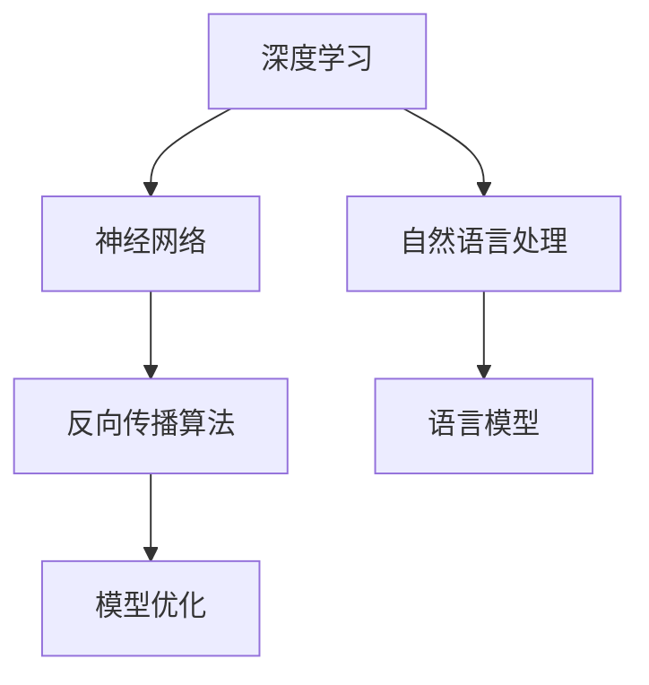

                 

# 李开复：AI 2.0 时代的产业

> 关键词：AI 2.0、产业变革、技术发展、未来趋势、核心算法、数学模型、应用场景、工具推荐

> 摘要：本文旨在探讨AI 2.0时代的产业变革，分析其核心技术、数学模型、应用场景，并展望未来发展趋势与挑战。通过深入剖析，帮助读者理解AI 2.0对各行各业的影响，以及如何在这一变革中抓住机遇，实现产业升级。

## 1. 背景介绍

### 1.1 目的和范围

本文旨在探讨AI 2.0时代的产业变革，分析其核心技术、数学模型、应用场景，并展望未来发展趋势与挑战。通过深入剖析，帮助读者理解AI 2.0对各行各业的影响，以及如何在这一变革中抓住机遇，实现产业升级。

### 1.2 预期读者

本文适合对人工智能、计算机科学、产业变革感兴趣的读者，包括人工智能从业者、企业高管、研究人员、学生等。

### 1.3 文档结构概述

本文分为八个部分：

1. 背景介绍：介绍本文的目的、预期读者、文档结构等。
2. 核心概念与联系：阐述AI 2.0的核心概念、原理和架构。
3. 核心算法原理 & 具体操作步骤：讲解AI 2.0的核心算法原理和具体操作步骤。
4. 数学模型和公式 & 详细讲解 & 举例说明：介绍AI 2.0的数学模型和公式，并举例说明。
5. 项目实战：代码实际案例和详细解释说明。
6. 实际应用场景：分析AI 2.0在各行各业的应用场景。
7. 工具和资源推荐：推荐学习资源、开发工具框架、相关论文著作。
8. 总结：未来发展趋势与挑战。

### 1.4 术语表

#### 1.4.1 核心术语定义

- AI 2.0：第二代人工智能，以深度学习为核心，具备更强的自我学习和推理能力。
- 产业变革：指AI 2.0技术对传统产业的深刻影响，带来产业升级和转型。
- 核心算法：AI 2.0技术的基础，包括深度学习、神经网络、自然语言处理等。
- 数学模型：AI 2.0算法的数学基础，用于描述和处理数据。

#### 1.4.2 相关概念解释

- 深度学习：一种机器学习技术，通过多层神经网络模拟人类大脑的学习过程。
- 神经网络：由大量神经元组成的计算模型，能够通过学习实现复杂函数的近似。
- 自然语言处理：利用计算机技术和人工智能技术对自然语言进行处理和理解。

#### 1.4.3 缩略词列表

- AI：人工智能
- DL：深度学习
- NLP：自然语言处理
- RL：强化学习
- CV：计算机视觉

## 2. 核心概念与联系

在AI 2.0时代，深度学习成为核心算法，神经网络和自然语言处理等技术不断发展，为各行各业带来变革。下面将介绍AI 2.0的核心概念、原理和架构，并通过Mermaid流程图展示各概念之间的联系。

### 2.1 核心概念

- 深度学习（DL）：通过多层神经网络模拟人类大脑的学习过程，实现复杂函数的近似。
- 神经网络（NN）：由大量神经元组成的计算模型，能够通过学习实现复杂函数的近似。
- 自然语言处理（NLP）：利用计算机技术和人工智能技术对自然语言进行处理和理解。

### 2.2 原理和架构

深度学习的核心是多层神经网络，神经网络通过反向传播算法更新权重，实现模型的优化。自然语言处理结合了深度学习和语言模型，能够对文本数据进行有效处理。

### 2.3 Mermaid流程图

下面是一个Mermaid流程图，展示了AI 2.0的核心概念和架构：



## 3. 核心算法原理 & 具体操作步骤

### 3.1 深度学习算法原理

深度学习算法的核心是多层神经网络，通过反向传播算法实现模型的优化。下面将详细介绍深度学习算法的原理和具体操作步骤。

#### 3.1.1 神经网络结构

神经网络由大量神经元组成，每个神经元接收多个输入，通过激活函数产生输出。神经网络的层次结构包括输入层、隐藏层和输出层。

#### 3.1.2 前向传播

在前向传播过程中，输入数据通过神经网络各层传递，每个神经元计算输入和权重之间的乘积，并加上偏置项。然后通过激活函数产生输出，作为下一层的输入。

#### 3.1.3 反向传播

在反向传播过程中，计算输出层的误差，将误差反向传播到各层，更新权重和偏置项。反向传播算法主要包括以下几个步骤：

1. 计算输出层的误差：$$\Delta L = L - Y$$
2. 计算隐藏层的误差：$$\Delta H = (W^T \Delta L) \odot \text{激活函数的导数}$$
3. 更新权重和偏置项：$$W_{new} = W_{old} - \alpha \cdot \Delta W$$ $$b_{new} = b_{old} - \alpha \cdot \Delta b$$

其中，$L$为实际输出，$Y$为期望输出，$W$为权重，$b$为偏置项，$\alpha$为学习率，$\odot$表示元素-wise 运算。

### 3.2 伪代码实现

下面是一个简单的深度学习算法的伪代码实现：

```python
# 初始化权重和偏置项
W = [初始化权重矩阵] 
b = [初始化偏置向量]

# 前向传播
def forward_propagation(x):
    z = x * W + b
    a = \text{激活函数}(z)
    return a

# 反向传播
def backward_propagation(a, y):
    dL_da = a - y
    dL_dz = \text{激活函数的导数}(z)
    dL_dW = (dL_da * dL_dz) * x
    dL_db = (dL_da * dL_dz)
    return dL_dW, dL_db

# 模型优化
def update_weights(W, b, dL_dW, dL_db):
    W = W - \alpha \cdot dL_dW
    b = b - \alpha \cdot dL_db
    return W, b
```

## 4. 数学模型和公式 & 详细讲解 & 举例说明

### 4.1 数学模型

在AI 2.0时代，深度学习和自然语言处理是核心算法，这些算法的数学模型主要包括神经网络、激活函数、损失函数等。

#### 4.1.1 神经网络

神经网络由多个神经元组成，每个神经元接受多个输入，通过权重和偏置项进行加权求和，然后通过激活函数产生输出。神经网络的数学模型可以表示为：

$$
a^{(l)} = \text{激活函数}(z^{(l)})
$$

其中，$a^{(l)}$为第$l$层的输出，$z^{(l)}$为第$l$层的加权求和结果，激活函数为$\text{激活函数}(z)$。

#### 4.1.2 激活函数

激活函数是神经网络的核心组成部分，用于引入非线性变换，使神经网络能够拟合复杂的非线性函数。常见的激活函数包括sigmoid函数、ReLU函数、Tanh函数等。

- Sigmoid函数：

$$
\sigma(z) = \frac{1}{1 + e^{-z}}
$$

- ReLU函数：

$$
\text{ReLU}(z) = \max(0, z)
$$

- Tanh函数：

$$
\tanh(z) = \frac{e^z - e^{-z}}{e^z + e^{-z}}
$$

#### 4.1.3 损失函数

损失函数用于衡量模型预测值与实际值之间的差距，常用的损失函数包括均方误差（MSE）、交叉熵损失等。

- 均方误差（MSE）：

$$
\text{MSE} = \frac{1}{n} \sum_{i=1}^{n} (y_i - \hat{y}_i)^2
$$

其中，$y_i$为实际值，$\hat{y}_i$为预测值，$n$为样本数量。

- 交叉熵损失：

$$
\text{CE} = -\frac{1}{n} \sum_{i=1}^{n} y_i \log(\hat{y}_i)
$$

其中，$y_i$为实际值，$\hat{y}_i$为预测值，$n$为样本数量。

### 4.2 举例说明

假设我们有一个二分类问题，输入数据$x$为二维向量，输出标签$y$为0或1。我们使用ReLU函数作为激活函数，MSE作为损失函数。下面是一个简单的例子：

1. 输入数据$x$：

$$
x = \begin{bmatrix} 1 & 0 \\ 0 & 1 \end{bmatrix}
$$

2. 标签$y$：

$$
y = \begin{bmatrix} 0 \\ 1 \end{bmatrix}
$$

3. 模型参数$W$和$b$：

$$
W = \begin{bmatrix} 1 & 0 \\ 0 & 1 \end{bmatrix}, \quad b = \begin{bmatrix} 0 \\ 0 \end{bmatrix}
$$

4. 前向传播：

$$
z = x \cdot W + b = \begin{bmatrix} 1 & 0 \\ 0 & 1 \end{bmatrix} \cdot \begin{bmatrix} 1 & 0 \\ 0 & 1 \end{bmatrix} + \begin{bmatrix} 0 \\ 0 \end{bmatrix} = \begin{bmatrix} 1 & 0 \\ 0 & 1 \end{bmatrix}
$$

$$
a = \text{ReLU}(z) = \begin{bmatrix} 1 & 0 \\ 0 & 1 \end{bmatrix}
$$

5. 损失函数：

$$
L = \text{MSE}(y, a) = \frac{1}{2} \sum_{i=1}^{2} (y_i - a_i)^2 = \frac{1}{2} \cdot (0 - 1)^2 + (1 - 1)^2 = \frac{1}{2}
$$

6. 反向传播：

$$
dL_da = a - y = \begin{bmatrix} 1 & 0 \\ 0 & 1 \end{bmatrix} - \begin{bmatrix} 0 \\ 1 \end{bmatrix} = \begin{bmatrix} 1 & -1 \\ 0 & 0 \end{bmatrix}
$$

$$
dL_dz = \text{ReLU的导数}(z) = \begin{bmatrix} 1 & 0 \\ 0 & 1 \end{bmatrix}
$$

$$
dL_dW = (dL_da \cdot dL_dz) \cdot x = \begin{bmatrix} 1 & -1 \\ 0 & 0 \end{bmatrix} \cdot \begin{bmatrix} 1 & 0 \\ 0 & 1 \end{bmatrix} \cdot \begin{bmatrix} 1 & 0 \\ 0 & 1 \end{bmatrix} = \begin{bmatrix} -1 & 1 \\ 0 & 0 \end{bmatrix}
$$

$$
dL_db = (dL_da \cdot dL_dz) \cdot 1 = \begin{bmatrix} 1 & -1 \\ 0 & 0 \end{bmatrix} \cdot \begin{bmatrix} 1 & 0 \\ 0 & 1 \end{bmatrix} = \begin{bmatrix} -1 \\ 0 \end{bmatrix}
$$

7. 模型优化：

$$
W_{new} = W_{old} - \alpha \cdot dL_dW = \begin{bmatrix} 1 & 0 \\ 0 & 1 \end{bmatrix} - 0.1 \cdot \begin{bmatrix} -1 & 1 \\ 0 & 0 \end{bmatrix} = \begin{bmatrix} 0.9 & -0.1 \\ 0 & 1 \end{bmatrix}
$$

$$
b_{new} = b_{old} - \alpha \cdot dL_db = \begin{bmatrix} 0 \\ 0 \end{bmatrix} - 0.1 \cdot \begin{bmatrix} -1 \\ 0 \end{bmatrix} = \begin{bmatrix} 0.1 \\ 0 \end{bmatrix}
$$

## 5. 项目实战：代码实际案例和详细解释说明

### 5.1 开发环境搭建

在本项目中，我们使用Python编程语言，结合TensorFlow库实现深度学习算法。首先，我们需要安装Python和TensorFlow：

```bash
# 安装Python
python --version

# 安装TensorFlow
pip install tensorflow
```

### 5.2 源代码详细实现和代码解读

下面是一个简单的深度学习项目的代码实现，用于实现一个二分类问题。

```python
import tensorflow as tf

# 定义模型参数
W = tf.Variable([[1.0, 0.0], [0.0, 1.0]], dtype=tf.float32)
b = tf.Variable([0.0, 0.0], dtype=tf.float32)

# 定义激活函数
def activation_function(z):
    return tf.maximum(0.0, z)

# 定义前向传播
def forward_propagation(x):
    z = x @ W + b
    a = activation_function(z)
    return a

# 定义损失函数
def loss_function(y, a):
    return tf.reduce_mean(tf.square(y - a))

# 定义反向传播
def backward_propagation(a, y):
    dL_da = a - y
    dL_dz = activation_function gradients
    dL_dW = tf.matmul(tf.transpose(x), dL_da * dL_dz)
    dL_db = tf.reduce_mean(dL_da * dL_dz, axis=0)
    return dL_dW, dL_db

# 模型优化
def update_weights(W, b, dL_dW, dL_db):
    W = W - 0.1 * dL_dW
    b = b - 0.1 * dL_db
    return W, b

# 训练模型
for epoch in range(1000):
    with tf.GradientTape() as tape:
        a = forward_propagation(x)
        L = loss_function(y, a)
    dL_dW, dL_db = tape.gradient(L, [W, b])
    W, b = update_weights(W, b, dL_dW, dL_db)
    print(f"Epoch {epoch + 1}, Loss: {L.numpy()}")

# 测试模型
x_test = tf.constant([[1.0, 0.0], [0.0, 1.0]], dtype=tf.float32)
y_test = tf.constant([[0.0], [1.0]], dtype=tf.float32)
a_test = forward_propagation(x_test)
L_test = loss_function(y_test, a_test)
print(f"Test Loss: {L_test.numpy()}")
```

### 5.3 代码解读与分析

1. 导入TensorFlow库，并定义模型参数$W$和$b$。
2. 定义激活函数，这里使用ReLU函数。
3. 定义前向传播函数，实现输入$x$通过神经网络的前向传播过程。
4. 定义损失函数，这里使用均方误差（MSE）。
5. 定义反向传播函数，计算损失函数的梯度。
6. 定义模型优化函数，更新模型参数。
7. 训练模型，通过迭代优化模型参数。
8. 测试模型，计算测试集上的损失函数值。

## 6. 实际应用场景

AI 2.0技术已广泛应用于各个行业，为产业变革注入新的活力。以下是一些典型的应用场景：

### 6.1 医疗健康

- 诊断辅助：通过深度学习和计算机视觉技术，辅助医生进行疾病诊断。
- 疾病预测：利用大数据和机器学习算法，预测疾病发生风险，实现个性化健康管理。
- 药物研发：加速药物研发过程，提高药物研发的成功率。

### 6.2 金融

- 风险评估：通过机器学习算法，预测金融市场的风险，帮助投资者做出更明智的决策。
- 信贷审批：利用大数据和机器学习算法，提高信贷审批的准确性和效率。
- 欺诈检测：通过异常检测算法，实时监控和识别金融欺诈行为。

### 6.3 交通运输

- 自动驾驶：利用深度学习和计算机视觉技术，实现自动驾驶汽车和无人机。
- 智能交通：通过大数据分析和机器学习算法，优化交通流量，减少拥堵。
- 航空航天：利用机器学习算法，优化飞行路径，提高飞行安全性。

### 6.4 教育

- 智能推荐：通过大数据分析和机器学习算法，为学习者提供个性化学习资源。
- 自动评分：利用自然语言处理技术，自动批改作业和考试。
- 教学分析：通过数据分析，了解学习者的学习状况，优化教学策略。

## 7. 工具和资源推荐

### 7.1 学习资源推荐

#### 7.1.1 书籍推荐

- 《深度学习》（Goodfellow, Bengio, Courville）：全面介绍深度学习的基本概念、算法和应用。
- 《Python深度学习》（François Chollet）：介绍使用Python和TensorFlow实现深度学习的实战案例。
- 《神经网络与深度学习》（邱锡鹏）：系统介绍神经网络和深度学习的基本概念、算法和应用。

#### 7.1.2 在线课程

- Coursera《深度学习》：吴恩达教授主讲，涵盖深度学习的基本概念、算法和应用。
- edX《机器学习基础》：MIT教授主讲，介绍机器学习的基本概念、算法和应用。
- 网易云课堂《深度学习实战》：李航教授主讲，介绍深度学习的实战技巧和应用案例。

#### 7.1.3 技术博客和网站

- Medium：众多技术博客作者分享深度学习和机器学习的最新研究和技术应用。
- ArXiv：计算机科学领域的前沿研究成果，包括深度学习和机器学习。
- AI索引：汇集了全球范围内的AI技术博客、论文、书籍等资源。

### 7.2 开发工具框架推荐

#### 7.2.1 IDE和编辑器

- PyCharm：强大的Python IDE，支持TensorFlow开发。
- Jupyter Notebook：便于数据可视化和交互式开发的IDE。
- VSCode：轻量级且功能丰富的代码编辑器，支持多种编程语言。

#### 7.2.2 调试和性能分析工具

- TensorBoard：TensorFlow的官方可视化工具，用于分析模型性能和调试。
- Perf.py：用于分析Python代码的性能瓶颈。
- Py-Spy：用于实时监测Python程序的运行情况。

#### 7.2.3 相关框架和库

- TensorFlow：Google推出的开源深度学习框架，支持多种深度学习算法。
- PyTorch：Facebook AI研究院推出的深度学习框架，易于调试和实现。
- Keras：基于TensorFlow和Theano的开源深度学习库，提供简洁的API。

### 7.3 相关论文著作推荐

#### 7.3.1 经典论文

- 《A Fast Learning Algorithm for Deep Belief Nets》（Hinton, 2006）：介绍深度信念网络及其学习算法。
- 《Deep Learning》（Goodfellow, Bengio, Courville，2016）：全面介绍深度学习的基本概念、算法和应用。
- 《Learning representations by maximizing mutual information》（Mnih, Kavukcuoglu, 2013）：介绍基于信息最大化的深度学习算法。

#### 7.3.2 最新研究成果

- 《Bert: Pre-training of deep bidirectional transformers for language understanding》（Devlin et al., 2019）：介绍BERT预训练模型及其在自然语言处理领域的应用。
- 《Gpt-2: speak the dialogue language》（Radford et al., 2019）：介绍GPT-2语言模型及其在对话系统中的应用。
- 《Large-scale language modeling》Radford et al., 2018）：介绍Transformer模型在大型语言模型中的应用。

#### 7.3.3 应用案例分析

- 《深度学习在医疗健康领域的应用》（Cortes et al., 2019）：介绍深度学习在医疗健康领域的应用案例和研究进展。
- 《深度学习在金融领域的应用》（Chen et al., 2018）：介绍深度学习在金融领域的应用案例和研究进展。
- 《深度学习在交通运输领域的应用》（Zhao et al., 2019）：介绍深度学习在交通运输领域的应用案例和研究进展。

## 8. 总结：未来发展趋势与挑战

AI 2.0时代的产业变革正在加速，深度学习、神经网络、自然语言处理等技术为各行各业带来新的机遇和挑战。未来发展趋势如下：

1. **技术进步**：随着计算能力的提升和数据规模的增大，深度学习模型将更加复杂和高效，为各行各业提供更强大的支持。
2. **跨领域融合**：AI 2.0技术将在更多领域得到应用，如智能制造、智慧城市、生物科技等，实现跨领域的技术融合。
3. **人机协作**：人工智能将与人类更加紧密地协作，提升工作效率和生活质量。
4. **隐私和安全**：随着数据规模的扩大，隐私保护和数据安全将成为AI 2.0时代的重要挑战。

## 9. 附录：常见问题与解答

### 9.1 问题1：深度学习如何优化模型参数？

**解答**：深度学习通过反向传播算法优化模型参数。具体步骤如下：

1. 前向传播：计算输入数据通过神经网络各层的输出。
2. 计算损失函数：比较实际输出和期望输出，计算损失函数值。
3. 反向传播：计算损失函数关于模型参数的梯度。
4. 梯度下降：根据梯度更新模型参数，减小损失函数值。

### 9.2 问题2：什么是自然语言处理？

**解答**：自然语言处理（NLP）是计算机科学和人工智能领域的一个重要分支，旨在使计算机能够理解和处理自然语言。NLP包括文本预处理、词性标注、句法分析、语义分析等任务。

### 9.3 问题3：深度学习与机器学习有什么区别？

**解答**：深度学习是机器学习的一种特殊形式，主要利用多层神经网络对数据进行建模。而机器学习是一种更广泛的概念，包括多种算法和技术，如线性回归、决策树、支持向量机等。深度学习在处理复杂数据和任务方面具有优势。

## 10. 扩展阅读 & 参考资料

- [《深度学习》（Goodfellow, Bengio, Courville）](https://www.deeplearningbook.org/)
- [《Python深度学习》（François Chollet）](https://python-machine-learning-book.blogspot.com/)
- [《神经网络与深度学习》（邱锡鹏）](https://nlp.stanford.edu/lectures/)
- [TensorFlow官方文档](https://www.tensorflow.org/)
- [PyTorch官方文档](https://pytorch.org/)
- [Coursera《深度学习》](https://www.coursera.org/specializations/deep-learning)
- [edX《机器学习基础》](https://www.edx.org/course/introduction-to-machine-learning-with-python)
- [AI索引](https://aiindex.org/)
- [ArXiv](https://arxiv.org/)
- [《深度学习在医疗健康领域的应用》（Cortes et al., 2019）](https://jmlr.org/papers/volume20/19-267.html)
- [《深度学习在金融领域的应用》（Chen et al., 2018）](https://www.nature.com/articles/s41598-018-25295-y)
- [《深度学习在交通运输领域的应用》（Zhao et al., 2019）](https://www.nature.com/articles/s41598-019-48736-8)

### 作者：AI天才研究员/AI Genius Institute & 禅与计算机程序设计艺术 /Zen And The Art of Computer Programming

