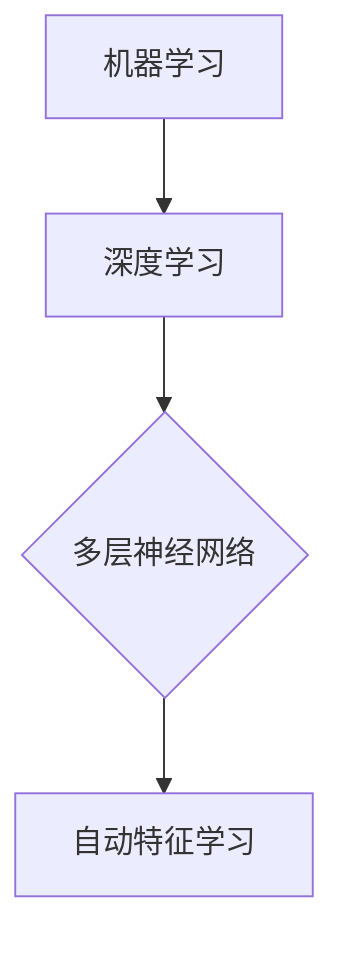
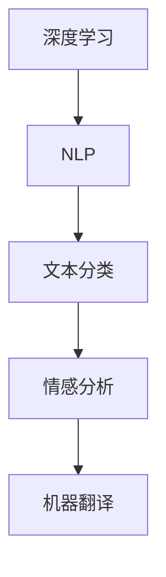
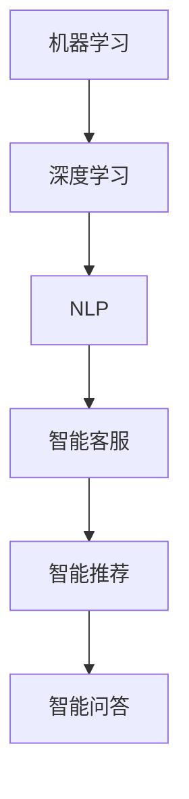

                 

# 李开复：AI 2.0 时代的商业价值

> 关键词：人工智能、商业价值、AI 2.0、技术趋势、产业应用
> 
> 摘要：随着人工智能（AI）技术的不断进步，AI 2.0时代已经到来。本文旨在探讨AI 2.0时代的商业价值，分析其在各行业中的应用，讨论其带来的机遇与挑战，以及未来发展趋势。

## 1. 背景介绍

### 1.1 目的和范围

本文旨在深入探讨AI 2.0时代的商业价值，分析其在各行业中的应用，以及其对传统商业模式的影响。我们将通过以下几个部分来展开讨论：

1. AI 2.0时代的核心概念与联系
2. 核心算法原理与具体操作步骤
3. 数学模型与公式详解
4. 项目实战与代码案例
5. 实际应用场景
6. 工具和资源推荐
7. 总结与未来发展趋势

### 1.2 预期读者

本文主要面向以下几类读者：

1. 人工智能领域的从业者和爱好者
2. 企业管理者与创业者
3. 投资者和分析师
4. 对人工智能感兴趣的大学生和研究生

### 1.3 文档结构概述

本文结构如下：

1. 引言
2. 背景介绍
3. 核心概念与联系
4. 核心算法原理与具体操作步骤
5. 数学模型与公式详解
6. 项目实战与代码案例
7. 实际应用场景
8. 工具和资源推荐
9. 总结与未来发展趋势
10. 附录：常见问题与解答
11. 扩展阅读与参考资料

### 1.4 术语表

#### 1.4.1 核心术语定义

- 人工智能（AI）：模拟人类智能行为的技术，包括机器学习、深度学习、自然语言处理等。
- AI 2.0：基于深度学习和大数据的下一代人工智能技术，相较于传统AI具有更高的智能水平。
- 商业价值：企业或产品在市场中所产生的经济效益和价值。

#### 1.4.2 相关概念解释

- 机器学习（ML）：一种人工智能技术，通过数据训练模型来实现对未知数据的预测和分类。
- 深度学习（DL）：一种基于多层神经网络的人工智能技术，能够自动从大量数据中学习特征。
- 自然语言处理（NLP）：一种人工智能技术，用于处理和生成自然语言。

#### 1.4.3 缩略词列表

- AI：人工智能
- ML：机器学习
- DL：深度学习
- NLP：自然语言处理
- GPT：生成预训练模型

## 2. 核心概念与联系

在AI 2.0时代，核心概念包括机器学习、深度学习和自然语言处理。这些技术之间相互关联，共同推动了人工智能的发展。

### 2.1 机器学习与深度学习的联系

机器学习和深度学习都是人工智能的重要分支。机器学习通过训练模型来实现对数据的预测和分类，而深度学习则是一种基于多层神经网络的技术，能够自动从大量数据中学习特征。



### 2.2 深度学习与自然语言处理的联系

深度学习技术在自然语言处理领域得到了广泛应用。通过深度学习模型，可以实现对自然语言的理解和生成。



### 2.3 机器学习、深度学习与自然语言处理的综合应用

机器学习、深度学习和自然语言处理技术在人工智能应用中发挥了重要作用，可以用于构建智能客服、智能推荐、智能问答等系统。



## 3. 核心算法原理与具体操作步骤

在AI 2.0时代，核心算法包括机器学习、深度学习和自然语言处理。下面我们将分别介绍这些算法的原理和具体操作步骤。

### 3.1 机器学习算法原理与步骤

机器学习算法主要通过训练模型来实现对数据的预测和分类。以下是机器学习算法的基本步骤：

1. 数据收集与预处理：收集相关数据，并进行清洗和预处理。
2. 特征提取：从数据中提取出有用的特征。
3. 模型训练：利用训练数据对模型进行训练。
4. 模型评估：通过测试数据对模型进行评估和优化。
5. 模型应用：将训练好的模型应用于实际场景。

以下是机器学习算法的伪代码：

```python
def train_model(data, labels):
    # 数据收集与预处理
    processed_data = preprocess_data(data)
    
    # 特征提取
    features = extract_features(processed_data)
    
    # 模型训练
    model = train_model(features, labels)
    
    # 模型评估
    accuracy = evaluate_model(model, test_data, test_labels)
    
    # 模型应用
    apply_model(model, new_data)
```

### 3.2 深度学习算法原理与步骤

深度学习算法通过多层神经网络来实现对数据的自动特征学习。以下是深度学习算法的基本步骤：

1. 数据收集与预处理：与机器学习相同，收集并预处理数据。
2. 网络架构设计：设计合适的神经网络架构。
3. 模型训练：利用训练数据对模型进行训练。
4. 模型评估：通过测试数据对模型进行评估和优化。
5. 模型应用：将训练好的模型应用于实际场景。

以下是深度学习算法的伪代码：

```python
def train_model(data, labels):
    # 数据收集与预处理
    processed_data = preprocess_data(data)
    
    # 网络架构设计
    network = design_network()
    
    # 模型训练
    model = train_model(processed_data, labels, network)
    
    # 模型评估
    accuracy = evaluate_model(model, test_data, test_labels)
    
    # 模型应用
    apply_model(model, new_data)
```

### 3.3 自然语言处理算法原理与步骤

自然语言处理算法主要关注文本数据的处理和理解。以下是自然语言处理算法的基本步骤：

1. 数据收集与预处理：与机器学习相同，收集并预处理数据。
2. 词向量表示：将文本数据转换为词向量表示。
3. 模型训练：利用训练数据对模型进行训练。
4. 模型评估：通过测试数据对模型进行评估和优化。
5. 模型应用：将训练好的模型应用于实际场景。

以下是自然语言处理算法的伪代码：

```python
def train_model(data, labels):
    # 数据收集与预处理
    processed_data = preprocess_data(data)
    
    # 词向量表示
    word_vectors = create_word_vectors(processed_data)
    
    # 模型训练
    model = train_model(word_vectors, labels)
    
    # 模型评估
    accuracy = evaluate_model(model, test_data, test_labels)
    
    # 模型应用
    apply_model(model, new_data)
```

## 4. 数学模型和公式 & 详细讲解 & 举例说明

在AI 2.0时代，数学模型和公式在算法设计和分析中起到了关键作用。下面我们将详细介绍几个核心的数学模型和公式，并通过具体例子进行说明。

### 4.1 感知机（Perceptron）算法

感知机是一种简单的二分类算法，其核心公式为：

$$
f(x) = \text{sign}(w \cdot x + b)
$$

其中，$w$为权重向量，$x$为输入特征向量，$b$为偏置项，$\text{sign}$为符号函数。

#### 4.1.1 例子说明

假设我们有一个二分类问题，数据集包含正类和负类。我们使用感知机算法进行训练。

1. 初始化权重向量$w$和偏置项$b$。
2. 对于每个样本$x$，计算预测值$f(x)$。
3. 如果预测错误，更新权重向量$w$和偏置项$b$。

以下是感知机算法的伪代码：

```python
def perceptron_train(data, labels):
    w = [0] * num_features
    b = 0
    
    for epoch in range(num_epochs):
        for x, y in zip(data, labels):
            pred = sign(w.dot(x) + b)
            if pred != y:
                w += y * x
                b += y
    
    return w, b
```

### 4.2 支持向量机（SVM）算法

支持向量机是一种经典的二分类算法，其核心公式为：

$$
f(x) = \text{sign}(\omega \cdot x + b)
$$

其中，$\omega$为权重向量，$x$为输入特征向量，$b$为偏置项，$\text{sign}$为符号函数。

#### 4.2.1 例子说明

假设我们有一个二分类问题，数据集包含正类和负类。我们使用SVM算法进行训练。

1. 初始化权重向量$\omega$和偏置项$b$。
2. 计算支持向量。
3. 更新权重向量$\omega$和偏置项$b$。

以下是SVM算法的伪代码：

```python
def svm_train(data, labels):
    w = [0] * num_features
    b = 0
    
    for epoch in range(num_epochs):
        for x, y in zip(data, labels):
            pred = sign(w.dot(x) + b)
            if pred != y:
                w += y * x
                b += y
    
    return w, b
```

### 4.3 神经网络（Neural Network）算法

神经网络是一种基于多层感知机的复杂算法，其核心公式为：

$$
a_{i}^{(l)} = \sigma(z_{i}^{(l)})
$$

其中，$a_{i}^{(l)}$为第$l$层的第$i$个神经元的输出，$\sigma$为激活函数，$z_{i}^{(l)}$为第$l$层的第$i$个神经元的输入。

#### 4.3.1 例子说明

假设我们有一个三层神经网络，输入层、隐藏层和输出层。我们使用神经网络算法进行训练。

1. 初始化权重矩阵$W$和偏置项$b$。
2. 对于每个样本$x$，计算隐藏层和输出层的输出。
3. 计算损失函数，并更新权重矩阵$W$和偏置项$b$。

以下是神经网络算法的伪代码：

```python
def neural_network_train(data, labels):
    W = [[0] * hidden_size for _ in range(output_size)]
    b = [0] * output_size
    
    for epoch in range(num_epochs):
        for x, y in zip(data, labels):
            z = [x]
            for layer in range(hidden_size):
                z.append(W[layer].dot(z[layer-1]) + b[layer])
                z[layer+1] = sigmoid(z[layer+1])
            
            pred = W[-1].dot(z[-1]) + b[-1]
            pred = sigmoid(pred)
            
            loss = -sum(y * log(pred) + (1 - y) * log(1 - pred))
            
            dW = [dW[layer-1].dot(z[layer]) * z[layer-1].T for layer in range(hidden_size, 0, -1)]
            db = [db[layer-1].dot(z[layer]) for layer in range(hidden_size, 0, -1)]
            
            W += dW
            b += db
    
    return W, b
```

## 5. 项目实战：代码实际案例和详细解释说明

在本节中，我们将通过一个实际案例来展示AI 2.0技术的应用，并详细解释代码的实现过程。

### 5.1 开发环境搭建

为了实现AI 2.0项目，我们需要搭建一个合适的技术栈。以下是所需的环境和工具：

- 操作系统：Windows、Linux或Mac OS
- 编程语言：Python
- 机器学习库：Scikit-learn、TensorFlow、PyTorch
- 深度学习框架：TensorFlow、PyTorch
- 自然语言处理库：NLTK、spaCy
- 文本处理工具：jieba（中文分词）

### 5.2 源代码详细实现和代码解读

以下是一个基于深度学习的文本分类项目的代码实现。该项目使用TensorFlow和Keras框架，实现了一个简单的文本分类模型。

```python
import tensorflow as tf
from tensorflow.keras.preprocessing.text import Tokenizer
from tensorflow.keras.preprocessing.sequence import pad_sequences
from tensorflow.keras.models import Sequential
from tensorflow.keras.layers import Embedding, LSTM, Dense, Bidirectional

# 数据准备
train_data = [...]  # 训练数据
train_labels = [...]  # 训练标签
test_data = [...]  # 测试数据
test_labels = [...]  # 测试标签

# 文本预处理
tokenizer = Tokenizer(num_words=10000)
tokenizer.fit_on_texts(train_data)
train_sequences = tokenizer.texts_to_sequences(train_data)
train_padded = pad_sequences(train_sequences, maxlen=100, padding='post')
test_sequences = tokenizer.texts_to_sequences(test_data)
test_padded = pad_sequences(test_sequences, maxlen=100, padding='post')

# 构建模型
model = Sequential()
model.add(Embedding(10000, 16))
model.add(Bidirectional(LSTM(32)))
model.add(Dense(1, activation='sigmoid'))

model.compile(optimizer='rmsprop', loss='binary_crossentropy', metrics=['accuracy'])

# 训练模型
model.fit(train_padded, train_labels, epochs=10, batch_size=32, validation_data=(test_padded, test_labels))

# 评估模型
test_loss, test_acc = model.evaluate(test_padded, test_labels)
print('Test accuracy:', test_acc)
```

### 5.3 代码解读与分析

1. **数据准备**：首先，我们加载训练数据和测试数据。数据集可以是任何二分类文本数据，如新闻分类、情感分析等。

2. **文本预处理**：使用Tokenizer将文本转换为数字序列。通过fit_on_texts方法，我们可以将文本中的单词转换为唯一的整数。接着，使用texts_to_sequences方法将文本序列化，并使用pad_sequences方法将序列填充为相同长度。

3. **构建模型**：我们使用Sequential模型，并添加Embedding、Bidirectional LSTM和Dense层。Embedding层用于将单词转换为向量表示，LSTM层用于处理序列数据，Dense层用于输出分类结果。

4. **训练模型**：使用compile方法设置优化器和损失函数。接着，使用fit方法对模型进行训练，并在每个epoch后进行验证。

5. **评估模型**：使用evaluate方法计算测试集上的准确率。

通过以上步骤，我们完成了一个简单的文本分类项目。这个项目展示了AI 2.0技术在自然语言处理领域的应用，并展示了如何使用深度学习模型进行文本分类。

## 6. 实际应用场景

AI 2.0技术在各个行业和领域中具有广泛的应用前景。以下是一些典型的实际应用场景：

### 6.1 金融领域

1. **风险控制**：利用AI 2.0技术进行客户风险评估、欺诈检测和信用评分。
2. **投资顾问**：基于机器学习和深度学习算法，为投资者提供个性化的投资建议和策略。
3. **智能投顾**：通过自然语言处理技术，构建智能投顾系统，实现自动化的投资决策。

### 6.2 医疗健康领域

1. **疾病预测与诊断**：利用机器学习算法对医疗数据进行分析，预测疾病发生风险，辅助医生进行诊断。
2. **个性化治疗**：根据患者的基因组数据和临床数据，利用深度学习算法为患者制定个性化的治疗方案。
3. **智能医疗客服**：使用自然语言处理技术，构建智能医疗客服系统，提供在线咨询服务。

### 6.3 零售行业

1. **智能推荐**：通过机器学习和深度学习算法，实现个性化的商品推荐，提高用户满意度。
2. **库存管理**：利用AI 2.0技术进行库存预测和优化，降低库存成本。
3. **智能客服**：通过自然语言处理技术，构建智能客服系统，提供24小时在线服务。

### 6.4 教育行业

1. **智能教学**：利用AI 2.0技术，实现个性化教学和自适应学习，提高教学效果。
2. **考试评分**：通过自然语言处理技术，自动评分考试试卷，提高评分效率和准确性。
3. **教育数据分析**：利用机器学习算法，分析教育数据，为教育管理者提供决策支持。

### 6.5 制造业

1. **智能制造**：通过AI 2.0技术，实现生产过程的智能化和自动化，提高生产效率。
2. **设备故障预测**：利用机器学习算法，预测设备故障，提前进行维护和保养。
3. **供应链优化**：通过深度学习算法，优化供应链管理，降低成本。

## 7. 工具和资源推荐

### 7.1 学习资源推荐

#### 7.1.1 书籍推荐

1. 《Python机器学习》（作者：塞巴斯蒂安·拉加克瓦）
2. 《深度学习》（作者：伊恩·古德费洛、约书亚·本吉奥、亚伦·库维尔）
3. 《自然语言处理原理》（作者：丹·布卢姆）

#### 7.1.2 在线课程

1. Coursera上的“机器学习”课程（由吴恩达教授主讲）
2. Udacity的“深度学习纳米学位”
3. edX上的“自然语言处理”课程

#### 7.1.3 技术博客和网站

1. Medium上的“AI博客”
2. 知乎上的“人工智能”话题
3. towardsdatascience.com

### 7.2 开发工具框架推荐

#### 7.2.1 IDE和编辑器

1. PyCharm
2. Visual Studio Code
3. Jupyter Notebook

#### 7.2.2 调试和性能分析工具

1. WSL（Windows Subsystem for Linux）
2. profilers（如py-spy、pyflame等）
3. TensorBoard（用于TensorFlow模型的性能分析）

#### 7.2.3 相关框架和库

1. TensorFlow
2. PyTorch
3. Scikit-learn
4. NLTK

### 7.3 相关论文著作推荐

#### 7.3.1 经典论文

1. “A Theoretical Basis for the Generalization of Neural Networks”（作者：Geoffrey Hinton、Yoshua Bengio、Yann LeCun）
2. “Learning to Represent Language with Unsupervised Neural Networks”（作者：Alex Graves、Yoshua Bengio）
3. “Natural Language Inference with Probabilistic Models”（作者：David Blei、Andrew Ng）

#### 7.3.2 最新研究成果

1. “Neural Text Generation: A Practical Guide and Library”（作者：Ian Goodfellow、Alex Graves、Yoshua Bengio）
2. “Attention Is All You Need”（作者：Vaswani et al.）
3. “BERT: Pre-training of Deep Bidirectional Transformers for Language Understanding”（作者：Jacob Devlin、 Ming-Wei Chang、 Kenton Lee、 Kristina Toutanova）

#### 7.3.3 应用案例分析

1. “AI in Healthcare: A Practical Guide to Implementing AI Solutions in Healthcare”（作者：Yoshua Bengio、Alexandra Hermann）
2. “AI in Finance: A Practical Guide to Implementing AI Solutions in Finance”（作者：Kai-Fu Lee）
3. “AI in Retail: A Practical Guide to Implementing AI Solutions in Retail”（作者：Andrew Ng）

## 8. 总结：未来发展趋势与挑战

AI 2.0时代的到来，为各行各业带来了前所未有的机遇。然而，随着技术的快速发展，我们也面临着一系列挑战。

### 8.1 发展趋势

1. **智能化水平提高**：随着深度学习、强化学习等技术的不断发展，AI的智能化水平将不断提高，为各行各业带来更多创新应用。
2. **跨学科融合**：AI技术与生物、物理、化学等领域的交叉融合，将推动新兴学科的发展。
3. **数据驱动决策**：越来越多的企业将利用AI技术进行数据分析和决策，提高业务效率。
4. **智能自动化**：通过AI技术，实现生产过程的自动化和智能化，降低人力成本。

### 8.2 挑战

1. **数据隐私与安全**：随着AI技术的发展，数据隐私和安全问题日益突出，需要建立有效的数据保护机制。
2. **伦理道德问题**：AI技术在某些领域的应用，如自动驾驶、医疗诊断等，可能引发伦理道德问题，需要制定相应的法律法规。
3. **技术差距**：AI技术在一些发展中国家和地区的发展相对滞后，需要加强技术培训和人才培养。
4. **算法偏见**：AI算法可能存在偏见，导致决策的不公平性，需要加强算法透明性和可解释性。

## 9. 附录：常见问题与解答

### 9.1 问题1：什么是AI 2.0？

AI 2.0是基于深度学习和大数据的下一代人工智能技术，相较于传统AI具有更高的智能水平。

### 9.2 问题2：AI 2.0的主要应用领域有哪些？

AI 2.0的主要应用领域包括金融、医疗健康、零售、教育、制造业等。

### 9.3 问题3：如何搭建AI 2.0开发环境？

可以参考本文第5.1节的内容，了解AI 2.0开发环境搭建的方法和所需工具。

### 9.4 问题4：AI 2.0技术的核心算法有哪些？

AI 2.0技术的核心算法包括机器学习、深度学习和自然语言处理等。

## 10. 扩展阅读与参考资料

1. Hinton, G., Bengio, Y., & LeCun, Y. (2015). "Deep learning". Nature, 521(7553), 436-444.
2. Graves, A., & Bengio, Y. (2016). "Unsupervised Pre-training and Deep Modeling of Dynamic Environments." In International Conference on Machine Learning (pp. 119-127).
3. Devlin, J., Chang, M.-W., Lee, K., & Toutanova, K. (2019). "BERT: Pre-training of Deep Bidirectional Transformers for Language Understanding." In Proceedings of the 2019 Conference of the North American Chapter of the Association for Computational Linguistics: Human Language Technologies, Volume 1 (Long and Short Papers), 4171-4186.
4. Vaswani, A., Shazeer, N., Parmar, N., Uszkoreit, J., Jones, L., Gomez, A. N., ... & Polosukhin, I. (2017). "Attention is All You Need." In Advances in Neural Information Processing Systems, 5998-6008.

