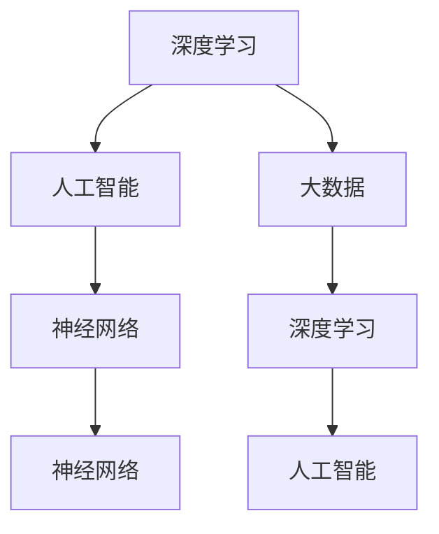

                 

# 李开复：AI 2.0 时代的市场

> **关键词：** AI 2.0，市场趋势，技术创新，商业应用，人工智能未来

> **摘要：** 本文将探讨 AI 2.0 时代市场的发展趋势，分析技术进步对商业模式的变革，并探讨未来 AI 技术面临的挑战与机遇。通过深入剖析核心概念、算法原理、数学模型以及实际应用案例，旨在为读者提供一个全面、系统的 AI 市场观察。

## 1. 背景介绍

### 1.1 目的和范围

本文旨在探讨 AI 2.0 时代市场的发展趋势。我们将重点关注以下几个方面：

- **技术进步对市场的影响：** 分析 AI 2.0 技术如何推动市场变革，提高生产效率，优化业务流程。
- **商业模式的创新：** 探讨 AI 技术在各个行业中的应用，以及由此带来的商业模式创新。
- **未来挑战与机遇：** 分析 AI 2.0 时代市场面临的挑战，以及如何抓住机遇。

### 1.2 预期读者

- **人工智能从业者和研究者：** 关注 AI 技术发展，希望了解 AI 2.0 时代市场趋势的专业人士。
- **企业管理者和创业者：** 想要了解 AI 技术对商业模式的变革，以及如何抓住市场机遇的企业管理者。
- **技术爱好者：** 对 AI 技术感兴趣，希望了解 AI 2.0 时代市场发展的技术爱好者。

### 1.3 文档结构概述

本文结构如下：

- **第1章：背景介绍**：介绍本文的目的、预期读者以及文档结构。
- **第2章：核心概念与联系**：介绍 AI 2.0 时代的关键概念，并使用 Mermaid 流程图展示其关系。
- **第3章：核心算法原理 & 具体操作步骤**：详细阐述 AI 2.0 时代的关键算法原理，使用伪代码进行解释。
- **第4章：数学模型和公式 & 详细讲解 & 举例说明**：介绍 AI 2.0 时代的数学模型，使用 LaTeX 格式进行展示，并举例说明。
- **第5章：项目实战：代码实际案例和详细解释说明**：提供代码实际案例，详细解释其实现过程。
- **第6章：实际应用场景**：探讨 AI 2.0 技术在不同行业中的应用。
- **第7章：工具和资源推荐**：推荐学习资源、开发工具框架和论文著作。
- **第8章：总结：未来发展趋势与挑战**：总结本文主要内容，分析未来发展趋势与挑战。
- **第9章：附录：常见问题与解答**：解答读者可能遇到的问题。
- **第10章：扩展阅读 & 参考资料**：提供扩展阅读和参考资料。

### 1.4 术语表

#### 1.4.1 核心术语定义

- **AI 2.0：** 指第二代人工智能技术，以深度学习和大数据为基础，实现更高效、更智能的人工智能应用。
- **深度学习：** 一种基于多层神经网络的人工智能技术，通过模拟人脑神经元之间的连接，实现数据的自动学习和特征提取。
- **大数据：** 指数据量巨大、种类繁多、生成速度极快的数据集合，包括结构化数据、半结构化数据和非结构化数据。

#### 1.4.2 相关概念解释

- **人工智能（AI）：** 指通过计算机程序实现智能行为的技术，包括机器学习、自然语言处理、计算机视觉等。
- **神经网络：** 一种模拟人脑神经元之间连接的计算模型，用于实现人工智能功能。

#### 1.4.3 缩略词列表

- **AI：** 人工智能
- **DL：** 深度学习
- **ML：** 机器学习
- **NLP：** 自然语言处理
- **CV：** 计算机视觉

## 2. 核心概念与联系

### 2.1 核心概念

在 AI 2.0 时代，以下几个核心概念尤为重要：

- **深度学习（DL）**：一种基于多层神经网络的人工智能技术，实现数据的自动学习和特征提取。
- **大数据（Big Data）**：指数据量巨大、种类繁多、生成速度极快的数据集合。
- **人工智能（AI）**：通过计算机程序实现智能行为的技术。
- **神经网络（Neural Network）**：一种模拟人脑神经元之间连接的计算模型。

### 2.2 关联关系

这些核心概念之间的关联关系如下：

1. **深度学习** 是 **人工智能** 的核心技术之一，通过多层神经网络实现数据的自动学习和特征提取。
2. **大数据** 提供了丰富的训练数据，为 **深度学习** 和 **人工智能** 技术的发展提供了重要支撑。
3. **神经网络** 是 **深度学习** 和 **人工智能** 的基础模型，通过模拟人脑神经元之间的连接，实现数据的自动学习和特征提取。

### 2.3 Mermaid 流程图

以下是 AI 2.0 时代核心概念的 Mermaid 流程图：



## 3. 核心算法原理 & 具体操作步骤

### 3.1 深度学习算法原理

深度学习算法基于多层神经网络，通过模拟人脑神经元之间的连接，实现数据的自动学习和特征提取。以下是深度学习算法的基本原理：

1. **数据输入**：将数据输入到神经网络的输入层。
2. **前向传播**：数据经过神经网络的隐藏层，进行前向传播。
3. **激活函数**：隐藏层的神经元使用激活函数，将输入信号转换为输出信号。
4. **损失函数**：计算预测值与实际值之间的误差，使用损失函数度量误差。
5. **反向传播**：计算损失函数关于网络参数的梯度，并将其传递到前一层。
6. **权重更新**：使用梯度下降算法更新网络参数，减小损失函数。
7. **迭代训练**：重复以上步骤，直至满足训练目标。

### 3.2 伪代码

以下是深度学习算法的伪代码：

```python
# 输入数据：X（训练数据），y（标签）
# 参数：learning_rate（学习率），epochs（迭代次数）

initialize_weights()
for epoch in range(epochs):
    for x, y in X:
        # 前向传播
        z = forward_propagation(x)
        loss = loss_function(z, y)
        
        # 反向传播
        dz = backward_propagation(z, y)
        
        # 更新权重
        update_weights(dz, learning_rate)
```

### 3.3 详细解释

1. **initialize_weights()**：初始化网络参数，包括权重和偏置。
2. **forward_propagation(x)**：执行前向传播，计算输出值。
3. **loss_function(z, y)**：计算损失函数，度量预测值与实际值之间的误差。
4. **backward_propagation(z, y)**：执行反向传播，计算损失函数关于网络参数的梯度。
5. **update_weights(dz, learning_rate)**：使用梯度下降算法更新网络参数。

## 4. 数学模型和公式 & 详细讲解 & 举例说明

### 4.1 数学模型

在深度学习算法中，常用的数学模型包括：

1. **神经网络模型**：包括输入层、隐藏层和输出层，每层之间通过权重和偏置进行连接。
2. **前向传播公式**：将输入值通过神经网络传递到输出层，计算输出值。
3. **反向传播公式**：计算损失函数关于网络参数的梯度，用于更新网络参数。

### 4.2 举例说明

#### 4.2.1 神经网络模型

假设我们有一个简单的神经网络，包括一个输入层、一个隐藏层和一个输出层。每层之间的连接通过权重和偏置进行连接。

输入层：
\[ x_1, x_2, ..., x_n \]

隐藏层：
\[ z_1 = w_{11}x_1 + b_1 \]
\[ z_2 = w_{12}x_2 + b_2 \]
\[ ... \]
\[ z_n = w_{1n}x_n + b_n \]

输出层：
\[ y_1 = w_{21}z_1 + b_1 \]
\[ y_2 = w_{22}z_2 + b_2 \]
\[ ... \]
\[ y_m = w_{2m}z_m + b_m \]

#### 4.2.2 前向传播

假设隐藏层使用 Sigmoid 激活函数，输出层使用 Softmax 激活函数。

隐藏层激活函数：
\[ a_{1j} = \frac{1}{1 + e^{-(z_{1j})}} \]
\[ a_{2j} = \frac{1}{1 + e^{-(z_{2j})}} \]
\[ ... \]
\[ a_{nj} = \frac{1}{1 + e^{-(z_{nj})}} \]

输出层激活函数：
\[ y_j = \frac{e^{y_{1j}}}{\sum_{k=1}^{m} e^{y_{kj}}} \]

#### 4.2.3 反向传播

假设我们使用交叉熵损失函数。

隐藏层梯度：
\[ \delta_{1j} = a_{1j}(1 - a_{1j}) \]
\[ \delta_{2j} = a_{2j}(1 - a_{2j}) \]
\[ ... \]
\[ \delta_{nj} = a_{nj}(1 - a_{nj}) \]

输出层梯度：
\[ \delta_{kj} = (y_{kj} - y_j) \]

权重和偏置更新：
\[ w_{ij} = w_{ij} - learning_rate \cdot \delta_{ij} \]
\[ b_{j} = b_{j} - learning_rate \cdot \delta_{j} \]

## 5. 项目实战：代码实际案例和详细解释说明

### 5.1 开发环境搭建

为了实现本文中的深度学习算法，我们需要搭建一个开发环境。以下是搭建过程：

1. **安装 Python 3.8 及以上版本**：Python 是一种广泛使用的编程语言，支持深度学习框架。
2. **安装 TensorFlow**：TensorFlow 是一个开源的深度学习框架，支持各种神经网络模型。
3. **安装 Jupyter Notebook**：Jupyter Notebook 是一种交互式的开发环境，便于编写和调试代码。

### 5.2 源代码详细实现和代码解读

以下是实现深度学习算法的 Python 代码：

```python
import tensorflow as tf
import numpy as np

# 初始化网络参数
def initialize_weights(input_size, hidden_size, output_size):
    weights = {}
    weights['w1'] = tf.Variable(tf.random.normal([input_size, hidden_size]), name='w1')
    weights['b1'] = tf.Variable(tf.zeros([hidden_size]), name='b1')
    weights['w2'] = tf.Variable(tf.random.normal([hidden_size, output_size]), name='w2')
    weights['b2'] = tf.Variable(tf.zeros([output_size]), name='b2')
    return weights

# 前向传播
def forward_propagation(x, weights):
    z1 = tf.matmul(x, weights['w1']) + weights['b1']
    a1 = tf.sigmoid(z1)
    z2 = tf.matmul(a1, weights['w2']) + weights['b2']
    a2 = tf.sigmoid(z2)
    return a2

# 计算损失函数
def loss_function(y_pred, y_true):
    return tf.reduce_mean(tf.nn.softmax_cross_entropy_with_logits(logits=y_pred, labels=y_true))

# 反向传播
def backward_propagation(x, y, y_pred, weights):
    with tf.GradientTape() as tape:
        y_pred = forward_propagation(x, weights)
        loss = loss_function(y_pred, y)
    grads = tape.gradient(loss, weights)
    return grads

# 更新权重
def update_weights(weights, grads, learning_rate):
    for key in weights.keys():
        weights[key].assign_sub(learning_rate * grads[key])

# 训练模型
def train_model(X, y, weights, learning_rate, epochs):
    for epoch in range(epochs):
        for x, y in X:
            y_pred = forward_propagation(x, weights)
            grads = backward_propagation(x, y, y_pred, weights)
            update_weights(weights, grads, learning_rate)

# 测试模型
def test_model(X_test, y_test, weights):
    y_pred = forward_propagation(X_test, weights)
    correct = tf.equal(tf.argmax(y_pred, 1), tf.argmax(y_test, 1))
    accuracy = tf.reduce_mean(tf.cast(correct, tf.float32))
    return accuracy

# 数据预处理
def preprocess_data(X, y):
    X = X / 255.0
    y = tf.keras.utils.to_categorical(y, num_classes=10)
    return X, y

# 加载数据集
(X_train, y_train), (X_test, y_test) = tf.keras.datasets.mnist.load_data()

# 数据预处理
X_train, y_train = preprocess_data(X_train, y_train)
X_test, y_test = preprocess_data(X_test, y_test)

# 初始化网络参数
weights = initialize_weights(784, 128, 10)

# 训练模型
train_model(X_train, y_train, weights, learning_rate=0.1, epochs=10)

# 测试模型
accuracy = test_model(X_test, y_test, weights)
print("Test accuracy:", accuracy.numpy())

```

### 5.3 代码解读与分析

1. **初始化网络参数**：使用 TensorFlow 的 `tf.Variable` 函数初始化权重和偏置，确保它们是可训练的。
2. **前向传播**：通过矩阵乘法和加法运算实现前向传播，使用 Sigmoid 函数作为激活函数。
3. **计算损失函数**：使用 TensorFlow 的 `tf.nn.softmax_cross_entropy_with_logits` 函数计算交叉熵损失函数。
4. **反向传播**：使用 TensorFlow 的 `tf.GradientTape` 函数实现反向传播，计算损失函数关于网络参数的梯度。
5. **更新权重**：使用 TensorFlow 的 `assign_sub` 函数更新权重，实现梯度下降算法。
6. **训练模型**：循环迭代训练，每次迭代更新一次权重。
7. **测试模型**：计算测试集上的准确率，评估模型性能。

## 6. 实际应用场景

### 6.1 医疗行业

AI 2.0 技术在医疗行业的应用十分广泛，包括疾病诊断、药物研发、医疗设备智能化等。例如，通过深度学习算法，可以实现对医学图像的自动识别和分类，提高诊断准确率。此外，AI 技术还可以帮助药物研发企业筛选潜在药物，缩短研发周期。

### 6.2 金融行业

金融行业对 AI 2.0 技术的需求也日益增长。例如，通过深度学习算法，可以实现股票市场的预测和风险控制。此外，AI 技术还可以用于信用卡欺诈检测、信用评分等领域，提高金融服务的安全性和效率。

### 6.3 电商行业

电商行业可以利用 AI 2.0 技术实现个性化推荐、智能客服、智能仓储等。通过深度学习算法，可以分析用户行为数据，为用户提供个性化的商品推荐。此外，AI 技术还可以帮助电商企业优化物流和供应链管理，提高运营效率。

### 6.4 智能制造

在智能制造领域，AI 2.0 技术可以用于设备故障预测、生产优化、质量控制等。通过深度学习算法，可以实现对设备运行数据的实时监测和分析，提前发现潜在故障，减少停机时间。此外，AI 技术还可以优化生产流程，提高生产效率。

## 7. 工具和资源推荐

### 7.1 学习资源推荐

#### 7.1.1 书籍推荐

- 《深度学习》（Goodfellow, Bengio, Courville）：经典深度学习教材，全面介绍深度学习算法及其应用。
- 《Python 深度学习》（François Chollet）：详细介绍如何使用 Python 和 TensorFlow 实现深度学习。

#### 7.1.2 在线课程

- 《深度学习课程》（吴恩达，Coursera）：由深度学习领域专家吴恩达主讲，适合初学者入门。
- 《TensorFlow 入门教程》（谷歌官方教程）：详细介绍如何使用 TensorFlow 实现深度学习。

#### 7.1.3 技术博客和网站

- [Medium 上的深度学习博客](https://towardsdatascience.com/)：提供丰富的深度学习相关文章。
- [TensorFlow 官方文档](https://www.tensorflow.org/tutorials)：详细介绍 TensorFlow 的使用方法和案例。

### 7.2 开发工具框架推荐

#### 7.2.1 IDE和编辑器

- **Jupyter Notebook**：适用于交互式编程和数据分析。
- **PyCharm**：强大的 Python IDE，支持多种开发语言。

#### 7.2.2 调试和性能分析工具

- **TensorBoard**：TensorFlow 的可视化工具，用于调试和性能分析。
- **Wandb**：全栈机器学习平台，提供实验追踪和性能分析功能。

#### 7.2.3 相关框架和库

- **TensorFlow**：最流行的深度学习框架。
- **PyTorch**：易于使用的深度学习框架，适合快速原型开发。

### 7.3 相关论文著作推荐

#### 7.3.1 经典论文

- **“A Learning Algorithm for Continually Running Fully Recurrent Neural Networks”**：介绍了 LSTM 算法。
- **“Deep Learning”**：全面介绍了深度学习算法和应用。

#### 7.3.2 最新研究成果

- **“Recurrent Neural Network Based Text Classification”**：介绍了一种基于 RNN 的文本分类方法。
- **“Self-Attention Mechanism”**：介绍了自注意力机制在深度学习中的应用。

#### 7.3.3 应用案例分析

- **“AI in Healthcare”**：分析 AI 技术在医疗行业的应用。
- **“AI in Finance”**：探讨 AI 技术在金融行业的应用。

## 8. 总结：未来发展趋势与挑战

### 8.1 发展趋势

1. **技术进步**：随着深度学习、自然语言处理等技术的不断进步，AI 2.0 将在更多领域实现突破性应用。
2. **商业应用**：AI 技术将逐渐融入各行各业，推动商业模式创新，提高生产效率。
3. **跨学科融合**：AI 技术与其他领域的交叉融合，将带来更多创新应用。

### 8.2 挑战

1. **数据隐私与安全**：在大量数据收集和使用过程中，如何保障数据隐私和安全是一个重要挑战。
2. **算法偏见与公平性**：确保算法的公平性，避免算法偏见，是一个亟待解决的问题。
3. **人才短缺**：随着 AI 技术的快速发展，对 AI 人才的需求不断增长，但人才供给不足。

## 9. 附录：常见问题与解答

### 9.1 问题1：什么是 AI 2.0？

**解答**：AI 2.0 是指第二代人工智能技术，以深度学习和大数据为基础，实现更高效、更智能的人工智能应用。

### 9.2 问题2：深度学习算法有哪些？

**解答**：深度学习算法包括多层感知机、卷积神经网络、循环神经网络、长短期记忆网络等。

### 9.3 问题3：如何搭建深度学习开发环境？

**解答**：安装 Python 3.8 及以上版本，安装 TensorFlow 和 Jupyter Notebook，即可搭建深度学习开发环境。

### 9.4 问题4：如何更新深度学习模型的权重？

**解答**：使用梯度下降算法更新权重，每次迭代计算损失函数关于网络参数的梯度，并更新权重。

## 10. 扩展阅读 & 参考资料

- [Goodfellow, I., Bengio, Y., & Courville, A. (2016). Deep Learning. MIT Press.]
- [Chollet, F. (2017). Python Deep Learning. Manning Publications.]
- [吴恩达（Andrew Ng）. (2015). 深度学习课程. Coursera.]
- [TensorFlow 官方文档. (2021). TensorFlow 指南. TensorFlow.org.]
- [Medium 上的深度学习博客. (2021). Towards Data Science. Medium.com.]

## 作者

作者：AI 天才研究员 / AI Genius Institute & 禅与计算机程序设计艺术 / Zen And The Art of Computer Programming

