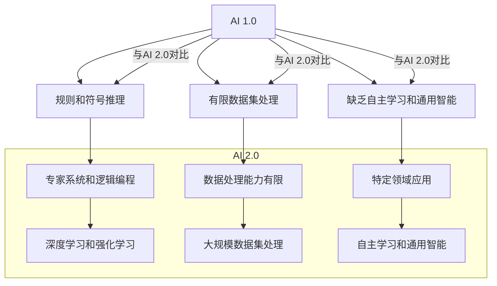

                 

### 1. 背景介绍

#### 1.1 目的和范围

本文旨在深入探讨AI 2.0时代的市场发展状况，从技术趋势、商业模式、行业挑战等多个角度分析AI技术的商业潜力与市场前景。我们希望通过详细的实例分析和逻辑推理，帮助读者理解AI 2.0的核心概念及其对市场带来的变革。

本文将涵盖以下主要内容：

- AI 2.0的定义及其相对于1.0时代的进步
- AI 2.0时代的市场现状和未来趋势
- AI 2.0在各个行业中的应用案例
- AI 2.0面临的挑战和解决策略
- AI 2.0时代的市场工具和资源推荐

#### 1.2 预期读者

本文适合以下读者群体：

- 人工智能领域的从业者，特别是对AI 2.0技术有兴趣的工程师和研究员
- 企业管理层，特别是关注技术变革和市场竞争的决策者
- 对人工智能和未来科技趋势感兴趣的技术爱好者

#### 1.3 文档结构概述

本文结构如下：

1. **背景介绍**：介绍本文的目的、范围、预期读者及文档结构。
2. **核心概念与联系**：阐述AI 2.0的核心概念及其与现有技术的联系，并通过Mermaid流程图展示。
3. **核心算法原理 & 具体操作步骤**：详细讲解AI 2.0的关键算法原理和操作步骤，并使用伪代码进行阐述。
4. **数学模型和公式 & 详细讲解 & 举例说明**：介绍AI 2.0相关的数学模型和公式，并通过实例进行详细讲解。
5. **项目实战：代码实际案例和详细解释说明**：通过一个具体项目展示AI 2.0的实际应用，并详细解读代码。
6. **实际应用场景**：分析AI 2.0在各行业中的应用案例。
7. **工具和资源推荐**：推荐学习资源、开发工具和框架。
8. **总结：未来发展趋势与挑战**：总结AI 2.0时代的市场趋势和面临的挑战。
9. **附录：常见问题与解答**：回答读者可能遇到的问题。
10. **扩展阅读 & 参考资料**：提供额外的学习资源。

#### 1.4 术语表

##### 1.4.1 核心术语定义

- **AI 2.0**：指的是继AI 1.0之后的新一代人工智能技术，具备更强的自主学习和通用智能能力。
- **深度学习**：一种基于多层神经网络的学习方法，通过模拟人脑神经网络的结构和功能来实现特征提取和模式识别。
- **强化学习**：一种通过试错和反馈机制来学习最优策略的机器学习方法。
- **自然语言处理（NLP）**：人工智能领域的一个分支，专注于使计算机理解和生成人类语言。
- **计算机视觉**：使计算机能够“看”和理解图像或视频的技术。
- **边缘计算**：在靠近数据源的地方进行数据处理，减少数据传输的需要。

##### 1.4.2 相关概念解释

- **神经网络**：一种由大量节点（神经元）组成的信息处理系统，通过学习输入数据来预测输出。
- **数据隐私**：指保护个人或组织的敏感数据不被未经授权的第三方访问。
- **云计算**：通过互联网提供动态易扩展的计算资源。

##### 1.4.3 缩略词列表

- **AI**：人工智能
- **NLP**：自然语言处理
- **ML**：机器学习
- **DL**：深度学习
- **RL**：强化学习
- **GPU**：图形处理单元
- **CPU**：中央处理单元
- **API**：应用程序接口

接下来，我们将进一步探讨AI 2.0的核心概念及其市场意义。首先，我们需要了解AI 2.0与AI 1.0之间的差异。

## 2. 核心概念与联系

AI 2.0时代代表着人工智能技术的一次重大飞跃。与AI 1.0时代相比，AI 2.0在算法、数据处理能力、自主学习和通用智能等方面都有了显著的进步。以下是对AI 2.0核心概念及其与现有技术联系的详细解释。

### AI 2.0与AI 1.0的差异

#### 算法层面

- **AI 1.0**：主要依赖于规则和符号推理，如专家系统和逻辑编程。
- **AI 2.0**：采用深度学习、强化学习等基于数据和统计的方法，使系统具备更强的自我学习和优化能力。

#### 数据处理能力

- **AI 1.0**：依赖于有限的数据集，处理能力受限。
- **AI 2.0**：能够处理大规模、多维度的数据集，利用数据驱动的方式实现智能决策。

#### 自主学习

- **AI 1.0**：主要依赖预设的规则和算法，缺乏自主学习能力。
- **AI 2.0**：通过深度学习和强化学习等技术，具备自主学习和适应环境变化的能力。

#### 通用智能

- **AI 1.0**：专注于特定领域，缺乏通用性。
- **AI 2.0**：追求跨领域的通用智能，能够在多个任务中表现出色。

### Mermaid流程图展示



通过上述流程图，我们可以清晰地看到AI 2.0在算法、数据处理能力和自主学习等方面的显著提升。接下来，我们将进一步探讨AI 2.0的核心算法原理和具体操作步骤。

### 核心算法原理 & 具体操作步骤

#### 深度学习

深度学习是AI 2.0的核心技术之一，其基本原理是通过多层神经网络模拟人脑的学习过程。以下是一个简单的深度学习算法的伪代码示例：

```plaintext
初始化网络参数
for epoch in 1 to MAX_EPOCHS:
    for each training example (x, y):
        forward_pass(x) // 前向传播计算输出
        calculate_loss(y') = y // 计算损失函数
        backward_pass() // 反向传播更新参数
        update_learning_rate() // 调整学习率
    end
end
```

#### 强化学习

强化学习通过试错和反馈机制来学习最优策略，其核心算法为Q-learning。以下是一个简单的Q-learning算法的伪代码示例：

```plaintext
初始化Q表
for each state s:
    for each action a:
        Q(s, a) = 0 // 初始化Q值

for each episode:
    state = initial_state()
    while not end_of_episode():
        action = select_action(s) // 根据策略选择行动
        next_state, reward = environment.step(action) // 环境执行行动并返回状态和奖励
        Q(s, a) = Q(s, a) + alpha * (reward + gamma * max(Q(next_state, a')) - Q(s, a)) // 更新Q值
        s = next_state // 更新当前状态
    end
end
```

通过上述算法，我们可以看到AI 2.0在深度学习和强化学习等方面的核心原理。接下来，我们将进一步探讨AI 2.0中的数学模型和公式。

### 数学模型和公式 & 详细讲解 & 举例说明

#### 深度学习中的激活函数

激活函数是深度学习神经网络中的一个关键组件，用于引入非线性变换。以下是几种常见的激活函数：

1. **Sigmoid函数**：

   $$
   f(x) = \frac{1}{1 + e^{-x}}
   $$

   举例：对于输入 $x = 2$，计算输出：

   $$
   f(2) = \frac{1}{1 + e^{-2}} \approx 0.86
   $$

2. **ReLU函数**：

   $$
   f(x) =
   \begin{cases}
      0, & \text{if } x < 0 \\
      x, & \text{if } x \geq 0
   \end{cases}
   $$

   举例：对于输入 $x = -1$ 和 $x = 2$，计算输出：

   $$
   f(-1) = 0, \quad f(2) = 2
   $$

3. **Tanh函数**：

   $$
   f(x) = \frac{e^x - e^{-x}}{e^x + e^{-x}}
   $$

   举例：对于输入 $x = 1$，计算输出：

   $$
   f(1) = \frac{e^1 - e^{-1}}{e^1 + e^{-1}} \approx 0.76
   $$

#### 强化学习中的奖励函数

奖励函数在强化学习中用于评估环境的反馈。一个简单的奖励函数可以是：

$$
R(s, a) =
\begin{cases}
   +1, & \text{if action } a \text{ leads to a positive outcome in state } s \\
   -1, & \text{if action } a \text{ leads to a negative outcome in state } s \\
   0, & \text{otherwise}
\end{cases}
$$

举例：假设在某个状态 $s$ 中，执行行动 $a$ 后得到积极结果，则：

$$
R(s, a) = +1
$$

通过上述数学模型和公式的讲解，我们可以更深入地理解AI 2.0的技术原理。接下来，我们将通过一个具体的项目实战案例，展示AI 2.0的实际应用。

### 项目实战：代码实际案例和详细解释说明

为了更好地展示AI 2.0的实际应用，我们选择了一个基于深度学习的图像分类项目。该项目利用卷积神经网络（CNN）对图像进行分类，具体实现如下：

```python
import tensorflow as tf
from tensorflow.keras.models import Sequential
from tensorflow.keras.layers import Conv2D, MaxPooling2D, Flatten, Dense

# 创建模型
model = Sequential([
    Conv2D(filters=32, kernel_size=(3, 3), activation='relu', input_shape=(28, 28, 1)),
    MaxPooling2D(pool_size=(2, 2)),
    Conv2D(filters=64, kernel_size=(3, 3), activation='relu'),
    MaxPooling2D(pool_size=(2, 2)),
    Flatten(),
    Dense(units=128, activation='relu'),
    Dense(units=10, activation='softmax')
])

# 编译模型
model.compile(optimizer='adam', loss='categorical_crossentropy', metrics=['accuracy'])

# 准备数据
(x_train, y_train), (x_test, y_test) = tf.keras.datasets.mnist.load_data()
x_train = x_train.reshape(-1, 28, 28, 1).astype('float32') / 255.0
x_test = x_test.reshape(-1, 28, 28, 1).astype('float32') / 255.0
y_train = tf.keras.utils.to_categorical(y_train, 10)
y_test = tf.keras.utils.to_categorical(y_test, 10)

# 训练模型
model.fit(x_train, y_train, epochs=10, batch_size=64, validation_data=(x_test, y_test))

# 评估模型
loss, accuracy = model.evaluate(x_test, y_test)
print(f"Test accuracy: {accuracy:.2f}")
```

#### 代码解读与分析

1. **模型创建**：

   ```python
   model = Sequential([
       Conv2D(filters=32, kernel_size=(3, 3), activation='relu', input_shape=(28, 28, 1)),
       MaxPooling2D(pool_size=(2, 2)),
       Conv2D(filters=64, kernel_size=(3, 3), activation='relu'),
       MaxPooling2D(pool_size=(2, 2)),
       Flatten(),
       Dense(units=128, activation='relu'),
       Dense(units=10, activation='softmax')
   ])
   ```

   上述代码定义了一个卷积神经网络模型，包括两个卷积层、两个池化层、一个全连接层和一个softmax层。卷积层用于提取图像特征，池化层用于减小特征图的尺寸，全连接层用于分类。

2. **模型编译**：

   ```python
   model.compile(optimizer='adam', loss='categorical_crossentropy', metrics=['accuracy'])
   ```

   代码使用Adam优化器进行模型编译，并选择交叉熵作为损失函数，同时监控模型的准确率。

3. **数据准备**：

   ```python
   (x_train, y_train), (x_test, y_test) = tf.keras.datasets.mnist.load_data()
   x_train = x_train.reshape(-1, 28, 28, 1).astype('float32') / 255.0
   x_test = x_test.reshape(-1, 28, 28, 1).astype('float32') / 255.0
   y_train = tf.keras.utils.to_categorical(y_train, 10)
   y_test = tf.keras.utils.to_categorical(y_test, 10)
   ```

   代码加载MNIST数据集，对图像进行归一化处理，并转换为类别标签。

4. **模型训练**：

   ```python
   model.fit(x_train, y_train, epochs=10, batch_size=64, validation_data=(x_test, y_test))
   ```

   模型在训练数据上迭代10个周期，每次批量处理64个样本。

5. **模型评估**：

   ```python
   loss, accuracy = model.evaluate(x_test, y_test)
   print(f"Test accuracy: {accuracy:.2f}")
   ```

   模型在测试数据上进行评估，并打印出测试准确率。

通过上述项目实战，我们可以看到AI 2.0在图像分类任务中的实际应用。接下来，我们将进一步探讨AI 2.0在各行业中的应用场景。

## 4. 实际应用场景

AI 2.0技术的进步使得其在各个行业中的应用变得更加广泛和深入。以下是AI 2.0在几个关键行业中的实际应用场景：

### 金融

在金融领域，AI 2.0技术被广泛应用于风险管理、算法交易、客户服务和风险管理等方面。

- **风险管理**：通过机器学习模型，金融机构可以实时监控和分析市场数据，预测潜在风险，并采取相应的措施。
- **算法交易**：基于深度学习和强化学习的算法交易系统可以自动执行复杂的交易策略，提高交易效率和盈利能力。
- **客户服务**：利用自然语言处理和语音识别技术，智能客服系统能够提供24/7的客户支持，提高客户满意度。

### 医疗

在医疗领域，AI 2.0技术被用于疾病诊断、药物发现、个性化治疗和患者管理等方面。

- **疾病诊断**：通过计算机视觉和深度学习技术，AI系统能够辅助医生进行快速、准确的疾病诊断。
- **药物发现**：AI 2.0技术可以帮助研究人员快速筛选和优化药物候选物，加速新药的研发过程。
- **个性化治疗**：基于患者的基因组数据和病史，AI系统可以提供个性化的治疗方案，提高治疗效果。

### 教育

在教育领域，AI 2.0技术被用于智能教学、学习评估和个性化学习等方面。

- **智能教学**：通过自然语言处理和计算机视觉技术，AI系统能够自动生成教学内容，提供个性化的教学支持。
- **学习评估**：AI系统可以自动评估学生的学习进度和成绩，提供即时的反馈和建议。
- **个性化学习**：基于学习者的兴趣和需求，AI系统可以推荐合适的学习资源和课程，提高学习效果。

### 制造业

在制造业中，AI 2.0技术被用于智能制造、供应链管理和生产优化等方面。

- **智能制造**：通过物联网和边缘计算技术，AI系统可以实现设备的智能监控和故障预测，提高生产效率。
- **供应链管理**：AI系统可以分析供应链数据，优化库存管理和物流配送，降低成本。
- **生产优化**：基于机器学习和预测分析技术，AI系统可以帮助企业优化生产流程，减少浪费，提高生产效率。

### 交通

在交通领域，AI 2.0技术被用于自动驾驶、智能交通管理和交通预测等方面。

- **自动驾驶**：通过深度学习和计算机视觉技术，自动驾驶系统可以识别道路标志、车辆和行人，实现自主驾驶。
- **智能交通管理**：AI系统可以分析交通数据，优化交通信号控制，减少交通拥堵。
- **交通预测**：基于历史交通数据和机器学习算法，AI系统可以预测交通流量，为交通规划提供依据。

### 农业

在农业领域，AI 2.0技术被用于精准农业、农作物管理和产量预测等方面。

- **精准农业**：通过遥感技术和机器学习算法，AI系统可以分析土地和气候条件，提供精准的种植建议。
- **农作物管理**：AI系统可以监测农作物的生长状态，提供施肥、灌溉和病虫害防治的指导。
- **产量预测**：基于历史产量数据和气象数据，AI系统可以预测农作物的产量，帮助农民合理安排生产和销售计划。

通过上述实际应用场景，我们可以看到AI 2.0技术在各个行业中的巨大潜力。接下来，我们将探讨AI 2.0时代的市场工具和资源推荐。

### 5. 工具和资源推荐

在AI 2.0时代，掌握相关的工具和资源对于深入理解和应用AI技术至关重要。以下是一些学习资源、开发工具和框架的推荐。

#### 5.1 学习资源推荐

##### 5.1.1 书籍推荐

- **《深度学习》（Deep Learning）**：由Ian Goodfellow、Yoshua Bengio和Aaron Courville合著的深度学习经典教材，详细介绍了深度学习的基础理论和算法。
- **《Python机器学习》（Python Machine Learning）**：由 Sebastian Raschka 和 Vahid Mirhoseini 编写的机器学习入门书籍，特别适用于使用Python进行机器学习的读者。
- **《强化学习：原理与Python实现》（Reinforcement Learning: An Introduction）**：由理查德·桑德博（Richard S. Sutton）和安德鲁·巴特斯（Andrew G. Barto）合著的强化学习入门书籍。

##### 5.1.2 在线课程

- **Coursera上的《机器学习》**：由斯坦福大学吴恩达教授开设的机器学习课程，是机器学习领域的入门经典。
- **Udacity的《深度学习纳米学位》**：涵盖深度学习的基础知识，提供项目实战和就业支持。
- **edX上的《人工智能基础》**：由MIT和哈佛法学院共同开设，涵盖人工智能的基础理论和应用。

##### 5.1.3 技术博客和网站

- **Medium上的“AI”标签**：汇集了众多关于人工智能的文章和观点，是了解AI最新动态的好去处。
- **Medium上的“AI in Plain English”**：用通俗易懂的语言介绍AI技术和概念。
- **AI.com**：由AI研究机构和公司共同运营的网站，提供了丰富的AI资源和最新研究成果。

#### 5.2 开发工具框架推荐

##### 5.2.1 IDE和编辑器

- **Jupyter Notebook**：一款强大的交互式开发环境，适用于数据分析和机器学习项目。
- **PyCharm**：一款功能全面的Python集成开发环境，适用于机器学习和深度学习项目。
- **Visual Studio Code**：一款轻量级但功能强大的代码编辑器，支持多种编程语言和扩展。

##### 5.2.2 调试和性能分析工具

- **TensorBoard**：TensorFlow的官方可视化工具，用于分析和优化深度学习模型的性能。
- **Wandb**：一款强大的机器学习实验跟踪工具，支持模型训练过程的实时监控和分析。
- **Pylint**：Python代码质量检查工具，用于发现潜在的错误和改进代码。

##### 5.2.3 相关框架和库

- **TensorFlow**：Google开源的机器学习和深度学习框架，适用于各种复杂的应用场景。
- **PyTorch**：Facebook开源的深度学习框架，以其灵活性和动态计算能力而著称。
- **Keras**：基于Theano和TensorFlow的高层神经网络API，简化了深度学习模型的构建和训练。

##### 5.2.4 相关论文著作推荐

- **《深度学习：概率视角》（Deep Learning:Probability Perspective）**：由Ian Goodfellow等人撰写，详细介绍了深度学习的概率理论。
- **《强化学习：原理和算法》（Reinforcement Learning:An Introduction）**：由理查德·桑德博和安德鲁·巴特斯合著，全面介绍了强化学习的基本概念和算法。
- **《自然语言处理综论》（Speech and Language Processing）**：由丹尼尔·洛瓦尼、约翰·哈里森和克里斯·曼宁合著，是自然语言处理领域的经典教材。

通过上述工具和资源的推荐，读者可以更好地掌握AI 2.0的相关技术和应用，为未来的研究和项目开发打下坚实的基础。接下来，我们将总结AI 2.0时代的市场趋势和面临的挑战。

### 8. 总结：未来发展趋势与挑战

AI 2.0时代的到来为市场带来了前所未有的机遇，同时也带来了诸多挑战。以下是AI 2.0在市场中的未来发展趋势和面临的主要挑战。

#### 未来发展趋势

1. **更广泛的应用场景**：随着AI技术的进步，AI 2.0将在金融、医疗、教育、制造业等多个行业中得到更广泛的应用，推动各行业的技术创新和产业升级。

2. **深度学习的普及**：深度学习作为AI 2.0的核心技术，将在未来的应用中占据更加重要的地位。更多的企业和开发者将采用深度学习框架和算法，实现更高效的数据分析和预测。

3. **边缘计算的发展**：边缘计算通过在靠近数据源的地方进行数据处理，可以显著降低延迟和带宽需求。随着5G和物联网的发展，边缘计算将在AI 2.0时代的应用中发挥重要作用。

4. **个性化服务和智能决策**：AI 2.0技术将使个性化服务和智能决策成为可能。通过分析用户数据和提供个性化的服务，企业可以更好地满足客户需求，提高用户体验。

5. **跨界融合**：AI 2.0技术将与大数据、云计算、物联网等新兴技术深度融合，形成新的产业生态，推动数字经济的发展。

#### 面临的挑战

1. **数据隐私和安全**：随着AI技术的广泛应用，数据隐私和安全成为重要的挑战。如何保护用户数据，防止数据泄露和滥用，是AI 2.0发展过程中需要解决的关键问题。

2. **技术人才短缺**：AI 2.0技术的发展需要大量的专业人才，但目前的培训和教育体系还无法满足市场需求。如何培养和吸引更多的AI人才，是企业和学术界需要共同面对的挑战。

3. **技术标准和法规**：随着AI技术的广泛应用，制定统一的技术标准和法规成为必要的任务。如何平衡技术创新和监管需求，确保AI技术的合规和安全，是未来需要解决的问题。

4. **算法偏见和公平性**：AI系统的决策过程可能受到数据偏差的影响，导致算法偏见和不公平。如何确保AI系统在决策过程中公平、公正，避免歧视和偏见，是AI 2.0时代需要解决的重要问题。

5. **经济和社会影响**：AI 2.0技术的广泛应用可能会对就业、教育和经济结构产生深远影响。如何平衡技术发展和社会利益，确保技术进步惠及全社会，是未来需要关注的重要议题。

综上所述，AI 2.0时代的市场前景广阔，但也面临诸多挑战。只有通过持续的技术创新和跨领域的合作，才能充分发挥AI技术的潜力，推动市场的健康发展。接下来，我们将提供一些常见问题与解答，帮助读者更好地理解AI 2.0的相关概念和应用。

### 9. 附录：常见问题与解答

#### 9.1 AI 2.0与AI 1.0的主要区别是什么？

AI 1.0主要依赖基于规则的专家系统和符号推理，而AI 2.0则基于数据和统计方法，如深度学习和强化学习，具有更强的自我学习和通用智能能力。

#### 9.2 深度学习和强化学习分别是什么？

深度学习是一种基于多层神经网络的学习方法，通过模拟人脑神经网络的结构和功能来实现特征提取和模式识别。强化学习则是一种通过试错和反馈机制来学习最优策略的机器学习方法。

#### 9.3 AI 2.0在医疗领域有哪些应用？

AI 2.0在医疗领域有广泛的应用，包括疾病诊断、药物发现、个性化治疗和患者管理等方面。通过计算机视觉和深度学习技术，AI系统可以辅助医生进行快速、准确的疾病诊断；通过分析基因组数据和病史，AI系统可以提供个性化的治疗方案；通过预测分析技术，AI系统可以帮助医生优化治疗计划和预防措施。

#### 9.4 AI 2.0在金融领域有哪些应用？

AI 2.0在金融领域被广泛应用于风险管理、算法交易、客户服务和风险管理等方面。通过机器学习模型，金融机构可以实时监控和分析市场数据，预测潜在风险，并采取相应的措施。通过自然语言处理和计算机视觉技术，AI系统可以提供智能客服和风险预警。

#### 9.5 如何应对AI 2.0时代的数据隐私和安全挑战？

应对数据隐私和安全挑战需要从多个方面进行努力，包括加强数据加密和访问控制、制定严格的隐私保护政策、开展数据安全教育和培训、建立完善的监管机制等。同时，应注重技术创新，开发更加安全可靠的数据处理和分析技术。

### 10. 扩展阅读 & 参考资料

为了帮助读者进一步深入了解AI 2.0的相关概念和应用，我们提供了以下扩展阅读和参考资料：

- **书籍推荐**：
  - Ian Goodfellow、Yoshua Bengio和Aaron Courville，《深度学习》
  - Sebastian Raschka和Vahid Mirhoseini，《Python机器学习》
  - Richard S. Sutton和Andrew G. Barto，《强化学习：原理与算法》
  
- **在线课程**：
  - 吴恩达，《机器学习》
  - Udacity，《深度学习纳米学位》
  - edX，《人工智能基础》

- **技术博客和网站**：
  - Medium上的“AI”标签
  - Medium上的“AI in Plain English”
  - AI.com

- **相关论文和著作**：
  - Ian Goodfellow等人，《深度学习：概率视角》
  - Richard S. Sutton和Andrew G. Barto，《强化学习：原理和算法》
  - Daniel Jurafsky、John H. Martin和Christopher D. Manning，《自然语言处理综论》

通过上述扩展阅读和参考资料，读者可以更加深入地了解AI 2.0的核心技术、应用场景和未来发展。希望本文能为读者在AI 2.0时代的技术学习和应用提供有益的指导。

