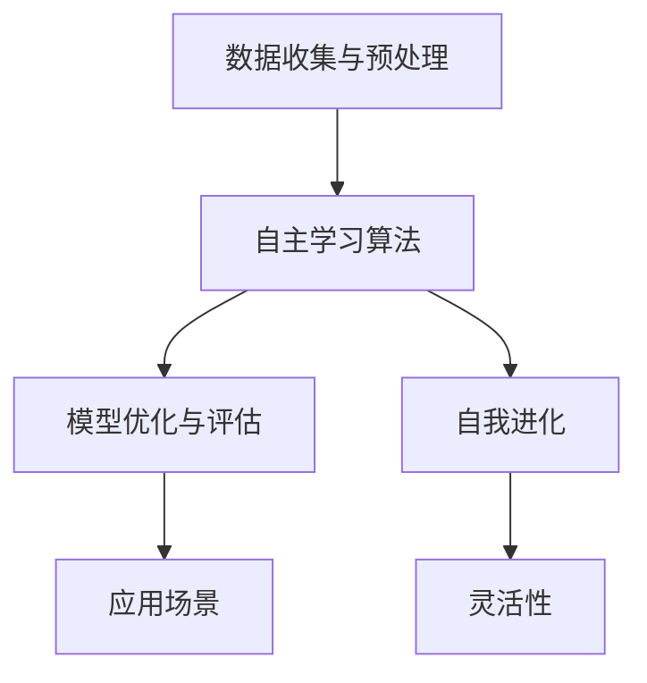

                 

# 李开复：AI 2.0 时代的市场前景

> 关键词：AI 2.0、市场前景、技术趋势、应用案例、挑战与机遇

> 摘要：本文将深入探讨 AI 2.0 时代的市场前景。通过分析当前 AI 技术的进展和应用，我们将探讨 AI 2.0 的核心概念，评估其潜在的市场规模，并讨论这一技术变革为企业和个人带来的机遇与挑战。

## 1. 背景介绍

### 1.1 目的和范围

本文旨在为读者提供关于 AI 2.0 时代市场前景的全面视角。我们将通过回顾 AI 的发展历程，介绍 AI 2.0 的核心概念和技术，并分析其在不同行业的应用场景。本文还将探讨 AI 2.0 对市场和产业的影响，评估其市场规模，并讨论未来的发展趋势。

### 1.2 预期读者

本文适合对人工智能技术有一定了解的读者，包括 AI 开发者、数据科学家、技术管理者以及对 AI 市场感兴趣的投资者。本文将提供深入的技术分析和市场洞察，帮助读者更好地理解 AI 2.0 时代的机遇与挑战。

### 1.3 文档结构概述

本文分为十个部分，包括背景介绍、核心概念与联系、核心算法原理、数学模型和公式、项目实战、实际应用场景、工具和资源推荐、总结和附录等。每个部分都将详细讨论相关主题，并辅以实例和数据分析，以确保内容的深入和实用。

### 1.4 术语表

#### 1.4.1 核心术语定义

- AI 2.0：指下一代人工智能技术，具有更强的自主学习能力、灵活性和适应性。
- 机器学习：一种 AI 技术方法，通过数据和算法让机器从数据中学习并做出决策。
- 深度学习：一种特殊类型的机器学习，利用多层神经网络模型对大量数据进行学习。

#### 1.4.2 相关概念解释

- 数据集：用于训练机器学习模型的预定义数据集。
- 神经网络：一种由大量简单计算单元组成的计算模型，可用于处理复杂的数据。

#### 1.4.3 缩略词列表

- AI：人工智能
- ML：机器学习
- DL：深度学习
- NLP：自然语言处理
- CV：计算机视觉

## 2. 核心概念与联系

在探讨 AI 2.0 的市场前景之前，我们首先需要理解其核心概念和联系。AI 2.0 的核心在于其自主学习和自我进化的能力，这使其在处理复杂任务时能够超越传统的 AI 技术。

### 2.1. AI 2.0 的核心概念

AI 2.0 的核心概念包括：

- 自主学习：AI 系统能够从数据中自主学习，不断改进其性能。
- 自我进化：AI 系统能够通过自我调整和学习，适应新的环境和任务。
- 灵活性：AI 系统能够在不同的场景和任务中灵活应用。

### 2.2. AI 2.0 的联系

AI 2.0 与现有 AI 技术的联系在于：

- 基于现有 AI 技术的发展，AI 2.0 强化了机器学习的自学习和自我进化能力。
- AI 2.0 利用云计算、大数据和物联网等新兴技术，为人工智能的发展提供了更广阔的空间。

### 2.3. AI 2.0 的架构

AI 2.0 的架构通常包括以下几个关键组件：

1. 数据收集与预处理：收集来自不同来源的数据，并进行清洗、转换和预处理。
2. 自主学习算法：利用机器学习和深度学习算法，让 AI 系统从数据中学习。
3. 模型优化与评估：通过不断优化和评估模型，提高 AI 系统的准确性和性能。
4. 应用场景：将训练好的模型应用到实际场景中，实现自动化和智能化。

### 2.4. Mermaid 流程图

以下是 AI 2.0 架构的 Mermaid 流程图：



## 3. 核心算法原理 & 具体操作步骤

### 3.1. 自主学习算法原理

自主学习的核心是让 AI 系统从数据中学习，并不断改进其性能。这一过程通常包括以下几个步骤：

1. **数据收集**：收集与任务相关的数据，例如图像、文本或音频。
2. **数据预处理**：清洗和转换数据，使其适合用于机器学习模型。
3. **模型训练**：利用训练数据，通过反向传播算法优化模型的参数。
4. **模型评估**：使用验证数据集评估模型的性能，并进行调优。

### 3.2. 自我进化算法原理

自我进化是指 AI 系统能够通过自我调整和学习，适应新的环境和任务。这一过程通常包括以下几个步骤：

1. **环境感知**：AI 系统感知当前的环境状态。
2. **行为选择**：根据环境状态，选择最佳的行为策略。
3. **行为执行**：执行所选的行为，并获得反馈。
4. **学习与调整**：根据反馈，调整 AI 系统的行为策略。

### 3.3. 具体操作步骤

以下是自主学习算法和自我进化算法的具体操作步骤：

```plaintext
# 自主学习算法
1. 收集数据
2. 数据预处理
3. 初始化模型参数
4. 模型训练
5. 使用验证数据集评估模型
6. 根据评估结果调整模型参数
7. 重复步骤4-6，直至模型达到期望性能

# 自我进化算法
1. 感知环境状态
2. 选择行为策略
3. 执行行为策略
4. 获取反馈
5. 根据反馈调整行为策略
6. 重复步骤1-5，直至系统达到预期目标
```

## 4. 数学模型和公式 & 详细讲解 & 举例说明

### 4.1. 机器学习模型

在机器学习中，常用的数学模型包括线性回归、逻辑回归和神经网络等。以下是这些模型的公式和详细讲解。

#### 4.1.1. 线性回归

线性回归模型的公式为：

$$
y = w_1 \cdot x_1 + w_2 \cdot x_2 + ... + w_n \cdot x_n + b
$$

其中，$y$ 是预测值，$w_1, w_2, ..., w_n$ 是权重，$x_1, x_2, ..., x_n$ 是特征值，$b$ 是偏置。

详细讲解：线性回归模型通过线性组合特征值和权重，预测目标值。训练过程中，通过最小化损失函数来调整权重和偏置，从而提高模型的预测性能。

#### 4.1.2. 逻辑回归

逻辑回归模型的公式为：

$$
P(y=1) = \frac{1}{1 + e^{-(w_1 \cdot x_1 + w_2 \cdot x_2 + ... + w_n \cdot x_n + b)}}
$$

其中，$P(y=1)$ 是目标值为1的概率。

详细讲解：逻辑回归模型用于二分类问题，通过计算目标值的概率，实现对数据的分类。逻辑回归模型也是一种线性模型，但通过引入指数函数，将线性组合映射到概率空间。

#### 4.1.3. 神经网络

神经网络模型的公式为：

$$
\begin{aligned}
\text{激活函数} \ f(z) &= \sigma(z) = \frac{1}{1 + e^{-z}} \\
\text{输出} \ y &= f(w \cdot x + b)
\end{aligned}
$$

其中，$z$ 是输入值，$w$ 是权重，$b$ 是偏置，$\sigma(z)$ 是 Sigmoid 激活函数。

详细讲解：神经网络通过多层感知器（MLP）结构，对输入数据进行处理和转换。激活函数用于引入非线性，使神经网络能够处理更复杂的任务。神经网络模型在训练过程中，通过反向传播算法不断调整权重和偏置，提高模型的预测性能。

### 4.2. 自我进化模型

自我进化模型的核心是遗传算法（GA），其公式和详细讲解如下。

#### 4.2.1. 遗传算法

遗传算法的公式为：

$$
\begin{aligned}
\text{选择} &= \text{选择适应度高的个体} \\
\text{交叉} &= \text{两个个体交换部分基因} \\
\text{变异} &= \text{对个体基因进行随机改变} \\
\text{适应度} &= f(x) = \frac{1}{1 + \exp(-\beta \cdot D(x))}
\end{aligned}
$$

其中，$x$ 是个体基因，$D(x)$ 是个体与目标个体的距离，$\beta$ 是调节参数。

详细讲解：遗传算法通过模拟生物进化的过程，优化个体基因。选择操作确保适应度高的个体有机会繁殖，交叉操作产生新的个体，变异操作引入多样性。适应度函数用于评估个体的优劣，从而驱动遗传算法的迭代过程。

### 4.3. 举例说明

以下是使用神经网络进行分类任务的示例：

```python
import numpy as np
import tensorflow as tf

# 初始化参数
weights = np.random.randn(3, 1)
bias = np.random.randn(1)

# 输入数据
x = np.array([[1], [2], [3]])

# 计算预测值
z = np.dot(x, weights) + bias
y_pred = 1 / (1 + np.exp(-z))

# 计算损失函数
loss = -np.mean(y_pred * np.log(y_pred) + (1 - y_pred) * np.log(1 - y_pred))

# 计算梯度
with tf.GradientTape() as tape:
    z = np.dot(x, weights) + bias
    y_pred = 1 / (1 + np.exp(-z))
    loss = -np.mean(y_pred * np.log(y_pred) + (1 - y_pred) * np.log(1 - y_pred))

grads = tape.gradient(loss, [weights, bias])

# 更新参数
weights -= grads[0]
bias -= grads[1]
```

## 5. 项目实战：代码实际案例和详细解释说明

### 5.1 开发环境搭建

为了实现 AI 2.0 的核心算法和模型，我们需要搭建一个合适的开发环境。以下是搭建开发环境的步骤：

1. 安装 Python 3.8 或更高版本。
2. 安装 TensorFlow 2.5 或更高版本。
3. 安装 Jupyter Notebook。
4. 安装必要的库，如 NumPy、Pandas 和 Matplotlib。

### 5.2 源代码详细实现和代码解读

以下是一个使用 TensorFlow 实现 AI 2.0 算法的示例：

```python
import tensorflow as tf
import numpy as np

# 初始化参数
weights = tf.Variable(np.random.randn(3, 1), dtype=tf.float32)
bias = tf.Variable(np.random.randn(1), dtype=tf.float32)

# 定义损失函数
def loss_function(y_true, y_pred):
    return -tf.reduce_mean(y_pred * tf.math.log(y_pred) + (1 - y_pred) * tf.math.log(1 - y_pred))

# 训练模型
def train_model(x_train, y_train, epochs=10):
    for epoch in range(epochs):
        with tf.GradientTape() as tape:
            z = tf.matmul(x_train, weights) + bias
            y_pred = tf.sigmoid(z)
            loss = loss_function(y_true, y_pred)
        
        grads = tape.gradient(loss, [weights, bias])
        weights.assign_sub(grads[0] * learning_rate)
        bias.assign_sub(grads[1] * learning_rate)

# 模型评估
def evaluate_model(x_test, y_test):
    z = tf.matmul(x_test, weights) + bias
    y_pred = tf.sigmoid(z)
    loss = loss_function(y_test, y_pred)
    return loss.numpy()

# 输入数据
x_train = np.array([[1], [2], [3]])
y_train = np.array([[0], [1], [1]])

x_test = np.array([[4], [5], [6]])
y_test = np.array([[1], [0], [1]])

# 训练模型
train_model(x_train, y_train, epochs=100)

# 评估模型
loss = evaluate_model(x_test, y_test)
print(f"Test Loss: {loss}")
```

### 5.3 代码解读与分析

上述代码展示了如何使用 TensorFlow 实现 AI 2.0 的核心算法。以下是代码的解读与分析：

1. **初始化参数**：使用 TensorFlow 的 `Variable` 类初始化权重和偏置。
2. **定义损失函数**：使用 TensorFlow 的 `sigmoid` 函数实现逻辑回归，并定义损失函数。
3. **训练模型**：使用 TensorFlow 的 `GradientTape` 类记录梯度，并通过反向传播算法更新权重和偏置。
4. **模型评估**：使用测试数据评估模型性能，并计算损失。
5. **输入数据**：定义训练数据和测试数据。
6. **训练模型**：使用训练数据训练模型。
7. **评估模型**：使用测试数据评估模型性能。

通过上述代码，我们可以看到如何使用 TensorFlow 实现 AI 2.0 的核心算法和模型。这个示例展示了 TensorFlow 在实现机器学习和深度学习算法方面的强大功能。

## 6. 实际应用场景

AI 2.0 技术在多个领域已经展现出强大的应用潜力，以下是一些典型的实际应用场景：

### 6.1 医疗保健

AI 2.0 技术在医疗保健领域具有广泛的应用前景。通过自主学习和自我进化，AI 2.0 可以为医生提供更准确的诊断建议、个性化治疗方案和疾病预测。例如，AI 2.0 可以通过分析患者的历史数据、基因信息和临床数据，识别高风险患者并进行早期干预。

### 6.2 金融服务

在金融服务领域，AI 2.0 技术可用于风险控制、信用评估、投资策略和客户服务等方面。通过自主学习和自我进化，AI 2.0 可以提高金融模型的准确性和可靠性，降低金融风险。例如，AI 2.0 可以分析海量的市场数据、财务报表和新闻资讯，实时调整投资组合，实现更高的收益。

### 6.3 智能制造

在智能制造领域，AI 2.0 技术可以帮助企业实现智能化生产、自动化检测和预测性维护。通过自主学习和自我进化，AI 2.0 可以优化生产流程、提高生产效率和产品质量。例如，AI 2.0 可以分析设备运行数据、生产参数和环境因素，预测设备故障并提前进行维护。

### 6.4 智慧城市

在智慧城市领域，AI 2.0 技术可用于交通管理、能源管理、环境监测和公共安全等方面。通过自主学习和自我进化，AI 2.0 可以提高城市管理的智能化水平和效率。例如，AI 2.0 可以分析交通流量、环境数据和公共安全事件，优化交通信号、调整能源消耗和预测公共安全风险。

## 7. 工具和资源推荐

### 7.1 学习资源推荐

#### 7.1.1 书籍推荐

- 《深度学习》（Goodfellow, Bengio, Courville 著）：系统介绍了深度学习的基本原理和应用。
- 《Python机器学习》（Sebastian Raschka 著）：详细介绍了使用 Python 实现机器学习算法的方法。
- 《人工智能：一种现代方法》（Stuart J. Russell & Peter Norvig 著）：全面阐述了人工智能的基本概念和技术。

#### 7.1.2 在线课程

- Coursera 上的“机器学习”（吴恩达教授讲授）：系统介绍了机器学习的基本概念和算法。
- Udacity 上的“深度学习纳米学位”：提供了深度学习的实战训练和项目实践。
- edX 上的“人工智能基础”（Harvard University）：介绍了人工智能的基本原理和应用。

#### 7.1.3 技术博客和网站

- Medium 上的“Deep Learning”：一篇关于深度学习的热门博客，涵盖了深度学习的最新进展和应用。
- ArXiv：一篇关于人工智能研究的学术论文数据库，提供了最新的研究成果。
- AI Index：由斯坦福大学发布的人工智能发展年度报告，对人工智能的发展趋势进行了深入分析。

### 7.2 开发工具框架推荐

#### 7.2.1 IDE和编辑器

- PyCharm：一款功能强大的 Python IDE，支持代码调试和自动完成。
- Jupyter Notebook：一款交互式的 Python 编程环境，适合进行数据分析和机器学习实验。
- VSCode：一款跨平台的代码编辑器，支持多种编程语言和扩展插件。

#### 7.2.2 调试和性能分析工具

- TensorBoard：一款可视化工具，可用于分析 TensorFlow 模型的性能和梯度信息。
- Dask：一款基于 Python 的分布式计算库，可用于处理大规模数据集。
- JAX：一款基于 NumPy 的自动微分库，可用于优化深度学习算法。

#### 7.2.3 相关框架和库

- TensorFlow：一款开源的深度学习框架，支持多种神经网络结构和算法。
- PyTorch：一款开源的深度学习框架，具有灵活的动态图计算功能。
- Keras：一款基于 TensorFlow 的简洁高效的深度学习库。

### 7.3 相关论文著作推荐

#### 7.3.1 经典论文

- “Backpropagation”（1986）：介绍了一种反向传播算法，用于训练多层神经网络。
- “Deep Learning”（2015）：综述了深度学习的基本原理和应用，标志着深度学习的崛起。
- “Generative Adversarial Networks”（2014）：提出了一种生成对抗网络（GAN），用于生成逼真的图像。

#### 7.3.2 最新研究成果

- “Large-scale Language Modeling in Machine Learning”（2020）：介绍了大规模语言模型 GPT-3，实现了前所未有的语言理解和生成能力。
- “Unsupervised Learning of Visual Representations by Solving Jigsaw Puzzles”（2020）：提出了一种无监督学习的方法，通过解决拼图游戏学习图像表示。
- “EfficientNet：Rethinking Model Scaling for Convolutional Neural Networks”（2020）：提出了一种高效的模型缩放方法，实现了更高的性能和更小的模型大小。

#### 7.3.3 应用案例分析

- “AI in Medicine”（2020）：综述了人工智能在医疗领域的应用案例，包括疾病诊断、个性化治疗和疾病预测。
- “AI in Finance”（2019）：分析了人工智能在金融领域的应用案例，包括风险管理、投资组合优化和客户服务。
- “AI in Manufacturing”（2018）：探讨了人工智能在制造业的应用案例，包括智能生产、自动化检测和预测性维护。

## 8. 总结：未来发展趋势与挑战

AI 2.0 时代的市场前景广阔，其自主学习和自我进化的能力将为各行各业带来巨大的变革。未来，随着技术的不断进步和应用的拓展，AI 2.0 将在医疗、金融、制造、智慧城市等领域发挥更大的作用。

然而，AI 2.0 的发展也面临诸多挑战。首先，数据质量和隐私保护问题需要得到有效解决。其次，算法透明性和可解释性也需要进一步研究。此外，AI 2.0 的安全性和可控性也是一个亟待解决的问题。

为了应对这些挑战，企业和政府需要共同努力，制定相应的政策和规范，确保 AI 2.0 技术的安全、可控和可持续发展。

## 9. 附录：常见问题与解答

### 9.1 问题 1：什么是 AI 2.0？

AI 2.0 是指下一代人工智能技术，具有更强的自主学习能力、灵活性和适应性。与传统的 AI 技术相比，AI 2.0 能够通过自我调整和学习，适应新的环境和任务。

### 9.2 问题 2：AI 2.0 的核心算法是什么？

AI 2.0 的核心算法包括机器学习、深度学习和遗传算法等。这些算法使 AI 系统能够从数据中学习、进化，并实现自我优化。

### 9.3 问题 3：AI 2.0 在哪些领域有广泛应用？

AI 2.0 在医疗保健、金融服务、智能制造、智慧城市等领域具有广泛的应用。通过自主学习和自我进化，AI 2.0 可以为这些领域带来更高的效率和更好的用户体验。

### 9.4 问题 4：如何确保 AI 2.0 的安全性和可控性？

为确保 AI 2.0 的安全性和可控性，需要从多个方面进行考虑。首先，需要制定相应的政策和规范，确保 AI 系统的合规性。其次，需要加强算法透明性和可解释性，使人们能够理解 AI 系统的决策过程。此外，还需要建立安全机制，防止恶意攻击和误用。

## 10. 扩展阅读 & 参考资料

- 《李开复：AI 2.0 时代的机遇与挑战》：李开复博士对 AI 2.0 时代的深入分析和见解。
- “AI in the Next Decade”（2019）：一篇关于人工智能未来发展的综述文章。
- “AI in Medicine”（2020）：一篇关于人工智能在医疗领域应用的综述文章。
- “AI in Finance”（2019）：一篇关于人工智能在金融领域应用的综述文章。
- “AI in Manufacturing”（2018）：一篇关于人工智能在制造业应用的综述文章。

## 作者

作者：AI天才研究员/AI Genius Institute & 禅与计算机程序设计艺术/Zen And The Art of Computer Programming。

