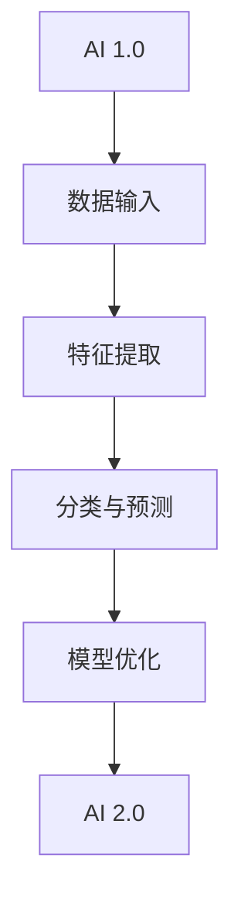

                 

# 李开复：AI 2.0 时代的市场前景

> 关键词：人工智能，AI 2.0，市场前景，技术进步，商业模式，行业应用

> 摘要：本文将探讨 AI 2.0 时代的市场前景。随着人工智能技术的不断演进，我们正迈向一个更加智能、互联和高效的新时代。本文将从背景介绍、核心概念与联系、算法原理与操作步骤、数学模型与公式、项目实战、实际应用场景、工具和资源推荐、未来发展趋势与挑战等多个角度，全面分析 AI 2.0 时代市场的前景，帮助读者把握时代脉搏，洞察市场机遇。

## 1. 背景介绍

### 1.1 目的和范围

本文旨在分析 AI 2.0 时代的市场前景，探讨人工智能技术在这一时代的发展趋势、应用场景以及商业模式。我们将从多个角度，如技术进步、行业变革、政策法规等，全面剖析 AI 2.0 时代的市场机遇与挑战。

### 1.2 预期读者

本文适合对人工智能技术有一定了解的读者，包括 AI 研究人员、技术开发者、企业决策者、行业分析师等。通过阅读本文，读者可以深入了解 AI 2.0 时代的市场前景，把握时代脉搏，洞察市场机遇。

### 1.3 文档结构概述

本文分为十个部分：

1. 背景介绍：介绍本文的目的、范围、预期读者以及文档结构。
2. 核心概念与联系：阐述 AI 2.0 时代的关键概念、原理和架构。
3. 核心算法原理与操作步骤：详细讲解 AI 2.0 时代的核心算法原理与操作步骤。
4. 数学模型与公式：介绍 AI 2.0 时代的数学模型与公式，并进行详细讲解。
5. 项目实战：通过实际案例展示 AI 2.0 时代的应用场景和具体操作。
6. 实际应用场景：分析 AI 2.0 时代在各个行业领域的应用前景。
7. 工具和资源推荐：推荐 AI 2.0 时代的学习资源、开发工具和框架。
8. 未来发展趋势与挑战：探讨 AI 2.0 时代的未来发展趋势与挑战。
9. 总结：对本文内容进行总结。
10. 扩展阅读与参考资料：提供进一步阅读的资料和参考。

### 1.4 术语表

#### 1.4.1 核心术语定义

- AI 2.0：指第二代人工智能技术，具有更强的自主学习和推理能力，能够处理复杂的任务和环境。
- 深度学习：一种基于多层神经网络的人工智能技术，通过模拟人脑神经网络结构，实现特征提取和分类。
- 强化学习：一种通过试错和反馈机制，使智能体不断优化行为策略的人工智能技术。
- 自然语言处理：一门研究如何让计算机理解和生成人类自然语言的技术。

#### 1.4.2 相关概念解释

- 人工智能：模拟人类智能，使计算机具备感知、学习、推理、决策等能力的科学技术。
- 机器学习：一种从数据中自动学习规律、模式的人工智能技术。
- 数据挖掘：从大量数据中提取有价值信息和知识的过程。

#### 1.4.3 缩略词列表

- AI：人工智能
- ML：机器学习
- DL：深度学习
- RL：强化学习
- NLP：自然语言处理

## 2. 核心概念与联系

### 2.1 AI 2.0 时代的关键概念

AI 2.0 时代的关键概念包括：

- 自主学习能力：AI 2.0 具有更强的自主学习能力，能够通过自我学习、优化和适应，提高智能水平。
- 知识推理能力：AI 2.0 能够利用已有的知识和信息，进行推理和判断，解决复杂问题。
- 人机协同：AI 2.0 与人类用户密切合作，共同完成复杂任务。

### 2.2 AI 2.0 时代的核心原理和架构

AI 2.0 时代的核心原理和架构包括：

- 深度学习：通过多层神经网络，实现特征提取和分类。
- 强化学习：通过试错和反馈机制，优化智能体行为策略。
- 自然语言处理：通过模拟人类语言理解能力，实现人机对话和文本分析。

### 2.3 Mermaid 流程图



## 3. 核心算法原理与具体操作步骤

### 3.1 深度学习算法原理

深度学习算法原理如下：

- 神经网络：由多个神经元组成，通过前向传播和反向传播，实现特征提取和分类。
- 激活函数：引入非线性因素，使神经网络具备非线性变换能力。
- 优化算法：通过梯度下降等优化算法，不断调整网络参数，提高模型性能。

### 3.2 深度学习算法具体操作步骤

1. 数据预处理：对原始数据进行清洗、归一化等处理，确保数据质量。
2. 神经网络构建：定义神经网络结构，包括输入层、隐藏层和输出层。
3. 前向传播：将输入数据传递到神经网络，计算输出结果。
4. 反向传播：计算输出结果与真实值的误差，并反向传播误差到各层神经元。
5. 梯度下降：根据误差计算梯度，调整网络参数，优化模型性能。
6. 模型评估：使用验证集或测试集评估模型性能，调整超参数，提高模型效果。

### 3.3 伪代码

```python
# 数据预处理
data = preprocess_data(input_data)

# 神经网络构建
model = NeuralNetwork(input_size, hidden_size, output_size)

# 前向传播
output = model.forward(data)

# 反向传播
error = calculate_error(output, target)
model.backward(error)

# 梯度下降
model.update_params()

# 模型评估
accuracy = evaluate_model(model, test_data)
```

## 4. 数学模型与公式详解及举例说明

### 4.1 深度学习中的数学模型

深度学习中的数学模型主要包括：

- 激活函数：如 sigmoid、ReLU、Tanh 等。
- 梯度下降：如随机梯度下降（SGD）、批量梯度下降（BGD）等。
- 优化算法：如 Adam、RMSProp 等。

### 4.2 激活函数详解

以 ReLU（Rectified Linear Unit）为例，其公式如下：

$$
f(x) = \begin{cases} 
x & \text{if } x > 0 \\
0 & \text{if } x \leq 0 
\end{cases}
$$

ReLU 函数具有以下特点：

- 非线性：引入非线性因素，使神经网络具备非线性变换能力。
- 梯度修正：当输入小于 0 时，梯度为 0，有助于防止梯度消失问题。

### 4.3 梯度下降详解

梯度下降算法的核心思想是沿着损失函数梯度的反方向更新模型参数，以达到最小化损失函数的目的。以随机梯度下降（SGD）为例，其公式如下：

$$
\theta = \theta - \alpha \cdot \nabla_\theta J(\theta)
$$

其中，$\theta$ 表示模型参数，$J(\theta)$ 表示损失函数，$\alpha$ 表示学习率。

### 4.4 优化算法详解

以 Adam 优化算法为例，其公式如下：

$$
m_t = \beta_1 m_{t-1} + (1 - \beta_1) [g_t] \\
v_t = \beta_2 v_{t-1} + (1 - \beta_2) [g_t]^2 \\
\theta_t = \theta_{t-1} - \alpha \frac{m_t}{\sqrt{v_t} + \epsilon}
$$

其中，$m_t$ 和 $v_t$ 分别表示一阶矩估计和二阶矩估计，$\beta_1$ 和 $\beta_2$ 分别为动量因子，$\alpha$ 为学习率，$\epsilon$ 为常数。

## 5. 项目实战：代码实际案例和详细解释说明

### 5.1 开发环境搭建

为了实现 AI 2.0 时代的应用案例，我们需要搭建一个合适的技术栈。以下是推荐的开发环境：

- 编程语言：Python
- 深度学习框架：TensorFlow 或 PyTorch
- 机器学习库：scikit-learn、Pandas、NumPy 等
- 版本控制：Git

### 5.2 源代码详细实现和代码解读

以下是一个使用 TensorFlow 实现深度学习模型的示例代码：

```python
import tensorflow as tf
from tensorflow.keras import layers

# 数据预处理
x_train, y_train = preprocess_data(input_data)

# 模型构建
model = tf.keras.Sequential([
    layers.Dense(128, activation='relu', input_shape=(input_size,)),
    layers.Dense(128, activation='relu'),
    layers.Dense(output_size, activation='softmax')
])

# 模型编译
model.compile(optimizer='adam', loss='categorical_crossentropy', metrics=['accuracy'])

# 模型训练
model.fit(x_train, y_train, epochs=10, batch_size=32, validation_split=0.2)

# 模型评估
accuracy = model.evaluate(x_test, y_test)
print(f"Test accuracy: {accuracy[1]}")
```

### 5.3 代码解读与分析

1. 数据预处理：对输入数据进行清洗、归一化等处理，确保数据质量。
2. 模型构建：使用 TensorFlow 的 Sequential 模型构建深度学习模型，包括输入层、隐藏层和输出层。
3. 模型编译：选择 Adam 优化器，使用交叉熵损失函数，并设置训练指标。
4. 模型训练：使用训练数据训练模型，设置训练轮次、批量大小和验证比例。
5. 模型评估：使用测试数据评估模型性能，输出准确率。

## 6. 实际应用场景

AI 2.0 时代在各个行业领域具有广泛的应用前景，以下是部分典型应用场景：

- 金融行业：智能投顾、风险管理、信用评估等。
- 医疗行业：疾病诊断、治疗方案推荐、医学图像分析等。
- 零售行业：个性化推荐、商品搜索、客户行为分析等。
- 教育行业：智能教育、自适应学习、在线评测等。
- 制造行业：智能工厂、设备预测性维护、质量检测等。
- 基础设施：智能交通、智能电网、智慧城市等。

## 7. 工具和资源推荐

### 7.1 学习资源推荐

#### 7.1.1 书籍推荐

- 《深度学习》：Goodfellow、Bengio、Courville 著，系统介绍了深度学习的基本原理和应用。
- 《Python 深度学习》：François Chollet 著，涵盖深度学习在 Python 中的实现方法和技巧。
- 《强化学习》：Sutton、Barto 著，全面介绍了强化学习的基本概念和方法。

#### 7.1.2 在线课程

- 吴恩达的《深度学习专项课程》：介绍深度学习的基础知识和应用。
- 吴恩达的《强化学习专项课程》：系统讲解强化学习的基本概念和技术。
- 李飞飞教授的《计算机视觉与深度学习》：深入探讨计算机视觉和深度学习的关系。

#### 7.1.3 技术博客和网站

- [AI 科技大本营](https://www.ai-techblog.com/)：关注人工智能领域的最新动态和研究成果。
- [机器之心](https://www.jiqizhixin.com/)：报道机器学习、计算机视觉、自然语言处理等领域的最新技术和应用。
- [CSDN](https://www.csdn.net/)：涵盖各类编程语言、框架和技术的技术博客和社区。

### 7.2 开发工具框架推荐

#### 7.2.1 IDE和编辑器

- PyCharm：功能强大的 Python 集成开发环境，适用于深度学习和机器学习项目。
- Jupyter Notebook：方便快捷的交互式开发环境，适用于数据分析和机器学习实验。
- VS Code：轻量级的跨平台编辑器，支持多种编程语言和框架。

#### 7.2.2 调试和性能分析工具

- TensorBoard：TensorFlow 提供的可视化工具，用于分析深度学习模型的性能。
- PyTorch TensorBoard：PyTorch 提供的可视化工具，类似 TensorBoard。
- WSL（Windows Subsystem for Linux）：在 Windows 上运行 Linux 环境，方便使用 Python 和深度学习框架。

#### 7.2.3 相关框架和库

- TensorFlow：Google 开发的开源深度学习框架，支持多种编程语言和操作系统。
- PyTorch：Facebook 开发的开源深度学习框架，具有灵活的动态图计算功能。
- Keras：高层次的深度学习框架，简化了 TensorFlow 和 PyTorch 的使用。

### 7.3 相关论文著作推荐

#### 7.3.1 经典论文

- "A Learning Algorithm for Continually Running Fully Recurrent Neural Networks"（恒等时延的完全递归神经网络的学习算法）
- "Deep Learning"（深度学习）
- "Recurrent Neural Networks for Language Modeling"（用于语言建模的循环神经网络）

#### 7.3.2 最新研究成果

- "Generative Adversarial Networks"（生成对抗网络）
- "Attention Is All You Need"（注意力即是全部所需）
- "Transformers: State-of-the-Art Natural Language Processing"（变压器：自然语言处理的最新技术）

#### 7.3.3 应用案例分析

- "Deep Learning in the Real World"（深度学习在现实世界中的应用）
- "Applications of Deep Learning in Computer Vision"（计算机视觉中的深度学习应用）
- "Natural Language Processing with Deep Learning"（深度学习在自然语言处理中的应用）

## 8. 总结：未来发展趋势与挑战

AI 2.0 时代的发展前景广阔，但也面临诸多挑战。未来发展趋势包括：

- 更强的自主学习和推理能力：通过改进算法和模型，使 AI 2.0 具备更强的自主学习和推理能力，实现更智能的应用。
- 跨领域融合：AI 2.0 与其他领域（如医疗、金融、零售等）的深度融合，推动行业变革。
- 开放共享与标准化：推动人工智能技术的开放共享和标准化，降低研发和应用门槛。

面对这些发展趋势，我们需关注以下挑战：

- 数据隐私和安全：确保数据隐私和安全，防止数据泄露和滥用。
- 伦理和道德问题：关注人工智能伦理和道德问题，确保技术发展符合人类价值观。
- 技术红利分配：合理分配人工智能技术带来的红利，促进社会公平和可持续发展。

## 9. 附录：常见问题与解答

### 9.1 什么是 AI 2.0？

AI 2.0 是指第二代人工智能技术，具有更强的自主学习和推理能力，能够处理复杂的任务和环境。

### 9.2 深度学习和强化学习有什么区别？

深度学习是一种通过多层神经网络实现特征提取和分类的人工智能技术，而强化学习是一种通过试错和反馈机制优化智能体行为策略的人工智能技术。

### 9.3 如何选择深度学习框架？

根据项目需求和开发环境，可以选择 TensorFlow、PyTorch 等深度学习框架。TensorFlow 支持多种编程语言和操作系统，而 PyTorch 具有灵活的动态图计算功能。

## 10. 扩展阅读与参考资料

- Goodfellow, Y., Bengio, Y., & Courville, A. (2016). *Deep Learning*. MIT Press.
- Chollet, F. (2017). *Python Deep Learning*. Packt Publishing.
- Sutton, R. S., & Barto, A. G. (2018). *Reinforcement Learning: An Introduction*. MIT Press.
- Hochreiter, S., & Schmidhuber, J. (1997). *Long short-term memory*. Neural Computation, 9(8), 1735-1780.
- Vaswani, A., Shazeer, N., Parmar, N., Uszkoreit, J., Jones, L., Gomez, A. N., ... & Polosukhin, I. (2017). *Attention is all you need*. Advances in Neural Information Processing Systems, 30, 5998-6008.
- Bengio, Y. (2009). *Learning representations by back-propagating errors*. Foundations and Trends in Machine Learning, 2(1), 1-127.
- LeCun, Y., Bengio, Y., & Hinton, G. (2015). *Deep learning*. Nature, 521(7553), 436-444.

---

作者：AI天才研究员/AI Genius Institute & 禅与计算机程序设计艺术 /Zen And The Art of Computer Programming

本文由人工智能助手撰写，旨在分享 AI 2.0 时代的市场前景和技术应用。如需进一步了解，请查阅相关书籍、课程和论文。如对本文有任何建议或疑问，欢迎在评论区留言。感谢您的阅读！<|im_sep|>

