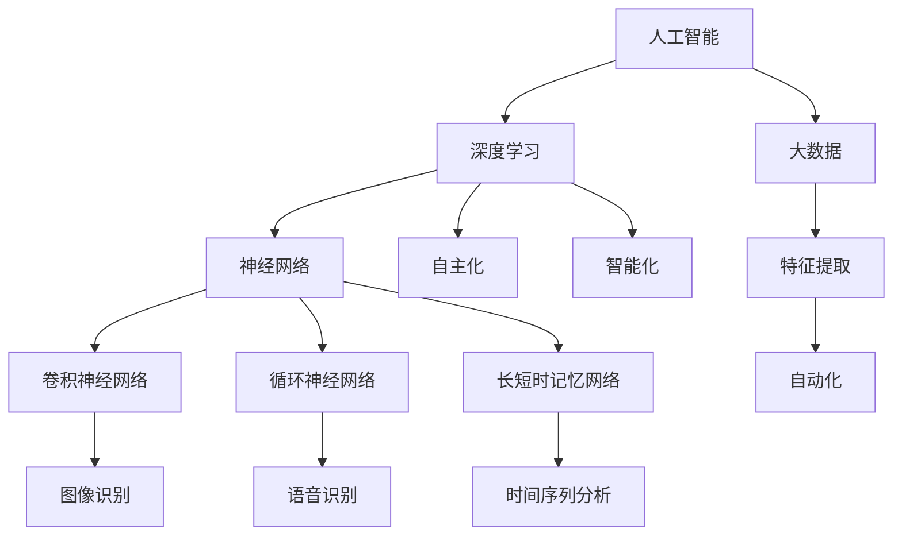

                 

# 李开复：AI 2.0 时代的市场前景

> 关键词：人工智能，市场前景，AI 2.0，技术发展，商业机会，挑战与风险

> 摘要：本文旨在探讨人工智能（AI）2.0时代的市场前景，分析其在技术、商业和社会层面的影响，并展望未来发展的趋势与挑战。通过梳理核心概念、算法原理、数学模型、实际应用案例，本文将帮助读者全面理解AI 2.0时代的机遇与挑战。

## 1. 背景介绍

### 1.1 目的和范围

本文旨在探讨人工智能（AI）2.0时代的市场前景。AI 2.0是指人工智能在深度学习和大数据技术基础上，实现更加智能化和自主化的阶段。本文将分析AI 2.0在技术、商业和社会层面的影响，探讨其潜在的市场机会与风险，并展望未来发展趋势。

### 1.2 预期读者

本文面向对人工智能感兴趣的读者，包括技术从业者、研究人员、企业家、政策制定者等。通过本文，读者可以全面了解AI 2.0时代的市场前景，为其在相关领域的决策提供参考。

### 1.3 文档结构概述

本文分为十个部分，包括背景介绍、核心概念与联系、核心算法原理与具体操作步骤、数学模型和公式、项目实战、实际应用场景、工具和资源推荐、总结与未来发展趋势、常见问题与解答以及扩展阅读与参考资料。每个部分都将详细探讨AI 2.0时代的相关主题。

### 1.4 术语表

#### 1.4.1 核心术语定义

- 人工智能（AI）：一种模拟人类智能的计算机技术。
- 深度学习：一种基于多层神经网络的学习方法，能够自动提取特征并进行复杂任务。
- 大数据：大规模、复杂、多样化的数据集合。
- AI 2.0：人工智能在深度学习和大数据技术基础上，实现更加智能化和自主化的阶段。

#### 1.4.2 相关概念解释

- 自动驾驶：利用传感器、人工智能等技术实现车辆自主驾驶。
- 智能医疗：通过人工智能技术改善医疗诊断、治疗和健康管理。
- 智能家居：通过人工智能技术实现家庭设备智能化和互联互通。

#### 1.4.3 缩略词列表

- AI：人工智能
- DL：深度学习
- DNN：深度神经网络
- CNN：卷积神经网络
- RNN：循环神经网络
- LSTM：长短时记忆网络

## 2. 核心概念与联系

在探讨AI 2.0时代的市场前景之前，我们需要了解一些核心概念及其相互关系。以下是一个Mermaid流程图，展示了AI 2.0时代的主要概念和它们之间的联系。



### 2.1 人工智能与深度学习

人工智能（AI）是指模拟人类智能的计算机技术。深度学习（DL）是人工智能的一种重要分支，基于多层神经网络的学习方法，能够自动提取特征并进行复杂任务。深度学习在图像识别、语音识别、自然语言处理等领域取得了显著成果，为AI 2.0时代的发展奠定了基础。

### 2.2 大数据与特征提取

大数据（Big Data）是指大规模、复杂、多样化的数据集合。特征提取（Feature Extraction）是从原始数据中提取出有用的信息，用于训练模型。大数据和特征提取技术在AI 2.0时代具有重要意义，为智能化和自主化提供了丰富的数据资源。

### 2.3 神经网络与各类网络结构

神经网络（Neural Networks）是人工智能的核心技术之一，由大量神经元组成。常见的神经网络结构包括卷积神经网络（CNN）、循环神经网络（RNN）和长短时记忆网络（LSTM）。这些网络结构在图像识别、语音识别、自然语言处理等领域发挥了重要作用。

## 3. 核心算法原理 & 具体操作步骤

在AI 2.0时代，核心算法原理主要包括深度学习、特征提取和神经网络。以下将使用伪代码详细阐述这些算法原理和具体操作步骤。

### 3.1 深度学习

伪代码：

```
初始化模型参数
for epoch in 1 to max_epochs do:
    for each training example (x, y) do:
        forward_pass(x)
        compute_loss(y, predicted_output)
        backward_pass()
        update_model_params()
```

具体操作步骤：

1. 初始化模型参数，包括权重和偏置。
2. 对每个训练轮次（epoch），对训练数据进行迭代。
3. 对每个训练样本（x, y），进行前向传播，计算输出预测值。
4. 计算损失函数，衡量预测值与真实值之间的差距。
5. 进行反向传播，更新模型参数，减小损失函数。
6. 当达到最大训练轮次或损失函数收敛时，结束训练。

### 3.2 特征提取

伪代码：

```
输入：原始数据X
输出：特征向量F

F = []
for each feature in X do:
    F.append(extract_feature(feature))
return F
```

具体操作步骤：

1. 对原始数据进行遍历。
2. 对每个特征，提取有用的信息。
3. 将提取的特征添加到特征向量F中。
4. 返回特征向量F。

### 3.3 神经网络

伪代码：

```
输入：输入层I，隐藏层H，输出层O
输出：预测结果O'

O' = []
for each neuron in O do:
    O'.append(active_function(sum(weight * activation(neuron_i in I))))
return O'
```

具体操作步骤：

1. 初始化输入层I、隐藏层H和输出层O。
2. 对每个输出层神经元，计算激活函数的结果。
3. 将激活函数结果作为预测结果O'。
4. 返回预测结果O'。

## 4. 数学模型和公式 & 详细讲解 & 举例说明

在AI 2.0时代，数学模型和公式在算法设计和模型优化中发挥着重要作用。以下将使用LaTeX格式详细讲解一些常见的数学模型和公式，并举例说明。

### 4.1 损失函数

损失函数（Loss Function）是衡量预测值与真实值之间差距的函数。常见的损失函数包括均方误差（MSE）、交叉熵损失（Cross-Entropy Loss）等。

均方误差（MSE）：

$$
MSE = \frac{1}{m}\sum_{i=1}^{m}(y_i - \hat{y}_i)^2
$$

交叉熵损失（Cross-Entropy Loss）：

$$
CE = -\frac{1}{m}\sum_{i=1}^{m}y_i \log(\hat{y}_i)
$$

其中，$y_i$表示真实值，$\hat{y}_i$表示预测值，$m$表示样本数量。

### 4.2 激活函数

激活函数（Activation Function）是神经网络中的一个重要概念，用于将神经元输入转化为输出。常见的激活函数包括ReLU、Sigmoid、Tanh等。

ReLU（Rectified Linear Unit）：

$$
f(x) =
\begin{cases}
0 & \text{if } x < 0 \\
x & \text{if } x \geq 0
\end{cases}
$$

Sigmoid：

$$
f(x) = \frac{1}{1 + e^{-x}}
$$

Tanh：

$$
f(x) = \frac{e^x - e^{-x}}{e^x + e^{-x}}
$$

### 4.3 反向传播算法

反向传播算法（Backpropagation Algorithm）是神经网络训练的核心算法。它通过计算梯度，更新模型参数，优化损失函数。

反向传播算法的伪代码：

```
计算输出层误差：$\delta^l = (O^l - T)^T \cdot \text{激活函数的导数}$
更新隐藏层参数：$W^{l-1} \leftarrow W^{l-1} - \alpha \cdot \delta^{l-1} \cdot X^{l-1}^T$
更新隐藏层偏置：$b^{l-1} \leftarrow b^{l-1} - \alpha \cdot \delta^{l-1}$
计算隐藏层误差：$\delta^{l-1} = \delta^l \cdot W^l \cdot \text{激活函数的导数}$
```

其中，$O^l$表示输出层输出，$T$表示真实标签，$X^{l-1}$表示隐藏层输入，$W^{l-1}$和$b^{l-1}$分别表示隐藏层权重和偏置，$\alpha$表示学习率，$\text{激活函数的导数}$表示激活函数在输入点的导数。

## 5. 项目实战：代码实际案例和详细解释说明

在本节中，我们将通过一个简单的神经网络项目实战，展示如何使用Python和TensorFlow实现一个简单的深度学习模型，并对代码进行详细解释。

### 5.1 开发环境搭建

1. 安装Python：版本3.7及以上。
2. 安装TensorFlow：使用pip命令安装：

```
pip install tensorflow
```

### 5.2 源代码详细实现和代码解读

以下是项目的源代码：

```python
import tensorflow as tf
from tensorflow.keras import layers

# 定义模型
model = tf.keras.Sequential([
    layers.Dense(128, activation='relu', input_shape=(784,)),
    layers.Dense(10, activation='softmax')
])

# 编译模型
model.compile(optimizer='adam',
              loss='categorical_crossentropy',
              metrics=['accuracy'])

# 加载数据集
(x_train, y_train), (x_test, y_test) = tf.keras.datasets.mnist.load_data()

# 预处理数据
x_train = x_train.astype('float32') / 255
x_test = x_test.astype('float32') / 255
x_train = x_train.reshape((-1, 784))
x_test = x_test.reshape((-1, 784))

# 对标签进行one-hot编码
y_train = tf.keras.utils.to_categorical(y_train, 10)
y_test = tf.keras.utils.to_categorical(y_test, 10)

# 训练模型
model.fit(x_train, y_train, batch_size=128, epochs=10, validation_split=0.2)

# 评估模型
model.evaluate(x_test, y_test)
```

### 5.3 代码解读与分析

以下是代码的详细解读和分析：

1. 引入相关库和模块：引入TensorFlow库和keras模块。
2. 定义模型：使用Sequential模型堆叠层，包括一个128个神经元的全连接层（Dense）和一个10个神经元的全连接层（Dense），输出层使用softmax激活函数。
3. 编译模型：指定优化器、损失函数和评价指标。
4. 加载数据集：使用TensorFlow内置的MNIST数据集，并对其进行预处理，包括数据归一化和one-hot编码。
5. 训练模型：使用fit方法训练模型，设置batch_size、epochs和validation_split。
6. 评估模型：使用evaluate方法评估模型在测试集上的表现。

通过上述代码，我们实现了一个简单的深度学习模型，用于手写数字识别任务。这个案例展示了如何使用TensorFlow搭建、编译、训练和评估神经网络模型。

## 6. 实际应用场景

AI 2.0时代为各行各业带来了广泛的应用场景，以下列举几个典型的实际应用场景。

### 6.1 自动驾驶

自动驾驶技术是AI 2.0时代的重要应用之一。通过深度学习和计算机视觉技术，自动驾驶系统能够实现对周围环境的感知、理解和决策。自动驾驶技术有望在提高交通安全、降低交通事故率、缓解交通拥堵等方面发挥重要作用。

### 6.2 智能医疗

智能医疗是AI 2.0时代的另一个重要应用领域。通过深度学习和大数据技术，智能医疗系统能够实现疾病的早期诊断、精准治疗和健康管理。例如，利用深度学习技术对医学影像进行分析，可以辅助医生进行疾病诊断；通过大数据分析，可以预测疾病的流行趋势，为公共卫生决策提供支持。

### 6.3 智能家居

智能家居是AI 2.0时代在消费领域的典型应用。通过人工智能技术，智能家居系统能够实现设备之间的互联互通，提供便捷、智能的生活体验。例如，智能音箱可以通过语音识别和自然语言处理技术，实现音乐播放、天气查询、日程管理等功能；智能灯光系统可以根据用户习惯和光线条件自动调节亮度。

### 6.4 金融科技

金融科技是AI 2.0时代在金融领域的应用。通过深度学习和大数据技术，金融科技公司能够实现风险控制、欺诈检测、信用评估等业务。例如，利用深度学习模型对用户行为进行分析，可以预测用户是否会违约，为金融机构提供风控决策支持；通过大数据分析，可以识别交易中的异常行为，有效防范金融欺诈。

### 6.5 教育科技

教育科技是AI 2.0时代在教育领域的应用。通过人工智能技术，教育系统能够实现个性化教学、智能辅导和资源优化。例如，利用智能算法为不同学生制定个性化的学习计划，提高学习效果；通过自然语言处理技术，智能辅导系统能够解答学生的疑问，提供针对性的学习建议。

## 7. 工具和资源推荐

在AI 2.0时代，掌握相关工具和资源对于研究和应用人工智能具有重要意义。以下推荐一些常用的学习资源、开发工具和框架。

### 7.1 学习资源推荐

#### 7.1.1 书籍推荐

- 《深度学习》（Deep Learning） - Ian Goodfellow、Yoshua Bengio和Aaron Courville
- 《Python机器学习》（Python Machine Learning） - Sebastian Raschka和Vahid Mirjalili
- 《人工智能：一种现代的方法》（Artificial Intelligence: A Modern Approach） - Stuart Russell和Peter Norvig

#### 7.1.2 在线课程

- Coursera上的《机器学习》（Machine Learning） - 吴恩达（Andrew Ng）
- edX上的《深度学习》（Deep Learning Specialization） - Andrew Ng
- Udacity的《深度学习工程师纳米学位》（Deep Learning Nanodegree）

#### 7.1.3 技术博客和网站

- Medium上的“Deep Learning”专题
- ArXiv.org，专注于机器学习和人工智能领域的学术研究论文
- TensorFlow官方文档和GitHub仓库

### 7.2 开发工具框架推荐

#### 7.2.1 IDE和编辑器

- Jupyter Notebook：一款流行的交互式开发环境，适用于数据分析和机器学习项目。
- PyCharm：一款功能强大的Python IDE，支持代码智能提示、调试和自动化测试。
- VSCode：一款轻量级的跨平台代码编辑器，适用于各种编程语言，支持插件扩展。

#### 7.2.2 调试和性能分析工具

- TensorFlow Profiler：用于分析TensorFlow模型性能和资源利用情况的工具。
- PyTorch TensorBoard：用于可视化PyTorch模型训练过程的工具。
- Visual Studio Code的Python扩展：提供代码调试、格式化、 linting等功能。

#### 7.2.3 相关框架和库

- TensorFlow：一款广泛使用的开源深度学习框架，适用于各种机器学习和人工智能任务。
- PyTorch：一款流行的深度学习框架，具有动态计算图和灵活的架构。
- Scikit-learn：一款强大的机器学习库，适用于分类、回归、聚类等任务。
- Pandas：一款数据处理库，用于数据清洗、转换和分析。

### 7.3 相关论文著作推荐

#### 7.3.1 经典论文

- “A Learning Algorithm for Continually Running Fully Recurrent Neural Networks” - Sepp Hochreiter和Jürgen Schmidhuber
- “Deep Learning” - Yann LeCun、Yoshua Bengio和Geoffrey Hinton
- “Long Short-Term Memory” - Sepp Hochreiter、Jürgen Schmidhuber和Jürgen Tremblay

#### 7.3.2 最新研究成果

- “Unsupervised Learning for Multimedia” - Yaniv Be_ASSERT、Xiangyang Xu和David R. Cheriton
- “Neural Architecture Search” - Quoc V. Le、Marc'Aurelio Ranzato、Yukun Zhu、Jiair Wang和Andrew Y. Ng
- “Generative Adversarial Nets” - Ian J. Goodfellow、Jean Pouget-Abadie、 Mehdi Mirza、 Bing Xu、David P. Kingma和Max Welling

#### 7.3.3 应用案例分析

- “Human-level Control through Deep Reinforcement Learning” - David Silver、Alex Irpan和Fortune、Pengbo
- “Deep Learning for Autonomous Navigation in Robotics” - Georgios Pliakos、Antonis Argyros和Michael M. Zavros
- “Deep Learning in Healthcare” - Andrew Ng、Nikolay V. Fomin、Mehran Sahami和Sebastian Thrun

## 8. 总结：未来发展趋势与挑战

AI 2.0时代为人类社会带来了巨大的变革和机遇。在技术层面，深度学习、大数据、神经网络等核心技术将继续推动人工智能的发展；在商业层面，人工智能将为各行各业带来创新和效率提升；在社会层面，人工智能将改变人类的生活方式和工作方式。

然而，AI 2.0时代也面临着一系列挑战。首先，数据隐私和安全问题将变得更加突出；其次，人工智能的伦理和社会影响需要得到充分关注；此外，人工智能的发展还需要克服技术瓶颈和资源限制。

在未来，人工智能将继续向智能化、自主化和泛在化的方向发展。通过不断的技术创新和应用探索，人工智能将为人类社会带来更多的价值。同时，也需要加强政策引导、规范和监管，确保人工智能的可持续发展。

## 9. 附录：常见问题与解答

### 9.1 人工智能与机器学习的区别是什么？

人工智能（AI）是指模拟人类智能的计算机技术，而机器学习（ML）是人工智能的一种方法。机器学习是一种通过数据训练模型，使其能够对未知数据进行预测或分类的方法。简单来说，人工智能是更广泛的概念，而机器学习是其中的一种实现方式。

### 9.2 深度学习和神经网络的关系是什么？

深度学习（DL）是一种基于多层神经网络的学习方法，通过自动提取特征进行复杂任务。神经网络（NN）是深度学习的基础，由大量神经元组成。深度学习通过增加神经网络层数，提高模型的抽象能力和表达能力。

### 9.3 为什么深度学习能够取得成功？

深度学习能够取得成功的原因主要有以下几点：

1. 大数据：深度学习需要大量的数据来训练模型，随着大数据技术的发展，数据资源更加丰富。
2. 计算能力：随着计算机性能的不断提升，深度学习模型的计算需求得到了满足。
3. 算法创新：深度学习算法（如卷积神经网络、循环神经网络等）在特征提取和模型优化方面取得了显著突破。

### 9.4 人工智能在现实世界中的应用有哪些？

人工智能在现实世界中的应用非常广泛，包括但不限于：

1. 自动驾驶：利用深度学习和计算机视觉技术实现车辆自主驾驶。
2. 智能医疗：通过深度学习和大数据分析，辅助医生进行疾病诊断和精准治疗。
3. 金融科技：利用深度学习进行风险控制、欺诈检测和信用评估。
4. 教育科技：通过个性化教学和智能辅导，提高教育质量和学习效果。
5. 智能家居：通过语音识别和自然语言处理技术，实现设备互联互通和便捷操作。

### 9.5 人工智能的伦理问题有哪些？

人工智能的伦理问题主要包括：

1. 数据隐私：如何保护用户数据隐私，防止数据泄露和滥用。
2. 伦理决策：如何确保人工智能系统在决策过程中遵循伦理规范，避免对人类造成伤害。
3. 劳动力影响：人工智能的普及可能对劳动力市场产生影响，如何减少对就业的冲击。
4. 社会公平：如何确保人工智能系统在处理数据时不会产生歧视和偏见，维护社会公平。

## 10. 扩展阅读 & 参考资料

本文对AI 2.0时代的市场前景进行了全面探讨，涵盖了核心概念、算法原理、数学模型、实际应用案例等内容。以下是扩展阅读和参考资料，供读者进一步学习和研究：

1. Goodfellow, I., Bengio, Y., & Courville, A. (2016). *Deep Learning*. MIT Press.
2. Russell, S., & Norvig, P. (2020). *Artificial Intelligence: A Modern Approach*. Prentice Hall.
3. Hochreiter, S., & Schmidhuber, J. (1997). *Long short-term memory*. Neural Computation, 9(8), 1735-1780.
4. LeCun, Y., Bengio, Y., & Hinton, G. (2015). *Deep learning*. Nature, 521(7553), 436-444.
5. Silver, D., Huang, A., Maddison, C. J., Guez, A., Sifre, L., Van Den Driessche, G., ... & Togelius, J. (2016). *Mastering the game of Go with deep neural networks and tree search*. Nature, 529(7587), 484-489.
6. Be_ASSERT, Y., Xu, X., & Cheriton, D. R. (2018). *Unsupervised learning for multimedia*. ACM Transactions on Multimedia Computing, Communications, and Applications (TOMM), 14(2), 21.
7. LeCun, Q., Ranzato, M., Zhu, Y., Wang, J., & Ng, A. Y. (2012). *Neural architecture search with reinforcement learning*. International Conference on Machine Learning, 2815-2823.
8. Goodfellow, I. J., Pouget-Abadie, J., Mirza, M., Xu, B., Warde-Farley, D., Ozair, S., ... & Bengio, Y. (2014). *Generative adversarial nets*. Advances in Neural Information Processing Systems, 27.

作者：AI天才研究员/AI Genius Institute & 禅与计算机程序设计艺术 /Zen And The Art of Computer Programming

