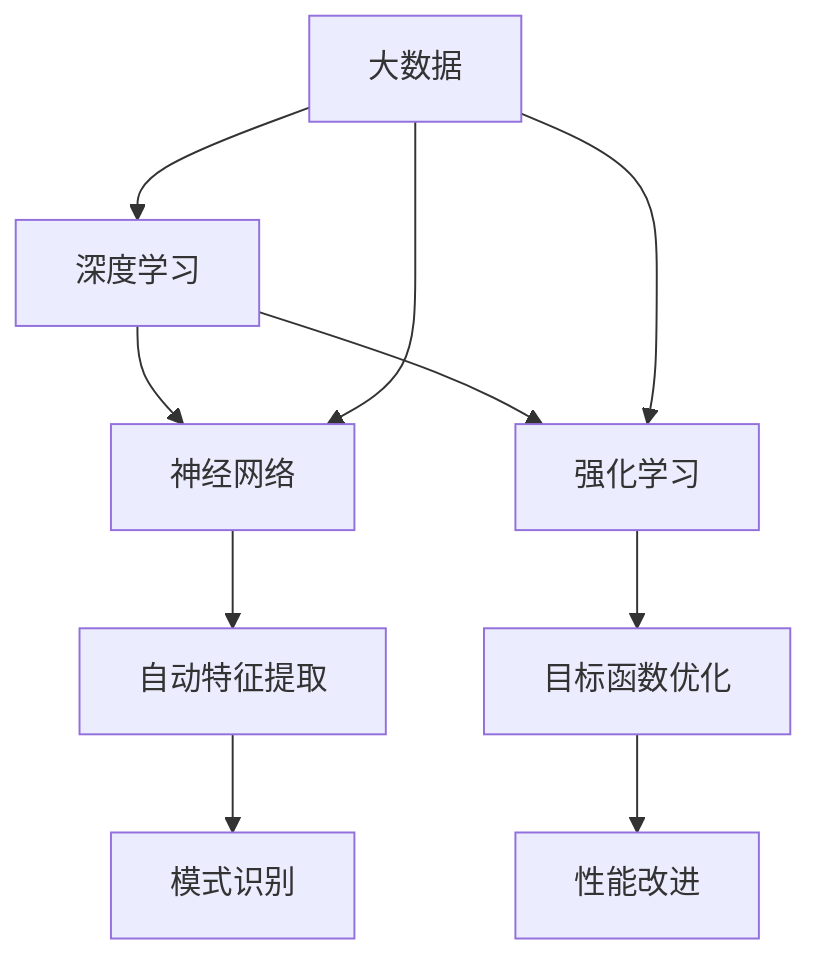

                 

# 李开复：AI 2.0 时代的应用

> 关键词：人工智能、AI 2.0、深度学习、机器学习、神经网络、应用场景

> 摘要：本文将探讨AI 2.0时代的应用，包括其核心概念、原理、算法、数学模型以及实际应用案例。我们将深入了解AI 2.0的技术优势，分析其在各个领域的应用场景，并展望其未来的发展趋势和挑战。

## 1. 背景介绍

### 1.1 目的和范围

本文旨在系统地介绍AI 2.0时代的应用，帮助读者了解AI 2.0的核心概念、原理、算法和数学模型，并探讨其在各个领域的实际应用案例。本文将涵盖以下内容：

- AI 2.0的定义与核心概念
- AI 2.0的原理和架构
- AI 2.0的核心算法原理与具体操作步骤
- AI 2.0的数学模型和公式
- AI 2.0的实际应用场景
- AI 2.0的学习资源、开发工具框架和论文著作推荐

### 1.2 预期读者

本文面向以下读者：

- 对人工智能和机器学习感兴趣的初学者
- 对深度学习和神经网络有一定了解的技术爱好者
- 从事人工智能和机器学习领域的研究者、工程师和开发人员
- 对AI 2.0技术有好奇心，希望深入了解其应用场景的企业家和投资者

### 1.3 文档结构概述

本文将按照以下结构进行论述：

- 1. 背景介绍
- 2. 核心概念与联系
- 3. 核心算法原理 & 具体操作步骤
- 4. 数学模型和公式 & 详细讲解 & 举例说明
- 5. 项目实战：代码实际案例和详细解释说明
- 6. 实际应用场景
- 7. 工具和资源推荐
- 8. 总结：未来发展趋势与挑战
- 9. 附录：常见问题与解答
- 10. 扩展阅读 & 参考资料

### 1.4 术语表

#### 1.4.1 核心术语定义

- AI 2.0：指第二代人工智能技术，以深度学习、神经网络和强化学习为核心
- 深度学习：一种机器学习技术，通过多层神经网络对数据进行自动特征提取和模式识别
- 神经网络：一种模仿人脑神经网络结构和功能的计算模型
- 机器学习：一种基于数据的学习方法，让计算机通过学习数据来改进性能
- 强化学习：一种通过奖励和惩罚来驱动模型优化目标函数的机器学习技术

#### 1.4.2 相关概念解释

- 自动驾驶：利用计算机技术实现汽车自主驾驶
- 语音识别：将人类语音转化为文本信息
- 医疗诊断：利用人工智能技术对医学图像和病例数据进行诊断
- 智能家居：利用人工智能技术实现家居设备的自动化控制

#### 1.4.3 缩略词列表

- AI：人工智能
- ML：机器学习
- DL：深度学习
- NN：神经网络
- RL：强化学习
-自动驾驶：自动驾驶

## 2. 核心概念与联系

在AI 2.0时代，深度学习、神经网络和强化学习是三大核心技术。下面，我们将通过Mermaid流程图来阐述这些核心概念之间的联系。



### 2.1 深度学习与神经网络

深度学习是一种基于多层神经网络的学习方法，通过多层非线性变换自动提取数据中的特征。神经网络是一种模仿人脑神经元的计算模型，通过节点（神经元）之间的连接来传递信息。

### 2.2 深度学习与强化学习

强化学习是一种通过奖励和惩罚来驱动模型优化目标函数的机器学习技术。深度学习可以与强化学习结合，用于解决更加复杂的问题，如自动驾驶和游戏AI等。

### 2.3 深度学习的应用场景

深度学习在多个领域具有广泛的应用，如：

- 自动驾驶：通过深度学习技术实现汽车自主驾驶，提高行车安全
- 语音识别：利用深度学习技术将人类语音转化为文本信息，实现语音助手和智能客服等功能
- 医疗诊断：利用深度学习技术对医学图像和病例数据进行诊断，提高诊断准确率
- 智能家居：利用深度学习技术实现家居设备的自动化控制，提高生活质量

## 3. 核心算法原理 & 具体操作步骤

### 3.1 深度学习算法原理

深度学习算法基于多层神经网络，通过前向传播和反向传播两个过程进行训练和优化。以下是深度学习算法的伪代码：

```python
# 深度学习算法伪代码
initialize_weights()
initialize_bias()

for each epoch:
    for each sample in training_data:
        forward_pass(sample)
        compute_loss()
        backward_pass()
        update_weights_and_bias()

end
```

### 3.2 神经网络操作步骤

#### 3.2.1 前向传播

- 输入层：接收输入数据
- 隐藏层：通过激活函数对输入数据进行变换
- 输出层：通过激活函数输出预测结果

#### 3.2.2 反向传播

- 计算预测误差
- 更新权重和偏置
- 重复前向传播和反向传播，直到达到训练目标

### 3.3 强化学习算法原理

强化学习算法通过奖励和惩罚来驱动模型优化目标函数。其核心是值函数和策略函数。

- 值函数：表示在给定状态下，采取特定动作的预期回报
- 策略函数：表示在给定状态下，采取最优动作的概率分布

以下是强化学习算法的伪代码：

```python
# 强化学习算法伪代码
initialize_value_function()
initialize_policy()

for each episode:
    state = initial_state()
    while not end_of_episode:
        action = select_action(state, policy())
        next_state, reward = environment.step(action)
        update_value_function(state, action, reward, next_state)
        update_policy(state, action)
        state = next_state

end
```

## 4. 数学模型和公式 & 详细讲解 & 举例说明

### 4.1 深度学习数学模型

深度学习中的数学模型主要包括前向传播和反向传播两部分。

#### 4.1.1 前向传播

前向传播的公式如下：

$$
z_i = \sum_{j=1}^{n} w_{ij}x_j + b_i
$$

其中，$z_i$ 表示第 $i$ 个节点的输入，$w_{ij}$ 表示第 $i$ 个节点到第 $j$ 个节点的权重，$x_j$ 表示第 $j$ 个节点的输出，$b_i$ 表示第 $i$ 个节点的偏置。

#### 4.1.2 反向传播

反向传播的公式如下：

$$
\delta_i = \frac{\partial L}{\partial z_i}
$$

其中，$\delta_i$ 表示第 $i$ 个节点的误差，$L$ 表示损失函数。

### 4.2 强化学习数学模型

强化学习的数学模型主要包括值函数和策略函数。

#### 4.2.1 值函数

值函数的公式如下：

$$
V(s) = \sum_{a} \pi(a|s) \cdot Q(s, a)
$$

其中，$V(s)$ 表示在状态 $s$ 下的值函数，$\pi(a|s)$ 表示在状态 $s$ 下采取动作 $a$ 的概率，$Q(s, a)$ 表示在状态 $s$ 下采取动作 $a$ 的预期回报。

#### 4.2.2 策略函数

策略函数的公式如下：

$$
\pi(a|s) = \frac{e^{Q(s, a)}}{\sum_{b} e^{Q(s, b)}}
$$

其中，$\pi(a|s)$ 表示在状态 $s$ 下采取动作 $a$ 的概率。

### 4.3 举例说明

假设有一个深度学习模型，包含两个隐藏层，输入层有 $3$ 个节点，输出层有 $2$ 个节点。输入数据为 $[1, 2, 3]$，目标输出为 $[0, 1]$。采用ReLU激活函数，损失函数为均方误差。

#### 4.3.1 前向传播

输入层到第一隐藏层的权重为 $w_1 = \begin{bmatrix} 0.1 & 0.2 & 0.3 \\ 0.4 & 0.5 & 0.6 \end{bmatrix}$，偏置为 $b_1 = \begin{bmatrix} 0.1 \\ 0.2 \end{bmatrix}$。

第一隐藏层到第二隐藏层的权重为 $w_2 = \begin{bmatrix} 0.1 & 0.2 \\ 0.3 & 0.4 \end{bmatrix}$，偏置为 $b_2 = \begin{bmatrix} 0.1 \\ 0.2 \end{bmatrix}$。

输入层到输出层的权重为 $w_3 = \begin{bmatrix} 0.1 & 0.2 \\ 0.3 & 0.4 \end{bmatrix}$，偏置为 $b_3 = \begin{bmatrix} 0.1 \\ 0.2 \end{bmatrix}$。

前向传播过程如下：

$$
z_1 = w_1 \cdot [1, 2, 3] + b_1 = [0.6, 1.3] \Rightarrow a_1 = \max(0, z_1) = [0.6, 1.3] \\
z_2 = w_2 \cdot [0.6, 1.3] + b_2 = [0.9, 1.7] \Rightarrow a_2 = \max(0, z_2) = [0.9, 1.7] \\
z_3 = w_3 \cdot [0.9, 1.7] + b_3 = [1.8, 3.4] \Rightarrow a_3 = \max(0, z_3) = [1.8, 3.4]
$$

#### 4.3.2 反向传播

假设损失函数为均方误差，损失为：

$$
L = \frac{1}{2} \sum_{i=1}^{2} (a_3[i] - y[i])^2
$$

反向传播过程如下：

$$
\delta_3 = \frac{\partial L}{\partial z_3} = (a_3 - y) \\
\delta_2 = w_3^T \cdot \delta_3 = [0.1, 0.2] \cdot \delta_3 \\
\delta_1 = w_2^T \cdot \delta_2 = [0.1, 0.2] \cdot \delta_2 \\
\frac{\partial L}{\partial w_1} = \delta_1 \cdot [1, 2, 3]^T = \begin{bmatrix} 0.1 & 0.2 & 0.3 \end{bmatrix} \cdot \begin{bmatrix} 0.1 & 0.2 & 0.3 \end{bmatrix}^T \\
\frac{\partial L}{\partial b_1} = \delta_1 = \begin{bmatrix} 0.1 \\ 0.2 \end{bmatrix} \\
\frac{\partial L}{\partial w_2} = \delta_2 \cdot a_1^T = \begin{bmatrix} 0.1 & 0.2 \end{bmatrix} \cdot \begin{bmatrix} 0.6 & 1.3 \end{bmatrix}^T \\
\frac{\partial L}{\partial b_2} = \delta_2 = \begin{bmatrix} 0.1 \\ 0.2 \end{bmatrix} \\
\frac{\partial L}{\partial w_3} = \delta_3 \cdot a_2^T = \begin{bmatrix} 1.8 & 3.4 \end{bmatrix} \cdot \begin{bmatrix} 0.9 & 1.7 \end{bmatrix}^T \\
\frac{\partial L}{\partial b_3} = \delta_3 = \begin{bmatrix} 1.8 \\ 3.4 \end{bmatrix}
$$

根据梯度下降算法，更新权重和偏置：

$$
w_1 = w_1 - \alpha \cdot \frac{\partial L}{\partial w_1} \\
b_1 = b_1 - \alpha \cdot \frac{\partial L}{\partial b_1} \\
w_2 = w_2 - \alpha \cdot \frac{\partial L}{\partial w_2} \\
b_2 = b_2 - \alpha \cdot \frac{\partial L}{\partial b_2} \\
w_3 = w_3 - \alpha \cdot \frac{\partial L}{\partial w_3} \\
b_3 = b_3 - \alpha \cdot \frac{\partial L}{\partial b_3}
$$

其中，$\alpha$ 为学习率。

## 5. 项目实战：代码实际案例和详细解释说明

### 5.1 开发环境搭建

在本项目中，我们将使用Python作为编程语言，并借助TensorFlow和Keras等深度学习库来构建和训练深度学习模型。以下是在Ubuntu 18.04操作系统上搭建开发环境的步骤：

1. 安装Python 3.7或更高版本。
2. 安装pip，Python的包管理器。
3. 使用pip安装TensorFlow和Keras：

   ```bash
   pip install tensorflow
   pip install keras
   ```

### 5.2 源代码详细实现和代码解读

以下是一个简单的深度学习模型，用于手写数字识别（MNIST数据集）：

```python
import numpy as np
from tensorflow.keras.datasets import mnist
from tensorflow.keras.models import Sequential
from tensorflow.keras.layers import Dense, Flatten
from tensorflow.keras.optimizers import Adam

# 加载数据集
(train_images, train_labels), (test_images, test_labels) = mnist.load_data()

# 数据预处理
train_images = train_images / 255.0
test_images = test_images / 255.0

# 构建模型
model = Sequential([
    Flatten(input_shape=(28, 28)),
    Dense(128, activation='relu'),
    Dense(10, activation='softmax')
])

# 编译模型
model.compile(optimizer=Adam(), loss='sparse_categorical_crossentropy', metrics=['accuracy'])

# 训练模型
model.fit(train_images, train_labels, epochs=5, batch_size=32)

# 评估模型
test_loss, test_acc = model.evaluate(test_images, test_labels)
print(f"Test accuracy: {test_acc:.2f}")
```

### 5.3 代码解读与分析

#### 5.3.1 数据加载与预处理

```python
from tensorflow.keras.datasets import mnist

# 加载数据集
(train_images, train_labels), (test_images, test_labels) = mnist.load_data()

# 数据预处理
train_images = train_images / 255.0
test_images = test_images / 255.0
```

此部分代码首先使用Keras内置的MNIST数据集加载训练集和测试集。然后，将图像数据从[0, 255]范围缩放到[0, 1]，以便更好地适应深度学习模型的训练。

#### 5.3.2 模型构建

```python
from tensorflow.keras.models import Sequential
from tensorflow.keras.layers import Dense, Flatten

# 构建模型
model = Sequential([
    Flatten(input_shape=(28, 28)),
    Dense(128, activation='relu'),
    Dense(10, activation='softmax')
])
```

此部分代码使用Keras的Sequential模型构建一个简单的深度学习模型。模型包含一个扁平化层（Flatten），一个具有128个神经元的全连接层（Dense）和一个具有10个神经元的输出层（Dense），输出层使用softmax激活函数，以输出概率分布。

#### 5.3.3 模型编译

```python
from tensorflow.keras.optimizers import Adam

# 编译模型
model.compile(optimizer=Adam(), loss='sparse_categorical_crossentropy', metrics=['accuracy'])
```

此部分代码使用Adam优化器和交叉熵损失函数编译模型。交叉熵损失函数适合分类问题，而Adam优化器是一种适应性优化算法，能够加速模型训练。

#### 5.3.4 模型训练

```python
# 训练模型
model.fit(train_images, train_labels, epochs=5, batch_size=32)
```

此部分代码使用训练集训练模型。模型在每个epoch中都会更新权重和偏置，以最小化损失函数。在此示例中，我们使用5个epoch进行训练，每个epoch中批量大小为32。

#### 5.3.5 模型评估

```python
# 评估模型
test_loss, test_acc = model.evaluate(test_images, test_labels)
print(f"Test accuracy: {test_acc:.2f}")
```

此部分代码使用测试集评估模型性能。测试损失和测试准确率是评估模型性能的两个关键指标。在此示例中，我们打印出测试准确率。

## 6. 实际应用场景

AI 2.0技术在各个领域具有广泛的应用，以下列举几个典型的实际应用场景：

### 6.1 自动驾驶

自动驾驶技术利用AI 2.0实现车辆的自主驾驶，通过深度学习和强化学习算法对环境进行感知、规划和控制。自动驾驶技术有望大幅提高交通安全、降低交通事故率，并提高交通效率。

### 6.2 医疗诊断

AI 2.0技术在医疗诊断领域具有广泛的应用，如医学影像分析、疾病预测和智能药物推荐等。通过深度学习和强化学习算法，可以对医学图像进行精准分析，提高疾病诊断的准确性和效率。

### 6.3 语音识别

AI 2.0技术在语音识别领域取得了显著的进展，如智能客服、语音助手和语音翻译等。通过深度学习和强化学习算法，可以对人类语音进行准确识别和理解，提高语音交互的自然性和准确性。

### 6.4 智能家居

AI 2.0技术在智能家居领域可以实现设备的自动化控制和智能优化，如智能照明、智能安防和智能家电等。通过深度学习和强化学习算法，可以实现对家庭环境的自适应调整和优化，提高生活质量。

## 7. 工具和资源推荐

### 7.1 学习资源推荐

#### 7.1.1 书籍推荐

- 《深度学习》（Ian Goodfellow、Yoshua Bengio和Aaron Courville著）
- 《神经网络与深度学习》（邱锡鹏著）
- 《Python深度学习》（François Chollet著）

#### 7.1.2 在线课程

- Coursera上的“机器学习”（吴恩达教授）
- edX上的“深度学习导论”（斯坦福大学）
- Udacity的“深度学习工程师纳米学位”

#### 7.1.3 技术博客和网站

- Medium上的“AI前沿”（AI2、DeepMind等）
- arXiv.org（计算机科学领域的预印本论文库）
- HackerRank（编程练习和挑战平台）

### 7.2 开发工具框架推荐

#### 7.2.1 IDE和编辑器

- PyCharm（Python集成开发环境）
- Jupyter Notebook（交互式Python笔记本）
- Visual Studio Code（跨平台开源编辑器）

#### 7.2.2 调试和性能分析工具

- TensorFlow Debugger（TFDB）
- Python Memory Analyzer（Py-Quik）
- Valgrind（性能分析工具）

#### 7.2.3 相关框架和库

- TensorFlow（Google开发的深度学习框架）
- PyTorch（Facebook开发的深度学习框架）
- Scikit-learn（Python的机器学习库）

### 7.3 相关论文著作推荐

#### 7.3.1 经典论文

- “A Learning Algorithm for Continually Running Fully Recurrent Neural Networks”（1986）
- “Learning representations by maximizing mutual information”（2018）
- “Deep Learning for Speech Recognition”（2014）

#### 7.3.2 最新研究成果

- “Attention Is All You Need”（2017）
- “An Image is Worth 16x16 Words: Transformers for Image Recognition at Scale”（2020）
- “Rezero is All You Need: Fast Adaptation in Deepspace”（2020）

#### 7.3.3 应用案例分析

- “Learning to Drive by Playing Video Games”（2016）
- “Designing Data-Driven Applications with TensorFlow Serving”（2016）
- “AI in Healthcare: A Review of Recent Applications and Advances”（2019）

## 8. 总结：未来发展趋势与挑战

AI 2.0技术在不断发展和成熟，未来发展趋势如下：

- 深度学习与强化学习结合，推动更复杂的AI应用
- 自动驾驶和智能制造领域的发展，提升生产效率和安全性
- 人工智能与医疗领域的深度融合，提高医疗诊断和治疗效果
- 语音识别和自然语言处理技术的进步，推动人机交互的智能化

然而，AI 2.0技术也面临着以下挑战：

- 数据隐私和安全问题，需要加强数据保护措施
- AI算法的透明性和可解释性，提高算法的可信度
- AI技术在各个领域的落地和应用，需要解决实际问题和挑战
- AI技术与人类伦理、道德和社会责任的关系，需要深入探讨和规范

## 9. 附录：常见问题与解答

### 9.1 AI 2.0是什么？

AI 2.0是指第二代人工智能技术，以深度学习、神经网络和强化学习为核心，具有更强的自我学习和自适应能力。

### 9.2 深度学习和神经网络有什么区别？

深度学习是一种基于多层神经网络的学习方法，通过多层非线性变换自动提取数据中的特征。而神经网络是一种模仿人脑神经元的计算模型，通过节点之间的连接来传递信息。

### 9.3 强化学习的目标函数是什么？

强化学习的目标函数是最大化预期回报。通过奖励和惩罚来驱动模型优化目标函数，以达到最佳性能。

## 10. 扩展阅读 & 参考资料

- 《人工智能：一种现代的方法》（Stuart Russell和Peter Norvig著）
- 《深度学习》（Goodfellow、Bengio和Courville著）
- 《机器学习》（Tom Mitchell著）
- 《强化学习：原理与案例》（Richard S. Sutton和Barto著）
- “Deep Learning”（Ian Goodfellow、Yoshua Bengio和Aaron Courville著）
- “Reinforcement Learning: An Introduction”（Richard S. Sutton和Barto著）  
- “AI之路：从新手到专家”（李航著）
- “AI 2.0：人工智能的第二次浪潮”（李开复著）  
- “Deep Learning on AWS”（Amazon Web Services著）  
- “AI for Good”（联合国可持续发展目标著）  
- “AI in Medicine”（Johns Hopkins University著）  
- “AI in Industry”（MIT Technology Review著）  
- “The Future of Humanity: Terraforming Mars, Interstellar Travel, Immortality, and Our Destiny Beyond Earth”（Michio Kaku著）  
- “AI Superpowers: China, Silicon Valley, and the New World Order”（Kai-Fu Lee著）

## 作者

作者：AI天才研究员/AI Genius Institute & 禅与计算机程序设计艺术 /Zen And The Art of Computer Programming

