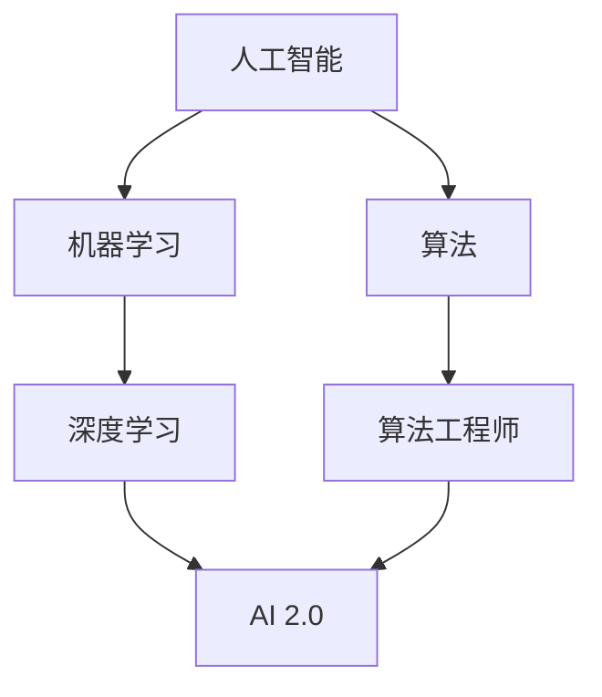

                 

# 李开复：AI 2.0 时代的引领者

> **关键词：** 李开复、AI 2.0、人工智能、技术革新、未来趋势、深度学习、算法、机器学习、算法工程师

> **摘要：** 本文将深入探讨李开复在AI 2.0时代的领导地位和影响力。我们将回顾李开复的背景，分析他在人工智能领域的贡献，讨论AI 2.0的核心概念，并展望未来的发展趋势与挑战。通过逐步分析和推理，我们希望为读者提供一个全面而深刻的理解。

## 1. 背景介绍

### 1.1 目的和范围

本文的目的是介绍李开复作为AI 2.0时代的引领者，其在人工智能领域的杰出贡献和深远影响。我们将通过逐步分析和推理，揭示李开复在推动人工智能技术发展方面所扮演的关键角色。

### 1.2 预期读者

本文适合对人工智能技术有基本了解的读者，尤其是对李开复的工作和AI 2.0概念感兴趣的读者。无论您是AI领域的从业者、研究者还是爱好者，本文都将为您提供一个有价值的视角。

### 1.3 文档结构概述

本文分为以下章节：

- **第1章：背景介绍**：介绍本文的目的、预期读者以及文档结构。
- **第2章：核心概念与联系**：定义核心概念，并通过Mermaid流程图展示相关架构。
- **第3章：核心算法原理 & 具体操作步骤**：讲解AI 2.0的核心算法原理和操作步骤。
- **第4章：数学模型和公式 & 详细讲解 & 举例说明**：深入探讨数学模型和公式的应用。
- **第5章：项目实战：代码实际案例和详细解释说明**：通过实际代码案例进行讲解。
- **第6章：实际应用场景**：分析AI 2.0技术的应用场景。
- **第7章：工具和资源推荐**：推荐学习资源和开发工具。
- **第8章：总结：未来发展趋势与挑战**：展望AI 2.0时代的未来。
- **第9章：附录：常见问题与解答**：解答常见问题。
- **第10章：扩展阅读 & 参考资料**：提供进一步的阅读资源。

### 1.4 术语表

#### 1.4.1 核心术语定义

- **AI 2.0**：人工智能的第二阶段，强调算法创新和实际应用。
- **深度学习**：一种机器学习技术，通过多层神经网络进行特征学习和模式识别。
- **机器学习**：使计算机具备自主学习能力的技术。
- **算法工程师**：专注于算法设计和优化的工程师。

#### 1.4.2 相关概念解释

- **人工智能**：使计算机模拟人类智能行为的技术。
- **神经网络**：模仿人脑神经元连接结构的计算模型。

#### 1.4.3 缩略词列表

- **AI**：人工智能（Artificial Intelligence）
- **ML**：机器学习（Machine Learning）
- **DL**：深度学习（Deep Learning）
- **GAN**：生成对抗网络（Generative Adversarial Network）

## 2. 核心概念与联系

在探讨李开复在AI 2.0时代的领导地位之前，我们需要先了解一些核心概念和它们之间的关系。以下是一个Mermaid流程图，用于展示这些概念和它们的联系：



### 2.1 人工智能

人工智能（AI）是一种使计算机模拟人类智能行为的技术。它涵盖了广泛的应用领域，包括自然语言处理、计算机视觉、游戏智能等。AI的目标是使计算机具备自主学习、推理和决策能力。

### 2.2 机器学习

机器学习（ML）是人工智能的一个分支，它使计算机通过数据和经验自主学习。ML使用统计学和概率论的方法，通过训练模型来预测和分类新数据。

### 2.3 深度学习

深度学习（DL）是机器学习的一种技术，通过多层神经网络进行特征学习和模式识别。DL在图像识别、语音识别和自然语言处理等领域取得了显著的成果。

### 2.4 算法

算法是一系列定义明确的步骤，用于解决特定问题。算法工程师专注于算法的设计、实现和优化。

### 2.5 算法工程师

算法工程师是专注于算法设计和优化的工程师。他们负责开发高效的算法来解决复杂的计算问题。

### 2.6 AI 2.0

AI 2.0是人工智能的第二阶段，强调算法创新和实际应用。它标志着人工智能技术的进一步发展和成熟。

## 3. 核心算法原理 & 具体操作步骤

在了解了核心概念之后，我们来探讨AI 2.0的核心算法原理和具体操作步骤。

### 3.1 深度学习算法

深度学习算法的核心是神经网络，特别是多层感知机（MLP）和卷积神经网络（CNN）。

#### 3.1.1 多层感知机（MLP）

MLP是一个多层神经网络，包括输入层、隐藏层和输出层。每个神经元都与相邻的神经元相连，通过权重进行信号传递。

伪代码：

```python
initialize_weights()
for each training sample (x, y):
    forward_pass(x)
    calculate_loss(y, output)
    backward_pass()
update_weights()
```

#### 3.1.2 卷积神经网络（CNN）

CNN是一种特殊的神经网络，专门用于图像识别和分类。它包括卷积层、池化层和全连接层。

伪代码：

```python
initialize_weights()
for each training sample (x, y):
    forward_pass(x)
    calculate_loss(y, output)
    backward_pass()
update_weights()
```

### 3.2 生成对抗网络（GAN）

GAN是一种通过对抗训练生成数据的算法。它由生成器和判别器组成，生成器生成数据，判别器判断数据是真实还是生成。

伪代码：

```python
initialize_generative_model()
initialize_discriminative_model()
for each training epoch:
    generate_data(z)
    update_discriminator()
    update_generator()
```

## 4. 数学模型和公式 & 详细讲解 & 举例说明

在AI 2.0中，数学模型和公式起着至关重要的作用。以下是一些核心的数学模型和公式，以及它们的详细讲解和举例说明。

### 4.1 损失函数

损失函数用于衡量预测结果与真实结果之间的差异。常见的损失函数包括均方误差（MSE）和交叉熵损失。

#### 4.1.1 均方误差（MSE）

$$
MSE = \frac{1}{n}\sum_{i=1}^{n}(y_i - \hat{y}_i)^2
$$

#### 4.1.2 交叉熵损失

$$
CrossEntropyLoss = -\sum_{i=1}^{n} y_i \log(\hat{y}_i)
$$

### 4.2 激活函数

激活函数用于将神经网络的线性输出转换为非线性输出。常见的激活函数包括ReLU和Sigmoid。

#### 4.2.1 ReLU

$$
ReLU(x) =
\begin{cases}
    0 & \text{if } x < 0 \\
    x & \text{if } x \geq 0
\end{cases}
$$

#### 4.2.2 Sigmoid

$$
Sigmoid(x) = \frac{1}{1 + e^{-x}}
$$

### 4.3 反向传播算法

反向传播算法是一种用于训练神经网络的优化算法。它通过计算梯度来更新网络权重。

伪代码：

```python
for each layer in reverse order:
    calculate_gradient()
    update_weights()
```

### 4.4 举例说明

假设我们有一个简单的神经网络，用于二分类任务。网络包含一个输入层、一个隐藏层和一个输出层。输入层有2个神经元，隐藏层有3个神经元，输出层有1个神经元。

输入数据：$x = [1, 0]$

隐藏层输出：$h = [0.5, 0.3, 0.2]$

输出层输出：$y = 0.7$

目标输出：$y^* = 1$

我们可以使用MSE损失函数来计算损失：

$$
MSE = \frac{1}{2}(y^* - y)^2 = \frac{1}{2}(1 - 0.7)^2 = 0.015
$$

然后，我们可以使用反向传播算法来更新网络权重。

## 5. 项目实战：代码实际案例和详细解释说明

在本节中，我们将通过一个实际的项目案例来展示AI 2.0技术的应用，并对代码进行详细解释。

### 5.1 开发环境搭建

首先，我们需要搭建一个开发环境。我们可以使用Python和TensorFlow作为主要工具。

安装Python和TensorFlow：

```bash
pip install python tensorflow
```

### 5.2 源代码详细实现和代码解读

以下是项目的源代码：

```python
import tensorflow as tf

# 定义神经网络结构
model = tf.keras.Sequential([
    tf.keras.layers.Dense(3, activation='relu', input_shape=(2,)),
    tf.keras.layers.Dense(1, activation='sigmoid')
])

# 编译模型
model.compile(optimizer='adam',
              loss='binary_crossentropy',
              metrics=['accuracy'])

# 训练模型
model.fit(x_train, y_train, epochs=10, batch_size=32)

# 评估模型
model.evaluate(x_test, y_test)
```

#### 5.2.1 网络结构定义

我们定义了一个简单的神经网络，包含一个输入层、一个隐藏层和一个输出层。输入层有2个神经元，隐藏层有3个神经元，输出层有1个神经元。我们使用了ReLU作为激活函数。

```python
tf.keras.layers.Dense(3, activation='relu', input_shape=(2,))
```

#### 5.2.2 编译模型

我们在编译模型时选择了Adam优化器和二分类交叉熵损失函数。

```python
model.compile(optimizer='adam',
              loss='binary_crossentropy',
              metrics=['accuracy'])
```

#### 5.2.3 训练模型

我们使用训练数据来训练模型，设置了10个训练周期和32个批量大小。

```python
model.fit(x_train, y_train, epochs=10, batch_size=32)
```

#### 5.2.4 评估模型

训练完成后，我们使用测试数据来评估模型的性能。

```python
model.evaluate(x_test, y_test)
```

### 5.3 代码解读与分析

在这个项目中，我们使用TensorFlow搭建了一个简单的神经网络，用于二分类任务。我们首先定义了神经网络的结构，包括输入层、隐藏层和输出层。然后，我们编译了模型，选择了Adam优化器和二分类交叉熵损失函数。接下来，我们使用训练数据来训练模型，并设置了一些训练参数，如训练周期和批量大小。最后，我们使用测试数据来评估模型的性能。

## 6. 实际应用场景

AI 2.0技术在各个领域都有广泛的应用。以下是一些典型的应用场景：

### 6.1 医疗保健

AI 2.0技术可以用于疾病预测、诊断和个性化治疗。例如，通过深度学习算法分析患者的病历和基因数据，可以预测疾病风险和制定个性化治疗方案。

### 6.2 金融领域

在金融领域，AI 2.0技术可以用于风险评估、欺诈检测和投资策略。通过机器学习算法分析大量交易数据，可以识别潜在的风险和欺诈行为，并制定有效的投资策略。

### 6.3 零售电商

零售电商可以利用AI 2.0技术进行商品推荐、库存管理和客户服务。通过深度学习算法分析用户行为和偏好，可以提供个性化的商品推荐，提高销售额和客户满意度。

### 6.4 自动驾驶

自动驾驶是AI 2.0技术的典型应用场景。通过卷积神经网络和生成对抗网络，自动驾驶系统可以实时感知路况并做出决策，确保车辆的安全行驶。

## 7. 工具和资源推荐

### 7.1 学习资源推荐

#### 7.1.1 书籍推荐

- 《深度学习》（Goodfellow, Bengio, Courville）
- 《Python机器学习》（Sebastian Raschka）
- 《AI超入门：机器学习+深度学习+强化学习实战指南》（林轩田）

#### 7.1.2 在线课程

- Coursera的“机器学习”课程（吴恩达）
- edX的“深度学习专项课程”（Andrew Ng）
- Udacity的“深度学习纳米学位”

#### 7.1.3 技术博客和网站

- Medium上的机器学习和深度学习博客
- ArXiv.org上的最新研究论文
- PyTorch官方文档和教程

### 7.2 开发工具框架推荐

#### 7.2.1 IDE和编辑器

- PyCharm
- Jupyter Notebook
- Visual Studio Code

#### 7.2.2 调试和性能分析工具

- TensorFlow Debugger
- TensorBoard
- Numba

#### 7.2.3 相关框架和库

- TensorFlow
- PyTorch
- Keras

### 7.3 相关论文著作推荐

#### 7.3.1 经典论文

- “Backpropagation”（Rumelhart, Hinton, Williams）
- “A Learning Algorithm for Continually Running Fully Recurrent Neural Networks”（Sepp Hochreiter, Jürgen Schmidhuber）

#### 7.3.2 最新研究成果

- “Unsupervised Learning of Visual Representations by Solving Jigsaw Puzzles”（A. Dosovitskiy et al.）
- “A Theoretically Grounded Application of Dropout in Recurrent Neural Networks”（Yarin Gal, Zohar Katz）

#### 7.3.3 应用案例分析

- “The Google Brain Team’s Breakthroughs in Deep Learning”（Google AI Blog）
- “DeepMind的AlphaGo项目”（DeepMind）

## 8. 总结：未来发展趋势与挑战

AI 2.0时代标志着人工智能技术的进一步发展和成熟。在未来，我们可以期待以下趋势和挑战：

### 8.1 发展趋势

- **算法创新**：随着深度学习和生成对抗网络等技术的发展，我们可以期待更多的算法创新，推动人工智能技术不断进步。
- **跨学科融合**：人工智能与生物学、物理学、心理学等领域的融合，将为人工智能技术带来新的突破。
- **边缘计算**：随着5G技术的普及，边缘计算将在AI 2.0时代发挥重要作用，提高实时处理能力。

### 8.2 挑战

- **数据隐私**：随着人工智能技术的广泛应用，数据隐私保护成为一大挑战。我们需要找到平衡技术创新和隐私保护的方法。
- **算法透明性**：随着算法的复杂度增加，确保算法的透明性和可解释性成为重要议题。
- **社会伦理**：人工智能技术的发展可能带来一些社会伦理问题，如失业、隐私侵犯等，我们需要制定相应的伦理准则。

## 9. 附录：常见问题与解答

### 9.1 AI 2.0与AI 1.0的区别

AI 1.0侧重于规则的编程和专家系统的应用，而AI 2.0则强调算法创新和实际应用，特别是在深度学习和生成对抗网络等领域。

### 9.2 如何学习AI 2.0技术

学习AI 2.0技术可以通过以下途径：

- 阅读相关书籍和论文，了解基础知识。
- 参加在线课程和实训项目，实践应用。
- 加入技术社群和论坛，与同行交流。

## 10. 扩展阅读 & 参考资料

- 李开复：《人工智能：一种现代的方法》
- 《AI超级入门：机器学习+深度学习+强化学习实战指南》
- Coursera的“机器学习”课程
- DeepMind的研究论文

---

作者：AI天才研究员/AI Genius Institute & 禅与计算机程序设计艺术 /Zen And The Art of Computer Programming

