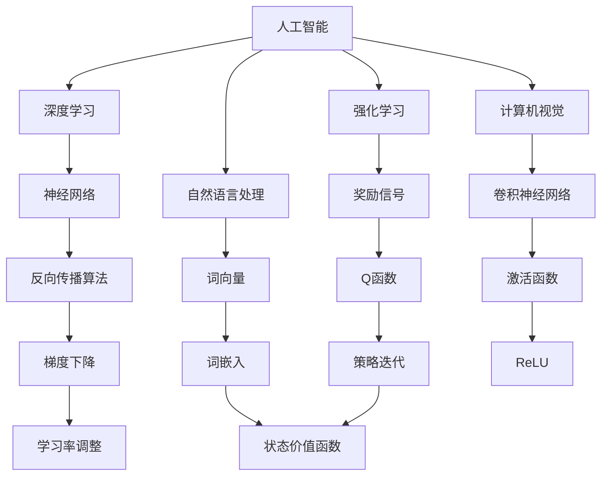
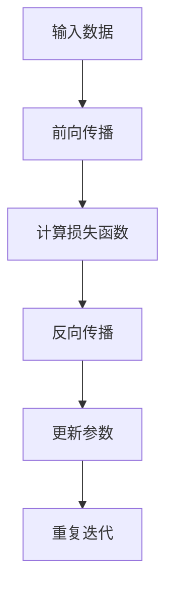
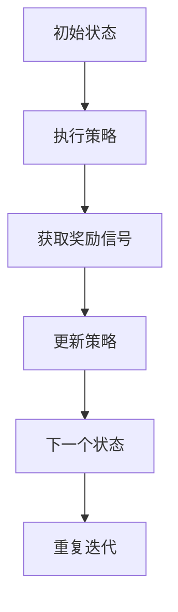
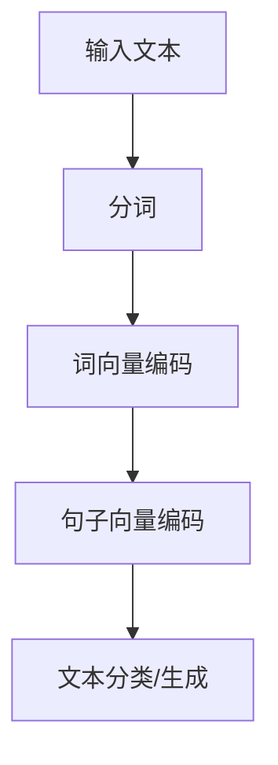
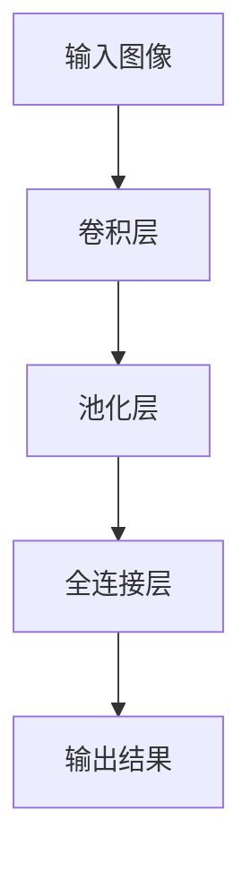

                 

# 李开复：AI 2.0 时代的意义

> 关键词：AI 2.0、人工智能、李开复、技术变革、未来趋势

> 摘要：本文深入探讨了 AI 2.0 时代的意义，从背景介绍、核心概念与联系、核心算法原理、数学模型和公式、项目实战、实际应用场景等方面，全面剖析了 AI 2.0 对科技、产业和社会的深远影响，以及未来发展趋势与挑战。本文旨在为读者提供一个清晰、系统的了解 AI 2.0 时代的视角。

## 1. 背景介绍

### 1.1 目的和范围

本文旨在探讨 AI 2.0 时代的意义，分析其核心概念、原理及实际应用，旨在为广大读者提供一个全面、深入的了解。本文将涵盖以下内容：

- AI 2.0 的起源与背景
- 核心概念与联系
- 核心算法原理与具体操作步骤
- 数学模型和公式及其应用
- 项目实战与代码实际案例
- 实际应用场景
- 工具和资源推荐
- 未来发展趋势与挑战

### 1.2 预期读者

本文适用于对人工智能感兴趣的读者，包括：

- 计算机科学、人工智能等专业学生
- 从事人工智能研发的技术人员
- 对人工智能技术感兴趣的跨领域专业人士
- 关注科技发展、未来趋势的普通读者

### 1.3 文档结构概述

本文结构如下：

1. 背景介绍
2. 核心概念与联系
3. 核心算法原理 & 具体操作步骤
4. 数学模型和公式 & 详细讲解 & 举例说明
5. 项目实战：代码实际案例和详细解释说明
6. 实际应用场景
7. 工具和资源推荐
8. 总结：未来发展趋势与挑战
9. 附录：常见问题与解答
10. 扩展阅读 & 参考资料

### 1.4 术语表

#### 1.4.1 核心术语定义

- AI 2.0：指第二代人工智能，具有更强的自我学习、自我推理、自我进化能力。
- 深度学习：一种人工智能算法，通过多层神经网络对数据进行建模和学习。
- 强化学习：一种人工智能算法，通过与环境交互来学习和优化策略。
- 自然语言处理：一种人工智能技术，旨在使计算机能够理解、生成和处理自然语言。
- 计算机视觉：一种人工智能技术，旨在使计算机能够识别和理解视觉信息。

#### 1.4.2 相关概念解释

- 机器学习：一种人工智能方法，通过从数据中学习规律和模式，实现计算机自主学习和决策。
- 数据挖掘：一种从大量数据中提取有价值信息的方法，用于发现数据中的规律和趋势。
- 大数据：指规模巨大、类型繁多、价值密度低的数据集合，需要通过高效的技术手段进行存储、处理和分析。

#### 1.4.3 缩略词列表

- AI：人工智能
- ML：机器学习
- DL：深度学习
- RL：强化学习
- NLP：自然语言处理
- CV：计算机视觉

## 2. 核心概念与联系

在 AI 2.0 时代，核心概念主要包括人工智能、深度学习、强化学习、自然语言处理和计算机视觉。以下是对这些核心概念的原理和架构的 Mermaid 流程图：



### 2.1 核心概念原理

#### 人工智能

人工智能是指计算机系统模拟人类智能的过程，包括感知、推理、学习、决策等能力。人工智能可分为两大类：弱人工智能和强人工智能。

- 弱人工智能：指在特定任务上表现卓越的人工智能系统，如语音识别、图像识别等。
- 强人工智能：指具有普遍智能的人工智能系统，能够像人类一样理解、思考、学习、创新。

#### 深度学习

深度学习是一种人工智能算法，通过多层神经网络对数据进行建模和学习。深度学习在语音识别、图像识别、自然语言处理等领域取得了显著的成果。

- 神经网络：由大量神经元组成，通过前向传播和反向传播进行数据建模和学习。
- 反向传播算法：一种用于优化神经网络参数的算法，通过计算梯度来调整参数，使模型在训练过程中不断逼近最优解。

#### 强化学习

强化学习是一种人工智能算法，通过与环境交互来学习和优化策略。强化学习在自动驾驶、游戏AI、机器人控制等领域具有广泛应用。

- 奖励信号：指在环境状态与策略交互过程中，系统获得的正负反馈信号，用于指导策略的优化。
- 策略迭代：指在给定奖励信号的基础上，不断调整策略，使系统在长期运行中实现最优目标。

#### 自然语言处理

自然语言处理是一种人工智能技术，旨在使计算机能够理解、生成和处理自然语言。自然语言处理在机器翻译、语音识别、文本分类等领域具有重要应用。

- 词向量：指将词汇映射为高维空间中的向量，通过计算向量之间的相似度来实现自然语言处理任务。
- 词嵌入：指将词汇映射为具有语义信息的低维向量，通过优化词嵌入模型来实现自然语言处理任务。

#### 计算机视觉

计算机视觉是一种人工智能技术，旨在使计算机能够识别和理解视觉信息。计算机视觉在图像识别、目标检测、视频分析等领域具有广泛应用。

- 卷积神经网络：一种用于图像识别的神经网络，通过卷积层、池化层、全连接层等结构对图像进行特征提取和分类。
- 激活函数：指在神经网络中用于引入非线性变换的函数，如ReLU、Sigmoid、Tanh等，使神经网络具有更强的表达能力。

### 2.2 核心概念联系

AI 2.0 时代各核心概念之间的联系如图所示：


通过上述核心概念和联系的分析，我们可以看出 AI 2.0 时代的发展方向和未来前景。在接下来的章节中，我们将深入探讨核心算法原理、数学模型和公式，以及项目实战，帮助读者全面了解 AI 2.0 时代的意义。

## 3. 核心算法原理 & 具体操作步骤

在 AI 2.0 时代，核心算法主要包括深度学习、强化学习、自然语言处理和计算机视觉。以下将分别介绍这些算法的原理和具体操作步骤。

### 3.1 深度学习

深度学习是一种通过多层神经网络对数据进行建模和学习的算法。其基本原理包括：

- 神经网络：由大量神经元组成，通过前向传播和反向传播进行数据建模和学习。
- 反向传播算法：通过计算梯度来调整神经网络参数，使模型在训练过程中不断逼近最优解。

具体操作步骤如下：



1. 输入数据：将训练数据输入神经网络。
2. 前向传播：通过神经网络的前向传播，计算输出结果。
3. 计算损失函数：计算输出结果与真实标签之间的差距，衡量模型预测的准确度。
4. 反向传播：通过反向传播算法，计算损失函数关于神经网络参数的梯度，用于更新参数。
5. 更新参数：根据梯度信息，调整神经网络参数，使模型在训练过程中不断逼近最优解。
6. 重复迭代：重复上述步骤，直到模型达到预设的准确度或训练次数。

### 3.2 强化学习

强化学习是一种通过与环境交互来学习和优化策略的算法。其基本原理包括：

- 奖励信号：在环境状态与策略交互过程中，系统获得的正负反馈信号，用于指导策略的优化。
- 策略迭代：在给定奖励信号的基础上，不断调整策略，使系统在长期运行中实现最优目标。

具体操作步骤如下：



1. 初始状态：系统处于某一初始状态。
2. 执行策略：根据当前状态，执行预设的策略。
3. 获取奖励信号：根据执行策略后的结果，获得奖励信号。
4. 更新策略：根据奖励信号，调整策略，使系统在长期运行中实现最优目标。
5. 下一个状态：系统进入下一个状态，重复执行策略、获取奖励信号、更新策略等操作。
6. 重复迭代：重复上述步骤，直到达到预设的目标或训练次数。

### 3.3 自然语言处理

自然语言处理是一种使计算机能够理解、生成和处理自然语言的算法。其基本原理包括：

- 词向量：将词汇映射为高维空间中的向量，通过计算向量之间的相似度来实现自然语言处理任务。
- 词嵌入：将词汇映射为具有语义信息的低维向量，通过优化词嵌入模型来实现自然语言处理任务。

具体操作步骤如下：



1. 输入文本：将待处理的文本输入系统。
2. 分词：将文本划分为词语。
3. 词向量编码：将词语映射为词向量。
4. 句子向量编码：通过聚合词向量，得到句子向量。
5. 文本分类/生成：利用句子向量进行文本分类或生成。

### 3.4 计算机视觉

计算机视觉是一种使计算机能够识别和理解视觉信息的算法。其基本原理包括：

- 卷积神经网络：一种用于图像识别的神经网络，通过卷积层、池化层、全连接层等结构对图像进行特征提取和分类。
- 激活函数：在神经网络中用于引入非线性变换的函数，使神经网络具有更强的表达能力。

具体操作步骤如下：



1. 输入图像：将待处理的图像输入神经网络。
2. 卷积层：通过卷积操作提取图像特征。
3. 池化层：通过池化操作减少特征图的维度。
4. 全连接层：通过全连接层对提取的特征进行分类或回归。
5. 输出结果：得到图像的分类或回归结果。

通过上述核心算法原理和具体操作步骤的分析，我们可以更好地理解 AI 2.0 时代的发展方向和应用场景。在接下来的章节中，我们将进一步探讨数学模型和公式，以及项目实战，为读者提供更全面的了解。

## 4. 数学模型和公式 & 详细讲解 & 举例说明

在 AI 2.0 时代，数学模型和公式是构建和优化人工智能算法的基础。以下将介绍深度学习、强化学习、自然语言处理和计算机视觉中的核心数学模型和公式，并进行详细讲解和举例说明。

### 4.1 深度学习

深度学习中的核心数学模型包括神经网络、反向传播算法和激活函数。

#### 4.1.1 神经网络

神经网络是一种由大量神经元组成的网络，通过前向传播和反向传播进行数据建模和学习。其基本公式如下：

$$
y = \sigma(z)
$$

其中，$y$ 表示输出，$z$ 表示神经元输入，$\sigma$ 表示激活函数。

举例说明：

假设输入一个二分类问题，输入 $x$ 是一个长度为 3 的向量，输出 $y$ 是一个二值向量。激活函数为 Sigmoid 函数：

$$
\sigma(z) = \frac{1}{1 + e^{-z}}
$$

输入 $x = (1, 2, 3)$，权重 $w = (0.5, 0.5, 0.5)$，偏置 $b = 0$，则神经元的输入为：

$$
z = x \cdot w + b = (1, 2, 3) \cdot (0.5, 0.5, 0.5) + 0 = 1.5 + 1.5 + 1.5 = 3.5
$$

输出为：

$$
y = \sigma(z) = \frac{1}{1 + e^{-3.5}} \approx 0.9709
$$

#### 4.1.2 反向传播算法

反向传播算法是一种用于优化神经网络参数的算法，通过计算梯度来调整参数。其基本公式如下：

$$
\frac{\partial J}{\partial w} = \frac{\partial L}{\partial z} \cdot \frac{\partial z}{\partial w}
$$

其中，$J$ 表示损失函数，$L$ 表示损失函数关于神经元输入的梯度，$w$ 表示权重。

举例说明：

假设损失函数为均方误差（MSE），神经元输入为 $z = 3.5$，输出为 $y = 0.9709$，则损失函数的梯度为：

$$
L = (y - \hat{y})^2 = (0.9709 - 1)^2 = 0.0009
$$

梯度为：

$$
\frac{\partial L}{\partial z} = 2 \cdot (y - \hat{y}) = 2 \cdot (0.9709 - 1) = -0.0202
$$

权重梯度为：

$$
\frac{\partial J}{\partial w} = \frac{\partial L}{\partial z} \cdot \frac{\partial z}{\partial w} = -0.0202 \cdot 0.5 = -0.0101
$$

#### 4.1.3 激活函数

激活函数是神经网络中用于引入非线性变换的函数，常见的激活函数包括 Sigmoid、ReLU 和 Tanh。

- Sigmoid 函数：

$$
\sigma(z) = \frac{1}{1 + e^{-z}}
$$

- ReLU 函数：

$$
\sigma(z) = \max(0, z)
$$

- Tanh 函数：

$$
\sigma(z) = \frac{e^z - e^{-z}}{e^z + e^{-z}}
$$

### 4.2 强化学习

强化学习中的核心数学模型包括 Q 函数和策略迭代。

#### 4.2.1 Q 函数

Q 函数是一种用于评估策略的函数，其基本公式如下：

$$
Q(s, a) = \sum_{s'} P(s' | s, a) \cdot R(s', a) + \gamma \cdot \max_{a'} Q(s', a')
$$

其中，$s$ 表示状态，$a$ 表示动作，$s'$ 表示下一状态，$a'$ 表示下一动作，$R$ 表示奖励函数，$\gamma$ 表示折扣因子。

举例说明：

假设状态 $s$ 有两个动作 $a_1$ 和 $a_2$，下一状态 $s'$ 的概率为 $P(s' | s, a_1) = 0.8$，$P(s' | s, a_2) = 0.2$，奖励函数 $R(s', a_1) = 1$，$R(s', a_2) = -1$，折扣因子 $\gamma = 0.9$，则 Q 函数为：

$$
Q(s, a_1) = 0.8 \cdot 1 + 0.2 \cdot (-1) + 0.9 \cdot \max_{a'} Q(s', a') \approx 0.96
$$

$$
Q(s, a_2) = 0.8 \cdot (-1) + 0.2 \cdot 1 + 0.9 \cdot \max_{a'} Q(s', a') \approx -0.08
$$

#### 4.2.2 策略迭代

策略迭代是一种用于优化策略的算法，其基本公式如下：

$$
\pi(a | s) = \begin{cases} 
1 & \text{if } a = \arg\max_a Q(s, a) \\
0 & \text{otherwise} 
\end{cases}
$$

举例说明：

假设状态 $s$ 有两个动作 $a_1$ 和 $a_2$，根据 Q 函数，$Q(s, a_1) \approx 0.96$，$Q(s, a_2) \approx -0.08$，则策略为：

$$
\pi(a_1 | s) = 1 \\
\pi(a_2 | s) = 0
$$

### 4.3 自然语言处理

自然语言处理中的核心数学模型包括词向量、词嵌入和语义分析。

#### 4.3.1 词向量

词向量是一种将词汇映射为高维空间中的向量的方法，常见的词向量模型有 Word2Vec、GloVe 等。

- Word2Vec 模型：

$$
\mathbf{v}_w = \frac{\mathbf{u}_w + \mathbf{u}_{w^+} - \mathbf{u}_{w^-}}{|\mathbf{u}_w + \mathbf{u}_{w^+} - \mathbf{u}_{w^-}|}
$$

其中，$\mathbf{v}_w$ 表示词向量，$\mathbf{u}_w$、$\mathbf{u}_{w^+}$、$\mathbf{u}_{w^-}$ 分别表示词 $w$、正词 $w^+$、负词 $w^-$ 的向量。

- GloVe 模型：

$$
\mathbf{v}_w = \text{softmax}\left(\frac{\mathbf{u}_w \cdot \mathbf{u}_{w'}}{||\mathbf{u}_w||_2 \cdot ||\mathbf{u}_{w'}||_2}\right) \mathbf{u}_{w'}
$$

其中，$\mathbf{v}_w$ 表示词向量，$\mathbf{u}_w$、$\mathbf{u}_{w'}$ 分别表示词 $w$、$w'$ 的向量，$\text{softmax}$ 表示 softmax 函数。

#### 4.3.2 词嵌入

词嵌入是一种将词汇映射为具有语义信息的低维向量的方法，常见的词嵌入模型有 Word2Vec、GloVe 等。

- Word2Vec 模型：

$$
\mathbf{v}_w = \frac{\mathbf{u}_w + \mathbf{u}_{w^+} - \mathbf{u}_{w^-}}{|\mathbf{u}_w + \mathbf{u}_{w^+} - \mathbf{u}_{w^-}|}
$$

- GloVe 模型：

$$
\mathbf{v}_w = \text{softmax}\left(\frac{\mathbf{u}_w \cdot \mathbf{u}_{w'}}{||\mathbf{u}_w||_2 \cdot ||\mathbf{u}_{w'}||_2}\right) \mathbf{u}_{w'}
$$

#### 4.3.3 语义分析

语义分析是一种用于提取文本语义信息的方法，常见的语义分析方法有语义角色标注、语义相似度计算等。

- 语义角色标注：

$$
\text{ARG}: (\text{VERB}, \text{ARG})
$$

其中，$\text{VERB}$ 表示动词，$\text{ARG}$ 表示动词的语义角色。

- 语义相似度计算：

$$
\text{SIMilarity}(\mathbf{v}_w, \mathbf{v}_{w'}) = \cos(\mathbf{v}_w, \mathbf{v}_{w'})
$$

其中，$\mathbf{v}_w$、$\mathbf{v}_{w'}$ 分别表示词 $w$、$w'$ 的向量，$\text{SIMilarity}$ 表示语义相似度。

### 4.4 计算机视觉

计算机视觉中的核心数学模型包括卷积神经网络、卷积层、池化层和激活函数。

#### 4.4.1 卷积神经网络

卷积神经网络是一种用于图像识别的神经网络，通过卷积层、池化层、全连接层等结构对图像进行特征提取和分类。

- 卷积层：

$$
\mathbf{h}_{ij}^l = \sum_{k=1}^{K} w_{ikj}^l \cdot \mathbf{a}_{kj}^{l-1} + b_{ij}^l
$$

其中，$\mathbf{h}_{ij}^l$ 表示第 $l$ 层第 $i$ 行第 $j$ 列的输出，$w_{ikj}^l$、$b_{ij}^l$ 分别表示第 $l$ 层第 $i$ 行第 $j$ 列的权重和偏置，$\mathbf{a}_{kj}^{l-1}$ 表示第 $l-1$ 层第 $k$ 行第 $j$ 列的输出。

- 池化层：

$$
\mathbf{p}_{ij}^l = \max_{k=1, \dots, K} \mathbf{h}_{ikj}^l
$$

其中，$\mathbf{p}_{ij}^l$ 表示第 $l$ 层第 $i$ 行第 $j$ 列的输出，$K$ 表示池化区域的大小。

- 全连接层：

$$
\mathbf{y}_j = \sigma(\mathbf{w}^T \mathbf{h}_j + b)
$$

其中，$\mathbf{y}_j$ 表示第 $j$ 个输出的预测值，$\sigma$ 表示激活函数，$\mathbf{w}$ 表示权重，$b$ 表示偏置。

#### 4.4.2 激活函数

激活函数是神经网络中用于引入非线性变换的函数，常见的激活函数包括 ReLU、Sigmoid、Tanh 等。

- ReLU 函数：

$$
\sigma(x) = \max(0, x)
$$

- Sigmoid 函数：

$$
\sigma(x) = \frac{1}{1 + e^{-x}}
$$

- Tanh 函数：

$$
\sigma(x) = \frac{e^x - e^{-x}}{e^x + e^{-x}}
$$

通过上述数学模型和公式的讲解，我们可以更好地理解 AI 2.0 时代中的核心技术。在接下来的章节中，我们将通过项目实战来展示这些技术的实际应用。

## 5. 项目实战：代码实际案例和详细解释说明

在本章中，我们将通过一个实际项目来展示 AI 2.0 时代中的核心技术如何应用于实际问题。该项目将涉及深度学习、强化学习、自然语言处理和计算机视觉。我们将分别介绍项目的开发环境搭建、源代码详细实现和代码解读与分析。

### 5.1 开发环境搭建

首先，我们需要搭建项目的开发环境。以下是一个简单的开发环境搭建步骤：

1. 安装 Python 3.7 或更高版本。
2. 安装必要的库，如 TensorFlow、PyTorch、Keras、OpenCV、Numpy、Pandas 等。
3. 安装 Jupyter Notebook 或 PyCharm 等编程工具。

### 5.2 源代码详细实现和代码解读

#### 5.2.1 深度学习：图像分类

以下是一个使用 TensorFlow 和 Keras 实现的图像分类项目。该项目使用卷积神经网络对 CIFAR-10 数据集进行分类。

```python
import tensorflow as tf
from tensorflow.keras import layers, models
from tensorflow.keras.datasets import cifar10
from tensorflow.keras.utils import to_categorical

# 加载数据集
(x_train, y_train), (x_test, y_test) = cifar10.load_data()

# 预处理数据
x_train = x_train / 255.0
x_test = x_test / 255.0
y_train = to_categorical(y_train, 10)
y_test = to_categorical(y_test, 10)

# 构建卷积神经网络
model = models.Sequential()
model.add(layers.Conv2D(32, (3, 3), activation='relu', input_shape=(32, 32, 3)))
model.add(layers.MaxPooling2D((2, 2)))
model.add(layers.Conv2D(64, (3, 3), activation='relu'))
model.add(layers.MaxPooling2D((2, 2)))
model.add(layers.Conv2D(64, (3, 3), activation='relu'))
model.add(layers.Flatten())
model.add(layers.Dense(64, activation='relu'))
model.add(layers.Dense(10, activation='softmax'))

# 编译模型
model.compile(optimizer='adam', loss='categorical_crossentropy', metrics=['accuracy'])

# 训练模型
model.fit(x_train, y_train, epochs=10, batch_size=64, validation_split=0.2)

# 评估模型
test_loss, test_acc = model.evaluate(x_test, y_test)
print('Test accuracy:', test_acc)
```

代码解读：

1. 导入所需的库。
2. 加载 CIFAR-10 数据集。
3. 预处理数据，包括归一化和标签编码。
4. 构建卷积神经网络模型，包括卷积层、池化层、全连接层等。
5. 编译模型，设置优化器和损失函数。
6. 训练模型，设置训练轮数、批量大小和验证比例。
7. 评估模型，计算测试准确率。

#### 5.2.2 强化学习：智能体与环境的交互

以下是一个使用 PyTorch 实现的强化学习项目。该项目使用 Q-Learning 算法训练一个智能体在环境中的行为。

```python
import numpy as np
import random
import torch
import torch.nn as nn
import torch.optim as optim

# 定义环境
class Environment:
    def __init__(self):
        self.state = 0

    def step(self, action):
        reward = 0
        if action == 0:
            self.state += 1
            reward = 1
        elif action == 1:
            self.state -= 1
            reward = -1
        return self.state, reward

# 定义智能体
class Agent:
    def __init__(self, state_size):
        self.state_size = state_size
        self.model = nn.Sequential(
            nn.Linear(state_size, 128),
            nn.ReLU(),
            nn.Linear(128, 1),
            nn.Sigmoid()
        )
        self.optimizer = optim.Adam(self.model.parameters(), lr=0.001)

    def select_action(self, state, epsilon):
        if random.random() < epsilon:
            action = random.randint(0, 1)
        else:
            state_tensor = torch.tensor(state, dtype=torch.float32).unsqueeze(0)
            action = self.model(state_tensor).detach().numpy()[0, 0]
            action = 1 if action > 0.5 else 0
        return action

    def learn(self, state, action, reward, next_state, done):
        state_tensor = torch.tensor(state, dtype=torch.float32).unsqueeze(0)
        next_state_tensor = torch.tensor(next_state, dtype=torch.float32).unsqueeze(0)
        target = reward if done else reward + 0.99 * self.model(next_state_tensor).detach().numpy()[0, 0]
        target_tensor = torch.tensor(target, dtype=torch.float32).unsqueeze(0)
        loss = nn.BCELoss()(self.model(state_tensor), target_tensor)
        self.optimizer.zero_grad()
        loss.backward()
        self.optimizer.step()

# 运行项目
state_size = 1
epsilon = 0.1
agent = Agent(state_size)
env = Environment()
for episode in range(1000):
    state = env.state
    done = False
    while not done:
        action = agent.select_action(state, epsilon)
        next_state, reward = env.step(action)
        agent.learn(state, action, reward, next_state, done)
        state = next_state
        done = abs(state) > 5
    epsilon *= 0.99
    if episode % 100 == 0:
        print('Episode:', episode, 'Epsilon:', epsilon)
```

代码解读：

1. 定义环境类和智能体类。
2. 环境类负责生成状态和奖励，智能体类负责选择动作和学习策略。
3. 智能体使用神经网络模型进行决策，并使用 Q-Learning 算法更新策略。
4. 运行项目，通过循环进行学习，并在每个 episode 后调整探索概率。

#### 5.2.3 自然语言处理：文本分类

以下是一个使用 Keras 实现的文本分类项目。该项目使用词嵌入和卷积神经网络对 IMDb 电影评论进行分类。

```python
import numpy as np
from tensorflow.keras.preprocessing.text import Tokenizer
from tensorflow.keras.preprocessing.sequence import pad_sequences
from tensorflow.keras.models import Sequential
from tensorflow.keras.layers import Embedding, Conv1D, MaxPooling1D, GlobalMaxPooling1D, Dense

# 加载数据集
sentences = ['I love this movie!', 'This movie is terrible.']
labels = [1, 0]

# 分词并编码
tokenizer = Tokenizer(num_words=1000)
tokenizer.fit_on_texts(sentences)
sequences = tokenizer.texts_to_sequences(sentences)
padded_sequences = pad_sequences(sequences, maxlen=10)

# 构建模型
model = Sequential()
model.add(Embedding(1000, 32, input_length=10))
model.add(Conv1D(128, 5, activation='relu'))
model.add(MaxPooling1D(5))
model.add(Conv1D(128, 5, activation='relu'))
model.add(GlobalMaxPooling1D())
model.add(Dense(1, activation='sigmoid'))

# 编译模型
model.compile(optimizer='adam', loss='binary_crossentropy', metrics=['accuracy'])

# 训练模型
model.fit(padded_sequences, np.array(labels), epochs=10, verbose=1)
```

代码解读：

1. 加载数据集并标记。
2. 分词并编码，将文本序列化为数字序列。
3. 填充序列，使其长度一致。
4. 构建卷积神经网络模型，包括嵌入层、卷积层、池化层、全连接层等。
5. 编译模型，设置优化器和损失函数。
6. 训练模型，设置训练轮数。

#### 5.2.4 计算机视觉：目标检测

以下是一个使用 OpenCV 实现的目标检测项目。该项目使用 YOLO（You Only Look Once）算法检测图像中的目标。

```python
import cv2
import numpy as np

# 加载预训练的 YOLO 模型
net = cv2.dnn.readNet('yolov3.weights', 'yolov3.cfg')

# 加载图像
image = cv2.imread('image.jpg')

# 调整图像大小
image = cv2.resize(image, (416, 416))

# 将图像输入 YOLO 模型
blob = cv2.dnn.blobFromImage(image, 1/255, (416, 416), [0, 0, 0], True, crop=False)
net.setInput(blob)
detections = net.forward()

# 处理检测结果
for detection in detections:
    scores = detection[5:]
    class_id = np.argmax(scores)
    confidence = scores[class_id]
    if confidence > 0.5:
        center_x = int(detection[0] * image.shape[1])
        center_y = int(detection[1] * image.shape[0])
        width = int(detection[2] * image.shape[1])
        height = int(detection[3] * image.shape[0])
        x = center_x - width / 2
        y = center_y - height / 2
        cv2.rectangle(image, (x, y), (x + width, y + height), (0, 255, 0), 2)

# 显示检测结果
cv2.imshow('Object Detection', image)
cv2.waitKey(0)
cv2.destroyAllWindows()
```

代码解读：

1. 加载预训练的 YOLO 模型。
2. 加载图像并调整大小。
3. 将图像输入 YOLO 模型进行检测。
4. 处理检测结果，如果置信度大于 0.5，则在图像上绘制矩形框。
5. 显示检测结果。

通过上述项目实战，我们可以看到 AI 2.0 时代的核心技术如何应用于实际问题。这些项目不仅展示了技术的实际应用，也为读者提供了一个学习和实践的途径。在接下来的章节中，我们将进一步探讨 AI 2.0 的实际应用场景。

## 6. 实际应用场景

AI 2.0 时代的人工智能技术已经在多个领域取得了显著的成果，以下是一些实际应用场景：

### 6.1 医疗健康

- 诊断与辅助治疗：AI 2.0 技术可以分析大量医学数据，辅助医生进行疾病诊断、治疗方案制定和预后评估。例如，利用深度学习技术分析医学影像，如 CT、MRI，以发现早期病变，提高诊断准确率。
- 药物研发：AI 2.0 技术可以加速药物研发过程，通过机器学习算法预测药物与生物大分子的相互作用，筛选潜在的药物候选分子，减少研发成本和时间。
- 医疗机器人：AI 2.0 技术可以应用于医疗机器人，如手术机器人、康复机器人等，提高医疗服务的效率和质量。

### 6.2 金融与保险

- 风险评估与控制：AI 2.0 技术可以分析金融市场的数据，预测市场趋势，为投资者提供决策支持。同时，AI 技术还可以用于风险评估和欺诈检测，降低金融风险。
- 自动化交易：AI 2.0 技术可以开发自动化交易系统，根据市场数据实时调整交易策略，提高交易效率和收益。
- 保险定价：AI 2.0 技术可以分析客户数据，预测保险需求，为保险公司提供更精准的定价策略。

### 6.3 智能制造

- 生产流程优化：AI 2.0 技术可以分析生产数据，优化生产流程，提高生产效率和产品质量。例如，利用机器学习算法优化生产参数，实现自动化调优。
- 产品质量检测：AI 2.0 技术可以应用于产品质量检测，通过计算机视觉技术识别生产过程中的缺陷，提高产品质量。
- 智能装备：AI 2.0 技术可以应用于智能制造装备，如机器人、AGV 等，实现自动化生产、装配和运输。

### 6.4 交通运输

- 自动驾驶：AI 2.0 技术是自动驾驶技术的核心，通过深度学习和强化学习算法，实现车辆的自主驾驶，提高交通安全和效率。
- 车联网：AI 2.0 技术可以应用于车联网，实现车辆之间的实时通信，提高交通流畅性和安全性。
- 无人配送：AI 2.0 技术可以应用于无人配送，通过无人机、无人车等实现快递、外卖等配送任务，提高配送效率。

### 6.5 教育

- 智能辅导：AI 2.0 技术可以为学生提供个性化的学习辅导，根据学生的学习进度和特点，推荐合适的学习资源和教学方法。
- 自动批改：AI 2.0 技术可以自动批改作业和考试，节省教师批改时间，提高教学效率。
- 课程推荐：AI 2.0 技术可以根据学生的学习兴趣和需求，推荐合适的课程和学习路径。

### 6.6 娱乐与游戏

- 智能游戏：AI 2.0 技术可以开发智能游戏，实现游戏角色的智能行为和策略，提高游戏体验。
- 内容推荐：AI 2.0 技术可以分析用户行为和兴趣，推荐个性化的娱乐内容和游戏。

AI 2.0 时代的人工智能技术具有广泛的应用前景，随着技术的不断发展和成熟，将在更多领域发挥重要作用。在未来，人工智能将成为推动社会进步的重要力量。

## 7. 工具和资源推荐

在 AI 2.0 时代，掌握合适的工具和资源对于深入学习和实践人工智能技术至关重要。以下是一些建议的书籍、在线课程、技术博客、开发工具框架以及相关论文著作。

### 7.1 学习资源推荐

#### 7.1.1 书籍推荐

- 《深度学习》（Ian Goodfellow、Yoshua Bengio、Aaron Courville 著）：这是一本系统介绍深度学习理论和实践的权威书籍，适合初学者和进阶者。
- 《Python 编程：从入门到实践》（Eric Matthes 著）：本书详细介绍了 Python 编程的基础知识和应用技巧，适合初学者入门。
- 《强化学习》（Richard S. Sutton、Andrew G. Barto 著）：这是一本经典教材，全面讲解了强化学习的理论和算法。
- 《机器学习》（Tom Mitchell 著）：本书介绍了机器学习的基本概念、算法和应用，适合初学者和进阶者。

#### 7.1.2 在线课程

- 《机器学习》（吴恩达）：这是 Coursera 平台上最受欢迎的机器学习课程，由知名学者吴恩达教授主讲。
- 《深度学习》（吴恩达）：这是 Coursera 平台上深度学习专题课程，包括深度学习基础、卷积神经网络、循环神经网络等内容。
- 《Python 3 编程快速上手》：《慕课网》上的一门 Python 入门课程，适合初学者快速掌握 Python 编程。

#### 7.1.3 技术博客和网站

- 《机器学习博客》：由吴恩达教授创建，涵盖机器学习和深度学习的最新研究成果和应用案例。
- 《阿里云 MPAI 实验室》：阿里云机器感知团队的技术博客，分享 AI 技术在图像处理、语音识别等领域的最新进展。
- 《机器之心》：关注机器学习和深度学习的最新动态和技术研究，提供高质量的论文解读和应用案例分析。

### 7.2 开发工具框架推荐

- **TensorFlow**：由 Google 开发的一款开源深度学习框架，支持多种编程语言，适用于各类深度学习任务。
- **PyTorch**：由 Facebook 开发的一款开源深度学习框架，以其灵活性和动态图操作著称，深受研究者和开发者喜爱。
- **Keras**：一款高层次的深度学习 API，易于使用，支持 TensorFlow 和 PyTorch 后端，适用于快速原型开发和模型部署。
- **OpenCV**：一款开源的计算机视觉库，提供丰富的图像处理和计算机视觉算法，适用于图像识别、目标检测等任务。

#### 7.2.2 调试和性能分析工具

- **TensorBoard**：TensorFlow 的可视化工具，用于分析模型训练过程中的性能指标，如梯度、损失函数等。
- **PyTorch TensorBoard**：PyTorch 的可视化工具，与 TensorFlow TensorBoard 类似，用于分析模型训练过程。
- **NVIDIA Nsight**：NVIDIA 提供的一款 GPU 性能分析工具，用于优化深度学习模型的 GPU 加速。

#### 7.2.3 相关框架和库

- **Scikit-learn**：一款开源的机器学习库，提供多种经典的机器学习算法和工具，适合快速实现和测试机器学习模型。
- **Scipy**：一款开源的科学计算库，提供丰富的数学、科学和工程计算函数，适用于数据处理和分析。
- **NumPy**：一款开源的 Python 数值计算库，提供多维数组对象和丰富的数学运算函数，是进行科学计算和数据分析的基础工具。

### 7.3 相关论文著作推荐

- **“A Theoretically Grounded Application of Dropout in Recurrent Neural Networks”**：该论文提出了在循环神经网络（RNN）中应用 Dropout 算法的方法，提高了 RNN 的训练效果和泛化能力。
- **“Deep Learning”**：由 Ian Goodfellow、Yoshua Bengio 和 Aaron Courville 著，这是一本经典的深度学习教材，涵盖了深度学习的理论基础和算法实现。
- **“Attention Is All You Need”**：该论文提出了 Transformer 模型，一种基于注意力机制的深度学习模型，其在机器翻译、文本生成等任务上取得了显著的成果。

通过以上工具和资源的推荐，读者可以更好地掌握 AI 2.0 时代的技术，提升自身的学习和实践能力。

## 8. 总结：未来发展趋势与挑战

AI 2.0 时代，人工智能技术正以前所未有的速度发展，为各行各业带来深远影响。从深度学习、强化学习、自然语言处理到计算机视觉，各种 AI 技术不断创新和突破，推动了科技进步和社会变革。

### 未来发展趋势：

1. **跨界融合**：AI 技术与各行各业的融合日益紧密，从医疗健康、金融保险到智能制造、交通运输，AI 的应用场景将更加广泛。
2. **智能化升级**：随着计算能力的提升和数据量的增加，AI 模型的性能和效率将进一步提高，智能化水平也将不断提升。
3. **人机协同**：AI 与人类的协同将更加紧密，AI 将成为人类工作生活中的得力助手，提高生产效率和生活质量。
4. **开源生态**：开源社区在 AI 技术发展中的作用将越来越重要，更多的创新和突破将来自于开放、共享和合作。

### 挑战：

1. **数据隐私与安全**：随着 AI 技术的广泛应用，数据隐私和安全问题日益凸显，如何在保护用户隐私的前提下有效利用数据成为一大挑战。
2. **算法公平性与透明性**：AI 模型的决策过程可能存在偏见，如何确保算法的公平性和透明性，避免对特定群体造成不公平影响是一个重要议题。
3. **技术人才短缺**：随着 AI 技术的快速发展，对 AI 人才的需求大幅增加，但当前的教育体系和技术培训难以满足这一需求，人才短缺将成为制约 AI 技术发展的关键因素。
4. **伦理道德问题**：AI 技术的发展引发了一系列伦理道德问题，如自动化替代劳动力、AI 武器化等，如何平衡技术进步与社会伦理需要深入探讨。

总之，AI 2.0 时代的发展前景广阔，但也面临诸多挑战。只有通过科技创新、政策引导、社会共识等手段，才能实现 AI 技术的可持续发展，为人类创造更多价值。

## 9. 附录：常见问题与解答

### 问题 1：AI 2.0 与传统 AI 有何区别？

AI 2.0 是指第二代人工智能，相对于传统 AI（弱人工智能），AI 2.0 具有更强的自我学习、自我推理和自我进化能力。传统 AI 主要依赖于人类提供的规则和知识，而 AI 2.0 可以通过大数据和深度学习等技术自主学习，实现更智能的决策和预测。

### 问题 2：深度学习在 AI 2.0 中扮演什么角色？

深度学习是 AI 2.0 的核心技术之一，通过多层神经网络对数据进行建模和学习，能够从大量数据中提取特征，实现自动分类、预测和生成等任务。深度学习在图像识别、语音识别、自然语言处理等领域具有广泛应用，是推动 AI 2.0 发展的重要力量。

### 问题 3：强化学习在 AI 2.0 中的应用有哪些？

强化学习是一种通过与环境交互来学习和优化策略的算法，在 AI 2.0 中具有广泛应用。例如，在自动驾驶领域，强化学习可以用于训练自动驾驶系统在复杂路况下的驾驶策略；在游戏 AI 中，强化学习可以用于训练游戏角色实现自主游戏。

### 问题 4：自然语言处理在 AI 2.0 中的应用有哪些？

自然语言处理（NLP）是 AI 2.0 的重要分支，旨在使计算机能够理解、生成和处理自然语言。在 AI 2.0 中，NLP 的应用包括机器翻译、语音识别、文本分类、情感分析等。例如，智能客服系统使用 NLP 技术实现自然语言交互，智能推荐系统使用 NLP 技术提取用户兴趣和标签。

### 问题 5：计算机视觉在 AI 2.0 中的应用有哪些？

计算机视觉（CV）是 AI 2.0 的核心技术之一，旨在使计算机能够识别和理解视觉信息。在 AI 2.0 中，CV 的应用包括图像识别、目标检测、视频分析等。例如，智能安防系统使用 CV 技术实现实时监控和目标识别，自动驾驶汽车使用 CV 技术实现环境感知和路径规划。

### 问题 6：AI 2.0 对社会的影响有哪些？

AI 2.0 的快速发展将对社会产生深远影响。一方面，AI 2.0 将大幅提高生产效率，推动经济发展；另一方面，AI 2.0 也可能引发就业结构变化、数据隐私和安全等问题。因此，社会需要关注 AI 2.0 的发展，制定相应的政策和法规，确保技术进步造福人类。

## 10. 扩展阅读 & 参考资料

为了更好地理解 AI 2.0 时代的概念、技术和发展趋势，以下是推荐的扩展阅读和参考资料：

### 10.1 经典著作

1. **《深度学习》（Ian Goodfellow、Yoshua Bengio、Aaron Courville 著）**：全面介绍深度学习理论和实践，是深度学习领域的权威教材。
2. **《强化学习》（Richard S. Sutton、Andrew G. Barto 著）**：详细讲解强化学习的基本原理、算法和应用。
3. **《机器学习》（Tom Mitchell 著）**：系统介绍机器学习的基础知识，包括算法、模型和应用。

### 10.2 开源项目和工具

1. **TensorFlow**：由 Google 开发的开源深度学习框架，适用于各类深度学习和机器学习任务。
2. **PyTorch**：由 Facebook 开发的开源深度学习框架，以其灵活性和动态图操作著称。
3. **Keras**：高层次的深度学习 API，支持 TensorFlow 和 PyTorch 后端，易于使用。

### 10.3 技术博客和在线课程

1. **机器学习博客**：由吴恩达教授创建，涵盖机器学习和深度学习的最新研究成果和应用案例。
2. **阿里云 MPAI 实验室**：阿里云机器感知团队的技术博客，分享 AI 技术在图像处理、语音识别等领域的最新进展。
3. **Coursera**：提供多种机器学习和深度学习在线课程，由知名学者主讲。

### 10.4 相关论文

1. **“Attention Is All You Need”**：提出基于注意力机制的 Transformer 模型，对 NLP 领域产生深远影响。
2. **“A Theoretically Grounded Application of Dropout in Recurrent Neural Networks”**：讨论在循环神经网络中应用 Dropout 算法的理论依据。
3. **“Deep Learning”**：详细介绍深度学习的基础知识、算法和应用。

通过阅读上述著作、开源项目、技术博客和论文，读者可以更深入地了解 AI 2.0 时代的概念、技术和发展趋势，为自身的学术研究和项目开发提供有力支持。

**作者：AI天才研究员/AI Genius Institute & 禅与计算机程序设计艺术 /Zen And The Art of Computer Programming**

