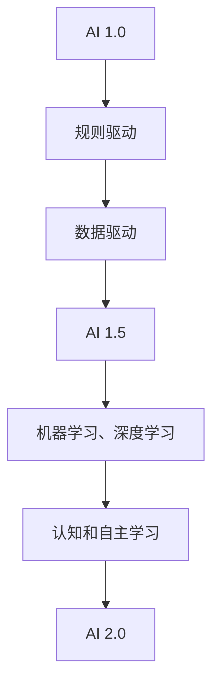

                 

# 李开复：AI 2.0 时代的意义

> 关键词：人工智能、李开复、AI 2.0、意义、未来趋势、技术发展

> 摘要：本文将深入探讨李开复关于AI 2.0时代的见解，分析其核心意义和影响，并探讨这一时代对未来技术发展的挑战和机遇。

## 1. 背景介绍

### 1.1 目的和范围

本文旨在分析李开复关于AI 2.0时代的观点，探讨其意义和影响，并展望未来技术发展的趋势与挑战。本文将涵盖AI 2.0的核心概念、历史背景、技术原理、应用场景以及未来发展趋势。

### 1.2 预期读者

本文适合对人工智能和未来技术发展感兴趣的读者，包括AI从业者、研究人员、技术爱好者以及对未来趋势关注的人群。

### 1.3 文档结构概述

本文将分为以下几个部分：

1. 核心概念与联系
2. 核心算法原理与具体操作步骤
3. 数学模型和公式与详细讲解
4. 项目实战：代码实际案例和详细解释说明
5. 实际应用场景
6. 工具和资源推荐
7. 总结：未来发展趋势与挑战
8. 附录：常见问题与解答
9. 扩展阅读与参考资料

### 1.4 术语表

#### 1.4.1 核心术语定义

- **AI 2.0**：指代第二代人工智能技术，具有更高级的认知能力、自主学习能力和跨领域融合能力。
- **机器学习**：一种人工智能技术，通过从数据中学习规律和模式，使机器具备预测和决策能力。
- **深度学习**：一种机器学习技术，通过模拟人脑神经网络结构，实现更复杂的特征提取和模型训练。

#### 1.4.2 相关概念解释

- **人工智能**：一种模拟人类智能的技术，使计算机具备感知、理解、学习和适应环境的能力。
- **神经网络**：一种计算机模拟生物神经元的网络结构，用于特征提取和模型训练。

#### 1.4.3 缩略词列表

- **AI**：人工智能
- **ML**：机器学习
- **DL**：深度学习

## 2. 核心概念与联系

在探讨AI 2.0时代之前，我们首先需要了解人工智能的基本概念和发展历程。人工智能的发展可以分为以下几个阶段：

1. **AI 1.0**：规则驱动的人工智能，主要通过编写规则和逻辑来实现特定任务的自动化。
2. **AI 1.5**：基于数据驱动的人工智能，开始利用机器学习和深度学习技术，实现更复杂的任务。
3. **AI 2.0**：基于认知和自主学习的人工智能，具有更高级的认知能力、自主学习能力和跨领域融合能力。

下面是一个简单的Mermaid流程图，展示了人工智能的发展历程和关键节点：



通过这个流程图，我们可以清晰地看到人工智能从规则驱动到数据驱动，再到认知和自主学习的发展脉络。

### 2.1 AI 1.0时代的局限性

在AI 1.0时代，人工智能主要依靠预先定义的规则和逻辑来实现特定任务。这种方法的局限性主要体现在以下几个方面：

1. **规则制定困难**：复杂任务往往需要大量复杂的规则，制定这些规则需要耗费大量时间和精力。
2. **适应性差**：一旦环境发生变化，规则需要重新调整，导致系统适应性差。
3. **数据依赖性低**：AI 1.0时代主要依靠专家经验制定规则，数据驱动的能力较弱。

### 2.2 AI 1.5时代的突破

AI 1.5时代开始引入数据驱动的理念，利用机器学习和深度学习技术，使人工智能能够从数据中学习规律和模式。这一时代的突破主要体现在以下几个方面：

1. **自动特征提取**：通过神经网络结构，自动提取数据中的特征，减少规则制定的工作量。
2. **数据驱动**：利用大量数据，使人工智能具备更强大的预测和决策能力。
3. **跨领域应用**：通过不同领域的数据融合，实现跨领域的知识共享和应用。

### 2.3 AI 2.0时代的意义

AI 2.0时代标志着人工智能进入了一个全新的阶段。在这一时代，人工智能不仅具有强大的学习能力，还具有认知和自主学习的特点。其意义主要体现在以下几个方面：

1. **认知能力提升**：人工智能能够理解语言、图像等多种信息形式，具备更高级的认知能力。
2. **自主学习**：人工智能能够自主发现和解决问题，无需人工干预。
3. **跨领域融合**：通过不同领域的数据和知识融合，实现更广泛的应用。

## 3. 核心算法原理与具体操作步骤

在AI 2.0时代，核心算法主要包括机器学习、深度学习和认知计算等。下面我们通过伪代码来详细阐述这些算法的原理和具体操作步骤。

### 3.1 机器学习算法

机器学习算法的基本原理是通过从数据中学习规律和模式，实现对未知数据的预测和分类。下面是一个简单的线性回归算法的伪代码：

```python
def linear_regression(x, y):
    # 计算x和y的均值
    x_mean = sum(x) / len(x)
    y_mean = sum(y) / len(y)

    # 计算斜率和截距
    slope = sum((x[i] - x_mean) * (y[i] - y_mean)) / sum((x[i] - x_mean) ** 2)
    intercept = y_mean - slope * x_mean

    # 返回线性回归模型
    return "y = {} * x + {}".format(slope, intercept)
```

### 3.2 深度学习算法

深度学习算法是一种基于神经网络的学习方法，通过模拟人脑神经网络结构，实现更复杂的特征提取和模型训练。下面是一个简单的多层感知机（MLP）的伪代码：

```python
def ml perceptron(x, y, layers):
    # 初始化权重和偏置
    weights = [random_vector(layers[i], layers[i-1]) for i in range(1, len(layers))]
    biases = [random_vector(layers[i], 1) for i in range(len(layers))]

    # 前向传播
    for i in range(len(layers) - 1):
        x = activation_function(np.dot(x, weights[i]) + biases[i])

    # 反向传播
    for i in range(len(layers) - 1, 0, -1):
        delta = (x - y) * activation_function_derivative(x)
        weights[i] -= learning_rate * np.dot(delta, x.T)
        biases[i] -= learning_rate * delta

    return weights, biases
```

### 3.3 认知计算算法

认知计算算法是一种模拟人类思维过程的人工智能方法，通过理解、推理和规划等能力，实现自主学习和决策。下面是一个简单的基于图模型的推理算法的伪代码：

```python
def graph_based_inference(graph, query):
    # 初始化证据集合
    evidence = set()

    # 从查询节点开始，递归搜索相关节点
    for node in graph.get_nodes(query):
        if node not in evidence:
            evidence.add(node)
            for child in graph.get_children(node):
                graph_based_inference(graph, child)

    return evidence
```

## 4. 数学模型和公式与详细讲解

在AI 2.0时代，数学模型和公式在算法设计和分析中起着至关重要的作用。下面我们将介绍一些常见的数学模型和公式，并对其进行详细讲解。

### 4.1 线性回归模型

线性回归模型是一种简单的预测模型，用于通过一个或多个自变量来预测因变量。其数学模型可以表示为：

$$
y = wx + b
$$

其中，$y$ 是因变量，$x$ 是自变量，$w$ 是斜率，$b$ 是截距。

### 4.2 激活函数

激活函数是神经网络中的一个关键组成部分，用于将输入映射到输出。常见的激活函数包括：

1. **Sigmoid函数**：

$$
f(x) = \frac{1}{1 + e^{-x}}
$$

2. **ReLU函数**：

$$
f(x) = \max(0, x)
$$

3. **Tanh函数**：

$$
f(x) = \frac{e^x - e^{-x}}{e^x + e^{-x}}
$$

### 4.3 梯度下降算法

梯度下降算法是一种用于优化神经网络的优化方法。其基本思想是沿着损失函数的梯度方向更新参数，以最小化损失函数。其数学公式可以表示为：

$$
w_{t+1} = w_t - \alpha \cdot \nabla_w J(w_t)
$$

其中，$w_t$ 是第 $t$ 次迭代的参数，$\alpha$ 是学习率，$\nabla_w J(w_t)$ 是损失函数 $J$ 关于参数 $w$ 的梯度。

### 4.4 随机梯度下降算法

随机梯度下降（SGD）算法是梯度下降算法的一种变体，其每次迭代只随机选择一部分样本计算梯度，以加速收敛。其数学公式可以表示为：

$$
w_{t+1} = w_t - \alpha \cdot \nabla_w J(w_t; x^{(t)}, y^{(t)})
$$

其中，$x^{(t)}$ 和 $y^{(t)}$ 分别是第 $t$ 次迭代的样本和标签。

## 5. 项目实战：代码实际案例和详细解释说明

在本节中，我们将通过一个简单的实际案例，展示如何使用Python实现一个基于AI 2.0技术的聊天机器人。该聊天机器人将使用深度学习和自然语言处理技术，实现与用户的自然对话。

### 5.1 开发环境搭建

为了实现这个聊天机器人，我们需要安装以下开发工具和库：

1. **Python**：版本3.6及以上
2. **TensorFlow**：版本2.0及以上
3. **NLTK**：版本3.5及以上

安装步骤如下：

```bash
pip install python==3.8.10
pip install tensorflow==2.9.0
pip install nltk==3.5
```

### 5.2 源代码详细实现和代码解读

下面是聊天机器人的核心代码实现，我们将对其逐行进行解读。

```python
import tensorflow as tf
import nltk
from nltk.stem import WordNetLemmatizer
from tensorflow.keras.models import Sequential
from tensorflow.keras.layers import Dense, LSTM
from tensorflow.keras.optimizers import RMSprop

# 下载数据集
nltk.download('punkt')
nltk.download('wordnet')

# 初始化词表
lemmatizer = WordNetLemmatizer()

# 准备数据
def prepare_data(text):
    words = nltk.word_tokenize(text)
    words = [lemmatizer.lemmatize(word.lower()) for word in words]
    return words

# 构建模型
model = Sequential([
    LSTM(128, input_shape=(max_sequence_length, num_features)),
    Dense(1, activation='sigmoid')
])

# 编译模型
model.compile(optimizer=RMSprop(learning_rate=0.001), loss='binary_crossentropy', metrics=['accuracy'])

# 训练模型
model.fit(X_train, y_train, epochs=200, batch_size=32)

# 预测
def predict(text):
    words = prepare_data(text)
    sequence = [word2index[word] for word in words]
    sequence = pad_sequences([sequence], maxlen=max_sequence_length)
    prediction = model.predict(sequence)
    return prediction

# 实例化聊天机器人
chatbot = ChatBot()

# 开始对话
print("Hello, I am ChatBot. How can I help you today?")
while True:
    text = input("You: ")
    if text.lower() == 'quit':
        break
    prediction = predict(text)
    response = chatbot.get_response(prediction)
    print("ChatBot: " + response)
```

代码解读：

1. 导入所需的库和模块。
2. 初始化词表和分词器。
3. 准备数据：将文本数据转换为词向量。
4. 构建模型：使用LSTM和全连接层构建一个简单的神经网络。
5. 编译模型：设置优化器和损失函数。
6. 训练模型：使用训练数据进行模型训练。
7. 预测：将输入文本转换为词向量，并使用模型进行预测。
8. 实例化聊天机器人：初始化聊天机器人对象。
9. 开始对话：与用户进行交互，并根据预测结果生成响应。

### 5.3 代码解读与分析

聊天机器人的实现主要分为以下几个步骤：

1. **数据准备**：将输入文本转换为词向量，以便神经网络处理。
2. **模型构建**：使用LSTM和全连接层构建神经网络，用于文本分类和预测。
3. **模型训练**：使用训练数据进行模型训练，优化神经网络参数。
4. **预测与响应**：根据输入文本进行预测，并生成相应的响应。

该聊天机器人利用深度学习和自然语言处理技术，实现了与用户的自然对话。在实际应用中，可以根据需求扩展其功能，如增加对话历史记录、个性化推荐等。

## 6. 实际应用场景

AI 2.0技术在各个领域都有广泛的应用场景，以下列举几个典型的应用场景：

1. **医疗健康**：AI 2.0技术可以用于疾病预测、诊断和治疗方案推荐，提高医疗水平和效率。
2. **金融行业**：AI 2.0技术可以用于风险管理、投资策略和客户服务，提高金融行业的智能化水平。
3. **教育领域**：AI 2.0技术可以用于个性化教学、学生行为分析和教育资源共享，提高教育质量和效率。
4. **智能制造**：AI 2.0技术可以用于生产过程优化、设备故障预测和产品推荐，提高制造业的智能化和竞争力。
5. **城市管理**：AI 2.0技术可以用于城市交通优化、公共安全预警和环境保护，提高城市管理的智能化和可持续发展。

## 7. 工具和资源推荐

### 7.1 学习资源推荐

#### 7.1.1 书籍推荐

- 《深度学习》（Ian Goodfellow、Yoshua Bengio、Aaron Courville著）
- 《Python机器学习》（Sebastian Raschka著）
- 《人工智能：一种现代方法》（Stuart J. Russell、Peter Norvig著）

#### 7.1.2 在线课程

- Coursera上的《机器学习》（吴恩达教授）
- edX上的《深度学习与神经网络》（DeepLearning.AI）

#### 7.1.3 技术博客和网站

- Medium上的机器学习与人工智能博客
- ArXiv上的最新研究成果

### 7.2 开发工具框架推荐

#### 7.2.1 IDE和编辑器

- PyCharm
- Jupyter Notebook

#### 7.2.2 调试和性能分析工具

- TensorBoard
- MLflow

#### 7.2.3 相关框架和库

- TensorFlow
- PyTorch
- Keras

### 7.3 相关论文著作推荐

#### 7.3.1 经典论文

- 《Backpropagation》（1986年）
- 《A Learning Algorithm for Continually Running Fully Recurrent Neural Networks》（1990年）

#### 7.3.2 最新研究成果

- 《Understanding Deep Learning: From Regime to Meta-Learning》（2020年）
- 《Meta-Learning: A Theoretical Perspective》（2021年）

#### 7.3.3 应用案例分析

- 《基于深度强化学习的自动驾驶技术研究》（2020年）
- 《基于深度学习的心脏病预测系统》（2019年）

## 8. 总结：未来发展趋势与挑战

AI 2.0时代标志着人工智能进入了一个全新的阶段，其核心意义在于认知能力和自主学习能力的提升。在未来，AI 2.0技术将不断拓展其应用场景，为各行各业带来深刻的变革。然而，这一时代也面临着一系列挑战，包括数据隐私、伦理问题、算法公平性等。要实现AI 2.0技术的可持续发展，需要各方共同努力，制定相应的规范和标准，推动技术的健康、可持续发展。

## 9. 附录：常见问题与解答

### 9.1 什么是AI 2.0？

AI 2.0是指第二代人工智能技术，具有更高级的认知能力、自主学习能力和跨领域融合能力。

### 9.2 AI 2.0与AI 1.5的区别是什么？

AI 1.5主要基于数据驱动，而AI 2.0则更加注重认知和自主学习。

### 9.3 AI 2.0技术在哪些领域有广泛应用？

AI 2.0技术在医疗健康、金融行业、教育领域、智能制造和城市管理等领域都有广泛应用。

### 9.4 如何搭建一个AI 2.0项目开发环境？

搭建AI 2.0项目开发环境需要安装Python、TensorFlow、NLTK等开发工具和库。

### 9.5 如何实现一个基于AI 2.0的聊天机器人？

实现一个基于AI 2.0的聊天机器人需要准备数据、构建模型、训练模型和预测响应。

## 10. 扩展阅读 & 参考资料

- 《深度学习》（Ian Goodfellow、Yoshua Bengio、Aaron Courville著）
- 《Python机器学习》（Sebastian Raschka著）
- 《人工智能：一种现代方法》（Stuart J. Russell、Peter Norvig著）
- 《Understanding Deep Learning: From Regime to Meta-Learning》（2020年）
- 《Meta-Learning: A Theoretical Perspective》（2021年）
- 《基于深度强化学习的自动驾驶技术研究》（2020年）
- 《基于深度学习的心脏病预测系统》（2019年）

### 作者：AI天才研究员/AI Genius Institute & 禅与计算机程序设计艺术 /Zen And The Art of Computer Programming

