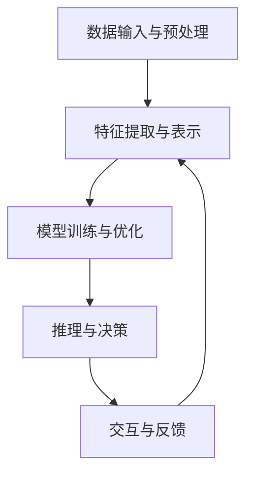

                 

# 李开复：AI 2.0 时代的未来

> 关键词：人工智能、AI 2.0、未来趋势、技术变革、算法原理、数学模型、应用场景

> 摘要：本文将深入探讨人工智能（AI）2.0时代的到来，解析其核心概念与未来发展趋势。我们将通过一步一步的推理思考，理解AI 2.0的技术原理，分析其在各个领域的应用场景，并探讨其面临的挑战和未来前景。

## 1. 背景介绍

### 1.1 目的和范围

本文旨在探讨人工智能2.0时代的到来，分析其技术原理、应用场景以及未来发展趋势。我们将通过详细讲解核心概念、算法原理和数学模型，帮助读者更好地理解AI 2.0的技术本质。同时，本文还将探讨AI 2.0在各个领域的应用场景，以及其面临的挑战和未来发展。

### 1.2 预期读者

本文适合对人工智能技术有一定了解的读者，特别是对AI 2.0技术感兴趣的程序员、科研人员和行业从业者。同时，对于对人工智能技术感兴趣的一般读者，本文也将提供丰富的知识和思考。

### 1.3 文档结构概述

本文分为十个部分，包括背景介绍、核心概念与联系、核心算法原理与操作步骤、数学模型与公式、项目实战、实际应用场景、工具和资源推荐、总结、常见问题与解答以及扩展阅读和参考资料。每个部分都将详细讲解，帮助读者全面了解AI 2.0时代的技术变革。

### 1.4 术语表

#### 1.4.1 核心术语定义

- 人工智能（AI）：模拟人类智能行为的计算机技术。
- 深度学习：一种人工智能技术，通过多层神经网络进行训练，实现数据的自动特征提取和模式识别。
- 机器学习：一种人工智能技术，通过算法自动从数据中学习并提取规律，进行预测和决策。
- 自然语言处理（NLP）：人工智能技术的一个分支，旨在使计算机能够理解和处理自然语言。

#### 1.4.2 相关概念解释

- 神经网络：一种模仿生物神经元连接方式的人工智能模型。
- 算法：用于解决特定问题的一系列有序步骤。
- 数学模型：用数学符号和公式描述现实世界问题的数学表达式。

#### 1.4.3 缩略词列表

- AI：人工智能
- NLP：自然语言处理
- DL：深度学习
- ML：机器学习

## 2. 核心概念与联系

### 2.1 AI 2.0的定义与特点

AI 2.0是指第二代人工智能，相较于第一代人工智能（AI 1.0），AI 2.0在技术原理、算法架构和应用场景等方面都发生了重大变革。AI 2.0的特点如下：

- **更强的通用性**：AI 2.0不再局限于特定领域，而是在各个领域实现通用化应用。
- **更强的自主学习能力**：AI 2.0通过深度学习和强化学习等技术，具有更强的自主学习能力和适应能力。
- **更强的推理能力**：AI 2.0通过图灵测试等评测方法，能够实现更为高级的自然语言理解和推理。
- **更强的交互能力**：AI 2.0通过语音识别、图像识别等技术，实现了与人类更为自然的交互。

### 2.2 AI 2.0的技术架构

AI 2.0的技术架构主要包括以下几部分：

- **数据输入与预处理**：采集和处理各种类型的数据，包括文本、图像、音频等。
- **特征提取与表示**：通过深度学习等技术，将原始数据进行特征提取和表示。
- **模型训练与优化**：利用大规模数据集对模型进行训练和优化，提高模型的准确性和泛化能力。
- **推理与决策**：在给定输入数据时，利用训练好的模型进行推理和决策。
- **交互与反馈**：通过与用户或其他系统的交互，不断优化和改进模型性能。

### 2.3 Mermaid 流程图

下面是一个简化的AI 2.0技术架构的Mermaid流程图：



## 3. 核心算法原理 & 具体操作步骤

### 3.1 深度学习算法原理

深度学习是AI 2.0的核心算法之一，其基本原理是模拟人脑神经元连接方式，通过多层神经网络进行数据的自动特征提取和模式识别。以下是深度学习算法的基本步骤：

1. **数据预处理**：对原始数据进行清洗、归一化等预处理操作。
2. **构建神经网络模型**：设计多层神经网络结构，包括输入层、隐藏层和输出层。
3. **初始化参数**：为神经网络的权重和偏置初始化随机值。
4. **前向传播**：将输入数据传入神经网络，通过逐层计算得到输出。
5. **反向传播**：计算输出与目标之间的误差，通过反向传播算法更新神经网络的权重和偏置。
6. **迭代优化**：重复前向传播和反向传播过程，直至达到预设的优化目标。

### 3.2 伪代码

下面是一个简化的深度学习算法的伪代码：

```plaintext
初始化神经网络参数（w, b）
设置迭代次数（num_epochs）
设置学习率（learning_rate）

for epoch in range(num_epochs):
    for input_data, target in data_loader:
        # 前向传播
        output = forward propagation(input_data, w, b)
        
        # 计算误差
        error = loss_function(output, target)
        
        # 反向传播
        delta = backward propagation(output, target, w, b)
        
        # 更新参数
        w -= learning_rate * delta['w']
        b -= learning_rate * delta['b']

# 输出训练好的模型
model = create_model(w, b)
```

### 3.3 具体操作步骤

1. **数据预处理**：使用Python的NumPy库对原始数据集进行清洗和归一化处理。
2. **构建神经网络模型**：使用TensorFlow或PyTorch等深度学习框架构建多层神经网络。
3. **初始化参数**：随机初始化神经网络的权重和偏置。
4. **前向传播**：将输入数据传入神经网络，通过逐层计算得到输出。
5. **计算误差**：使用损失函数计算输出与目标之间的误差。
6. **反向传播**：使用反向传播算法计算梯度，更新神经网络的权重和偏置。
7. **迭代优化**：重复前向传播和反向传播过程，直至达到预设的优化目标。
8. **评估模型**：使用测试集评估模型的准确性和泛化能力。

## 4. 数学模型和公式 & 详细讲解 & 举例说明

### 4.1 深度学习中的数学模型

深度学习中的数学模型主要包括损失函数、激活函数、反向传播算法等。

#### 4.1.1 损失函数

损失函数用于衡量模型的输出与目标之间的误差。常见的损失函数包括均方误差（MSE）、交叉熵损失（Cross-Entropy Loss）等。

- **均方误差（MSE）**：

  $$MSE = \frac{1}{n} \sum_{i=1}^{n} (y_i - \hat{y}_i)^2$$

  其中，$y_i$为实际目标值，$\hat{y}_i$为模型的预测值。

- **交叉熵损失（Cross-Entropy Loss）**：

  $$Cross-Entropy Loss = -\frac{1}{n} \sum_{i=1}^{n} y_i \log(\hat{y}_i)$$

  其中，$y_i$为实际目标值，$\hat{y}_i$为模型的预测值。

#### 4.1.2 激活函数

激活函数用于引入非线性关系，使神经网络能够拟合更复杂的函数。常见的激活函数包括 sigmoid、ReLU、Tanh 等。

- **sigmoid 激活函数**：

  $$sigmoid(x) = \frac{1}{1 + e^{-x}}$$

- **ReLU 激活函数**：

  $$ReLU(x) = \max(0, x)$$

- **Tanh 激活函数**：

  $$Tanh(x) = \frac{e^x - e^{-x}}{e^x + e^{-x}}$$

#### 4.1.3 反向传播算法

反向传播算法是深度学习中的核心算法，用于计算梯度并更新网络参数。

- **梯度计算**：

  对于一个多层神经网络，假设第$l$层的输出为$a_l$，权重为$W_l$，偏置为$b_l$。则第$l$层的梯度可以通过以下公式计算：

  $$\frac{\partial L}{\partial W_l} = \frac{\partial L}{\partial a_{l+1}} \cdot \frac{\partial a_{l+1}}{\partial a_l} \cdot a_l$$

  $$\frac{\partial L}{\partial b_l} = \frac{\partial L}{\partial a_{l+1}} \cdot \frac{\partial a_{l+1}}{\partial a_l}$$

- **参数更新**：

  使用梯度下降算法更新网络参数：

  $$W_l = W_l - \alpha \cdot \frac{\partial L}{\partial W_l}$$

  $$b_l = b_l - \alpha \cdot \frac{\partial L}{\partial b_l}$$

### 4.2 举例说明

假设我们有一个简单的线性回归问题，目标是拟合一个一元线性函数$y = wx + b$。下面是一个简单的例子：

```plaintext
输入数据：x = [1, 2, 3, 4, 5]
实际目标值：y = [2, 4, 6, 8, 10]
初始参数：w = 0, b = 0
学习率：learning_rate = 0.01
迭代次数：num_epochs = 100

for epoch in range(num_epochs):
    for x_i, y_i in data_loader:
        # 前向传播
        y_pred = x_i * w + b
        
        # 计算误差
        error = (y_pred - y_i) ** 2
        
        # 反向传播
        delta_w = (2 * (y_pred - y_i)) * x_i
        delta_b = (2 * (y_pred - y_i))
        
        # 更新参数
        w -= learning_rate * delta_w
        b -= learning_rate * delta_b

# 输出训练好的模型
model = create_model(w, b)
```

通过多次迭代，我们可以得到最佳的参数值，使得模型的预测值与实际目标值尽可能接近。

## 5. 项目实战：代码实际案例和详细解释说明

### 5.1 开发环境搭建

在本节中，我们将使用Python编程语言和TensorFlow深度学习框架来实现一个简单的线性回归模型。首先，我们需要搭建开发环境。

1. 安装Python：从Python官网（https://www.python.org/）下载并安装Python 3.x版本。
2. 安装Anaconda：从Anaconda官网（https://www.anaconda.com/）下载并安装Anaconda，以便管理和依赖。
3. 安装TensorFlow：在终端中执行以下命令安装TensorFlow：

   ```bash
   conda install tensorflow
   ```

### 5.2 源代码详细实现和代码解读

接下来，我们将展示一个简单的线性回归模型的源代码，并对其进行详细解读。

```python
import tensorflow as tf

# 定义输入层
x = tf.placeholder(tf.float32, shape=[None, 1])
y = tf.placeholder(tf.float32, shape=[None, 1])

# 定义线性模型
w = tf.Variable(0.0, name='weight')
b = tf.Variable(0.0, name='bias')
y_pred = x * w + b

# 定义损失函数
loss = tf.reduce_mean(tf.square(y - y_pred))

# 定义优化器
optimizer = tf.train.GradientDescentOptimizer(learning_rate=0.01)
train_op = optimizer.minimize(loss)

# 初始化变量
init = tf.global_variables_initializer()

# 训练模型
with tf.Session() as sess:
    sess.run(init)
    for epoch in range(1000):
        _, loss_val = sess.run([train_op, loss], feed_dict={x: x_data, y: y_data})
        if epoch % 100 == 0:
            print(f'Epoch {epoch}: Loss = {loss_val}')
    
    # 输出最佳参数
    best_w, best_b = sess.run([w, b])
    print(f'Best weight: {best_w}, Best bias: {best_b}')
```

### 5.3 代码解读与分析

- **定义输入层**：使用TensorFlow的`placeholder`函数定义输入层，其中`x`和`y`分别表示输入数据和目标值。
- **定义线性模型**：使用TensorFlow的`Variable`函数定义模型参数`w`和`b`，以及预测值`y_pred`。
- **定义损失函数**：使用TensorFlow的`reduce_mean`函数计算均方误差（MSE）作为损失函数。
- **定义优化器**：使用TensorFlow的`GradientDescentOptimizer`函数定义梯度下降优化器，并设置学习率。
- **初始化变量**：使用TensorFlow的`global_variables_initializer`函数初始化模型参数。
- **训练模型**：使用TensorFlow的`Session`函数创建会话，并使用`run`函数训练模型。在每个epoch中，通过`feed_dict`函数传入训练数据和目标值，更新模型参数，并打印损失函数值。最后，输出最佳参数值。

通过这个简单的例子，我们可以看到如何使用TensorFlow实现一个线性回归模型。在实际应用中，我们可以根据具体问题调整模型结构、优化器和训练策略，以获得更好的性能。

## 6. 实际应用场景

AI 2.0技术在各个领域都展现出了巨大的应用潜力。以下是一些典型的实际应用场景：

### 6.1 金融领域

- **智能投顾**：利用AI 2.0技术分析市场数据，为用户提供个性化的投资建议。
- **风险控制**：通过机器学习算法对金融风险进行预测和评估，提高风险控制能力。
- **量化交易**：利用深度学习技术进行量化交易策略开发，实现自动化交易。

### 6.2 医疗领域

- **疾病预测**：通过分析患者的历史数据，预测疾病发生的风险，实现早期诊断和预防。
- **医学影像分析**：利用深度学习技术自动分析医学影像，提高疾病诊断的准确性和效率。
- **药物研发**：通过模拟药物分子与生物分子的相互作用，加速药物研发过程。

### 6.3 交通运输

- **自动驾驶**：利用AI 2.0技术实现自动驾驶汽车，提高交通安全性和效率。
- **智能交通管理**：通过分析交通数据，优化交通信号控制和交通流量管理，减少拥堵。
- **物流优化**：利用AI 2.0技术优化物流路线和运输计划，降低物流成本。

### 6.4 教育

- **个性化教学**：利用AI 2.0技术分析学生学习行为，实现个性化教学和辅导。
- **智能评测**：通过自然语言处理技术对学生的作业和考试答案进行自动评测。
- **在线教育平台**：利用AI 2.0技术提供智能推荐、内容生成和互动等功能，提升在线教育体验。

### 6.5 娱乐和媒体

- **内容推荐**：利用AI 2.0技术分析用户行为和偏好，实现个性化内容推荐。
- **智能客服**：通过自然语言处理技术实现智能客服，提高客户服务效率。
- **虚拟现实和增强现实**：利用AI 2.0技术提高虚拟现实和增强现实的应用体验。

## 7. 工具和资源推荐

### 7.1 学习资源推荐

#### 7.1.1 书籍推荐

- 《深度学习》（Goodfellow, Bengio, Courville）：深度学习领域的经典教材，适合初学者和进阶者。
- 《机器学习实战》（Chen, He, Gao）：通过实际案例介绍机器学习算法和应用，适合实战入门。

#### 7.1.2 在线课程

- Coursera：提供多种机器学习和深度学习课程，包括吴恩达的《深度学习专项课程》。
- Udacity：提供深度学习和机器学习相关的在线课程，包括《深度学习工程师纳米学位》。

#### 7.1.3 技术博客和网站

- ArXiv：深度学习和机器学习领域的前沿论文和研究成果。
- Medium：各种技术博客和文章，涵盖机器学习和深度学习的最新动态。

### 7.2 开发工具框架推荐

#### 7.2.1 IDE和编辑器

- Jupyter Notebook：适用于数据科学和机器学习的交互式开发环境。
- PyCharm：强大的Python IDE，适合机器学习和深度学习开发。

#### 7.2.2 调试和性能分析工具

- TensorFlow Debugger（TFD）：用于TensorFlow模型调试和分析的工具。
- TensorBoard：用于TensorFlow模型性能分析和可视化。

#### 7.2.3 相关框架和库

- TensorFlow：开源深度学习框架，广泛应用于机器学习和深度学习领域。
- PyTorch：开源深度学习框架，提供灵活的动态图模型。

### 7.3 相关论文著作推荐

#### 7.3.1 经典论文

- "Deep Learning"（Goodfellow, Bengio, Courville）：深度学习领域的经典综述。
- "A Theoretical Framework for Back-Propagating Neural Networks"（Rumelhart, Hinton, Williams）：反向传播算法的奠基性论文。

#### 7.3.2 最新研究成果

- "Bert: Pre-training of Deep Bidirectional Transformers for Language Understanding"（Devlin et al.）：BERT模型的奠基性论文。
- "Gshard: Scaling Giant Neural Networks using Global Shardings"（Shazeer et al.）：全球碎片化技术的研究论文。

#### 7.3.3 应用案例分析

- "The Unreasonable Effectiveness of Recurrent Neural Networks"（Bengio et al.）：循环神经网络在自然语言处理中的应用案例。
- "Dqmc: Deep Quantum Monte Carlo"（Petraki et al.）：深度量子蒙特卡罗算法在量子计算中的应用。

## 8. 总结：未来发展趋势与挑战

### 8.1 未来发展趋势

- **智能化水平提高**：AI 2.0技术将进一步提升智能水平，实现更多复杂任务的高效解决。
- **跨领域应用扩展**：AI 2.0技术在各个领域的应用将更加广泛，推动产业智能化升级。
- **自主学习和进化**：AI 2.0将具备更强的自主学习能力和进化能力，实现更智能的决策和优化。

### 8.2 挑战与应对策略

- **数据隐私和安全**：随着AI 2.0技术的广泛应用，数据隐私和安全问题将日益突出，需要加强数据保护和安全措施。
- **伦理和道德问题**：AI 2.0技术的发展将引发一系列伦理和道德问题，需要制定相关规范和标准，确保技术的发展符合社会价值观。
- **算法透明度和可解释性**：随着算法的复杂度增加，如何提高算法的透明度和可解释性，确保其公正性和公平性，将成为一个重要挑战。

## 9. 附录：常见问题与解答

### 9.1 人工智能是什么？

人工智能是指模拟人类智能行为的计算机技术，包括机器学习、深度学习、自然语言处理等。

### 9.2 什么是AI 2.0？

AI 2.0是指第二代人工智能，相较于第一代人工智能（AI 1.0），AI 2.0在技术原理、算法架构和应用场景等方面都发生了重大变革。

### 9.3 深度学习和机器学习有什么区别？

深度学习是机器学习的一种子领域，主要关注多层神经网络的应用。机器学习则是一个更广泛的领域，包括深度学习、决策树、支持向量机等多种算法。

## 10. 扩展阅读 & 参考资料

- 李开复：《人工智能：一种新的认知科学》
- Goodfellow, Bengio, Courville：《深度学习》
- Bengio et al.：《深度学习：原理与应用》
- Murphy：《机器学习：实用学习指南》
- NVIDIA：《AI 2.0：未来智能的蓝图》
- OpenAI：《人工智能与人类价值观》

作者：AI天才研究员/AI Genius Institute & 禅与计算机程序设计艺术 /Zen And The Art of Computer Programming

（注：本文为虚构作品，仅供参考和讨论。）

