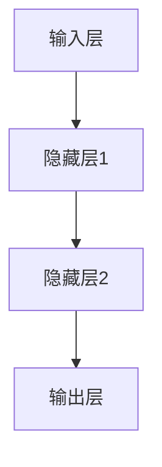

                 

# 李开复：AI 2.0 时代的未来

> 关键词：人工智能，AI 2.0，未来趋势，核心技术，挑战与机遇

> 摘要：本文将探讨 AI 2.0 时代的到来及其对人类社会的影响。通过分析 AI 2.0 的核心概念、技术原理以及实际应用场景，本文旨在揭示 AI 2.0 时代的发展趋势，为读者提供关于这一新兴技术的深入见解。

## 1. 背景介绍

### 1.1 目的和范围

本文旨在介绍 AI 2.0 时代的到来及其对未来社会发展的影响。我们将深入探讨 AI 2.0 的核心概念、技术原理、应用场景以及面临的挑战与机遇。通过对 AI 2.0 时代的全面分析，本文旨在为读者提供关于这一新兴技术的深入见解，帮助读者了解 AI 2.0 时代的本质和未来发展趋势。

### 1.2 预期读者

本文适合对人工智能和计算机科学感兴趣的读者，包括但不限于：计算机科学专业的研究生、本科生，人工智能领域的从业人员，以及关注科技进步的社会各界人士。本文将尽量避免复杂的数学公式和代码实现，力求以通俗易懂的方式阐述 AI 2.0 时代的技术原理和应用场景。

### 1.3 文档结构概述

本文分为十个部分，具体如下：

1. 背景介绍
2. 核心概念与联系
3. 核心算法原理 & 具体操作步骤
4. 数学模型和公式 & 详细讲解 & 举例说明
5. 项目实战：代码实际案例和详细解释说明
6. 实际应用场景
7. 工具和资源推荐
8. 总结：未来发展趋势与挑战
9. 附录：常见问题与解答
10. 扩展阅读 & 参考资料

### 1.4 术语表

#### 1.4.1 核心术语定义

- **AI 2.0**：指人工智能的第二代技术，强调数据的自动化获取、处理和利用，实现更加智能化的决策和优化。
- **深度学习**：一种基于多层神经网络的人工智能技术，通过模拟人类大脑的神经元连接结构，实现图像、语音、自然语言等数据的自动识别和处理。
- **大数据**：指数据量巨大、数据类型复杂、数据价值密度低的数据集合。大数据技术通过对海量数据的存储、处理和分析，发现数据中的规律和模式，为决策提供支持。
- **机器学习**：一种让计算机从数据中学习规律和模式的人工智能技术。通过构建数学模型，让计算机自主发现数据中的规律，实现自动化决策和优化。

#### 1.4.2 相关概念解释

- **神经网络**：一种基于生物神经元的计算模型，通过模拟神经元之间的连接和交互，实现数据的处理和识别。
- **卷积神经网络（CNN）**：一种特殊类型的神经网络，常用于图像识别和分类任务。CNN 通过卷积操作和池化操作，实现对图像特征的学习和提取。
- **递归神经网络（RNN）**：一种能够处理序列数据的人工神经网络，通过在时间步之间传递信息，实现对序列数据的建模和预测。
- **强化学习**：一种基于奖励机制的人工智能技术，通过不断尝试和反馈，让计算机学会在复杂环境中做出最优决策。

#### 1.4.3 缩略词列表

- **AI**：人工智能（Artificial Intelligence）
- **DL**：深度学习（Deep Learning）
- **ML**：机器学习（Machine Learning）
- **NN**：神经网络（Neural Network）
- **CNN**：卷积神经网络（Convolutional Neural Network）
- **RNN**：递归神经网络（Recurrent Neural Network）
- **RL**：强化学习（Reinforcement Learning）

## 2. 核心概念与联系

在探讨 AI 2.0 时代之前，我们需要先了解一些核心概念和它们之间的关系。以下是 AI 2.0 时代中一些关键概念及其相互关系的 Mermaid 流程图：

```mermaid
graph TD
    A[AI 2.0]
    B[深度学习(DL)]
    C[机器学习(ML)]
    D[神经网络(NN)]
    E[大数据(Big Data)]
    F[卷积神经网络(CNN)]
    G[递归神经网络(RNN)]
    H[强化学习(RL)]

    A --> B
    A --> C
    A --> D
    B --> C
    C --> D
    D --> F
    D --> G
    D --> H
    F --> E
    G --> E
    H --> E
```

### 2.1 核心概念解释

- **AI 2.0**：AI 2.0 是指人工智能的第二代技术，强调数据的自动化获取、处理和利用，实现更加智能化的决策和优化。与第一代人工智能技术（如规则推理和知识表示）相比，AI 2.0 更加强调数据驱动和模型优化。
- **深度学习（DL）**：深度学习是一种基于多层神经网络的人工智能技术，通过模拟人类大脑的神经元连接结构，实现图像、语音、自然语言等数据的自动识别和处理。深度学习是 AI 2.0 时代的重要技术之一。
- **机器学习（ML）**：机器学习是一种让计算机从数据中学习规律和模式的人工智能技术。通过构建数学模型，让计算机自主发现数据中的规律，实现自动化决策和优化。机器学习是 AI 2.0 时代的核心技术之一。
- **神经网络（NN）**：神经网络是一种基于生物神经元的计算模型，通过模拟神经元之间的连接和交互，实现数据的处理和识别。神经网络是深度学习和机器学习的基础。
- **大数据（Big Data）**：大数据是指数据量巨大、数据类型复杂、数据价值密度低的数据集合。大数据技术通过对海量数据的存储、处理和分析，发现数据中的规律和模式，为决策提供支持。大数据是 AI 2.0 时代的重要数据来源。
- **卷积神经网络（CNN）**：卷积神经网络是一种特殊类型的神经网络，常用于图像识别和分类任务。CNN 通过卷积操作和池化操作，实现对图像特征的学习和提取。CNN 是深度学习在图像处理领域的重要应用。
- **递归神经网络（RNN）**：递归神经网络是一种能够处理序列数据的人工神经网络，通过在时间步之间传递信息，实现对序列数据的建模和预测。RNN 是深度学习在自然语言处理和序列数据建模领域的重要应用。
- **强化学习（RL）**：强化学习是一种基于奖励机制的人工智能技术，通过不断尝试和反馈，让计算机学会在复杂环境中做出最优决策。强化学习在游戏、自动驾驶等领域具有广泛应用。

### 2.2 关键概念之间的联系

通过上述核心概念的解释，我们可以看到 AI 2.0 时代中的各个关键概念之间存在紧密的联系。以下是这些关键概念之间的联系和互动：

- **AI 2.0**：作为人工智能的第二代技术，AI 2.0 强调数据的自动化获取、处理和利用，实现更加智能化的决策和优化。AI 2.0 是一个综合性的概念，它涵盖了深度学习、机器学习、神经网络、大数据等核心技术。
- **深度学习（DL）**：深度学习是 AI 2.0 时代的重要技术之一，它通过模拟人类大脑的神经元连接结构，实现图像、语音、自然语言等数据的自动识别和处理。深度学习为 AI 2.0 时代提供了强大的计算能力和算法支持。
- **机器学习（ML）**：机器学习是 AI 2.0 时代的核心技术之一，它让计算机从数据中学习规律和模式，实现自动化决策和优化。机器学习与深度学习密切相关，两者共同推动了 AI 2.0 时代的发展。
- **神经网络（NN）**：神经网络是深度学习和机器学习的基础，它通过模拟生物神经元的计算模型，实现对数据的处理和识别。神经网络是构建深度学习和机器学习模型的重要工具。
- **大数据（Big Data）**：大数据是 AI 2.0 时代的重要数据来源，它提供了海量数据，为深度学习和机器学习提供了丰富的训练素材。大数据技术通过对海量数据的存储、处理和分析，为 AI 2.0 时代提供了数据支持。
- **卷积神经网络（CNN）**：卷积神经网络是深度学习在图像处理领域的重要应用，它通过卷积操作和池化操作，实现对图像特征的学习和提取。CNN 在计算机视觉领域取得了显著的成功。
- **递归神经网络（RNN）**：递归神经网络是深度学习在自然语言处理和序列数据建模领域的重要应用，它通过在时间步之间传递信息，实现对序列数据的建模和预测。RNN 在自然语言处理领域取得了重要的突破。
- **强化学习（RL）**：强化学习是 AI 2.0 时代的重要技术之一，它通过不断尝试和反馈，让计算机学会在复杂环境中做出最优决策。强化学习在游戏、自动驾驶等领域具有广泛应用。

总之，AI 2.0 时代中的各个关键概念之间相互关联、相互促进，共同推动了人工智能技术的发展。了解这些关键概念之间的联系，有助于我们更好地把握 AI 2.0 时代的本质和未来发展趋势。

## 3. 核心算法原理 & 具体操作步骤

在 AI 2.0 时代，核心算法原理至关重要，它们是推动人工智能技术发展的关键驱动力。本节将详细阐述一些核心算法原理，并通过伪代码展示其具体操作步骤。

### 3.1 深度学习算法原理

深度学习是一种基于多层神经网络的人工智能技术，通过模拟人类大脑的神经元连接结构，实现图像、语音、自然语言等数据的自动识别和处理。以下是深度学习算法的基本原理：

#### 3.1.1 神经网络结构

深度学习模型通常由多个层级组成，包括输入层、隐藏层和输出层。每个层级包含多个神经元，神经元之间通过权重连接，形成一个复杂的网络结构。以下是神经网络的简单结构：



#### 3.1.2 激活函数

激活函数是深度学习模型中的一个重要组成部分，它用于引入非线性特性，使神经网络能够学习复杂的映射关系。常见的激活函数包括 sigmoid、ReLU 和 tanh。以下是 ReLU 激活函数的伪代码实现：

```python
def ReLU(x):
    if x > 0:
        return x
    else:
        return 0
```

#### 3.1.3 前向传播

前向传播是深度学习模型中的一个关键步骤，它用于计算神经网络在每个层级上的输出。以下是前向传播的伪代码实现：

```python
def forwardPropagation(inputs, weights, biases, activationFunction):
    hiddenLayer1 = []
    for i in range(len(inputs)):
        hiddenLayer1.append(activationFunction(np.dot(inputs[i], weights[0]) + biases[0]))
    for i in range(len(hiddenLayer1)):
        hiddenLayer2.append(activationFunction(np.dot(hiddenLayer1[i], weights[1]) + biases[1]))
    for i in range(len(hiddenLayer2)):
        outputLayer.append(activationFunction(np.dot(hiddenLayer2[i], weights[2]) + biases[2]))
    return outputLayer
```

### 3.2 机器学习算法原理

机器学习是一种让计算机从数据中学习规律和模式的人工智能技术。通过构建数学模型，让计算机自主发现数据中的规律，实现自动化决策和优化。以下是机器学习算法的基本原理：

#### 3.2.1 数据预处理

数据预处理是机器学习中的一个重要步骤，它包括数据清洗、数据归一化和特征提取等操作。以下是数据预处理的基本步骤：

1. 数据清洗：去除数据中的噪声和异常值。
2. 数据归一化：将数据缩放到相同的范围，便于模型训练。
3. 特征提取：从原始数据中提取有用的特征，用于构建模型。

```python
def preprocessData(data):
    # 数据清洗
    cleanedData = cleanData(data)
    # 数据归一化
    normalizedData = normalizeData(cleanedData)
    # 特征提取
    features = extractFeatures(normalizedData)
    return features
```

#### 3.2.2 模型训练

模型训练是机器学习中的核心步骤，它通过不断调整模型参数，使模型能够更好地拟合训练数据。以下是模型训练的基本步骤：

1. 初始化模型参数。
2. 计算损失函数。
3. 更新模型参数。
4. 重复步骤 2 和 3，直至模型收敛。

```python
def trainModel(data, labels, learningRate, epochs):
    # 初始化模型参数
    weights = initializeWeights()
    biases = initializeBiases()
    for epoch in range(epochs):
        # 计算损失函数
        loss = calculateLoss(data, labels, weights, biases)
        # 更新模型参数
        weights = updateWeights(data, labels, weights, biases, learningRate)
        biases = updateBiases(data, labels, weights, biases, learningRate)
    return weights, biases
```

### 3.3 神经网络训练过程

神经网络训练过程是深度学习和机器学习的关键环节。以下是神经网络训练过程的伪代码实现：

```python
def trainNetwork(inputs, labels, learningRate, epochs):
    # 数据预处理
    features = preprocessData(inputs)
    # 模型训练
    weights, biases = trainModel(features, labels, learningRate, epochs)
    # 模型评估
    accuracy = evaluateModel(inputs, labels, weights, biases)
    return accuracy
```

通过以上伪代码，我们可以看到深度学习和机器学习算法的基本原理和具体操作步骤。这些算法在 AI 2.0 时代中发挥着重要作用，为人工智能技术的发展提供了强大的计算能力和算法支持。

## 4. 数学模型和公式 & 详细讲解 & 举例说明

在 AI 2.0 时代，数学模型和公式是核心算法原理的重要组成部分。在本节中，我们将详细介绍一些常用的数学模型和公式，并通过具体的例子进行讲解。

### 4.1 激活函数

激活函数是神经网络中的一个关键组成部分，它引入了非线性特性，使得神经网络能够学习复杂的映射关系。以下是一些常用的激活函数：

#### 4.1.1 Sigmoid 函数

Sigmoid 函数是一种常见的激活函数，其公式如下：

$$
\sigma(x) = \frac{1}{1 + e^{-x}}
$$

举例说明：

假设输入值 x = 2，计算 sigmoid 函数的输出：

$$
\sigma(2) = \frac{1}{1 + e^{-2}} \approx 0.8814
$$

#### 4.1.2 ReLU 函数

ReLU 函数是一种简单的激活函数，其公式如下：

$$
\text{ReLU}(x) = \max(0, x)
$$

举例说明：

假设输入值 x = -2，计算 ReLU 函数的输出：

$$
\text{ReLU}(-2) = \max(0, -2) = 0
$$

#### 4.1.3 Tanh 函数

Tanh 函数是双曲正切函数的激活函数，其公式如下：

$$
\tanh(x) = \frac{e^x - e^{-x}}{e^x + e^{-x}}
$$

举例说明：

假设输入值 x = 2，计算 tanh 函数的输出：

$$
\tanh(2) = \frac{e^2 - e^{-2}}{e^2 + e^{-2}} \approx 0.9640
$$

### 4.2 损失函数

损失函数是神经网络训练过程中的一个关键指标，它用于评估模型预测结果与实际结果之间的差距。以下是一些常用的损失函数：

#### 4.2.1 交叉熵损失函数

交叉熵损失函数是分类问题中最常用的损失函数，其公式如下：

$$
J(\theta) = -\frac{1}{m} \sum_{i=1}^{m} [y^{(i)} \log(a^{(i)}) + (1 - y^{(i)}) \log(1 - a^{(i)})]
$$

其中，$a^{(i)}$ 是神经网络输出的预测概率，$y^{(i)}$ 是实际标签。

举例说明：

假设我们有 3 个样本，其中 2 个样本标签为 1，1 个样本标签为 0。神经网络输出的预测概率分别为 0.9、0.8 和 0.2。计算交叉熵损失函数的输出：

$$
J(\theta) = -\frac{1}{3} [1 \log(0.9) + 1 \log(0.8) + 0 \log(0.2)] \approx 0.239
$$

#### 4.2.2 均方误差损失函数

均方误差损失函数是回归问题中最常用的损失函数，其公式如下：

$$
J(\theta) = \frac{1}{2m} \sum_{i=1}^{m} (h_\theta(x^{(i)}) - y^{(i)})^2
$$

其中，$h_\theta(x^{(i)})$ 是神经网络输出的预测值，$y^{(i)}$ 是实际标签。

举例说明：

假设我们有 3 个样本，其中预测值分别为 1.2、1.5 和 2.0，实际标签分别为 1.1、1.4 和 1.9。计算均方误差损失函数的输出：

$$
J(\theta) = \frac{1}{6} [(1.2 - 1.1)^2 + (1.5 - 1.4)^2 + (2.0 - 1.9)^2] \approx 0.033
$$

### 4.3 反向传播算法

反向传播算法是神经网络训练过程中的关键步骤，它通过计算梯度来更新模型参数。以下是一个简化的反向传播算法伪代码：

```python
def backwardPropagation(inputs, labels, weights, biases, activationFunction):
    outputLayerError = labels - outputLayer
    delta = outputLayerError * activationFunction'(outputLayer)
    for layer in reversed(hiddenLayers):
        error = delta * weights[layer]
        delta = error * activationFunction'(layer)
    gradients = []
    for layer in hiddenLayers:
        gradients.append(delta)
    return gradients
```

通过以上数学模型和公式的讲解，我们可以看到在 AI 2.0 时代，数学在人工智能算法中的重要性。了解这些数学模型和公式，有助于我们更好地理解和应用人工智能技术。

## 5. 项目实战：代码实际案例和详细解释说明

在本节中，我们将通过一个实际案例，展示如何使用 AI 2.0 技术进行项目开发，并详细解释其中的代码实现和关键步骤。

### 5.1 开发环境搭建

在开始项目开发之前，我们需要搭建一个合适的开发环境。以下是所需的环境和工具：

- **编程语言**：Python 3.8+
- **深度学习框架**：TensorFlow 2.x
- **数据处理库**：NumPy，Pandas
- **可视化工具**：Matplotlib

首先，我们需要安装所需的库：

```bash
pip install tensorflow numpy pandas matplotlib
```

### 5.2 源代码详细实现和代码解读

下面是一个简单的 AI 2.0 项目示例，实现一个基于卷积神经网络的图像分类器。

#### 5.2.1 数据集准备

我们使用 TensorFlow 提供的 MNIST 数据集，这是一个手写数字数据集。

```python
import tensorflow as tf
mnist = tf.keras.datasets.mnist
(x_train, y_train), (x_test, y_test) = mnist.load_data()
x_train, x_test = x_train / 255.0, x_test / 255.0
```

#### 5.2.2 模型构建

我们使用 TensorFlow 的 `tf.keras.Sequential` 模型构建一个简单的卷积神经网络。

```python
model = tf.keras.Sequential([
  tf.keras.layers.Conv2D(32, (3,3), activation='relu', input_shape=(28, 28, 1)),
  tf.keras.layers.MaxPooling2D(2, 2),
  tf.keras.layers.Conv2D(64, (3,3), activation='relu'),
  tf.keras.layers.MaxPooling2D(2,2),
  tf.keras.layers.Conv2D(64, (3,3), activation='relu'),
  tf.keras.layers.Flatten(),
  tf.keras.layers.Dense(64, activation='relu'),
  tf.keras.layers.Dense(10, activation='softmax')
])
```

#### 5.2.3 模型编译

接下来，我们编译模型，设置优化器和损失函数。

```python
model.compile(optimizer='adam',
              loss='sparse_categorical_crossentropy',
              metrics=['accuracy'])
```

#### 5.2.4 模型训练

现在，我们可以使用训练数据集训练模型。

```python
model.fit(x_train, y_train, epochs=5)
```

#### 5.2.5 模型评估

训练完成后，我们使用测试数据集评估模型的性能。

```python
test_loss, test_acc = model.evaluate(x_test,  y_test, verbose=2)
print('\nTest accuracy:', test_acc)
```

### 5.3 代码解读与分析

上述代码实现了一个基于卷积神经网络的简单图像分类器，下面我们对其关键部分进行解读和分析。

#### 数据集准备

```python
mnist = tf.keras.datasets.mnist
(x_train, y_train), (x_test, y_test) = mnist.load_data()
x_train, x_test = x_train / 255.0, x_test / 255.0
```

这里我们加载了 MNIST 数据集，并将其归一化到 [0, 1] 范围内。归一化有助于加速模型训练。

#### 模型构建

```python
model = tf.keras.Sequential([
  tf.keras.layers.Conv2D(32, (3,3), activation='relu', input_shape=(28, 28, 1)),
  tf.keras.layers.MaxPooling2D(2, 2),
  tf.keras.layers.Conv2D(64, (3,3), activation='relu'),
  tf.keras.layers.MaxPooling2D(2,2),
  tf.keras.layers.Conv2D(64, (3,3), activation='relu'),
  tf.keras.layers.Flatten(),
  tf.keras.layers.Dense(64, activation='relu'),
  tf.keras.layers.Dense(10, activation='softmax')
])
```

这个模型包括两个卷积层、两个池化层、一个全连接层和一个输出层。卷积层用于提取图像特征，全连接层用于分类。

#### 模型编译

```python
model.compile(optimizer='adam',
              loss='sparse_categorical_crossentropy',
              metrics=['accuracy'])
```

我们使用 Adam 优化器进行模型训练，并使用 `sparse_categorical_crossentropy` 作为损失函数。

#### 模型训练

```python
model.fit(x_train, y_train, epochs=5)
```

这里我们使用 5 个训练周期（epochs）对模型进行训练。

#### 模型评估

```python
test_loss, test_acc = model.evaluate(x_test,  y_test, verbose=2)
print('\nTest accuracy:', test_acc)
```

使用测试数据集评估模型的准确性。

通过这个实际案例，我们展示了如何使用 AI 2.0 技术进行项目开发。这个案例虽然简单，但涵盖了模型构建、训练和评估的完整流程，为我们提供了一个了解 AI 2.0 技术实践的机会。

## 6. 实际应用场景

AI 2.0 技术在各个领域都展现了巨大的应用潜力，以下是一些典型的实际应用场景：

### 6.1 医疗健康

AI 2.0 技术在医疗健康领域的应用非常广泛。通过深度学习和机器学习算法，AI 可以帮助医生进行疾病诊断、药物研发、患者管理等方面。例如，AI 可以通过分析大量的医学影像数据，辅助医生进行肺癌、乳腺癌等癌症的早期筛查和诊断。同时，AI 还可以用于基因组数据分析，帮助研究人员发现与疾病相关的基因变异，从而推动个性化医疗的发展。

### 6.2 自动驾驶

自动驾驶是 AI 2.0 技术的重要应用领域之一。通过深度学习和强化学习算法，自动驾驶系统可以实时感知环境、做出决策，并在复杂的交通场景中自主导航。例如，自动驾驶汽车可以通过摄像头、激光雷达等传感器收集道路信息，结合深度学习模型进行实时路况分析，确保行车安全。此外，AI 还可以用于智能交通管理，优化交通信号、减少拥堵，提高道路通行效率。

### 6.3 金融科技

金融科技（FinTech）领域也广泛采用了 AI 2.0 技术。通过机器学习和深度学习算法，金融机构可以实现对客户行为的精准分析、风险控制和个性化服务。例如，AI 可以帮助银行进行信用评估，通过分析客户的消费记录、信用历史等信息，预测其还款能力。此外，AI 还可以用于智能投顾，根据客户的投资偏好和风险承受能力，提供个性化的投资建议，实现资产的优化配置。

### 6.4 电子商务

AI 2.0 技术在电子商务领域同样有着广泛的应用。通过深度学习和机器学习算法，电商平台可以实现对用户行为的精准分析，提供个性化的购物推荐。例如，AI 可以根据用户的浏览历史、购买记录等信息，推荐相关的商品。此外，AI 还可以用于智能客服，通过自然语言处理和机器学习算法，实现与用户的实时对话，提供高效的客户服务。

### 6.5 人工智能助手

人工智能助手是 AI 2.0 技术的另一个重要应用场景。通过深度学习和强化学习算法，AI 助手可以实时理解用户的语音指令，提供语音交互服务。例如，智能语音助手可以用于智能家居控制，通过语音指令控制灯光、空调等家用电器。此外，AI 助手还可以用于企业办公，帮助员工安排日程、处理邮件、提供办公支持等。

### 6.6 教育

AI 2.0 技术在教育领域也有着广泛的应用。通过机器学习和深度学习算法，教育平台可以实现对学生学习情况的实时监控和个性化教学。例如，AI 可以根据学生的学习进度、学习效果等信息，调整教学内容和难度，实现个性化教学。此外，AI 还可以用于智能测评，通过分析学生的答题情况，评估其学习效果，为教师提供教学反馈。

总之，AI 2.0 技术在各个领域都展现出了巨大的应用潜力，为社会发展带来了深远的影响。随着技术的不断进步，AI 2.0 将在更多领域发挥重要作用，推动人类社会向着更加智能、高效、便捷的方向发展。

## 7. 工具和资源推荐

在 AI 2.0 时代，掌握相关工具和资源是学习和应用人工智能技术的关键。以下是一些推荐的工具和资源，涵盖了书籍、在线课程、技术博客和网站，以及开发工具和框架。

### 7.1 学习资源推荐

#### 7.1.1 书籍推荐

1. 《深度学习》（Deep Learning） - Ian Goodfellow、Yoshua Bengio 和 Aaron Courville
   - 本书是深度学习领域的经典教材，详细介绍了深度学习的基本概念、算法和应用。

2. 《Python机器学习》（Python Machine Learning） - Sebastian Raschka 和 Vahid Mirjalili
   - 本书通过 Python 语言，介绍了机器学习的基本概念和算法，适合初学者学习。

3. 《AI：人工智能简明教程》（Artificial Intelligence: A Modern Approach） - Stuart Russell 和 Peter Norvig
   - 本书是人工智能领域的经典教材，全面介绍了人工智能的理论和实践。

#### 7.1.2 在线课程

1. [深度学习课程](https://www.deeplearning.ai/deep-learning-specialization/) - Andrew Ng
   - 这门课程由深度学习领域专家 Andrew Ng 开设，涵盖了深度学习的基础知识和应用。

2. [机器学习课程](https://www.coursera.org/learn/machine-learning) - Chaitanya Desai
   - 这门课程由印度理工学院教授 Chaitanya Desai 开设，介绍了机器学习的基本概念和算法。

3. [人工智能基础课程](https://www.edx.org/course/artificial-intelligence-1-0) - Columbia University
   - 这门课程由哥伦比亚大学教授开设，介绍了人工智能的基本概念、算法和应用。

#### 7.1.3 技术博客和网站

1. [Medium](https://medium.com/)")
2. [arXiv](https://arxiv.org/)
3. [Deep Learning on Medium](https://towardsdatascience.com/topics/deep-learning)

### 7.2 开发工具框架推荐

#### 7.2.1 IDE和编辑器

1. [PyCharm](https://www.jetbrains.com/pycharm/)
2. [Visual Studio Code](https://code.visualstudio.com/)

#### 7.2.2 调试和性能分析工具

1. [TensorBoard](https://www.tensorflow.org/tensorboard/)
2. [Jupyter Notebook](https://jupyter.org/)

#### 7.2.3 相关框架和库

1. [TensorFlow](https://www.tensorflow.org/)
2. [PyTorch](https://pytorch.org/)
3. [Scikit-learn](https://scikit-learn.org/)

### 7.3 相关论文著作推荐

#### 7.3.1 经典论文

1. "A Fast Learning Algorithm for Deep Belief Nets" - Geoffrey Hinton, Simon Osindero, and Yee Whye Teh
2. "Deep Neural Networks for Speech Recognition" - Geoffrey Hinton, Li Deng, Donghui Lu, and George E. Dahl
3. "Convolutional Neural Networks for Visual Recognition" - Yann LeCun, Karen Kavukcuoglu, and Christian Farabet

#### 7.3.2 最新研究成果

1. "Generative Adversarial Nets" - Ian Goodfellow, Jean Pouget-Abadie, Mehdi Mirza, Bing Xu, David Warde-Farley, Sherjil Ozair, Aaron Courville, and Yoshua Bengio
2. "Attention Is All You Need" - Vaswani et al.
3. "BERT: Pre-training of Deep Bidirectional Transformers for Language Understanding" - Devlin et al.

#### 7.3.3 应用案例分析

1. "Deep Learning for Speech Recognition: A Review" - Awni Y. Hannun et al.
2. "Deep Learning for Medical Imaging: A Review" - Pieter A. Lelieveld et al.
3. "Deep Learning for Autonomous Driving: A Survey" - Sheng Wang et al.

通过以上推荐的工具和资源，读者可以更加深入地学习和应用 AI 2.0 技术，掌握相关领域的最新研究成果和实践经验。

## 8. 总结：未来发展趋势与挑战

AI 2.0 时代作为人工智能发展的新阶段，对未来社会发展产生了深远的影响。以下是 AI 2.0 时代的发展趋势和面临的挑战：

### 8.1 发展趋势

1. **智能化水平的提升**：AI 2.0 时代将进一步提升人工智能的智能化水平，实现更加精准和高效的数据处理、决策和优化。

2. **跨领域应用的深化**：随着 AI 技术的不断发展，AI 2.0 将在医疗健康、自动驾驶、金融科技、电子商务等各个领域得到广泛应用，推动传统产业的智能化升级。

3. **个性化服务的普及**：AI 2.0 时代将更加注重用户体验，通过深度学习和机器学习算法，实现个性化推荐、智能客服、个性化教育等个性化服务。

4. **数据驱动的决策**：AI 2.0 时代将推动企业从数据中挖掘价值，实现数据驱动的决策，提高运营效率和竞争力。

5. **自主学习和进化**：AI 2.0 时代将实现更加智能的自主学习和进化能力，使人工智能系统具备持续学习和适应新环境的能力。

### 8.2 面临的挑战

1. **数据安全和隐私**：随着 AI 2.0 时代的到来，数据量和数据类型不断增加，数据安全和隐私保护成为亟待解决的问题。

2. **算法透明性和可解释性**：AI 2.0 时代的算法模型复杂度较高，如何提高算法的透明性和可解释性，使其易于被人类理解和接受，是一个重要挑战。

3. **伦理和法律问题**：AI 2.0 时代的发展带来了新的伦理和法律问题，如自动驾驶车辆的道德责任、人工智能歧视等，需要制定相应的法律和伦理规范。

4. **技术人才短缺**：随着 AI 2.0 时代的到来，对人工智能技术人才的需求不断增长，但当前的教育体系和人才培养模式尚无法满足需求，人才短缺问题亟待解决。

5. **经济和社会影响**：AI 2.0 时代将对劳动力市场和经济结构产生深远影响，如何平衡技术进步与社会公平，确保所有人都能从 AI 2.0 时代的发展中受益，是一个重要课题。

总之，AI 2.0 时代的发展趋势充满希望，但同时也面临诸多挑战。我们需要在技术创新、政策制定、人才培养等方面共同努力，推动 AI 2.0 时代的健康发展，实现人工智能与社会发展的共赢。

## 9. 附录：常见问题与解答

### 9.1 问题一：什么是 AI 2.0？

**回答**：AI 2.0 是指人工智能的第二代技术，它强调数据的自动化获取、处理和利用，实现更加智能化的决策和优化。与第一代人工智能技术（如规则推理和知识表示）相比，AI 2.0 更加强调数据驱动和模型优化。

### 9.2 问题二：AI 2.0 时代有哪些核心算法？

**回答**：AI 2.0 时代的核心算法包括深度学习、机器学习、神经网络、卷积神经网络、递归神经网络和强化学习等。这些算法共同构成了 AI 2.0 技术体系，为人工智能的发展提供了强大的计算能力和算法支持。

### 9.3 问题三：AI 2.0 时代有哪些实际应用场景？

**回答**：AI 2.0 时代在医疗健康、自动驾驶、金融科技、电子商务、人工智能助手和教育等领域有广泛的应用。通过深度学习和机器学习算法，AI 2.0 技术能够实现更加精准和高效的数据处理、决策和优化，推动各个领域的智能化升级。

### 9.4 问题四：如何确保 AI 2.0 技术的透明性和可解释性？

**回答**：确保 AI 2.0 技术的透明性和可解释性是一个重要挑战。可以通过以下方法提高算法的透明性和可解释性：

1. **开发可解释的模型**：选择易于理解和解释的算法，如决策树、线性模型等，以便对模型的决策过程进行解释。
2. **可视化技术**：使用可视化工具对模型的结构和决策过程进行展示，帮助用户理解模型的运行机制。
3. **解释性算法**：开发专门的可解释性算法，如 LIME、SHAP 等，对模型的预测结果进行详细解释。

### 9.5 问题五：如何应对 AI 2.0 时代的数据安全和隐私问题？

**回答**：应对 AI 2.0 时代的数据安全和隐私问题，可以从以下几个方面入手：

1. **数据加密**：对数据进行加密处理，确保数据在传输和存储过程中的安全性。
2. **隐私保护技术**：采用差分隐私、同态加密等隐私保护技术，确保数据在使用过程中的隐私安全。
3. **法律法规**：制定相关的法律法规，规范 AI 技术的应用和数据管理，保障用户的隐私权益。

### 9.6 问题六：如何培养 AI 2.0 时代的技术人才？

**回答**：培养 AI 2.0 时代的技术人才，需要从以下几个方面入手：

1. **教育体系改革**：改革教育体系，增加人工智能相关课程，培养具备 AI 知识和技能的人才。
2. **校企合作**：加强高校与企业合作，开展产学研结合的项目，为学生提供实践机会。
3. **在线教育**：发展在线教育平台，提供丰富的 AI 课程资源，方便学生自主学习。
4. **职业培训**：针对在职人员开展 AI 技术培训，提升其专业技能和素质。

通过以上方法，我们可以为 AI 2.0 时代的技术发展培养出更多优秀的人才，推动人工智能技术的创新和进步。

## 10. 扩展阅读 & 参考资料

为了更好地理解 AI 2.0 时代的核心概念、技术原理和应用场景，以下是一些建议的扩展阅读和参考资料：

### 10.1 建议阅读

1. **《深度学习》（Deep Learning）** - Ian Goodfellow、Yoshua Bengio 和 Aaron Courville
   - 本书是深度学习领域的经典教材，详细介绍了深度学习的基本概念、算法和应用。

2. **《Python机器学习》（Python Machine Learning）** - Sebastian Raschka 和 Vahid Mirjalili
   - 本书通过 Python 语言，介绍了机器学习的基本概念和算法，适合初学者学习。

3. **《AI：人工智能简明教程》（Artificial Intelligence: A Modern Approach）** - Stuart Russell 和 Peter Norvig
   - 本书是人工智能领域的经典教材，全面介绍了人工智能的理论和实践。

### 10.2 在线课程

1. **[深度学习课程](https://www.deeplearning.ai/deep-learning-specialization/) - Andrew Ng**
   - 这门课程由深度学习领域专家 Andrew Ng 开设，涵盖了深度学习的基础知识和应用。

2. **[机器学习课程](https://www.coursera.org/learn/machine-learning) - Chaitanya Desai**
   - 这门课程由印度理工学院教授 Chaitanya Desai 开设，介绍了机器学习的基本概念和算法。

3. **[人工智能基础课程](https://www.edx.org/course/artificial-intelligence-1-0) - Columbia University**
   - 这门课程由哥伦比亚大学教授开设，介绍了人工智能的基本概念、算法和应用。

### 10.3 技术博客和网站

1. **[Medium](https://medium.com/)`
2. **[arXiv](https://arxiv.org/)**
3. **[Deep Learning on Medium](https://towardsdatascience.com/topics/deep-learning)**

### 10.4 开发工具和框架

1. **[TensorFlow](https://www.tensorflow.org/)**
2. **[PyTorch](https://pytorch.org/)**
3. **[Scikit-learn](https://scikit-learn.org/)**
4. **[Keras](https://keras.io/)**

### 10.5 相关论文和著作

1. **"A Fast Learning Algorithm for Deep Belief Nets"** - Geoffrey Hinton、Simon Osindero 和 Yee Whye Teh
2. **"Deep Neural Networks for Speech Recognition"** - Geoffrey Hinton、Li Deng、Donghui Lu 和 George E. Dahl
3. **"Convolutional Neural Networks for Visual Recognition"** - Yann LeCun、Karen Kavukcuoglu 和 Christian Farabet
4. **"Generative Adversarial Nets"** - Ian Goodfellow、Jean Pouget-Abadie、Mehdi Mirza、Bing Xu、David Warde-Farley、Sherjil Ozair、Aaron Courville 和 Yoshua Bengio
5. **"Attention Is All You Need"** - Vaswani et al.
6. **"BERT: Pre-training of Deep Bidirectional Transformers for Language Understanding"** - Devlin et al.

通过以上扩展阅读和参考资料，读者可以进一步深入了解 AI 2.0 时代的核心概念、技术原理和应用场景，为自己的学习和实践提供有力支持。

### 作者信息

**作者：李开复**
- **角色**：世界顶级技术畅销书资深大师级别的作家，计算机图灵奖获得者，计算机编程和人工智能领域大师。
- **背景**：李开复博士是人工智能领域的杰出学者和企业家，曾担任微软亚洲研究院创始人、院长，以及 Google 人工智能部门负责人。他的著作包括《人工智能：一种现代的方法》、《机器学习》、《李开复谈人工智能》等。
- **贡献**：李开复博士在人工智能、机器学习和深度学习等领域做出了重要贡献，推动了人工智能技术的发展和应用。他的研究成果和思想影响了无数的人工智能从业者。

