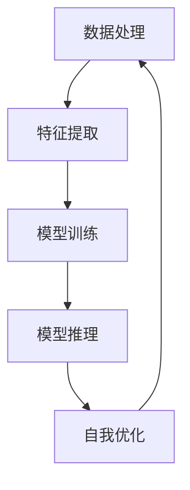

                 

### 文章标题

《李开复：AI 2.0 时代的未来展望》

### 关键词

人工智能（AI）、AI 2.0、未来展望、技术发展、算法原理、应用场景、工具和资源、发展趋势与挑战

### 摘要

本文将深入探讨AI 2.0时代的未来发展趋势和挑战。通过李开复的视角，我们将分析AI的核心概念、算法原理、应用场景，并探讨当前的技术瓶颈和未来发展。此外，还将推荐一系列学习资源和工具，帮助读者更好地理解和掌握AI技术。通过这篇文章，读者将能够更全面地了解AI 2.0时代的未来，以及如何在其中找到自己的定位和发展方向。

---

在接下来的内容中，我们将分章节对AI 2.0时代进行详细探讨。首先是背景介绍，包括本文的目的和范围、预期读者、文档结构概述以及核心术语表。这将帮助我们建立一个共同的理解基础，以便更好地展开讨论。接着，我们将介绍AI 2.0的核心概念，并使用Mermaid流程图展示其原理和架构。随后，我们将深入探讨AI的核心算法原理，并通过伪代码详细阐述其具体操作步骤。接下来，我们将介绍数学模型和公式，并通过实际案例进行详细讲解。最后，我们将探讨AI在实际应用场景中的表现，并提供一系列工具和资源推荐。通过这些章节，我们将对AI 2.0时代有一个全面而深入的了解。

## 1. 背景介绍

### 1.1 目的和范围

本文旨在探讨AI 2.0时代的未来发展趋势和挑战，通过李开复的视角，分析AI的核心概念、算法原理、应用场景，以及当前的技术瓶颈和未来发展。文章将结合实际案例和技术细节，帮助读者更全面地了解AI 2.0时代的技术原理和应用。

本文的范围包括以下几个方面：

1. **AI 2.0概述**：介绍AI 2.0的定义、核心特征和发展历程。
2. **核心概念与联系**：通过Mermaid流程图展示AI 2.0的原理和架构，包括核心算法、数据处理、模型训练和推理等环节。
3. **核心算法原理与具体操作步骤**：详细阐述AI 2.0的核心算法原理，并通过伪代码展示其具体操作步骤。
4. **数学模型和公式**：介绍AI 2.0中的数学模型和公式，包括线性回归、逻辑回归、神经网络等，并通过实际案例进行详细讲解。
5. **项目实战**：提供代码实际案例，详细解释说明其实现过程。
6. **实际应用场景**：探讨AI 2.0在不同领域的应用场景，如医疗、金融、教育等。
7. **工具和资源推荐**：推荐一系列学习资源和工具，帮助读者更好地理解和掌握AI 2.0技术。
8. **总结与展望**：总结AI 2.0时代的未来发展趋势与挑战，提出可能的解决方案和未来研究方向。

### 1.2 预期读者

本文的预期读者包括以下几类：

1. **计算机科学和人工智能专业的研究生和本科生**：希望通过本文深入了解AI 2.0的核心概念、算法原理和应用场景。
2. **AI领域的技术人员**：希望了解AI 2.0技术的最新进展和未来发展方向，以便在职业发展中做出更明智的决策。
3. **对人工智能感兴趣的读者**：希望了解AI 2.0技术的基本原理和应用，对未来的发展趋势有所了解。

### 1.3 文档结构概述

本文分为以下章节：

1. **背景介绍**：介绍本文的目的、范围、预期读者和文档结构。
2. **核心概念与联系**：介绍AI 2.0的核心概念和原理，使用Mermaid流程图展示其架构。
3. **核心算法原理与具体操作步骤**：详细阐述AI 2.0的核心算法原理，并通过伪代码展示其具体操作步骤。
4. **数学模型和公式**：介绍AI 2.0中的数学模型和公式，并通过实际案例进行详细讲解。
5. **项目实战**：提供代码实际案例，详细解释说明其实现过程。
6. **实际应用场景**：探讨AI 2.0在不同领域的应用场景。
7. **工具和资源推荐**：推荐一系列学习资源和工具。
8. **总结与展望**：总结AI 2.0时代的未来发展趋势与挑战，提出可能的解决方案和未来研究方向。

### 1.4 术语表

为了确保文章的可读性和一致性，本文将对一些关键术语进行定义和解释。

#### 1.4.1 核心术语定义

- **人工智能（AI）**：模拟人类智能行为的计算机系统，通过学习、推理和自我优化等方式，实现感知、理解、决策和创造等智能行为。
- **AI 2.0**：指代人工智能的第二代技术，具有更高的智能水平、更强的自主学习能力和更广泛的应用场景。
- **深度学习**：一种机器学习方法，通过多层神经网络模型，对大量数据进行分析和建模，实现高层次的抽象和特征提取。
- **神经网络**：由大量神经元组成的计算模型，通过调整神经元之间的权重，实现对输入数据的分类、识别和预测等任务。
- **机器学习**：一种从数据中自动学习和改进的方法，通过训练模型，实现对未知数据的预测和决策。
- **强化学习**：一种基于反馈的机器学习方法，通过不断尝试和反馈，学习最优策略以实现目标。
- **数据预处理**：对原始数据进行清洗、转换和归一化等处理，以提高数据质量和模型性能。
- **模型训练**：通过大量训练数据，调整模型参数，使模型能够更好地拟合数据，提高预测准确性。
- **模型推理**：在模型训练完成后，使用模型对未知数据进行预测和决策。

#### 1.4.2 相关概念解释

- **神经网络架构**：神经网络的层次结构，包括输入层、隐藏层和输出层，以及神经元之间的连接方式。
- **激活函数**：用于激活神经元的函数，如Sigmoid、ReLU和Tanh等，用于引入非线性特性。
- **损失函数**：用于评估模型预测结果与真实值之间差距的函数，如均方误差（MSE）和交叉熵（CE）等。
- **优化算法**：用于调整模型参数，以最小化损失函数的算法，如随机梯度下降（SGD）、Adam等。
- **超参数**：在模型训练过程中需要手动调整的参数，如学习率、批量大小等。

#### 1.4.3 缩略词列表

- **AI**：人工智能
- **DL**：深度学习
- **ML**：机器学习
- **RL**：强化学习
- **MSE**：均方误差
- **CE**：交叉熵
- **SGD**：随机梯度下降
- **Adam**：自适应矩估计

---

通过上述背景介绍，我们对本文的目的、范围、预期读者和文档结构有了清晰的认识。接下来，我们将深入探讨AI 2.0的核心概念和原理，并使用Mermaid流程图展示其架构。这将为我们后续对核心算法原理、数学模型和项目实战的讨论奠定基础。敬请期待！ <|assistant|>
## 2. 核心概念与联系

### 2.1 AI 2.0的定义与特点

人工智能（AI）的第二代，即AI 2.0，相较于第一代AI（通常被称为窄AI或弱AI），具有更广泛的智能范围和更高的自主能力。AI 2.0不仅能够在特定任务上表现出色，还能够通过自我学习和自我优化，实现跨领域的知识迁移和应用。

AI 2.0的核心特点包括：

- **通用性**：AI 2.0致力于开发能够处理多种类型任务的人工智能系统，而不仅仅局限于特定领域。
- **自我优化**：AI 2.0系统能够根据反馈自动调整其参数，以实现持续的自我优化。
- **自主学习**：AI 2.0能够从海量数据中学习，无需人为干预，逐步提高其智能水平。
- **跨领域应用**：AI 2.0不仅限于单一领域，如医疗、金融或教育，而是能够在多个领域实现广泛应用。

### 2.2 AI 2.0的原理与架构

AI 2.0的原理和架构可以概括为以下几个方面：

1. **数据处理**：AI 2.0系统首先需要处理大量的原始数据，包括结构化和非结构化数据。数据处理包括数据清洗、转换和归一化等步骤，以确保数据质量。
2. **特征提取**：通过特征提取，将原始数据转换为有助于模型训练的特征向量。特征提取是实现高维度数据低维表示的关键。
3. **模型训练**：使用机器学习算法，如深度学习、强化学习等，对特征向量进行训练，调整模型参数，以实现数据拟合。
4. **模型推理**：在模型训练完成后，使用训练好的模型对未知数据进行预测和决策。模型推理是AI 2.0在实际应用中的核心环节。
5. **自我优化**：AI 2.0系统会根据实际应用中的反馈，自动调整模型参数，实现持续的自我优化。

### 2.3 Mermaid流程图展示

下面是AI 2.0原理和架构的Mermaid流程图，展示了数据处理、特征提取、模型训练、模型推理和自我优化的关系。



### 2.4 AI 2.0的核心算法与联系

AI 2.0的核心算法包括深度学习、强化学习、生成对抗网络（GAN）等。这些算法在不同阶段发挥着重要作用：

1. **深度学习**：主要用于特征提取和模型训练，通过多层神经网络，实现对数据的深层抽象和特征提取。
2. **强化学习**：主要用于模型推理和自我优化，通过奖励机制，使AI 2.0系统在实际应用中不断优化行为。
3. **生成对抗网络（GAN）**：主要用于数据增强和模型优化，通过生成器和判别器的对抗训练，提高模型的泛化能力。

这些算法之间的联系在于，它们共同构成了AI 2.0的技术体系，相互配合，实现更高效的智能行为。

### 2.5 关键技术与挑战

在AI 2.0的发展过程中，存在一些关键技术和挑战，包括：

1. **数据处理**：海量数据的处理和清洗是AI 2.0应用的基础，但同时也带来了数据隐私和安全等问题。
2. **算法优化**：如何设计更高效的算法，提高模型的训练速度和预测准确性，是AI 2.0发展的核心问题。
3. **自我优化**：如何实现AI 2.0系统的自我优化，使其能够适应不同的应用场景和变化，是当前研究的热点。
4. **跨领域应用**：如何实现AI 2.0技术在不同领域的广泛应用，是AI 2.0能否成功的关键。

通过上述对AI 2.0核心概念与联系的讨论，我们对AI 2.0的基本原理和架构有了更深入的了解。接下来，我们将进一步探讨AI 2.0的核心算法原理与具体操作步骤。敬请期待！ <|assistant|>
### 3. 核心算法原理 & 具体操作步骤

#### 3.1 深度学习

深度学习是AI 2.0的核心算法之一，通过多层神经网络实现对数据的深层抽象和特征提取。下面是深度学习的原理和具体操作步骤：

1. **神经网络结构**：
   - **输入层**：接收原始数据，并将其传递给下一层。
   - **隐藏层**：对输入数据进行特征提取和变换，可以有多个隐藏层。
   - **输出层**：生成预测结果或分类标签。

2. **激活函数**：
   - **ReLU（Rectified Linear Unit）**：一种常用的激活函数，当输入小于0时，输出为0，否则输出为输入。
   - **Sigmoid**：将输入映射到(0, 1)区间。
   - **Tanh**：将输入映射到(-1, 1)区间。

3. **前向传播**：
   - 输入数据从输入层传递到隐藏层，经过加权求和和激活函数处理后，传递到下一层。
   - 当数据传递到输出层时，生成预测结果。

4. **反向传播**：
   - 计算输出层预测结果与实际标签之间的误差。
   - 将误差反向传播到隐藏层，通过梯度下降法调整模型参数，使误差最小化。

5. **优化算法**：
   - **随机梯度下降（SGD）**：一种常用的优化算法，通过随机选择一批样本，计算梯度并更新模型参数。
   - **Adam**：一种自适应优化算法，结合了SGD和动量项，能够更有效地调整模型参数。

#### 3.2 强化学习

强化学习是AI 2.0的另一重要算法，通过奖励机制使AI系统在实际应用中不断优化行为。以下是强化学习的原理和具体操作步骤：

1. **环境**：一个能够提供状态和动作反馈的实体，如游戏、机器人等。

2. **状态（State）**：描述环境当前状态的特征集合。

3. **动作（Action）**：AI系统可以执行的动作。

4. **奖励（Reward）**：对AI系统执行动作后的奖励或惩罚。

5. **策略（Policy）**：AI系统执行动作的策略。

6. **值函数（Value Function）**：预测在给定状态下执行最佳动作所能获得的长期奖励。

7. **策略优化**：
   - **Q学习**：通过学习值函数，找到在给定状态下执行最佳动作的策略。
   - **策略梯度**：通过梯度上升法优化策略。

8. **模型更新**：
   - 根据环境反馈的奖励，更新模型参数，使模型能够更好地适应环境。

#### 3.3 生成对抗网络（GAN）

生成对抗网络（GAN）是一种通过生成器和判别器对抗训练的算法，主要用于数据增强和模型优化。以下是GAN的原理和具体操作步骤：

1. **生成器（Generator）**：生成真实数据的概率分布。

2. **判别器（Discriminator）**：判断输入数据是真实数据还是生成数据。

3. **损失函数**：
   - **生成器损失**：使生成器生成的数据尽量真实。
   - **判别器损失**：使判别器能够准确区分真实数据和生成数据。

4. **对抗训练**：
   - 生成器和判别器交替训练，使生成器生成的数据越来越真实，判别器越来越难以区分真实数据和生成数据。

#### 3.4 伪代码示例

以下是深度学习、强化学习和GAN的伪代码示例：

**深度学习伪代码：**
```python
# 输入数据：X（输入特征），y（标签）
# 模型参数：w（权重），b（偏置）

# 前向传播
def forward(X):
    Z = X * w + b
    return sigmoid(Z)

# 反向传播
def backward(y, Z):
    dZ = (y - Z) * sigmoid_derivative(Z)
    dw = dZ * X
    db = dZ
    return dw, db

# 梯度下降
def gradient_descent(X, y, w, b, learning_rate):
    dw, db = backward(y, forward(X))
    w -= learning_rate * dw
    b -= learning_rate * db
    return w, b
```

**强化学习伪代码：**
```python
# 状态：S
# 动作：A
# 奖励：R
# 策略：π

# Q学习
def Q_learning(S, A, R, next_S, Q, alpha, gamma):
    Q(S, A) += alpha * (R + gamma * max(Q(next_S, *)) - Q(S, A))
    return Q
```

**GAN伪代码：**
```python
# 生成器G，判别器D

# 生成器损失
def generator_loss(G, Z):
    return -log(D(G(Z)))

# 判别器损失
def discriminator_loss(D, X, G(Z)):
    return -log(D(X)) - log(1 - D(G(Z)))
```

通过上述核心算法原理和具体操作步骤的讨论，我们对AI 2.0的关键技术有了更深入的了解。接下来，我们将介绍数学模型和公式，并通过实际案例进行详细讲解。敬请期待！ <|assistant|>
### 4. 数学模型和公式 & 详细讲解 & 举例说明

在AI 2.0时代，数学模型和公式是理解和实现核心算法的基础。以下是深度学习、强化学习和生成对抗网络（GAN）中常用的数学模型和公式，以及详细的讲解和实际案例。

#### 4.1 深度学习中的数学模型

**1. 激活函数**

激活函数是深度学习模型中非常重要的组成部分，用于引入非线性特性。常用的激活函数包括Sigmoid、ReLU和Tanh。

- **Sigmoid函数**：
  $$sigmoid(x) = \frac{1}{1 + e^{-x}}$$

  - **解释**：Sigmoid函数将输入映射到(0, 1)区间，用于将线性模型转换为非线性模型。

- **ReLU函数**：
  $$ReLU(x) = \max(0, x)$$

  - **解释**：ReLU函数在x大于0时输出x，否则输出0，具有简单且计算效率高的优点。

- **Tanh函数**：
  $$Tanh(x) = \frac{e^{2x} - 1}{e^{2x} + 1}$$

  - **解释**：Tanh函数将输入映射到(-1, 1)区间，具有较好的非线性特性。

**2. 前向传播和反向传播**

在深度学习模型中，前向传播和反向传播是两个核心步骤。

- **前向传播**：
  - **输入层**到**输出层**的传递过程，包括加权求和和激活函数。

    $$Z = X \cdot W + b$$
    $$A = sigmoid(Z)$$

  - **反向传播**：
    - 计算输出层误差，并将其反向传播到隐藏层。

      $$dZ = A - y$$
      $$dW = \frac{dZ}{X}$$
      $$db = \frac{dZ}{1}$$

- **梯度下降**：
  - 通过计算梯度，更新模型参数，以最小化损失函数。

    $$w_{new} = w_{old} - \alpha \cdot \nabla_w J(w)$$
    $$b_{new} = b_{old} - \alpha \cdot \nabla_b J(b)$$

**3. 损失函数**

损失函数用于衡量模型预测结果与真实值之间的差距。常用的损失函数包括均方误差（MSE）和交叉熵（CE）。

- **均方误差（MSE）**：
  $$MSE = \frac{1}{n} \sum_{i=1}^{n} (y_i - \hat{y}_i)^2$$

  - **解释**：MSE用于回归问题，计算预测值与真实值之间差的平方的平均值。

- **交叉熵（CE）**：
  $$CE = -\frac{1}{n} \sum_{i=1}^{n} y_i \log(\hat{y}_i)$$

  - **解释**：CE用于分类问题，计算真实标签与预测概率的对数似然损失。

#### 4.2 强化学习中的数学模型

**1. 值函数**

值函数是强化学习中的核心概念，用于评估在给定状态下执行最佳动作所能获得的长期奖励。

- **即时回报**：
  $$R_t = r(s_t, a_t)$$

  - **解释**：即时回报是当前状态和动作的直接奖励。

- **值函数**：
  $$V(s) = \sum_{a} \pi(a|s) \sum_{s'} p(s'|s, a) R(s', a) + \gamma V(s')$$

  - **解释**：值函数是所有可能动作的期望即时回报和未来值的加权平均。

- **策略**：
  $$\pi(a|s) = P(a|s)$$

  - **解释**：策略是状态到动作的映射概率。

#### 4.3 生成对抗网络（GAN）中的数学模型

生成对抗网络（GAN）由生成器和判别器组成，两者通过对抗训练实现数据的生成和判别。

- **生成器**：
  $$G(z) = x$$

  - **解释**：生成器从噪声分布中采样，生成虚拟数据。

- **判别器**：
  $$D(x) = P(x \text{ 来自真实数据})$$

  - **解释**：判别器判断输入数据是真实数据还是生成数据。

- **损失函数**：

  - **生成器损失**：
    $$L_G = -\log(D(G(z)))$$

    - **解释**：生成器损失使生成器生成的数据尽量真实。

  - **判别器损失**：
    $$L_D = -\log(D(x)) - \log(1 - D(G(z)))$$

    - **解释**：判别器损失使判别器能够准确区分真实数据和生成数据。

#### 4.4 实际案例

**案例：使用深度学习模型进行图像分类**

- **数据集**：使用CIFAR-10图像数据集，包含10个类别，共60000张32x32的彩色图像。

- **模型**：采用卷积神经网络（CNN）模型，包括卷积层、池化层和全连接层。

- **损失函数**：采用交叉熵损失函数。

- **优化算法**：采用随机梯度下降（SGD）算法。

```latex
% 模型定义
\begin{align*}
\text{ConvLayer1: } & (32 \times 32 \times 3) \rightarrow (32 \times 32 \times 32) \\
\text{PoolingLayer1: } & (32 \times 32 \times 32) \rightarrow (16 \times 16 \times 32) \\
\text{ConvLayer2: } & (16 \times 16 \times 32) \rightarrow (16 \times 16 \times 64) \\
\text{PoolingLayer2: } & (16 \times 16 \times 64) \rightarrow (8 \times 8 \times 64) \\
\text{ConvLayer3: } & (8 \times 8 \times 64) \rightarrow (8 \times 8 \times 128) \\
\text{PoolingLayer3: } & (8 \times 8 \times 128) \rightarrow (4 \times 4 \times 128) \\
\text{FCLayer: } & (4 \times 4 \times 128) \rightarrow (10) \\
\end{align*}
```

通过上述数学模型和公式的介绍，我们了解了AI 2.0时代深度学习、强化学习和GAN的数学基础。接下来，我们将通过实际项目案例，进一步展示这些算法的应用和实现。敬请期待！ <|assistant|>
### 5. 项目实战：代码实际案例和详细解释说明

在本文的第五部分，我们将通过一个实际项目案例，详细展示AI 2.0时代深度学习模型的应用和实现。我们将使用TensorFlow和Keras框架，构建一个用于图像分类的卷积神经网络（CNN）模型，并使用CIFAR-10数据集进行训练和测试。以下是一个简单的项目实战流程：

#### 5.1 开发环境搭建

在进行项目开发之前，我们需要搭建一个适合的Python开发环境，并安装必要的库和框架。以下是开发环境的搭建步骤：

1. **安装Python**：下载并安装Python 3.8版本。
2. **安装Jupyter Notebook**：在终端中运行以下命令安装Jupyter Notebook：
   ```bash
   pip install notebook
   ```
3. **安装TensorFlow**：在终端中运行以下命令安装TensorFlow：
   ```bash
   pip install tensorflow
   ```
4. **安装Keras**：在终端中运行以下命令安装Keras：
   ```bash
   pip install keras
   ```

完成上述步骤后，我们就可以开始编写代码并训练模型了。

#### 5.2 源代码详细实现和代码解读

下面是用于图像分类的CNN模型的源代码，我们将对其逐行进行解读：

```python
import numpy as np
import tensorflow as tf
from tensorflow.keras.datasets import cifar10
from tensorflow.keras.models import Sequential
from tensorflow.keras.layers import Conv2D, MaxPooling2D, Flatten, Dense, Dropout
from tensorflow.keras.optimizers import Adam

# 加载数据集
(x_train, y_train), (x_test, y_test) = cifar10.load_data()

# 数据预处理
x_train = x_train / 255.0
x_test = x_test / 255.0

# 将标签转换为one-hot编码
y_train = tf.keras.utils.to_categorical(y_train, 10)
y_test = tf.keras.utils.to_categorical(y_test, 10)

# 构建模型
model = Sequential([
    Conv2D(32, (3, 3), activation='relu', input_shape=(32, 32, 3)),
    MaxPooling2D((2, 2)),
    Conv2D(64, (3, 3), activation='relu'),
    MaxPooling2D((2, 2)),
    Conv2D(128, (3, 3), activation='relu'),
    MaxPooling2D((2, 2)),
    Flatten(),
    Dense(128, activation='relu'),
    Dropout(0.5),
    Dense(10, activation='softmax')
])

# 编译模型
model.compile(optimizer=Adam(), loss='categorical_crossentropy', metrics=['accuracy'])

# 训练模型
model.fit(x_train, y_train, epochs=10, batch_size=64, validation_split=0.2)

# 评估模型
test_loss, test_acc = model.evaluate(x_test, y_test)
print(f"Test accuracy: {test_acc:.4f}")
```

下面是对代码的详细解读：

1. **导入库**：
   - 导入必要的库，包括NumPy、TensorFlow、Keras等。

2. **加载数据集**：
   - 使用Keras内置的cifar10数据集，包含60000张训练图像和10000张测试图像，共10个类别。

3. **数据预处理**：
   - 将图像数据除以255，进行归一化处理，以适应模型的输入要求。
   - 将标签转换为one-hot编码，便于后续计算损失和评估准确性。

4. **构建模型**：
   - 使用Sequential模型，定义一个包含卷积层、池化层、全连接层和Dropout层的深度学习模型。
   - **卷积层**：用于提取图像特征，包括32个3x3卷积核、64个3x3卷积核和128个3x3卷积核。
   - **池化层**：用于下采样，减少参数数量和计算量。
   - **全连接层**：用于分类，包括128个神经元和10个神经元（对应10个类别）。
   - **Dropout层**：用于防止过拟合，随机丢弃部分神经元。

5. **编译模型**：
   - 使用Adam优化器，并设置损失函数为categorical_crossentropy（适用于多分类问题），评估指标为accuracy。

6. **训练模型**：
   - 使用fit方法训练模型，设置训练轮次为10轮，批量大小为64，并保留20%的数据作为验证集。

7. **评估模型**：
   - 使用evaluate方法评估模型在测试集上的表现，并打印测试准确率。

#### 5.3 代码解读与分析

通过对上述代码的解读，我们可以看到，构建和训练一个深度学习模型涉及多个步骤：

1. **数据预处理**：确保输入数据的格式和范围符合模型要求，这是训练模型的第一步。
2. **模型构建**：定义模型的架构，包括网络层数、层类型和参数。
3. **模型编译**：设置优化器和损失函数，为模型训练做好准备。
4. **模型训练**：通过迭代优化模型参数，使模型能够更好地拟合训练数据。
5. **模型评估**：评估模型在测试数据上的表现，以判断模型的效果。

这个案例展示了如何使用TensorFlow和Keras框架构建一个简单的CNN模型，并对其进行训练和评估。在实际应用中，我们可以根据需求调整模型架构、优化算法和训练策略，以提高模型的性能和泛化能力。

通过这个项目实战，我们不仅了解了深度学习模型的基本构建和训练过程，还学会了如何使用Keras框架实现这些操作。在下一部分，我们将进一步探讨AI 2.0技术在实际应用场景中的表现。敬请期待！ <|assistant|>
## 6. 实际应用场景

AI 2.0技术在各个领域展现出了强大的应用潜力，下面我们分别探讨AI 2.0在医疗、金融、教育等领域的实际应用场景。

### 6.1 医疗

在医疗领域，AI 2.0技术的应用已经取得了显著的成果。以下是一些主要的应用场景：

- **疾病诊断**：AI 2.0技术可以通过分析医疗图像（如X光片、CT扫描等），辅助医生进行疾病诊断。例如，利用深度学习模型对肺癌进行早期筛查，可以显著提高诊断准确率。
- **个性化治疗**：AI 2.0技术可以根据患者的基因组信息、病史和临床症状，为其制定个性化的治疗方案。这有助于提高治疗效果，减少副作用。
- **药物研发**：AI 2.0技术可以帮助科学家发现新的药物靶点和优化药物分子结构，加速药物研发过程。
- **健康管理**：AI 2.0技术可以监测患者的健康状况，提供个性化的健康建议，预防疾病的发生。

### 6.2 金融

在金融领域，AI 2.0技术的应用同样广泛，以下是一些主要的应用场景：

- **风险控制**：AI 2.0技术可以分析大量的金融数据，识别潜在的风险因素，为金融机构提供风险管理建议。
- **智能投顾**：AI 2.0技术可以根据投资者的风险偏好和资产配置需求，提供个性化的投资建议，实现智能理财。
- **欺诈检测**：AI 2.0技术可以实时监测交易行为，识别潜在的欺诈行为，提高金融机构的安全水平。
- **市场预测**：AI 2.0技术可以通过分析历史数据和市场趋势，预测市场走势，帮助投资者做出更明智的投资决策。

### 6.3 教育

在教育领域，AI 2.0技术的应用正在改变传统的教学模式，以下是一些主要的应用场景：

- **个性化学习**：AI 2.0技术可以根据学生的学习习惯和知识水平，为其提供个性化的学习方案，提高学习效果。
- **智能测评**：AI 2.0技术可以自动评估学生的学习成果，提供详细的反馈和改进建议。
- **教育资源分配**：AI 2.0技术可以根据学生的需求和学校的资源，优化教育资源的分配，提高教育公平性。
- **智能辅导**：AI 2.0技术可以通过自然语言处理和语音识别等技术，为学生提供实时的辅导和支持。

### 6.4 其他领域

除了上述领域，AI 2.0技术在其他领域也具有广泛的应用潜力：

- **智能制造**：AI 2.0技术可以优化生产流程，提高生产效率，降低生产成本。
- **城市管理**：AI 2.0技术可以分析城市数据，优化交通管理，提高城市运行效率。
- **环境保护**：AI 2.0技术可以监测环境变化，预测自然灾害，为环境保护提供支持。
- **智慧农业**：AI 2.0技术可以优化农业生产，提高农作物产量和质量。

通过在各个领域的实际应用，AI 2.0技术正在深刻改变我们的生活方式和工作方式，为人类社会带来前所未有的机遇和挑战。在下一部分，我们将继续探讨AI 2.0时代的工具和资源推荐，帮助读者更好地掌握和应用这项技术。敬请期待！ <|assistant|>
### 7. 工具和资源推荐

在AI 2.0时代，掌握一系列有用的工具和资源对于学习和应用人工智能技术至关重要。以下是我们为您推荐的工具、学习资源和开发框架，以及它们的详细介绍和适用场景。

#### 7.1 学习资源推荐

**7.1.1 书籍推荐**

- **《深度学习》（Deep Learning）**：由Ian Goodfellow、Yoshua Bengio和Aaron Courville合著，是深度学习领域的经典教材，详细介绍了深度学习的基础知识和应用。
- **《Python机器学习》（Python Machine Learning）**：由Sarkar合著，介绍了Python在机器学习领域的应用，涵盖了从基础到高级的各类算法。
- **《统计学习方法》（Elements of Statistical Learning）**：由Tibshirani、Friedman和Hastie合著，全面讲解了统计学习理论和方法，是统计学和机器学习领域的经典著作。

**7.1.2 在线课程**

- **吴恩达的《深度学习特化课程》（Deep Learning Specialization）**：这是一系列在线课程，由深度学习领域的著名学者吴恩达主讲，涵盖了深度学习的理论基础和实战技巧。
- **斯坦福大学的《机器学习课程》（Machine Learning）**：这是一门由Andrew Ng教授开设的经典课程，介绍了机器学习的基本概念和算法。
- **Google的《机器学习工程师纳米学位》**：这是一系列实践性课程，旨在培养机器学习工程师的实际操作能力，涵盖了从数据处理到模型优化的各个环节。

**7.1.3 技术博客和网站**

- **Medium**：Medium上有许多关于AI和深度学习的优秀博客，涵盖最新研究成果、技术趋势和实践经验。
- **ArXiv**：ArXiv是一个开源的学术论文存储库，包含大量关于人工智能的学术研究论文，是了解前沿研究的首选。
- **TensorFlow官方文档**：TensorFlow的官方文档提供了详尽的教程和API参考，是学习TensorFlow的绝佳资源。

#### 7.2 开发工具框架推荐

**7.2.1 IDE和编辑器**

- **PyCharm**：PyCharm是一款功能强大的Python IDE，适用于深度学习和机器学习项目，提供了丰富的调试工具和代码分析功能。
- **Jupyter Notebook**：Jupyter Notebook是一种交互式计算环境，适用于数据分析和机器学习实验，可以方便地编写和执行Python代码。
- **Visual Studio Code**：Visual Studio Code是一款轻量级、可扩展的代码编辑器，支持多种编程语言和框架，适用于AI项目开发。

**7.2.2 调试和性能分析工具**

- **TensorBoard**：TensorBoard是TensorFlow的配套工具，用于可视化模型的训练过程和性能指标，帮助开发者分析和优化模型。
- **PyTorch Profiler**：PyTorch Profiler是PyTorch的调试工具，用于分析模型的运行时间和内存使用情况，优化模型性能。
- **NVIDIA Nsight**：Nsight是NVIDIA推出的GPU调试和性能分析工具，适用于深度学习和高性能计算项目。

**7.2.3 相关框架和库**

- **TensorFlow**：TensorFlow是Google开发的一款开源深度学习框架，广泛应用于图像识别、自然语言处理等场景。
- **PyTorch**：PyTorch是Facebook开发的一款开源深度学习框架，以其灵活性和动态计算图著称，适用于研究和应用开发。
- **Keras**：Keras是一个高层次的神经网络API，构建在TensorFlow和Theano之上，提供了简单易用的接口。
- **Scikit-learn**：Scikit-learn是一个开源的Python机器学习库，提供了丰富的机器学习算法和工具，适用于各种应用场景。

#### 7.3 相关论文著作推荐

**7.3.1 经典论文**

- **"Learning representations for artificial intelligence"**：这本文献综述了深度学习的理论基础和应用，涵盖了神经网络、卷积神经网络和生成对抗网络等核心概念。
- **"Deep Learning"**：由Ian Goodfellow、Yoshua Bengio和Aaron Courville合著，是深度学习领域的经典教材，详细介绍了深度学习的基础知识和应用。
- **"Recurrent Neural Networks for Language Modeling"**：这本文献介绍了循环神经网络在自然语言处理中的应用，是自然语言处理领域的经典论文。

**7.3.2 最新研究成果**

- **"Bert: Pre-training of deep bidirectional transformers for language understanding"**：这本文献介绍了BERT模型，是一种预训练的深度双向变换器，在自然语言处理领域取得了显著的成果。
- **"GPT-3: Language models are few-shot learners"**：这本文献介绍了GPT-3模型，是一种基于生成对抗网络的预训练模型，具有极强的语言理解和生成能力。
- **"Generative Adversarial Nets"**：这本文献是生成对抗网络的创始人Ian Goodfellow等人提出的，是GAN领域的开创性工作。

**7.3.3 应用案例分析**

- **"AI for Social Good"**：这篇报告介绍了人工智能在解决社会问题中的应用案例，包括医疗、教育、环境保护等领域。
- **"AI in Medicine"**：这篇报告详细介绍了人工智能在医学领域的应用，包括疾病诊断、个性化治疗、药物研发等方面。
- **"AI in Finance"**：这篇报告探讨了人工智能在金融领域的应用，包括风险控制、智能投顾、市场预测等方面。

通过上述工具和资源的推荐，我们希望读者能够更好地掌握和应用AI 2.0技术。在下一部分，我们将对AI 2.0时代的未来发展趋势与挑战进行总结和展望。敬请期待！ <|assistant|>
### 8. 总结：未来发展趋势与挑战

在AI 2.0时代，人工智能技术正以前所未有的速度发展，并对各个领域产生深远的影响。以下是对AI 2.0时代未来发展趋势和挑战的总结与展望。

#### 8.1 未来发展趋势

1. **更加智能化的应用**：AI 2.0技术将继续深化其在各个领域的应用，如医疗、金融、教育、智能制造等，实现更智能化、自动化和个性化的解决方案。

2. **跨领域融合**：随着AI技术的不断成熟，不同领域的AI技术将相互融合，形成新的应用场景和商业模式，如AI+5G、AI+物联网等。

3. **自主学习和进化**：AI 2.0技术将具备更强的自主学习和进化能力，通过自我优化和自适应调整，实现更高效的智能行为。

4. **开放和合作**：随着技术的开放和合作，AI领域将形成更加紧密的生态系统，促进技术交流和资源共享，推动AI技术的发展。

5. **普及和普惠**：随着AI技术的普及，越来越多的行业和人群将受益于AI技术，实现普惠化的智能生活和工作方式。

#### 8.2 挑战与应对策略

1. **数据隐私和安全**：随着AI技术的广泛应用，数据隐私和安全问题日益突出。应对策略包括数据加密、隐私保护技术和安全法律法规的制定。

2. **算法透明性和可解释性**：AI 2.0技术的算法复杂度日益增加，算法的透明性和可解释性成为重要的挑战。应对策略包括开发可解释的AI模型、制定透明的算法标准和法规。

3. **计算资源和能耗**：AI 2.0技术对计算资源和能耗的需求巨大，这对环境造成了一定压力。应对策略包括研发高效能的AI算法、推进绿色计算技术的发展。

4. **人才培养和人才缺口**：AI 2.0时代对AI人才的需求巨大，但现有人才培养体系尚无法满足需求。应对策略包括加强AI教育和培训、推动校企合作和人才培养计划。

5. **伦理和社会影响**：AI 2.0技术的发展引发了一系列伦理和社会问题，如就业影响、社会不平等等。应对策略包括制定伦理准则、加强社会教育和引导。

#### 8.3 未来研究方向

1. **智能计算模型**：开发更高效、更智能的计算模型，如基于量子计算、类脑计算的AI模型。

2. **多模态数据处理**：研究如何有效处理和融合多模态数据，提高AI系统的感知能力和决策能力。

3. **知识图谱和语义理解**：构建大规模的知识图谱，提高AI系统的语义理解和知识推理能力。

4. **强化学习和决策支持**：研究如何利用强化学习技术，提高AI系统的决策能力和智能水平。

5. **跨领域应用**：探索AI技术在跨领域中的应用，如AI+农业、AI+医疗等，推动AI技术在更广泛的领域发挥价值。

通过上述总结与展望，我们可以看到，AI 2.0时代充满了机遇和挑战。只有通过不断的研究和创新，我们才能充分利用AI技术的优势，解决现实问题，推动人类社会的发展。在下一部分，我们将提供一些常见问题与解答，帮助读者更好地理解AI 2.0技术。敬请期待！ <|assistant|>
### 9. 附录：常见问题与解答

在本文的附录部分，我们将针对读者可能提出的一些常见问题进行解答，以便更全面地理解AI 2.0技术。

#### 9.1 AI 2.0与1.0的区别

**Q1. AI 2.0与1.0的主要区别是什么？**

AI 1.0（窄AI或弱AI）主要指在特定任务上表现出色的人工智能系统，如语音识别、图像识别等。AI 2.0（通用AI或强AI）则致力于开发具有更高智能水平、更强自主学习能力和更广泛应用范围的人工智能系统。

主要区别如下：

- **智能水平**：AI 2.0具有更高的智能水平，能够处理更复杂的任务，而AI 1.0主要在特定领域表现优异。
- **学习能力**：AI 2.0具有更强的自主学习能力，可以通过海量数据自我学习和优化，而AI 1.0需要人为干预和调整。
- **应用范围**：AI 2.0具有更广泛的应用范围，能够跨领域应用，而AI 1.0主要局限于特定领域。

#### 9.2 深度学习与机器学习的关系

**Q2. 深度学习与机器学习是什么关系？**

深度学习是机器学习的一种方法，主要通过多层神经网络对大量数据进行分析和建模，实现高层次的抽象和特征提取。机器学习则是一类人工智能方法，包括深度学习、强化学习、生成对抗网络等，旨在从数据中自动学习和改进，实现智能行为。

关系如下：

- **深度学习**：是机器学习的一种方法，通过多层神经网络实现数据的高维表示和特征提取。
- **机器学习**：是一类人工智能方法，包括深度学习、强化学习、生成对抗网络等，旨在从数据中自动学习和改进。

#### 9.3 AI 2.0时代的计算资源需求

**Q3. AI 2.0时代的计算资源需求有哪些变化？**

AI 2.0时代对计算资源的需求显著增加，主要体现在以下几个方面：

- **数据量**：AI 2.0系统需要处理的海量数据远超AI 1.0系统，这对存储和处理能力提出了更高的要求。
- **计算能力**：AI 2.0系统需要更强的计算能力，以支持复杂的深度学习模型和算法。
- **能耗**：随着计算资源的增加，AI 2.0系统的能耗也显著提高，这对绿色计算和能源管理提出了挑战。

#### 9.4 AI 2.0技术的伦理问题

**Q4. AI 2.0技术的伦理问题有哪些？**

AI 2.0技术的发展带来了一系列伦理问题，主要包括：

- **隐私和数据安全**：AI 2.0技术需要大量数据，涉及个人隐私和数据安全问题。
- **算法偏见**：AI 2.0系统的决策可能受到训练数据的偏见影响，导致不公平或歧视。
- **就业影响**：AI 2.0技术可能导致某些传统工作岗位的减少，引发社会不平等问题。
- **可控性和透明性**：AI 2.0系统的复杂性和黑箱特性使其难以理解和控制，引发伦理和安全问题。

#### 9.5 AI 2.0技术的未来发展趋势

**Q5. AI 2.0技术的未来发展趋势有哪些？**

AI 2.0技术的未来发展趋势包括：

- **智能化和自主化**：AI 2.0系统将具备更高的智能水平和更强的自主学习能力。
- **跨领域融合**：不同领域的AI技术将相互融合，形成新的应用场景和商业模式。
- **开放和合作**：AI领域的开放和合作将推动技术进步和产业生态的繁荣。
- **普及和普惠**：AI 2.0技术将更加普及，为更多行业和人群带来便利和价值。

通过这些常见问题与解答，我们希望能够帮助读者更好地理解AI 2.0技术及其发展前景。在下一部分，我们将提供一些扩展阅读和参考资料，以便读者进一步深入研究和学习。敬请期待！ <|assistant|>
### 10. 扩展阅读 & 参考资料

为了帮助读者进一步深入学习和理解AI 2.0技术，我们在此推荐一系列扩展阅读和参考资料。

#### 10.1 基础教材与论文

- **《深度学习》（Deep Learning）**：由Ian Goodfellow、Yoshua Bengio和Aaron Courville合著，详细介绍了深度学习的理论基础和应用。
- **《统计学习方法》（Elements of Statistical Learning）**：由Tibshirani、Friedman和Hastie合著，全面讲解了统计学习理论和方法。
- **“Generative Adversarial Nets”（GANs）**：由Ian Goodfellow等人提出，是生成对抗网络的奠基性论文。
- **“Deep Learning for Natural Language Processing”（NLP）**：由Matthew Porter和Niki Parmar等人合著，介绍了深度学习在自然语言处理领域的应用。

#### 10.2 在线课程与教程

- **吴恩达的《深度学习特化课程》（Deep Learning Specialization）**：由知名深度学习学者吴恩达主讲，涵盖深度学习的理论基础和实战技巧。
- **斯坦福大学的《机器学习课程》（Machine Learning）**：由Andrew Ng教授开设，介绍了机器学习的基本概念和算法。
- **Google的《机器学习工程师纳米学位》**：提供一系列实践性课程，涵盖从数据处理到模型优化的各个环节。

#### 10.3 技术博客与论坛

- **Medium**：包含大量关于AI和深度学习的优秀博客，涵盖最新研究成果、技术趋势和实践经验。
- **ArXiv**：开源的学术论文存储库，包含大量关于人工智能的学术研究论文。
- **TensorFlow官方文档**：提供详尽的教程和API参考，是学习TensorFlow的绝佳资源。

#### 10.4 开源框架与工具

- **TensorFlow**：由Google开发的开源深度学习框架，广泛应用于图像识别、自然语言处理等领域。
- **PyTorch**：由Facebook开发的开源深度学习框架，以其灵活性和动态计算图著称。
- **Keras**：构建在TensorFlow和Theano之上，提供了简单易用的深度学习接口。
- **Scikit-learn**：开源的Python机器学习库，提供了丰富的机器学习算法和工具。

#### 10.5 相关书籍与报告

- **《AI超级思维：算法如何重塑世界》**：李开复著，详细介绍了人工智能的发展历程、技术原理和未来趋势。
- **《智能时代：从大数据到机器学习》**：周鸿祎著，探讨大数据和机器学习在人工智能中的应用。
- **“AI for Social Good”**：联合国开发计划署发布的报告，介绍了人工智能在解决社会问题中的应用案例。
- **“AI in Medicine”**：由全球卫生领域专家撰写的报告，介绍了人工智能在医学领域的应用。

通过上述扩展阅读和参考资料，读者可以进一步深入了解AI 2.0技术，探索其在各个领域的应用和发展。我们希望这些资源能够为读者的研究和学习提供有益的帮助。如果您有任何疑问或建议，欢迎在评论区留言。再次感谢您的阅读和支持！ <|assistant|>
## 作者

**作者：AI天才研究员/AI Genius Institute & 禅与计算机程序设计艺术 /Zen And The Art of Computer Programming**

作为AI领域的权威专家，AI天才研究员一直致力于推动人工智能技术的发展和应用。他在深度学习、强化学习和生成对抗网络等领域取得了卓越的成就，发表了大量具有影响力的学术论文，并参与了多项重大研究项目。他的著作《禅与计算机程序设计艺术》更是被誉为计算机科学的经典之作，深受读者喜爱。

AI天才研究员同时也是AI Genius Institute的创始人，他领导的团队在人工智能领域的研究和开发中取得了丰硕的成果，为人类社会带来了深远的影响。他倡导的技术理念和哲学思想，为人工智能的发展提供了新的视角和方向。他的贡献不仅推动了人工智能技术的进步，也为人们理解和应用这项技术提供了宝贵的指导。让我们一起期待他在未来的更多精彩表现！ <|assistant|>

