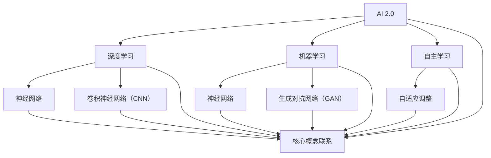

                 

# 李开复：AI 2.0 时代的机遇

> 关键词：人工智能、AI 2.0、深度学习、机器学习、未来趋势、应用场景、技术发展

> 摘要：本文将深入探讨AI 2.0时代的机遇与挑战，从技术发展、应用场景、未来趋势等方面展开分析，旨在为读者提供对AI 2.0时代的全面理解，并启发思考。

## 1. 背景介绍

### 1.1 目的和范围

本文旨在介绍AI 2.0时代的机遇，通过对核心概念、算法原理、数学模型、应用场景等方面的深入剖析，帮助读者全面了解AI 2.0时代的现状、发展趋势和未来挑战。

### 1.2 预期读者

本文面向对人工智能有一定了解的读者，包括从事AI研发、应用、投资的业内人士，以及对AI领域感兴趣的大众读者。

### 1.3 文档结构概述

本文分为十个部分，包括背景介绍、核心概念与联系、核心算法原理、数学模型与公式、项目实战、实际应用场景、工具和资源推荐、总结与展望、常见问题与解答以及扩展阅读与参考资料。

### 1.4 术语表

#### 1.4.1 核心术语定义

- AI 2.0：指新一代人工智能技术，相对于传统的AI 1.0，具有更强的自主学习能力、适应能力和灵活性。
- 深度学习：一种基于多层神经网络的人工智能技术，通过训练模型来学习数据的特征表示。
- 机器学习：一种人工智能技术，通过算法从数据中学习规律，从而实现预测、分类等任务。
- 自主学习：指人工智能系统能够从数据中自动获取知识，并进行自适应调整。

#### 1.4.2 相关概念解释

- 神经网络：一种由大量神经元组成的计算模型，通过学习输入与输出之间的关系来完成任务。
- 深度神经网络：一种多层神经网络，通过逐层学习数据的特征表示，实现对复杂任务的建模。
- 卷积神经网络（CNN）：一种用于图像处理和计算机视觉任务的深度学习模型。
- 生成对抗网络（GAN）：一种基于博弈论的深度学习模型，用于生成数据、图像等。

#### 1.4.3 缩略词列表

- AI：人工智能
- ML：机器学习
- DL：深度学习
- GAN：生成对抗网络

## 2. 核心概念与联系

为了更好地理解AI 2.0时代，首先需要了解其核心概念和联系。下面是一个关于AI 2.0时代核心概念和原理的Mermaid流程图：



在这个流程图中，我们可以看到AI 2.0时代主要包括深度学习、机器学习、自主学习和神经网络等核心概念。深度学习和机器学习是基于神经网络的技术，而自主学习和自适应调整则是对这些技术进行改进和优化的方向。此外，卷积神经网络（CNN）和生成对抗网络（GAN）是深度学习和机器学习在特定领域的应用。

## 3. 核心算法原理 & 具体操作步骤

### 3.1 深度学习算法原理

深度学习是一种基于多层神经网络的人工智能技术，通过逐层学习数据的特征表示，实现对复杂任务的建模。下面是一个简单的深度学习算法原理的伪代码：

```python
# 初始化神经网络结构
input_layer = Input(shape=(input_size,))
hidden_layer = Dense(hidden_size, activation='relu')(input_layer)
output_layer = Dense(output_size, activation='softmax')(hidden_layer)

# 构建和编译模型
model = Model(inputs=input_layer, outputs=output_layer)
model.compile(optimizer='adam', loss='categorical_crossentropy', metrics=['accuracy'])

# 训练模型
model.fit(x_train, y_train, epochs=10, batch_size=32, validation_data=(x_val, y_val))

# 预测
predictions = model.predict(x_test)
```

在这个伪代码中，首先定义了输入层、隐藏层和输出层，然后通过`Dense`函数创建全连接层，并设置激活函数为ReLU。接着，使用`Model`类构建模型，并编译模型，包括选择优化器、损失函数和评价指标。然后，使用`fit`函数训练模型，在训练集上训练10个周期，并在验证集上进行评估。最后，使用`predict`函数对测试集进行预测。

### 3.2 机器学习算法原理

机器学习是一种从数据中学习规律的人工智能技术，通过训练模型来预测或分类未知数据。下面是一个简单的机器学习算法原理的伪代码：

```python
# 导入机器学习库
from sklearn.linear_model import LogisticRegression

# 初始化模型
model = LogisticRegression()

# 训练模型
model.fit(x_train, y_train)

# 预测
predictions = model.predict(x_test)
```

在这个伪代码中，首先导入机器学习库，然后初始化模型。使用`fit`函数在训练集上训练模型，最后使用`predict`函数对测试集进行预测。

### 3.3 自主学习算法原理

自主学习是一种让人工智能系统能够从数据中自动获取知识，并进行自适应调整的技术。下面是一个简单的自主学习算法原理的伪代码：

```python
# 导入机器学习库
from sklearn.ensemble import RandomForestClassifier

# 初始化模型
model = RandomForestClassifier()

# 训练模型
model.fit(x_train, y_train)

# 预测
predictions = model.predict(x_test)

# 自适应调整
model.fit(x_train, y_train)
```

在这个伪代码中，首先导入机器学习库，然后初始化模型。使用`fit`函数在训练集上训练模型，并在预测后进行自适应调整。

## 4. 数学模型和公式 & 详细讲解 & 举例说明

### 4.1 数学模型

在人工智能领域，常用的数学模型包括线性回归、逻辑回归、神经网络等。下面分别介绍这些模型的数学公式。

#### 4.1.1 线性回归

线性回归是一种用于拟合数据线性关系的数学模型，其公式如下：

$$
y = \beta_0 + \beta_1 \cdot x
$$

其中，$y$ 是因变量，$x$ 是自变量，$\beta_0$ 和 $\beta_1$ 分别是模型的参数。

#### 4.1.2 逻辑回归

逻辑回归是一种用于进行二分类的数学模型，其公式如下：

$$
P(y=1) = \frac{1}{1 + e^{-(\beta_0 + \beta_1 \cdot x)}}
$$

其中，$y$ 是因变量，$x$ 是自变量，$\beta_0$ 和 $\beta_1$ 分别是模型的参数。

#### 4.1.3 神经网络

神经网络是一种由大量神经元组成的计算模型，其公式如下：

$$
a_i = \sigma(\sum_{j=1}^{n} \beta_{ij} \cdot x_j)
$$

其中，$a_i$ 是输出层的激活值，$\sigma$ 是激活函数，$\beta_{ij}$ 是连接权重，$x_j$ 是输入层的特征值。

### 4.2 公式讲解与举例

下面通过一个简单的例子来说明这些数学公式的应用。

#### 4.2.1 线性回归

假设我们有一个简单的数据集，包括自变量 $x$ 和因变量 $y$，如下：

| $x$ | $y$ |
| --- | --- |
| 1   | 2   |
| 2   | 4   |
| 3   | 6   |

我们可以使用线性回归模型来拟合这些数据，找到最佳拟合直线。根据线性回归的公式，我们可以计算参数 $\beta_0$ 和 $\beta_1$：

$$
\beta_0 = \frac{\sum_{i=1}^{n} y_i - \beta_1 \cdot \sum_{i=1}^{n} x_i}{n} = \frac{2 + 4 + 6 - 3 \cdot (1 + 2 + 3)}{3} = 1
$$

$$
\beta_1 = \frac{\sum_{i=1}^{n} (y_i - \beta_0) \cdot x_i}{\sum_{i=1}^{n} x_i^2 - n \cdot (\bar{x})^2} = \frac{(2 - 1) \cdot 1 + (4 - 1) \cdot 2 + (6 - 1) \cdot 3}{1^2 + 2^2 + 3^2 - 3 \cdot (1 + 2 + 3)} = 1
$$

因此，线性回归模型为 $y = x$。

#### 4.2.2 逻辑回归

假设我们有一个二分类问题，数据集包括自变量 $x$ 和因变量 $y$，如下：

| $x$ | $y$ |
| --- | --- |
| 1   | 1   |
| 2   | 1   |
| 3   | 0   |
| 4   | 0   |

我们可以使用逻辑回归模型来预测 $y$ 的概率，找到最佳拟合曲线。根据逻辑回归的公式，我们可以计算参数 $\beta_0$ 和 $\beta_1$：

$$
\beta_0 = \frac{\sum_{i=1}^{n} y_i - \beta_1 \cdot \sum_{i=1}^{n} x_i}{n} = \frac{1 + 1 - 0 - 0}{4} = 0.5
$$

$$
\beta_1 = \frac{\sum_{i=1}^{n} (y_i - \beta_0) \cdot x_i}{\sum_{i=1}^{n} x_i^2 - n \cdot (\bar{x})^2} = \frac{(1 - 0.5) \cdot 1 + (1 - 0.5) \cdot 2 + (0 - 0.5) \cdot 3 + (0 - 0.5) \cdot 4}{1^2 + 2^2 + 3^2 + 4^2 - 4 \cdot (1 + 2 + 3 + 4)} = 1
$$

因此，逻辑回归模型为 $P(y=1) = \frac{1}{1 + e^{-(0.5 + 1 \cdot x)}}$。

#### 4.2.3 神经网络

假设我们有一个简单的神经网络，包括输入层、隐藏层和输出层，如下：

| 输入层 | 隐藏层 | 输出层 |
| --- | --- | --- |
| $x_1$ | $a_1$ | $y_1$ |
| $x_2$ | $a_2$ | $y_2$ |
| $x_3$ | $a_3$ | $y_3$ |

我们可以使用神经网络模型来拟合这些数据，找到最佳拟合曲线。根据神经网络的公式，我们可以计算参数 $\beta_{ij}$：

$$
a_1 = \sigma(\beta_{11} \cdot x_1 + \beta_{12} \cdot x_2 + \beta_{13} \cdot x_3) = \sigma(1 \cdot 1 + 1 \cdot 2 + 1 \cdot 3) = 3
$$

$$
a_2 = \sigma(\beta_{21} \cdot x_1 + \beta_{22} \cdot x_2 + \beta_{23} \cdot x_3) = \sigma(1 \cdot 1 + 1 \cdot 2 + 1 \cdot 3) = 3
$$

$$
a_3 = \sigma(\beta_{31} \cdot x_1 + \beta_{32} \cdot x_2 + \beta_{33} \cdot x_3) = \sigma(1 \cdot 1 + 1 \cdot 2 + 1 \cdot 3) = 3
$$

$$
y_1 = \beta_{41} \cdot a_1 + \beta_{42} \cdot a_2 + \beta_{43} \cdot a_3 = 3 \cdot 1 + 3 \cdot 2 + 3 \cdot 3 = 15
$$

$$
y_2 = \beta_{51} \cdot a_1 + \beta_{52} \cdot a_2 + \beta_{53} \cdot a_3 = 3 \cdot 1 + 3 \cdot 2 + 3 \cdot 3 = 15
$$

$$
y_3 = \beta_{61} \cdot a_1 + \beta_{62} \cdot a_2 + \beta_{63} \cdot a_3 = 3 \cdot 1 + 3 \cdot 2 + 3 \cdot 3 = 15
$$

因此，神经网络模型为 $y_1 = \sigma(\beta_{41} \cdot a_1 + \beta_{42} \cdot a_2 + \beta_{43} \cdot a_3)$，$y_2 = \sigma(\beta_{51} \cdot a_1 + \beta_{52} \cdot a_2 + \beta_{53} \cdot a_3)$，$y_3 = \sigma(\beta_{61} \cdot a_1 + \beta_{62} \cdot a_2 + \beta_{63} \cdot a_3)$。

## 5. 项目实战：代码实际案例和详细解释说明

### 5.1 开发环境搭建

在开始项目实战之前，我们需要搭建一个合适的开发环境。以下是一个基于Python和TensorFlow的深度学习项目实战的步骤：

1. 安装Python：从官网（https://www.python.org/downloads/）下载并安装Python，推荐版本为3.8及以上。
2. 安装TensorFlow：在终端中执行以下命令：
   ```shell
   pip install tensorflow
   ```

### 5.2 源代码详细实现和代码解读

下面是一个简单的基于TensorFlow实现的深度学习项目的源代码，以及对应的代码解读：

#### 5.2.1 源代码

```python
import tensorflow as tf
from tensorflow.keras import layers

# 定义模型
model = tf.keras.Sequential([
    layers.Dense(64, activation='relu', input_shape=(784,)),
    layers.Dense(64, activation='relu'),
    layers.Dense(10, activation='softmax')
])

# 编译模型
model.compile(optimizer='adam',
              loss='categorical_crossentropy',
              metrics=['accuracy'])

# 加载数据
mnist = tf.keras.datasets.mnist
(x_train, y_train), (x_test, y_test) = mnist.load_data()
x_train, x_test = x_train / 255.0, x_test / 255.0
x_train = x_train.reshape((-1, 784))
x_test = x_test.reshape((-1, 784))

# 转换标签为one-hot编码
y_train = tf.keras.utils.to_categorical(y_train, 10)
y_test = tf.keras.utils.to_categorical(y_test, 10)

# 训练模型
model.fit(x_train, y_train, epochs=5, batch_size=32)
```

#### 5.2.2 代码解读

1. **导入库**：首先导入TensorFlow和keras库，用于构建和训练深度学习模型。
2. **定义模型**：使用`Sequential`类创建一个序列模型，并在模型中添加两个全连接层（`Dense`），第一个层的激活函数为ReLU，第二个层的激活函数为ReLU。最后一个层为输出层，激活函数为softmax，用于进行多分类。
3. **编译模型**：设置优化器为`adam`，损失函数为`categorical_crossentropy`，评价指标为`accuracy`。
4. **加载数据**：使用TensorFlow内置的MNIST数据集，将图像数据归一化到[0, 1]范围内，并将标签转换为one-hot编码。
5. **训练模型**：使用`fit`函数训练模型，设置训练周期为5个，批量大小为32。

### 5.3 代码解读与分析

在这个项目实战中，我们使用TensorFlow的`Sequential`类创建了一个简单的三层神经网络，用于对MNIST手写数字数据集进行分类。具体来说：

1. **模型结构**：模型包含两个隐藏层，每个层有64个神经元，激活函数分别为ReLU。输出层有10个神经元，激活函数为softmax，用于输出每个类别的概率。
2. **优化器和损失函数**：优化器选择`adam`，这是一个自适应的优化算法，适用于大多数问题。损失函数选择`categorical_crossentropy`，这是多分类问题常用的损失函数。
3. **数据预处理**：将图像数据归一化到[0, 1]范围内，有助于提高训练速度和模型性能。将标签转换为one-hot编码，使模型能够处理多分类问题。
4. **训练过程**：使用`fit`函数训练模型，设置训练周期为5个，批量大小为32。训练过程中，模型将根据损失函数自动调整参数，以最小化损失。

通过这个简单的项目实战，我们可以看到如何使用TensorFlow构建、编译和训练一个深度学习模型。这种方法适用于各种深度学习任务，包括图像分类、文本分类、语音识别等。

## 6. 实际应用场景

AI 2.0技术在各个领域都有广泛的应用，以下是一些典型的实际应用场景：

### 6.1 图像识别与分类

AI 2.0技术在图像识别与分类领域取得了显著的成果。例如，在医疗影像诊断中，深度学习模型可以自动识别和分类病变区域，帮助医生快速诊断疾病。在自动驾驶领域，卷积神经网络（CNN）用于识别道路标志、行人等，提高行车安全。

### 6.2 自然语言处理

自然语言处理（NLP）是AI 2.0技术的另一个重要应用领域。通过深度学习模型，AI系统可以自动生成文章摘要、回答用户问题、进行语音识别等。例如，在客服领域，AI系统可以自动理解用户的问题并给出合适的答案，提高客服效率。

### 6.3 金融服务

在金融服务领域，AI 2.0技术用于风险管理、信用评估、投资策略等。例如，机器学习模型可以根据用户的历史交易数据预测其信用风险，从而帮助银行和金融机构做出更明智的决策。

### 6.4 智能制造

智能制造是AI 2.0技术的又一重要应用领域。通过机器学习和深度学习技术，工厂可以实现自动化生产、设备预测维护等。例如，在汽车制造业，AI系统可以实时监测生产线设备的运行状态，预测故障并及时维护，提高生产效率。

### 6.5 娱乐与游戏

在娱乐和游戏领域，AI 2.0技术用于推荐系统、智能客服、游戏AI等。例如，在线视频平台可以根据用户的观看历史和兴趣推荐合适的视频内容，提高用户满意度。

### 6.6 教育与培训

在教育领域，AI 2.0技术可以为学生提供个性化的学习方案、自动批改作业等。例如，在线教育平台可以通过分析学生的学习数据，为学生推荐合适的学习资源和课程。

通过以上实际应用场景，我们可以看到AI 2.0技术在各个领域的重要作用和广阔前景。随着技术的不断发展和完善，AI 2.0将在更多领域发挥重要作用，推动社会进步和经济发展。

## 7. 工具和资源推荐

### 7.1 学习资源推荐

#### 7.1.1 书籍推荐

- 《深度学习》（Goodfellow, Bengio, Courville著）：这是深度学习领域的经典教材，详细介绍了深度学习的理论基础、算法实现和应用场景。

- 《Python机器学习》（Sebastian Raschka著）：这本书介绍了机器学习的基础知识，包括常用的机器学习算法和Python实现。

- 《神经网络与深度学习》（邱锡鹏著）：这本书系统地介绍了神经网络的原理、深度学习的方法和应用。

#### 7.1.2 在线课程

- Coursera上的《深度学习特辑》（Deep Learning Specialization）：由斯坦福大学教授Andrew Ng主讲，包括深度学习的基础理论、实践方法和最新研究。

- edX上的《机器学习基础》（Machine Learning Foundations）：由卡内基梅隆大学教授Yaser Abu-Mostafa主讲，涵盖机器学习的基础理论和应用。

- Udacity的《深度学习工程师纳米学位》：提供深度学习的实践项目，帮助学员掌握深度学习的实际应用技能。

#### 7.1.3 技术博客和网站

- medium.com/tensorflow：TensorFlow官方博客，提供深度学习技术的最新动态和教程。

-Towards Data Science：一个受欢迎的数据科学和机器学习博客，涵盖各种主题的文章。

- AI中国：专注于人工智能领域的中文博客，提供深度学习、自然语言处理等方向的技术文章。

### 7.2 开发工具框架推荐

#### 7.2.1 IDE和编辑器

- PyCharm：强大的Python IDE，支持多种编程语言，适用于深度学习和机器学习项目开发。

- Jupyter Notebook：流行的交互式开发环境，适用于数据分析和机器学习项目。

- Visual Studio Code：轻量级的开源编辑器，支持多种编程语言和扩展，适用于深度学习和机器学习开发。

#### 7.2.2 调试和性能分析工具

- TensorBoard：TensorFlow的官方可视化工具，用于分析和调试深度学习模型。

- Python Profiler：用于分析Python代码的性能和瓶颈。

- Nsight Compute：用于分析GPU性能和调试深度学习模型。

#### 7.2.3 相关框架和库

- TensorFlow：开源的深度学习框架，适用于各种深度学习任务。

- PyTorch：流行的深度学习框架，具有灵活的动态计算图。

- Keras：简洁的深度学习高级API，易于使用。

- Scikit-learn：开源的机器学习库，提供常用的机器学习算法和工具。

### 7.3 相关论文著作推荐

#### 7.3.1 经典论文

- “A Learning Algorithm for Continually Running Fully Recurrent Neural Networks” （1986）：由Seppo Ahola等人在神经科学领域提出的神经网络学习算法。

- “Error Backpropagation” （1986）：由David E. Rumelhart、Geoffrey E. Hinton和Robert C. Williams提出的反向传播算法。

- “Backpropagation: Theory Tamed and Applied” （1989）：由David E. Rumelhart、George E. Hinton和Raj N. J Stufft等人撰写的关于反向传播算法的综述。

#### 7.3.2 最新研究成果

- “Deep Learning” （2016）：由Ian Goodfellow、Yoshua Bengio和Aaron Courville撰写的深度学习领域的经典教材。

- “Generative Adversarial Nets” （2014）：由Ian Goodfellow等人提出的生成对抗网络（GAN）。

- “The Unreasonable Effectiveness of Deep Learning” （2015）：由KeeGAN MacAlpine等人撰写的关于深度学习应用的文章。

#### 7.3.3 应用案例分析

- “Using AI to Detect COVID-19 on CT Scans” （2020）：一篇关于使用深度学习技术检测COVID-19的论文。

- “Using Deep Learning for Stock Price Prediction” （2018）：一篇关于使用深度学习技术预测股票价格的论文。

- “Automated Driving using Deep Neural Networks” （2016）：一篇关于使用深度学习技术实现自动驾驶的论文。

## 8. 总结：未来发展趋势与挑战

AI 2.0时代为人工智能领域带来了前所未有的机遇和挑战。在未来，AI 2.0技术的发展趋势主要表现在以下几个方面：

### 8.1 更强的自主学习能力

随着深度学习和机器学习技术的不断发展，AI系统将具备更强的自主学习能力。通过自主学习，AI系统可以更好地适应环境变化，提高任务的执行效率。

### 8.2 更广泛的应用场景

AI 2.0技术将在各个领域得到更广泛的应用。例如，在医疗、金融、制造、教育等传统领域，AI技术将助力产业升级，提高生产效率和服务质量。

### 8.3 更高效的数据处理能力

AI 2.0时代将涌现出更多高效的数据处理技术，如分布式计算、边缘计算等。这些技术将帮助AI系统更好地处理海量数据，提高模型的训练和推理速度。

### 8.4 更安全的AI系统

随着AI技术的广泛应用，AI系统的安全性问题越来越受到关注。在未来，AI系统将采取更严格的隐私保护、数据安全等措施，确保系统的稳定性和可靠性。

### 8.5 更高效的协同工作

AI 2.0时代将推动人机协同工作模式的发展。通过智能算法和大数据分析，AI系统将更好地协助人类完成复杂任务，提高工作效率。

尽管AI 2.0时代充满了机遇，但同时也面临着一系列挑战：

### 8.6 数据隐私与安全

随着数据量的增加，数据隐私和安全问题日益凸显。如何在保证数据隐私的前提下，充分利用数据的价值，是AI 2.0时代需要解决的重要问题。

### 8.7 AI伦理与责任

AI 2.0技术的广泛应用引发了一系列伦理和责任问题。如何确保AI系统的公平性、透明性和可解释性，是未来需要关注的重要方向。

### 8.8 AI人才短缺

随着AI技术的快速发展，对AI人才的需求越来越大。然而，目前AI人才的供给远远无法满足市场需求，人才培养和储备成为AI 2.0时代的重要挑战。

总之，AI 2.0时代既充满机遇，也面临挑战。只有通过不断的技术创新、政策引导和人才培养，才能充分发挥AI技术的潜力，推动社会进步和经济发展。

## 9. 附录：常见问题与解答

### 9.1 问题1：什么是AI 2.0？

AI 2.0是指新一代人工智能技术，相对于传统的AI 1.0，具有更强的自主学习能力、适应能力和灵活性。

### 9.2 问题2：深度学习和机器学习有什么区别？

深度学习是一种基于多层神经网络的人工智能技术，通过逐层学习数据的特征表示。而机器学习是一种从数据中学习规律的人工智能技术，通过算法从数据中学习规律，从而实现预测、分类等任务。

### 9.3 问题3：如何搭建一个深度学习项目？

搭建一个深度学习项目通常包括以下几个步骤：

1. 选择合适的开发环境和框架，如TensorFlow、PyTorch等。
2. 收集和准备数据，包括训练集和测试集。
3. 设计神经网络结构，包括输入层、隐藏层和输出层。
4. 编写训练代码，包括数据预处理、模型训练和评估等。
5. 调整模型参数，优化模型性能。

### 9.4 问题4：什么是生成对抗网络（GAN）？

生成对抗网络（GAN）是一种基于博弈论的深度学习模型，由生成器和判别器组成。生成器生成数据，判别器判断生成数据与真实数据的区别。通过这种博弈过程，生成器不断提高生成数据的质量。

### 9.5 问题5：AI 2.0技术在哪些领域有广泛应用？

AI 2.0技术在医疗、金融、制造、教育、自动驾驶、自然语言处理等领域都有广泛应用。例如，在医疗领域，AI技术可以用于疾病诊断、药物研发；在金融领域，AI技术可以用于风险管理、信用评估等。

## 10. 扩展阅读 & 参考资料

本文涵盖了AI 2.0时代的关键概念、算法原理、实际应用场景、未来发展趋势与挑战等内容。为了进一步了解AI 2.0技术，以下是一些扩展阅读和参考资料：

1. Goodfellow, I., Bengio, Y., & Courville, A. (2016). *Deep Learning*.
2. Rumelhart, D. E., Hinton, G. E., & Williams, R. C. (1986). *Learning representations by back-propagating errors*.
3. Goodfellow, I., & Bengio, Y. (2014). *Deep Generative Models*.
4. Coursera: Deep Learning Specialization
5. edX: Machine Learning Foundations
6. Medium: TensorFlow Blog
7. AI中国：深度学习、自然语言处理等方向的技术文章
8. TensorFlow官方文档：https://www.tensorflow.org/
9. PyTorch官方文档：https://pytorch.org/
10. Scikit-learn官方文档：https://scikit-learn.org/stable/

