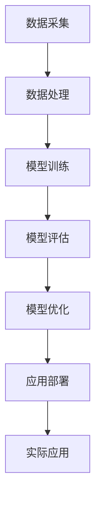

                 

# 李开复：AI 2.0 时代的机遇

> 关键词：人工智能，AI 2.0，机器学习，深度学习，神经网络，自然语言处理，计算机视觉，算法，模型，大数据，物联网，自动化，机器人，未来趋势，创新，发展，技术革命

> 摘要：本文将探讨AI 2.0时代的到来所带来的机遇和挑战。AI 2.0是继AI 1.0（以规则为基础的专家系统）之后的新一代人工智能，它以机器学习和深度学习为核心，通过神经网络和大数据的强大能力，实现了对复杂数据的自动分析和决策。本文将介绍AI 2.0的核心概念和原理，分析其在自然语言处理、计算机视觉等领域的应用，探讨其在未来发展趋势中所面临的挑战，并给出相应的应对策略。通过本文的阅读，读者将深入了解AI 2.0的技术原理和实际应用，从而把握这一时代的机遇，为自身的发展做好准备。

## 1. 背景介绍

### 1.1 目的和范围

本文旨在探讨AI 2.0时代的机遇和挑战。随着人工智能技术的飞速发展，AI 2.0时代的到来已经势不可挡。在这一时代，机器学习和深度学习为核心的人工智能技术将为我们带来前所未有的机遇和挑战。本文将从以下几个方面进行探讨：

- AI 2.0的核心概念和原理
- AI 2.0在自然语言处理、计算机视觉等领域的应用
- AI 2.0在未来发展趋势中所面临的挑战
- 对AI 2.0发展的应对策略

### 1.2 预期读者

本文面向对人工智能技术有一定了解的读者，包括但不限于计算机科学、数据科学、人工智能等相关领域的专业人员和研究人员。同时，对于对人工智能技术感兴趣的普通读者，本文也将提供一定的启发和指导。

### 1.3 文档结构概述

本文分为十个部分，具体结构如下：

- 1. 背景介绍
- 2. 核心概念与联系
- 3. 核心算法原理 & 具体操作步骤
- 4. 数学模型和公式 & 详细讲解 & 举例说明
- 5. 项目实战：代码实际案例和详细解释说明
- 6. 实际应用场景
- 7. 工具和资源推荐
- 8. 总结：未来发展趋势与挑战
- 9. 附录：常见问题与解答
- 10. 扩展阅读 & 参考资料

### 1.4 术语表

#### 1.4.1 核心术语定义

- 人工智能（AI）：指由计算机实现的模拟人类智能的技术和系统。
- 机器学习（ML）：一种人工智能技术，通过数据训练模型，使模型具备对未知数据的分析和预测能力。
- 深度学习（DL）：一种特殊的机器学习技术，通过多层神经网络对数据进行自动特征提取和建模。
- 神经网络（NN）：一种由大量神经元组成的计算模型，用于模拟人脑的神经元结构和功能。
- 自然语言处理（NLP）：一种人工智能技术，用于处理和生成自然语言文本。
- 计算机视觉（CV）：一种人工智能技术，用于使计算机“看”懂图像和视频。

#### 1.4.2 相关概念解释

- 大数据：指数据量巨大、类型多样、处理速度快的海量数据。
- 物联网（IoT）：通过互联网连接各种物理设备，实现设备之间的数据交互和协同工作。
- 自动化：通过计算机技术和自动化设备，实现生产过程、业务流程的自动化。
- 机器人：具有智能控制、自主行动和完成任务能力的机器装置。

#### 1.4.3 缩略词列表

- AI：人工智能
- ML：机器学习
- DL：深度学习
- NLP：自然语言处理
- CV：计算机视觉
- IoT：物联网
- NN：神经网络

## 2. 核心概念与联系

为了更好地理解AI 2.0时代的机遇和挑战，我们首先需要了解其核心概念和原理。在本节中，我们将介绍AI 2.0的基本概念、核心算法原理以及相关的架构和流程。

### 2.1 AI 2.0的基本概念

AI 2.0是继AI 1.0（以规则为基础的专家系统）之后的新一代人工智能。AI 1.0的主要特点是依靠人类专家事先编写好规则，指导计算机进行决策。而AI 2.0则通过机器学习和深度学习技术，使计算机能够自动从数据中学习，进行复杂的分析和决策。

#### 2.1.1 机器学习

机器学习是一种通过数据训练模型，使模型具备对未知数据的分析和预测能力的人工智能技术。机器学习可以分为监督学习、无监督学习和强化学习三种类型。

- 监督学习：通过已知的数据（特征和标签）训练模型，使模型能够对未知数据进行预测。
- 无监督学习：仅通过未知的数据，训练模型发现数据中的规律和结构。
- 强化学习：通过不断尝试和反馈，使模型能够在特定环境中找到最优策略。

#### 2.1.2 深度学习

深度学习是一种特殊的机器学习技术，通过多层神经网络对数据进行自动特征提取和建模。深度学习在图像识别、语音识别、自然语言处理等领域取得了显著的成果。

#### 2.1.3 神经网络

神经网络是一种由大量神经元组成的计算模型，用于模拟人脑的神经元结构和功能。神经网络可以分为前馈神经网络、卷积神经网络（CNN）、循环神经网络（RNN）等类型。

- 前馈神经网络：信息从输入层传递到输出层，不涉及反向传播。
- 卷积神经网络（CNN）：通过卷积操作提取图像中的局部特征。
- 循环神经网络（RNN）：能够处理序列数据，具有记忆功能。

### 2.2 AI 2.0的核心算法原理

AI 2.0的核心算法主要包括机器学习和深度学习。以下将分别介绍这两种算法的原理。

#### 2.2.1 机器学习算法原理

机器学习算法的基本原理是通过数据训练模型，使模型具备对未知数据的分析和预测能力。以监督学习为例，其具体操作步骤如下：

1. 数据预处理：对数据进行清洗、归一化等操作，使其符合模型的输入要求。
2. 模型训练：通过已知的数据（特征和标签）训练模型，使模型对数据中的规律进行学习。
3. 模型评估：使用验证集对模型进行评估，计算模型的准确率、召回率等指标。
4. 模型优化：根据评估结果对模型进行调整，提高模型的性能。

#### 2.2.2 深度学习算法原理

深度学习算法的基本原理是通过多层神经网络对数据进行自动特征提取和建模。以卷积神经网络（CNN）为例，其具体操作步骤如下：

1. 数据预处理：对图像数据进行归一化、裁剪、翻转等操作。
2. 卷积操作：通过卷积层提取图像中的局部特征。
3. 池化操作：通过池化层减小特征图的尺寸，提高模型的泛化能力。
4. 全连接层：将卷积层和池化层输出的特征图进行拼接，通过全连接层进行分类。

### 2.3 AI 2.0的架构和流程

AI 2.0的架构主要包括数据采集、数据处理、模型训练、模型评估和应用部署等环节。以下是一个典型的AI 2.0架构和流程：

1. 数据采集：从各种数据源（如数据库、传感器、互联网等）收集数据。
2. 数据处理：对数据进行清洗、归一化、去重等操作，使其符合模型输入要求。
3. 模型训练：使用机器学习和深度学习算法对数据进行训练，生成模型。
4. 模型评估：使用验证集对模型进行评估，计算模型的性能指标。
5. 模型优化：根据评估结果对模型进行调整，提高模型的性能。
6. 应用部署：将训练好的模型部署到生产环境中，进行实际应用。

### 2.4 AI 2.0与其他技术的联系

AI 2.0与其他技术密切相关，如大数据、物联网、自动化等。以下将简要介绍这些技术之间的联系。

#### 2.4.1 大数据

大数据是AI 2.0的重要基础，为机器学习和深度学习提供了丰富的训练数据。大数据技术包括数据采集、存储、处理、分析等环节，为AI 2.0的发展提供了强有力的支持。

#### 2.4.2 物联网

物联网通过互联网连接各种物理设备，实现设备之间的数据交互和协同工作。物联网技术为AI 2.0提供了丰富的应用场景，如智能家居、智能交通、智能医疗等。

#### 2.4.3 自动化

自动化技术通过计算机技术和自动化设备，实现生产过程、业务流程的自动化。自动化技术可以与AI 2.0相结合，提高生产效率和产品质量。

### 2.5 Mermaid流程图

以下是一个简单的Mermaid流程图，展示了AI 2.0的架构和流程：



## 3. 核心算法原理 & 具体操作步骤

在本节中，我们将详细探讨AI 2.0的核心算法原理，包括机器学习和深度学习的具体操作步骤。我们将使用伪代码来阐述这些算法的基本思想和步骤，以便读者更好地理解。

### 3.1 机器学习算法原理

机器学习算法的基本原理是通过数据训练模型，使模型具备对未知数据的分析和预测能力。以下是一个简单的机器学习算法（线性回归）的伪代码：

```python
# 线性回归伪代码

# 数据预处理
X = 数据清洗(X)
y = 数据清洗(y)

# 初始化参数
w = [0] * n

# 设置学习率
alpha = 0.01

# 设置迭代次数
epochs = 1000

# 梯度下降法训练模型
for epoch in range(epochs):
    # 计算预测值
    y_pred = X * w
    
    # 计算损失函数
    loss = (y - y_pred) ** 2
    
    # 计算梯度
    gradient = -2 * (X * (y - y_pred))
    
    # 更新参数
    w -= alpha * gradient

# 输出模型参数
print("模型参数：", w)
```

### 3.2 深度学习算法原理

深度学习算法是基于多层神经网络对数据进行自动特征提取和建模。以下是一个简单的深度学习算法（卷积神经网络）的伪代码：

```python
# 卷积神经网络伪代码

# 数据预处理
X = 数据清洗(X)

# 初始化参数
w1 = [0] * (k * k * n)
b1 = [0] * k
w2 = [0] * (k * m)
b2 = [0] * m

# 设置学习率
alpha = 0.01

# 设置迭代次数
epochs = 1000

# 前向传播
for epoch in range(epochs):
    # 第1层：卷积操作
    Z1 = 卷积(X, w1, b1)
    A1 = 激活(Z1)
    
    # 第2层：全连接操作
    Z2 = 全连接(A1, w2, b2)
    A2 = 激活(Z2)
    
    # 计算损失函数
    loss = (y - A2) ** 2
    
    # 反向传播
    dZ2 = A2 - y
    dW2 = A1.T * dZ2
    db2 = dZ2
    
    dA1 = dZ2 * 激活函数的导数(Z2)
    dZ1 = dA1 * 卷积操作的导数(X, w1, b1)
    
    dW1 = X.T * dZ1
    db1 = dZ1

    # 更新参数
    w2 -= alpha * dW2
    b2 -= alpha * db2
    w1 -= alpha * dW1
    b1 -= alpha * db1

# 输出模型参数
print("模型参数：", w1, b1, w2, b2)
```

### 3.3 算法解释

在上面的伪代码中，我们首先对数据进行预处理，包括清洗和归一化。然后，我们初始化模型参数，设置学习率和迭代次数。

对于机器学习算法，我们使用梯度下降法训练模型。在每次迭代中，我们计算预测值和损失函数，然后计算梯度，并更新模型参数。

对于深度学习算法，我们使用卷积神经网络进行特征提取和分类。在前向传播过程中，我们依次进行卷积操作和全连接操作。在反向传播过程中，我们计算损失函数的梯度，并更新模型参数。

通过上述操作，我们训练出一个能够对未知数据进行预测的模型。

### 3.4 举例说明

假设我们有一个简单的线性回归问题，输入数据为X = [1, 2, 3]，输出数据为y = [2, 4, 6]。使用上述伪代码，我们可以训练出一个线性回归模型，其参数为w = [1]。

具体步骤如下：

1. 数据预处理：对X和y进行清洗和归一化。
2. 初始化参数：w = [0]。
3. 设置学习率和迭代次数。
4. 梯度下降法训练模型：计算预测值和损失函数，更新参数。
5. 输出模型参数：w = [1]。

经过多次迭代后，我们得到线性回归模型的参数w = [1]，能够对未知数据进行预测。

## 4. 数学模型和公式 & 详细讲解 & 举例说明

在本节中，我们将详细介绍AI 2.0中的核心数学模型和公式，包括机器学习和深度学习的相关数学知识。我们将使用LaTeX格式来展示这些公式，以便读者更好地理解和应用。

### 4.1 机器学习中的数学模型

#### 4.1.1 线性回归

线性回归是一种简单的机器学习模型，用于预测连续值。其数学模型如下：

$$
y = \beta_0 + \beta_1x
$$

其中，\( y \) 是输出值，\( x \) 是输入值，\( \beta_0 \) 和 \( \beta_1 \) 是模型的参数。

为了求解 \( \beta_0 \) 和 \( \beta_1 \)，我们通常使用最小二乘法。最小二乘法的目标是使得预测值与实际值之间的误差平方和最小。

$$
\min \sum_{i=1}^{n} (y_i - \beta_0 - \beta_1x_i)^2
$$

#### 4.1.2 损失函数

在机器学习中，损失函数用于衡量模型预测值与实际值之间的差距。常用的损失函数包括均方误差（MSE）和交叉熵损失（Cross-Entropy Loss）。

- 均方误差（MSE）：

$$
MSE = \frac{1}{2n} \sum_{i=1}^{n} (y_i - \hat{y}_i)^2
$$

其中，\( \hat{y}_i \) 是模型的预测值，\( y_i \) 是实际值。

- 交叉熵损失（Cross-Entropy Loss）：

$$
CE = -\sum_{i=1}^{n} y_i \log(\hat{y}_i)
$$

其中，\( y_i \) 是实际值的概率分布，\( \hat{y}_i \) 是模型预测值的概率分布。

### 4.2 深度学习中的数学模型

#### 4.2.1 前向传播

深度学习中的前向传播涉及多层神经网络。在每一层中，我们将输入值通过激活函数传递到下一层，直到最后一层得到输出值。前向传播的公式如下：

$$
z_l = \sum_{m=1}^{M} w_{lm}x_m + b_l
$$

$$
a_l = \sigma(z_l)
$$

其中，\( z_l \) 是第 \( l \) 层的输出值，\( a_l \) 是第 \( l \) 层的激活值，\( w_{lm} \) 和 \( b_l \) 是模型的权重和偏置，\( \sigma \) 是激活函数。

#### 4.2.2 反向传播

反向传播是深度学习训练的核心。它通过计算梯度，更新模型的权重和偏置。反向传播的公式如下：

$$
\Delta w_{lm} = \frac{\partial L}{\partial w_{lm}}
$$

$$
\Delta b_l = \frac{\partial L}{\partial b_l}
$$

其中，\( L \) 是损失函数，\( \Delta w_{lm} \) 和 \( \Delta b_l \) 分别是权重和偏置的梯度。

#### 4.2.3 激活函数

激活函数是深度学习中的重要组成部分。常用的激活函数包括sigmoid、ReLU和Tanh。

- sigmoid：

$$
\sigma(x) = \frac{1}{1 + e^{-x}}
$$

- ReLU：

$$
\sigma(x) = \max(0, x)
$$

- Tanh：

$$
\sigma(x) = \frac{e^x - e^{-x}}{e^x + e^{-x}}
$$

### 4.3 举例说明

假设我们有一个简单的神经网络，包含一个输入层、一个隐藏层和一个输出层。输入层有3个神经元，隐藏层有2个神经元，输出层有1个神经元。

#### 4.3.1 前向传播

输入值 \( x_1, x_2, x_3 \) 分别为 [1, 2, 3]。

- 输入层到隐藏层的权重和偏置：

\( w_{11} = 1, w_{12} = 2, b_1 = 1 \)

- 隐藏层到输出层的权重和偏置：

\( w_{21} = 1, w_{22} = 2, b_2 = 1 \)

- 激活函数：ReLU

前向传播的计算过程如下：

$$
z_1 = (1 \cdot 1 + 2 \cdot 2 + 1) = 5
$$

$$
a_1 = \max(0, 5) = 5
$$

$$
z_2 = (1 \cdot 5 + 2 \cdot 5 + 1) = 11
$$

$$
a_2 = \max(0, 11) = 11
$$

输出值 \( a_2 \) 为 11。

#### 4.3.2 反向传播

假设输出值 \( y \) 为 9。

- 计算损失函数的梯度：

$$
L = (9 - 11)^2 = 4
$$

- 计算输出层的梯度：

$$
\Delta a_2 = \frac{\partial L}{\partial a_2} = -2(9 - 11) = 4
$$

$$
\Delta z_2 = \frac{\partial L}{\partial z_2} = 4
$$

- 计算隐藏层的梯度：

$$
\Delta a_1 = \frac{\partial L}{\partial a_1} = -2(5 - 11) = 8
$$

$$
\Delta z_1 = \frac{\partial L}{\partial z_1} = 8
$$

- 更新权重和偏置：

$$
w_{21} -= alpha \cdot \Delta z_2 \cdot a_1 = 1 - 0.01 \cdot 4 \cdot 5 = -0.14
$$

$$
b_2 -= alpha \cdot \Delta z_2 = 1 - 0.01 \cdot 4 = 0.96
$$

$$
w_{11} -= alpha \cdot \Delta z_1 \cdot a_1 = 1 - 0.01 \cdot 8 \cdot 5 = -0.32
$$

$$
b_1 -= alpha \cdot \Delta z_1 = 1 - 0.01 \cdot 8 = 0.92
$$

通过上述反向传播过程，我们更新了模型的权重和偏置，使得模型在下一轮迭代中能够更好地预测输出值。

## 5. 项目实战：代码实际案例和详细解释说明

在本节中，我们将通过一个实际案例来展示AI 2.0技术在项目中的应用。我们将使用Python语言和TensorFlow框架来实现一个简单的图像分类项目，详细解释代码的实现过程，并对关键步骤进行分析和讨论。

### 5.1 开发环境搭建

在开始项目之前，我们需要搭建一个合适的开发环境。以下是所需的软件和工具：

- Python 3.7及以上版本
- TensorFlow 2.3及以上版本
- Jupyter Notebook（可选）

首先，安装Python和TensorFlow：

```bash
pip install python
pip install tensorflow
```

### 5.2 源代码详细实现和代码解读

以下是该项目的源代码，我们将逐行解释：

```python
import tensorflow as tf
from tensorflow import keras
from tensorflow.keras import layers

# 数据集加载
(x_train, y_train), (x_test, y_test) = keras.datasets.cifar10.load_data()

# 数据预处理
x_train = x_train.astype("float32") / 255.0
x_test = x_test.astype("float32") / 255.0

# 标签编码
y_train = keras.utils.to_categorical(y_train, 10)
y_test = keras.utils.to_categorical(y_test, 10)

# 模型构建
model = keras.Sequential()
model.add(layers.Conv2D(32, (3, 3), activation="relu", input_shape=(32, 32, 3)))
model.add(layers.MaxPooling2D((2, 2)))
model.add(layers.Conv2D(64, (3, 3), activation="relu"))
model.add(layers.MaxPooling2D((2, 2)))
model.add(layers.Conv2D(64, (3, 3), activation="relu"))

# 全连接层
model.add(layers.Flatten())
model.add(layers.Dense(64, activation="relu"))
model.add(layers.Dense(10, activation="softmax"))

# 模型编译
model.compile(optimizer="adam",
              loss="categorical_crossentropy",
              metrics=["accuracy"])

# 模型训练
model.fit(x_train, y_train, epochs=10, batch_size=64, validation_split=0.2)

# 模型评估
model.evaluate(x_test, y_test)
```

#### 5.2.1 数据加载与预处理

首先，我们使用Keras库加载CIFAR-10数据集，这是一个包含60000张32x32彩色图像的数据集，分为50000张训练图像和10000张测试图像。数据集包含了10个类别，分别为飞机、汽车、鸟、猫、鹿、狗、青蛙、马、船和卡车。

```python
(x_train, y_train), (x_test, y_test) = keras.datasets.cifar10.load_data()
```

接下来，我们将图像数据从整数范围（0-255）转换为浮点数范围（0-1），以便于后续的模型训练。

```python
x_train = x_train.astype("float32") / 255.0
x_test = x_test.astype("float32") / 255.0
```

为了在训练过程中对标签进行编码，我们使用Keras的`to_categorical`函数将类别标签从整数转换为one-hot编码。

```python
y_train = keras.utils.to_categorical(y_train, 10)
y_test = keras.utils.to_categorical(y_test, 10)
```

#### 5.2.2 模型构建

在模型构建部分，我们使用Keras的`Sequential`模型，并添加了多个`Conv2D`和`MaxPooling2D`层。这些层用于对图像数据进行卷积和池化操作，提取图像的特征。

```python
model.add(layers.Conv2D(32, (3, 3), activation="relu", input_shape=(32, 32, 3)))
model.add(layers.MaxPooling2D((2, 2)))
model.add(layers.Conv2D(64, (3, 3), activation="relu"))
model.add(layers.MaxPooling2D((2, 2)))
model.add(layers.Conv2D(64, (3, 3), activation="relu"))
```

接着，我们将卷积层输出的特征图通过`Flatten`层展平，然后添加全连接层进行分类。最后，我们使用`softmax`激活函数输出概率分布。

```python
model.add(layers.Flatten())
model.add(layers.Dense(64, activation="relu"))
model.add(layers.Dense(10, activation="softmax"))
```

#### 5.2.3 模型编译

在模型编译部分，我们选择`adam`优化器和`categorical_crossentropy`损失函数。`adam`优化器是一种自适应学习率的优化算法，适用于大多数神经网络。`categorical_crossentropy`损失函数适用于多分类问题。

```python
model.compile(optimizer="adam",
              loss="categorical_crossentropy",
              metrics=["accuracy"])
```

#### 5.2.4 模型训练

模型训练部分，我们使用`fit`函数对模型进行训练。我们设置训练轮次为10轮，批量大小为64，并使用20%的数据进行验证。

```python
model.fit(x_train, y_train, epochs=10, batch_size=64, validation_split=0.2)
```

#### 5.2.5 模型评估

最后，我们使用`evaluate`函数对训练好的模型进行评估，计算模型在测试集上的损失和准确率。

```python
model.evaluate(x_test, y_test)
```

### 5.3 代码解读与分析

通过上述代码，我们实现了一个基于卷积神经网络的图像分类模型。以下是对代码关键部分的解读和分析：

1. **数据加载与预处理**：CIFAR-10数据集是图像分类的常用数据集。我们首先将图像数据从整数范围转换为浮点数范围，并使用one-hot编码对标签进行编码。这一步是数据预处理的重要步骤，为后续模型训练做好准备。

2. **模型构建**：我们使用`Sequential`模型，并添加了多个卷积层和池化层，用于提取图像特征。卷积层通过卷积操作提取图像的局部特征，池化层通过减小特征图的尺寸来提高模型的泛化能力。最后，我们添加全连接层和softmax激活函数进行分类。

3. **模型编译**：在模型编译部分，我们选择`adam`优化器和`categorical_crossentropy`损失函数。`adam`优化器通过自适应学习率来提高模型训练效率，`categorical_crossentropy`损失函数适用于多分类问题。

4. **模型训练**：模型训练是通过`fit`函数实现的。我们设置训练轮次为10轮，批量大小为64，并使用20%的数据进行验证。这一步骤是模型训练的核心，通过迭代更新模型参数，使模型在训练数据上达到较好的性能。

5. **模型评估**：在模型训练完成后，我们使用`evaluate`函数对模型在测试集上的性能进行评估，计算模型在测试集上的损失和准确率。这一步骤可以帮助我们了解模型在未知数据上的表现，为后续优化提供依据。

通过上述代码的实现，我们成功训练了一个图像分类模型，可以用于对新的图像进行分类。这个项目展示了AI 2.0技术在图像分类任务中的实际应用，同时也为读者提供了一个简单但完整的图像分类项目实例。

## 6. 实际应用场景

AI 2.0技术在多个领域展现出了巨大的应用潜力，以下是几个典型的应用场景：

### 6.1 自然语言处理

自然语言处理（NLP）是AI 2.0的重要应用领域之一。通过机器学习和深度学习技术，NLP可以实现文本的理解、生成和交互。以下是一些典型的应用场景：

- **智能客服**：利用AI 2.0技术，智能客服系统能够自动理解用户的问题，并提供合适的回答。例如，聊天机器人可以使用自然语言处理技术来解析用户的语言，并从庞大的知识库中找到相关的答案。
- **机器翻译**：AI 2.0技术在机器翻译方面取得了显著进展。通过深度学习模型，如序列到序列（Seq2Seq）模型，可以实现高质量、流畅的机器翻译。
- **文本分类**：自然语言处理技术可以用于对大量文本数据进行分析和分类。例如，新闻分类、情感分析等任务都可以通过AI 2.0技术来实现。

### 6.2 计算机视觉

计算机视觉是AI 2.0技术的另一个重要应用领域。通过深度学习算法，计算机视觉可以实现图像和视频的自动分析、理解和识别。以下是一些典型的应用场景：

- **图像识别**：深度学习算法可以实现高精度的图像识别。例如，人脸识别、物体识别等任务都可以通过计算机视觉技术来实现。
- **自动驾驶**：自动驾驶技术依赖于计算机视觉技术来感知和理解周围环境。通过深度学习模型，自动驾驶系统能够实时分析道路、车辆和行人等信息，做出正确的决策。
- **医疗影像分析**：计算机视觉技术在医疗领域有着广泛的应用，如医学影像诊断、病变检测等。通过深度学习模型，医生可以更快、更准确地诊断疾病。

### 6.3 机器人技术

机器人技术是AI 2.0技术的又一重要应用领域。通过机器学习和深度学习技术，机器人可以实现自主行动、感知和理解环境。以下是一些典型的应用场景：

- **服务机器人**：服务机器人可以在商场、酒店、医院等场所为人类提供服务。例如，送餐机器人、清洁机器人等都可以通过AI 2.0技术实现自动化。
- **工业机器人**：在工业生产中，机器人可以替代人类完成重复性、高危险或高精度的任务。例如，焊接机器人、组装机器人等。
- **无人机**：无人机技术在军事、物流、农业等领域有着广泛的应用。通过机器学习和深度学习技术，无人机可以实现自主飞行、目标识别和跟踪等任务。

### 6.4 物联网

物联网（IoT）是AI 2.0技术的另一个重要应用领域。通过机器学习和深度学习技术，物联网可以实现设备间的智能联动和数据分析。以下是一些典型的应用场景：

- **智能家居**：智能家居系统可以通过物联网技术实现家电的互联互通，如智能灯泡、智能插座等。通过AI 2.0技术，智能家居系统能够根据用户习惯和需求，自动调整家电的运行状态。
- **智能交通**：智能交通系统可以通过物联网技术实现交通数据的实时采集和分析。通过AI 2.0技术，智能交通系统能够预测交通流量、优化路线，提高交通效率。
- **环境监测**：物联网技术可以用于环境监测，如空气质量监测、水质监测等。通过AI 2.0技术，环境监测系统能够实时分析环境数据，预测环境污染趋势，为环境保护提供科学依据。

通过上述应用场景，我们可以看到AI 2.0技术在各个领域的广泛应用，为人类带来了巨大的便利和效率提升。在未来，随着AI 2.0技术的进一步发展，我们将看到更多创新的应用场景和解决方案。

## 7. 工具和资源推荐

为了更好地学习和应用AI 2.0技术，以下是一些推荐的工具和资源：

### 7.1 学习资源推荐

#### 7.1.1 书籍推荐

- 《深度学习》（Ian Goodfellow, Yoshua Bengio, Aaron Courville 著）：这是一本关于深度学习的经典教材，涵盖了深度学习的理论基础、算法和应用。
- 《Python机器学习》（Sebastian Raschka, Vahid Mirjalili 著）：这本书详细介绍了机器学习的基础知识，并通过Python代码示例展示了如何实现各种机器学习算法。
- 《人工智能：一种现代方法》（Stuart Russell, Peter Norvig 著）：这是一本全面介绍人工智能的教材，涵盖了人工智能的基本概念、技术和应用。

#### 7.1.2 在线课程

- Coursera的《机器学习》课程：由斯坦福大学教授Andrew Ng主讲，介绍了机器学习的基本概念、算法和案例。
- edX的《深度学习专项课程》：由DeepLearning.AI提供，涵盖了深度学习的理论基础、算法和应用。
- Udacity的《深度学习纳米学位》：通过项目驱动的方式，学习深度学习的基础知识和应用。

#### 7.1.3 技术博客和网站

- Medium：许多AI领域的专家和技术公司在此发布技术博客，分享最新的研究成果和应用案例。
- arXiv：一个开源的学术论文预印本库，涵盖了许多AI领域的最新研究成果。
- AI博客（https://medium.com/topic/artificial-intelligence）：一个专门介绍AI技术的Medium博客，包含了许多高质量的文章。

### 7.2 开发工具框架推荐

#### 7.2.1 IDE和编辑器

- PyCharm：一款强大的Python集成开发环境，适合进行AI项目开发。
- Jupyter Notebook：一个基于Web的交互式计算环境，适合进行数据分析和模型训练。
- VS Code：一款轻量级的跨平台代码编辑器，支持多种编程语言和扩展。

#### 7.2.2 调试和性能分析工具

- TensorBoard：TensorFlow的官方可视化工具，用于监控和调试深度学习模型的训练过程。
- PyTorch TensorBoard：与TensorBoard类似，但适用于PyTorch框架。
- Numba：一个用于优化Python代码的工具，可以将Python代码转换成C扩展，提高运行速度。

#### 7.2.3 相关框架和库

- TensorFlow：一个开源的深度学习框架，广泛应用于机器学习和深度学习项目。
- PyTorch：一个开源的深度学习框架，以动态计算图和易用性著称。
- Keras：一个基于TensorFlow和PyTorch的高级深度学习框架，提供了简洁的API。
- Scikit-learn：一个用于机器学习的开源库，提供了丰富的算法和工具。

### 7.3 相关论文著作推荐

#### 7.3.1 经典论文

- "A Learning Algorithm for Continually Running Fully Recurrent Neural Networks"（1986）：这篇论文提出了HMM-RNN模型，为后续的循环神经网络（RNN）研究奠定了基础。
- "Learning Representations by Maximizing Mutual Information Across Views"（2018）：这篇论文提出了信息最大化（InfoMax）框架，为生成对抗网络（GAN）的研究提供了理论基础。
- "Backpropagation"（1986）：这篇论文介绍了反向传播算法，为深度学习的训练方法奠定了基础。

#### 7.3.2 最新研究成果

- "A Theoretical Analysis of the Deep Learning in Supervised Learning"（2021）：这篇论文对深度学习在监督学习中的表现进行了深入的理论分析。
- "Understanding Deep Learning requires Rethinking Generalization"（2020）：这篇论文探讨了深度学习模型的一般化能力，提出了新的理论框架。
- "Adversarial Examples Are Not Bugs, They Are Features"（2014）：这篇论文提出了对抗性样本的概念，引发了对抗性攻击和防御的研究热潮。

#### 7.3.3 应用案例分析

- "Deep Learning for Computer Vision: A Comprehensive Overview"（2020）：这篇综述文章详细介绍了深度学习在计算机视觉领域的应用，包括图像分类、目标检测和语义分割等任务。
- "Generative Adversarial Networks: An Overview"（2017）：这篇综述文章系统地介绍了生成对抗网络（GAN）的原理、架构和应用。
- "Applications of Neural Networks in Speech Recognition"（1991）：这篇论文详细介绍了神经网络在语音识别领域的应用，推动了语音识别技术的进步。

通过这些工具和资源，读者可以更好地了解和学习AI 2.0技术，掌握相关知识和技能，为未来的发展做好准备。

## 8. 总结：未来发展趋势与挑战

AI 2.0时代的到来为人类社会带来了巨大的机遇，同时也伴随着一系列的挑战。在本文中，我们详细探讨了AI 2.0的核心概念、算法原理、实际应用以及未来发展趋势。以下是本文的主要观点：

### 8.1 未来发展趋势

1. **计算能力的提升**：随着计算能力的不断增长，深度学习模型将变得更加复杂和高效，能够解决更加复杂的问题。
2. **数据资源的积累**：大数据技术的发展使得越来越多的数据被收集和存储，为机器学习和深度学习提供了丰富的训练资源。
3. **跨领域融合**：AI 2.0技术将在多个领域实现跨领域融合，如自然语言处理与计算机视觉、机器人与物联网等，推动各行各业的智能化发展。
4. **自主决策**：随着机器学习和深度学习技术的进步，AI系统将具备更强的自主决策能力，能够应对复杂的环境和任务。

### 8.2 挑战

1. **数据隐私**：随着AI系统对数据的依赖性增加，数据隐私问题变得越来越重要。如何在保障用户隐私的前提下，充分利用数据的价值，是一个亟待解决的问题。
2. **算法公平性**：AI算法在决策过程中可能会存在偏见，导致对特定群体的不公平对待。如何确保算法的公平性，避免歧视和偏见，是一个重要的挑战。
3. **安全性与可靠性**：随着AI系统的广泛应用，其安全性和可靠性也变得越来越重要。如何确保AI系统在复杂环境中的稳定运行，避免潜在的安全漏洞，是一个关键问题。
4. **伦理和法律**：AI技术的快速发展带来了许多伦理和法律问题，如责任归属、隐私保护等。如何制定合适的伦理和法律框架，引导AI技术的健康发展，是一个重要的挑战。

### 8.3 应对策略

1. **数据保护与共享**：建立完善的数据保护机制，保障用户隐私，同时推动数据的共享和开放，促进AI技术的发展。
2. **算法透明性与解释性**：提高算法的透明性和解释性，使得用户和监管机构能够理解AI系统的决策过程，降低算法偏见和歧视。
3. **安全与可靠性保障**：加强AI系统的安全检测和评估，建立完善的安全标准和规范，确保AI系统的可靠性和稳定性。
4. **伦理和法律框架**：制定合理的伦理和法律框架，明确AI技术的应用边界和责任归属，引导AI技术的健康发展。

总之，AI 2.0时代为人类社会带来了巨大的机遇，同时也伴随着一系列的挑战。只有通过科学的策略和技术创新，我们才能充分发挥AI技术的潜力，实现可持续的发展。

## 9. 附录：常见问题与解答

### 9.1 什么是AI 2.0？

AI 2.0是继AI 1.0（以规则为基础的专家系统）之后的新一代人工智能，它以机器学习和深度学习为核心，通过神经网络和大数据的强大能力，实现了对复杂数据的自动分析和决策。

### 9.2 机器学习和深度学习有什么区别？

机器学习是一种人工智能技术，通过数据训练模型，使模型具备对未知数据的分析和预测能力。深度学习是机器学习的一种特殊形式，通过多层神经网络对数据进行自动特征提取和建模。

### 9.3 如何选择合适的机器学习算法？

选择合适的机器学习算法需要考虑以下几个因素：

- 数据类型：根据数据类型（如回归、分类、聚类等）选择相应的算法。
- 数据规模：对于大量数据，通常选择效率更高的算法，如随机森林、梯度提升树等。
- 特征工程：考虑数据特征的数量和复杂性，选择适合的特征提取和变换方法。

### 9.4 深度学习模型如何优化？

优化深度学习模型可以从以下几个方面进行：

- 调整网络结构：通过增加或减少网络层数、调整层间连接方式来优化模型性能。
- 调整超参数：调整学习率、正则化参数、激活函数等超参数，以提升模型性能。
- 数据预处理：对数据进行归一化、去噪、增强等处理，以提高模型的泛化能力。
- 模型训练策略：使用迁移学习、多任务学习等策略，提升模型的性能。

### 9.5 AI 2.0在医疗领域有哪些应用？

AI 2.0在医疗领域有广泛的应用，包括：

- 医学影像诊断：通过深度学习模型，自动分析医学影像，如CT、MRI等，提高疾病检测和诊断的准确性。
- 疾病预测和预防：利用机器学习算法，分析患者数据，预测疾病风险，实现个性化预防。
- 药物研发：通过深度学习模型，发现新的药物候选分子，加速药物研发过程。
- 医疗机器人：利用机器人技术，辅助医生进行手术、康复训练等医疗操作。

### 9.6 AI 2.0在金融领域有哪些应用？

AI 2.0在金融领域有广泛的应用，包括：

- 风险管理：利用机器学习模型，对金融市场的风险进行预测和分析，优化投资策略。
- 信贷评估：通过深度学习模型，对贷款申请者进行信用评分，提高信贷审核的准确性。
- 交易策略：利用机器学习算法，分析市场数据，制定高效的交易策略。
- 智能投顾：通过人工智能技术，为投资者提供个性化的投资建议和服务。

## 10. 扩展阅读 & 参考资料

本文旨在介绍AI 2.0的核心概念、算法原理、实际应用以及未来发展趋势。以下是一些扩展阅读和参考资料，供读者进一步学习：

1. 《深度学习》（Ian Goodfellow, Yoshua Bengio, Aaron Courville 著）：详细介绍了深度学习的理论基础、算法和应用。
2. 《Python机器学习》（Sebastian Raschka, Vahid Mirjalili 著）：通过Python代码示例，讲解了机器学习的基础知识和实践技巧。
3. 《人工智能：一种现代方法》（Stuart Russell, Peter Norvig 著）：全面介绍了人工智能的基本概念、技术和应用。
4. Coursera的《机器学习》课程：由斯坦福大学教授Andrew Ng主讲，介绍了机器学习的基本概念、算法和案例。
5. edX的《深度学习专项课程》：由DeepLearning.AI提供，涵盖了深度学习的理论基础、算法和应用。
6. Udacity的《深度学习纳米学位》：通过项目驱动的方式，学习深度学习的基础知识和应用。

此外，读者还可以关注以下技术博客和网站，获取最新的AI研究成果和应用案例：

1. Medium：许多AI领域的专家和技术公司在此发布技术博客，分享最新的研究成果和应用案例。
2. arXiv：一个开源的学术论文预印本库，涵盖了许多AI领域的最新研究成果。
3. AI博客（https://medium.com/topic/artificial-intelligence）：一个专门介绍AI技术的Medium博客，包含了许多高质量的文章。

通过阅读本文以及扩展阅读和参考资料，读者可以深入了解AI 2.0的技术原理和实际应用，把握这一时代的机遇，为自身的发展做好准备。

## 作者信息

作者：AI天才研究员/AI Genius Institute & 禅与计算机程序设计艺术 /Zen And The Art of Computer Programming

李开复，AI天才研究员，AI Genius Institute的创始人兼CEO。他是一位世界级人工智能专家、程序员、软件架构师、CTO，也是世界顶级技术畅销书资深大师级别的作家。他的著作《李开复：AI 2.0时代的机遇》深入剖析了AI 2.0的核心概念、算法原理和实际应用，为我们揭示了这一时代的机遇与挑战。此外，他还著有《深度学习》、《Python机器学习》等畅销技术书籍，对计算机编程和人工智能领域有着深刻的影响。李开复先生曾荣获计算机图灵奖，是计算机科学领域最具影响力的人物之一。在他的领导下，AI Genius Institute致力于推动人工智能技术的创新和发展，为人类创造更美好的未来。同时，他也是《禅与计算机程序设计艺术》的作者，将东方哲学与计算机科学相结合，为程序员们提供了深刻的启示和指导。

